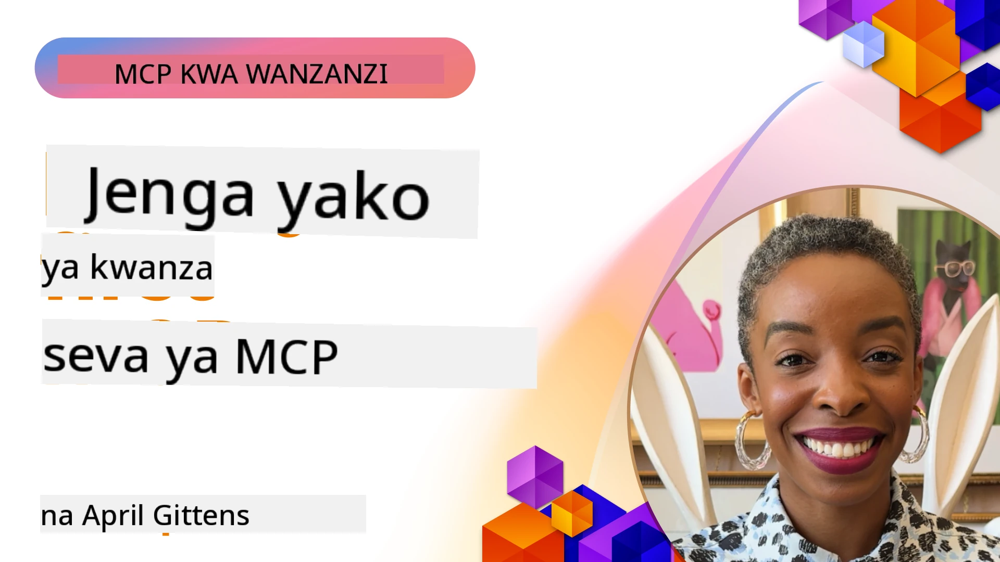

## Kuanzia  

_(Bonyeza picha hapo juu kutazama video ya somo hili)_

Sehemu hii ina masomo kadhaa:

- **1 Server yako ya kwanza**, katika somo hili la kwanza, utajifunza jinsi ya kuunda server yako ya kwanza na kuichunguza kwa kutumia chombo cha mkaguzi, njia muhimu ya kujaribu na kutatua matatizo ya server yako, [kuma somo](01-first-server/README.md)

- **2 Mteja**, katika somo hili, utajifunza jinsi ya kuandika mteja anayeweza kuunganishwa na server yako, [kuma somo](02-client/README.md)

- **3 Mteja na LLM**, njia bora zaidi ya kuandika mteja ni kwa kuongeza LLM ili aweze "kujadiliana" na server yako kuhusu nini cha kufanya, [kuma somo](03-llm-client/README.md)

- **4 Kutumia mode ya GitHub Copilot Agent kwa server MCP katika Visual Studio Code**. Hapa, tunatazama jinsi ya kuendesha Server yetu ya MCP ndani ya Visual Studio Code, [kuma somo](04-vscode/README.md)

- **5 Server ya Usafiri stdio** usafiri wa stdio unashauriwa kuwa njia ya kawaida kwa mawasiliano ya ndani kati ya server na mteja wa MCP, ukitoa mawasiliano salama ya sehemu ndogo zilizoendelea pamoja na kutenganishwa kwa mchakato wa ndani [kuma somo](05-stdio-server/README.md)

- **6 Utoaji wa HTTP na MCP (HTTP Inayoweza Kutiririka)**. Jifunze kuhusu 
usafiri wa mbali wa kawaida katika [MCP Specification 2026-07-28](https://modelcontextprotocol.io/specification/2026-07-28/basic/transports/streamable-http),
pamoja na utekelezaji wa zamani wa kikao uliodumu katika somo.
[kuma somo](06-http-streaming/README.md)

- **7 Kutumia AI Toolkit kwa VSCode** ili kutumia na kujaribu Wateja na Servers zako za MCP [kuma somo](07-aitk/README.md)

- **8 Kupima**. Hapa tutazingatia hasa jinsi tunavyoweza kupima server na mteja wetu kwa njia tofauti, [kuma somo](08-testing/README.md)

- **9 Uwasilishaji**. Sura hii itatazama njia tofauti za kuweka suluhisho zako za MCP, [kuma somo](09-deployment/README.md)

- **10 Matumizi ya server ya juu**. Sura hii inashughulikia matumizi ya juu ya server, [kuma somo](./10-advanced/README.md)

- **11 Uthibitishaji**. Sura hii inashughulikia jinsi ya kuongeza uthibitishaji rahisi, kutoka Basic Auth hadi kutumia JWT na RBAC. Unahimizwa kuanza hapa kisha utaangalia Mada za Juu katika Sura ya 5 na kufanya ukali wa ziada wa usalama kupitia mapendekezo katika Sura ya 2, [kuma somo](./11-simple-auth/README.md)

- **12 Wenyeji wa MCP**. Sanidi na tumia wateja maarufu wa mwenyeji wa MCP ikiwa ni pamoja na Claude Desktop, Cursor, Cline, na Windsurf. Jifunze aina za usafiri na kutatua matatizo, [kuma somo](./12-mcp-hosts/README.md)

- **13 Mkaguzi wa MCP**. Tatuza na jaribu servers zako za MCP kwa njia ya mwingiliano kwa kutumia chombo cha MCP Inspector. Jifunze kutatua matatizo ya zana, rasilimali, na ujumbe wa itifaki, [kuma somo](./13-mcp-inspector/README.md)

- **14 Sampuli**. Jifunze primitive ya zamani ya Sampuli kwa `2025-11-25` na
	 jinsi ya kuhama miundo mipya kwa muunganisho wa moja kwa moja wa mtoa huduma wa LLM. Sampuli ina
 kuvunjwa matumizi katika MCP `2026-07-28`. [kwenda somo](./14-sampling/README.md)

- **15 Programu za MCP**. Jenga Seva za MCP ambazo pia hurudisha maelekezo ya UI, [kwenda somo](./15-mcp-apps/README.md)

Itifaki ya Muktadha wa Mfano (MCP) ni itifaki ya wazi inayobainisha jinsi programu zinavyotoa muktadha kwa LLMs. Fikiria MCP kama bandari ya USB-C kwa programu za AI - inatoa njia iliyobainishwa ya kuunganisha mifano ya AI kwa vyanzo tofauti vya data na zana.

## Malengo ya Kujifunza

Mwisho wa somo hili, utaweza:

- Sakinisha mazingira ya maendeleo kwa MCP kwa C#, Java, Python, TypeScript, na JavaScript
- Jenga na tuma seva za msingi za MCP zenye vipengele maalum (rasilimali, maagizo, na zana)
- Tengeneza programu za mwenyeji zinazounganisha na seva za MCP
- Jaribu na futa kasoro katika utekelezaji wa MCP
- Elewa changamoto za kawaida za usanidi na suluhisho zao
- Unganisha utekelezaji wako wa MCP na huduma maarufu za LLM

## Kusanidi Mazingira Yako ya MCP

Kabla hujaanza kufanya kazi na MCP, ni muhimu kuandaa mazingira yako ya maendeleo na kuelewa mtiririko wa kazi wa msingi. Sehemu hii itakuongoza kupitia hatua za mwanzo za usanidi kuhakikisha mwanzo mzuri na MCP.

### Mahitaji ya Awali

Kabla ya kuingia kwenye maendeleo ya MCP, hakikisha una:

- **Mazingira ya Maendeleo**: Kwa lugha uliyoiamua (C#, Java, Python, TypeScript, au JavaScript)
- **IDE/Mhariri**: Visual Studio, Visual Studio Code, IntelliJ, Eclipse, PyCharm, au mhariri wa kisasa wa msimbo wowote
- **Majumuishe ya Kifurushi**: NuGet, Maven/Gradle, pip, au npm/yarn
- **Vifunguo vya API**: Kwa huduma yoyote ya AI unayopanga kutumia katika programu zako za mwenyeji

### SDK Rasmi

Katika sura zijazo utaona suluhisho zilizojengwa kwa kutumia Python, TypeScript,
Java na .NET. Hapa kuna SDK rasmi.

Msaada wa SDK kwa MCP `2026-07-28` unazinduliwa kiasili na lugha.
Kabla ya kuendesha mfano, angalia toleo la kifurushi chake na taarifa za kuachilia SDK
kwa marekebisho ya itifaki yanayoungwa mkono. Tazama
[orodha rasmi ya SDK](https://modelcontextprotocol.io/docs/sdk):
- [C# SDK](https://github.com/modelcontextprotocol/csharp-sdk) - Inadumishwa kwa ushirikiano na Microsoft
- [Java SDK](https://github.com/modelcontextprotocol/java-sdk) - Inadumishwa kwa ushirikiano na Spring AI
- [TypeScript SDK](https://github.com/modelcontextprotocol/typescript-sdk) - Utekelezaji rasmi wa TypeScript
- [Python SDK](https://github.com/modelcontextprotocol/python-sdk) - Utekelezaji rasmi wa Python (FastMCP)
- [Kotlin SDK](https://github.com/modelcontextprotocol/kotlin-sdk) - Utekelezaji rasmi wa Kotlin
- [Swift SDK](https://github.com/modelcontextprotocol/swift-sdk) - Inadumishwa kwa ushirikiano na Loopwork AI
- [Rust SDK](https://github.com/modelcontextprotocol/rust-sdk) - Utekelezaji rasmi wa Rust
- [Go SDK](https://github.com/modelcontextprotocol/go-sdk) - Utekelezaji rasmi wa Go

## Muhimu wa Kunukuliwa

- Kusanidi mazingira ya maendeleo ya MCP ni rahisi kwa kutumia SDK maalum za lugha
- Kujenga seva za MCP kunahusisha kuanzisha na kusajili zana zenye miundo wazi

- Wateja wa MCP huunganishwa na seva na mifano ili kupata uwezo wa ziada
- Kujaribu na kutatua matatizo ni muhimu kwa utekelezaji wa MCP unaotegemewa
- Chaguzi za uenezi zinaanzia kwenye maendeleo ya ndani hadi suluhisho la msingi la wingu

## Kufanya Mazoezi

Tuna seti ya sampuli inayoongeza mazoezi utakayoyaona katika sura zote katika sehemu hii. Zaidi ya hayo kila sura pia ina mazoezi na kazi zao binafsi

- [Kalkuleta ya Java](./samples/java/calculator/README.md)
- [Kalkuleta ya .NET](../../../03-GettingStarted/samples/csharp)
- [Kalkuleta ya JavaScript](./samples/javascript/README.md)
- [Kalkuleta ya TypeScript](./samples/typescript/README.md)
- [Kalkuleta ya Python](../../../03-GettingStarted/samples/python)

## Rasilimali Zaidi

- [Jenga Maajenti kwa kutumia Itifaki ya Muktadha wa Mfano kwenye Azure](https://learn.microsoft.com/azure/developer/ai/intro-agents-mcp)
- [MCP ya Mbali na Azure Container Apps (Node.js/TypeScript/JavaScript)](https://learn.microsoft.com/samples/azure-samples/mcp-container-ts/mcp-container-ts/)
- [Maajenti wa MCP wa OpenAI wa .NET](https://learn.microsoft.com/samples/azure-samples/openai-mcp-agent-dotnet/openai-mcp-agent-dotnet/)

## Nini Kifuatayo

Anza na somo la kwanza: [Kuumba Server yako ya MCP ya Kwanza](01-first-server/README.md)

Mara baada ya kumaliza moduli hii, endelea kwenda: [Moduli 4: Utekelezaji wa Vitendo](../04-PracticalImplementation/README.md)

---

<!-- CO-OP TRANSLATOR DISCLAIMER START -->
**Kionyozo**:
Hati hii imetafsiriwa kwa kutumia huduma ya tafsiri ya AI [Co-op Translator](https://github.com/Azure/co-op-translator). Ingawa tunajitahidi kupata usahihi, tafadhali fahamu kwamba tafsiri za kiotomatiki zinaweza kuwa na makosa au upungufu wa usahihi. Hati ya asili katika lugha yake halisi inapaswa kuchukuliwa kama chanzo cha mamlaka. Kwa taarifa muhimu, tafsiri ya kitaalamu inayofanywa na binadamu inapendekezwa. Hatutojibu kwa kuelewa vibaya au tafsiri potofu zinazotokea kutokana na matumizi ya tafsiri hii.
<!-- CO-OP TRANSLATOR DISCLAIMER END -->