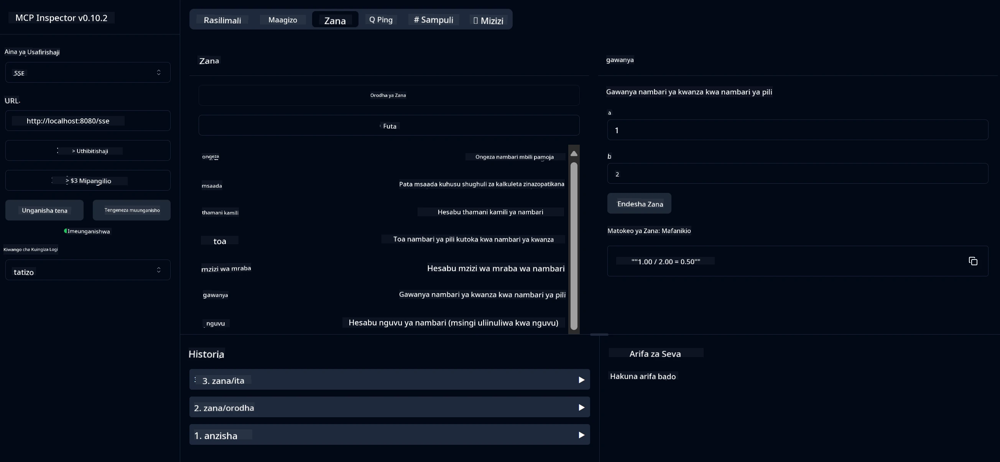

# Huduma ya Calculator ya Msingi ya MCP

> [!NOTE]
> Mfano huu unatumia usafirishaji wa zamani wa HTTP+SSE na unalenga SDK inayolingana
> na MCP `2025-11-25`. Seva mpya za mbali zinapaswa kutumia msaada wa `2026-07-28` Streamable
> HTTP.

Huduma hii hutoa operesheni za calculator za msingi kupitia Itifaki ya Muktadha wa Mfano (MCP) ikitumia Spring Boot na usafirishaji wa WebFlux. Imetengenezwa kama mfano rahisi kwa wanaoanza kujifunza kuhusu utekelezaji wa MCP.

Kwa maelezo zaidi, angalia nyaraka za marejeleo za [MCP Server Boot Starter](https://docs.spring.io/spring-ai/reference/api/mcp/mcp-server-boot-starter-docs.html).

## Muhtasari

Huduma inatoa:
- Msaada kwa SSE (Matukio Yanayotumwa na Seva)
- Usajili wa zana moja kwa moja ukitumia alama ya Spring AI `@Tool`
- Kazi za calculator za msingi:
  - Kuongeza, kutoa, kuzidisha, kugawanya
  - Hisabati ya nguvu na mzizi wa mraba
  - Modulus (salio) na thamani kamili
  - Kazi ya msaada kwa maelezo ya operesheni

## Sifa

Huduma hii ya calculator inatoa uwezo ufuatao:

1. **Operesheni za Hisabati za Msingi**:
   - Kuongeza nambari mbili pamoja
   - Kutoa nambari moja kutoka kwa nyingine
   - Kuzidisha nambari mbili
   - Kugawanya nambari moja kwa nyingine (ikiwa na ukaguzi wa mgawanyo kwa sifuri)

2. **Operesheni Zinazoendelea**:
   - Hisabati ya nguvu (kuinua msingi kwa nguvu)
   - Hisabati ya mzizi wa mraba (ikiwa na ukaguzi wa nambari hasi)
   - Hisabati ya modulus (salio)
   - Hisabati ya thamani kamili

3. **Mfumo wa Msaada**:
   - Kazi ya msaada iliyojengewa kuelezea operesheni zote zilizo available

## Jinsi ya Kutumia Huduma

Huduma inaonyesha maeneo yafuatayo ya API kupitia itifaki ya MCP:

- `add(a, b)`: Ongeza nambari mbili pamoja
- `subtract(a, b)`: Toa nambari ya pili kutoka ya kwanza
- `multiply(a, b)`: Zidisha nambari mbili
- `divide(a, b)`: Gawanya nambari ya kwanza na ya pili (ikiwa na ukaguzi wa sifuri)
- `power(base, exponent)`: Hesabu nguvu ya nambari
- `squareRoot(number)`: Hesabu mzizi wa mraba (ikiwa na ukaguzi wa nambari hasi)
- `modulus(a, b)`: Hesabu salio baada ya kugawanya
- `absolute(number)`: Hesabu thamani kamili
- `help()`: Pata taarifa kuhusu operesheni zinazopatikana

## Mteja wa Jaribio

Mteja rahisi wa jaribio umejumuishwa katika kifurushi `com.microsoft.mcp.sample.client`. Darasa `SampleCalculatorClient` linaonyesha operesheni zinazopatikana za huduma ya calculator.

## Kutumia Mteja wa LangChain4j

Mradi una mfano wa mteja wa LangChain4j katika `com.microsoft.mcp.sample.client.LangChain4jClient` unaoonyesha jinsi ya kuunganisha huduma ya calculator na LangChain4j na modeli za GitHub:

### Mahitaji ya Awali

1. **Kuandaa Tokeni ya GitHub**:
   
   Ili kutumia modeli za AI za GitHub (kama phi-4), unahitaji tokeni binafsi ya ufikiaji ya GitHub:

   a. Nenda kwa mipangilio ya akaunti yako ya GitHub: https://github.com/settings/tokens
   
   b. Bonyeza "Generate new token" → "Generate new token (classic)"
   
   c. Toa jina la kuelezea kwa tokeni yako
   
   d. Chagua maeneo yafuatayo:
      - `repo` (Udhibiti kamili wa hazina za binafsi)
      - `read:org` (Soma usajili wa shirika na timu, soma miradi ya shirika)
      - `gist` (Tengeneza gists)
      - `user:email` (Pata anwani za barua pepe za mtumiaji (kusoma tu))
   
   e. Bonyeza "Generate token" na nakili tokeni yako mpya
   
   f. Iwekee kama mabadiliko ya mazingira/endapo:
      
      Katika Windows:
      ```
      set GITHUB_TOKEN=your-github-token
      ```
      
      Katika macOS/Linux:
      ```bash
      export GITHUB_TOKEN=your-github-token
      ```

   g. Kwa usanidi wa kudumu, ongeza katika mabadiliko yako ya mazingira kupitia mipangilio ya mfumo

2. Ongeza utegemezi wa LangChain4j GitHub kwenye mradi wako (tayari umekuwa katika pom.xml):
   ```xml
   <dependency>
       <groupId>dev.langchain4j</groupId>
       <artifactId>langchain4j-github</artifactId>
       <version>${langchain4j.version}</version>
   </dependency>
   ```

3. Hakikisha seva ya calculator inaendesha kwenye `localhost:8080`

### Kuendesha Mteja wa LangChain4j

Mfano huu unaonyesha:
- Kuunganisha na seva ya calculator MCP kupitia usafirishaji wa SSE
- Kutumia LangChain4j kutengeneza bot ya mazungumzo inayotumia operesheni za calculator
- Kuunganisha na modeli za AI za GitHub (sasa ukitumia mfano wa phi-4)

Mteja hutuma maswali yafuatayo kama sampuli kuonyesha utendakazi:
1. Kuhesabu jumla ya nambari mbili
2. Kupata mzizi wa mraba wa nambari moja
3. Kupata taarifa za msaada kuhusu operesheni zinazopatikana za calculator

Endesha mfano na angalia matokeo ya console kuona jinsi mfano wa AI unavyotumia zana za calculator kujibu maswali.

### Usanidi wa Mfano wa GitHub

Mteja wa LangChain4j umewekwa kuanza kutumia mfano wa phi-4 wa GitHub kwa mipangilio ifuatayo:

```java
ChatLanguageModel model = GitHubChatModel.builder()
    .apiKey(System.getenv("GITHUB_TOKEN"))
    .timeout(Duration.ofSeconds(60))
    .modelName("phi-4")
    .logRequests(true)
    .logResponses(true)
    .build();
```

Ili kutumia modeli tofauti za GitHub, badilisha tu parameter `modelName` kwa mfano mwingine unaoungwa mkono (mfano, "claude-3-haiku-20240307", "llama-3-70b-8192", n.k.).

## Tegemezi

Mradi unahitaji tegemezi kuu zifuatazo:

```xml
<!-- For MCP Server -->
<dependency>
    <groupId>org.springframework.ai</groupId>
    <artifactId>spring-ai-starter-mcp-server-webflux</artifactId>
</dependency>

<!-- For LangChain4j integration -->
<dependency>
    <groupId>dev.langchain4j</groupId>
    <artifactId>langchain4j-mcp</artifactId>
    <version>${langchain4j.version}</version>
</dependency>

<!-- For GitHub models support -->
<dependency>
    <groupId>dev.langchain4j</groupId>
    <artifactId>langchain4j-github</artifactId>
    <version>${langchain4j.version}</version>
</dependency>
```

## Kujenga Mradi

Jenga mradi ukitumia Maven:
```bash
./mvnw clean install -DskipTests
```

## Kuendesha Seva

### Kutumia Java

```bash
java -jar target/calculator-server-0.0.1-SNAPSHOT.jar
```

### Kutumia MCP Inspector

MCP Inspector ni chombo kinachosaidia kuingiliana na huduma za MCP. Ili kutumia na huduma hii ya calculator:

1. **Sakinisha na endesha MCP Inspector** katika dirisha jipya la terminal:
   ```bash
   npx @modelcontextprotocol/inspector
   ```

2. **Fikia UI ya wavuti** kwa kubofya URL inayotolewa na programu (kawaida http://localhost:6274)

3. **Sanidi muunganisho**:
   - Weka aina ya usafirishaji kuwa "SSE"
   - Weka URL ya endpoint ya SSE ya seva yako inayotumia: `http://localhost:8080/sse`
   - Bonyeza "Connect"

4. **Tumia zana**:
   - Bonyeza "List Tools" kuona operesheni za calculator zinazopatikana
   - Chagua zana na bonyeza "Run Tool" kutekeleza operesheni



### Kutumia Docker

Mradi unajumuisha Dockerfile kwa ajili ya usambazaji wa kontena:

1. **Jenga picha ya Docker**:
   ```bash
   docker build -t calculator-mcp-service .
   ```

2. **endesha kontena la Docker**:
   ```bash
   docker run -p 8080:8080 calculator-mcp-service
   ```

Hii itafanya:
- Kujenga picha ya Docker ya hatua nyingi kwa Maven 3.9.9 na Eclipse Temurin 24 JDK
- Kutengeneza picha ya kontena iliyoboreshwa
- Kufungua huduma kwenye porti 8080
- Kuanza huduma ya calculator ya MCP ndani ya kontena

Unaweza kufikia huduma katika `http://localhost:8080` mara kontena linapoanza kuendesha.

## Utatuzi wa Matatizo

### Masuala ya Kawaida na Tokeni ya GitHub


1. **Masuala ya Ruhusa za Tokeni**: Ikiwa unapokea kosa la 403 Forbidden, hakikisha tokeni yako ina ruhusa sahihi kama ilivyoelezwa katika mahitaji ya awali.

2. **Tokeni Haipatikani**: Ikiwa unapokea kosa la "No API key found", hakikisha variable ya mazingira GITHUB_TOKEN imewekwa ipasavyo.

3. **Kizuizi cha Kasi (Rate Limiting)**: API ya GitHub ina vizingiti vya kasi. Ikiwa unakutana na kosa la kizuizi cha kasi (msimbo wa hali 429), subiri dakika chache kabla ya kujaribu tena.

4. **Ukuaji wa Tokeni (Token Expiration)**: Tokeni za GitHub zinaweza kuisha muda wake. Ikiwa unapokea makosa ya uthibitisho baada ya muda, tengeneza tokeni mpya na sasisha variable yako ya mazingira.

Ikiwa unahitaji msaada zaidi, angalia [nyaraka za LangChain4j](https://github.com/langchain4j/langchain4j) au [nyaraka za API ya GitHub](https://docs.github.com/en/rest).

---

<!-- CO-OP TRANSLATOR DISCLAIMER START -->
**Kionyozo**:
Hati hii imetafsiriwa kwa kutumia huduma ya tafsiri ya AI [Co-op Translator](https://github.com/Azure/co-op-translator). Ingawa tunajitahidi kupata usahihi, tafadhali fahamu kwamba tafsiri za kiotomatiki zinaweza kuwa na makosa au upungufu wa usahihi. Hati ya asili katika lugha yake halisi inapaswa kuchukuliwa kama chanzo cha mamlaka. Kwa taarifa muhimu, tafsiri ya kitaalamu inayofanywa na binadamu inapendekezwa. Hatutojibu kwa kuelewa vibaya au tafsiri potofu zinazotokea kutokana na matumizi ya tafsiri hii.
<!-- CO-OP TRANSLATOR DISCLAIMER END -->