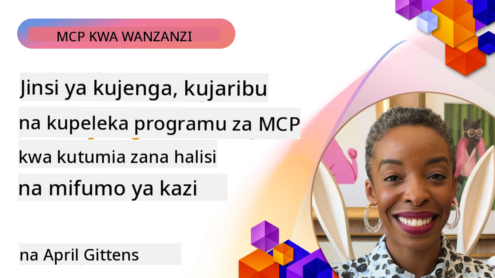
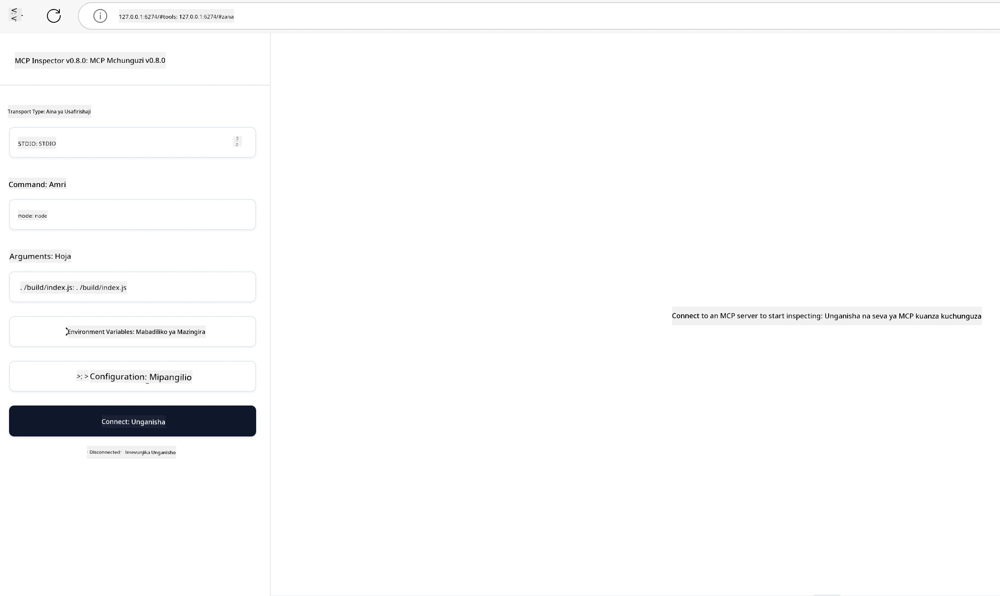

# Utekelezaji wa Kivitendo

[](https://youtu.be/vCN9-mKBDfQ)

_(Bofya picha hapo juu kutazama video ya somo hili)_

Utekelezaji wa kivitendo ndio sehemu ambapo nguvu ya Itifaki ya Muktadha wa Mfano (MCP) inakuwa dhahiri. Ingawa kuelewa nadharia na usanifu wa MCP ni muhimu, thamani halisi huibuka unapoweka dhana hizi katika matumizi kwa kujenga, kupima, na kutoa suluhisho zinazotatua matatizo halisi ya ulimwengu. Sura hii inaunganisha pengo kati ya maarifa ya dhana na maendeleo ya vitendo, ikikuongoza kupitia mchakato wa kuleta programu zinazoendeshwa na MCP kuishi.

Ikiwa unatengeneza wasaidizi wenye akili, kuunganisha AI kwenye mizunguko ya biashara, au kujenga zana maalum za usindikaji data, MCP hutoa msingi unaobadilika. Ubunifu wake usiotegemea lugha maalum na SDK rasmi kwa lugha maarufu za kiprogramu linaifanya ipatikane kwa watengenezaji mbalimbali. Kwa kutumia SDK hizi, unaweza kuunda mfano wa awali haraka, kurekebisha, na kusambaza suluhisho lako kwenye majukwaa na mazingira tofauti.

Katika sehemu zinazofuata, utapata mifano ya vitendo, msimbo wa mfano, na mikakati ya utoaji unaoonyesha jinsi ya kutekeleza MCP katika C#, Java na Spring, TypeScript, JavaScript, na Python. Pia utajifunza jinsi ya kufuatilia makosa na kupima seva zako za MCP, kusimamia API, na kutoa suluhisho kwenye wingu kwa kutumia Azure. Rasilimali hizi za vitendo zimetengenezwa kukuza mafunzo yako na kusaidia kujenga programu za MCP zenye nguvu na tayari kwa uzalishaji kwa ujasiri.

## Muhtasari

Somo hili linaangazia mambo ya kivitendo ya utekelezaji wa MCP kwa lugha nyingi za kiprogramu. Tutachunguza jinsi ya kutumia MCP SDK katika C#, Java na Spring, TypeScript, JavaScript, na Python kujenga programu imara, kufuatilia na kupima seva za MCP, na kuunda rasilimali, maelekezo, na zana zinazoweza kutumika tena.

## Malengo ya Kujifunza

Mwisho wa somo hili, utaweza:

- Kutekeleza suluhisho za MCP kwa kutumia SDK rasmi katika lugha mbalimbali za kiprogramu
- Kufuatilia makosa na kupima seva za MCP kwa mfumo mzuri
- Kuunda na kutumia vipengele vya seva (Rasilimali, Maelekezo, na Zana)
- Kubuni mizunguko madhubuti ya MCP kwa kazi ngumu
- Kuboresha utekelezaji wa MCP kwa ajili ya utendaji na kuaminika

## Rasilimali Rasmi za SDK

Itifaki ya Muktadha wa Mfano inatoa SDK rasmi kwa lugha nyingi (kulingana na [MCP Specification 2025-11-25](https://spec.modelcontextprotocol.io/specification/2025-11-25/)):

- [C# SDK](https://github.com/modelcontextprotocol/csharp-sdk)
- [Java na Spring SDK](https://github.com/modelcontextprotocol/java-sdk) **Kumbuka:** inahitaji tegemezi la [Project Reactor](https://projectreactor.io). (Tazama [majadiliano ya msimamo 246](https://github.com/orgs/modelcontextprotocol/discussions/246).)
- [TypeScript SDK](https://github.com/modelcontextprotocol/typescript-sdk)
- [Python SDK](https://github.com/modelcontextprotocol/python-sdk)
- [Kotlin SDK](https://github.com/modelcontextprotocol/kotlin-sdk)
- [Go SDK](https://github.com/modelcontextprotocol/go-sdk)

## Kufanya kazi na MCP SDKs

Sehemu hii inatoa mifano kivitendo ya utekelezaji wa MCP kwa lugha mbalimbali za kiprogramu. Unaweza kupata msimbo wa mfano katika saraka ya `samples` iliyopangwa kwa lugha.

### Sampuli Zinazopatikana

Hifadhidata inajumuisha [utekelezaji wa mfano](../../../04-PracticalImplementation/samples) katika lugha hizi:

- [C#](./samples/csharp/README.md)
- [Java na Spring](./samples/java/containerapp/README.md)
- [TypeScript](./samples/typescript/README.md)
- [JavaScript](./samples/javascript/README.md)
- [Python](./samples/python/README.md)

Kila mfano unaonyesha dhana kuu za MCP na mifumo ya utekelezaji kwa lugha na mazingira husika.

### Mwongozo wa Kivitendo

Miongozo ya ziada kwa utekelezaji wa MCP kivitendo:

- [Pagination na Makusanyo Makubwa ya Matokeo](./pagination/README.md) - Shughulikia pagination inayotegemea cursor kwa zana, rasilimali, na seti kubwa za data

## Vipengele vya Msingi vya Seva

Seva za MCP zinaweza kutekeleza mchanganyiko wowote wa vipengele hivi:

### Rasilimali

Rasilimali hutoa muktadha na data kwa mtumiaji au mfano wa AI kutumia:

- Makusanyiko ya nyaraka
- Misingi ya maarifa
- Vyanzo vya data vilivyo pangiliwa
- Mifumo ya faili

### Maelekezo

Maelekezo ni ujumbe uliotembelewa na mizunguko ya kazi kwa watumiaji:

- Mifano ya mazungumzo iliyowekwa awali
- Mifumo ya mwingiliano iliyopendekezwa
- Miundo maalum ya mazungumzo

### Zana

Zana ni kazi za mfano wa AI kutekeleza:

- Zana za usindikaji data
- Muunganisho wa API wa nje
- Uwezo wa mahesabu
- Kazi za utafutaji

## Utekelezaji wa Mfano: Utekelezaji wa C#

Hifadhidata rasmi ya SDK ya C# ina utekelezaji wa mfano wa vipengele mbalimbali vya MCP:

- **Mteja wa MCP Msingi**: Mfano rahisi unaoonyesha jinsi ya kuunda mteja wa MCP na kuita zana
- **Seva ya MCP Msingi**: Utekelezaji mdogo wa seva na usajili wa zana za msingi
- **Seva ya MCP ya Juu**: Seva yenye vipengele kamili na usajili wa zana, uthibitishaji, na usimamizi wa makosa
- **Ulinganifu wa ASP.NET**: Mifano inayoonyesha ujumuishaji na ASP.NET Core
- **Mifumo ya Utekelezaji wa Zana**: Mifumo mbalimbali ya kutekeleza zana zenye ngazi tofauti za ugumu

SDK ya MCP ya C# iko kwenye awamu ya maonyesho na API zinaweza kubadilika. Tutaendelea kusasisha blogu hii kadri SDK inavyobadilika.

### Vipengele Muhimu

- [C# MCP Nuget ModelContextProtocol](https://www.nuget.org/packages/ModelContextProtocol)
- Kuunda [Seva yako ya kwanza ya MCP](https://devblogs.microsoft.com/dotnet/build-a-model-context-protocol-mcp-server-in-csharp/).

Kwa sampuli kamili za utekelezaji wa C#, tembelea [hifadhidata rasmi ya sampuli za SDK ya C#](https://github.com/modelcontextprotocol/csharp-sdk)

## Utekelezaji wa Mfano: Utekelezaji wa Java na Spring

SDK ya Java na Spring inatoa chaguzi imara za utekelezaji wa MCP zenye vipengele vya kiwango cha biashara.

### Vipengele Muhimu

- Ujumuishaji wa Spring Framework
- Usalama imara wa aina
- Msaada wa programu ya kurudisha (Reactive)
- Usimamizi kamili wa makosa

Kwa sampuli kamili ya utekelezaji wa Java na Spring, angalia [sampuli ya Java na Spring](samples/java/containerapp/README.md) katika saraka ya sampuli.

## Utekelezaji wa Mfano: Utekelezaji wa JavaScript

SDK ya JavaScript inatoa njia nyepesi na rahisi kwa utekelezaji wa MCP.

### Vipengele Muhimu

- Msaada wa Node.js na kivinjari
- API inayotegemea Promise
- Ujumuishaji rahisi na Express na mifumo mingine
- Msaada wa WebSocket kwa mtiririko (streaming)

Kwa sampuli kamili ya utekelezaji wa JavaScript, angalia [sampuli ya JavaScript](samples/javascript/README.md) katika saraka ya sampuli.

## Utekelezaji wa Mfano: Utekelezaji wa Python

SDK ya Python inatoa njia ya Pythonic kwa utekelezaji wa MCP na ujumuishaji mzuri wa mifumo ya ML.

### Vipengele Muhimu

- Msaada wa async/await kwa asyncio
- Ujumuishaji wa FastAPI
- Usajili rahisi wa zana
- Ujumuishaji wa asili na maktaba maarufu za ML

Kwa sampuli kamili ya utekelezaji wa Python, angalia [sampuli ya Python](samples/python/README.md) katika saraka ya sampuli.

## Usimamizi wa API

Usimamizi wa API wa Azure ni jibu zuri kwa jinsi ya kuzuia seva za MCP. Wazo ni kuweka mfano wa Azure API Management mbele ya seva yako ya MCP na kuruhusu kushughulikia vipengele ambavyo unaweza kutaka kama vile:

- udhibiti wa kiwango cha maombi
- usimamizi wa tokeni
- ufuatiliaji
- usawa wa mzigo
- usalama

### Sampuli ya Azure

Hapa kuna Sampuli ya Azure inayofanya hivyo kabisa, yaani [kuunda Seva ya MCP na kuilinda kwa Azure API Management](https://github.com/Azure-Samples/remote-mcp-apim-functions-python).

Tazama jinsi mtiririko wa idhini unavyofanyika katika picha hii hapa chini:


Katika picha iliyotangulia, mambo yafuatayo hutokea:

- Uthibitishaji/Idhini hutekelezwa kwa kutumia Microsoft Entra.
- Azure API Management hufanya kazi kama lango na hutumia sera kuelekeza na kusimamia trafiki.
- Azure Monitor inarekodi maombi yote kwa uchambuzi zaidi.

#### Mtiririko wa Idhini

Tuchunguze kwa undani zaidi mtiririko wa idhini:


#### Maelezo ya Idhini ya MCP

Jifunze zaidi kuhusu [maelezo ya Idhini ya MCP](https://spec.modelcontextprotocol.io/specification/2025-11-25/basic/authorization/)

## Toa Seva ya MCP ya Mbali kwenye Azure

Tuweke tuchunguze ikiwa tunaweza kutoa mfano tuliotaja awali:

1. Nakili hifadhidata

    ```bash
    git clone https://github.com/Azure-Samples/remote-mcp-apim-functions-python.git
    cd remote-mcp-apim-functions-python
    ```

1. Sajili mtoa huduma wa rasilimali `Microsoft.App`.

   - Ikiwa unatumia Azure CLI, endesha `az provider register --namespace Microsoft.App --wait`.
   - Ikiwa unatumia Azure PowerShell, endesha `Register-AzResourceProvider -ProviderNamespace Microsoft.App`. Kisha endesha `(Get-AzResourceProvider -ProviderNamespace Microsoft.App).RegistrationState` baada ya muda kuangalia kama usajili umefanyika.

1. Endesha amri hii ya [azd](https://aka.ms/azd) ili kuanzisha huduma ya usimamizi wa API, programu ya kazi (kwa msimbo) na rasilimali zingine zote zinazohitajika za Azure

    ```shell
    azd up
    ```

    Amri hii inapaswa kutoa rasilimali zote za wingu kwenye Azure

### Kupima seva yako kwa MCP Inspector

1. Katika **dirisha jipya la terminal**, sakinisha na endesha MCP Inspector

    ```shell
    npx @modelcontextprotocol/inspector
    ```

    Unapaswa kuona user interface kama ifuatavyo:

    

1. Bofya CTRL ili kupakia programu ya mtandao ya MCP Inspector kutoka URL inayotolewa na programu (mfano [http://127.0.0.1:6274/#resources](http://127.0.0.1:6274/#resources))
1. Weka aina ya usafirishaji kuwa `SSE`
1. Weka URL kwenda mwisho wa SSE wa Usimamizi wa API unaoendesha baada ya `azd up` na **Unganisha**:

    ```shell
    https://<apim-servicename-from-azd-output>.azure-api.net/mcp/sse
    ```

1. **Orodhesha Zana**.  Bofya zana na **Endesha Zana**.  

Kama hatua zote zimetekelezwa vizuri, sasa unapaswa kuwa umeunganishwa kwenye seva ya MCP na umeweza kuita zana.

## Seva za MCP kwa Azure

[Remote-mcp-functions](https://github.com/Azure-Samples/remote-mcp-functions-dotnet): Seti hii ya hifadhidata ni templeti ya Anza Haraka kwa kujenga na kutoa seva za MCP za mbali (Model Context Protocol) kwa kutumia Azure Functions kwa Python, C# .NET au Node/TypeScript.

Sampuli hizi zina suluhisho kamili zinazomruhusu mtengenezaji:

- Kujenga na kuendesha kirafiki: Tengeneza na fuatilia seva ya MCP kwenye kompyuta ya eneo la karibu
- Kutoa kwenye Azure: Kwa urahisi toa kwenye wingu kwa amri rahisi ya azd up
- Kuunganisha kutoka kwa wateja: Unganisha kwenye seva ya MCP kutoka kwa wateja mbalimbali ikiwemo hali ya wakala wa Copilot wa VS Code na zana ya MCP Inspector

### Vipengele Muhimu

- Usalama kwa muundo: Seva ya MCP inalindwa kwa kutumia funguo na HTTPS
- Chaguzi za uthibitishaji: Inasaidia OAuth kwa kutumia uthibitishaji uliojengwa ndani na/au Usimamizi wa API
- Utoaji wa mtandao: Inaruhusu utoji wa mtandao kwa kutumia Azure Virtual Networks (VNET)
- Usanifu usio na seva (serverless): Inatumia Azure Functions kwa utekelezaji unaoendeshwa na matukio na unaweza kupanuka
- Maendeleo ya sehemu ya eneo la karibu: Msaada kamili wa maendeleo na ufuatiliaji eneo la karibu
- Utoaji rahisi: Mchakato uliorahisishwa wa utoaji kwenye Azure

Hifadhidata ina faili zote zinazohitajika za usanidi, msimbo chanzo, na maelezo ya miundombinu kupata kwa haraka utekelezaji wa seva ya MCP tayari kwa uzalishaji.

- [Azure Remote MCP Functions Python](https://github.com/Azure-Samples/remote-mcp-functions-python) - Sampuli ya utekelezaji wa MCP kutumia Azure Functions kwa Python

- [Azure Remote MCP Functions .NET](https://github.com/Azure-Samples/remote-mcp-functions-dotnet) - Sampuli ya utekelezaji wa MCP kutumia Azure Functions kwa C# .NET

- [Azure Remote MCP Functions Node/Typescript](https://github.com/Azure-Samples/remote-mcp-functions-typescript) - Sampuli ya utekelezaji wa MCP kutumia Azure Functions kwa Node/TypeScript.

## Muhimu wa Vilevile

- SDK za MCP hutoa zana maalum kwa lugha za kiprogramu kutekeleza suluhisho imara za MCP
- Mchakato wa kufuatilia makosa na kupima ni muhimu kwa programu za MCP zenye kuaminika
- Mifumo wa maelekezo inayoweza kutumika tena huwezesha mwingiliano thabiti wa AI
- Mizunguko iliyobuniwa vyema inaweza kuratibu kazi ngumu kwa kutumia zana nyingi
- Kutekeleza suluhisho za MCP kunahitaji kuzingatia usalama, utendaji, na usimamizi wa makosa

## Zoefu

Buni mizunguko halisi ya MCP inayoshughulikia tatizo halisi katika eneo lako:

1. Tambua zana 3-4 ambazo zitakuwa na manufaa kutatua tatizo hili
2. Unda mchoro wa mizunguko unaoonyesha jinsi zana hizi zinavyoshirikiana
3. Tekeleza toleo la msingi la mojawapo ya zana kwa kutumia lugha unayopendelea
4. Unda mfumo wa maelekezo utakaomsaidia mfano kutumia zana yako kwa ufanisi

## Rasilimali Zaidi

---

## Nini Kinakuja

Ifuatayo: [Mada Zinazidi Juu](../05-AdvancedTopics/README.md)

---

<!-- CO-OP TRANSLATOR DISCLAIMER START -->
**Kengele ya Kukataa**:
Nyaraka hii imetafsiriwa kwa kutumia huduma ya utafsiri wa AI [Co-op Translator](https://github.com/Azure/co-op-translator). Ingawa tunajitahidi kuhakikisha usahihi, tafadhali fahamu kuwa tafsiri za kiotomatiki zinaweza kuwa na makosa au kasoro. Nyaraka asili katika lugha yake ya asili inapaswa kuzingatiwa kama chanzo halali. Kwa taarifa muhimu, tafsiri ya mtaalamu wa binadamu inapendekezwa. Hatubebeki dhamana kwa kutoelewana au tafsiri potofu zitokanazo na matumizi ya tafsiri hii.
<!-- CO-OP TRANSLATOR DISCLAIMER END -->