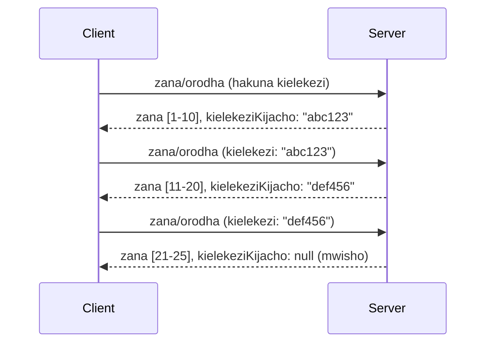

# Utengezaji wa Kurasa na Mikutano Mikubwa ya Matokeo katika MCP

Wakati seva yako ya MCP inashughulikia seti kubwa za data - iwe orodha ya maelfu ya faili, rekodi za hifadhidata, au matokeo ya utafutaji - unahitaji utengezaji wa kurasa kudhibiti kumbukumbu kwa ufanisi na kutoa uzoefu wa mtumiaji wa haraka. Mwongozo huu unashughulikia jinsi ya kutekeleza na kutumia utengezaji wa kurasa katika MCP.

## Kwa Nini Utengezaji wa Kurasa Ni Muhimu

Bila utengezaji wa kurasa, majibu makubwa yanaweza kusababisha:

- **Uchovu wa kumbukumbu** - Kupakia mamilioni ya rekodi mara moja
- **Muda mrefu wa majibu** - Watumiaji husubiri data yote ipakie
- **Makosa ya muda wa kusubiri** - Maombi yanazidi muda wa kusubiri uliowekwa
- **Utendaji mbaya wa AI** - LLMs husumbuliwa na muktadha mkubwa sana

MCP inatumia **utengezaji wa kurasa unaotegemea kidole (cursor)** kwa upitishaji wa kurasa unaoaminika na thabiti kupitia seti za matokeo.

---

## Jinsi Utengezaji wa Kurasa Katika MCP Unavyofanya Kazi

### Dhana ya Kidole (Cursor)

**Kidole** ni mfuatano usioonekana unaoashiria nafasi yako katika seti ya matokeo. Fikiria kama alama ya kurasa katika kitabu kirefu.



### Utengezaji wa Kurasa Katika Mbinu za MCP

Mbinu hizi za MCP zinaunga mkono utengezaji wa kurasa:

| Mbinu | Inarudisha | Msaada wa Kidole |
|--------|---------|----------------|
| `tools/list` | Maelezo ya zana | ✅ |
| `resources/list` | Maelezo ya rasilimali | ✅ |
| `prompts/list` | Maelezo ya viratibu | ✅ |
| `resources/templates/list` | Violezo vya rasilimali | ✅ |

---

## Utekelezaji wa Seva

### Python (FastMCP)

```python
from mcp.server import Server
from mcp.types import Tool, ListToolsResult
import math

app = Server("paginated-server")

# Sampuli kubwa ya data zilizojirudia
ALL_TOOLS = [
    Tool(name=f"tool_{i}", description=f"Tool number {i}", inputSchema={})
    for i in range(100)
]

PAGE_SIZE = 10

@app.list_tools()
async def list_tools(cursor: str | None = None) -> ListToolsResult:
    """List tools with pagination support."""
    
    # Fumbua cursor kupata nambari ya kuanzia
    start_index = 0
    if cursor:
        try:
            start_index = int(cursor)
        except ValueError:
            start_index = 0
    
    # Pata ukurasa wa matokeo
    end_index = min(start_index + PAGE_SIZE, len(ALL_TOOLS))
    page_tools = ALL_TOOLS[start_index:end_index]
    
    # Hesabu cursor inayofuata
    next_cursor = None
    if end_index < len(ALL_TOOLS):
        next_cursor = str(end_index)
    
    return ListToolsResult(
        tools=page_tools,
        nextCursor=next_cursor
    )
```

### TypeScript

```typescript
import { Server } from "@modelcontextprotocol/sdk/server/index.js";
import { ListToolsResultSchema } from "@modelcontextprotocol/sdk/types.js";

const server = new Server({
  name: "paginated-server",
  version: "1.0.0"
});

// Seti kubwa ya data iliyohisiwa
const ALL_TOOLS = Array.from({ length: 100 }, (_, i) => ({
  name: `tool_${i}`,
  description: `Tool number ${i}`,
  inputSchema: { type: "object", properties: {} }
}));

const PAGE_SIZE = 10;

server.setRequestHandler(ListToolsResultSchema, async (request) => {
  // Tafsiri kursor
  let startIndex = 0;
  if (request.params?.cursor) {
    startIndex = parseInt(request.params.cursor, 10) || 0;
  }
  
  // Pata ukurasa wa matokeo
  const endIndex = Math.min(startIndex + PAGE_SIZE, ALL_TOOLS.length);
  const pageTools = ALL_TOOLS.slice(startIndex, endIndex);
  
  // Hesabu kursor inayofuata
  const nextCursor = endIndex < ALL_TOOLS.length ? String(endIndex) : undefined;
  
  return {
    tools: pageTools,
    nextCursor
  };
});
```

### Java (Spring MCP)

```java
@Service
public class PaginatedToolService {
    
    private static final int PAGE_SIZE = 10;
    private final List<Tool> allTools;
    
    public PaginatedToolService() {
        // Anzisha seti kubwa ya data
        this.allTools = IntStream.range(0, 100)
            .mapToObj(i -> new Tool("tool_" + i, "Tool number " + i, Map.of()))
            .collect(Collectors.toList());
    }
    
    @McpMethod("tools/list")
    public ListToolsResult listTools(@Param("cursor") String cursor) {
        // Tafsiri kielekezi
        int startIndex = 0;
        if (cursor != null && !cursor.isEmpty()) {
            try {
                startIndex = Integer.parseInt(cursor);
            } catch (NumberFormatException e) {
                startIndex = 0;
            }
        }
        
        // Pata ukurasa wa matokeo
        int endIndex = Math.min(startIndex + PAGE_SIZE, allTools.size());
        List<Tool> pageTools = allTools.subList(startIndex, endIndex);
        
        // Hesabu kielekezi kinachofuata
        String nextCursor = endIndex < allTools.size() ? String.valueOf(endIndex) : null;
        
        return new ListToolsResult(pageTools, nextCursor);
    }
}
```

---

## Utekelezaji wa Mteja

### Mteja wa Python

```python
from mcp import ClientSession

async def get_all_tools(session: ClientSession) -> list:
    """Fetch all tools using pagination."""
    all_tools = []
    cursor = None
    
    while True:
        result = await session.list_tools(cursor=cursor)
        all_tools.extend(result.tools)
        
        if result.nextCursor is None:
            break
        cursor = result.nextCursor
    
    return all_tools

# Matumizi
async with client_session as session:
    tools = await get_all_tools(session)
    print(f"Found {len(tools)} tools")
```

### Mteja wa TypeScript

```typescript
import { Client } from "@modelcontextprotocol/sdk/client/index.js";

async function getAllTools(client: Client): Promise<Tool[]> {
  const allTools: Tool[] = [];
  let cursor: string | undefined = undefined;
  
  do {
    const result = await client.listTools({ cursor });
    allTools.push(...result.tools);
    cursor = result.nextCursor;
  } while (cursor);
  
  return allTools;
}

// Matumizi
const tools = await getAllTools(client);
console.log(`Found ${tools.length} tools`);
```

### Mfumo wa Kupakia Taratibu (Lazy Loading)

Kwa seti kubwa sana za data, pakia kurasa kwa mahitaji:

```python
class PaginatedToolIterator:
    """Lazily iterate through paginated tools."""
    
    def __init__(self, session: ClientSession):
        self.session = session
        self.cursor = None
        self.buffer = []
        self.exhausted = False
    
    async def __anext__(self):
        # Rudisha kutoka buffer ikiwa inapatikana
        if self.buffer:
            return self.buffer.pop(0)
        
        # Angalia kama tumemaliza kurasa zote
        if self.exhausted:
            raise StopAsyncIteration
        
        # Pata ukurasa unaofuata
        result = await self.session.list_tools(cursor=self.cursor)
        self.buffer = list(result.tools)
        self.cursor = result.nextCursor
        
        if self.cursor is None:
            self.exhausted = True
        
        if not self.buffer:
            raise StopAsyncIteration
        
        return self.buffer.pop(0)
    
    def __aiter__(self):
        return self

# Matumizi - ufanisi wa kumbukumbu kwa seti kubwa za data
async for tool in PaginatedToolIterator(session):
    process_tool(tool)
```

---

## Utengezaji wa Kurasa kwa Rasilimali

Rasilimali mara nyingi zinahitaji utengezaji wa kurasa kwa saraka au seti kubwa za data:

```python
from mcp.server import Server
from mcp.types import Resource, ListResourcesResult
import os

app = Server("file-server")

@app.list_resources()
async def list_resources(cursor: str | None = None) -> ListResourcesResult:
    """List files in directory with pagination."""
    
    directory = "/data/files"
    all_files = sorted(os.listdir(directory))
    
    # Tafsiri kielekezi (kiashiria cha faili)
    start_index = int(cursor) if cursor else 0
    page_size = 20
    end_index = min(start_index + page_size, len(all_files))
    
    # Unda orodha ya rasilimali kwa ukurasa huu
    resources = []
    for filename in all_files[start_index:end_index]:
        filepath = os.path.join(directory, filename)
        resources.append(Resource(
            uri=f"file://{filepath}",
            name=filename,
            mimeType="application/octet-stream"
        ))
    
    # Hesabu kielekezi kinachofuata
    next_cursor = str(end_index) if end_index < len(all_files) else None
    
    return ListResourcesResult(
        resources=resources,
        nextCursor=next_cursor
    )
```

---

## Mikakati ya Ubunifu wa Kidole (Cursor)

### Mkakati 1: Kulingana na Faharasa (Rahisi)

```python
# Kielekezi ni tu fahirisi
cursor = "50"  # Anza kwa kipengee cha 50
```

**Faida:** Rahisi, haina hali
**Hasara:** Matokeo yanaweza kubadilika ikiwa vitu vinaongezwa/kutolewa

### Mkakati 2: Kulingana na Kitambulisho (Thabiti)

```python
# Kielekezi ni ID ya mwisho iliyotazamwa
cursor = "item_abc123"  # Anza baada ya kipengee hiki
```

**Faida:** Thabiti hata ikiwa vitu vinabadilika
**Hasara:** Inahitaji vitambulisho vilivyo pangwa

### Mkakati 3: Hali Iliyofichwa (Ngumu)

```python
import base64
import json

def encode_cursor(state: dict) -> str:
    return base64.b64encode(json.dumps(state).encode()).decode()

def decode_cursor(cursor: str) -> dict:
    return json.loads(base64.b64decode(cursor).decode())

# Kursor ina nywanja nyingi za hali
cursor = encode_cursor({
    "offset": 50,
    "filter": "active",
    "sort": "name"
})
```

**Faida:** Inaweza kuficha hali ngumu
**Hasara:** Ngumu zaidi, mfuatano mrefu wa kidole

---

## Misingi Bora

### 1. Chagua Ukubwa wa Kurasa Unaofaa

```python
# Fikiria ukubwa wa data
PAGE_SIZE_SMALL_ITEMS = 100   # Metadata rahisi
PAGE_SIZE_MEDIUM_ITEMS = 20   # Vitu vyenye taarifa zaidi
PAGE_SIZE_LARGE_ITEMS = 5     # Yaliyomo tata
```

### 2. Shughulikia Vidole Visivyo Sahihi kwa Upole

```python
@app.list_tools()
async def list_tools(cursor: str | None = None) -> ListToolsResult:
    try:
        start_index = int(cursor) if cursor else 0
        if start_index < 0 or start_index >= len(ALL_TOOLS):
            start_index = 0  # Weka upya hadi mwanzo
    except (ValueError, TypeError):
        start_index = 0  # Kielekezi batili, anza upya
    # ...
```

### 3. Jumuisha Idadi Jumla (Hiari)

```python
return ListToolsResult(
    tools=page_tools,
    nextCursor=next_cursor,
    # Baadhi ya utekelezaji ni pamoja na jumla kwa maendeleo ya UI
    _meta={"total": len(ALL_TOOLS)}
)
```

### 4. Jaribu Mikataba ya Kiwiko (Edge Cases)

```python
async def test_pagination():
    # Seti tupu ya matokeo
    result = await session.list_tools()
    assert result.tools == []
    assert result.nextCursor is None
    
    # Ukurasa mmoja
    result = await session.list_tools()
    assert len(result.tools) <= PAGE_SIZE
    
    # Kidirisha batili
    result = await session.list_tools(cursor="invalid")
    assert result.tools  # Inapaswa kurudisha ukurasa wa kwanza
```

---

## Makosa ya Kawaida

### ❌ Kurudisha Matokeo Yote Kisha Kutengeza Kurasa Katika Mteja

```python
# MBAYA: Inaleta kila kitu kwenye kumbukumbu
@app.list_tools()
async def list_tools() -> ListToolsResult:
    all_tools = load_all_tools()  # Zana milioni 1!
    return ListToolsResult(tools=all_tools)
```

### ✅ Tengenezaji wa Kurasa Kwenye Chanzo cha Data

```python
# BORA: Inapakia tu kinachohitajika
@app.list_tools()
async def list_tools(cursor: str | None = None) -> ListToolsResult:
    offset = int(cursor) if cursor else 0
    tools = await db.query_tools(offset=offset, limit=PAGE_SIZE)
    return ListToolsResult(tools=tools, nextCursor=...)
```

---

## Nini Kinafuata

- [Moduli 5.14 - Uhandisi wa Muktadha](../../05-AdvancedTopics/mcp-contextengineering/README.md)
- [Moduli 8 - Misingi Bora](../../08-BestPractices/README.md)
- [3.8 - Kupima Seva Yako ya MCP](../../03-GettingStarted/08-testing/README.md)

---

## Rasilimali Zaidi

- [Maelezo ya MCP - Utengezaji wa Kurasa](https://modelcontextprotocol.io/specification/2026-07-28/)
- [Maelezo ya Utengezaji wa Kurasa Unaotegemea Kidole](https://slack.engineering/evolving-api-pagination-at-slack/)
- [Majaribio ya Utengezaji wa Kurasa ya SDK ya Python](https://github.com/modelcontextprotocol/python-sdk/blob/main/tests/client/test_list_methods_cursor.py)

---

<!-- CO-OP TRANSLATOR DISCLAIMER START -->
**Kionyozo**:
Hati hii imetafsiriwa kwa kutumia huduma ya tafsiri ya AI [Co-op Translator](https://github.com/Azure/co-op-translator). Ingawa tunajitahidi kupata usahihi, tafadhali fahamu kwamba tafsiri za kiotomatiki zinaweza kuwa na makosa au upungufu wa usahihi. Hati ya asili katika lugha yake halisi inapaswa kuchukuliwa kama chanzo cha mamlaka. Kwa taarifa muhimu, tafsiri ya kitaalamu inayofanywa na binadamu inapendekezwa. Hatutojibu kwa kuelewa vibaya au tafsiri potofu zinazotokea kutokana na matumizi ya tafsiri hii.
<!-- CO-OP TRANSLATOR DISCLAIMER END -->