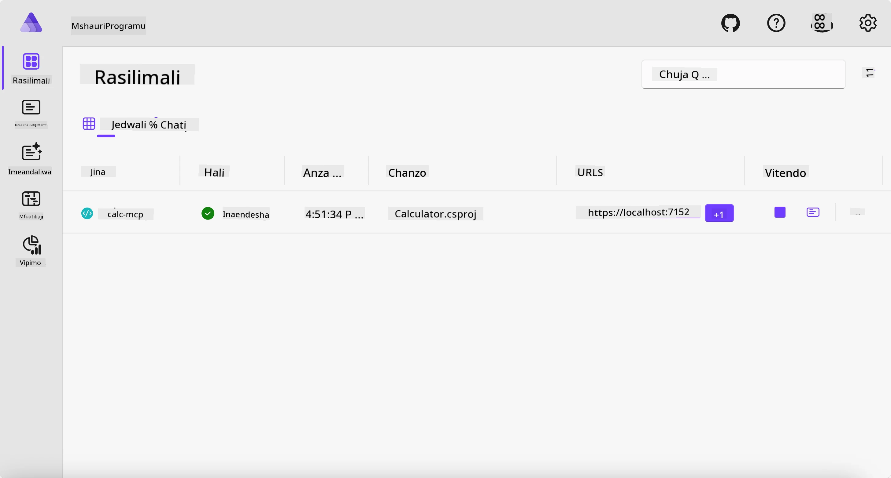
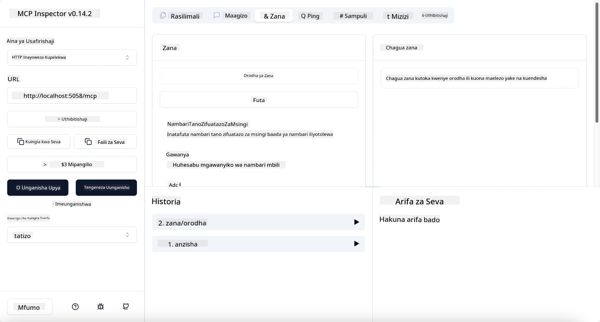
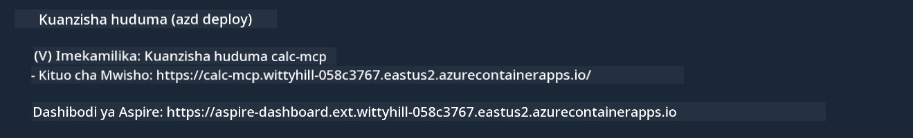

# Mfano

Mfano uliopita unaonyesha jinsi ya kutumia mradi wa ndani wa .NET wenye aina ya `stdio`. Na jinsi ya kuendesha seva kikanda ndani ya kontena. Hii ni suluhisho nzuri katika hali nyingi. Hata hivyo, inaweza kuwa muhimu kuwa seva inaendesha mbali, kama katika mazingira ya wingu. Hapa ndipo aina ya `http` inapoingia.

Kuangalia suluhisho katika folda ya `04-PracticalImplementation`, inaweza kuonekana kuwa ngumu zaidi kuliko ile ya awali. Lakini kwa kweli, si hivyo. Ukitazama kwa makini mradi `src/Calculator`, utaona kwamba ni karibu sawa na msimbo wa mfano uliopita. Tofauti pekee ni kwamba tunatumia maktaba tofauti `ModelContextProtocol.AspNetCore` kushughulikia maombi ya HTTP. Na tunabadilisha njia `IsPrime` kuwa binafsi, ili kuonyesha kuwa unaweza kuwa na njia binafsi ndani ya msimbo wako. Msimbo mwingine uko sawa kama awali.

Miradi mingine ni kutoka [Aspire](https://aspire.dev/get-started/what-is-aspire/). Kuwa na Aspire katika suluhisho kutaongeza uzoefu wa mtengenezaji wakati wa kuendeleza na kupima na kusaidia katika kuonekana kwa matukio. Hailazimiki kuendesha seva, lakini ni mazoea mazuri kuipata katika suluhisho lako.

## Anzisha seva kikanda

1. Kutoka VS Code (ikiwa na ugani wa C# DevKit), nenda chini hadi saraka ya `04-PracticalImplementation/samples/csharp`.
1. Fanya amri ifuatayo kuanzisha seva:

   ```bash
    dotnet watch run --project ./src/AppHost
   ```

1. Wakati kivinjari cha wavuti kinapofungua dashibodi ya Aspire, kumbuka URL ya `http`. Inapaswa kuwa kama `http://localhost:5058/`.

   

## Jaribu Streamable HTTP na MCP Inspector

Ikiwa una Node.js 22.7.5 na zaidi, unaweza kutumia MCP Inspector kujaribu seva yako.

Anzisha seva na endesha amri ifuatayo kwenye terminal:

```bash
npx @modelcontextprotocol/inspector http://localhost:5058
```



- Chagua `Streamable HTTP` kama aina ya Usafirishaji.
- Katika jukwaa la Url, ingiza URL ya seva iliyotajwa awali, kisha ongeza `/mcp`. Inapaswa kuwa `http` (si `https`) kitu kama `http://localhost:5058/mcp`.
- chagua kitufe cha Connect.

Kitu kizuri kuhusu Inspector ni kwamba hutoa uwazi mzuri wa kinachotokea.

- Jaribu kuorodhesha zana zinazopatikana
- Jaribu baadhi yao, zitafanya kazi kama awali.

## Jaribu MCP Server na GitHub Copilot Chat katika VS Code

Ili kutumia usafirishaji wa Streamable HTTP na GitHub Copilot Chat, badilisha usanidi wa seva ya `calc-mcp` iliyoundwa awali kuonekana hivi:

```jsonc
// .vscode/mcp.json
{
  "servers": {
    "calc-mcp": {
      "type": "http",
      "url": "http://localhost:5058/mcp"
    }
  }
}
```

Fanya majaribio:

- Uliza "nambari 3 za prime baada ya 6780". Angalia jinsi Copilot atakavyotumia zana mpya `NextFivePrimeNumbers` na kutoa tu nambari 3 za prime za kwanza.
- Uliza "nambari 7 za prime baada ya 111", kuona kinachotokea.
- Uliza "John ana pipi 24 na anataka kuzipeana kwa watoto wake 3. Kila mtoto ana pipi ngapi?", kuona kinachotokea.

## Weka seva kwenye Azure

Tuweke seva kwenye Azure ili watu wengi zaidi waiweze kutumia.

Kutoka terminal, nenda kwenye folda `04-PracticalImplementation/samples/csharp` na endesha amri ifuatayo:

```bash
azd up
```

Baada ya uwekaji kuisha, utapokea ujumbe kama huu:



Chukua URL na uitumie katika MCP Inspector na GitHub Copilot Chat.

```jsonc
// .vscode/mcp.json
{
  "servers": {
    "calc-mcp": {
      "type": "http",
      "url": "https://calc-mcp.gentleriver-3977fbcf.australiaeast.azurecontainerapps.io/mcp"
    }
  }
}
```

## Nini kinachofuata?

Tumejaribu aina tofauti za usafirishaji na zana za kujaribu. Pia tumeweka seva yako ya MCP kwenye Azure. Lakini je, seva yetu inahitaji kufikia rasilimali binafsi? Kwa mfano, hifadhidata au API binafsi? Katika sura inayofuata, tutaona jinsi tunaweza kuboresha usalama wa seva yetu.

---

<!-- CO-OP TRANSLATOR DISCLAIMER START -->
**Kionyozo**:
Hati hii imetafsiriwa kwa kutumia huduma ya tafsiri ya AI [Co-op Translator](https://github.com/Azure/co-op-translator). Ingawa tunajitahidi kupata usahihi, tafadhali fahamu kwamba tafsiri za kiotomatiki zinaweza kuwa na makosa au upungufu wa usahihi. Hati ya asili katika lugha yake halisi inapaswa kuchukuliwa kama chanzo cha mamlaka. Kwa taarifa muhimu, tafsiri ya kitaalamu inayofanywa na binadamu inapendekezwa. Hatutojibu kwa kuelewa vibaya au tafsiri potofu zinazotokea kutokana na matumizi ya tafsiri hii.
<!-- CO-OP TRANSLATOR DISCLAIMER END -->