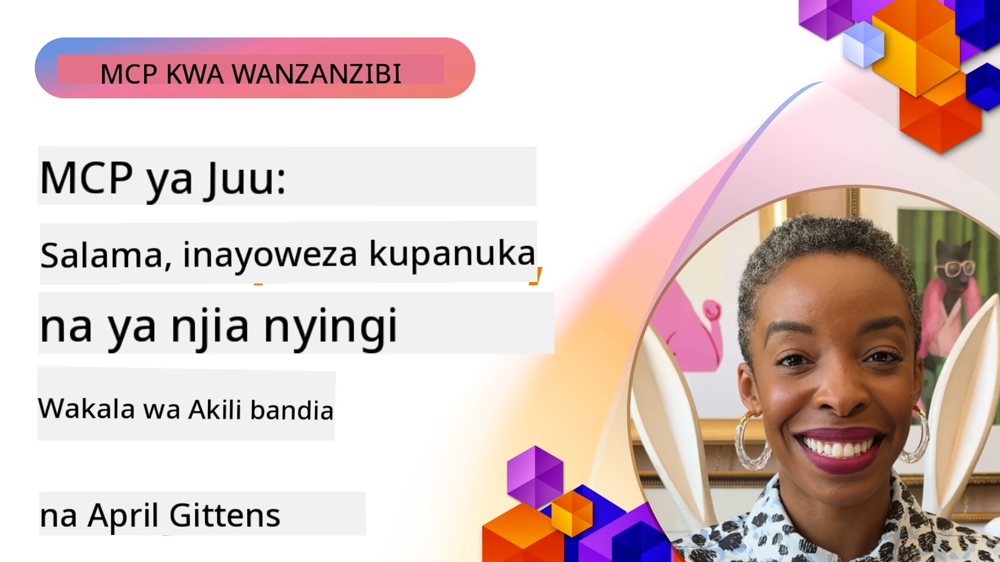

# Mada za Juu katika MCP

_(Bofya picha hapo juu kutazama video ya somo hili)_

Sura hii inashughulikia mfululizo wa mada za juu katika utekelezaji wa Protocol ya Muktadha wa Mfano (MCP), ikiwa ni pamoja na muunganiko wa modal nyingi, upanuzi, mbinu bora za usalama, na muunganiko wa biashara. Mada hizi ni muhimu kwa kujenga programu za MCP zenye nguvu na zinazoweza kutumika uzalishaji zinazoweza kukidhi mahitaji ya mifumo ya kisasa ya AI.

## Muhtasari

Somo hili linachunguza dhana za juu katika utekelezaji wa Protocol ya Muktadha wa Mfano, likilenga muunganiko wa modal nyingi, upanuzi, mbinu bora za usalama, na muunganiko wa biashara. Mada hizi ni muhimu kwa kujenga programu za daraja la uzalishaji za MCP zinazoweza kushughulikia mahitaji tata katika mazingira ya biashara.

> **Kumbuka ya mahitaji ya sasa:** MCP `2026-07-28` inaondoa matumizi ya Mizee na
> primitive Sampling zilizojadiliwa katika masomo 5.4 na 5.6. Pia inahamisha
> kipengele cha majaribio cha Tasks kinachoelezwa katika Vipengele vya Protocol (5.16) kuwa
> upanuzi maalum wa Tasks. Masomo hayo yanaendelea kuwepo kwa utekelezaji wa urithi
> `2025-11-25` na yanajumuisha miongozo ya uhamishaji. Angalia
> [Mabadiliko katika MCP: Mahitaji ya 2026-07-28](../01-CoreConcepts/mcp-2026-07-28.md).

## Malengo ya Kujifunza

Mwisho wa somo hili, utaweza:

- Kutekeleza uwezo wa modal nyingi ndani ya mifumo ya MCP
- Kubuni usanifu wa MCP unaoweza kupanuka kwa hali za mahitaji makubwa
- Kutumia mbinu bora za usalama zinazolingana na kanuni za usalama za MCP
- Kuunganisha MCP na mifumo ya AI ya biashara na mifumo mingine
- Kuboresha utendaji na kuaminika katika mazingira ya uzalishaji

## Masomo na Miradi ya Mfano

| Kiungo | Kichwa | Maelezo |
|------|-------|-------------|
| [5.1 Muungano na Azure](./mcp-integration/README.md) | Kuunganishwa na Azure | Jifunze jinsi ya kuunganisha MCP Server yako kwenye Azure |
| [5.2 Mfano wa modal nyingi](./mcp-multi-modality/README.md) | Sampuli za modal nyingi za MCP | Sampuli za sauti, picha na majibu ya modal nyingi |
| [5.3 Mfano wa OAuth2 wa MCP](../../../05-AdvancedTopics/mcp-oauth2-demo) | Demonstreshn ya MCP OAuth2 | Programu ndogo ya Spring Boot inayoonyesha OAuth2 na MCP, kama seva ya Idhini na Seva ya Rasilimali. Inaonyesha utoaji salama wa tokeni, maeneo yanayolindwa, usambazaji wa Azure Container Apps, na muunganiko wa Usimamizi wa API. |
| [5.4 Muktadha wa Mizizi](./mcp-root-contexts/README.md) | Muktadha wa mizizi | Jifunze primitive ya mizizi ya urithi `2025-11-25` na chaguzi za sasa za uhamishaji (imeondolewa matumizi katika `2026-07-28`) |
| [5.5 Upangiliaji](./mcp-routing/README.md) | Ratiba | Jifunze aina mbalimbali za upangiliaji |
| [5.6 Sampuli](./mcp-sampling/README.md) | Sampuli | Jifunze primitive ya Sampuli ya urithi `2025-11-25` na chaguzi za sasa za uhamishaji (imeondolewa matumizi katika `2026-07-28`) |
| [5.7 Upanuzi](./mcp-scaling/README.md) | Upanuzi | Jifunze kuhusu upanuzi |
| [5.8 Usalama](./mcp-security/README.md) | Usalama | Linda MCP Server yako |
| [5.9 Mfano wa Utafutaji wa Wavuti](./web-search-mcp/README.md) | MCP Utafutaji wa Wavuti | MCP server na mteja wa Python unaoungana na SerpAPI kwa utafutaji wa wavuti wa wakati halisi, habari, bidhaa, na Maswali & Majibu. Unaonyesha muunganisho wa zana nyingi, muunganisho wa API za nje, na usimamizi madhubuti wa makosa. |
| [5.10 Mtiririko wa Wakati Halisi](./mcp-realtimestreaming/README.md) | Utiririko | Mtiririko wa data wa wakati halisi umekuwa muhimu katika ulimwengu wa leo unaotegemea data, ambapo biashara na programu zinahitaji upatikanaji wa haraka wa habari kwa kufanya maamuzi kwa wakati.|
| [5.11 Utafutaji wa Wavuti wa Wakati Halisi](./mcp-realtimesearch/README.md) | Utafutaji wa Wavuti | Utafutaji wa wavuti wa wakati halisi jinsi MCP inavyobadilisha utafutaji wa wavuti wa wakati halisi kwa kutoa njia ya viwango vya usimamizi wa muktadha kati ya mifano ya AI, mashine za utafutaji, na programu.| 
| [5.12 Uthibitishaji wa Entra ID kwa Seva za MCP](./mcp-security-entra/README.md) | Uthibitishaji wa Entra ID | Microsoft Entra ID hutoa suluhisho thabiti la usimamizi wa utambulisho na ufikiaji mtandaoni, kusaidia kuhakikisha kuwa watumiaji na programu zinazoidhinishwa tu ndizo zinaweza kuingiliana na seva yako ya MCP.|
| [5.13 Muungano wa Wakala wa Microsoft Foundry](./mcp-foundry-agent-integration/README.md) | Muungano wa Microsoft Foundry | Jifunze jinsi ya kuunganisha seva za Protocol ya Muktadha wa Mfano na mawakala wa Microsoft Foundry, kuwezesha usimamizi wa zana zenye nguvu na uwezo wa AI wa biashara na muunganisho wa vyanzo vya data vya nje vilivyo na viwango vya juu.|
| [5.14 Uhandisi wa Muktadha](./mcp-contextengineering/README.md) | Uhandisi wa Muktadha | Fursa za baadaye za mbinu za uhandisi wa muktadha kwa seva za MCP, ikiwa ni pamoja na uboreshaji wa muktadha, usimamizi wa muktadha wenye nguvu, na mikakati ya uhandisi wa maelekezo yenye ufanisi ndani ya mifumo ya MCP.|
| [5.15 Usafiri Maalum wa MCP](./mcp-transport/README.md) | Usafiri Maalum | Jifunze jinsi ya kutekeleza mbinu maalum za usafiri kwa hali maalum za mawasiliano ya MCP.|
| [5.16 Uchunguzi wa Vipengele vya Protocol](./mcp-protocol-features/README.md) | Vipengele vya Protocol | Kabla vipengele vya juu vya protocol ikiwa ni pamoja na taarifa za maendeleo, kughairi maombi, templeti za rasilimali, na mifumo ya kushughulikia makosa.|
| [5.17 Mawakala wa Adversarial Multi-Agent](./mcp-adversarial-agents/README.md) | Mawakala wa Kupingana | Tumia mawakala wawili wenye msimamo tofauti, wakishiriki seti moja ya zana za MCP, kugundua ndoto za kipotosho, kuonyesha kesi za pembezoni, na kuzalisha matokeo bora kupitia mijadala ya muundo.|

> **Kumbuka la kihistoria la `2025-11-25`:** marekebisho hayo yalianzisha kipengele cha majaribio cha
> Tasks na kuongezea vipengele kadhaa vya protocol. Katika `2026-07-28`, Tasks yalihamishwa kuwa
> upanuzi rasmi na mizizi ikawa imeondolewa. Usitumie hali ya kipengele cha
> `2025-11-25` kama miongozo ya sasa; angalia
> [rekodi ya mabadiliko ya 2026-07-28](https://modelcontextprotocol.io/specification/2026-07-28/changelog).

## Marejeleo Zaidi

Kwa taarifa zilizosasishwa juu ya mada za juu za MCP, rejea:
- [Nyaraka za MCP](https://modelcontextprotocol.io/)
- [Mahitaji ya MCP (2026-07-28)](https://modelcontextprotocol.io/specification/2026-07-28/)
- [Hifadhidata ya GitHub](https://github.com/modelcontextprotocol)
- [OWASP MCP Top 10](https://microsoft.github.io/mcp-azure-security-guide/mcp/) - Hatari za usalama na mbinu za kuzuia
- [Warsha ya Mikutano ya Usalama ya MCP (Sherpa)](https://azure-samples.github.io/sherpa/) - Mafunzo ya moja kwa moja ya usalama

## Muhimu wa Kumbuka

- Utekelezaji wa MCP wa hali mbalimbali unaongeza uwezo wa AI zaidi ya usindikaji wa maandishi
- Ukuaji ni muhimu kwa usambazaji wa biashara na unaweza kushughulikiwa kupitia upanuzi wa wima na mlalo
- Hatua za kina za usalama hulinda data na kuhakikisha udhibiti sahihi wa upatikanaji
- Uingizaji wa biashara na majukwaa kama Azure OpenAI na Microsoft AI Foundry huongeza uwezo wa MCP
- Utekelezaji wa hali ya juu wa MCP unafaidika kutoka kwa miundo iliyoboresha na usimamizi makini wa rasilimali

## Mazoezi

Tengeneza utekelezaji wa MCP wa daraja la biashara kwa matumizi maalum:

1. Tambua mahitaji ya hali mbalimbali kwa matumizi yako
2. Eleza udhibiti wa usalama unaohitajika kulinda data nyeti
3. Tumia muundo unaoweza kupanuka unaoweza kushughulikia mzigo tofauti
4. Panga maeneo ya kuingiliana na mifumo ya AI ya biashara
5. Andika matatizo yanayoweza kutokea ya utendaji na mikakati ya kuyatatua

## Rasilimali Zaidi

- [Azure OpenAI Documentation](https://learn.microsoft.com/en-us/azure/ai-services/openai/)
- [Microsoft AI Foundry Documentation](https://learn.microsoft.com/en-us/ai-services/)

---

## Nini kinachofuata

Chunguza masomo katika moduli hii kuanzia: [5.1 MCP Integration](./mcp-integration/README.md)

Baada ya kukamilisha moduli hii, endelea kwa: [Module 6: Community Contributions](../06-CommunityContributions/README.md)

---

<!-- CO-OP TRANSLATOR DISCLAIMER START -->
**Kionyozo**:
Hati hii imetafsiriwa kwa kutumia huduma ya tafsiri ya AI [Co-op Translator](https://github.com/Azure/co-op-translator). Ingawa tunajitahidi kupata usahihi, tafadhali fahamu kwamba tafsiri za kiotomatiki zinaweza kuwa na makosa au upungufu wa usahihi. Hati ya asili katika lugha yake halisi inapaswa kuchukuliwa kama chanzo cha mamlaka. Kwa taarifa muhimu, tafsiri ya kitaalamu inayofanywa na binadamu inapendekezwa. Hatutojibu kwa kuelewa vibaya au tafsiri potofu zinazotokea kutokana na matumizi ya tafsiri hii.
<!-- CO-OP TRANSLATOR DISCLAIMER END -->