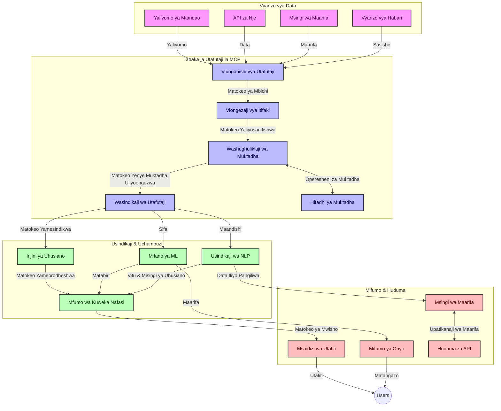
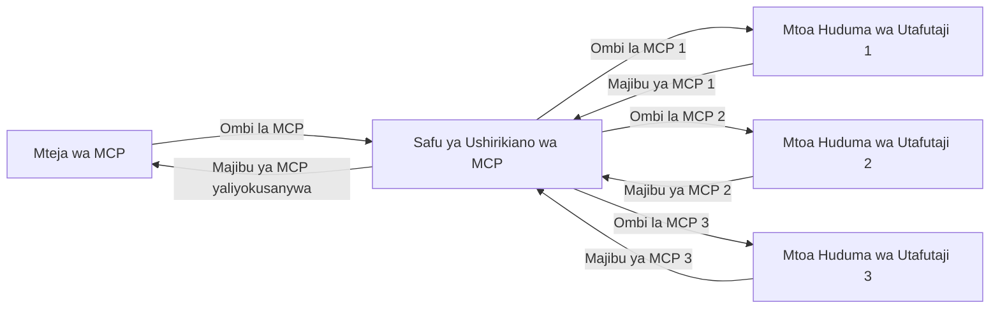
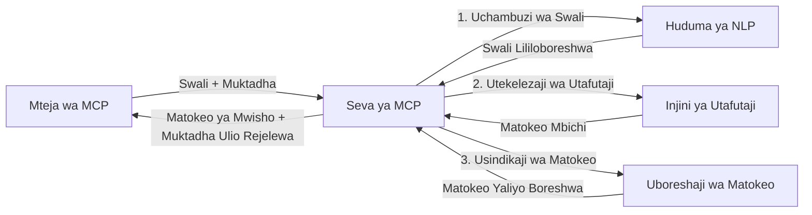

# Itifaki ya Muktadha wa Mfano kwa Utafutaji Mtandaoni kwa Wakati Halisi

## Muhtasari

Utafutaji mtandaoni kwa wakati halisi umekuwa muhimu katika mazingira ya leo yanayoendeshwa na taarifa, ambapo programu zinahitaji ufikiaji wa papo hapo kwa taarifa za kisasa mtandaoni ili kutoa majibu yanayofaa na kwa wakati unaofaa. Itifaki ya Muktadha wa Mfano (MCP) inaonyesha maendeleo makubwa katika kuboresha michakato hii ya utafutaji wa wakati halisi, kuboresha ufanisi wa utafutaji, kudumisha uadilifu wa muktadha, na kuboresha utendaji wa jumla wa mfumo.

Moduli hii inachunguza jinsi MCP inavyobadilisha utafutaji mtandaoni wa wakati halisi kwa kutoa mbinu iliyosanifiwa ya usimamizi wa muktadha kwenye mifano ya AI, mashine za utafutaji, na programu.

### Vitu Utakavyojifunza

Katika mwongozo huu wa kina, utagundua:

- Jinsi MCP inavyounda daraja lisilovunjika kati ya mifano ya AI na uwezo wa utafutaji mtandaoni wa wakati halisi
- Mifumo ya usanifu kwa kutekeleza suluhisho za utafutaji zenye ufanisi na zinazoweza kupanuka kwa MCP
- Mbinu za kuhifadhi muktadha wa utafutaji kwa maswali na maingiliano mengi
- Kutekeleza vitendo vya msimbo kwa Python na JavaScript kwa hali mbalimbali za utafutaji
- Njia za kusawazisha umuhimu, uhalali wa muda, na utendaji katika mifumo ya utafutaji inayoendeshwa na MCP

## Utangulizi kwa Utafutaji Mtandaoni wa Wakati Halisi

Utafutaji mtandaoni wa wakati halisi ni mbinu ya kiteknolojia inayowezesha uchunguzi, usindikaji, na uchambuzi wa taarifa za mtandao huku zikichapishwa au kusasishwa, kuwezesha mifumo kutoa taarifa mpya na zinazofaa kwa ucheleweshaji mdogo kabisa. Tofauti na mifumo ya utafutaji wa jadi inayofanya kazi kwa data zilizo kwenye orodha ambazo zinaweza kuwa za masaa au siku zilizopita, utafutaji wa wakati halisi huchakata data za moja kwa moja kutoka mtandao, hutoa maarifa na taarifa zinazowakilisha hali ya sasa ya maudhui ya mtandao.

### Dhahania Muhimu za Utafutaji Mtandaoni wa Wakati Halisi:

- **Usindikaji wa Maswali Mfululizo**: Maswali ya utafutaji yasindikwa dhidi ya vyanzo vya data vinavyosasishwa kila wakati
- **Kupewa Kipaumbele Taarifa za Hivi Karibuni**: Mifumo imeundwa kupewa kipaumbele taarifa zilizopo hivi karibuni
- **Kusawazisha Umuhimu**: Kudumisha uwiano kati ya umuhimu na uhalali wa muda wa taarifa
- **Usanifu unaoweza Kupanuka**: Mifumo lazima ishughulikie mzigo tofauti wa maswali na kiasi cha data
- **Ufahamu wa Muktadha**: Kudumisha muktadha wa mtumiaji katika mizunguko ya utafutaji ni muhimu kwa matokeo yenye maana
- **Urekebishaji wa Maswali kwa Muktadha**: Kubadilisha maswali kwa ufanisi kulingana na muktadha na matokeo yaliyopita
- **Muungano wa Vyanzo Vingi**: Kuchanganya matokeo kutoka kwa watoa huduma wa utafutaji na vyanzo mbalimbali vya mtandao
- **Ufahamu wa Semantiki**: Kusindika maswali na maudhui kwa msingi wa maana badala ya maneno tu
- **Kuweka Nafasi za Matokeo kwa Wakati Halisi**: Kudumisha mabadiliko ya nafasi za matokeo huku taarifa mpya zinapopatikana

### Itifaki ya Muktadha wa Mfano na Utafutaji Mtandaoni wa Wakati Halisi

Itifaki ya Muktadha wa Mfano (MCP) inashughulikia changamoto kadhaa muhimu katika mazingira ya utafutaji mtandaoni wa wakati halisi:

1. **Uhifadhi wa Muktadha wa Utafutaji**: MCP huwekeza viwango jinsi muktadha unavyodumishwa kati ya vipengele vya utafutaji vilivyoenea, kuhakikisha mifano ya AI na vituo vya usindikaji vina ufikiaji wa historia sahihi ya maswali na mapendeleo ya mtumiaji.

2. **Usimamizi Wa Maswali Mwenye Ufanisi**: Kwa kutoa mbinu za muundo wa uhamishaji muktadha, MCP hupunguza mzigo wa kurudia muktadha katika kila mzunguko wa utafutaji.

3. **Uendeshaji Pamoja**: MCP huunda lugha ya pamoja ya kushirikiana muktadha kati ya teknolojia tofauti za utafutaji na mifano ya AI, kuwezesha usanifu unaobadilika na unaoweza kuongezwa vipengele.

4. **Muktadha ulioboreshwa kwa Utafutaji**: Maendeleo ya MCP yanaweza kutilia mkazo vipengele vya muktadha vinavyohusiana zaidi kwa utafutaji wenye ufanisi, kuboresha utendaji na usahihi.

5. **Usindikaji wa Utafutaji unaojibadilisha**: Kwa usimamizi mzuri wa muktadha kupitia MCP, mifumo ya utafutaji inaweza kubadilisha usindikaji kulingana na mahitaji yanayobadilika ya mtumiaji na mazingira ya taarifa.

Katika programu za kisasa kuanzia ukusanyaji habari za habari hadi wasaidizi wa utafiti, muunganiko wa MCP na teknolojia za utafutaji mtandaoni huwezesha utafutaji wenye akili zaidi, unaojua muktadha, ambao unaweza kutoa matokeo yanayozidi kuwa muhimu kadri maingiliano ya mtumiaji yanavyoendelea.

## Malengo ya Kujifunza

Mwisho wa somo hili, utaweza:

- Kuelewa misingi ya utafutaji mtandaoni kwa wakati halisi na changamoto zake katika programu za kisasa
- Kueleza jinsi Itifaki ya Muktadha wa Mfano (MCP) inavyoboreshwa uwezo wa utafutaji mtandaoni wa wakati halisi
- Kutekeleza suluhisho za utafutaji zenye msingi wa MCP kwa kutumia mifumo maarufu na API
- Kubuni na kupeleka usanifu wa utafutaji unaoweza kupanuka na utendaji wa juu kwa MCP
- Kutumia dhahania za MCP katika matumizi mbalimbali ikiwa ni pamoja na utafutaji wa semantiki, msaada wa utafiti, na kuvinjari kwa msaada wa AI
- Kutathmini mwelekeo unaojitokeza na uvumbuzi wa baadaye katika teknolojia za utafutaji zenye msingi wa MCP
- Kuendeleza mifumo ya utafutaji inayojua muktadha inayojifunza kutoka kwa maingiliano ya watumiaji
- Kuunganisha uwezo wa utafutaji mtandaoni katika wasaidizi wa AI kwa kutumia itifaki sanifu za MCP
- Kuunda mistari ya utafutaji yenye hatua nyingi inayoboresha matokeo kidogo kidogo kulingana na muktadha
- Kuboresha utendaji wa utafutaji huku ukidumisha ufahamu wa kina wa muktadha

### Ufafanuzi na Umuhimu

Utafutaji mtandaoni wa wakati halisi unahusisha uchunguzi endelevu, uvutaji, na utoaji wa taarifa za mtandaoni kwa ucheleweshaji mdogo kabisa. Tofauti na mashine za utafutaji wa jadi ambazo hupitia na kuweka orodha mtandao mara kwa mara, utafutaji wa wakati halisi unalenga kutoa taarifa punde inapotokea, kuwezesha ufikiaji wa papo hapo wa maudhui ya hivi sasa zaidi.

Sifa kuu za utafutaji mtandaoni wa wakati halisi ni pamoja na:

- **Upya**: Kutoa kipaumbele maudhui na masasisho ya hivi karibuni
- **Usindikaji Endelevu**: Kuangalia mara kwa mara kwa taarifa mpya
- **Urekebishaji wa Maswali**: Kuboresha maswali ya utafutaji kwa msingi wa muktadha na maoni
- **Utoaji wa Papo Hapo**: Kutoa matokeo ya utafutaji kwa ucheleweshaji mdogo
- **Uhifadhi wa Muktadha**: Kujenga juu ya maswali yaliyopita ili kuboresha umuhimu

### Changamoto katika Utafutaji Mtandaoni wa Kawaida

Mbinu za utafutaji mtandaoni za jadi hukumbana na vikwazo vingi wanapotekelezwa katika hali za wakati halisi:

1. **Mgawanyiko wa Muktadha**: Ugumu katika kudumisha muktadha wa utafutaji kati ya maswali mengi
2. **Upya wa Taarifa**: Changamoto katika kupata na kuweka kipaumbele taarifa za hivi karibuni zaidi
3. **Ugumu wa Muunganiko**: Matatizo ya uendeshaji pamoja kati ya mifumo ya utafutaji na programu
4. **Matatizo ya Ucheleweshaji**: Kusawazisha utafutaji wa kina na mahitaji ya muda wa majibu
5. **Kurekebisha Umuhimu**: Kuhakikisha usahihi na umuhimu wakati wa kuzingatia upya

## Kuelewa Itifaki ya Muktadha wa Mfano (MCP) kwa Utafutaji

### MCP ni Nini katika Muktadha wa Utafutaji?

Itifaki ya Muktadha wa Mfano (MCP) ni itifaki ya mawasiliano iliyo sanifu kusukuma mwingiliano wenye ufanisi kati ya mifano ya AI na programu. Katika muktadha wa utafutaji mtandaoni wa wakati halisi, MCP hutoa mfumo wa:

- Kuhifadhi muktadha wa utafutaji katika mfululizo wa maswali
- Kusanifisha muundo wa maswali na matokeo ya utafutaji
- Kuboresha uhamishaji wa vigezo na matokeo ya utafutaji
- Kuimarisha mawasiliano kati ya mfano na injini ya utafutaji

### Vipengele Muhimu na Usanifu

Usanifu wa MCP kwa utafutaji mtandaoni wa wakati halisi unajumuisha vipengele muhimu kadhaa:

1. **Wahudumu wa Muktadha wa Maswali**: Kusimamia na kudumisha muktadha wa utafutaji kati ya maswali mengi
2. **Wasindikaji wa Utafutaji**: Kusindika maombi ya utafutaji yanayokuja kwa kutumia mbinu zenye ufahamu wa muktadha
3. **Mbadalishaji wa Itifaki**: Kubadilisha kati ya API tofauti za utafutaji huku ukihifadhi muktadha
4. **Hifadhi ya Muktadha**: Kuhifadhi kwa ufanisi na kupata historia ya utafutaji na mapendeleo
5. **Viunganishaji vya Utafutaji**: Kuungana na injini mbalimbali za utafutaji na API za mtandao



### Jinsi MCP Inavyoboresha Utafutaji Mtandaoni wa Wakati Halisi

MCP inashughulikia changamoto za utafutaji mtandaoni za jadi kupitia:

- **Mfululizo wa Muktadha**: Kudumisha uhusiano kati ya maswali katika kikao chote cha utafutaji
- **Uhamishaji Ulioboreshwa**: Kupunguza kurudia vigezo katika utafutaji kupitia usimamizi wa muktadha wenye akili
- **Vituo Vilivyo Sanifishwa**: Kutoa API zinazoendana kwa vipengele vya utafutaji
- **Kupunguza Ucheleweshaji**: Kupunguza mzigo wa usindikaji kupitia usimamizi wa muktadha wenye ufanisi
- **Kuimarisha Umuhimu**: Kuboresha umuhimu wa utafutaji kwa kuhifadhi nia ya mtumiaji kati ya maswali mengi

## Muunganiko na Utekelezaji

Mifumo ya utafutaji mtandaoni ya wakati halisi inahitaji usanifu makini na utekelezaji kudumisha utendaji na uadilifu wa muktadha. Itifaki ya Muktadha wa Mfano hutoa mbinu sanifu za kuunganisha mifano ya AI na teknolojia za utafutaji, kuwezesha mistari ya utafutaji yenye akili zaidi, inayojua muktadha.

### Muhtasari wa Muunganiko wa MCP Katika Usanifu wa Utafutaji

Kutekeleza MCP katika mazingira ya utafutaji mtandaoni wa wakati halisi kunajumuisha mambo muhimu yafuatayo:

1. **Kuandikisha Muktadha wa Utafutaji**: MCP hutoa mbinu za ufanisi za kufichua taarifa za muktadha ndani ya maombi ya utafutaji, kuhakikisha kuwa muktadha muhimu unafuata swali katika mchakato mzima wa usindikaji. Hii ni pamoja na muundo sanifu wa serialization ulioboreshwa kwa metadata inayohusiana na utafutaji.

2. **Usindikaji wa Utafutaji wenye Hali**: MCP inaruhusu usindikaji wa hali unaojulikana zaidi kwa kudumisha uwakilishi thabiti wa muktadha katika mizunguko ya utafutaji. Hii ni muhimu sana katika mistari ya utafutaji yenye hatua nyingi ambapo kuboresha muktadha huleta matokeo bora.

3. **Kuongeza na Kuboresha Maswali**: Matumizi ya MCP katika mifumo ya utafutaji yanaweza kuwezesha ongezeko na maboresho ya maswali kwa ustadi kulingana na muktadha uliokusanywa, kuruhusu matokeo yanayoongezeka kuwa na umuhimu kadri kikao cha utafutaji kinavyosonga mbele.

4. **Kuweka Matokeo Kwenye Akiba na Kuweka Kipaumbele**: Kwa kusanifu usimamizi wa muktadha, MCP husaidia kusimamia kuweka matokeo kwenye akiba na kuweka kipaumbele, kuruhusu vipengele kubadilika kulingana na muktadha unaobadilika wa utafutaji.

5. **Muungano na Mkusanyiko wa Utafutaji**: MCP huwezesha muungano wa hali ya juu wa utafutaji kwenye nyuma nyingi kwa kutoa uwakilishi wa muundo wa muktadha wa utafutaji, kuruhusu mkusanyiko mzuri zaidi wa matokeo kutoka vyanzo mbalimbali.

Utekelezaji wa MCP katika teknolojia mbalimbali za utafutaji huunda njia moja ya usimamizi wa muktadha, kupunguza haja ya msimbo maalum wa kuingiza na kuimarisha uwezo wa mfumo kudumisha muktadha wenye maana kadri maswali ya utafutaji yanavyobadilika.

### MCP Katika Matumizi Mbalimbali ya Utafutaji Mtandaoni

Mifano hii inafuata maelezo ya sasa ya MCP ambayo yanazingatia itifaki inayotumia JSON-RPC na mbinu tofauti za usafirishaji. Msimbo huu unaonyesha jinsi unavyoweza kutekeleza muunganiko wa utafutaji maalum huku ukidumisha uthabiti kamili wa itifaki ya MCP.


<details>
<summary>Utekelezaji wa Python na API ya Utafutaji ya Jumla</summary>

```python
import asyncio
import json
import aiohttp
from typing import Dict, Any, Optional, List
from contextlib import asynccontextmanager
from collections.abc import AsyncIterator

# Ingiza maktaba za kawaida za MCP
from mcp.client.session import ClientSession
from mcp.client.streamable_http import streamablehttp_client
from mcp.types import TextContent, CreateMessageRequestParams, CreateMessageResult
from mcp.server.fastmcp import FastMCP

# Unda seva ya FastMCP kwa ajili ya utafutaji wa wavuti
search_server = FastMCP("WebSearch")

# Darasa la kushughulikia shughuli za utafutaji wa wavuti
class WebSearchHandler:
    def __init__(self, api_endpoint: str, api_key: str):
        self.api_endpoint = api_endpoint
        self.api_key = api_key
        self.session = None
        
    async def initialize(self):
        """Initialize the HTTP session"""
        self.session = aiohttp.ClientSession(
            headers={"Authorization": f"Bearer {self.api_key}"}
        )
    
    async def close(self):
        """Close the HTTP session"""
        if self.session:
            await self.session.close()
            
    async def perform_search(self, query: str, max_results: int = 5, 
                           include_domains: List[str] = None, 
                           exclude_domains: List[str] = None,
                           time_period: str = "any") -> Dict[str, Any]:
        """Perform web search using the search API"""
        # Tengeneza vigezo vya utafutaji
        search_params = {
            "q": query,
            "limit": max_results,
            "time": time_period
        }
        
        if include_domains:
            search_params["site"] = ",".join(include_domains)
            
        if exclude_domains:
            search_params["exclude_site"] = ",".join(exclude_domains)
        
        # Fanya ombi la utafutaji
        try:
            async with self.session.get(
                self.api_endpoint,
                params=search_params
            ) as response:
                if response.status != 200:
                    error_text = await response.text()
                    raise Exception(f"Search API error: {response.status} - {error_text}")
                
                search_data = await response.json()
                
                # Badilisha majibu maalum ya API kuwa muundo wa kawaida
                results = []
                for item in search_data.get("results", []):
                    results.append({
                        "title": item.get("title", ""),
                        "url": item.get("url", ""),
                        "snippet": item.get("snippet", ""),
                        "date": item.get("published_date", ""),
                        "source": item.get("source", "")
                    })
                
                return {
                    "query": query,
                    "totalResults": len(results),
                    "results": results
                }
        except Exception as e:
            print(f"Search API request error: {e}")
            raise

# Anzisha mshughulikiaji wa utafutaji
search_handler = WebSearchHandler(
    api_endpoint="https://api.search-service.example/search",
    api_key="your-api-key-here"
)

# Weka muda wa maisha kudhibiti mshughulikiaji wa utafutaji
@asyncio.asynccontextmanager
async def app_lifespan(server: FastMCP):
    """Manage application lifecycle"""
    await search_handler.initialize()
    try:
        yield {"search_handler": search_handler}
    finally:
        await search_handler.close()

# Weka muda wa maisha kwa seva
search_server = FastMCP("WebSearch", lifespan=app_lifespan)

# Sajili zana ya utafutaji wa wavuti
@search_server.tool()
async def web_search(query: str, max_results: int = 5, 
                   include_domains: List[str] = None,
                   exclude_domains: List[str] = None,
                   time_period: str = "any") -> Dict[str, Any]:
    """
    Search the web for information
    
    Args:
        query: The search query
        max_results: Maximum number of results to return (default: 5)
        include_domains: List of domains to include in search results
        exclude_domains: List of domains to exclude from search results
        time_period: Time period for results ("day", "week", "month", "any")
        
    Returns:
        Dictionary containing search results
    """
    ctx = search_server.get_context()
    search_handler = ctx.request_context.lifespan_context["search_handler"]
    
    results = await search_handler.perform_search(
        query=query,
        max_results=max_results,
        include_domains=include_domains,
        exclude_domains=exclude_domains,
        time_period=time_period
    )
    
    return results

# Mfano wa matumizi ya mteja
async def client_example():
    # Unganisha na seva ya utafutaji kwa kutumia usafirishaji wa HTTP unaoweza kutiririka
    async with streamablehttp_client("http://localhost:8000/mcp") as (read, write, _):
        async with ClientSession(read, write) as session:
            # Anzisha muunganisho
            await session.initialize()
            
            # Piga simu kwa zana ya utafutaji wa wavuti
            search_results = await session.call_tool(
                "web_search", 
                {
                    "query": "latest developments in AI and Model Context Protocol",
                    "max_results": 5,
                    "time_period": "day",
                    "include_domains": ["github.com", "microsoft.com"]
                }
            )
            
            print(f"Search results: {search_results}")

# Mfano wa utekelezaji wa seva
if __name__ == "__main__":
    # Endesha seva kwa usafirishaji wa HTTP unaoweza kutiririka
    search_server.run(transport="streamable-http")
```
</details> 

<details>
<summary>Utekelezaji wa JavaScript na Utafutaji Unaotumia Kivinjari</summary>


```javascript
// Utekelezaji wa seva ya MCP kwa utafutaji wa wavuti
import { McpServer, ResourceTemplate } from '@modelcontextprotocol/sdk/server/mcp.js';
import { StreamableHTTPServerTransport } from '@modelcontextprotocol/sdk/server/streamableHttp.js';
import { z } from 'zod';

// Tengeneza seva ya MCP kwa utafutaji wa wavuti
const searchServer = new McpServer({
    name: "BrowserSearch",
    description: "A server that provides web search capabilities"
});

// Darasa la huduma ya utafutaji
class SearchService {
    constructor(searchApiUrl, apiKey) {
        this.searchApiUrl = searchApiUrl;
        this.apiKey = apiKey;
    }

    async performSearch(parameters) {
        const {
            query = '',
            maxResults = 5,
            includeDomains = [],
            excludeDomains = [],
            timePeriod = 'any'
        } = parameters;
        
        // Tengeneza URL ya utafutaji na vigezo
        const url = new URL(this.searchApiUrl);
        url.searchParams.append('q', query);
        url.searchParams.append('limit', maxResults);
        url.searchParams.append('time', timePeriod);
        
        if (includeDomains.length > 0) {
            url.searchParams.append('site', includeDomains.join(','));
        }
        
        if (excludeDomains.length > 0) {
            url.searchParams.append('exclude_site', excludeDomains.join(','));
        }
        
        try {
            const response = await fetch(url.toString(), {
                method: 'GET',
                headers: {
                    'Authorization': `Bearer ${this.apiKey}`,
                    'Content-Type': 'application/json'
                }
            });
            
            if (!response.ok) {
                const errorText = await response.text();
                throw new Error(`Search API error: ${response.status} - ${errorText}`);
            }
            
            const searchData = await response.json();
            
            // Badilisha majibu maalum ya API kuwa katika muundo wa kawaida
            const results = searchData.results?.map(item => ({
                title: item.title || '',
                url: item.url || '',
                snippet: item.snippet || '',
                date: item.published_date || '',
                source: item.source || ''
            })) || [];
            
            return {
                query,
                totalResults: results.length,
                results
            };
        } catch (error) {
            console.error('Search API request error:', error);
            throw error;
        }
    }
}

// Anzisha huduma ya utafutaji
const searchService = new SearchService(
    'https://api.search-service.example/search',
    'your-api-key-here'
);

// Weka mtoaji wa muktadha kwa seva
searchServer.setContextProvider(() => {
    return {
        searchService
    };
});

// Sajili chombo cha utafutaji wa wavuti
searchServer.tool({
    name: 'web_search',
    description: 'Search the web for information',
    parameters: {
        type: 'object',
        properties: {
            query: {
                type: 'string',
                description: 'The search query'
            },
            maxResults: {
                type: 'integer',
                description: 'Maximum number of results to return',
                default: 5
            },
            includeDomains: {
                type: 'array',
                items: { type: 'string' },
                description: 'List of domains to include in search results'
            },
            excludeDomains: {
                type: 'array',
                items: { type: 'string' },
                description: 'List of domains to exclude from search results'
            },
            timePeriod: {
                type: 'string',
                description: 'Time period for results',
                enum: ['day', 'week', 'month', 'any'],
                default: 'any'
            }
        },
        required: ['query']
    },
    handler: async (params, context) => {
        const { searchService } = context;
        return await searchService.performSearch(params);
    }
});

// Mfano wa msimbo wa mteja kuungana na seva ya utafutaji
import { Client } from '@modelcontextprotocol/sdk/client/index.js';
import { StreamableHTTPClientTransport } from '@modelcontextprotocol/sdk/client/streamableHttp.js';

async function connectToSearchServer() {
    // Ungana na seva ya utafutaji
    const transport = new StreamableHTTPClientTransport(
        new URL('http://localhost:8000/mcp')
    );
    
    const client = new Client({
        name: 'search-client',
        version: '1.0.0'
    });
    
    await client.connect(transport);
    
    // Tekeleza chombo cha utafutaji
    const searchResults = await client.callTool({
        name: 'web_search',
        arguments: {
            query: 'Model Context Protocol implementation examples',
            maxResults: 10,
            timePeriod: 'week',
            includeDomains: ['github.com', 'docs.microsoft.com']
        }
    });
    
    console.log('Search results:', searchResults);
    
    // Safisha
    await client.disconnect();
}

// Anzisha seva
const transport = new StreamableHTTPServerTransport();
await searchServer.connect(transport);
console.log('Search server running at http://localhost:8000/mcp');

// Katika mchakato tofauti au baada ya seva kuanzishwa
// connectToSearchServer().catch(console.error);
```
</details> 


## Onyo Kuhusu Mifano ya Msimbo

> **Kumbuka Muhimu**: Mifano ya msimbo hapa chini inaonyesha muunganiko wa Itifaki ya Muktadha wa Mfano (MCP) na utendaji wa utafutaji mtandaoni. Ingawa inafuata mifumo na miundo ya SDK rasmi za MCP, imefanywa iwe rahisi kwa madhumuni ya kielimu.
> 
> Mifano hii inaonyesha:
> 
> 1. **Utekelezaji wa Python**: Utekelezaji wa seva ya FastMCP inayotoa chombo cha utafutaji mtandaoni na kuungana na API ya utafutaji ya nje. Mfano huu unaonyesha usimamizi sahihi wa muda wa maisha, usimamizi wa muktadha, na utekelezaji wa zana ukifuata mifumo ya rasmi ya [SDK za Python za MCP](https://github.com/modelcontextprotocol/python-sdk). Seva hutumia usafirishaji wa HTTP wa aina ya Streamable uliopendekezwa ambao umebadilisha usafirishaji wa SSE wa zamani kwa utekelezaji wa bidhaa.
> 
> 2. **Utekelezaji wa JavaScript**: Utekelezaji wa TypeScript/JavaScript ukitumia mfumo wa FastMCP kutoka [SDK za MCP za TypeScript](https://github.com/modelcontextprotocol/typescript-sdk) ili kuunda seva ya utafutaji na ufafanuzi sahihi wa zana na uhusiano wa wateja. Inafuata mifumo ya hivi karibuni inayopendekezwa kwa usimamizi wa kikao na uhifadhi wa muktadha.
> 
> Mifano hii itahitaji usimamizi wa makosa ya ziada, uthibitishaji, na msimbo maalum wa muunganiko wa API kwa ajili ya matumizi ya uzalishaji. Mikoa ya API ya utafutaji iliyopatikana (`https://api.search-service.example/search`) ni vichwa tu na itabidi zibadilishwe na anwani halisi za huduma za utafutaji.
> 
> Kwa maelezo kamili ya utekelezaji na mbinu mpya za hivi karibuni, tafadhali rejelea [maelezo rasmi ya MCP](https://spec.modelcontextprotocol.io/) na nyaraka za SDK.

## Dhahania Muhimu

### Mfumo wa Itifaki ya Muktadha wa Mfano (MCP)

Kwa msingi wake, Itifaki ya Muktadha wa Mfano hutoa njia sanifu kwa mifano ya AI, programu, na huduma kubadilishana muktadha. Katika utafutaji mtandaoni wa wakati halisi, mfumo huu ni muhimu kwa kuunda uzoefu wa utafutaji wa mizunguko mingi yenye mnyororo. Vipengele muhimu ni pamoja na:

1. **Usanifu wa Mteja-Seva**: MCP huanzisha mgawanyo wazi kati ya wateja wa utafutaji (waombaji) na seva za utafutaji (watoaji), kuruhusu mifano inayobadilika ya uwasilishaji.

2. **Mawasiliano ya JSON-RPC**: Itifaki hutumia JSON-RPC kwa kubadilishana ujumbe, na kufanya iwe sambamba na teknolojia za mtandao rahisi kutekelezwa katika majukwaa tofauti.

3. **Usimamizi wa Muktadha**: MCP hufafanua mbinu za muundo wa kudumisha, kusasisha, na kutumia muktadha wa utafutaji katika maingiliano mengi.

4. **Ufafanuzi wa Zana**: Uwezo wa utafutaji huonyeshwa kama zana zilizosanifiwa vyema zilizo na vigezo na thamani zinazorejeshwa.

5. **Msaada wa Utiririshaji**: Itifaki inaunga mkono matokeo ya mtiririko, muhimu kwa utafutaji wa wakati halisi ambapo matokeo yanaweza kuwasilishwa kwa hatua.

### Mifumo ya Muunganiko wa Utafutaji Mtandaoni

Unapounganisha MCP na utafutaji mtandaoni, mifumo kadhaa hujitokeza:

#### 1. Muunganiko wa Mtoa Huduma wa Utafutaji Kwa Moja kwa Moja


Katika mfumo huu, seva ya MCP huwasiliana moja kwa moja na API moja au zaidi za utafutaji, kutafsiri maombi ya MCP kuwa simu za API maalum na kuunda matokeo kama majibu ya MCP.

#### 2. Utafutaji wa Muungano na Uhifadhi wa Muktadha



Mfumo huu hueneza maswali ya utafutaji kwa watoa huduma wa utafutaji wengi wanaoambatana na MCP, kila mmoja anaweza kuhitimu katika aina tofauti za maudhui au uwezo wa utafutaji, huku ukidumisha muktadha mmoja wa umoja.

#### 3. Mnyororo wa Utafutaji ulioimarishwa na Muktadha



Katika mfumo huu, mchakato wa utafutaji unagawanywa katika hatua mbalimbali, ambapo muktadha unaboreshwa kila hatua, na kusababisha matokeo yenye umuhimu unaoongezeka.

### Vipengele vya Muktadha wa Utafutaji

Katika utafutaji mtandaoni unaotumia MCP, muktadha kawaida unajumuisha:

- **Historia ya Maswali**: Maswali ya awali ya utafutaji katika kikao
- **Mapendeleo ya Mtumiaji**: Lugha, kanda, mipangilio ya utafutaji salama
- **Historia ya Maingiliano**: Ni matokeo gani yaliyo bonyezwa, muda uliotumika kwenye matokeo
- **Vigezo vya Utafutaji**: Vichujio, kupanga, na viingiliano vingine vya utafutaji
- **Maarifa ya Kanda**: Muktadha maalum wa somo unaohusiana na utafutaji
- **Muktadha wa Muda**: Vigezo vya umuhimu vinavyoelekea na wakati
- **Mapendeleo ya Chanzo**: Vyanzo vya taarifa vinavyoaminika au vilivyopendekezwa

## Matumizi na Maombi

### Utafiti na Ukusanyaji wa Taarifa

MCP huimarisha michakato ya utafiti kwa:

- Kuhifadhi muktadha wa utafiti katika vikao vya utafutaji
- Kuwezesha maswali magumu na yanayohusiana kwa muktadha
- Kusaidia muungano wa utafutaji kutoka vyanzo vingi
- Kuwezesha uchimbaji wa maarifa kutoka kwa matokeo ya utafutaji

### Ufuatiliaji wa Habari na Mwelekeo kwa Wakati Halisi

Utafutaji unaotumia MCP hutoa faida kwa ufuatiliaji wa habari:

- Ugunduzi wa karibu wa papo hapo wa hadithi mpya za habari
- Kuchuja taarifa zinazohusiana kwa muktadha
- Kufuatilia mada na vitu katika vyanzo vingi
- Tahadhari za habari binafsi kulingana na muktadha wa mtumiaji

### Kivinjari na Utafiti ulioongezewa na AI

MCP huunda fursa mpya kwa kivinjari kilicho na msaada wa AI:

- Mapendekezo ya utafutaji yanayotegemea muktadha wa shughuli za kivinjari sasa
- Muungano usio na mshono wa utafutaji mtandaoni na wasaidizi wanaotumia LLM
- Maboresho ya utafutaji wa mizunguko mingi huku muktadha ukidumishwa
- Ukaguzi wa ukweli uboreshwaji na uhakiki wa taarifa

## Mwelekeo na Ubunifu wa Baadaye

### Mabadiliko ya MCP katika Utafutaji Mtandaoni

Tukitazama mbele, tunatarajia MCP itabadilika kushughulikia:


- **Utafutaji wa Modal nyingi**: Kuunganisha utafutaji wa maandishi, picha, sauti, na video kwa muktadha uliohifadhiwa
- **Utafutaji Usiyozingatia Kituo**: Kusaidia mifumo ya utafutaji iliyosambazwa na ya ushirika
- **Usiri wa Utafutaji**: Mbinu za utafutaji zinazohifadhi usiri kwa kuzingatia muktadha
- **Uelewa wa Maswali**: Kuchambua kina semantiki ya maswali ya utafutaji katika lugha asilia

### Maendeleo Yanayowezekana katika Teknolojia

Teknolojia zinazojitokeza zitakazounda mustakabali wa utafutaji wa MCP:

1. **Miambo ya Utafutaji ya Neva**: Mifumo ya utafutaji inayotumia ufungaji iliyo boreshwa kwa MCP
2. **Muktadha wa Utafutaji wa Kipekee**: Kujifunza mifumo ya utafutaji ya mtumiaji mmoja kwa muda
3. **Uingiliano wa Grafu za Maarifa**: Utafutaji unaoboreshwa kwa muktadha kwa kutumia grafu za maarifa maalum za fani
4. **Muktadha wa Msalaba-Modali**: Kuhifadhi muktadha kati ya modaliti tofauti za utafutaji

## Mazoezi ya Kivitendo

### Zoeezi 1: Kuandaa Mlolongo wa Utafutaji wa MCP wa Msingi

Katika zoezi hili, utajifunza jinsi ya:
- Kusanidi mazingira ya utafutaji wa MCP wa msingi
- Kutekeleza wasimamizi wa muktadha kwa utafutaji wa wavuti
- Kupima na kuthibitisha uhifadhi wa muktadha kati ya mizunguko ya utafutaji

### Zoeezi 2: Kujenga Msaidizi wa Utafiti kwa kutumia Utafutaji wa MCP

Tengeneza programu kamili inayofanya:
- Kusindika maswali ya utafiti katika lugha asilia
- Kufanya utafutaji wa wavuti unaozingatia muktadha
- Kuunganisha taarifa kutoka vyanzo vingi
- Kuonyesha matokeo ya utafiti yaliyopangwa

### Zoeezi 3: Kutekeleza Ushirika wa Chanzo Nyingi wa Utafutaji kwa MCP

Zoezi la juu linalojumuisha:
- Kusambaza maswali kwa injini nyingi za utafutaji kwa kuzingatia muktadha
- Kupanga na kuunganisha matokeo
- Kuondoa marudio ya matokeo ya utafutaji kulingana na muktadha
- Kushughulikia metadata maalum ya chanzo

## Rasilimali za Ziada

- [Maelezo Kamili ya Protokali ya Muktadha wa Mtindo](https://spec.modelcontextprotocol.io/) - Maelezo rasmi na nyaraka za kina za protokali ya MCP
- [Nyaraka za Protokali ya Muktadha wa Mtindo](https://modelcontextprotocol.io/) - Mafunzo ya kina na miongozo ya utekelezaji
- [MCP Python SDK](https://github.com/modelcontextprotocol/python-sdk) - Utekelezaji rasmi wa MCP kwa Python
- [MCP TypeScript SDK](https://github.com/modelcontextprotocol/typescript-sdk) - Utekelezaji rasmi wa MCP kwa TypeScript
- [Serveri za Marejeleo za MCP](https://github.com/modelcontextprotocol/servers) - Utekelezaji wa marejeleo wa serveri za MCP
- [Nyaraka za Bing Web Search API](https://learn.microsoft.com/en-us/bing/search-apis/bing-web-search/overview) - API ya utafutaji wa wavuti ya Microsoft
- [Google Custom Search JSON API](https://developers.google.com/custom-search/v1/overview) - Injini ya utafutaji inayoweza kupangwa ya Google
- [Nyaraka za SerpAPI](https://serpapi.com/search-api) - API ya ukurasa wa matokeo ya injini ya utafutaji
- [Nyaraka za Meilisearch](https://www.meilisearch.com/docs) - Injini ya utafutaji ya chanzo huria
- [Nyaraka za Elasticsearch](https://www.elastic.co/guide/index.html) - Injini ya utafutaji na uchambuzi iliyosambazwa
- [Nyaraka za LangChain](https://python.langchain.com/docs/get_started/introduction) - Kujenga programu kwa kutumia LLMs

## Matokeo ya Kujifunza

Kwa kukamilisha moduli hii, utaweza:

- Kuelewa misingi ya utafutaji wa wavuti wa wakati halisi na changamoto zake
- Kuelezea jinsi Protokali ya Muktadha wa Mtindo (MCP) inavyoboreshwa uwezo wa utafutaji wa wavuti wa wakati halisi
- Kutekeleza suluhisho za utafutaji zenye msingi wa MCP kwa kutumia mifumo maarufu na APIs
- Kubuni na kuanzisha miambo ya utafutaji yenye utendaji wa juu na inayoweza kupanuka kwa MCP
- Kutumia dhana za MCP katika matumizi mbalimbali ikiwa ni pamoja na utafutaji wa semantiki, msaada wa utafiti, na urambazaji unaoendeshwa na AI
- Kutathmini mwenendo unaojitokeza na uvumbuzi wa baadaye katika teknolojia za utafutaji zenye msingi wa MCP


### Maziwa na Usalama

Unapotekeleza suluhisho za utafutaji wa wavuti zenye msingi wa MCP, kumbuka kanuni hizi muhimu kutoka kwa maelezo ya MCP:

1. **Ruhusa na Udhibiti wa Mtumiaji**: Watumiaji lazima wape ruha wazi na kuelewa upatikanaji wote wa data na operesheni. Hii ni muhimu hasa kwa utekelezaji wa utafutaji wa wavuti unaoweza kufikia vyanzo vya data vya nje.

2. **Usiri wa Data**: Hakikisha usimamizi unaofaa wa maswali na matokeo ya utafutaji, hasa yanapokuwa na taarifa nyeti. Tekeleza udhibiti wa upatikanaji unaofaa kulinda data za watumiaji.

3. **Usalama wa Zana**: Tekeleza idhini sahihi na uthibitishaji kwa zana za utafutaji, kwa kuwa zinaweza kuwa na hatari za usalama kupitia utekelezaji wa msimbo wa hovyo. Maelezo ya tabia ya zana hayapaswi kuaminiwa isipokuwa yatoka kwa seva inayotegemewa.

4. **Nyaraka Wazi**: Toa nyaraka wazi kuhusu uwezo, vikwazo, na masuala ya usalama ya utekelezaji wako wa utafutaji wa MCP, ukifuata miongozo ya utekelezaji kutoka kwa maelezo ya MCP.

5. **Mifumo Imara ya Ruhusa**: Jenga mifumo imara ya ruhusa na idhini inayowaonyesha wazi kile kila chombo kinachofanya kabla ya kuruhusu matumizi yake, hasa kwa zana zinazoshirikiana na rasilimali za wavuti za nje.

Kwa maelezo kamili kuhusu usalama na maadili ya MCP, rejea nyaraka [rasmi](https://modelcontextprotocol.io/specification/2025-11-25/basic/security_best_practices).

## Nini Kifuatazo

- [5.12 Entra ID Authentication kwa Serveri za Protokali ya Muktadha wa Mtindo](../mcp-security-entra/README.md)

---

<!-- CO-OP TRANSLATOR DISCLAIMER START -->
**Kionyozo**:
Hati hii imetafsiriwa kwa kutumia huduma ya tafsiri ya AI [Co-op Translator](https://github.com/Azure/co-op-translator). Ingawa tunajitahidi kupata usahihi, tafadhali fahamu kwamba tafsiri za kiotomatiki zinaweza kuwa na makosa au upungufu wa usahihi. Hati ya asili katika lugha yake halisi inapaswa kuchukuliwa kama chanzo cha mamlaka. Kwa taarifa muhimu, tafsiri ya kitaalamu inayofanywa na binadamu inapendekezwa. Hatutojibu kwa kuelewa vibaya au tafsiri potofu zinazotokea kutokana na matumizi ya tafsiri hii.
<!-- CO-OP TRANSLATOR DISCLAIMER END -->