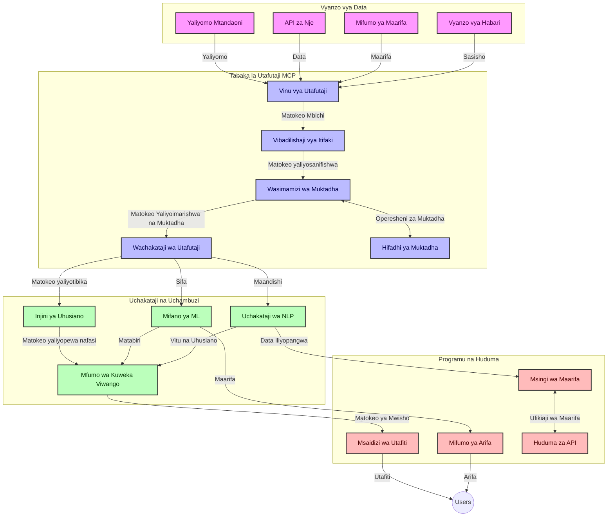
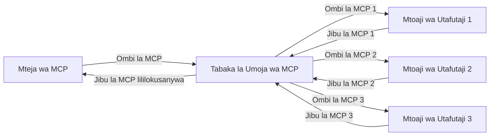

# Itifaki ya Muktadha wa Mfano kwa Utafutaji Mtandaoni Kwa Wakati Halisi

## Muhtasari

Utafutaji mtandaoni kwa wakati halisi umekuwa muhimu katika mazingira ya leo yanayoendeshwa na habari, ambapo programu zinahitaji upatikanaji wa papo hapo wa habari za hivi punde duniani kote kutoa majibu yanayofaa na ya wakati. Itifaki ya Muktadha wa Mfano (MCP) inawakilisha maendeleo makubwa katika kuboresha mchakato huu wa utafutaji kwa wakati halisi, ikiboresha ufanisi wa utafutaji, kudumisha muafaka wa muktadha, na kuboresha jumla ya utendaji wa mfumo.

Moduli hii inachunguza jinsi MCP inavyobadilisha utafutaji mtandaoni kwa wakati halisi kwa kutoa mbinu iliyopangwa ya usimamizi wa muktadha kati ya mifano ya AI, injini za utafutaji, na programu.

### Kile Utakachojifunza

Katika mwongozo huu wa kina, utagundua:

- Jinsi MCP inavyoanzisha daraja lisilo na mshono kati ya mifano ya AI na uwezo wa utafutaji mtandaoni kwa wakati halisi
- Mifumo ya usanifu kwa ajili ya kutekeleza suluhisho za utafutaji zenye ufanisi na zinazoweza kupanuliwa kwa MCP
- Mbinu za kuhifadhi muktadha wa utafutaji kwa maswali na mwingiliano mingi
- Matumizi ya vitendo ya msimbo kwa Python na JavaScript kwa matukio mbalimbali ya utafutaji
- Njia za kusawazisha uhusiano, uhalisi wa taarifa za hivi punde, na utendaji katika mifumo ya utafutaji inayotumia MCP

## Utangulizi kwa Utafutaji Mtandaoni kwa Wakati Halisi

Utafutaji mtandaoni kwa wakati halisi ni mbinu ya kiteknolojia inayowawezesha kuuliza maswali, kuchakata, na kuchambua habari zinazotolewa mtandaoni wakati zinapotangazwa au kusasishwa, ikiruhusu mifumo kutoa habari safi na zenye uhusiano kwa ucheleweshaji mdogo. Tofauti na mifumo ya kawaida ya utafutaji inayofanya kazi kwa data zilizoorodheshwa ambazo zinaweza kuwa za masaa au siku kadhaa, utafutaji wa wakati halisi unachakata data za moja kwa moja kutoka mtandao, ukitoa ufahamu na habari zinazoakisi hali ya sasa ya yaliyomo mtandaoni.

### Dhahania Muhimu za Utafutaji Mtandaoni kwa Wakati Halisi:

- **Uchakataji wa Maswali Mfululizo**: Maswali ya utafutaji huchakatwa dhidi ya vyanzo vya data vinavyobadilika kila wakati
- **Kipaumbele cha Taarifa za Hivi Punde**: Mifumo imebuniwa kipaumbele kwa habari za hivi punde
- **Kusawazisha Uhusiano**: Kudumisha usawa kati ya uhusiano na uhalisi wa taarifa za hivi punde
- **Usanifu Unaoweza Kupanuliwa**: Mifumo lazima idhibiti mzigo wa maswali tofauti na kiasi cha data
- **Uelewa wa Muktadha**: Kudumisha muktadha wa mtumiaji katika mizunguko ya utafutaji ni muhimu kwa matokeo yenye maana
- **Marekebisho ya Maswali Yanayobadilika**: Kubadilisha maswali kulingana na muktadha na matokeo ya awali
- **Ushirikiano wa Vyanzo Mbalimbali**: Kuchanganya matokeo kutoka kwa watoa huduma za utafutaji wengi na vyanzo vya wavuti
- **Uelewa wa Semantiki**: Kuchakata maswali na maudhui kulingana na maana badala ya maneno tu
- **Uainishaji kwa Wakati Halisi**: Kurekebisha viwango vya matokeo kila wakati taarifa mpya inapopatikana

### Itifaki ya Muktadha wa Mfano na Utafutaji Mtandaoni kwa Wakati Halisi

Itifaki ya Muktadha wa Mfano (MCP) inashughulikia changamoto kadhaa muhimu katika mazingira ya utafutaji mtandaoni kwa wakati halisi:

1. **Uhifadhi wa Muktadha wa Utafutaji**: MCP hurekebisha jinsi muktadha unavyodumishwa kati ya vipengele vya utafutaji vilivyoenea, kuhakikisha kuwa mifano ya AI na nodi za usindikaji zinafikia historia ya maswali muhimu na mapendezo ya mtumiaji.

2. **Usimamizi Bora wa Maswali**: Kwa kutoa mifumo iliyopangwa ya usafirishaji wa muktadha, MCP hupunguza mzigo wa kurudia muktadha kila mzunguko wa utafutaji.

3. **Uendeshaji wa Pamoja**: MCP huunda lugha ya pamoja ya kushirikiana muktadha kati ya teknolojia tofauti za utafutaji na mifano ya AI, kuwezesha usanifu rahisi na unaopanuka.

4. **Muktadha Ulioboreshwa kwa Utafutaji**: Matumizi ya MCP yanaweza kipaumbele vipengele vya muktadha vinavyohusiana zaidi kwa utafutaji bora, huku ikiboresha utendaji na usahihi.

5. **Usindikaji wa Utafutaji Unaobadilika**: Kwa usimamizi sahihi wa muktadha kupitia MCP, mifumo ya utafutaji inaweza kurekebisha usindikaji kulingana na mahitaji yanayobadilika ya mtumiaji na mazingira ya habari.

Katika programu za kisasa kuanzia mkusanyiko wa habari za habari hadi wasaidizi wa utafiti, ujumuishaji wa MCP na teknolojia za utafutaji mtandaoni unawezesha utafutaji unaojifunza muktadha na wenye busara zaidi unaoweza kutoa matokeo yanayohusiana zaidi kadri mwingiliano wa mtumiaji unavyoendelea.

## Malengo ya Kujifunza

Mwishoni mwa somo hili, utaweza:

- Kuelewa misingi ya utafutaji mtandaoni kwa wakati halisi na changamoto zake katika programu za kisasa
- Eleza jinsi Itifaki ya Muktadha wa Mfano (MCP) inavyoboreshaji uwezo wa utafutaji mtandaoni kwa wakati halisi
- Tekeleza suluhisho za utafutaji zinazotumia MCP kwa kutumia mifumo maarufu na API
- Tengeneza na anza usanifu wa utafutaji wenye ufanisi mkubwa na wa kiwango kikubwa kwa MCP
- Tumia dhana za MCP kwa matukio mbalimbali ikiwa ni pamoja na utafutaji wa semantiki, kusaidia utafiti, na urambazaji unaosaidiwa na AI
- Tathmini mwenendo unaojitokeza na uvumbuzi wa baadaye katika teknolojia za utafutaji zinazotumia MCP
- Tengeneza mifumo ya utafutaji inayojifunza kutoka kwa mwingiliano wa watumiaji na inayojua muktadha
- Sambaza uwezo wa utafutaji wa mtandaoni kwa wasaidizi wa AI kwa kutumia itifaki za MCP zilizojaa viwango
- Tengeneza njia za utafutaji za hatua nyingi zinazorekebisha matokeo kwa mujibu wa muktadha
- Boreshaji utendaji wa utafutaji huku ukidumisha ufahamu kamili wa muktadha

### Maana na Umuhimu

Utafutaji mtandaoni kwa wakati halisi unahusisha kuuliza maswali, kupata, na kutoa habari mtandaoni kwa ucheleweshaji mdogo. Tofauti na injini za utafutaji za jadi zinazokagua na kuorodhesha wavuti mara kwa mara, utafutaji wa wakati halisi unalenga kuonyesha habari inapoibuka, kuwezesha upatikanaji wa papo hapo wa maudhui ya sasa zaidi.

Sifa kuu za utafutaji mtandaoni kwa wakati halisi ni pamoja na:

- **Ukipya**: Kipaumbele kipya kwa maudhui na masasisho ya hivi punde
- **Uchakataji Endelevu**: Kuangalia habari mpya kila wakati
- **Urekebishaji wa Maswali**: Kuboresha maswali ya utafutaji kulingana na muktadha na maoni
- **Uwasilishaji wa Haraka**: Kutoa matokeo ya utafutaji kwa ucheleweshaji mdogo
- **Uhifadhi wa Muktadha**: Kujenga juu ya maswali yaliyopita kwa uhusiano bora

### Changamoto katika Utafutaji wa Wavuti wa Kiasili

Njia za kawaida za utafutaji mtandaoni hukumbana na vikwazo kadhaa zinapotumika kwa matukio ya wakati halisi:

1. **Uvunjaji wa Muktadha**: Ugumu wa kudumisha muktadha wa utafutaji kwa maswali mengi
2. **Ufreshi wa Habari**: Changamoto za kufikia na kuipa mbele taarifa za hivi punde zaidi
3. **Ugumu wa Ushirikiano**: Matatizo ya uendeshaji pamoja kati ya mifumo ya utafutaji na programu
4. **Muda wa Kuteleza**: Kusawazisha utafutaji kamili na mahitaji ya wakati wa jibu
5. **Urekebishaji wa Uhusiano**: Kuhakikisha usahihi na uhusiano huku ukipendelea uhalisi wa taarifa za hivi punde

## Kuelewa Itifaki ya Muktadha wa Mfano (MCP) kwa Utafutaji

### MCP ni Nini katika Muktadha wa Utafutaji?

Itifaki ya Muktadha wa Mfano (MCP) ni itifaki ya mawasiliano iliyopangwa kwa ajili ya kuwezesha mwingiliano mzuri kati ya mifano ya AI na programu. Katika muktadha wa utafutaji mtandaoni kwa wakati halisi, MCP hutoa mfumo wa:

- Kuhifadhi muktadha wa utafutaji katika mfululizo wa maswali
- Kuweka viwango vya maswali ya utafutaji na muundo wa matokeo
- Kuboresha usafirishaji wa vigezo na matokeo ya utafutaji
- Kuimarisha mawasiliano kati ya mfano na injini ya utafutaji

### Vipengele Muhimu na Usanifu

Usanifu wa MCP kwa utafutaji mtandaoni kwa wakati halisi una vipengele kadhaa muhimu:

1. **Wahudumu wa Muktadha wa Maswali**: Kusimamia na kudumisha muktadha wa utafutaji kwa maswali mengi
2. **Wasindikaji wa Utafutaji**: Kusindika maombi ya utafutaji kwa kutumia mbinu zinazojua muktadha
3. **Adaptors za Itifaki**: Kubadilisha kati ya API mbalimbali za utafutaji huku ukidumisha muktadha
4. **Hifadhi ya Muktadha**: Kuhifadhi kwa ufanisi na kupata historia ya utafutaji na mapendeleo
5. **Viunganishi vya Utafutaji**: Kuunganishwa na injini mbalimbali za utafutaji na API za wavuti



### Jinsi MCP Inavyoboresha Utafutaji Mtandaoni kwa Wakati Halisi

MCP inashughulikia changamoto za utafutaji wa wavuti wa jadi kupitia:

- **Muendelezo wa Muktadha**: Kudumisha uhusiano kati ya maswali katika kipindi cha utafutaji mzima
- **Usafirishaji ulioboreshwa**: Kupunguza urudiwa wa vigezo vya utafutaji kupitia usimamizi wa muktadha wenye akili
- **Miface Yenye Viwango Vishawishi**: Kutoa API zinazolingana kwa vipengele vya utafutaji
- **Kupungua kwa Ucheleweshaji**: Kupunguza mzigo wa usindikaji kupitia ushughulikiaji mzuri wa muktadha
- **Uboreshaji wa Uhusiano**: Kuboresha uhusiano wa utafutaji kwa kuhifadhi nia ya mtumiaji kati ya maswali mengi

## Ujumuishaji na Utekelezaji

Mifumo ya utafutaji mtandaoni kwa wakati halisi yanahitaji usanifu wa makini na utekelezaji kudumisha utendaji na muafaka wa muktadha. Itifaki ya Muktadha wa Mfano inatoa mbinu uliopangwa za kuunganisha mifano ya AI na teknolojia za utafutaji kuwezesha njia za utafutaji zenye akili na zinazojua muktadha.

### Muhtasari wa Ujumuishaji wa MCP katika Usanifu wa Utafutaji

Kutekeleza MCP katika mazingira ya utafutaji mtandaoni kwa wakati halisi kunahusisha mambo muhimu kadhaa:

1. **Usimbaji Muktadha wa Utafutaji**: MCP hutoa mbinu zenye ufanisi za kusimbua taarifa za muktadha ndani ya maombi ya utafutaji, kuhakikisha muktadha muhimu unaambatana na swali katika mzunguko mzima wa usindikaji. Hii ni pamoja na miundo ya usimbaji uliosawazishwa, iliyoborezwa kwa metadata inayohusiana na utafutaji.

2. **Usindikaji wa Utafutaji Ulio na Hali**: MCP inaruhusu usindikaji wenye akili ulio na hali kwa kudumisha uwakilishi wa muktadha unaolingana kati ya mizunguko ya utafutaji. Hii ni ya maana hasa katika njia za utafutaji wa hatua nyingi ambapo ufafanuzi wa muktadha huboresha matokeo.

3. **Upanuzi na Uboreshaji wa Maswali**: Matumizi ya MCP katika mifumo ya utafutaji yanaweza kuwezesha upanuzi wa maswali na uboreshaji wa hali ya juu kulingana na muktadha uliokusanywa, kuruhusu matokeo yanayohusiana zaidi kadri kipindi cha utafutaji kinavyosogea mbele.

4. **Uhifadhi wa Matokeo na Kipaumbele**: Kwa kuweka viwango katika ushughulikiaji wa muktadha, MCP husaidia kusimamia uhifadhi wa matokeo na kipaumbele, ikiruhusu vipengele kubadilika kulingana na muktadha unaobadilika wa utafutaji.

5. **Usaidizi wa Utafutaji Ulioanzishwa na Ushirikiano**: MCP hutoa suluhisho la kina zaidi la ushauri wa utafutaji kwenye mifumo mingi kwa kutoa uwakilishi uliopangwa wa muktadha wa utafutaji, kuwezesha mkusanyiko wenye maana wa matokeo kutoka vyanzo mbalimbali.

Utekelezaji wa MCP katika teknolojia mbalimbali za utafutaji huunda njia moja ya usimamizi wa muktadha, kupunguza hitaji la msimbo wa ujumuishaji maalum huku ikiboresha uwezo wa mfumo kudumisha muktadha wenye maana wakati maswali ya utafutaji yanavyobadilika.

### MCP katika Matumizi Mbalimbali ya Utafutaji Mtandaoni

Mifano hii inafuata vipengele vya sasa vya MCP vinavyoelekeza kwa itifaki ya JSON-RPC yenye njia tofauti za usafirishaji. Msimbo unaonyesha jinsi unavyoweza kutekeleza ujumuishaji wa utafutaji wa kawaida huku ukidumisha ulinganifu kamili na itifaki ya MCP.


<details>
<summary>Utekelezaji wa Python na API ya Utafutaji ya Kawaida</summary>

```python
import asyncio
import json
import aiohttp
from typing import Dict, Any, Optional, List
from contextlib import asynccontextmanager
from collections.abc import AsyncIterator

# Ingiza maktaba za kawaida za MCP
from mcp.client.session import ClientSession
from mcp.client.streamable_http import streamablehttp_client
from mcp.types import TextContent, CreateMessageRequestParams, CreateMessageResult
from mcp.server.fastmcp import FastMCP

# Unda seva ya FastMCP kwa ajili ya utafutaji wa wavuti
search_server = FastMCP("WebSearch")

# Darasa la kushughulikia shughuli za utafutaji wa wavuti
class WebSearchHandler:
    def __init__(self, api_endpoint: str, api_key: str):
        self.api_endpoint = api_endpoint
        self.api_key = api_key
        self.session = None
        
    async def initialize(self):
        """Initialize the HTTP session"""
        self.session = aiohttp.ClientSession(
            headers={"Authorization": f"Bearer {self.api_key}"}
        )
    
    async def close(self):
        """Close the HTTP session"""
        if self.session:
            await self.session.close()
            
    async def perform_search(self, query: str, max_results: int = 5, 
                           include_domains: List[str] = None, 
                           exclude_domains: List[str] = None,
                           time_period: str = "any") -> Dict[str, Any]:
        """Perform web search using the search API"""
        # Tengeneza vigezo vya utafutaji
        search_params = {
            "q": query,
            "limit": max_results,
            "time": time_period
        }
        
        if include_domains:
            search_params["site"] = ",".join(include_domains)
            
        if exclude_domains:
            search_params["exclude_site"] = ",".join(exclude_domains)
        
        # Fanya ombi la utafutaji
        try:
            async with self.session.get(
                self.api_endpoint,
                params=search_params
            ) as response:
                if response.status != 200:
                    error_text = await response.text()
                    raise Exception(f"Search API error: {response.status} - {error_text}")
                
                search_data = await response.json()
                
                # Badilisha jibu maalum la API kwa muundo wa kawaida
                results = []
                for item in search_data.get("results", []):
                    results.append({
                        "title": item.get("title", ""),
                        "url": item.get("url", ""),
                        "snippet": item.get("snippet", ""),
                        "date": item.get("published_date", ""),
                        "source": item.get("source", "")
                    })
                
                return {
                    "query": query,
                    "totalResults": len(results),
                    "results": results
                }
        except Exception as e:
            print(f"Search API request error: {e}")
            raise

# Anzisha mshughulikiaji wa utafutaji
search_handler = WebSearchHandler(
    api_endpoint="https://api.search-service.example/search",
    api_key="your-api-key-here"
)

# Seti muda wa maisha kudhibiti mshughulikiaji wa utafutaji
@asyncio.asynccontextmanager
async def app_lifespan(server: FastMCP):
    """Manage application lifecycle"""
    await search_handler.initialize()
    try:
        yield {"search_handler": search_handler}
    finally:
        await search_handler.close()

# Weka muda wa maisha kwa seva
search_server = FastMCP("WebSearch", lifespan=app_lifespan)

# Sajili chombo cha utafutaji wa wavuti
@search_server.tool()
async def web_search(query: str, max_results: int = 5, 
                   include_domains: List[str] = None,
                   exclude_domains: List[str] = None,
                   time_period: str = "any") -> Dict[str, Any]:
    """
    Search the web for information
    
    Args:
        query: The search query
        max_results: Maximum number of results to return (default: 5)
        include_domains: List of domains to include in search results
        exclude_domains: List of domains to exclude from search results
        time_period: Time period for results ("day", "week", "month", "any")
        
    Returns:
        Dictionary containing search results
    """
    ctx = search_server.get_context()
    search_handler = ctx.request_context.lifespan_context["search_handler"]
    
    results = await search_handler.perform_search(
        query=query,
        max_results=max_results,
        include_domains=include_domains,
        exclude_domains=exclude_domains,
        time_period=time_period
    )
    
    return results

# Mfano wa matumizi ya mteja
async def client_example():
    # Unganisha kwenye seva ya utafutaji kwa kutumia usafirishaji wa HTTP unaoweza kuhamishwa
    async with streamablehttp_client("http://localhost:8000/mcp") as (read, write, _):
        async with ClientSession(read, write) as session:
            # Anzisha muunganisho
            await session.initialize()
            
            # Piga simu ya chombo cha utafutaji wa wavuti
            search_results = await session.call_tool(
                "web_search", 
                {
                    "query": "latest developments in AI and Model Context Protocol",
                    "max_results": 5,
                    "time_period": "day",
                    "include_domains": ["github.com", "microsoft.com"]
                }
            )
            
            print(f"Search results: {search_results}")

# Mfano wa utekelezaji wa seva
if __name__ == "__main__":
    # Endesha seva kwa usafirishaji wa HTTP unaoweza kuhamishwa
    search_server.run(transport="streamable-http")
```
</details> 

<details>
<summary>Utekelezaji wa JavaScript na Utafutaji wa Kivinjari</summary>


```javascript
// Utekelezaji wa seva ya MCP kwa ajili ya utafutaji wa wavuti
import { McpServer, ResourceTemplate } from '@modelcontextprotocol/sdk/server/mcp.js';
import { StreamableHTTPServerTransport } from '@modelcontextprotocol/sdk/server/streamableHttp.js';
import { z } from 'zod';

// Tengeneza seva ya MCP kwa ajili ya utafutaji wa wavuti
const searchServer = new McpServer({
    name: "BrowserSearch",
    description: "A server that provides web search capabilities"
});

// Darasa la huduma ya utafutaji
class SearchService {
    constructor(searchApiUrl, apiKey) {
        this.searchApiUrl = searchApiUrl;
        this.apiKey = apiKey;
    }

    async performSearch(parameters) {
        const {
            query = '',
            maxResults = 5,
            includeDomains = [],
            excludeDomains = [],
            timePeriod = 'any'
        } = parameters;
        
        // Tengeneza URL ya utafutaji kwa kutumia vigezo
        const url = new URL(this.searchApiUrl);
        url.searchParams.append('q', query);
        url.searchParams.append('limit', maxResults);
        url.searchParams.append('time', timePeriod);
        
        if (includeDomains.length > 0) {
            url.searchParams.append('site', includeDomains.join(','));
        }
        
        if (excludeDomains.length > 0) {
            url.searchParams.append('exclude_site', excludeDomains.join(','));
        }
        
        try {
            const response = await fetch(url.toString(), {
                method: 'GET',
                headers: {
                    'Authorization': `Bearer ${this.apiKey}`,
                    'Content-Type': 'application/json'
                }
            });
            
            if (!response.ok) {
                const errorText = await response.text();
                throw new Error(`Search API error: ${response.status} - ${errorText}`);
            }
            
            const searchData = await response.json();
            
            // Badilisha majibu maalum ya API kuwa muundo wa kawaida
            const results = searchData.results?.map(item => ({
                title: item.title || '',
                url: item.url || '',
                snippet: item.snippet || '',
                date: item.published_date || '',
                source: item.source || ''
            })) || [];
            
            return {
                query,
                totalResults: results.length,
                results
            };
        } catch (error) {
            console.error('Search API request error:', error);
            throw error;
        }
    }
}

// Anzisha huduma ya utafutaji
const searchService = new SearchService(
    'https://api.search-service.example/search',
    'your-api-key-here'
);

// Andaa mtoaji wa muktadha kwa seva
searchServer.setContextProvider(() => {
    return {
        searchService
    };
});

// Sajili chombo cha utafutaji wa wavuti
searchServer.tool({
    name: 'web_search',
    description: 'Search the web for information',
    parameters: {
        type: 'object',
        properties: {
            query: {
                type: 'string',
                description: 'The search query'
            },
            maxResults: {
                type: 'integer',
                description: 'Maximum number of results to return',
                default: 5
            },
            includeDomains: {
                type: 'array',
                items: { type: 'string' },
                description: 'List of domains to include in search results'
            },
            excludeDomains: {
                type: 'array',
                items: { type: 'string' },
                description: 'List of domains to exclude from search results'
            },
            timePeriod: {
                type: 'string',
                description: 'Time period for results',
                enum: ['day', 'week', 'month', 'any'],
                default: 'any'
            }
        },
        required: ['query']
    },
    handler: async (params, context) => {
        const { searchService } = context;
        return await searchService.performSearch(params);
    }
});

// Mfano wa msimbo wa mteja kuungana na seva ya utafutaji
import { Client } from '@modelcontextprotocol/sdk/client/index.js';
import { StreamableHTTPClientTransport } from '@modelcontextprotocol/sdk/client/streamableHttp.js';

async function connectToSearchServer() {
    // Ungana na seva ya utafutaji
    const transport = new StreamableHTTPClientTransport(
        new URL('http://localhost:8000/mcp')
    );
    
    const client = new Client({
        name: 'search-client',
        version: '1.0.0'
    });
    
    await client.connect(transport);
    
    // Endesha chombo cha utafutaji
    const searchResults = await client.callTool({
        name: 'web_search',
        arguments: {
            query: 'Model Context Protocol implementation examples',
            maxResults: 10,
            timePeriod: 'week',
            includeDomains: ['github.com', 'docs.microsoft.com']
        }
    });
    
    console.log('Search results:', searchResults);
    
    // Safisha
    await client.disconnect();
}

// Anzisha seva
const transport = new StreamableHTTPServerTransport();
await searchServer.connect(transport);
console.log('Search server running at http://localhost:8000/mcp');

// Katika mchakato tofauti au baada ya seva kuanzishwa
// connectToSearchServer().catch(console.error);
```
</details> 


## Maelezo ya Mifano ya Msimbo

> **Kumbuka Muhimu**: Mifano ya msimbo hapa chini inaonyesha ujumuishaji wa Itifaki ya Muktadha wa Mfano (MCP) na uwezo wa utafutaji mtandaoni. Ingawa inafuata mifumo na miundo ya MCP SDK rasmi, imepangwa kwa ajili ya elimu.
> 
> Mifano hii inaonyesha:
> 
> 1. **Utekelezaji wa Python**: Utekelezaji wa seva ya FastMCP inayotoa chombo cha utafutaji mtandaoni na kuungana na API ya utafutaji ya nje. Mfano huu unaonyesha usimamizi sahihi wa maisha ya mchakato, usimamizi wa muktadha, na utekelezaji wa chombo kwa kufuata mifumo ya [MCP SDK ya Python rasmi](https://github.com/modelcontextprotocol/python-sdk). Seva hutumia usafirishaji wa HTTP unaoweza kusambazwa uliopendekezwa ambao umechukua nafasi ya usafirishaji wa SSE wa zamani kwa ajili ya uzalishaji.
> 
> 2. **Utekelezaji wa JavaScript**: Utekelezaji wa TypeScript/JavaScript ukitumia mfano wa FastMCP kutoka kwa [MCP SDK ya TypeScript rasmi](https://github.com/modelcontextprotocol/typescript-sdk) kuunda seva ya utafutaji na ufafanuzi sahihi wa zana na muunganisho wa mteja. Inafuata mifumo ya hivi punde kwa usimamizi wa kikao na uhifadhi wa muktadha.
> 
> Mifano hii itahitaji usindikaji wa makosa ya ziada, uthibitisho, na msimbo maalum wa ujumuishaji wa API kwa matumizi ya uzalishaji. Anuani za API ya utafutaji zilizoonyeshwa (`https://api.search-service.example/search`) ni mahali pa kuweka na zitahitaji kubadilishwa na anuani halisi za huduma ya utafutaji.
> 
> Kwa maelezo kamili ya utekelezaji na mbinu za kisasa zaidi,
> rejea [maelezo rasmi ya MCP](https://modelcontextprotocol.io/specification/2026-07-28/)
> na nyaraka za SDK.

## Dhahania Muhimu

### Mfumo wa Itifaki ya Muktadha wa Mfano (MCP)

Kwa msingi wake, Itifaki ya Muktadha wa Mfano hutoa njia iliyopangwa kwa mifano ya AI, programu, na huduma kubadilishana muktadha. Katika utafutaji mtandaoni kwa wakati halisi, mfumo huu ni muhimu kwa kuunda uzoefu wa utafutaji wa mizunguko mingi yenye maana. Vipengele vikuu ni pamoja na:

1. **Usanifu wa Mteja-Seva**: MCP huanzisha mgawanyiko wazi kati ya wateja wa utafutaji (waiombaji) na seva za utafutaji (watoa huduma), kuruhusu mifano ya usambazaji inayobadilika.

2. **Mawasiliano ya JSON-RPC**: Itifaki hutumia JSON-RPC kwa ubadilishanaji wa ujumbe, ikifanya iwe sambamba na teknolojia za wavuti na rahisi kutekeleza kwenye majukwaa tofauti.

3. **Usimamizi wa Muktadha**: MCP hufafanua mbinu za kimuundo za kudumisha, kusasisha, na kutumia muktadha wa utafutaji katika mwingiliano mingi.

4. **Ufafanuzi wa Zana**: Uwezo wa utafutaji unaonyeshwa kama zana zilizo na viambatanisho wazi vya vigezo na thamani za kurudi.

5. **Msaada wa Utoaji Mfululizo**: Itifaki inaunga mkono utoaji wa matokeo kwa mfululizo, muhimu kwa utafutaji wa wakati halisi ambapo matokeo yanaweza kuwasili kwa hatua.

### Mifumo ya Ujumuishaji wa Utafutaji Mtandaoni

Wakati wa kuunganisha MCP na utafutaji mtandaoni, mifumo kadhaa hujitokeza:

#### 1. Ujumuishaji wa Moja kwa Moja na Mtoa Huduma wa Utafutaji


Katika mfumo huu, seva ya MCP inaunganishwa moja kwa moja na API moja au zaidi za utafutaji, ikitafsiri maombi ya MCP kuwa wito maalum wa API na kupanga matokeo kama majibu ya MCP.

#### 2. Utafutaji wa Umoja na Uhifadhi wa Muktadha



Mfumo huu unagawa maswali ya utafutaji kwa watoa huduma wengi wa utafutaji wanaolingana na MCP, kila mmoja akiweza kuhusika katika aina tofauti za maudhui au uwezo wa utafutaji, huku ukidumisha muktadha mmoja.

#### 3. Mnyororo wa Utafutaji Ulioboreshwa na Muktadha


Katika mfumo huu, mchakato wa utafutaji hugawanywa katika hatua nyingi, huku muktadha ukiboreshwa kila hatua, ukizalisha matokeo yanayohusiana zaidi hatua kwa hatua.

### Vipengele vya Muktadha wa Utafutaji

Katika utafutaji mtandaoni unaotumia MCP, muktadha kawaida unajumuisha:

- **Historia ya Maswali**: Maswali ya utafutaji yaliyopita katika kikao
- **Mapendeleo ya Mtumiaji**: Lugha, eneo, mipangilio ya utafutaji salama
- **Historia ya Mwingiliano**: Matokeo gani yaliibonwa, muda uliotumika kwenye matokeo
- **Vigezo vya Utafutaji**: Filteri, mpangilio wa sarafu, na vipeperushi vingine vya utafutaji
- **Maarifa ya Uwanja**: Muktadha maalum wa somo unaohusiana na utafutaji
- **Muktadha wa Wakati**: Vigezo vya umuhimu vinavyojumuisha wakati
- **Mapendeleo ya Chanzo**: Vyanzo vya habari vinavyoaminika au vinavyopendwa

## Matumizi na Programu

### Utafiti na Ukusanyaji wa Habari

MCP huboresha michakato ya utafiti kwa:

- Kuhifadhi muktadha wa utafiti kati ya vikao vya utafutaji
- Kuwezesha maswali mazuri na yenye muktadha unaohusiana
- Kusaidia usaidizi wa utafutaji kutoka vyanzo mbalimbali
- Kuwezesha uchimbaji wa maarifa kutoka kwa matokeo ya utafutaji

### Ufuatiliaji wa Habari za Wakati Halisi na Mwelekeo

Utafutaji unaotumia MCP hutoa faida kwa ufuatiliaji wa habari:

- Ugunduzi wa takriban papo hapo wa habari mpya zinazojitokeza
- Ufuatiliaji wa muktadha wa taarifa muhimu
- Ufuatiliaji wa mada na vyombo katika vyanzo vingi
- Tahadhari za habari zilizobinafsishwa kulingana na muktadha wa mtumiaji

### Urambazaji na Utafiti Unaosaidiwa na AI

MCP huleta fursa mpya kwa urambazaji unaosaidiwa na AI:

- Mapendekezo ya utafutaji yanayotegemea muktadha wa shughuli ya kivinjari
- Ujumuishaji wa utafutaji wa wavuti na wasaidizi wa LLM uliokamilika
- Uboreshaji wa mizunguko mingi ya utafutaji huku muktadha ukiendeshwa
- Kuthibitisha na uhakikisho wa habari kwa ufanisi zaidi

## Mwelekeo na Ubunifu wa Baadaye

### Maendeleo ya MCP katika Utafutaji Mtandaoni

Tukitazama mbele, tunatarajia MCP itaendelea kukua ili kushughulikia:


- **Utafutaji wa Multimodal**: Kuunganisha maandishi, picha, sauti, na utafutaji wa video huku muktadha ukihifadhiwa
- **Utafutaji Usio wa Kituo Kimoja**: Kusaidia mifumo ya utafutaji iliyogatuliwa na ya muungano
- **Usiri wa Utafutaji**: Mbinu za utafutaji zinazohifadhi usiri zenye ufahamu wa muktadha
- **Uelewa wa Maswali ya Utafutaji**: Kuchambua kina maana ya maswali ya utafutaji wa lugha ya asili

### Maendeleo Yanayoweza Kutokea Katika Teknolojia

Teknolojia zinazojitokeza zitakazoumba mustakabali wa utafutaji wa MCP:

1. **Mimara ya Utafutaji wa Neva**: Mfumo wa utafutaji unaotumia uingizaji wa data kwa MCP
2. **Muktadha Binafsi wa Utafutaji**: Kujifunza mifumo ya utafutaji wa mtumiaji binafsi kwa muda
3. **Uingiliano wa Grafu za Maarifa**: Utafutaji wenye muktadha ulioboreshwa kwa grafu za maarifa maalum ya fani
4. **Muktadha wa Mbinu Mbalimbali**: Kuhifadhi muktadha kwenye aina tofauti za utafutaji

## Mazoezi ya Vitendo

### Zoeezi 1: Kuanza Mchakato wa Msingi wa Utafutaji wa MCP

Katika zoeezi hili, utajifunza jinsi ya:
- Kuanzisha mazingira ya msingi ya utafutaji wa MCP
- Kutekeleza waendeshaji wa muktadha kwa utafutaji wa wavuti
- Kupima na kuthibitisha uhifadhi wa muktadha katika marejeleo ya utafutaji

### Zoeezi 2: Kujenga Msaidizi wa Utafiti kwa MCP

Tengeneza programu kamili inayoweza:
- Kusindika maswali ya utafiti kwa lugha ya asili
- Kufanya utafutaji wa wavuti wenye ufahamu wa muktadha
- Kuchanganya taarifa kutoka vyanzo vingi
- Kuonyesha matokeo ya utafiti yaliyopangwa

### Zoeezi 3: Kutekeleza Muungano wa Utafutaji wa Vyanzo Mbalimbali kwa MCP

Zoeezi la juu linajumuisha:
- Ugawaji wa maswali wenye ufahamu wa muktadha kwa injini za utafutaji nyingi
- Kuweka alama na kuchanganua matokeo
- Kuondoa matokeo yaliyofanana kulingana na muktadha
- Kusimamia metadata ya chanzo maalum

## Rasilimali Zaidi

- [Maelezo ya Protokoli ya Muktadha wa Mfano](https://modelcontextprotocol.io/specification/2026-07-28/) - Maelezo rasmi ya MCP na nyaraka za kina za itifaki
- [Nyaraka za Protokoli ya Muktadha wa Mfano](https://modelcontextprotocol.io/) - Mafunzo ya kina na mwongozo wa utekelezaji
- [MCP Python SDK](https://github.com/modelcontextprotocol/python-sdk) - Utekelezaji rasmi wa Python wa itifaki ya MCP
- [MCP TypeScript SDK](https://github.com/modelcontextprotocol/typescript-sdk) - Utekelezaji rasmi wa TypeScript wa itifaki ya MCP
- [MCP Reference Servers](https://github.com/modelcontextprotocol/servers) - Utekelezaji wa marejeo wa seva za MCP
- [Nyaraka za Bing Web Search API](https://learn.microsoft.com/en-us/bing/search-apis/bing-web-search/overview) - API ya utafutaji wa wavuti ya Microsoft
- [Google Custom Search JSON API](https://developers.google.com/custom-search/v1/overview) - Injini ya utafutaji inayoweza kupangwa ya Google
- [Nyaraka za SerpAPI](https://serpapi.com/search-api) - API ya ukurasa wa matokeo ya injini ya utafutaji
- [Nyaraka za Meilisearch](https://www.meilisearch.com/docs) - Injini ya utafutaji ya chanzo huru
- [Nyaraka za Elasticsearch](https://www.elastic.co/guide/index.html) - Injini ya utafutaji iliyogatuliwa na uchanganuzi
- [Nyaraka za LangChain](https://python.langchain.com/docs/get_started/introduction) - Kujenga programu kwa kutumia LLMs

## Matokeo ya Kujifunza

Kwa kukamilisha moduli hii, utaweza:

- Kuelewa misingi ya utafutaji wa wavuti wa wakati halisi na changamoto zake
- Kueleza jinsi Protokoli ya Muktadha wa Mfano (MCP) inavyoongeza uwezo wa utafutaji wa wavuti wa wakati halisi
- Kutekeleza suluhisho za utafutaji zinazotumia MCP kwa kutumia mifumo maarufu na API
- Kubuni na kuanzisha miundo ya utafutaji yenye uwezo mkubwa na ufanisi kwa MCP
- Kutumia dhana za MCP katika utumiaji mbalimbali ikiwemo utafutaji wa maana, msaada wa utafiti, na kuvutulia kutumia AI
- Kutathmini mwelekeo mipya na ubunifu wa baadaye katika teknolojia za utafutaji zenye msingi wa MCP


### Mambo ya Kutilia Moyo Kuhusu Uaminifu na Usalama

Unapotekeleza suluhisho za utafutaji wa wavuti zenye msingi wa MCP, kumbuka kanuni muhimu hizi kutoka kwenye maelezo ya MCP:

1. **Idhini na Udhibiti wa Mtumiaji**: Watumiaji lazima wape idhini wazi na kuelewa upatikanaji wa data na operesheni zote. Hii ni muhimu hasa kwa utekelezaji wa utafutaji wa wavuti unaoweza kufikia vyanzo vya data vya nje.

2. **Usiri wa Data**: Hakikisha usimamizi sahihi wa maswali na matokeo ya utafutaji, hasa inapojumuisha taarifa nyeti. Tekeleza udhibiti unaofaa wa upatikanaji kulinda data za watumiaji.

3. **Usalama wa Zana**: Tekeleza uthibitisho sahihi na ukaguzi kwa zana za utafutaji, kwani zinawakilisha hatari za usalama kupitia utekelezaji wa nambari ya vigezo. Maelezo ya tabia ya zana hayapaswi kuaminiwa isipokuwa yanapatikana kutoka seva ya kuaminika.

4. **Nyaraka Zenye Uwazi**: Toa nyaraka wazi kuhusu uwezo, mipaka, na mambo ya usalama ya utekelezaji wako wa utafutaji unaotumia MCP, kufuata miongozo ya utekelezaji kutoka maelezo ya MCP.

5. **Mtiririko Imara wa Idhini**: Jenga michakato imara ya idhini na uthibitishaji ambayo inaeleza wazi kinachofanywa na zana kabla ya kuidhinisha matumizi yake, hasa kwa zana zinazoshirikiana na rasilimali za wavuti za nje.

Kwa maelezo kamili kuhusu usalama na mambo ya uaminifu ya MCP, rejea
[nyaraka rasmi](https://modelcontextprotocol.io/specification/2026-07-28/basic/security_best_practices).

## Nini Kifuatayo 

- [5.12 Entra ID Authentication for Model Context Protocol Servers](../mcp-security-entra/README.md)

---

<!-- CO-OP TRANSLATOR DISCLAIMER START -->
**Kionyozo**:
Hati hii imetafsiriwa kwa kutumia huduma ya tafsiri ya AI [Co-op Translator](https://github.com/Azure/co-op-translator). Ingawa tunajitahidi kupata usahihi, tafadhali fahamu kwamba tafsiri za kiotomatiki zinaweza kuwa na makosa au upungufu wa usahihi. Hati ya asili katika lugha yake halisi inapaswa kuchukuliwa kama chanzo cha mamlaka. Kwa taarifa muhimu, tafsiri ya kitaalamu inayofanywa na binadamu inapendekezwa. Hatutojibu kwa kuelewa vibaya au tafsiri potofu zinazotokea kutokana na matumizi ya tafsiri hii.
<!-- CO-OP TRANSLATOR DISCLAIMER END -->