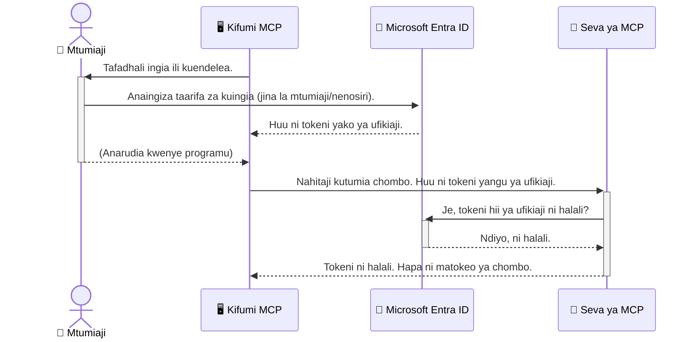

# Kuweka Usalama katika Mipangilio ya AI: Uthibitishaji wa Entra ID kwa Vifumo vya Itifaki ya Muktadha wa Mfano

> [!NOTE]
> Msimbo wa seva ya mbali katika somo hili unalinda vituo vya zamani vya `/sse` na `/message`
> na unalenga MCP `2025-11-25`. Endelea kutumia utambulisho wake na mbinu za uthibitishaji wa tokeni,
> lakini tumia usafirishaji wa HTTP wa Streamable unaolingana na `2026-07-28` kwa utekelezaji mipya.


## Utangulizi
Kuweka salama seva yako ya Itifaki ya Muktadha wa Mfano (MCP) ni muhimu kama kufunga mlango wa mbele wa nyumba yako. Kuacha seva yako ya MCP wazi kunaonyesha zana na data zako kwa watu wasioidhinishwa, jambo ambalo linaweza kusababisha uvunjaji wa usalama. Microsoft Entra ID hutoa suluhisho imara la usimamizi wa utambulisho na ufikiaji linatokana na wingu, likisaidia kuhakikisha kwamba ni watumiaji na programu zilizothibitishwa tu ndio wanaweza kuingiliana na seva yako ya MCP. Katika sehemu hii, utajifunza jinsi ya kulinda mipangilio yako ya AI kwa kutumia uthibitishaji wa Entra ID.

## Malengo ya Kujifunza
Mwisho wa sehemu hii, utaweza:

- Kuelewa umuhimu wa kuweka usalama katika seva za MCP.
- Kuelezea misingi ya Microsoft Entra ID na uthibitishaji wa OAuth 2.0.
- Kutambua tofauti kati ya wateja wa umma na wa siri.
- Kutekeleza uthibitishaji wa Entra ID katika hali za seva ya MCP za ndani (mteja wa umma) na mbali (mteja wa siri).
- Kutumia mbinu bora za usalama wakati wa kuandaa mipangilio ya AI.

## Usalama na MCP

Kama vile huataki kuacha mlango wa mbele wa nyumba yako wazi, sivyo unapaswa kuacha seva yako ya MCP ifunguke kwa mtu yeyote. Kuweka usalama katika mipangilio yako ya AI ni muhimu kwa kujenga programu imara, zinazotegemewa, na salama. Sura hii itakuonyesha jinsi ya kutumia Microsoft Entra ID kuweka usalama seva zako za MCP, kuhakikisha kwamba watumiaji na programu zilizothibitishwa tu ndio wanaweza kutumia zana na data zako.

## Kwa Nini Usalama Ni Muhimu kwa Seva za MCP

Fikiria seva yako ya MCP ina zana inayoweza kutuma barua pepe au kufikia hifadhidata ya wateja. Seva isiyo na usalama ingemaanisha mtu yeyote anaweza kutumia zana hiyo, na kusababisha ufikiaji usioidhinishwa wa data, barua taka, au vitendo vingine haramu.

Kwa kutumia uthibitishaji, una hakikisha kila ombi kwa seva yako linathibitishwa, likithibitisha utambulisho wa mtumiaji au programu inayotuma ombi. Hili ni hatua ya kwanza na muhimu zaidi katika kuhakikisha usalama wa mipangilio yako ya AI.

## Utangulizi wa Microsoft Entra ID

[**Microsoft Entra ID**](https://adoption.microsoft.com/microsoft-security/entra/) ni huduma ya usimamizi wa utambulisho na ufikiaji inayotegemea wingu. Fikiria kama mlinzi wa usalama wa kimataifa kwa programu zako. Inasimamia mchakato mgumu wa kuthibitisha utambulisho wa watumiaji (uthibitishaji) na kubaini kile wanachoruhusiwa kufanya (idhinishaji).

Kwa kutumia Entra ID, unaweza:

- Kuwezesha kuingia salama kwa watumiaji.
- Kulinda API na huduma.
- Kusimamia sera za ufikiaji kutoka sehemu moja.

Kwa seva za MCP, Entra ID hutoa suluhisho imara na linalotegemewa sana kusimamia nani anaweza kufikia uwezo wa seva yako.

---

## Kuelewa Sanaa: Jinsi Uthibitishaji wa Entra ID Unavyofanya Kazi

Entra ID hutumia viwango wazi kama **OAuth 2.0** kushughulikia uthibitishaji. Ingawa maelezo yanaweza kuwa magumu, dhana kuu ni rahisi na inaweza kueleweka kwa mfano.

### Utangulizi Lenye Upole kwa OAuth 2.0: Ufunguo wa Mchapishaji

Fikiria OAuth 2.0 kama huduma ya mchapishaji gari lako. Unapofika mrestauranti, hutoi mchapishaji ufunguo wako mkuu. Badala yake, unampa **ufunguo wa mchapishaji** wenye ruhusa ndogo—unaweza kuwasha gari na kufunga milango, lakini hauwezi kufungua bako la mizigo au sehemu ya glove.

Katika mfano huu:

- **Wewe** ni **Mtumiaji**.
- **Gari lako** ni **Seva ya MCP** yenye zana na data muhimu.
- **Mchapishaji** ni **Microsoft Entra ID**.
- **Msimamizi wa Hifadhi** ni **Mteja wa MCP** (programu inayojaribu kufikia seva).
- **Ufunguo wa Mchapishaji** ni **Tokeni ya Ufikiaji**.

Tokeni ya ufikiaji ni mfuatiliaji salama wa maandishi ambao mteja wa MCP hupokea kutoka Entra ID baada ya kuingia. Kisha mteja huwasilisha tokeni hii kwa seva ya MCP kila ombi. Seva inaweza kuthibitisha tokeni kuhakikisha ombi ni halali na mteja ana ruhusa zinazohitajika, yote bila ya kumshughulikia mtumiaji nywila zake (kama nywila).

### Mchakato wa Uthibitishaji

Hapa ni jinsi mchakato unavyofanya kazi kwa vitendo:



### Kutambulisha Maktaba ya Uthibitishaji ya Microsoft (MSAL)

Kabla ya kuingia msimbo, ni muhimu kutambulisha sehemu kuu utakayoiiona mifano: **Maktaba ya Uthibitishaji ya Microsoft (MSAL)**.

MSAL ni maktaba iliyotengenezwa na Microsoft inayofanya iwe rahisi kwa waendelezaji kushughulikia uthibitishaji. Badala yako kuandika msimbo mgumu wote wa kushughulikia tokeni za usalama, kusimamia kuingia, na kufufua vikao, MSAL hufanya kazi hiyo nzito.

Kutumia maktaba kama MSAL kunapendekezwa sana kwa sababu:

- **Ni Salama:** Inatekeleza itifaki za viwango vya sekta na mbinu bora za usalama, kupunguza hatari za udhaifu katika msimbo wako.
- **Ina Rahisisha Maendeleo:** Inatenganisha ugumu wa itifaki za OAuth 2.0 na OpenID Connect, ikiruhusu kuongeza uthibitishaji imara kwa programu yako kwa mistari michache tu ya msimbo.
- **Inadumishwa:** Microsoft inaendelea kudumisha na kusasisha MSAL kukabiliana na vitisho vipya vya usalama na mabadiliko ya jukwaa.

MSAL inaunga mkono lugha nyingi na miundo ya programu, ikiwa ni pamoja na .NET, JavaScript/TypeScript, Python, Java, Go, na majukwaa ya simu kama iOS na Android. Hii inamaanisha unaweza kutumia mifumo ya uthibitishaji thabiti kote kwenye hifadhidata yako ya teknolojia.

Kujifunza zaidi kuhusu MSAL, unaweza kutembelea [nyaraka rasmi za muhtasari wa MSAL](https://learn.microsoft.com/entra/identity-platform/msal-overview).

---

## Kuweka Salama Seva Yako ya MCP kwa Entra ID: Mwongozo wa Hatua kwa Hatua

Sasa, tuangalie jinsi ya kuweka salama seva ya MCP ya ndani (inayozungumza kwa `stdio`) kwa kutumia Entra ID. Mfano huu hutumia **mteja wa umma**, unaofaa kwa programu zinazoendesha kwenye mashine ya mtumiaji, kama programu ya desktop au seva ya maendeleo ya ndani.

### Muktadha wa 1: Kuweka Salama Seva ya MCP ya Ndani (na Mteja wa Umma)

Katika muktadha huu, tutaangalia seva ya MCP inayotumia ndani, inazungumza kwa `stdio`, na hutumia Entra ID kuthibitisha mtumiaji kabla ya kuruhusu ufikiaji wa zana zake. Seva itakuwa na zana moja inayopata taarifa za wasifu wa mtumiaji kutoka Microsoft Graph API.

#### 1. Kusanidi Programu katika Entra ID

Kabla ya kuandika msimbo wowote, unahitaji kusajili programu yako katika Microsoft Entra ID. Hii inawaambia Entra ID kuhusu programu yako na kuipa ruhusa kutumia huduma ya uthibitishaji.

1. Nenda kwenye **[portal ya Microsoft Entra](https://entra.microsoft.com/)**.
2. Nenda kwenye **Usajili wa Programu** na bonyeza **Usajili Mpya**.
3. Toa jina la programu yako (mfano, "Seva Yangu ya MCP ya Ndani").
4. Kwa **Aina za akaunti zinazoungwa mkono**, chagua **Akaunti za katika saraka hii ya shirika tu**.
5. Unaweza kuacha **Redirect URI** tupu kwa mfano huu.
6. Bonyeza **Sajili**.

Baada ya kusajiliwa, chukua kumbukumbu ya **ID ya Programu (mteja)** na **ID ya Saraka (mwenyeji)**. Utazitumia katika msimbo wako.

#### 2. Msimbo: Ufafanuzi

Tazama sehemu kuu za msimbo zinazoshughulikia uthibitishaji. Msimbo kamili kwa mfano huu upo katika folda ya [Entra ID - Local - WAM](https://github.com/Azure-Samples/mcp-auth-servers/tree/main/src/entra-id-local-wam) kwenye [hifadhi ya mcp-auth-servers GitHub](https://github.com/Azure-Samples/mcp-auth-servers).

**`AuthenticationService.cs`**

Darasa hili linahusika na kuendesha mwingiliano na Entra ID.

- **`CreateAsync`**: Njia hii inanzisha `PublicClientApplication` kutoka MSAL (Maktaba ya Uthibitishaji ya Microsoft). Imewekwa na `clientId` na `tenantId` ya programu yako.
- **`WithBroker`**: Hii inaruhusu matumizi ya broker (kama Windows Web Account Manager), inayotoa uzoefu wa kuingia mara moja salama na laini.
- **`AcquireTokenAsync`**: Hii ni njia kuu. Inajaribu kwanza kupata tokeni kimya (ambayo ina maana mtumiaji hatahitaji kuingia tena ikiwa ana kikao halali). Ikiwa tokeni ya kimya haiwezi kupatikana, itaomba mtumiaji aingie moja kwa moja.

```csharp
// Simplified for clarity
public static async Task<AuthenticationService> CreateAsync(ILogger<AuthenticationService> logger)
{
    var msalClient = PublicClientApplicationBuilder
        .Create(_clientId) // Your Application (client) ID
        .WithAuthority(AadAuthorityAudience.AzureAdMyOrg)
        .WithTenantId(_tenantId) // Your Directory (tenant) ID
        .WithBroker(new BrokerOptions(BrokerOptions.OperatingSystems.Windows))
        .Build();

    // ... cache registration ...

    return new AuthenticationService(logger, msalClient);
}

public async Task<string> AcquireTokenAsync()
{
    try
    {
        // Try silent authentication first
        var accounts = await _msalClient.GetAccountsAsync();
        var account = accounts.FirstOrDefault();

        AuthenticationResult? result = null;

        if (account != null)
        {
            result = await _msalClient.AcquireTokenSilent(_scopes, account).ExecuteAsync();
        }
        else
        {
            // If no account, or silent fails, go interactive
            result = await _msalClient.AcquireTokenInteractive(_scopes).ExecuteAsync();
        }

        return result.AccessToken;
    }
    catch (Exception ex)
    {
        _logger.LogError(ex, "An error occurred while acquiring the token.");
        throw; // Optionally rethrow the exception for higher-level handling
    }
}
```

**`Program.cs`**

Hapa ndipo seva ya MCP inatozwa na huduma ya uthibitishaji inaingizwa.

- **`AddSingleton<AuthenticationService>`**: Hii inasajili `AuthenticationService` katika chombo cha utegemezi ili itumike na sehemu nyingine za programu (kama zana yetu).
- **Zana ya `GetUserDetailsFromGraph`**: Zana hii inahitaji kielezo cha `AuthenticationService`. Kabla haijafanikiwa chochote, huita `authService.AcquireTokenAsync()` kupata tokeni halali ya ufikiaji. Ikiwa uthibitishaji utafanikiwa, inatumia tokeni hii kupiga API ya Microsoft Graph na kupata maelezo ya mtumiaji.

```csharp
// Simplified for clarity
[McpServerTool(Name = "GetUserDetailsFromGraph")]
public static async Task<string> GetUserDetailsFromGraph(
    AuthenticationService authService)
{
    try
    {
        // This will trigger the authentication flow
        var accessToken = await authService.AcquireTokenAsync();

        // Use the token to create a GraphServiceClient
        var graphClient = new GraphServiceClient(
            new BaseBearerTokenAuthenticationProvider(new TokenProvider(authService)));

        var user = await graphClient.Me.GetAsync();

        return System.Text.Json.JsonSerializer.Serialize(user);
    }
    catch (Exception ex)
    {
        return $"Error: {ex.Message}";
    }
}
```

#### 3. Jinsi Kazi Zinavyoshirikiana

1. Mteja wa MCP anapojaribu kutumia zana ya `GetUserDetailsFromGraph`, zana kwanza huita `AcquireTokenAsync`.
2. `AcquireTokenAsync` inaamsha maktaba ya MSAL kutafuta tokeni halali.
3. Ikiwa hamna tokeni, MSAL kupitia broker, itaomba mtumiaji aingie na akaunti yake ya Entra ID.
4. Mara mtumiaji aingie, Entra ID hutoa tokeni ya ufikiaji.
5. Zana hupokea tokeni na kutumia kufanya wito salama kwa Microsoft Graph API.
6. Maelezo ya mtumiaji yanarejeshwa kwa mteja wa MCP.

Mchakato huu unahakikisha kwamba ni watumiaji waliohifadhiwa tu wanaweza kutumia zana hiyo, na hivyo kuweka salama seva yako ya MCP ya ndani.

### Muktadha wa 2: Kuweka Salama Seva ya MCP ya Mbali (na Mteja wa Siri)

Seva yako ya MCP inapokuwa inakimbia kwenye kifaa cha mbali (kama seva ya wingu) na kuwasiliana kwa itifaki kama HTTP Streaming, mahitaji ya usalama ni tofauti. Katika kesi hii, unapaswa kutumia **mteja wa siri** na **Mchakato wa Nambari ya Uidhinishaji**. Hii ni njia salama zaidi kwa sababu siri za programu hazijaonyeshwa kwa kivinjari.

Mfano huu hutumia seva ya MCP ya TypeScript inayotumia Express.js kushughulikia maombi ya HTTP.

#### 1. Kusanidi Programu katika Entra ID

Usanidi ndani ya Entra ID ni sawa na mteja wa umma, lakini kuna tofauti moja kuu: unahitaji kuunda **siri ya mteja**.

1. Nenda kwenye **[portal ya Microsoft Entra](https://entra.microsoft.com/)**.
2. Katika usajili wa programu yako, nenda kwenye kichupo cha **Cheti & Siri**.
3. Bonyeza **Siri mpya ya mteja**, toa maelezo yake, na bonyeza **Ongeza**.
4. **Muhimu:** Nakili thamani ya siri mara moja. Hautaweza kuiangalia tena.
5. Pia unahitaji kusanidi **Redirect URI**. Nenda kwenye kichupo cha **Uthibitishaji**, bonyeza **Ongeza jukwaa**, chagua **Wavuti**, na ingiza URI ya kurejelewa kwa programu yako (mfano, `http://localhost:3001/auth/callback`).

> **⚠️ Kumbuka Muhimu Kuhusu Usalama:** Kwa programu za uzalishaji, Microsoft inapendekeza sana kutumia mbinu za uthibitishaji zisizo na siri kama vile **Utambulisho Ulioendeshwa** au **Usafishaji wa Utambulisho wa Kazi** badala ya siri za mteja. Siri za mteja huleta hatari za usalama kwani zinaweza kufichuliwa au kuibiwa. Vituo vinavyosimamiwa hutoa njia salama zaidi kwa kuondoa hitaji la kuhifadhi nywila katika msimbo au usanidi wako.
>
> Kwa maelezo zaidi kuhusu vituo vinavyosimamiwa na jinsi ya kuvitumia, ona [Muhtasari wa vituo vinavyosimamiwa kwa rasilimali za Azure](https://learn.microsoft.com/entra/identity/managed-identities-azure-resources/overview).

#### 2. Msimbo: Ufafanuzi

Mfano huu hutumia mbinu ya kikao. Mtumiaji anapothibitishwa, seva huhifadhi tokeni ya ufikiaji na tokeni ya kuhuisha katika kikao na kumpa mtumiaji tokeni ya kikao. Tokeni hii ya kikao hutumika kwa maombi yanayofuatwa. Msimbo kamili kwa mfano huu upo katika folda ya [Entra ID - Confidential client](https://github.com/Azure-Samples/mcp-auth-servers/tree/main/src/entra-id-cca-session) kwenye [hifadhi ya mcp-auth-servers GitHub](https://github.com/Azure-Samples/mcp-auth-servers).

**`Server.ts`**

Faili hii inaandaa seva ya Express na safu ya usafirishaji ya MCP.

- **`requireBearerAuth`**: Hii ni middleware inayolinda vituo vya `/sse` na `/message`. Inakagua tokeni halali ya bearer katika kichwa cha `Authorization` cha ombi.
- **`EntraIdServerAuthProvider`**: Hii ni darasa maalum linalotekeleza interface ya `McpServerAuthorizationProvider`. Linahusika na mchakato wa OAuth 2.0.
- **`/auth/callback`**: Kituo hiki hushughulikia kurejelea kutoka Entra ID baada ya mtumiaji kuthibitishwa. Hubadilisha nambari ya uidhinishaji kwa tokeni ya ufikiaji na tokeni ya kuhuisha.

```typescript
// Imefanywa rahisi kwa ajili ya uwazi
const app = express();
const { server } = createServer();
const provider = new EntraIdServerAuthProvider();

// Linda sehemu ya SSE
app.get("/sse", requireBearerAuth({
  provider,
  requiredScopes: ["User.Read"]
}), async (req, res) => {
  // ... ungana na usafirishaji ...
});

// Linda sehemu ya ujumbe
app.post("/message", requireBearerAuth({
  provider,
  requiredScopes: ["User.Read"]
}), async (req, res) => {
  // ... shughulikia ujumbe ...
});

// Shughulikia mwito wa OAuth 2.0
app.get("/auth/callback", (req, res) => {
  provider.handleCallback(req.query.code, req.query.state)
    .then(result => {
      // ... shughulikia mafanikio au kushindwa ...
    });
});
```

**`Tools.ts`**

Faili hii inaelezea zana ambazo seva ya MCP hutoa. Zana ya `getUserDetails` ni sawa na ile katika mfano uliopita, lakini hupata tokeni ya ufikiaji kutoka katika kikao.

```typescript
// Imepunguzwa kwa uwazi
server.setRequestHandler(CallToolRequestSchema, async (request) => {
  const { name } = request.params;
  const context = request.params?.context as { token?: string } | undefined;
  const sessionToken = context?.token;

  if (name === ToolName.GET_USER_DETAILS) {
    if (!sessionToken) {
      throw new AuthenticationError("Authentication token is missing or invalid. Ensure the token is provided in the request context.");
    }

    // Pata tokeni ya Entra ID kutoka kwa hifadhi ya kikao
    const tokenData = tokenStore.getToken(sessionToken);
    const entraIdToken = tokenData.accessToken;

    const graphClient = Client.init({
      authProvider: (done) => {
        done(null, entraIdToken);
      }
    });

    const user = await graphClient.api('/me').get();

    // ... rudisha maelezo ya mtumiaji ...
  }
});
```

**`auth/EntraIdServerAuthProvider.ts`**

Darasa hili linashughulikia mantiki ya:

- Kumpeleka mtumiaji kwenye ukurasa wa kuingia wa Entra ID.
- Kubadilisha nambari ya uidhinishaji kwa tokeni ya ufikiaji.
- Kuhifadhi tokeni katika `tokenStore`.
- Kuhuisha tokeni ya ufikiaji inapopitwa na muda.


#### 3. Jinsi Yote Hivyo Inavyofanya Kazi Pamoja

1. Wakati mtumiaji anajaribu kuunganisha kwenye seva ya MCP kwa mara ya kwanza, middleware `requireBearerAuth` itaona kwamba hana kikao halali na itamwelekeza kwenye ukurasa wa kuingia wa Entra ID.
2. Mtumiaji anaingia kwa akaunti yake ya Entra ID.
3. Entra ID inamuelekeza mtumiaji tena kwenye sehemu ya `/auth/callback` akiwa na msimbo wa idhini.
4. Seva hubadilisha msimbo huo kwa tokeni ya kufikia na tokeni ya kusasisha, zinaweka kwenye hifadhi, na kuunda tokeni ya kikao ambayo inatumwa kwa mteja.
5. Mteja sasa anaweza kutumia tokeni hii ya kikao kwenye kichwa cha `Authorization` kwa maombi yote ya baadaye kwa seva ya MCP.
6. Wakati zana ya `getUserDetails` inapoitwa, inatumia tokeni ya kikao kutafuta tokeni ya kufikia ya Entra ID na baadaye inaitumia kuitisha API ya Microsoft Graph.

Mtiririko huu ni mgumu zaidi kuliko mtiririko wa mteja wa umma, lakini ni muhimu kwa sehemu zinazokabiliana na mtandao. Kwa kuwa seva za MCP za mbali zinapatikana kupitia mtandao wa umma, zinahitaji hatua kali zaidi za usalama kulinda dhidi ya upatikanaji usioidhinishwa na mashambulizi yanayoweza kutokea.


## Mazoezi Bora ya Usalama

- **Daima tumia HTTPS**: Ficha mawasiliano kati ya mteja na seva ili kulinda tokeni zisichukuliwe kwa njia isiyofaa.
- **Tekeleza Udhibiti wa Upatikanaji kwa Kazi (RBAC)**: Usichunguze tu *ikiwa* mtumiaji amethibitishwa; chunguza *nini* anaidhinishwa kufanya. Unaweza kufafanua majukumu katika Entra ID na kuyachunguza kwenye seva yako ya MCP.
- **Fuatilia na kuandika kumbukumbu**: Rekodi matukio yote ya uthibitishaji ili uweze kugundua na kujibu shughuli za kutatanisha.
- **Shughulikia mipaka ya kiwango na kusimamisha**: Microsoft Graph na API nyingine zinaweka mipaka ya kiwango ili kuzuia matumizi mabaya. Tekeleza mzunguko wa kurudisha maombi polepole (exponential backoff) na mantiki ya jaribio tena katika seva yako ya MCP kushughulikia kwa heshima majibu ya HTTP 429 (Maombi Mengi Sana). Fikiria kuhifadhi data inayopatikana mara kwa mara ili kupunguza wito za API.
- **Hifadhi tokeni kwa usalama**: Hifadhi tokeni za kufikia na tokeni za kusasisha kwa usalama. Kwa programu za ndani, tumia mfumo wa usalama wa kuhifadhi wa mfumo. Kwa programu za seva, fikiria kutumia hifadhi iliyofichwa au huduma za usimamizi wa funguo salama kama Azure Key Vault.
- **Shughulikia kumalizika kwa tokeni**: Tokeni za kufikia zina maisha ya muda mfupi. Tekeleza usasishaji wa tokeni moja kwa moja kwa kutumia tokeni za kusasisha ili kudumisha uzoefu mtumiaji usioelekezwa tena kuingia.
- **Fikiria kutumia Azure API Management**: Ingawa kutekeleza usalama moja kwa moja kwenye seva yako ya MCP kunakupa udhibiti wa kina, milango ya API kama Azure API Management inaweza kushughulikia masuala mengi ya usalama kiotomatiki, ikiwa ni pamoja na uthibitishaji, idhini, mipaka ya kiwango, na ufuatiliaji. Wanatoa tabaka la usalama lililo katikati kati ya wateja wako na seva zako za MCP. Kwa maelezo zaidi juu ya kutumia Milango ya API na MCP, angalia [Azure API Management Your Auth Gateway For MCP Servers](https://techcommunity.microsoft.com/blog/integrationsonazureblog/azure-api-management-your-auth-gateway-for-mcp-servers/4402690).


## Vidokezo Muhimu

- Kuweka seva yako ya MCP salama ni muhimu kwa kulinda data na zana zako.
- Microsoft Entra ID inatoa suluhisho thabiti na linaloweza kupanuka kwa uthibitishaji na idhini.
- Tumia **mteja wa umma** kwa programu za ndani na **mteja wa siri** kwa seva za mbali.
- **Mtiririko wa Msimbo wa Idhini** ni chaguo salama zaidi kwa programu za wavuti.


## Zoeezi

1. Fikiria kuhusu seva ya MCP unayoweza kujenga. Je, itakuwa seva ya ndani au seva ya mbali?
2. Kulingana na jibu lako, ungefanya kazi na mteja wa umma au siri?
3. Je, seva yako ya MCP itahitaji ruhusa gani kwa kufanya vitendo dhidi ya Microsoft Graph?


## Mazoezi ya Vitendo

### Zoezi 1: Jisajili Programu katika Entra ID
Nenda kwenye lango la Microsoft Entra.
Jisajili programu mpya kwa seva yako ya MCP.
Rekodi Kitambulisho cha Programu (mteja) na Kitambulisho cha Orodha (mpangaji).

### Zoezi 2: Linda Seva Ya MCP ya Ndani (Mteja wa Umma)
- Fuata mfano wa msimbo ili kuunganisha MSAL (Maktaba ya Uthibitishaji ya Microsoft) kwa uthibitishaji wa mtumiaji.
- Jaribu mtiririko wa uthibitishaji kwa kuita zana ya MCP inayochukua maelezo ya mtumiaji kutoka Microsoft Graph.

### Zoezi 3: Linda Seva Ya MCP ya Mbali (Mteja wa Siri)
- Jisajili mteja wa siri katika Entra ID na tengeneza siri ya mteja.
- Sanidi seva yako ya MCP ya Express.js kutumia Mtiririko wa Msimbo wa Idhini.
- Jaribu sehemu zilizo na ulinzi na thibitisha upatikanaji kwa tokeni.

### Zoezi 4: Tumia Mazoezi Bora ya Usalama
- Washa HTTPS kwa seva yako ya ndani au ya mbali.
- Tekeleza udhibiti wa upatikanaji kwa kazi (RBAC) katika mantiki ya seva yako.
- Ongeza usimamizi wa kumalizika kwa tokeni na hifadhi salama za tokeni.

## Vyanzo

1. **Nyaraka za Muhtasari wa MSAL**  
   Jifunze jinsi Maktaba ya Uthibitishaji ya Microsoft (MSAL) inavyowezesha upataji wa tokeni salama kati ya majukwaa:  
   [Muhtasari wa MSAL kwenye Microsoft Learn](https://learn.microsoft.com/en-gb/entra/msal/overview)

2. **Hazina ya GitHub ya Azure-Samples/mcp-auth-servers**  
   Mifano ya utekelezaji ya seva za MCP ikionyesha mtiririko wa uthibitishaji:  
   [Azure-Samples/mcp-auth-servers kwenye GitHub](https://github.com/Azure-Samples/mcp-auth-servers)

3. **Muhtasari wa Kitambulisho Kilichosimamiwa kwa Rasilimali za Azure**  
   Elewa jinsi ya kuondoa siri kwa kutumia kitambulisho kilichosimamiwa cha mfumo au mtumiaji:  
   [Muhtasari wa Kitambulisho Kilichosimamiwa kwenye Microsoft Learn](https://learn.microsoft.com/en-us/entra/identity/managed-identities-azure-resources/)

4. **Usimamizi wa API wa Azure: Lango lako la Uthibitishaji kwa seva za MCP**  
   Uchunguzi wa kina wa kutumia APIM kama lango salama la OAuth2 kwa seva za MCP:  
   [Azure API Management Your Auth Gateway For MCP Servers](https://techcommunity.microsoft.com/blog/integrationsonazureblog/azure-api-management-your-auth-gateway-for-mcp-servers/4402690)

5. **Rejea ya Ruhusa za Microsoft Graph**  
   Orodha kamili ya ruhusa zilizogawiwa na za programu kwa Microsoft Graph:  
   [Rejea ya Ruhusa za Microsoft Graph](https://learn.microsoft.com/zh-tw/graph/permissions-reference)


## Matokeo ya Kujifunza
Baada ya kukamilisha sehemu hii, utaweza:

- Eleza kwa nini uthibitishaji ni muhimu kwa seva za MCP na mitiririko ya AI.
- Sanidi na sanifu uthibitishaji wa Entra ID kwa ajili ya matukio ya seva za ndani na za mbali za MCP.
- Chagua aina sahihi ya mteja (umumau au siri) kulingana na usambazaji wa seva yako.
- Tekeleza mbinu salama za uandishi wa msimbo, ikiwa ni pamoja na uhifadhi wa tokeni na idhini kwa msingi wa kazi.
- Linda seva yako ya MCP na zana zake dhidi ya upatikanaji usioidhinishwa kwa ujasiri.

## Kile kinachofuata

- [5.13 Muungano wa Itifaki ya Muktadha wa Mfano (MCP) na Microsoft Foundry](../mcp-foundry-agent-integration/README.md)

---

<!-- CO-OP TRANSLATOR DISCLAIMER START -->
**Kionyozo**:
Hati hii imetafsiriwa kwa kutumia huduma ya tafsiri ya AI [Co-op Translator](https://github.com/Azure/co-op-translator). Ingawa tunajitahidi kupata usahihi, tafadhali fahamu kwamba tafsiri za kiotomatiki zinaweza kuwa na makosa au upungufu wa usahihi. Hati ya asili katika lugha yake halisi inapaswa kuchukuliwa kama chanzo cha mamlaka. Kwa taarifa muhimu, tafsiri ya kitaalamu inayofanywa na binadamu inapendekezwa. Hatutojibu kwa kuelewa vibaya au tafsiri potofu zinazotokea kutokana na matumizi ya tafsiri hii.
<!-- CO-OP TRANSLATOR DISCLAIMER END -->