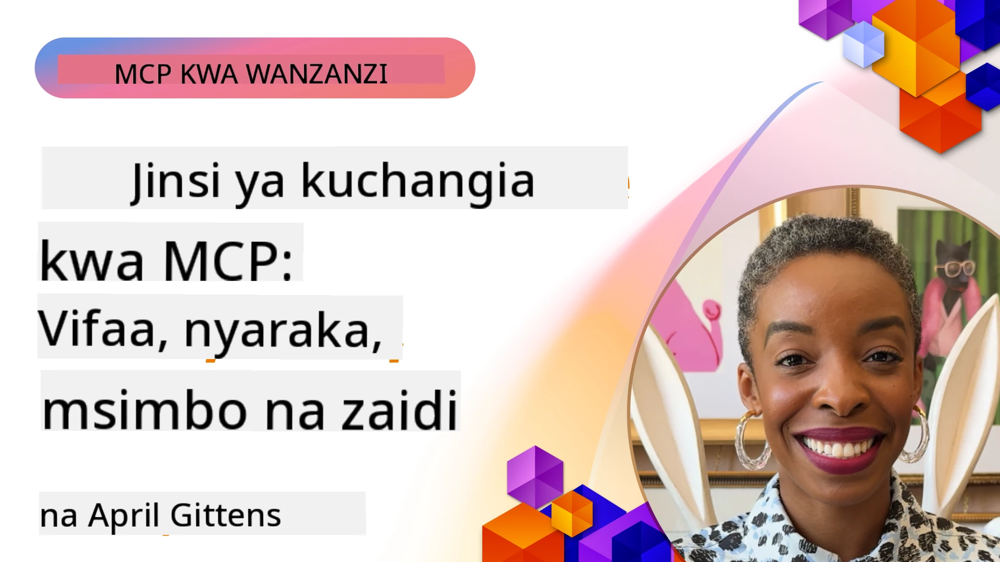

# Jamii na Michango

[](https://youtu.be/v1pvCYAWpRE)

_(Bonyeza picha hapo juu kutazama video ya somo hili)_

## Muhtasari

Somo hili linazingatia jinsi ya kushiriki na jamii ya MCP, kuchangia kwenye mfumo wa MCP, na kufuata mbinu bora za maendeleo ya ushirikiano. Kuelewa jinsi ya kushiriki katika miradi ya wazi ya MCP ni muhimu kwa wale wanaotaka kuunda mustakabali wa teknolojia hii.

## Malengo ya Kujifunza

Mwishoni mwa somo hili, utaweza:

- Kuelewa muundo wa jamii na mfumo wa MCP
- Kushiriki kwa ufanisi katika mijadala na majukwaa ya jamii ya MCP
- Kuchangia katika hazina za awali za MCP
- Kuunda na kushiriki vifaa vya MCP vilivyobinafsishwa na seva
- Kufuata mbinu bora za maendeleo na ushirikiano wa MCP
- Kugundua rasilimali za jamii na mifumo ya maendeleo ya MCP

## Mfumo wa Jamii wa MCP

Mfumo wa MCP unajumuisha vipengele mbalimbali na washiriki wanaofanya kazi pamoja kusukuma mbele itifaki.

### Vipengele Muhimu vya Jamii

1. **Watunzaji wa Itifaki ya Msingi**: [Shirika rasmi la GitHub la Model Context Protocol](https://github.com/modelcontextprotocol) linatunza mahitaji ya msingi ya MCP na utekelezaji wa marejeleo
2. **Waendelezaji wa Vifaa**: Watu binafsi na timu zinazounda vifaa na seva za MCP
3. **Watoa Huduma za Muunganisho**: Makampuni yanayounganisha MCP katika bidhaa na huduma zao
4. **Watumiaji wa Mwisho**: Waendelezaji na mashirika yanayotumia MCP katika programu zao
5. **Wachangiaji**: Wanajamii wanaochangia msimbo, nyaraka, au rasilimali nyingine

### Rasilimali za Jamii

#### Vituo Rasmi

- [Shirika la MCP GitHub](https://github.com/modelcontextprotocol)
- [Nyaraka za MCP](https://modelcontextprotocol.io/)
- [Mahitaji ya MCP](https://modelcontextprotocol.io/specification/2026-07-28/)
- [Mijadala ya GitHub](https://github.com/orgs/modelcontextprotocol/discussions)
- [Hazina ya Mifano na Seva za MCP](https://github.com/modelcontextprotocol/servers)

#### Rasilimali Zinazotokana na Jamii

- [Wateja wa MCP](https://modelcontextprotocol.io/clients) - Orodha ya wateja wanaounga mkono mwingiliano wa MCP
- [Seva za Jamii za MCP](https://github.com/modelcontextprotocol/servers?tab=readme-ov-file#-community-servers) - Orodha inayoongezeka ya seva za MCP zilizotengenezwa na jamii
- [Seva Bora za MCP](https://github.com/wong2/awesome-mcp-servers) - Orodha iliyoratibiwa ya seva za MCP
- [PulseMCP](https://www.pulsemcp.com/) - Kituo cha jamii & jarida la kukutana na rasilimali za MCP
- [Remote OpenClaw](https://www.remoteopenclaw.com/) - Orodha ya bure inayotafutika ya seva za MCP, ujuzi wa mawakala, na viongeza
- [Seva ya Discord](https://discord.gg/jHEGxQu2a5) - Ungana na waendelezaji wa MCP
- Utekelezaji wa SDK wa lugha maalum
- Makala za blogu na mafunzo

## Kuchangia MCP

### Aina za Michango

Mfumo wa MCP unakaribisha aina mbalimbali za michango:

1. **Michango ya Msimbo**:
   - Maboresho ya itifaki ya msingi
   - Marekebisho ya mende
   - Utekelezaji wa vifaa na seva
   - Maktaba za mteja/seva katika lugha tofauti

2. **Nyaraka**:
   - Kuboresha nyaraka zilizopo
   - Kuunda mafunzo na mwongozo
   - Kutafsiri nyaraka
   - Kuunda mifano na programu za mfano

3. **Msaada wa Jamii**:
   - Kujibu maswali kwenye majukwaa na mijadala
   - Kupima na kuripoti matatizo
   - Kuandaa matukio ya jamii
   - Kuwashauri wachangiaji wapya

### Mchakato wa Michango: Itifaki ya Msingi

Ili kuchangia kwenye itifaki ya msingi ya MCP au utekelezaji rasmi, fuata kanuni hizi kutoka kwa [mwelekeo rasmi wa michango](https://github.com/modelcontextprotocol/modelcontextprotocol/blob/main/CONTRIBUTING.md):

1. **Urahisi na Ufadhili**: Mahitaji ya MCP yanahifadhi viwango vya juu vya kuongeza dhana mpya. Ni rahisi kuongeza mambo kwenye mahitaji kuliko kuondoa.

2. **Mbinu Thabiti**: Mabadiliko ya mahitaji yanapaswa kutegemea changamoto maalum za utekelezaji, si mawazo ya dhana.

3. **Madarasa ya Pendekezo**:
   - Elezea: Chunguza tatizo, thibitisha kuwa watumiaji wengine wa MCP wanakumbana na tatizo kama hilo
   - Mfano: Jenga suluhisho la mfano na uonyeshe matumizi yake ya vitendo
   - Andika: Kwa msingi wa mfano, andika pendekezo la mahitaji

### Kuanzisha Mazingira ya Maendeleo

```bash
# Gawanya hifadhi
git clone https://github.com/YOUR-USERNAME/modelcontextprotocol.git
cd modelcontextprotocol

# Sakinisha utegemezi
npm install

# Kwa mabadiliko ya skimu, hakiki na tengeneza schema.json:
npm run check:schema:ts
npm run generate:schema

# Kwa mabadiliko ya nyaraka
npm run check:docs
npm run format

# Angalia nyaraka kwa ndani (hiari):
npm run serve:docs
```

### Mfano: Kuchangia Marekebisho ya Mende

```javascript
// Nambari ya asili yenye hitilafu katika typescript-sdk
export function validateResource(resource: unknown): resource is MCPResource {
  if (!resource || typeof resource !== 'object') {
    return false;
  }
  
  // Hitilafu: Ukaguzi wa mali umechukuliwa
  // Utekelezaji wa sasa:
  const hasName = 'name' in resource;
  const hasSchema = 'schema' in resource;
  
  return hasName && hasSchema;
}

// Utekelezaji uliorekebishwa katika mchango
export function validateResource(resource: unknown): resource is MCPResource {
  if (!resource || typeof resource !== 'object') {
    return false;
  }
  
  // Ukaguzi ulioboreshwa
  const hasName = 'name' in resource && typeof (resource as MCPResource).name === 'string';
  const hasSchema = 'schema' in resource && typeof (resource as MCPResource).schema === 'object';
  const hasDescription = !('description' in resource) || typeof (resource as MCPResource).description === 'string';
  
  return hasName && hasSchema && hasDescription;
}
```

### Mfano: Kuchangia Kifaa Kipya kwa Maktaba ya Kiwango

```python
# Mchango wa mfano: Chombo cha usindikaji wa data ya CSV kwa maktaba ya kawaida ya MCP

from mcp_tools import Tool, ToolRequest, ToolResponse, ToolExecutionException
import pandas as pd
import io
import json
from typing import Dict, Any, List, Optional

class CsvProcessingTool(Tool):
    """
    Tool for processing and analyzing CSV data.
    
    This tool allows models to extract information from CSV files,
    run basic analysis, and convert data between formats.
    """
    
    def get_name(self):
        return "csvProcessor"
        
    def get_description(self):
        return "Processes and analyzes CSV data"
    
    def get_schema(self):
        return {
            "type": "object",
            "properties": {
                "csvData": {
                    "type": "string", 
                    "description": "CSV data as a string"
                },
                "csvUrl": {
                    "type": "string",
                    "description": "URL to a CSV file (alternative to csvData)"
                },
                "operation": {
                    "type": "string",
                    "enum": ["summary", "filter", "transform", "convert"],
                    "description": "Operation to perform on the CSV data"
                },
                "filterColumn": {
                    "type": "string",
                    "description": "Column to filter by (for filter operation)"
                },
                "filterValue": {
                    "type": "string",
                    "description": "Value to filter for (for filter operation)"
                },
                "outputFormat": {
                    "type": "string",
                    "enum": ["json", "csv", "markdown"],
                    "default": "json",
                    "description": "Output format for the processed data"
                }
            },
            "oneOf": [
                {"required": ["csvData", "operation"]},
                {"required": ["csvUrl", "operation"]}
            ]
        }
    
    async def execute_async(self, request: ToolRequest) -> ToolResponse:
        try:
            # Chukua vigezo
            operation = request.parameters.get("operation")
            output_format = request.parameters.get("outputFormat", "json")
            
            # Pata data ya CSV kutoka kwa data ya moja kwa moja au URL
            df = await self._get_dataframe(request)
            
            # Fanya kazi kulingana na operesheni iliyotakiwa
            result = {}
            
            if operation == "summary":
                result = self._generate_summary(df)
            elif operation == "filter":
                column = request.parameters.get("filterColumn")
                value = request.parameters.get("filterValue")
                if not column:
                    raise ToolExecutionException("filterColumn is required for filter operation")
                result = self._filter_data(df, column, value)
            elif operation == "transform":
                result = self._transform_data(df, request.parameters)
            elif operation == "convert":
                result = self._convert_format(df, output_format)
            else:
                raise ToolExecutionException(f"Unknown operation: {operation}")
            
            return ToolResponse(result=result)
        
        except Exception as e:
            raise ToolExecutionException(f"CSV processing failed: {str(e)}")
    
    async def _get_dataframe(self, request: ToolRequest) -> pd.DataFrame:
        """Gets a pandas DataFrame from either CSV data or URL"""
        if "csvData" in request.parameters:
            csv_data = request.parameters.get("csvData")
            return pd.read_csv(io.StringIO(csv_data))
        elif "csvUrl" in request.parameters:
            csv_url = request.parameters.get("csvUrl")
            return pd.read_csv(csv_url)
        else:
            raise ToolExecutionException("Either csvData or csvUrl must be provided")
    
    def _generate_summary(self, df: pd.DataFrame) -> Dict[str, Any]:
        """Generates a summary of the CSV data"""
        return {
            "columns": df.columns.tolist(),
            "rowCount": len(df),
            "columnCount": len(df.columns),
            "numericColumns": df.select_dtypes(include=['number']).columns.tolist(),
            "categoricalColumns": df.select_dtypes(include=['object']).columns.tolist(),
            "sampleRows": json.loads(df.head(5).to_json(orient="records")),
            "statistics": json.loads(df.describe().to_json())
        }
    
    def _filter_data(self, df: pd.DataFrame, column: str, value: str) -> Dict[str, Any]:
        """Filters the DataFrame by a column value"""
        if column not in df.columns:
            raise ToolExecutionException(f"Column '{column}' not found")
            
        filtered_df = df[df[column].astype(str).str.contains(value)]
        
        return {
            "originalRowCount": len(df),
            "filteredRowCount": len(filtered_df),
            "data": json.loads(filtered_df.to_json(orient="records"))
        }
    
    def _transform_data(self, df: pd.DataFrame, params: Dict[str, Any]) -> Dict[str, Any]:
        """Transforms the data based on parameters"""
        # Utekelezaji ungejumuisha mabadiliko mbalimbali
        return {
            "status": "success",
            "message": "Transformation applied"
        }
    
    def _convert_format(self, df: pd.DataFrame, format: str) -> Dict[str, Any]:
        """Converts the DataFrame to different formats"""
        if format == "json":
            return {
                "data": json.loads(df.to_json(orient="records")),
                "format": "json"
            }
        elif format == "csv":
            return {
                "data": df.to_csv(index=False),
                "format": "csv"
            }
        elif format == "markdown":
            return {
                "data": df.to_markdown(),
                "format": "markdown"
            }
        else:
            raise ToolExecutionException(f"Unsupported output format: {format}")
```

### Miongozo ya Michango

Ili kufanya mchango wenye mafanikio kwa miradi ya MCP:

1. **Anza Kidogo**: Anza na nyaraka, marekebisho ya mende, au maboresho madogo
2. **Fuata Mwongozo wa Mtindo**: Zingatia mtindo wa usimbaji wa mradi
3. **Andika Vipimo**: Jumuisha vipimo vya kitengo kwa michango yako ya msimbo
4. **Andika Nyaraka za Kazi Yako**: Ongeza nyaraka wazi kwa vipengele vipya au mabadiliko
5. **Tuma PR Zilizoelekezwa**: Fanya maombi ya kuburuta yenye lengo moja la tatizo au kipengele
6. **Shirikiana na Maoni**: Jibu kwa tija maoni juu ya michango yako

### Mfano wa Mtiririko wa Michango

```bash
# Nakili hifadhi
git clone https://github.com/modelcontextprotocol/typescript-sdk.git
cd typescript-sdk

# Unda tawi jipya kwa mchango wako
git checkout -b feature/my-contribution

# Fanya mabadiliko yako
# ...

# Endesha vipimo kuhakikisha mabadiliko yako hayaivunji utendaji uliopo
npm test

# Jitolee mabadiliko yako ukiwa na ujumbe wa maelezo
git commit -am "Fix validation in resource handler"

# Sogeza tawi lako kwenye toleo lako
git push origin feature/my-contribution

# Tengeneza ombi la kuvuta kutoka tawi lako kwenda kwenye hifadhi kuu
# Kisha shiriki maoni na rudia kwenye PR yako kama inavyohitajika
```

## Kuunda na Kushiriki Seva za MCP

Njia moja yenye thamani ya kuchangia mfumo wa MCP ni kuunda na kushiriki seva za MCP zilizobinafsishwa. Jamii tayari imetengeneza mamia ya seva kwa huduma na matumizi mbalimbali.

### Mifumo ya Maendeleo ya Seva za MCP

Mifumo kadhaa ipo kusaidia kuwezesha maendeleo ya seva za MCP kwa urahisi:

1. **SDK Rasmi** (angalia
    [nyaraka za SDK](https://modelcontextprotocol.io/docs/sdk) kwa kila
    mabadiliko ya itifaki zinazoungwa mkono na SDK):
   - [TypeScript SDK](https://github.com/modelcontextprotocol/typescript-sdk)
   - [Python SDK](https://github.com/modelcontextprotocol/python-sdk)
   - [C# SDK](https://github.com/modelcontextprotocol/csharp-sdk)
   - [Go SDK](https://github.com/modelcontextprotocol/go-sdk)
   - [Java SDK](https://github.com/modelcontextprotocol/java-sdk)
   - [Kotlin SDK](https://github.com/modelcontextprotocol/kotlin-sdk)
   - [Swift SDK](https://github.com/modelcontextprotocol/swift-sdk)
   - [Rust SDK](https://github.com/modelcontextprotocol/rust-sdk)

2. **Mifumo ya Jamii**:
   - [MCP-Framework](https://mcp-framework.com/) - Tengeneza seva za MCP kwa uangalifu na kwa haraka kwa TypeScript
   - [MCP Declarative Java SDK](https://github.com/codeboyzhou/mcp-declarative-java-sdk) - Seva za MCP zinazoendeshwa kwa maelezo kwa Java
   - [Quarkus MCP Server SDK](https://github.com/quarkiverse/quarkus-mcp-server) - Mfumo wa Java kwa seva za MCP
   - [Next.js MCP Server Template](https://github.com/vercel-labs/mcp-for-next.js) - Mradi wa kuanzia Next.js kwa seva za MCP

### Kuendeleza Vifaa Vinavyoshirikishwa

#### Mfano wa .NET: Kuunda Kifurushi cha Kifaa Kinachoshirikishwa

```csharp
// Create a new .NET library project
// dotnet new classlib -n McpFinanceTools

using Microsoft.Mcp.Tools;
using System.Threading.Tasks;
using System.Net.Http;
using System.Text.Json;

namespace McpFinanceTools
{
    // Stock quote tool
    public class StockQuoteTool : IMcpTool
    {
        private readonly HttpClient _httpClient;
        
        public StockQuoteTool(HttpClient httpClient = null)
        {
            _httpClient = httpClient ?? new HttpClient();
        }
        
        public string Name => "stockQuote";
        public string Description => "Gets current stock quotes for specified symbols";
        
        public object GetSchema()
        {
            return new {
                type = "object",
                properties = new {
                    symbol = new { 
                        type = "string",
                        description = "Stock symbol (e.g., MSFT, AAPL)" 
                    },
                    includeHistory = new { 
                        type = "boolean",
                        description = "Whether to include historical data",
                        default = false
                    }
                },
                required = new[] { "symbol" }
            };
        }
        
        public async Task<ToolResponse> ExecuteAsync(ToolRequest request)
        {
            // Extract parameters
            string symbol = request.Parameters.GetProperty("symbol").GetString();
            bool includeHistory = false;
            
            if (request.Parameters.TryGetProperty("includeHistory", out var historyProp))
            {
                includeHistory = historyProp.GetBoolean();
            }
            
            // Call external API (example)
            var quoteResult = await GetStockQuoteAsync(symbol);
            
            // Add historical data if requested
            if (includeHistory)
            {
                var historyData = await GetStockHistoryAsync(symbol);
                quoteResult.Add("history", historyData);
            }
            
            // Return formatted result
            return new ToolResponse {
                Result = JsonSerializer.SerializeToElement(quoteResult)
            };
        }
        
        private async Task<Dictionary<string, object>> GetStockQuoteAsync(string symbol)
        {
            // Implementation would call a real stock API
            // This is a simplified example
            return new Dictionary<string, object>
            {
                ["symbol"] = symbol,
                ["price"] = 123.45,
                ["change"] = 2.5,
                ["percentChange"] = 1.2,
                ["lastUpdated"] = DateTime.UtcNow
            };
        }
        
        private async Task<object> GetStockHistoryAsync(string symbol)
        {
            // Implementation would get historical data
            // Simplified example
            return new[]
            {
                new { date = DateTime.Now.AddDays(-7).Date, price = 120.25 },
                new { date = DateTime.Now.AddDays(-6).Date, price = 122.50 },
                new { date = DateTime.Now.AddDays(-5).Date, price = 121.75 }
                // More historical data...
            };
        }
    }
}

// Create package and publish to NuGet
// dotnet pack -c Release
// dotnet nuget push bin/Release/McpFinanceTools.1.0.0.nupkg -s https://api.nuget.org/v3/index.json -k YOUR_API_KEY
```

#### Mfano wa Java: Kuunda Kifurushi cha Maven kwa Vifaa

```java
// usanidi wa pom.xml kwa kifurushi cha zana za MCP kinachoweza kushirikiwa
<!-- 
<project>
    <groupId>com.example</groupId>
    <artifactId>mcp-weather-tools</artifactId>
    <version>1.0.0</version>
    
    <dependencies>
        <dependency>
            <groupId>com.mcp</groupId>
            <artifactId>mcp-server</artifactId>
            <version>1.0.0</version>
        </dependency>
    </dependencies>
    
    <distributionManagement>
        <repository>
            <id>github</id>
            <name>GitHub Packages</name>
            <url>https://maven.pkg.github.com/username/mcp-weather-tools</url>
        </repository>
    </distributionManagement>
</project>
-->

package com.example.mcp.weather;

import com.mcp.tools.Tool;
import com.mcp.tools.ToolRequest;
import com.mcp.tools.ToolResponse;
import com.mcp.tools.ToolExecutionException;

import java.net.http.HttpClient;
import java.net.http.HttpRequest;
import java.net.http.HttpResponse;
import java.net.URI;
import java.util.HashMap;
import java.util.Map;

public class WeatherForecastTool implements Tool {
    private final HttpClient httpClient;
    private final String apiKey;
    
    public WeatherForecastTool(String apiKey) {
        this.httpClient = HttpClient.newHttpClient();
        this.apiKey = apiKey;
    }
    
    @Override
    public String getName() {
        return "weatherForecast";
    }
    
    @Override
    public String getDescription() {
        return "Gets weather forecast for a specified location";
    }
    
    @Override
    public Object getSchema() {
        Map<String, Object> schema = new HashMap<>();
        // Ufafanuzi wa muundo...
        return schema;
    }
    
    @Override
    public ToolResponse execute(ToolRequest request) {
        try {
            String location = request.getParameters().get("location").asText();
            int days = request.getParameters().has("days") ? 
                request.getParameters().get("days").asInt() : 3;
            
            // Piga API ya hali ya hewa
            Map<String, Object> forecast = getForecast(location, days);
            
            // Jenga jibu
            return new ToolResponse.Builder()
                .setResult(forecast)
                .build();
        } catch (Exception ex) {
            throw new ToolExecutionException("Weather forecast failed: " + ex.getMessage(), ex);
        }
    }
    
    private Map<String, Object> getForecast(String location, int days) {
        // Utekelezaji utapiga API ya hali ya hewa
        // Mfano ulio rahisishwa
        Map<String, Object> result = new HashMap<>();
        // Ongeza data ya utabiri...
        return result;
    }
}

// Jenga na chapisha kwa kutumia Maven
// mvn clean package
// mvn deploy
```

#### Mfano wa Python: Kuchapisha Kifurushi cha PyPI

```python
# Muundo wa saraka kwa kifurushi cha PyPI:
# mcp_nlp_tools/
# ├── LESENI
# ├── README.md
# ├── setup.py
# ├── mcp_nlp_tools/
# │   ├── __init__.py
# │   ├── sentiment_tool.py
# │   └── translation_tool.py

# Mfano wa setup.py
"""
from setuptools import setup, find_packages

setup(
    name="mcp_nlp_tools",
    version="0.1.0",
    packages=find_packages(),
    install_requires=[
        "mcp_server>=1.0.0",
        "transformers>=4.0.0",
        "torch>=1.8.0"
    ],
    author="Your Name",
    author_email="your.email@example.com",
    description="MCP tools for natural language processing tasks",
    long_description=open("README.md").read(),
    long_description_content_type="text/markdown",
    url="https://github.com/username/mcp_nlp_tools",
    classifiers=[
        "Programming Language :: Python :: 3",
        "License :: OSI Approved :: MIT License",
        "Operating System :: OS Independent",
    ],
    python_requires=">=3.8",
)
"""

# Mfano wa utekelezaji wa chombo cha NLP (sentiment_tool.py)
from mcp_tools import Tool, ToolRequest, ToolResponse, ToolExecutionException
from transformers import pipeline
import torch

class SentimentAnalysisTool(Tool):
    """MCP tool for sentiment analysis of text"""
    
    def __init__(self, model_name="distilbert-base-uncased-finetuned-sst-2-english"):
        # Pakua mfano wa uchambuzi wa hisia
        self.sentiment_analyzer = pipeline("sentiment-analysis", model=model_name)
    
    def get_name(self):
        return "sentimentAnalysis"
        
    def get_description(self):
        return "Analyzes the sentiment of text, classifying it as positive or negative"
    
    def get_schema(self):
        return {
            "type": "object",
            "properties": {
                "text": {
                    "type": "string", 
                    "description": "The text to analyze for sentiment"
                },
                "includeScore": {
                    "type": "boolean",
                    "description": "Whether to include confidence scores",
                    "default": True
                }
            },
            "required": ["text"]
        }
    
    async def execute_async(self, request: ToolRequest) -> ToolResponse:
        try:
            # Chimba vigezo
            text = request.parameters.get("text")
            include_score = request.parameters.get("includeScore", True)
            
            # Changanua hisia
            sentiment_result = self.sentiment_analyzer(text)[0]
            
            # Panga matokeo
            result = {
                "sentiment": sentiment_result["label"],
                "text": text
            }
            
            if include_score:
                result["score"] = sentiment_result["score"]
            
            # Rudisha matokeo
            return ToolResponse(result=result)
            
        except Exception as e:
            raise ToolExecutionException(f"Sentiment analysis failed: {str(e)}")

# Ili kuchapisha:
# python setup.py sdist bdist_wheel
# python -m twine upload dist/*
```

### Kushiriki Mbinu Bora

Unaposhiriki vifaa vya MCP na jamii:

1. **Nyaraka Kamili**:
   - Andika kusudi, matumizi, na mifano
   - Eleza vigezo na thamani zinazotolewa
   - Andika utegemezi wowote wa nje

2. **Kutunza Makosa**:
   - Tekeleza utunzaji mzuri wa makosa
   - Toa ujumbe wa makosa wenye msaada
   - Shughulikia matukio mgumu kwa upole

3. **Kuzingatia Utendaji**:
   - Boresha kwa kasi na matumizi ya rasilimali
   - Tekeleza kuhifadhi data inapofaa
   - Zingatia ufanisi wa kupanuka

4. **Usalama**:
   - Tumia funguo za API salama na uthibitishaji
   - Thibitisha na safisha maingizo
   - Tekeleza kupunguza mwendo wa wito wa API za nje

5. **Upimaji**:
   - Jumuisha kufunikwa kwa vipimo kwa kina
   - Pima kwa aina mbalimbali za maingizo na matukio mgumu
   - Andika taratibu za upimaji

## Ushirikiano wa Jamii na Mbinu Bora

Ushirikiano mzuri ni muhimu kwa ukuaji wa mfumo wa MCP.

### Vituo vya Mawasiliano

- Masuala na Mijadala ya GitHub
- Jamii ya Teknolojia ya Microsoft
- Vituo vya Discord na Slack
- Stack Overflow (alama: `model-context-protocol` au `mcp`)

### Mapitio ya Msimbo

Unapopitia michango ya MCP:

1. **Uwazi**: Je, msimbo ni wazi na umeandikwa nyaraka vizuri?
2. **Usahihi**: Je, unafanya kazi kama inavyotarajiwa?
3. **Ulinganifu**: Je, unafuata desturi za mradi?
4. **Ukamilifu**: Je, vipimo na nyaraka vimejumuishwa?
5. **Usalama**: Je, kuna masuala yoyote ya usalama?

### Ulinganifu wa Toleo

Unapofanya maendeleo kwa MCP:

1. **Toleo la Itifaki**: Fuata toleo la itifaki ya MCP ambalo kifaa chako kinaunga mkono
2. **Ulinganifu wa Mteja**: Zingatia ulinganifu wa nyuma
3. **Ulinganifu wa Seva**: Fuata miongozo ya utekelezaji wa seva
4. **Mabadiliko Yanayovunja**: Andika wazi mabadiliko yanayovunja

## Mfano wa Mradi wa Jamii: Usajili wa Vifaa vya MCP

Mchango muhimu wa jamii unaweza kuwa kuunda rejista ya umma ya vifaa vya MCP.

```python
# Mfano wa mpangilio kwa API ya rejista ya zana za jamii

from fastapi import FastAPI, HTTPException, Depends
from pydantic import BaseModel, Field, HttpUrl
from typing import List, Optional
import datetime
import uuid

# Mifano kwa rejista ya zana
class ToolSchema(BaseModel):
    """JSON Schema for a tool"""
    type: str
    properties: dict
    required: List[str] = []

class ToolRegistration(BaseModel):
    """Information for registering a tool"""
    name: str = Field(..., description="Unique name for the tool")
    description: str = Field(..., description="Description of what the tool does")
    version: str = Field(..., description="Semantic version of the tool")
    schema: ToolSchema = Field(..., description="JSON Schema for tool parameters")
    author: str = Field(..., description="Author of the tool")
    repository: Optional[HttpUrl] = Field(None, description="Repository URL")
    documentation: Optional[HttpUrl] = Field(None, description="Documentation URL")
    package: Optional[HttpUrl] = Field(None, description="Package URL")
    tags: List[str] = Field(default_factory=list, description="Tags for categorization")
    examples: List[dict] = Field(default_factory=list, description="Example usage")

class Tool(ToolRegistration):
    """Tool with registry metadata"""
    id: uuid.UUID = Field(default_factory=uuid.uuid4)
    created_at: datetime.datetime = Field(default_factory=datetime.datetime.now)
    updated_at: datetime.datetime = Field(default_factory=datetime.datetime.now)
    downloads: int = Field(default=0)
    rating: float = Field(default=0.0)
    ratings_count: int = Field(default=0)

# Programu ya FastAPI kwa rejista
app = FastAPI(title="MCP Tool Registry")

# Hifadhidata ya ndani kwa mfano huu
tools_db = {}

@app.post("/tools", response_model=Tool)
async def register_tool(tool: ToolRegistration):
    """Register a new tool in the registry"""
    if tool.name in tools_db:
        raise HTTPException(status_code=400, detail=f"Tool '{tool.name}' already exists")
    
    new_tool = Tool(**tool.dict())
    tools_db[tool.name] = new_tool
    return new_tool

@app.get("/tools", response_model=List[Tool])
async def list_tools(tag: Optional[str] = None):
    """List all registered tools, optionally filtered by tag"""
    if tag:
        return [tool for tool in tools_db.values() if tag in tool.tags]
    return list(tools_db.values())

@app.get("/tools/{tool_name}", response_model=Tool)
async def get_tool(tool_name: str):
    """Get information about a specific tool"""
    if tool_name not in tools_db:
        raise HTTPException(status_code=404, detail=f"Tool '{tool_name}' not found")
    return tools_db[tool_name]

@app.delete("/tools/{tool_name}")
async def delete_tool(tool_name: str):
    """Delete a tool from the registry"""
    if tool_name not in tools_db:
        raise HTTPException(status_code=404, detail=f"Tool '{tool_name}' not found")
    del tools_db[tool_name]
    return {"message": f"Tool '{tool_name}' deleted"}
```

## Mambo Muhimu Kukumbuka

- Jamii ya MCP ni tofauti na inakaribisha aina mbalimbali za michango
- Kuchangia MCP kunaweza kuanzia maboresho ya itifaki ya msingi hadi vifaa maalum
- Kufuata miongozo ya michango huongeza nafasi ya PR yako kukubaliwa
- Kuunda na kushiriki vifaa vya MCP ni njia yenye thamani ya kuboresha mfumo
- Ushirikiano wa jamii ni muhimu kwa ukuaji na kuboresha MCP

## Mazoezi

1. Tambua eneo katika mfumo wa MCP ambapo unaweza kuchangia kulingana na ujuzi na maslahi yako
2. Fanya fork ya hazina ya MCP na weka mazingira ya maendeleo ya eneo lako
3. Tengeneza maboresho madogo, marekebisho ya mende, au kifaa kinachowanufaisha jamii
4. Andika nyaraka za mchango wako pamoja na vipimo na nyaraka sahihi
5. Tuma ombi la buruta kwa hazina inayofaa

## Rasilimali Zaidi

- [Miradi ya Jamii ya MCP](https://github.com/topics/model-context-protocol)

---

## Nini Kifuatacho

Ifuatayo: [Mafunzo Kutoka kwa Utekelezaji wa Mapema](../07-LessonsfromEarlyAdoption/README.md)

---

<!-- CO-OP TRANSLATOR DISCLAIMER START -->
**Kionyozo**:
Hati hii imetafsiriwa kwa kutumia huduma ya tafsiri ya AI [Co-op Translator](https://github.com/Azure/co-op-translator). Ingawa tunajitahidi kupata usahihi, tafadhali fahamu kwamba tafsiri za kiotomatiki zinaweza kuwa na makosa au upungufu wa usahihi. Hati ya asili katika lugha yake halisi inapaswa kuchukuliwa kama chanzo cha mamlaka. Kwa taarifa muhimu, tafsiri ya kitaalamu inayofanywa na binadamu inapendekezwa. Hatutojibu kwa kuelewa vibaya au tafsiri potofu zinazotokea kutokana na matumizi ya tafsiri hii.
<!-- CO-OP TRANSLATOR DISCLAIMER END -->