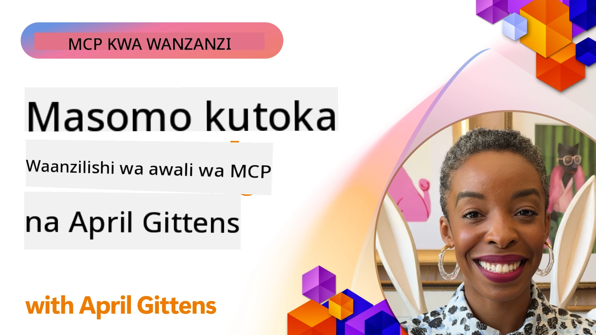

# 🌟 Mafunzo kutoka kwa Watumiaji wa Mapema

[](https://youtu.be/jds7dSmNptE)

_(Bofya picha hapo juu kutazama video ya somo hili)_

## 🎯 Kile Kifunzo Hiki Kinachojumuisha

Kifundo hiki kinaangazia jinsi mashirika halisi na waendelezaji wanavyotumia Model Context Protocol (MCP) kutatua changamoto halisi na kuendesha ubunifu. Kupitia masomo ya kina, miradi ya vitendo, na mifano ya matumizi, utagundua jinsi MCP inavyowezesha ujumuishaji salama, unaoweza kupanuka wa AI unaounganisha mifano ya lugha, zana, na data za kampuni.

### 📚 Tazama MCP Katika Kutenda

Unataka kuona kanuni hizi zikitumika kwa zana tayari kwa uzalishaji? Angalia [**Seva 10 za Microsoft MCP Zinazobadilisha Matokeo ya Waendelezaji**](microsoft-mcp-servers.md), zinazowakilisha seva halisi za Microsoft MCP unazoweza kutumia leo.

## Muhtasari

Somo hili linaangazia jinsi watumiaji wa mapema walivyotumia Model Context Protocol (MCP) kutatua changamoto za kweli na kuendesha ubunifu katika sekta mbalimbali. Kupitia masomo ya kina na miradi ya vitendo, utaona jinsi MCP inavyowezesha ujumuishaji wa AI uliosawazishwa, ulio salama, na unaoweza kupanuka—kuunganisha mifano mikubwa ya lugha, zana, na data za kampuni kwa mfumo mmoja. Utapata uzoefu wa vitendo wa kubuni na kujenga suluhisho za MCP, kujifunza kutoka kwa mifumo ya utekelezaji iliyothibitishwa, na kugundua mbinu bora za kuanzisha MCP katika mazingira ya uzalishaji. Somo pia linaangazia mwelekeo unaochipuka, mwelekeo wa baadaye, na rasilimali za chanzo huria kusaidia kukaa mstari wa mbele wa teknolojia ya MCP na mfumo wake unaoendelea.

## Malengo ya Kujifunza

- Kuchambua utekelezaji halisi wa MCP katika sekta mbalimbali
- Kubuni na kujenga matumizi kamili yanayotegemea MCP
- Kuchunguza mwelekeo unaochipuka na mwelekeo wa baadaye katika teknolojia ya MCP
- Kutumia mbinu bora katika mazingira halisi ya maendeleo

## Utekelezaji Wa MCP Katika Uhalisia

### Somo la Kesi 1: Uendeshaji wa Usaidizi wa Wateja Kampuni

Kampuni ya kimataifa ilitekeleza suluhisho linalotegemea MCP ili kusawazisha mwingiliano wa AI katika mifumo yao ya usaidizi wa wateja. Hii iliwaruhusu:

- Kuunda interface moja kwa watoa huduma mbalimbali wa LLM
- Kudumisha usimamizi thabiti wa maelekezo kati ya idara
- Kutekeleza udhibiti wa usalama na ulinganifu
- Kubadilisha kwa urahisi kati ya mifano tofauti ya AI kulingana na mahitaji maalum

**Utekelezaji wa Kiufundi:**

```python
# Utekelezaji wa seva ya MCP ya Python kwa msaada wa wateja
import logging
import asyncio
from modelcontextprotocol import create_server, ServerConfig
from modelcontextprotocol.server import MCPServer
from modelcontextprotocol.transports import create_http_transport
from modelcontextprotocol.resources import ResourceDefinition
from modelcontextprotocol.prompts import PromptDefinition
from modelcontextprotocol.tool import ToolDefinition

# Sanidi uandishi wa kumbukumbu
logging.basicConfig(level=logging.INFO)

async def main():
    # Unda usanidi wa seva
    config = ServerConfig(
        name="Enterprise Customer Support Server",
        version="1.0.0",
        description="MCP server for handling customer support inquiries"
    )
    
    # Anzisha seva ya MCP
    server = create_server(config)
    
    # Sajili rasilimali za msingi wa maarifa
    server.resources.register(
        ResourceDefinition(
            name="customer_kb",
            description="Customer knowledge base documentation"
        ),
        lambda params: get_customer_documentation(params)
    )
    
    # Sajili templeti za vidokezo
    server.prompts.register(
        PromptDefinition(
            name="support_template",
            description="Templates for customer support responses"
        ),
        lambda params: get_support_templates(params)
    )
    
    # Sajili zana za msaada
    server.tools.register(
        ToolDefinition(
            name="ticketing",
            description="Create and update support tickets"
        ),
        handle_ticketing_operations
    )
    
    # Anzisha seva kwa usafirishaji wa HTTP
    transport = create_http_transport(port=8080)
    await server.run(transport)

if __name__ == "__main__":
    asyncio.run(main())
```

**Matokeo:** Kupungua kwa gharama za mfano kwa 30%, kuboreshwa kwa ulinganifu wa majibu kwa 45%, na uboreshaji wa ulinganifu katika operesheni za kimataifa.

### Somo la Kesi 2: Msaidizi wa Uchunguzi wa Afya

Mtoa huduma ya afya alitengeneza miundombinu ya MCP kuunganisha mifano mingi maalum ya AI ya tiba huku akiweka uhakika wa usiri wa data nyeti za wagonjwa:

- Kubadilisha kwa urahisi kati ya mifano ya tiba ya jumla na maalum
- Udhibiti mkali wa faragha na rekodi za ukaguzi
- Ujumbe na mifumo ya Rekodi za Afya za Kielektroniki (EHR) zilizopo
- Ufundi thabiti wa maelekezo kwa istilahi za tiba

**Utekelezaji wa Kiufundi:**

```csharp
// C# MCP host application implementation in healthcare application
using Microsoft.Extensions.DependencyInjection;
using ModelContextProtocol.SDK.Client;
using ModelContextProtocol.SDK.Security;
using ModelContextProtocol.SDK.Resources;

public class DiagnosticAssistant
{
    private readonly MCPHostClient _mcpClient;
    private readonly PatientContext _patientContext;
    
    public DiagnosticAssistant(PatientContext patientContext)
    {
        _patientContext = patientContext;
        
        // Configure MCP client with healthcare-specific settings
        var clientOptions = new ClientOptions
        {
            Name = "Healthcare Diagnostic Assistant",
            Version = "1.0.0",
            Security = new SecurityOptions
            {
                Encryption = EncryptionLevel.Medical,
                AuditEnabled = true
            }
        };
        
        _mcpClient = new MCPHostClientBuilder()
            .WithOptions(clientOptions)
            .WithTransport(new HttpTransport("https://healthcare-mcp.example.org"))
            .WithAuthentication(new HIPAACompliantAuthProvider())
            .Build();
    }
    
    public async Task<DiagnosticSuggestion> GetDiagnosticAssistance(
        string symptoms, string patientHistory)
    {
        // Create request with appropriate resources and tool access
        var resourceRequest = new ResourceRequest
        {
            Name = "patient_records",
            Parameters = new Dictionary<string, object>
            {
                ["patientId"] = _patientContext.PatientId,
                ["requestingProvider"] = _patientContext.ProviderId
            }
        };
        
        // Request diagnostic assistance using appropriate prompt
        var response = await _mcpClient.SendPromptRequestAsync(
            promptName: "diagnostic_assistance",
            parameters: new Dictionary<string, object>
            {
                ["symptoms"] = symptoms,
                patientHistory = patientHistory,
                relevantGuidelines = _patientContext.GetRelevantGuidelines()
            });
            
        return DiagnosticSuggestion.FromMCPResponse(response);
    }
}
```

**Matokeo:** Maboresho ya mapendekezo ya uchunguzi kwa madaktari huku ukidumisha ulinganifu kamili na HIPAA na kupungua kwa mabadiliko ya muktadha kati ya mifumo.

### Somo la Kesi 3: Uchambuzi wa Hatari za Huduma za Kifedha

Taasisi ya kifedha ilitekeleza MCP kusawazisha michakato yao ya uchambuzi wa hatari katika idara tofauti:

- Kuunda interface moja kwa mifano ya hatari ya mikopo, kugundua ulaghai, na uwekezaji
- Kutekeleza udhibiti mkali wa upatikanaji na toleo la mfano
- Kuhakikisha rekodi zote za mapendekezo ya AI zinapatikana kwa ukaguzi
- Kudumisha muundo thabiti wa data katika mifumo mingi

**Utekelezaji wa Kiufundi:**

```java
// Serveri ya MCP ya Java kwa tathmini ya hatari za kifedha
import org.mcp.server.*;
import org.mcp.security.*;

public class FinancialRiskMCPServer {
    public static void main(String[] args) {
        // Unda serveri ya MCP yenye vipengele vya ufuataji wa kifedha
        MCPServer server = new MCPServerBuilder()
            .withModelProviders(
                new ModelProvider("risk-assessment-primary", new AzureOpenAIProvider()),
                new ModelProvider("risk-assessment-audit", new LocalLlamaProvider())
            )
            .withPromptTemplateDirectory("./compliance/templates")
            .withAccessControls(new SOCCompliantAccessControl())
            .withDataEncryption(EncryptionStandard.FINANCIAL_GRADE)
            .withVersionControl(true)
            .withAuditLogging(new DatabaseAuditLogger())
            .build();
            
        server.addRequestValidator(new FinancialDataValidator());
        server.addResponseFilter(new PII_RedactionFilter());
        
        server.start(9000);
        
        System.out.println("Financial Risk MCP Server running on port 9000");
    }
}
```

**Matokeo:** Kuboresha ulinganifu wa ulinganifu wa masharti, mizunguko ya haraka ya utekelezaji wa modeli kwa 40%, na kuboresha uthabiti wa uchambuzi wa hatari katika idara.

### Somo la Kesi 4: Seva ya Microsoft Playwright MCP kwa Uendeshaji wa Kivinjari

Microsoft ilitengeneza [seva ya Playwright MCP](https://github.com/microsoft/playwright-mcp) kuwezesha uendeshaji wa kivinjari salama, wa kiwango, kupitia Model Context Protocol. Seva hii tayari kwa uzalishaji inaruhusu mawakala wa AI na LLM kuingiliana na vivinjari vya wavuti kwa njia ya udhibiti, inayoweza kukaguliwa, na inayopanuka—ikirahisisha matumizi kama upimaji wa wavuti wa moja kwa moja, uchakatishaji wa data, na workflows za mwisho hadi mwisho.

> **🎯 Zana Tayari kwa Uzalishaji**
> 
> Somo hili la kesi linaonyesha seva halisi ya MCP unayoweza kutumia leo! Jifunze zaidi kuhusu Seva ya Playwright MCP na seva 9 nyingine za Microsoft MCP tayari kwa uzalishaji katika [**Mwongozo wa Seva za Microsoft MCP**](microsoft-mcp-servers.md#8--playwright-mcp-server).

**Sifa Muhimu:**
- Inatoa uwezo wa uendeshaji wa kivinjari (kuvinjari, kujaza fomu, kunasa picha ya skrini, n.k.) kama zana za MCP
- Inatekeleza udhibiti mkali wa upatikanaji na sandboxing kuzuia vitendo visivyoidhinishwa
- Inatoa rekodi za ukaguzi kwa undani kwa mwingiliano wote wa kivinjari
- Inasaidia ujumuishaji na Azure OpenAI na watoa huduma wengine wa LLM kwa uendeshaji unaoendeshwa na mawakala
- Inaendesha GitHub Copilot’s Coding Agent na uwezo wa kuvinjari wavuti

**Utekelezaji wa Kiufundi:**

```typescript
// TypeScript: Kusajili zana za uchezaji wa kivinjari za Playwright katika seva ya MCP
import { createServer, ToolDefinition } from 'modelcontextprotocol';
import { launch } from 'playwright';

const server = createServer({
  name: 'Playwright MCP Server',
  version: '1.0.0',
  description: 'MCP server for browser automation using Playwright'
});

// Sajili zana ya kuvinjari hadi URL na kuchukua picha ya skrini
server.tools.register(
  new ToolDefinition({
    name: 'navigate_and_screenshot',
    description: 'Navigate to a URL and capture a screenshot',
    parameters: {
      url: { type: 'string', description: 'The URL to visit' }
    }
  }),
  async ({ url }) => {
    const browser = await launch();
    const page = await browser.newPage();
    await page.goto(url);
    const screenshot = await page.screenshot();
    await browser.close();
    return { screenshot };
  }
);

// Anza seva ya MCP
server.listen(8080);
```

**Matokeo:**

- Iliruhusu uendeshaji wa kivinjari salama, wa mpangilio wa programu kwa mawakala wa AI na LLM
- Kupunguza juhudi za upimaji wa mikono na kuboresha upatikanaji wa upimaji kwa programu za wavuti
- Imetoa mfumo unaoweza kutumika tena, unaopanuka kwa ujumuishaji wa zana za kivinjari katika mazingira ya kampuni
- Inaendesha uwezo wa kuvinjari wavuti wa GitHub Copilot

**Marejeleo:**

- [Hifadhi ya GitHub ya Playwright MCP Server](https://github.com/microsoft/playwright-mcp)
- [Suluhisho za AI na Uendeshaji za Microsoft](https://azure.microsoft.com/en-us/products/ai-services/)

### Somo la Kesi 5: Azure MCP – Protokoli ya Mfano wa Muktadha wa Kiwango cha Kampuni kama Huduma

Azure MCP Server ([https://aka.ms/azmcp](https://aka.ms/azmcp)) ni utekelezaji wa Microsoft wa kiwango cha kampuni, wa MCP ulioendeshwa, ulioundwa kutoa uwezo wa seva ya MCP unaoweza kupanuka, salama, na unaolingana kama huduma ya wingu. Azure MCP inawawezesha mashirika kuanzisha, kusimamia, na kuunganisha seva za MCP na Azure AI, data, na huduma za usalama kwa haraka, kupunguza mzigo wa utendaji na kuharakisha matumizi ya AI.

> **🎯 Zana Tayari kwa Uzalishaji**
> 
> Hii ni seva halisi ya MCP unayoweza kutumia leo! Jifunze zaidi kuhusu Microsoft Foundry MCP Server katika [**Mwongozo wa Seva za Microsoft MCP**](microsoft-mcp-servers.md).


- Utoaji wa seva ya MCP yenye usimamizi kamili ikiwa na ugani, ufuatiliaji, na usalama uliyojengwa ndani
- Ujumuishaji wa asili na Azure OpenAI, Azure AI Search, na huduma zingine za Azure
- Uthibitishaji na ruhusa za kampuni kupitia Microsoft Entra ID
- Msaada kwa zana maalum, templeti za maelekezo, na viunganishi vya rasilimali
- Ulinganifu na mahitaji ya usalama na masharti ya kampuni

**Utekelezaji wa Kiufundi:**

```yaml
# Example: Azure MCP server deployment configuration (YAML)
apiVersion: mcp.microsoft.com/v1
kind: McpServer
metadata:
  name: enterprise-mcp-server
spec:
  modelProviders:
    - name: azure-openai
      type: AzureOpenAI
      endpoint: https://<your-openai-resource>.openai.azure.com/
      apiKeySecret: <your-azure-keyvault-secret>
  tools:
    - name: document_search
      type: AzureAISearch
      endpoint: https://<your-search-resource>.search.windows.net/
      apiKeySecret: <your-azure-keyvault-secret>
  authentication:
    type: EntraID
    tenantId: <your-tenant-id>
  monitoring:
    enabled: true
    logAnalyticsWorkspace: <your-log-analytics-id>
```

**Matokeo:**  
- Kupunguza muda kwenda thamani kwa miradi ya AI ya kampuni kwa kutoa jukwaa la seva ya MCP tayari kwa matumizi na linaloendana na masharti
- Kurahisisha ujumuishaji wa LLM, zana, na vyanzo vya data vya kampuni
- Kuboresha usalama, ufuatiliaji, na ufanisi wa utendakazi wa kazi za MCP
- Kuboresha ubora wa msimbo kwa kutumia mbinu bora za Azure SDK na mifumo ya sasa ya uthibitishaji

**Marejeleo:**  
- [Nyaraka za Azure MCP](https://aka.ms/azmcp)
- [Hifadhi ya GitHub ya Azure MCP Server](https://github.com/Azure/azure-mcp)
- [Huduma za Azure AI](https://azure.microsoft.com/en-us/products/ai-services/)
- [Kituo cha Microsoft MCP](https://mcp.azure.com)

## Somo la Kesi 6: NLWeb 
MCP (Model Context Protocol) ni itifaki inayochipuka kwa Chatbots na wasaidizi wa AI kuingiliana na zana. Kila mfano wa NLWeb pia ni seva ya MCP, inayounga mkono njia kuu moja, kuuliza, ambayo hutumiwa kuuliza tovuti swali kwa lugha ya asili. Jibu lililorudishwa linatumia schema.org, msamiati unaotumika sana kwa kuelezea data ya wavuti. Kwa uelewa mpana, MCP ni NLWeb kama HTTP ni kwa HTML. NLWeb huunganisha itifaki, muundo wa Schema.org, na mfano wa msimbo kusaidia tovuti kuunda haraka vituo hivi, faida kwa wanadamu kupitia interface za mazungumzo na mashine kupitia mwingiliano wa mawakala wa asili.

Kuna vipengele viwili tofauti vya NLWeb.
- Itifaki, rahisi kuanza nayo, ya kuingiliana na tovuti kwa lugha ya asili na muundo, ukitumia json na schema.org kwa jibu lililorudishwa. Angalia nyaraka za API ya REST kwa maelezo zaidi.
- Utekelezaji rahisi wa (1) unaotumia markup iliyopo, kwa tovuti zinazoweza kufupishwa kama orodha za vitu (bidhaa, mapishi, vivutio, mapitio, n.k.). Pamoja na seti ya vidhibiti vya interface ya mtumiaji, tovuti zinaweza kwa urahisi kutoa interface za mazungumzo kwa yaliyomo. Angalia nyaraka za Maisha ya swali la mazungumzo kwa maelezo zaidi ya jinsi inavyofanya kazi.
 
**Marejeleo:**  
- [Nyaraka za Azure MCP](https://aka.ms/azmcp)
- [NLWeb](https://github.com/microsoft/NlWeb)

### Somo la Kesi 7: Microsoft Foundry MCP Server – Ujumuishaji wa Wakala wa AI wa Kampuni

Seva za Microsoft Foundry MCP zinaonyesha jinsi MCP inavyoweza kutumiwa kuendesha na kusimamia mawakala wa AI na workflows katika mazingira ya kampuni. Kwa kuunganisha MCP na Microsoft Foundry, mashirika yanaweza kusawazisha mwingiliano ya mawakala, kutumia usimamizi wa workflow wa Foundry, na kuhakikisha utekelezaji salama na unaoweza kupanuka.

> **🎯 Zana Tayari kwa Uzalishaji**
> 
> Hii ni seva halisi ya MCP unayoweza kutumia leo! Jifunze zaidi kuhusu Microsoft Foundry MCP Server katika [**Mwongozo wa Seva za Microsoft MCP**](microsoft-mcp-servers.md#9--microsoft-foundry-mcp-server).

**Sifa Muhimu:**
- Upatikanaji kamili wa mfumo wa AI wa Azure, ikijumuisha makatalogi ya mifano na usimamizi wa utekelezaji
- Uorodheshaji wa maarifa na Azure AI Search kwa matumizi ya RAG
- Zana za tathmini kwa utendaji wa mfano wa AI na uhakikisho wa ubora
- Ujumuishaji na Microsoft Foundry Catalog na Labs kwa mifano ya utafiti wa kisasa
- Uwezo wa usimamizi na tathmini ya mawakala kwa hali za uzalishaji

**Matokeo:**
- Ubunifu wa haraka wa prototyping na ufuatiliaji wa workflows za wakala wa AI
- Ujumuishaji mzuri na huduma za Azure AI kwa hali za hali ya juu
- Interface moja kwa ajili ya kujenga, kuanzisha, na kufuatilia mistari ya mawakala
- Kuboresha usalama, ulinganifu, na ufanisi wa utendaji kwa mashirika
- Kuongeza kasi ya matumizi ya AI huku kudumisha udhibiti juu ya michakato yenye mawakala wengi

**Marejeleo:**
- [Hifadhi ya GitHub ya Microsoft Foundry MCP Server](https://github.com/azure-ai-foundry/mcp-foundry)
- [Ujumuishaji wa Wakala wa Azure AI na MCP (Blogu ya Microsoft Foundry)](https://devblogs.microsoft.com/foundry/integrating-azure-ai-agents-mcp/)

### Somo la Kesi 8: Uwanja wa Maonyesho wa Foundry MCP – Majaribio na Prototyping

Uwanja wa Maonyesho wa Foundry MCP hutoa mazingira tayari kwa matumizi kwa majaribio na ujumuishaji wa seva za MCP na Microsoft Foundry. Waendelezaji wanaweza haraka kutengeneza, kupima, na kutathmini mifano ya AI na workflows za wakala kwa kutumia rasilimali kutoka Microsoft Foundry Catalog na Labs. Uwanja huu hufanya usanidi kuwa rahisi, hutoa miradi ya mfano, na husaidia maendeleo ya pamoja, kufanya iwe rahisi kuchunguza mbinu bora na hali mpya kwa gharama ndogo. Ni muhimu hasa kwa timu zinazotaka kuthibitisha mawazo, kushiriki majaribio, na kuharakisha kujifunza bila hitaji la miundombinu tata. Kwa kupunguza kikwazo cha kuingia, uwanja huu husaidia kukuza ubunifu na michango ya jamii katika MCP na mfumo wa Microsoft Foundry.

**Marejeleo:**

- [Hifadhi ya GitHub ya Foundry MCP Playground](https://github.com/azure-ai-foundry/foundry-mcp-playground)

### Somo la Kesi 9: Microsoft Learn Docs MCP Server – Ufikiaji wa Nyaraka kwa Usaidizi wa AI

Seva ya Microsoft Learn Docs MCP ni huduma inayopatikana mtandaoni inayowezesha wasaidizi wa AI kupata nyaraka rasmi za Microsoft kwa wakati halisi kupitia Model Context Protocol. Seva hii tayari kwa uzalishaji inaunganishwa na mfumo mpana wa Microsoft Learn na inawawezesha wawasilishaji wa utafutaji wa maana katika vyanzo vyote rasmi vya Microsoft.

> **🎯 Zana Tayari kwa Uzalishaji**
> 
> Hii ni seva halisi ya MCP unayoweza kutumia leo! Jifunze zaidi kuhusu Microsoft Learn Docs MCP Server katika [**Mwongozo wa Seva za Microsoft MCP**](microsoft-mcp-servers.md#1--microsoft-learn-docs-mcp-server).

**Sifa Muhimu:**
- Ufikiaji wa wakati halisi wa nyaraka rasmi za Microsoft, nyaraka za Azure, na nyaraka za Microsoft 365
- Uwezo wa utafutaji wa maana wa hali ya juu unaoelewa muktadha na nia
- Habari daima za kisasa wakati maudhui ya Microsoft Learn yanapotangazwa
- Ufunikaji mpana wa Microsoft Learn, nyaraka za Azure, na vyanzo vya Microsoft 365
- Hurejesha hadi vipande 10 vya maudhui bora na vichwa vya makala na viungo vya wavuti

**Kwa Nini Ni Muhimu:**
- Inatatua tatizo la "maarifa ya AI yaliyokosa uhalisia" kwa teknolojia za Microsoft
- Inahakikisha wasaidizi wa AI wanapata vipengele vya hivi karibuni vya .NET, C#, Azure, na Microsoft 365
- Inatoa taarifa rasmi, za upande wa kwanza kwa uundaji sahihi wa msimbo
- Muhimu kwa waendelezaji wanaofanya kazi na teknolojia za Microsoft zinazobadilika haraka

**Matokeo:**
- Kuboreshwa kwa sana kwa usahihi wa msimbo uliotengenezwa na AI kwa teknolojia za Microsoft
- Kupunguzwa kwa muda unaotumika kutafuta nyaraka za sasa na mbinu bora
- Kuboresha tija ya waendelezaji kwa upatikanaji wa nyaraka unaoelewa muktadha
- Ujumuishaji mzuri na workflows za maendeleo bila kuondoka IDE

**Marejeleo:**
- [Hifadhi ya GitHub ya Microsoft Learn Docs MCP Server](https://github.com/MicrosoftDocs/mcp)
- [Nyaraka za Microsoft Learn](https://learn.microsoft.com/)

## Miradi ya Vitendo

### Mradi 1: Jenga Seva ya MCP yenye Watoa Huduma Wengi

**Lengo:** Tengeneza seva ya MCP inayoweza kupeleka maombi kwa watoa huduma wa mifano mingi ya AI kulingana na vigezo maalum.

**Mahitaji:**

- Saidia angalau watoa huduma watatu tofauti wa mfano (mfano, OpenAI, Anthropic, mifano ya eneo)
- Tekeleza mtambo wa kupeleka maombi unaotegemea metadata ya maombi
- Tengeneza mfumo wa usanidi wa kusimamia vyeti vya watoa huduma
- Ongeza caching ili kuboresha utendaji na gharama
- Jenga dashibodi rahisi kwa ajili ya ufuatiliaji wa matumizi

**Hatua za Utekelezaji:**

1. Andaa muundo wa huduma ya MCP wa msingi
2. Tekeleza adapta za watoa huduma kwa kila huduma ya mfano ya AI
3. Tengeneza mantiki ya kupeleka maombi kwa kuzingatia sifa za maombi
4. Ongeza mbinu za caching kwa maombi ya mara kwa mara
5. Tengeneza dashibodi ya ufuatiliaji
6. Fanya majaribio na mifumo tofauti ya maombi

**Teknolojia:** Chagua kati ya Python (.NET/Java/Python kulingana na upendeleo wako), Redis kwa caching, na fremu rahisi ya wavuti kwa dashibodi.

### Mradi 2: Mfumo wa Usimamizi wa Maelekezo wa Kampuni

**Lengo:** Tengeneza mfumo unaotegemea MCP wa kusimamia, kutolea matoleo, na kupeleka templeti za maelekezo katika shirika.

**Mahitaji:**


- Unda hazina kuu ya mifano ya prompti
- Tekeleza mfumo wa matoleo na mtiririko wa idhini
- Tafuta uwezo wa kujaribu mifano kwa viingilio vya mfano
- Tengeneza kontroli za upatikanaji kulingana na majukumu
- Unda API kwa upokeaji na utekelezaji wa mifano

**Hatua za Utekelezaji:**

1. Buni muundo wa hifadhidata kwa ajili ya kuhifadhi mifano
2. Unda API kuu kwa ajili ya shughuli za CRUD za mifano
3. Tekeleza mfumo wa matoleo
4. Tengeneza mtiririko wa idhini
5. Jenga mfumo wa majaribio
6. Unda interface rahisi ya wavuti kwa usimamizi
7. Unganisha na seva ya MCP

**Teknolojia:** Chagua fremu ya nyuma (backend), hifadhidata ya SQL au NoSQL, na fremu ya mbele (frontend) kwa interface ya usimamizi.

### Mradi wa 3: Jukwaa la Uundaji wa Maudhui Linalotumia MCP

**Lengo:** Tengeneza jukwaa la uundaji wa maudhui linalotumia MCP kutoa matokeo ya kuaminika kwa aina tofauti za maudhui.

**Mahitaji:**

- Tukuzie aina mbalimbali za maudhui (makala za blogu, mitandao ya kijamii, nakala za masoko)
- Tekeleza uundaji wa kutumia mifano yenye chaguzi za kubinafsisha
- Unda mfumo wa ukaguzi na mrejesho wa maudhui
- Fuatilia vipimo vya utendaji wa maudhui
- Tukuzie matoleo na marekebisho ya maudhui

**Hatua za Utekelezaji:**

1. Weka miundombinu ya mteja wa MCP
2. Unda mifano kwa aina tofauti za maudhui
3. Jenga mchakato wa uundaji wa maudhui
4. Tekeleza mfumo wa ukaguzi
5. Tengeneza mfumo wa ufuatiliaji wa vipimo
6. Unda interface ya mtumiaji kwa usimamizi wa mifano na uundaji wa maudhui

**Teknolojia:** Lugha yako ya programu unayopendelea, fremu ya wavuti, na mfumo wa hifadhidata.

## Mwelekeo wa Baadaye kwa Teknolojia ya MCP

### Mwelekeo unaojitokeza

1. **MCP Anayotumia Njia Mbalimbali (Multi-Modal MCP)**
   - Upanuzi wa MCP ili kuleta ubinafsishaji wa mwingiliano na mifano ya picha, sauti, na video
   - Maendeleo ya uwezo wa kufikiria njia mbalimbali sambamba
   - Miundo ya prompti iliyobainishwa kwa njia tofauti

2. **Miundombinu ya MCP Iliyo Sambazwa (Federated MCP Infrastructure)**
   - Mitandao ya MCP iliyo sambazwa ambayo inaweza kushirikiana rasilimali kati ya mashirika
   - Itifaki zilizobainishwa kwa kushirikiana mifano kwa usalama
   - Mbinu za kuhesabu zinazohifadhi faragha

3. **Masoko ya MCP (MCP Marketplaces)**
   - Mifumo ya kushiriki na kupata pesa kwa matumizi ya mifano na plugins za MCP
   - Mchakato wa kuhakikisha ubora na vyeti
   - Ushirikiano na masoko ya mifano

4. **MCP kwa Kompyuta za Edge (MCP for Edge Computing)**
   - Urekebishaji wa viwango vya MCP kwa vifaa vya Edge vyenye rasilimali chache
   - Itifaki zilizoimarishwa kwa mazingira ya upana wa mtandao mdogo
   - Utekelezaji maalum wa MCP kwa mifumo ya IoT

5. **Mifumo ya Kisheria (Regulatory Frameworks)**
   - Maendeleo ya nyongeza za MCP kwa ufuatiliaji wa kanuni
   - Mifumo ya ukaguzi na maelezo yaliyobainishwa
   - Ushirikiano na mifumo inayoibuka ya usimamizi wa AI

### Suluhisho za MCP kutoka Microsoft

Microsoft na Azure wameunda hazina kadhaa za chanzo wazi kusaidia watengenezaji kutekeleza MCP katika mazingira mbalimbali:

#### Shirika la Microsoft

1. [playwright-mcp](https://github.com/microsoft/playwright-mcp) - Seva ya Playwright MCP kwa uendeshaji na majaribio ya kivinjari
2. [files-mcp-server](https://github.com/microsoft/files-mcp-server) - Utekelezaji wa seva ya MCP ya OneDrive kwa majaribio ya ndani na michango ya jamii
3. [NLWeb](https://github.com/microsoft/NlWeb) - NLWeb ni mkusanyiko wa itifaki za wazi na zana zinazohusiana. Lengo lake kuu ni kuanzisha msingi wa AI Web

#### Shirika la Azure-Samples

1. [mcp](https://github.com/Azure-Samples/mcp) - Viungo vya mifano, zana, na rasilimali kwa ujenzi na ushirikiano wa seva za MCP kwenye Azure kwa lugha nyingi
2. [mcp-auth-servers](https://github.com/Azure-Samples/mcp-auth-servers) - Seva za MCP za rejea zinazoonyesha uthibitishaji na vipimo vya sasa vya Model Context Protocol
3. [remote-mcp-functions](https://github.com/Azure-Samples/remote-mcp-functions) - Ukurasa wa makazi wa utekelezaji wa Remote MCP Server katika Azure Functions na viungo kwa hazina za lugha maalum
4. [remote-mcp-functions-python](https://github.com/Azure-Samples/remote-mcp-functions-python) - Kiolezo cha haraka cha kujenga na kupeleka seva maalum za MCP za mbali kutumia Azure Functions na Python
5. [remote-mcp-functions-dotnet](https://github.com/Azure-Samples/remote-mcp-functions-dotnet) - Kiolezo cha haraka cha kujenga na kupeleka seva maalum za MCP za mbali kutumia Azure Functions na .NET/C#
6. [remote-mcp-functions-typescript](https://github.com/Azure-Samples/remote-mcp-functions-typescript) - Kiolezo cha haraka cha kujenga na kupeleka seva maalum za MCP za mbali kutumia Azure Functions na TypeScript
7. [remote-mcp-apim-functions-python](https://github.com/Azure-Samples/remote-mcp-apim-functions-python) - Usimamizi wa API wa Azure kama Lango la AI kwa seva za MCP za mbali kutumia Python
8. [AI-Gateway](https://github.com/Azure-Samples/AI-Gateway) - Majaribio ya APIM ❤️ AI, ikiwa ni pamoja na uwezo wa MCP, kuunganishwa na Azure OpenAI na AI Foundry

Hazina hizi hutoa utekelezaji mbalimbali, mifano, na rasilimali za kufanya kazi na Model Context Protocol kwa lugha tofauti za programu na huduma za Azure. Zinahudumia matumizi mbalimbali kuanzia utekelezaji wa seva za msingi hadi uthibitishaji, upeleaji wa wingu, na ushirikiano wa taasisi.

#### Katalogi ya Rasilimali za MCP

Katalogi ya [MCP Resources](https://github.com/microsoft/mcp/tree/main/Resources) katika hazina rasmi ya Microsoft MCP hutoa mkusanyiko wa rasilimali za mfano, mifano ya prompti, na ufafanuzi wa zana kwa matumizi na seva za Model Context Protocol. Katalogi hii imeundwa kusaidia watengenezaji kuanza haraka na MCP kwa kutoa sehemu zinazoweza kurudiwa na mifano bora ya mazoea ya:

- **Mifano ya Prompti:** Mifano ya prompti tayari kwa matumizi ya kazi na mazingira ya kawaida ya AI, ambayo yanaweza kubinafsishwa kwa utekelezaji wako wa seva za MCP.
- **Ufumbuzi wa Zana:** Misingi ya mifano ya zana na metadata ya kuleta usawa wa ushirikiano na matumizi ya zana kupitia seva za MCP tofauti.
- **Mifano ya Rasilimali:** Mfano wa ufafanuzi wa rasilimali za kuunganishwa na vyanzo vya data, API, na huduma za nje ndani ya mfumo wa MCP.
- **Utekelezaji wa Kumbukumbu:** Mifano ya vitendo inayoweka jinsi ya kuunda na kupanga rasilimali, prompti, na zana katika miradi halisi ya MCP.

Rasilimali hizi huchochea maendeleo, kukuza usawa, na kusaidia kuhakikisha mazoea bora wakati wa kujenga na kupeleka suluhisho zinazotegemea MCP.

#### Katalogi ya Rasilimali za MCP

- [MCP Resources (Sample Prompts, Tools, and Resource Definitions)](https://github.com/microsoft/mcp/tree/main/Resources)

### Fursa za Utafiti

- Mbinu za uboreshaji wa prompti ndani ya mifumo ya MCP
- Mifumo ya usalama kwa utekelezaji wa MCP kwa wamiliki wengi
- Ulinganishaji wa utendaji kati ya utekelezaji tofauti za MCP
- Mbinu rasmi za uhakikisho kwa seva za MCP

## Hitimisho

Model Context Protocol (MCP) inaendeleza kwa kasi mustakabali wa ushirikiano wa AI uliobainika, salama, na unaoweza kufanya kazi pamoja katika sekta mbalimbali. Kupitia masomo ya kesi na miradi ya vitendo katika somo hili, umeona jinsi watumiaji wa mapema—pamoja na Microsoft na Azure—wanavyotumia MCP kutatua changamoto halisi, kuharakisha upokeaji wa AI, na kuhakikisha uzingatiaji, usalama, na uwezo wa kupanuka. Mkakati wa kidogo wa MCP unawawezesha mashirika kuunganishia mifano mikubwa ya lugha, zana, na data za taasisi katika mfumo mmoja unaoeleweka na kuangaliwa. Kadiri MCP inavyoendelea kukua, kushirikiana na jumuiya, kuchunguza rasilimali za chanzo wazi, na kutumia mazoea bora kutakuwa muhimu kwa ujenzi wa suluhisho thabiti na zenye uwezo wa kusimamia AI za baadaye.

## Rasilimali Zaidi

- [Hazina ya GitHub ya MCP Foundry](https://github.com/azure-ai-foundry/mcp-foundry)
- [Eneo la MCP Playground la Foundry](https://github.com/azure-ai-foundry/foundry-mcp-playground)
- [Kuingiza Wakala wa Azure AI na MCP (Blogu ya Microsoft Foundry)](https://devblogs.microsoft.com/foundry/integrating-azure-ai-agents-mcp/)
- [Hazina ya MCP GitHub (Microsoft)](https://github.com/microsoft/mcp)
- [Katalogi ya Rasilimali za MCP (Mifano ya Prompti, Zana, na Ufafanuzi wa Rasilimali)](https://github.com/microsoft/mcp/tree/main/Resources)
- [Jumuiya na Nyaraka za MCP](https://modelcontextprotocol.io/introduction)
- [Maelezo ya MCP (2026-07-28)](https://modelcontextprotocol.io/specification/2026-07-28/)
- [Nyaraka za Azure MCP](https://aka.ms/azmcp)
- [MCP Top 10 ya OWASP](https://microsoft.github.io/mcp-azure-security-guide/mcp/) - Mazoea mabora ya usalama
- [Hazina ya Playwright MCP Server GitHub](https://github.com/microsoft/playwright-mcp)
- [Seva ya Files MCP (OneDrive)](https://github.com/microsoft/files-mcp-server)
- [Azure-Samples MCP](https://github.com/Azure-Samples/mcp)
- [Seva za Uthibitishaji wa MCP (Azure-Samples)](https://github.com/Azure-Samples/mcp-auth-servers)
- [Remote MCP Functions (Azure-Samples)](https://github.com/Azure-Samples/remote-mcp-functions)
- [Remote MCP Functions Python (Azure-Samples)](https://github.com/Azure-Samples/remote-mcp-functions-python)
- [Remote MCP Functions .NET (Azure-Samples)](https://github.com/Azure-Samples/remote-mcp-functions-dotnet)
- [Remote MCP Functions TypeScript (Azure-Samples)](https://github.com/Azure-Samples/remote-mcp-functions-typescript)
- [Remote MCP APIM Functions Python (Azure-Samples)](https://github.com/Azure-Samples/remote-mcp-apim-functions-python)
- [AI-Gateway (Azure-Samples)](https://github.com/Azure-Samples/AI-Gateway)
- [Suluhisho za AI na Uendeshaji wa Microsoft](https://azure.microsoft.com/en-us/products/ai-services/)

## Mazoezi

1. Chunguza moja ya masomo ya kesi na toa mbinu mbadala ya utekelezaji.
2. Chagua moja ya mawazo ya mradi na tengeneza maelezo ya kina ya kiufundi.
3. Fanya utafiti wa sekta ambayo haikujadiliwa katika masomo ya kesi na toa muhtasari wa jinsi MCP inaweza kushughulikia changamoto zake maalum.
4. Chunguza moja ya mwelekeo wa baadaye na unda dhana ya nyongeza mpya ya MCP kusaidia hilo.

## Nini Kufuata

Tambua zaidi: [Seva za Microsoft MCP](./microsoft-mcp-servers.md)

Endelea na: [Moduli 8: Mazoea Bora](../08-BestPractices/README.md)

---

<!-- CO-OP TRANSLATOR DISCLAIMER START -->
**Kionyozo**:
Hati hii imetafsiriwa kwa kutumia huduma ya tafsiri ya AI [Co-op Translator](https://github.com/Azure/co-op-translator). Ingawa tunajitahidi kupata usahihi, tafadhali fahamu kwamba tafsiri za kiotomatiki zinaweza kuwa na makosa au upungufu wa usahihi. Hati ya asili katika lugha yake halisi inapaswa kuchukuliwa kama chanzo cha mamlaka. Kwa taarifa muhimu, tafsiri ya kitaalamu inayofanywa na binadamu inapendekezwa. Hatutojibu kwa kuelewa vibaya au tafsiri potofu zinazotokea kutokana na matumizi ya tafsiri hii.
<!-- CO-OP TRANSLATOR DISCLAIMER END -->