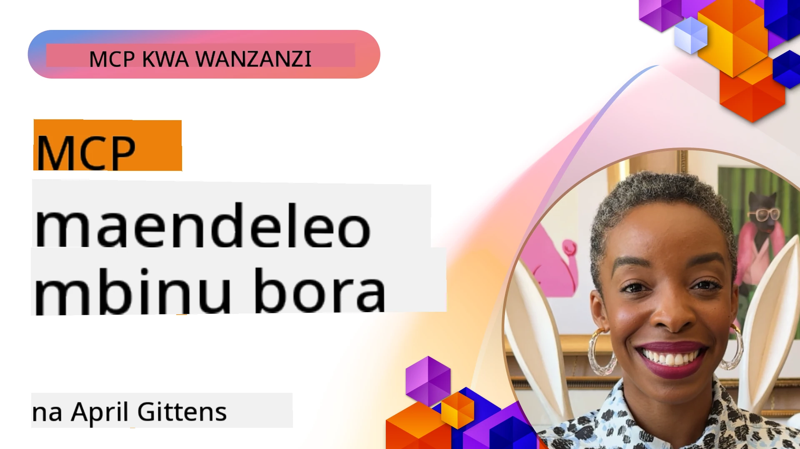

# Mazoea Bora ya Maendeleo ya MCP

[](https://youtu.be/W56H9W7x-ao)

_(Bonyeza picha hapo juu kuangalia video ya somo hili)_

## Muhtasari

Somo hili linazingatia mazoea bora ya hali ya juu ya kuendeleza, kupima, na kupeleka seva na vipengele vya MCP katika mazingira ya uzalishaji. Kadiri mifumo ya MCP inavyokua katika ugumu na umuhimu, kufuata mifumo iliyowekwa huhakikisha kuaminika, urahisi wa kudumisha, na uhusianishaji. Somo hili linakusanya busara ya vitendo iliyo patikana kutoka kwa utekelezaji halisi wa MCP kukuongoza katika kuunda seva imara, za ufanisi na rasilimali, vishawishi, na zana zilizo na ufanisi.

## Malengo ya Kujifunza

Mwishoni mwa somo hili, utaweza:

- Tumia mazoea bora ya viwanda katika kubuni seva na vipengele vya MCP
- Tengeneza mikakati kamili ya upimaji kwa seva za MCP
- Buni mifumo ya kazi yenye ufanisi, inayoweza kutumika tena kwa programu tata za MCP
- Tekeleza usimamizi sahihi wa makosa, kuandika kumbukumbu, na ufuatiliaji katika seva za MCP
- Boresha utekelezaji wa MCP kwa utendaji, usalama, na urahisi wa kudumisha

## Misingi ya MCP

Kabla ya kuingia kwenye mazoea maalum ya utekelezaji, ni muhimu kuelewa misingi ya msingi inayosimamia maendeleo bora ya MCP:

1. **Mawasiliano ya Kiwango**: MCP hutumia JSON-RPC 2.0 kama msingi wake, ikitoa muundo thabiti wa maombi, majibu, na usimamizi wa makosa katika utekelezaji wote.

2. **Ubunifu wa Mzingatia Mtumiaji**: Daima mpe umuhimu idhini, udhibiti, na uwazi wa mtumiaji katika utekelezaji wako wa MCP.

3. **Usalama Kwanza**: Tekeleza hatua za usalama thabiti ikiwa ni pamoja na uthibitishaji, ruhusa, uhakiki, na kuzuia kiwango cha maombi.

4. **Mifumo ya Moduli**: Buni seva zako za MCP kwa mtindo wa moduli, ambapo kila chombo na rasilimali ina lengo wazi na lililolengwa.

5. **Hali Ilioeleweka Vizuri**: MCP `2026-07-28` haina hali katika safu ya itifaki.
    Wakati mchakato unahitaji hali za simu-mbili, tumia vishikilia vya wazi 
    au hoja za kawaida za zana zinazotegemea hali thabiti ya programu.

## Mazoea Bora Rasmi ya MCP

Mazoea bora yafuatayo yametokana na nyaraka rasmi za Itifaki ya Muktadha wa Mfano:

### Mazoea Bora ya Usalama

1. **Idhini na Udhibiti wa Mtumiaji**: Daima hitaji idhini wazi ya mtumiaji kabla ya kufikia data au kufanya shughuli. Toa udhibiti wazi juu ya data inayo gawanywa na hatua zilizoruhusiwa.

2. **Faragha ya Data**: Funua data ya mtumiaji tu kwa idhini wazi na iingize na vidhibiti sahihi vya ufikiaji. Linda dhidi ya usambazaji wa data usioidhinishwa.

3. **Usalama wa Zana**: Hitaji idhini wazi ya mtumiaji kabla ya kuitumia zana yoyote. Hakikisha watumiaji wanaelewa kazi za kila zana na songa mipaka thabiti ya usalama.

4. **Udhibiti wa Ruhusa ya Zana**: Sanidi ni zana gani mfano unaweza kutumia kwa kila
    ombi na muktadha wa idhini, kuhakikisha ni zana zilizoidhinishwa kwa wazi
    tu ndizo zinazo patikana.

5. **Uthibitishaji**: Hitaji uthibitishaji sahihi kabla ya kutoa upatikanaji wa zana, rasilimali, au shughuli nyeti kwa kutumia funguo za API, tokeni za OAuth, au mbinu nyingine salama za uthibitishaji.

6. **Uhakiki wa Vigezo**: Tekeleza uhakiki wa kila mwito wa zana ili kuzuia pembejeo zisizo za kawaida au zenye madhara kufikia utekelezaji wa zana.

7. **Kuzuia Kiwango cha Maombi**: Tekeleza kuzuia kiwango cha maombi ili kuzuia matumizi mabaya na kuhakikisha usawa wa matumizi ya rasilimali za seva.

### Mazoea Bora ya Utekelezaji

1. **Mazungumzo ya Uwezo**: Muzungumze toleo la itifaki na
    uwezo unaoungwa mkono. Katika MCP `2026-07-28`, kila ombi ni la kujitegemea na linaweza
    tumia `server/discover`; marekebisho ya zamani hutumia mkutano wa awali.

2. **Ubunifu wa Zana**: Tengeneza zana zilizo na lengo moja bora, badala ya zana za ukarabati zinazo shughulikia masuala mengi.

3. **Usimamizi wa Makosa**: Tekeleza ujumbe na nambari za makosa za kiwango cha viwanda kusaidia kugundua matatizo, kushughulikia kushindwa kwa heshima, na kutoa mrejesho unaotekelezeka.

4. **Ufuatiliaji**: Tumia `stderr` kwa uchunguzi wa stdio na OpenTelemetry
    kwa ufuatiliaji uliopangwa. Kipengele cha kufuatilia cha MCP kimepuuzwa katika
    sifa ya `2026-07-28`.

5. **Ufuatiliaji wa Maendeleo**: Kwa shughuli zenye urefu, ripoti maendeleo ili kuwezesha muingiliano wa mtumiaji unaotegemea mwitikio.

6. **Kubatilisha Maombi**: Ruhusu wateja kubatilisha maombi yaliyopo chini ya mchakato ambayo hayahitajiki tena au yanachukua muda mrefu.

## Marejeleo Zaidi

Kwa habari za kisasa juu ya mazoea bora ya MCP, rejelea:

- [Nyaraka za MCP](https://modelcontextprotocol.io/)
- [Sifa za MCP (2026-07-28)][mcp-2026-spec]
- [Sifa za MCP za Zamani (2025-11-25)](https://modelcontextprotocol.io/specification/2025-11-25)
- [Marekebisho ya Kazi za MCP][mcp-tasks-extension]
- [Hifadhi ya GitHub](https://github.com/modelcontextprotocol)
- [Mazoea Bora ya Usalama](https://modelcontextprotocol.io/docs/2026-07-28/tutorials/security/security_best_practices)
- [Orodha ya Juu 10 za MCP ya OWASP](https://microsoft.github.io/mcp-azure-security-guide/) - Hatari za usalama na jinsi za kuzisaidia
- [Warsha ya Mkutano wa Usalama wa MCP (Sherpa)](https://azure-samples.github.io/sherpa/) - Mafunzo ya usalama ya vitendo

### Somo la Mshirika wa Kuaminika

Mizunguko ya kufanya majaribio tena bila mipaka si salama kwa zana zinazounda tiketi, malipo,
ujumbe, uanzishaji, au athari nyingine halisi. Jibu linaweza kupotea
baada ya athari kutekelezwa.

Tumia somo la mshirika wa kuaminika,
[Majaribio Salama kwa Zana za MCP: Mfano wa Mshirika wa Kuaminika][reliability-sidecar],
kujifunza funguo thabiti za uendeshaji, ufanisi wa ruhusa rudufu, kuhifadhi vidokezo,
maelewano, viwango vya ushahidi, na sindano za kushindwa.

[mcp-2026-spec]: https://modelcontextprotocol.io/specification/2026-07-28
[mcp-tasks-extension]: https://modelcontextprotocol.io/extensions/tasks/overview
[reliability-sidecar]: ./reliability-sidecars/README.md

## Mifano ya Vitendo vya Utekelezaji

### Mazoea Bora ya Ubunifu wa Zana

#### 1. Kanuni ya Majukumu Moja

Kila zana ya MCP inapaswa kuwa na lengo wazi na lililolengwa. Badala ya kuunda zana kubwa ambazo zinashughulikia masuala mengi, tengeneza zana maalum ambazo zinafanikiwa katika kazi maalum.

```csharp
// A focused tool that does one thing well
public class WeatherForecastTool : ITool
{
    private readonly IWeatherService _weatherService;
    
    public WeatherForecastTool(IWeatherService weatherService)
    {
        _weatherService = weatherService;
    }
    
    public string Name => "weatherForecast";
    public string Description => "Gets weather forecast for a specific location";
    
    public ToolDefinition GetDefinition()
    {
        return new ToolDefinition
        {
            Name = Name,
            Description = Description,
            Parameters = new Dictionary<string, ParameterDefinition>
            {
                ["location"] = new ParameterDefinition
                {
                    Type = ParameterType.String,
                    Description = "City or location name"
                },
                ["days"] = new ParameterDefinition
                {
                    Type = ParameterType.Integer,
                    Description = "Number of forecast days",
                    Default = 3
                }
            },
            Required = new[] { "location" }
        };
    }
    
    public async Task<ToolResponse> ExecuteAsync(IDictionary<string, object> parameters)
    {
        var location = parameters["location"].ToString();
        var days = parameters.ContainsKey("days") 
            ? Convert.ToInt32(parameters["days"]) 
            : 3;
            
        var forecast = await _weatherService.GetForecastAsync(location, days);
        
        return new ToolResponse
        {
            Content = new List<ContentItem>
            {
                new TextContent(JsonSerializer.Serialize(forecast))
            }
        };
    }
}
```

#### 2. Usimamizi Mfanano wa Makosa

Tekeleza usimamizi thabiti wa makosa na ujumbe wa makosa unaotoa taarifa na mbinu za kurekebisha zinazofaa.

```python
# Mfano wa Python wenye usimamizi kamili wa makosa
class DataQueryTool:
    def get_name(self):
        return "dataQuery"
        
    def get_description(self):
        return "Queries data from specified database tables"
    
    async def execute(self, parameters):
        try:
            # Uthibitishaji wa vigezo
            if "query" not in parameters:
                raise ToolParameterError("Missing required parameter: query")
                
            query = parameters["query"]
            
            # Uthibitishaji wa usalama
            if self._contains_unsafe_sql(query):
                raise ToolSecurityError("Query contains potentially unsafe SQL")
            
            try:
                # Operesheni ya database yenye wakati wa kumalizika
                async with timeout(10):  # Muda wa kumalizika wa sekunde 10
                    result = await self._database.execute_query(query)
                    
                return ToolResponse(
                    content=[TextContent(json.dumps(result))]
                )
            except asyncio.TimeoutError:
                raise ToolExecutionError("Database query timed out after 10 seconds")
            except DatabaseConnectionError as e:
                # Makosa ya muunganisho yanaweza kuwa ya muda mfupi
                self._log_error("Database connection error", e)
                raise ToolExecutionError(f"Database connection error: {str(e)}")
            except DatabaseQueryError as e:
                # Makosa ya uchunguzi yanakisia kuwa ni makosa ya mteja
                self._log_error("Database query error", e)
                raise ToolExecutionError(f"Invalid query: {str(e)}")
                
        except ToolError:
            # Ruhusu makosa maalum ya zana kupita
            raise
        except Exception as e:
            # Sambaza makosa yote yasiyotarajiwa
            self._log_error("Unexpected error in DataQueryTool", e)
            raise ToolExecutionError(f"An unexpected error occurred: {str(e)}")
    
    def _contains_unsafe_sql(self, query):
        # Utekelezaji wa utambuzi wa sindano ya SQL
        pass
        
    def _log_error(self, message, error):
        # Utekelezaji wa kurekodi makosa
        pass
```

#### 3. Uhakiki wa Vigezo

Daima hakikisha uhakiki wa kina wa vigezo ili kuzuia pembejeo zisizo sahihi au hatarishi.

```javascript
// Mfano wa JavaScript/TypeScript na uhakikisho wa kina wa vigezo
class FileOperationTool {
  getName() {
    return "fileOperation";
  }
  
  getDescription() {
    return "Performs file operations like read, write, and delete";
  }
  
  getDefinition() {
    return {
      name: this.getName(),
      description: this.getDescription(),
      parameters: {
        operation: {
          type: "string",
          description: "Operation to perform",
          enum: ["read", "write", "delete"]
        },
        path: {
          type: "string",
          description: "File path (must be within allowed directories)"
        },
        content: {
          type: "string",
          description: "Content to write (only for write operation)",
          optional: true
        }
      },
      required: ["operation", "path"]
    };
  }
  
  async execute(parameters) {
    // 1. Hakikisha uwepo wa kigezo
    if (!parameters.operation) {
      throw new ToolError("Missing required parameter: operation");
    }
    
    if (!parameters.path) {
      throw new ToolError("Missing required parameter: path");
    }
    
    // 2. Hakikisha aina za vigezo
    if (typeof parameters.operation !== "string") {
      throw new ToolError("Parameter 'operation' must be a string");
    }
    
    if (typeof parameters.path !== "string") {
      throw new ToolError("Parameter 'path' must be a string");
    }
    
    // 3. Hakikisha thamani za vigezo
    const validOperations = ["read", "write", "delete"];
    if (!validOperations.includes(parameters.operation)) {
      throw new ToolError(`Invalid operation. Must be one of: ${validOperations.join(", ")}`);
    }
    
    // 4. Hakikisha uwepo wa maudhui kwa operesheni ya kuandika
    if (parameters.operation === "write" && !parameters.content) {
      throw new ToolError("Content parameter is required for write operation");
    }
    
    // 5. Hakikisho la usalama wa njia
    if (!this.isPathWithinAllowedDirectories(parameters.path)) {
      throw new ToolError("Access denied: path is outside of allowed directories");
    }
    
    // Utekelezaji unaotegemea vigezo vilivyohakikiwa
    // ...
  }
  
  isPathWithinAllowedDirectories(path) {
    // Utekelezaji wa ukaguzi wa usalama wa njia
    // ...
  }
}
```

### Mifano ya Utekelezaji wa Usalama

#### 1. Uthibitishaji na Ruhusa

```java
// Mfano wa Java wenye uhalali na ruhusa
public class SecureDataAccessTool implements Tool {
    private final AuthenticationService authService;
    private final AuthorizationService authzService;
    private final DataService dataService;
    
    // Uingizaji wa utegemezi
    public SecureDataAccessTool(
            AuthenticationService authService,
            AuthorizationService authzService,
            DataService dataService) {
        this.authService = authService;
        this.authzService = authzService;
        this.dataService = dataService;
    }
    
    @Override
    public String getName() {
        return "secureDataAccess";
    }
    
    @Override
    public ToolResponse execute(ToolRequest request) {
        // 1. Chukua muktadha wa uhalali
        String authToken = request.getContext().getAuthToken();
        
        // 2. Thibitisha mtumiaji
        UserIdentity user;
        try {
            user = authService.validateToken(authToken);
        } catch (AuthenticationException e) {
            return ToolResponse.error("Authentication failed: " + e.getMessage());
        }
        
        // 3. Angalia ruhusa kwa ajili ya operesheni maalum
        String dataId = request.getParameters().get("dataId").getAsString();
        String operation = request.getParameters().get("operation").getAsString();
        
        boolean isAuthorized = authzService.isAuthorized(user, "data:" + dataId, operation);
        if (!isAuthorized) {
            return ToolResponse.error("Access denied: Insufficient permissions for this operation");
        }
        
        // 4. Endelea na operesheni iliyoruhusiwa
        try {
            switch (operation) {
                case "read":
                    Object data = dataService.getData(dataId, user.getId());
                    return ToolResponse.success(data);
                case "update":
                    JsonNode newData = request.getParameters().get("newData");
                    dataService.updateData(dataId, newData, user.getId());
                    return ToolResponse.success("Data updated successfully");
                default:
                    return ToolResponse.error("Unsupported operation: " + operation);
            }
        } catch (Exception e) {
            return ToolResponse.error("Operation failed: " + e.getMessage());
        }
    }
}
```

#### 2. Kuzuia Kiwango cha Maombi

```csharp
// C# rate limiting implementation
public class RateLimitingMiddleware
{
    private readonly RequestDelegate _next;
    private readonly IMemoryCache _cache;
    private readonly ILogger<RateLimitingMiddleware> _logger;
    
    // Configuration options
    private readonly int _maxRequestsPerMinute;
    
    public RateLimitingMiddleware(
        RequestDelegate next,
        IMemoryCache cache,
        ILogger<RateLimitingMiddleware> logger,
        IConfiguration config)
    {
        _next = next;
        _cache = cache;
        _logger = logger;
        _maxRequestsPerMinute = config.GetValue<int>("RateLimit:MaxRequestsPerMinute", 60);
    }
    
    public async Task InvokeAsync(HttpContext context)
    {
        // 1. Get client identifier (API key or user ID)
        string clientId = GetClientIdentifier(context);
        
        // 2. Get rate limiting key for this minute
        string cacheKey = $"rate_limit:{clientId}:{DateTime.UtcNow:yyyyMMddHHmm}";
        
        // 3. Check current request count
        if (!_cache.TryGetValue(cacheKey, out int requestCount))
        {
            requestCount = 0;
        }
        
        // 4. Enforce rate limit
        if (requestCount >= _maxRequestsPerMinute)
        {
            _logger.LogWarning("Rate limit exceeded for client {ClientId}", clientId);
            
            context.Response.StatusCode = StatusCodes.Status429TooManyRequests;
            context.Response.Headers.Add("Retry-After", "60");
            
            await context.Response.WriteAsJsonAsync(new
            {
                error = "Rate limit exceeded",
                message = "Too many requests. Please try again later.",
                retryAfterSeconds = 60
            });
            
            return;
        }
        
        // 5. Increment request count
        _cache.Set(cacheKey, requestCount + 1, TimeSpan.FromMinutes(2));
        
        // 6. Add rate limit headers
        context.Response.Headers.Add("X-RateLimit-Limit", _maxRequestsPerMinute.ToString());
        context.Response.Headers.Add("X-RateLimit-Remaining", (_maxRequestsPerMinute - requestCount - 1).ToString());
        
        // 7. Continue with the request
        await _next(context);
    }
    
    private string GetClientIdentifier(HttpContext context)
    {
        // Implementation to extract API key or user ID
        // ...
    }
}
```

## Mazoea Bora ya Upimaji

### 1. Upimaji wa Zana za MCP kwa Kando

Daima pima zana zako kwa kuzipeleka peke yake, ukiiga tegemezi za nje:

```typescript
// Mfano wa jaribio la kitengo cha chombo katika TypeScript
describe('WeatherForecastTool', () => {
  let tool: WeatherForecastTool;
  let mockWeatherService: jest.Mocked<IWeatherService>;
  
  beforeEach(() => {
    // Unda huduma ya hali ya hewa ya bandia
    mockWeatherService = {
      getForecasts: jest.fn()
    } as any;
    
    // Unda chombo na utegemezi wa bandia
    tool = new WeatherForecastTool(mockWeatherService);
  });
  
  it('should return weather forecast for a location', async () => {
    // Panga
    const mockForecast = {
      location: 'Seattle',
      forecasts: [
        { date: '2025-07-16', temperature: 72, conditions: 'Sunny' },
        { date: '2025-07-17', temperature: 68, conditions: 'Partly Cloudy' },
        { date: '2025-07-18', temperature: 65, conditions: 'Rain' }
      ]
    };
    
    mockWeatherService.getForecasts.mockResolvedValue(mockForecast);
    
    // Tengeneza
    const response = await tool.execute({
      location: 'Seattle',
      days: 3
    });
    
    // Thibitisha
    expect(mockWeatherService.getForecasts).toHaveBeenCalledWith('Seattle', 3);
    expect(response.content[0].text).toContain('Seattle');
    expect(response.content[0].text).toContain('Sunny');
  });
  
  it('should handle errors from the weather service', async () => {
    // Panga
    mockWeatherService.getForecasts.mockRejectedValue(new Error('Service unavailable'));
    
    // Tengeneza na Thibitisha
    await expect(tool.execute({
      location: 'Seattle',
      days: 3
    })).rejects.toThrow('Weather service error: Service unavailable');
  });
});
```

### 2. Upimaji wa Mchanganyiko

Pima mchakato mzima kutoka kwa maombi ya mteja hadi majibu ya seva:

```python
# Mfano wa mtihani wa ujumuishaji wa Python
@pytest.mark.asyncio
async def test_mcp_server_integration():
    # Anzisha seva ya mtihani
    server = McpServer()
    server.register_tool(WeatherForecastTool(MockWeatherService()))
    await server.start(port=5000)
    
    try:
        # Unda mteja
        client = McpClient("http://localhost:5000")
        
        # Jaribu kugundua zana
        tools = await client.discover_tools()
        assert "weatherForecast" in [t.name for t in tools]
        
        # Jaribu utekelezaji wa zana
        response = await client.execute_tool("weatherForecast", {
            "location": "Seattle",
            "days": 3
        })
        
        # Thibitisha jibu
        assert response.status_code == 200
        assert "Seattle" in response.content[0].text
        assert len(json.loads(response.content[0].text)["forecasts"]) == 3
        
    finally:
        # Safisha nyuma
        await server.stop()
```

## Uboreshaji wa Utendaji

### 1. Mikakati ya Kuweka Kumbukumbu

Tekeleza kuweka kumbukumbu kwa usahihi ili kupunguza ucheleweshaji na matumizi ya rasilimali:

```csharp
// C# example with caching
public class CachedWeatherTool : ITool
{
    private readonly IWeatherService _weatherService;
    private readonly IDistributedCache _cache;
    private readonly ILogger<CachedWeatherTool> _logger;
    
    public CachedWeatherTool(
        IWeatherService weatherService,
        IDistributedCache cache,
        ILogger<CachedWeatherTool> logger)
    {
        _weatherService = weatherService;
        _cache = cache;
        _logger = logger;
    }
    
    public string Name => "weatherForecast";
    
    public async Task<ToolResponse> ExecuteAsync(IDictionary<string, object> parameters)
    {
        var location = parameters["location"].ToString();
        var days = Convert.ToInt32(parameters.GetValueOrDefault("days", 3));
        
        // Create cache key
        string cacheKey = $"weather:{location}:{days}";
        
        // Try to get from cache
        string cachedForecast = await _cache.GetStringAsync(cacheKey);
        if (!string.IsNullOrEmpty(cachedForecast))
        {
            _logger.LogInformation("Cache hit for weather forecast: {Location}", location);
            return new ToolResponse
            {
                Content = new List<ContentItem>
                {
                    new TextContent(cachedForecast)
                }
            };
        }
        
        // Cache miss - get from service
        _logger.LogInformation("Cache miss for weather forecast: {Location}", location);
        var forecast = await _weatherService.GetForecastAsync(location, days);
        string forecastJson = JsonSerializer.Serialize(forecast);
        
        // Store in cache (weather forecasts valid for 1 hour)
        await _cache.SetStringAsync(
            cacheKey,
            forecastJson,
            new DistributedCacheEntryOptions
            {
                AbsoluteExpirationRelativeToNow = TimeSpan.FromHours(1)
            });
        
        return new ToolResponse
        {
            Content = new List<ContentItem>
            {
                new TextContent(forecastJson)
            }
        };
    }
}
```

#### 2. Uingizaji wa Tegemezi na Uwezekano wa Upimaji

Buni zana kupokea tegemezi zao kupitia uingizaji wa mjenzi, na kuzifanya ziweze kupimika na kusanifiwa:

```java
// Mfano wa Java na sindano la utegemezi
public class CurrencyConversionTool implements Tool {
    private final ExchangeRateService exchangeService;
    private final CacheService cacheService;
    private final Logger logger;
    
    // Utegemezi uliowekwa kupitia muundaji
    public CurrencyConversionTool(
            ExchangeRateService exchangeService,
            CacheService cacheService,
            Logger logger) {
        this.exchangeService = exchangeService;
        this.cacheService = cacheService;
        this.logger = logger;
    }
    
    // Utekelezaji wa chombo
    // ...
}
```

#### 3. Zana Zinazoweza Kuunganishwa

Buni zana zinazoweza kuunganishwa pamoja kuunda michakato tata:

```python
# Mfano wa Python unaoonyesha zana zinazoweza kuunganishwa
class DataFetchTool(Tool):
    def get_name(self):
        return "dataFetch"
    
    # Utekelezaji...

class DataAnalysisTool(Tool):
    def get_name(self):
        return "dataAnalysis"
    
    # Zana hii inaweza kutumia matokeo kutoka kwa zana ya dataFetch
    async def execute_async(self, request):
        # Utekelezaji...
        pass

class DataVisualizationTool(Tool):
    def get_name(self):
        return "dataVisualize"
    
    # Zana hii inaweza kutumia matokeo kutoka kwa zana ya dataAnalysis
    async def execute_async(self, request):
        # Utekelezaji...
        pass

# Zana hizi zinaweza kutumika kwa uhuru au kama sehemu ya mtiririko wa kazi
```

### Mazoea Bora ya Ubunifu wa Mchoro

Mchoro ni mkataba kati ya mfano na zana yako. Michoro iliyobuniwa vizuri husaidia matumizi bora ya zana.

#### 1. Maelezo Wazi ya Vigezo

Daima jumuisha taarifa za maelezo kwa kila kigezo:

```csharp
public object GetSchema()
{
    return new {
        type = "object",
        properties = new {
            query = new { 
                type = "string", 
                description = "Search query text. Use precise keywords for better results." 
            },
            filters = new {
                type = "object",
                description = "Optional filters to narrow down search results",
                properties = new {
                    dateRange = new { 
                        type = "string", 
                        description = "Date range in format YYYY-MM-DD:YYYY-MM-DD" 
                    },
                    category = new { 
                        type = "string", 
                        description = "Category name to filter by" 
                    }
                }
            },
            limit = new { 
                type = "integer", 
                description = "Maximum number of results to return (1-50)",
                default = 10
            }
        },
        required = new[] { "query" }
    };
}
```

#### 2. Vikwazo vya Uhakiki

Jumuisha vikwazo vya uhakiki ili kuzuia pembejeo batili:

```java
Map<String, Object> getSchema() {
    Map<String, Object> schema = new HashMap<>();
    schema.put("type", "object");
    
    Map<String, Object> properties = new HashMap<>();
    
    // Mali ya barua pepe yenye uthibitishaji wa muundo
    Map<String, Object> email = new HashMap<>();
    email.put("type", "string");
    email.put("format", "email");
    email.put("description", "User email address");
    
    // Mali ya umri yenye vizingiti vya nambari
    Map<String, Object> age = new HashMap<>();
    age.put("type", "integer");
    age.put("minimum", 13);
    age.put("maximum", 120);
    age.put("description", "User age in years");
    
    // Mali iliyoorodheshwa
    Map<String, Object> subscription = new HashMap<>();
    subscription.put("type", "string");
    subscription.put("enum", Arrays.asList("free", "basic", "premium"));
    subscription.put("default", "free");
    subscription.put("description", "Subscription tier");
    
    properties.put("email", email);
    properties.put("age", age);
    properties.put("subscription", subscription);
    
    schema.put("properties", properties);
    schema.put("required", Arrays.asList("email"));
    
    return schema;
}
```

#### 3. Muundo Thabiti wa Majibu

Dumisha muingiliano thabiti ya muundo wa majibu ili kurahisisha tafsiri kwa mifano:

```python
async def execute_async(self, request):
    try:
        # Fanya ombi
        results = await self._search_database(request.parameters["query"])
        
        # Daima rudisha muundo thabiti
        return ToolResponse(
            result={
                "matches": [self._format_item(item) for item in results],
                "totalCount": len(results),
                "queryTime": calculation_time_ms,
                "status": "success"
            }
        )
    except Exception as e:
        return ToolResponse(
            result={
                "matches": [],
                "totalCount": 0,
                "queryTime": 0,
                "status": "error",
                "error": str(e)
            }
        )
    
def _format_item(self, item):
    """Ensures each item has a consistent structure"""
    return {
        "id": item.id,
        "title": item.title,
        "summary": item.summary[:100] + "..." if len(item.summary) > 100 else item.summary,
        "url": item.url,
        "relevance": item.score
    }
```

### Usimamizi wa Makosa

Usimamizi thabiti wa makosa ni muhimu kwa zana za MCP kudumisha kuaminika.

#### 1. Usimamizi wa Makosa kwa Heshima

Shughulikia makosa katika ngazi zinazofaa na toa ujumbe unaotoa taarifa:

```csharp
public async Task<ToolResponse> ExecuteAsync(ToolRequest request)
{
    try
    {
        string fileId = request.Parameters.GetProperty("fileId").GetString();
        
        try
        {
            var fileData = await _fileService.GetFileAsync(fileId);
            return new ToolResponse { 
                Result = JsonSerializer.SerializeToElement(fileData) 
            };
        }
        catch (FileNotFoundException)
        {
            throw new ToolExecutionException($"File not found: {fileId}");
        }
        catch (UnauthorizedAccessException)
        {
            throw new ToolExecutionException("You don't have permission to access this file");
        }
        catch (Exception ex) when (ex is IOException || ex is TimeoutException)
        {
            _logger.LogError(ex, "Error accessing file {FileId}", fileId);
            throw new ToolExecutionException("Error accessing file: The service is temporarily unavailable");
        }
    }
    catch (JsonException)
    {
        throw new ToolExecutionException("Invalid file ID format");
    }
    catch (Exception ex)
    {
        _logger.LogError(ex, "Unexpected error in FileAccessTool");
        throw new ToolExecutionException("An unexpected error occurred");
    }
}
```

#### 2. Majibu ya Makosa Yaliyopangwa

Rejesha taarifa ya makosa iliyopangwa inapowezekana:

```java
@Override
public ToolResponse execute(ToolRequest request) {
    try {
        // Utekelezaji
    } catch (Exception ex) {
        Map<String, Object> errorResult = new HashMap<>();
        
        errorResult.put("success", false);
        
        if (ex instanceof ValidationException) {
            ValidationException validationEx = (ValidationException) ex;
            
            errorResult.put("errorType", "validation");
            errorResult.put("errorMessage", validationEx.getMessage());
            errorResult.put("validationErrors", validationEx.getErrors());
            
            return new ToolResponse.Builder()
                .setResult(errorResult)
                .build();
        }
        
        // Rudisha tena makosa mengine kama ToolExecutionException
        throw new ToolExecutionException("Tool execution failed: " + ex.getMessage(), ex);
    }
}
```

#### 3. Mantiki ya Kujaribu Tena

Tumia mantiki ya kujaribu tena kwa ujumla tu kwa simu za kusoma tu au shughuli ambazo
mkataba wa chini tayari ni wa idempotent. Kwa shughuli zenye athari, muda wa kusubiri
baada ya kutuma ombi ni wa mkanganyiko. Fanya maelewano ya hali halali na
tumia tena funguo thabiti ya utendaji kabla ya kutekeleza tena. Angalia
[somu la mshirika wa kuaminika](./reliability-sidecars/README.md).

Mzunguko wa kujaribu tena uliowekwa hapa chini ni mzuri kwa utafutaji wa kusoma tu:

```python
async def execute_async(self, request):
    max_retries = 3
    retry_count = 0
    base_delay = 1  # sekunde
    
    while retry_count < max_retries:
        try:
            # Piga API ya nje ya kusoma tu
            return await self._call_read_only_api(request.parameters)
        except TransientError as e:
            retry_count += 1
            if retry_count >= max_retries:
                raise ToolExecutionException(f"Operation failed after {max_retries} attempts: {str(e)}")
                
            # Kucheleweshwa kwa mng'ao wa asilimia
            delay = base_delay * (2 ** (retry_count - 1))
            logging.warning(f"Transient error, retrying in {delay}s: {str(e)}")
            await asyncio.sleep(delay)
        except Exception as e:
            # Hitilafu isiyotokea mara moja, usijaribu tena
            raise ToolExecutionException(f"Operation failed: {str(e)}")
```

### Uboreshaji wa Utendaji

#### 1. Kuweka Kumbukumbu

Tekeleza kuweka kumbukumbu kwa shughuli ghali:

```csharp
public class CachedDataTool : IMcpTool
{
    private readonly IDatabase _database;
    private readonly IMemoryCache _cache;
    
    public CachedDataTool(IDatabase database, IMemoryCache cache)
    {
        _database = database;
        _cache = cache;
    }
    
    public async Task<ToolResponse> ExecuteAsync(ToolRequest request)
    {
        var query = request.Parameters.GetProperty("query").GetString();
        
        // Create cache key based on parameters
        var cacheKey = $"data_query_{ComputeHash(query)}";
        
        // Try to get from cache first
        if (_cache.TryGetValue(cacheKey, out var cachedResult))
        {
            return new ToolResponse { Result = cachedResult };
        }
        
        // Cache miss - perform actual query
        var result = await _database.QueryAsync(query);
        
        // Store in cache with expiration
        var cacheOptions = new MemoryCacheEntryOptions()
            .SetAbsoluteExpiration(TimeSpan.FromMinutes(15));
            
        _cache.Set(cacheKey, JsonSerializer.SerializeToElement(result), cacheOptions);
        
        return new ToolResponse { Result = JsonSerializer.SerializeToElement(result) };
    }
    
    private string ComputeHash(string input)
    {
        // Implementation to generate stable hash for cache key
    }
}
```

#### 2. Uendeshaji Usioendeshwa kwa Mtiririko

Tumia mifumo ya programu isiyoendeshwa kwa shughuli zinazohusisha I/O:

```java
public class AsyncDocumentProcessingTool implements Tool {
    private final DocumentService documentService;
    private final ExecutorService executorService;
    
    @Override
    public ToolResponse execute(ToolRequest request) {
        String documentId = request.getParameters().get("documentId").asText();
        
        // Kwa operesheni za muda mrefu, rudisha kitambulisho cha usindikaji mara moja
        String processId = UUID.randomUUID().toString();
        
        // Anzisha usindikaji usioendeshwa moja kwa moja
        CompletableFuture.runAsync(() -> {
            try {
                // Fanya operesheni za muda mrefu
                documentService.processDocument(documentId);
                
                // Sasisha hali (kawaida huhifadhiwa katika hifadhidata)
                processStatusRepository.updateStatus(processId, "completed");
            } catch (Exception ex) {
                processStatusRepository.updateStatus(processId, "failed", ex.getMessage());
            }
        }, executorService);
        
        // Rudisha majibu ya mara moja na kitambulisho cha mchakato
        Map<String, Object> result = new HashMap<>();
        result.put("processId", processId);
        result.put("status", "processing");
        result.put("estimatedCompletionTime", ZonedDateTime.now().plusMinutes(5));
        
        return new ToolResponse.Builder().setResult(result).build();
    }
    
    // Zana ya kuangalia hali ya mshirika
    public class ProcessStatusTool implements Tool {
        @Override
        public ToolResponse execute(ToolRequest request) {
            String processId = request.getParameters().get("processId").asText();
            ProcessStatus status = processStatusRepository.getStatus(processId);
            
            return new ToolResponse.Builder().setResult(status).build();
        }
    }
}
```

#### 3. Kuzuia Matumizi Makubwa ya Rasilimali

Tekeleza kuzuia matumizi makubwa ya rasilimali ili kuzuia mzigo kupita kiasi:

```python
class ThrottledApiTool(Tool):
    def __init__(self):
        self.rate_limiter = TokenBucketRateLimiter(
            tokens_per_second=5,  # Ruhusu maombi 5 kwa sekunde
            bucket_size=10        # Ruhusu mlipuko hadi maombi 10
        )
    
    async def execute_async(self, request):
        # Angalia kama tunaweza kuendelea au inabidi kusubiri
        delay = self.rate_limiter.get_delay_time()
        
        if delay > 0:
            if delay > 2.0:  # Ikiwa kusubiri ni kwa muda mrefu sana
                raise ToolExecutionException(
                    f"Rate limit exceeded. Please try again in {delay:.1f} seconds."
                )
            else:
                # Subiri kwa muda unaofaa wa kuchelewesha
                await asyncio.sleep(delay)
        
        # Tumia tokeni moja na endelea na ombi
        self.rate_limiter.consume()
        
        # Piga API
        result = await self._call_api(request.parameters)
        return ToolResponse(result=result)

class TokenBucketRateLimiter:
    def __init__(self, tokens_per_second, bucket_size):
        self.tokens_per_second = tokens_per_second
        self.bucket_size = bucket_size
        self.tokens = bucket_size
        self.last_refill = time.time()
        self.lock = asyncio.Lock()
    
    async def get_delay_time(self):
        async with self.lock:
            self._refill()
            if self.tokens >= 1:
                return 0
            
            # Hesabu muda hadi tokeni ifikie tena
            return (1 - self.tokens) / self.tokens_per_second
    
    async def consume(self):
        async with self.lock:
            self._refill()
            self.tokens -= 1
    
    def _refill(self):
        now = time.time()
        elapsed = now - self.last_refill
        
        # Ongeza tokeni mpya kulingana na muda uliopita
        new_tokens = elapsed * self.tokens_per_second
        self.tokens = min(self.bucket_size, self.tokens + new_tokens)
        self.last_refill = now
```

### Mazoea Bora ya Usalama

#### 1. Uhakiki wa Pembejeo

Daima hakikisha uhakiki wa kina wa vigezo vya pembejeo:

```csharp
public async Task<ToolResponse> ExecuteAsync(ToolRequest request)
{
    // Validate parameters exist
    if (!request.Parameters.TryGetProperty("query", out var queryProp))
    {
        throw new ToolExecutionException("Missing required parameter: query");
    }
    
    // Validate correct type
    if (queryProp.ValueKind != JsonValueKind.String)
    {
        throw new ToolExecutionException("Query parameter must be a string");
    }
    
    var query = queryProp.GetString();
    
    // Validate string content
    if (string.IsNullOrWhiteSpace(query))
    {
        throw new ToolExecutionException("Query parameter cannot be empty");
    }
    
    if (query.Length > 500)
    {
        throw new ToolExecutionException("Query parameter exceeds maximum length of 500 characters");
    }
    
    // Check for SQL injection attacks if applicable
    if (ContainsSqlInjection(query))
    {
        throw new ToolExecutionException("Invalid query: contains potentially unsafe SQL");
    }
    
    // Proceed with execution
    // ...
}
```

#### 2. Ukaguzi wa Ruhusa

Tekeleza ukaguzi sahihi wa ruhusa:

```java
@Override
public ToolResponse execute(ToolRequest request) {
    // Pata muktadha wa mtumiaji kutoka kwa ombi
    UserContext user = request.getContext().getUserContext();
    
    // Kagua kama mtumiaji ana ruhusa zinazohitajika
    if (!authorizationService.hasPermission(user, "documents:read")) {
        throw new ToolExecutionException("User does not have permission to access documents");
    }
    
    // Kwa rasilimali maalum, hakikisha ufikiaji wa rasilimali hiyo
    String documentId = request.getParameters().get("documentId").asText();
    if (!documentService.canUserAccess(user.getId(), documentId)) {
        throw new ToolExecutionException("Access denied to the requested document");
    }
    
    // Endelea na utekelezaji wa zana
    // ...
}
```

#### 3. Usimamizi wa Data Nyeti

Shughulikia data nyeti kwa makini:

```python
class SecureDataTool(Tool):
    def get_schema(self):
        return {
            "type": "object",
            "properties": {
                "userId": {"type": "string"},
                "includeSensitiveData": {"type": "boolean", "default": False}
            },
            "required": ["userId"]
        }
    
    async def execute_async(self, request):
        user_id = request.parameters["userId"]
        include_sensitive = request.parameters.get("includeSensitiveData", False)
        
        # Pata data za mtumiaji
        user_data = await self.user_service.get_user_data(user_id)
        
        # Chuja nywanja nyeti isipokuwa zitaombwa wazi NA zikiruhusiwa
        if not include_sensitive or not self._is_authorized_for_sensitive_data(request):
            user_data = self._redact_sensitive_fields(user_data)
        
        return ToolResponse(result=user_data)
    
    def _is_authorized_for_sensitive_data(self, request):
        # Angalia kiwango cha idhini katika muktadha wa ombi
        auth_level = request.context.get("authorizationLevel")
        return auth_level == "admin"
    
    def _redact_sensitive_fields(self, user_data):
        # Unda nakala ili kuepuka kubadilisha asili
        redacted = user_data.copy()
        
        # Ficha nywanja maalum nyeti
        sensitive_fields = ["ssn", "creditCardNumber", "password"]
        for field in sensitive_fields:
            if field in redacted:
                redacted[field] = "REDACTED"
        
        # Ficha data nyeti zilizo ndani ndani
        if "financialInfo" in redacted:
            redacted["financialInfo"] = {"available": True, "accessRestricted": True}
        
        return redacted
```

## Mazoea Bora ya Upimaji kwa Zana za MCP

Upimaji kamili huhakikisha zana za MCP zinafanya kazi sawasawa, kushughulikia hali za pembe, na kuunganishwa ipasavyo na mfumo mzima.

### Upimaji wa Kando

#### 1. Pima Kila Zana kwa Pekee

Tengeneza majaribio yaliyolengwa kwa kila kazi ya zana:

```csharp
[Fact]
public async Task WeatherTool_ValidLocation_ReturnsCorrectForecast()
{
    // Arrange
    var mockWeatherService = new Mock<IWeatherService>();
    mockWeatherService
        .Setup(s => s.GetForecastAsync("Seattle", 3))
        .ReturnsAsync(new WeatherForecast(/* test data */));
    
    var tool = new WeatherForecastTool(mockWeatherService.Object);
    
    var request = new ToolRequest(
        toolName: "weatherForecast",
        parameters: JsonSerializer.SerializeToElement(new { 
            location = "Seattle", 
            days = 3 
        })
    );
    
    // Act
    var response = await tool.ExecuteAsync(request);
    
    // Assert
    Assert.NotNull(response);
    var result = JsonSerializer.Deserialize<WeatherForecast>(response.Result);
    Assert.Equal("Seattle", result.Location);
    Assert.Equal(3, result.DailyForecasts.Count);
}

[Fact]
public async Task WeatherTool_InvalidLocation_ThrowsToolExecutionException()
{
    // Arrange
    var mockWeatherService = new Mock<IWeatherService>();
    mockWeatherService
        .Setup(s => s.GetForecastAsync("InvalidLocation", It.IsAny<int>()))
        .ThrowsAsync(new LocationNotFoundException("Location not found"));
    
    var tool = new WeatherForecastTool(mockWeatherService.Object);
    
    var request = new ToolRequest(
        toolName: "weatherForecast",
        parameters: JsonSerializer.SerializeToElement(new { 
            location = "InvalidLocation", 
            days = 3 
        })
    );
    
    // Act & Assert
    var exception = await Assert.ThrowsAsync<ToolExecutionException>(
        () => tool.ExecuteAsync(request)
    );
    
    Assert.Contains("Location not found", exception.Message);
}
```

#### 2. Upimaji wa Uhakiki wa Mifumo

Pima kwamba mifumo ni sahihi na inatekeleza vikwazo ipasavyo:

```java
@Test
public void testSchemaValidation() {
    // Tengeneza mfano wa chombo
    SearchTool searchTool = new SearchTool();
    
    // Pata skema
    Object schema = searchTool.getSchema();
    
    // Badilisha skema kuwa JSON kwa uthibitishaji
    String schemaJson = objectMapper.writeValueAsString(schema);
    
    // Thibitisha skema ni JSONSchema halali
    JsonSchemaFactory factory = JsonSchemaFactory.byDefault();
    JsonSchema jsonSchema = factory.getJsonSchema(schemaJson);
    
    // Jaribu vigezo halali
    JsonNode validParams = objectMapper.createObjectNode()
        .put("query", "test query")
        .put("limit", 5);
        
    ProcessingReport validReport = jsonSchema.validate(validParams);
    assertTrue(validReport.isSuccess());
    
    // Jaribu kipengele kinachohitajika lakini hakipo
    JsonNode missingRequired = objectMapper.createObjectNode()
        .put("limit", 5);
        
    ProcessingReport missingReport = jsonSchema.validate(missingRequired);
    assertFalse(missingReport.isSuccess());
    
    // Jaribu aina ya kipengele isiyo halali
    JsonNode invalidType = objectMapper.createObjectNode()
        .put("query", "test")
        .put("limit", "not-a-number");
        
    ProcessingReport invalidReport = jsonSchema.validate(invalidType);
    assertFalse(invalidReport.isSuccess());
}
```

#### 3. Majaribio ya Usimamizi wa Makosa

Tengeneza majaribio maalum kwa hali za makosa:

```python
@pytest.mark.asyncio
async def test_api_tool_handles_timeout():
    # Panga
    tool = ApiTool(timeout=0.1)  # Muda mfupi sana wa kusubiri
    
    # Fanya majaribio ya ombi litakalokomeshwa kwa wakati
    with aioresponses() as mocked:
        mocked.get(
            "https://api.example.com/data",
            callback=lambda *args, **kwargs: asyncio.sleep(0.5)  # Ndefu kuliko muda wa kusubiri
        )
        
        request = ToolRequest(
            tool_name="apiTool",
            parameters={"url": "https://api.example.com/data"}
        )
        
        # Fanya Na Thibitisha
        with pytest.raises(ToolExecutionException) as exc_info:
            await tool.execute_async(request)
        
        # Hakiki ujumbe wa isipokuwa
        assert "timed out" in str(exc_info.value).lower()

@pytest.mark.asyncio
async def test_api_tool_handles_rate_limiting():
    # Panga
    tool = ApiTool()
    
    # Fanya majaribio ya jibu lililopunguzwa kwa kiwango cha maombi
    with aioresponses() as mocked:
        mocked.get(
            "https://api.example.com/data",
            status=429,
            headers={"Retry-After": "2"},
            body=json.dumps({"error": "Rate limit exceeded"})
        )
        
        request = ToolRequest(
            tool_name="apiTool",
            parameters={"url": "https://api.example.com/data"}
        )
        
        # Fanya Na Thibitisha
        with pytest.raises(ToolExecutionException) as exc_info:
            await tool.execute_async(request)
        
        # Hakiki isipokuwa linajumuisha taarifa ya kikomo cha kiwango cha maombi
        error_msg = str(exc_info.value).lower()
        assert "rate limit" in error_msg
        assert "try again" in error_msg
```

### Upimaji wa Mchanganyiko

#### 1. Upimaji wa Mnyororo wa Zana

Pima zana zinazofanya kazi pamoja katika mchanganyiko unaotarajiwa:

```csharp
[Fact]
public async Task DataProcessingWorkflow_CompletesSuccessfully()
{
    // Arrange
    var dataFetchTool = new DataFetchTool(mockDataService.Object);
    var analysisTools = new DataAnalysisTool(mockAnalysisService.Object);
    var visualizationTool = new DataVisualizationTool(mockVisualizationService.Object);
    
    var toolRegistry = new ToolRegistry();
    toolRegistry.RegisterTool(dataFetchTool);
    toolRegistry.RegisterTool(analysisTools);
    toolRegistry.RegisterTool(visualizationTool);
    
    var workflowExecutor = new WorkflowExecutor(toolRegistry);
    
    // Act
    var result = await workflowExecutor.ExecuteWorkflowAsync(new[] {
        new ToolCall("dataFetch", new { source = "sales2023" }),
        new ToolCall("dataAnalysis", ctx => new { 
            data = ctx.GetResult("dataFetch"),
            analysis = "trend" 
        }),
        new ToolCall("dataVisualize", ctx => new {
            analysisResult = ctx.GetResult("dataAnalysis"),
            type = "line-chart"
        })
    });
    
    // Assert
    Assert.NotNull(result);
    Assert.True(result.Success);
    Assert.NotNull(result.GetResult("dataVisualize"));
    Assert.Contains("chartUrl", result.GetResult("dataVisualize").ToString());
}
```

#### 2. Upimaji wa Seva ya MCP

Pima seva ya MCP kwa usajili kamili wa zana na utekelezaji:

```java
@SpringBootTest
@AutoConfigureMockMvc
public class McpServerIntegrationTest {
    
    @Autowired
    private MockMvc mockMvc;
    
    @Autowired
    private ObjectMapper objectMapper;
    
    @Test
    public void testToolDiscovery() throws Exception {
        // Jaribu kiunganishi cha ugunduzi
        mockMvc.perform(get("/mcp/tools"))
            .andExpect(status().isOk())
            .andExpect(jsonPath("$.tools").isArray())
            .andExpect(jsonPath("$.tools[*].name").value(hasItems(
                "weatherForecast", "calculator", "documentSearch"
            )));
    }
    
    @Test
    public void testToolExecution() throws Exception {
        // Tengeneza ombi la chombo
        Map<String, Object> request = new HashMap<>();
        request.put("toolName", "calculator");
        
        Map<String, Object> parameters = new HashMap<>();
        parameters.put("operation", "add");
        parameters.put("a", 5);
        parameters.put("b", 7);
        request.put("parameters", parameters);
        
        // Tuma ombi na hakiki jibu
        mockMvc.perform(post("/mcp/execute")
            .contentType(MediaType.APPLICATION_JSON)
            .content(objectMapper.writeValueAsString(request)))
            .andExpect(status().isOk())
            .andExpect(jsonPath("$.result.value").value(12));
    }
    
    @Test
    public void testToolValidation() throws Exception {
        // Tengeneza ombi batili la chombo
        Map<String, Object> request = new HashMap<>();
        request.put("toolName", "calculator");
        
        Map<String, Object> parameters = new HashMap<>();
        parameters.put("operation", "divide");
        parameters.put("a", 10);
        // Kigezo "b" kinakosekana
        request.put("parameters", parameters);
        
        // Tuma ombi na hakiki jibu la kosa
        mockMvc.perform(post("/mcp/execute")
            .contentType(MediaType.APPLICATION_JSON)
            .content(objectMapper.writeValueAsString(request)))
            .andExpect(status().isBadRequest())
            .andExpect(jsonPath("$.error").exists());
    }
}
```

#### 3. Upimaji wa Mwisho-kwa-Mwisho

Pima michakato kamili kutoka kwa chaguo la mfano hadi utekelezaji wa zana:

```python
@pytest.mark.asyncio
async def test_model_interaction_with_tool():
    # Panga - Sanidi mteja wa MCP na mfano wa kuigiza
    mcp_client = McpClient(server_url="http://localhost:5000")
    
    # Jibu za mfano wa kuigiza
    mock_model = MockLanguageModel([
        MockResponse(
            "What's the weather in Seattle?",
            tool_calls=[{
                "tool_name": "weatherForecast",
                "parameters": {"location": "Seattle", "days": 3}
            }]
        ),
        MockResponse(
            "Here's the weather forecast for Seattle:\n- Today: 65°F, Partly Cloudy\n- Tomorrow: 68°F, Sunny\n- Day after: 62°F, Rain",
            tool_calls=[]
        )
    ])
    
    # Jibu la zana ya hali ya hewa ya kuigiza
    with aioresponses() as mocked:
        mocked.post(
            "http://localhost:5000/mcp/execute",
            payload={
                "result": {
                    "location": "Seattle",
                    "forecast": [
                        {"date": "2023-06-01", "temperature": 65, "conditions": "Partly Cloudy"},
                        {"date": "2023-06-02", "temperature": 68, "conditions": "Sunny"},
                        {"date": "2023-06-03", "temperature": 62, "conditions": "Rain"}
                    ]
                }
            }
        )
        
        # Fanya
        response = await mcp_client.send_prompt(
            "What's the weather in Seattle?",
            model=mock_model,
            allowed_tools=["weatherForecast"]
        )
        
        # Thibitisha
        assert "Seattle" in response.generated_text
        assert "65" in response.generated_text
        assert "Sunny" in response.generated_text
        assert "Rain" in response.generated_text
        assert len(response.tool_calls) == 1
        assert response.tool_calls[0].tool_name == "weatherForecast"
```

### Upimaji wa Utendaji

#### 1. Upimaji wa Mzigo

Pima ni maombi ngapi seva yako ya MCP inaweza kushughulikia kwa wakati mmoja:

```csharp
[Fact]
public async Task McpServer_HandlesHighConcurrency()
{
    // Arrange
    var server = new McpServer(
        name: "TestServer",
        version: "1.0",
        maxConcurrentRequests: 100
    );
    
    server.RegisterTool(new FastExecutingTool());
    await server.StartAsync();
    
    var client = new McpClient("http://localhost:5000");
    
    // Act
    var tasks = new List<Task<McpResponse>>();
    for (int i = 0; i < 1000; i++)
    {
        tasks.Add(client.ExecuteToolAsync("fastTool", new { iteration = i }));
    }
    
    var results = await Task.WhenAll(tasks);
    
    // Assert
    Assert.Equal(1000, results.Length);
    Assert.All(results, r => Assert.NotNull(r));
}
```

#### 2. Upimaji wa Mzigo Mkali

Pima mfumo chini ya mzigo mkali:

```java
@Test
public void testServerUnderStress() {
    int maxUsers = 1000;
    int rampUpTimeSeconds = 60;
    int testDurationSeconds = 300;
    
    // Weka JMeter kwa ajili ya mtihani wa msongo
    StandardJMeterEngine jmeter = new StandardJMeterEngine();
    
    // Sanidi mpango wa mtihani wa JMeter
    HashTree testPlanTree = new HashTree();
    
    // Unda mpango wa mtihani, kundi la nyuzi, sampuli, n.k.
    TestPlan testPlan = new TestPlan("MCP Server Stress Test");
    testPlanTree.add(testPlan);
    
    ThreadGroup threadGroup = new ThreadGroup();
    threadGroup.setNumThreads(maxUsers);
    threadGroup.setRampUp(rampUpTimeSeconds);
    threadGroup.setScheduler(true);
    threadGroup.setDuration(testDurationSeconds);
    
    testPlanTree.add(threadGroup);
    
    // Ongeza sampuli ya HTTP kwa ajili ya utekelezaji wa zana
    HTTPSampler toolExecutionSampler = new HTTPSampler();
    toolExecutionSampler.setDomain("localhost");
    toolExecutionSampler.setPort(5000);
    toolExecutionSampler.setPath("/mcp/execute");
    toolExecutionSampler.setMethod("POST");
    toolExecutionSampler.addArgument("toolName", "calculator");
    toolExecutionSampler.addArgument("parameters", "{\"operation\":\"add\",\"a\":5,\"b\":7}");
    
    threadGroup.add(toolExecutionSampler);
    
    // Ongeza wasikilizaji
    SummaryReport summaryReport = new SummaryReport();
    threadGroup.add(summaryReport);
    
    // Endesha mtihani
    jmeter.configure(testPlanTree);
    jmeter.run();
    
    // Hakiki matokeo
    assertEquals(0, summaryReport.getErrorCount());
    assertTrue(summaryReport.getAverage() < 200); // Muda wa wastani wa majibu < 200ms
    assertTrue(summaryReport.getPercentile(90.0) < 500); // Asilimia ya tisa ya matokeo < 500ms
}
```

#### 3. Ufuatiliaji na Uchanganuzi

Weka ufuatiliaji kwa uchambuzi wa utendaji wa muda mrefu:

```python
# Sanidi ufuatiliaji kwa seva ya MCP
def configure_monitoring(server):
    # Weka vipimo vya Prometheus
    prometheus_metrics = {
        "request_count": Counter("mcp_requests_total", "Total MCP requests"),
        "request_latency": Histogram(
            "mcp_request_duration_seconds", 
            "Request duration in seconds",
            buckets=[0.01, 0.05, 0.1, 0.5, 1.0, 2.5, 5.0, 10.0]
        ),
        "tool_execution_count": Counter(
            "mcp_tool_executions_total", 
            "Tool execution count",
            labelnames=["tool_name"]
        ),
        "tool_execution_latency": Histogram(
            "mcp_tool_duration_seconds", 
            "Tool execution duration in seconds",
            labelnames=["tool_name"],
            buckets=[0.01, 0.05, 0.1, 0.5, 1.0, 2.5, 5.0, 10.0]
        ),
        "tool_errors": Counter(
            "mcp_tool_errors_total",
            "Tool execution errors",
            labelnames=["tool_name", "error_type"]
        )
    }
    
    # Ongeza middleware kwa ajili ya kupima muda na kurekodi vipimo
    server.add_middleware(PrometheusMiddleware(prometheus_metrics))
    
    # Fungua kiunganishi cha vipimo
    @server.router.get("/metrics")
    async def metrics():
        return generate_latest()
    
    return server
```

## Mifumo ya Kubuni Mchakato wa MCP

Michakato ya MCP iliyobuniwa vizuri huongeza ufanisi, kuaminika, na urahisi wa kudumisha. Hapa kuna mifumo muhimu ya kufuata:

### 1. Mfumo wa Mnyororo wa Zana

Unganisha zana nyingi mfululizo ambapo pato la zana moja linakuwa pembejeo kwa ile inayofuata:

```python
# Utekelezaji wa Mnara wa Vifaa wa Python
class ChainWorkflow:
    def __init__(self, tools_chain):
        self.tools_chain = tools_chain  # Orodha ya majina ya zana za kutekeleza kwa mfululizo
    
    async def execute(self, mcp_client, initial_input):
        current_result = initial_input
        all_results = {"input": initial_input}
        
        for tool_name in self.tools_chain:
            # Tekeleza kila chombo katika mnyororo, ukipitisha matokeo ya awali
            response = await mcp_client.execute_tool(tool_name, current_result)
            
            # Hifadhi matokeo na utumie kama ingizo kwa chombo kijacho
            all_results[tool_name] = response.result
            current_result = response.result
        
        return {
            "final_result": current_result,
            "all_results": all_results
        }

# Mfano wa matumizi
data_processing_chain = ChainWorkflow([
    "dataFetch",
    "dataCleaner",
    "dataAnalyzer",
    "dataVisualizer"
])

result = await data_processing_chain.execute(
    mcp_client,
    {"source": "sales_database", "table": "transactions"}
)
```

### 2. Mfumo wa Mpigaji Amri

Tumia zana kuu inayotuma maagizo kwa zana maalum kulingana na pembejeo:

```csharp
public class ContentDispatcherTool : IMcpTool
{
    private readonly IMcpClient _mcpClient;
    
    public ContentDispatcherTool(IMcpClient mcpClient)
    {
        _mcpClient = mcpClient;
    }
    
    public string Name => "contentProcessor";
    public string Description => "Processes content of various types";
    
    public object GetSchema()
    {
        return new {
            type = "object",
            properties = new {
                content = new { type = "string" },
                contentType = new { 
                    type = "string",
                    enum = new[] { "text", "html", "markdown", "csv", "code" }
                },
                operation = new { 
                    type = "string",
                    enum = new[] { "summarize", "analyze", "extract", "convert" }
                }
            },
            required = new[] { "content", "contentType", "operation" }
        };
    }
    
    public async Task<ToolResponse> ExecuteAsync(ToolRequest request)
    {
        var content = request.Parameters.GetProperty("content").GetString();
        var contentType = request.Parameters.GetProperty("contentType").GetString();
        var operation = request.Parameters.GetProperty("operation").GetString();
        
        // Determine which specialized tool to use
        string targetTool = DetermineTargetTool(contentType, operation);
        
        // Forward to the specialized tool
        var specializedResponse = await _mcpClient.ExecuteToolAsync(
            targetTool,
            new { content, options = GetOptionsForTool(targetTool, operation) }
        );
        
        return new ToolResponse { Result = specializedResponse.Result };
    }
    
    private string DetermineTargetTool(string contentType, string operation)
    {
        return (contentType, operation) switch
        {
            ("text", "summarize") => "textSummarizer",
            ("text", "analyze") => "textAnalyzer",
            ("html", _) => "htmlProcessor",
            ("markdown", _) => "markdownProcessor",
            ("csv", _) => "csvProcessor",
            ("code", _) => "codeAnalyzer",
            _ => throw new ToolExecutionException($"No tool available for {contentType}/{operation}")
        };
    }
    
    private object GetOptionsForTool(string toolName, string operation)
    {
        // Return appropriate options for each specialized tool
        return toolName switch
        {
            "textSummarizer" => new { length = "medium" },
            "htmlProcessor" => new { cleanUp = true, operation },
            // Options for other tools...
            _ => new { }
        };
    }
}
```

### 3. Mfumo wa Uendeshaji Msimulizi

Tekeleza zana nyingi kwa wakati mmoja kwa ufanisi:

```java
public class ParallelDataProcessingWorkflow {
    private final McpClient mcpClient;
    
    public ParallelDataProcessingWorkflow(McpClient mcpClient) {
        this.mcpClient = mcpClient;
    }
    
    public WorkflowResult execute(String datasetId) {
        // Hatua ya 1: Pata metadata ya seti ya data (kwa mfululizo)
        ToolResponse metadataResponse = mcpClient.executeTool("datasetMetadata", 
            Map.of("datasetId", datasetId));
        
        // Hatua ya 2: Anzisha uchambuzi mwingi kwa wakati mmoja
        CompletableFuture<ToolResponse> statisticalAnalysis = CompletableFuture.supplyAsync(() ->
            mcpClient.executeTool("statisticalAnalysis", Map.of(
                "datasetId", datasetId,
                "type", "comprehensive"
            ))
        );
        
        CompletableFuture<ToolResponse> correlationAnalysis = CompletableFuture.supplyAsync(() ->
            mcpClient.executeTool("correlationAnalysis", Map.of(
                "datasetId", datasetId,
                "method", "pearson"
            ))
        );
        
        CompletableFuture<ToolResponse> outlierDetection = CompletableFuture.supplyAsync(() ->
            mcpClient.executeTool("outlierDetection", Map.of(
                "datasetId", datasetId,
                "sensitivity", "medium"
            ))
        );
        
        // Subiri kazi zote zinazofanyika kwa wakati mmoja kukamilika
        CompletableFuture<Void> allAnalyses = CompletableFuture.allOf(
            statisticalAnalysis, correlationAnalysis, outlierDetection
        );
        
        allAnalyses.join();  // Subiri kumalizika
        
        // Hatua ya 3: Changanya matokeo
        Map<String, Object> combinedResults = new HashMap<>();
        combinedResults.put("metadata", metadataResponse.getResult());
        combinedResults.put("statistics", statisticalAnalysis.join().getResult());
        combinedResults.put("correlations", correlationAnalysis.join().getResult());
        combinedResults.put("outliers", outlierDetection.join().getResult());
        
        // Hatua ya 4: Tengeneza ripoti ya muhtasari
        ToolResponse summaryResponse = mcpClient.executeTool("reportGenerator", 
            Map.of("analysisResults", combinedResults));
        
        // Rudisha matokeo kamili ya mchakato
        WorkflowResult result = new WorkflowResult();
        result.setDatasetId(datasetId);
        result.setAnalysisResults(combinedResults);
        result.setSummaryReport(summaryResponse.getResult());
        
        return result;
    }
}
```

### 4. Mfumo wa Urejeshaji wa Makosa

Tekeleza mbadala mazuri kwa kushindwa kwa zana:

```python
class ResilientWorkflow:
    def __init__(self, mcp_client):
        self.client = mcp_client
    
    async def execute_with_fallback(self, primary_tool, fallback_tool, parameters):
        try:
            # Jaribu chombo cha msingi kwanza
            response = await self.client.execute_tool(primary_tool, parameters)
            return {
                "result": response.result,
                "source": "primary",
                "tool": primary_tool
            }
        except ToolExecutionException as e:
            # Rekodi kushindwa
            logging.warning(f"Primary tool '{primary_tool}' failed: {str(e)}")
            
            # Rudi kwa chombo cha sekondari
            try:
                # Inawezekana hitaji kubadilisha vigezo kwa chombo cha kurudisha
                fallback_params = self._adapt_parameters(parameters, primary_tool, fallback_tool)
                
                response = await self.client.execute_tool(fallback_tool, fallback_params)
                return {
                    "result": response.result,
                    "source": "fallback",
                    "tool": fallback_tool,
                    "primaryError": str(e)
                }
            except ToolExecutionException as fallback_error:
                # Vyombo vyote viwili vimeshindwa
                logging.error(f"Both primary and fallback tools failed. Fallback error: {str(fallback_error)}")
                raise WorkflowExecutionException(
                    f"Workflow failed: primary error: {str(e)}; fallback error: {str(fallback_error)}"
                )
    
    def _adapt_parameters(self, params, from_tool, to_tool):
        """Adapt parameters between different tools if needed"""
        # Utekelezaji huu utategemea vyombo maalum
        # Kwa mfano huu, tutaangalia tu vigezo asili
        return params

# Mfano wa matumizi
async def get_weather(workflow, location):
    return await workflow.execute_with_fallback(
        "premiumWeatherService",  # API ya hali ya hewa ya msingi (iliyolipwa)
        "basicWeatherService",    # API ya hali ya hewa ya rudi (bila malipo)
        {"location": location}
    )
```

### 5. Mfumo wa Uundaji wa Michakato

Jenga michakato tata kwa kuunganisha michakato rahisi:

```csharp
public class CompositeWorkflow : IWorkflow
{
    private readonly List<IWorkflow> _workflows;
    
    public CompositeWorkflow(IEnumerable<IWorkflow> workflows)
    {
        _workflows = new List<IWorkflow>(workflows);
    }
    
    public async Task<WorkflowResult> ExecuteAsync(WorkflowContext context)
    {
        var results = new Dictionary<string, object>();
        
        foreach (var workflow in _workflows)
        {
            var workflowResult = await workflow.ExecuteAsync(context);
            
            // Store each workflow's result
            results[workflow.Name] = workflowResult;
            
            // Update context with the result for the next workflow
            context = context.WithResult(workflow.Name, workflowResult);
        }
        
        return new WorkflowResult(results);
    }
    
    public string Name => "CompositeWorkflow";
    public string Description => "Executes multiple workflows in sequence";
}

// Example usage
var documentWorkflow = new CompositeWorkflow(new IWorkflow[] {
    new DocumentFetchWorkflow(),
    new DocumentProcessingWorkflow(),
    new InsightGenerationWorkflow(),
    new ReportGenerationWorkflow()
});

var result = await documentWorkflow.ExecuteAsync(new WorkflowContext {
    Parameters = new { documentId = "12345" }
});
```

# Kupima Seva za MCP: Mazoea Bora na Vidokezo Vikuu

## Muhtasari

Upimaji ni kipengele muhimu cha kuendeleza seva za MCP zenye kuaminika na ubora wa juu. Mwongozo huu unatoa mazoea bora na vidokezo vya upimaji seva zako za MCP katika mzunguko mzima wa maendeleo, kutoka kwa majaribio ya vipengele hadi majaribio ya mchanganyiko na uthibitisho wa mwisho.

## Kwa Nini Upimaji ni Muhimu kwa Seva za MCP

Seva za MCP hutumika kama kati muhimu kati ya mifano ya AI na programu za mteja. Upimaji kamili huhakikisha:

- Kuaminika katika mazingira ya uzalishaji
- Kushughulikia maombi na majibu kwa usahihi
- Utekelezaji sahihi wa sifa za MCP
- Ustahimilivu dhidi ya kushindwa na hali za pembe
- Utendaji thabiti chini ya mizigo tofauti

## Upimaji wa Vipengele kwa Seva za MCP

### Upimaji wa Vipengele (Msingi)

Majaribio ya vipengele yanathibitisha vipengele binafsi vya seva yako ya MCP kwa peke yake.

#### Kitu cha Kupima

1. **Watendakazi wa Rasilimali**: Pima mantiki ya kila mtendaji wa rasilimali kwa kujitegemea
2. **Utekelezaji wa Zana**: Thibitisha tabia ya zana na pembejeo mbalimbali
3. **Violezo vya Vishawishi**: Hakikisha violezo vya vishawishi vinaonyeshwa sawa
4. **Uhakiki wa Mchoro**: Pima mantiki ya uhakiki wa vigezo
5. **Usimamizi wa Makosa**: Thibitisha majibu ya makosa kwa pembejeo batili

#### Mazoea Bora ya Upimaji wa Vipengele

```csharp
// Example unit test for a calculator tool in C#
[Fact]
public async Task CalculatorTool_Add_ReturnsCorrectSum()
{
    // Arrange
    var calculator = new CalculatorTool();
    var parameters = new Dictionary<string, object>
    {
        ["operation"] = "add",
        ["a"] = 5,
        ["b"] = 7
    };
    
    // Act
    var response = await calculator.ExecuteAsync(parameters);
    var result = JsonSerializer.Deserialize<CalculationResult>(response.Content[0].ToString());
    
    // Assert
    Assert.Equal(12, result.Value);
}
```

```python
# Mfano wa jaribio la kitengo kwa chombo cha kalkuleta katika Python
def test_calculator_tool_add():
    # Panga
    calculator = CalculatorTool()
    parameters = {
        "operation": "add",
        "a": 5,
        "b": 7
    }
    
    # Fanya
    response = calculator.execute(parameters)
    result = json.loads(response.content[0].text)
    
    # Thibitisha
    assert result["value"] == 12
```

### Upimaji wa Mchanganyiko (Safu ya Kati)

Majaribio ya mchanganyiko yanathibitisha mwingiliano kati ya vipengele vya seva yako ya MCP.

#### Kitu cha Kupima

1. **Uzinduzi wa Seva**: Pima kuanzishwa kwa seva na usanidi mbalimbali
2. **Usajili wa Njia**: Thibitisha vifungu vyote vya mwisho vimesajiliwa kwa usahihi
3. **Usindikaji wa Maombi**: Pima mzunguko kamili wa ombi-jibu
4. **Usambazaji wa Makosa**: Hakikisha makosa yanashughulikiwa ipasavyo katika vipengele vyote
5. **Uthibitishaji na Ruhusa**: Pima mbinu za usalama

#### Mazoea Bora ya Upimaji wa Mchanganyiko

```csharp
// Example integration test for MCP server in C#
[Fact]
public async Task Server_ProcessToolRequest_ReturnsValidResponse()
{
    // Arrange
    var server = new McpServer();
    server.RegisterTool(new CalculatorTool());
    await server.StartAsync();
    
    var request = new McpRequest
    {
        Tool = "calculator",
        Parameters = new Dictionary<string, object>
        {
            ["operation"] = "multiply",
            ["a"] = 6,
            ["b"] = 7
        }
    };
    
    // Act
    var response = await server.ProcessRequestAsync(request);
    
    // Assert
    Assert.NotNull(response);
    Assert.Equal(McpStatusCodes.Success, response.StatusCode);
    // Additional assertions for response content
    
    // Cleanup
    await server.StopAsync();
}
```

### Upimaji wa Mwisho-kwa-Mwisho (Safa ya Juu)

Majaribio ya mwisho-kwa-mwisho yanathibitisha tabia kamili ya mfumo kutoka kwa mteja hadi seva.

#### Kitu cha Kupima

1. **Mawasiliano ya Mteja-Seva**: Pima mizunguko kamili ya ombi-jibu
2. **SDK Halisi za Mteja**: Pima na utekelezaji halisi wa mteja
3. **Utendaji chini ya Mzigo**: Thibitisha tabia kwa maombi mengi yanayofanana kwa wakati mmoja
4. **Urejeshaji wa Makosa**: Pima utendaji wa kurejea kutoka kwa kushindwa

5. **Mifumo Inayoenda Muda Mrefu**: Thibitisha jinsi ya kushughulikia uendeshaji wa mtiririko na shughuli ndefu

#### Mbinu Bora za Upimaji wa Mwisho-mwisho (E2E)

```typescript
// Mfano wa mtihani wa E2E na mteja kwa TypeScript
describe('MCP Server E2E Tests', () => {
  let client: McpClient;
  
  beforeAll(async () => {
    // Anza seva katika mazingira ya mtihani
    await startTestServer();
    client = new McpClient('http://localhost:5000');
  });
  
  afterAll(async () => {
    await stopTestServer();
  });
  
  test('Client can invoke calculator tool and get correct result', async () => {
    // Tenda
    const response = await client.invokeToolAsync('calculator', {
      operation: 'divide',
      a: 20,
      b: 4
    });
    
    // Thibitisha
    expect(response.statusCode).toBe(200);
    expect(response.content[0].text).toContain('5');
  });
});
```

## Mikakati ya Kuiga kwa Upimaji wa MCP

Kuiga ni muhimu kwa kutenganisha vipengele wakati wa upimaji.

### Vipengele vya Kuiga

1. **Mifano ya AI ya Nje**: Igiza majibu ya mfano kwa upimaji unaotarajiwa
2. **Huduma za Nje**: Igiza utegemezi wa API (hifadhidata, huduma za wahudumu wa tatu)
3. **Huduma za Uthibitishaji**: Igiza watoa utambulisho
4. **Watoa Rasilimali**: Igiza wasimamizi wa rasilimali ghali

### Mfano: Kuiga Jibu la Mfano wa AI

```csharp
// C# example with Moq
var mockModel = new Mock<ILanguageModel>();
mockModel
    .Setup(m => m.GenerateResponseAsync(
        It.IsAny<string>(),
        It.IsAny<McpRequestContext>()))
    .ReturnsAsync(new ModelResponse { 
        Text = "Mocked model response",
        FinishReason = FinishReason.Completed
    });

var server = new McpServer(modelClient: mockModel.Object);
```

```python
# Mfano wa Python na unittest.mock
@patch('mcp_server.models.OpenAIModel')
def test_with_mock_model(mock_model):
    # Tengeneza mock
    mock_model.return_value.generate_response.return_value = {
        "text": "Mocked model response",
        "finish_reason": "completed"
    }
    
    # Tumia mock katika jaribio
    server = McpServer(model_client=mock_model)
    # Endelea na jaribio
```

## Upimaji wa Utendaji

Upimaji wa utendaji ni muhimu kwa seva za MCP za uzalishaji.

### Kitu cha Kupima

1. **Ucheleweshaji**: Muda wa majibu kwa maombi
2. **Uwezo wa Kushughulikia Maombi**: Maombi yanayoshughulikiwa kwa sekunde
3. **Matumizi ya Rasilimali**: Matumizi ya CPU, kumbukumbu, mtandao
4. **Shughulikiaji wa Msimulizi Wawili au Zaidi**: Tabia chini ya maombi yanayofanyika sambamba
5. **Sifa za Kupanua**: Utendaji unavyobadilika kadri mzigo unavyoongezeka

### Zana za Upimaji wa Utendaji

- **k6**: Zana ya mtihani wa mzigo iliyo wazi kwa jumla
- **JMeter**: Upimaji wa utendaji wa kina
- **Locust**: Upimaji wa mzigo unaowezeshwa na Python
- **Azure Load Testing**: Upimaji wa utendaji wa wingu

### Mfano: Mtihani wa Mzigo wa Msingi kwa k6

```javascript
// skiripti ya k6 kwa ajili ya upimaji mzigo wa seva ya MCP
import http from 'k6/http';
import { check, sleep } from 'k6';

export const options = {
  vus: 10,  // watumiaji wa mtandao 10
  duration: '30s',
};

export default function () {
  const payload = JSON.stringify({
    tool: 'calculator',
    parameters: {
      operation: 'add',
      a: Math.floor(Math.random() * 100),
      b: Math.floor(Math.random() * 100)
    }
  });

  const params = {
    headers: {
      'Content-Type': 'application/json',
      'Authorization': 'Bearer test-token'
    },
  };

  const res = http.post('http://localhost:5000/api/tools/invoke', payload, params);
  
  check(res, {
    'status is 200': (r) => r.status === 200,
    'response time < 500ms': (r) => r.timings.duration < 500,
  });
  
  sleep(1);
}
```

## Uendeshaji wa Mtihani kwa Seva za MCP

Kujumuisha mitihani yako kwa njia ya automatisering huthibitisha ubora thabiti na mizunguko ya maoni yenye kasi.

### Uunganisho wa CI/CD

1. **Endesha Mitihani ya Kitengo kwenye Maombi ya Kutoa Mabadiliko**: Hakikisha mabadiliko ya msimbo hayavunji utendakazi uliopo
2. **Mitihani ya Muunganiko kwenye Mazingira ya Awali**: Endesha mitihani ya muunganiko katika mazingira ya kabla ya uzalishaji
3. **Misingi ya Utendaji**: Dumu viwango vya utendaji ili kuangamia mabadiliko mabaya
4. **Uchunguzi wa Usalama**: Automata upimaji wa usalama kama sehemu ya mchakato

### Mfano wa Mzunguko wa CI (GitHub Actions)

```yaml
name: MCP Server Tests

on:
  push:
    branches: [ main ]
  pull_request:
    branches: [ main ]

jobs:
  test:
    runs-on: ubuntu-latest
    
    steps:
    - uses: actions/checkout@v2
    
    - name: Set up Runtime
      uses: actions/setup-dotnet@v1
      with:
        dotnet-version: '8.0.x'
    
    - name: Restore dependencies
      run: dotnet restore
    
    - name: Build
      run: dotnet build --no-restore
    
    - name: Unit Tests
      run: dotnet test --no-build --filter Category=Unit
    
    - name: Integration Tests
      run: dotnet test --no-build --filter Category=Integration
      
    - name: Performance Tests
      run: dotnet run --project tests/PerformanceTests/PerformanceTests.csproj
```

## Upimaji wa Uzingatiaji wa Kulingana na Vipimo vya MCP

Thibitisha seva yako inatekeleza kikamilifu vipimo vya MCP.

### Maeneo Muhimu ya Uzingatiaji

1. **Bandari za API**: Pima bandari muhimu (/resources, /tools, nk.)
2. **Muundo wa Maombi/Majibu**: Hakiki ufuataji wa skimu
3. **Msimbo wa Makosa**: Thibitisha nambari sahihi za hali kwa hali mbalimbali
4. **Aina za Maudhui**: Pima jinsi ya kushughulikia aina tofauti za maudhui
5. **Mtiririko wa Uthibitishaji**: Thibitisha mbinu za uthibitishaji zifuate vipimo

### Kifurushi cha Mtihani wa Uzingatiaji

```csharp
[Fact]
public async Task Server_ResourceEndpoint_ReturnsCorrectSchema()
{
    // Arrange
    var client = new HttpClient();
    client.DefaultRequestHeaders.Add("Authorization", "Bearer test-token");
    
    // Act
    var response = await client.GetAsync("http://localhost:5000/api/resources");
    var content = await response.Content.ReadAsStringAsync();
    var resources = JsonSerializer.Deserialize<ResourceList>(content);
    
    // Assert
    Assert.Equal(HttpStatusCode.OK, response.StatusCode);
    Assert.NotNull(resources);
    Assert.All(resources.Resources, resource => 
    {
        Assert.NotNull(resource.Id);
        Assert.NotNull(resource.Type);
        // Additional schema validation
    });
}
```

## Vidokezo 10 Bora kwa Upimaji wa Seva ya MCP

1. **Tambua Zana za Mtihani Kwenye Wajibu Mmoja**: Hakikisha ufafanuzi wa skimu huru na mantiki ya zana
2. **Tumia Mitihani Iliyo na Vigezo**: Pima zana kwa aina mbalimbali za pembe, pamoja na hali za kipekee
3. **Angalia Majibu ya Makosa**: Thibitisha utunzaji sahihi wa makosa kwa hali zote za makosa zinazowezekana
4. **Pima Mantiki ya Ruhusa**: Hakikisha udhibiti wa upatikanaji kwa majukumu tofauti ya watumiaji
5. **Fuatilia Ufunikaji wa Mitihani**: Lenga kufunika sehemu kubwa ya msimbo muhimu
6. **Pima Majibu ya Mtiririko**: Hakikisha utunzaji sahihi wa maudhui yanayotiririka
7. **iga Matatizo ya Mtandao**: Pima tabia chini ya hali mbaya za mtandao
8. **Pima Mipaka ya Rasilimali**: Hakikisha tabia chini ya kufikia vikwazo au viwango vya kasi
9. **Automate Mitihani ya Kurudisha**: Tengeneza kifurushi kinachoendeshwa kila mabadiliko ya msimbo
10. **Andika Matukio ya Mtihani**: Dumisha nyaraka wazi za hali za mtihani

## Makosa ya Kawaida ya Upimaji

- **Kutegemea sana njia za mafanikio pekee**: Hakikisha upimaji wa hali za makosa kwa kina
- **Kupuuzia upimaji wa utendaji**: Tambua vizuizi kabla havijaathiri uzalishaji
- **Kupima pekee kwa upweke**: Changanya mitihani ya kitengo, muunganiko, na mwishomwisho
- **Ufunikaji duni wa API**: Hakikisha bandari na vipengele vyote vimepimwa
- **Mazingira yasiyo thabiti ya mtihani**: Tumia kontena kuhakikisha mazingira ya mtihani ni thabiti

## Hitimisho

Mkakati wa kina wa upimaji ni muhimu kwa kuendeleza seva za MCP zinazotegemewa, zenye ubora wa hali ya juu. Kwa kutekeleza mbinu bora na vidokezo vilivyoelezwa katika mwongozo huu, unaweza kuhakikisha utekelezaji wako wa MCP unakidhi viwango vya juu vya ubora, uaminifu, na utendaji.


## Muhimu Kutoka

1. **Muundo wa Zana**: Fuata kanuni ya jukumu moja, tumia sindano ya utegemezi, na panga kwa uhalisia
2. **Muundo wa Skimu**: Tengeneza skimu zilizo wazi, zilizo na nyaraka nzuri na vikwazo vya uthibitishaji sahihi
3. **Utunzaji wa Makosa**: Tekeleza utunzaji mzuri wa makosa, majibu ya makosa yaliyo na muundo, na mantiki ya reattempt inayojua matokeo
 
4. **Utendaji**: Tumia caching, usindikaji usio sambamba, na kudhibiti matumizi ya rasilimali
5. **Usalama**: Tekeleza uthibitishaji wa kina wa pembejeo, ukaguzi wa ruhusa, na utunzaji wa data nyeti
6. **Upimaji**: Tengeneza mitihani ya kina ya kitengo, muunganiko, na mwisho-mwisho
7. **Mifumo ya Mtiririko wa Kazi**: Tumia mifumo iliyojengeka kama vile minyororo, wasambazaji, na usindikaji sambamba

## Zoef

Tengeneza zana ya MCP na mtiririko wa kazi kwa mfumo wa usindikaji wa waraka ambao:

1. Inakubali waraka katika aina mbalimbali (PDF, DOCX, TXT)
2. Hutoa maandishi na taarifa muhimu kutoka kwa waraka
3. Inaainisha waraka kwa aina na maudhui
4. Inazalisha muhtasari wa kila waraka

Tekeleza skimu za zana, utunzaji wa makosa, na mfumo wa mtiririko wa kazi unaofaa zaidi kwa hali hii. Tathmini jinsi unavyoweza kupima utekelezaji huu.

## Rasilimali 

1. Jiunge na jamii ya MCP kwenye [Microsoft Foundry Discord Community](https://aka.ms/foundrydevs) ili kupata taarifa za maendeleo za hivi karibuni
2. Changia kwenye miradi ya chanzo huria ya [MCP](https://github.com/modelcontextprotocol)
3. Tumia kanuni za MCP katika juhudi za AI za shirika lako
4. Chunguza utekelezaji maalum wa MCP kwa sekta yako.
5. Fikiria kuchukua kozi za juu kuhusu mada maalum za MCP, kama vile muunganiko wa njia nyingi au muunganiko wa programu za biashara.
6. Jaribu kutengeneza zana na mitiririko yako ya MCP kwa kutumia kanuni ulizojifunza kupitia [Hands on Lab](../10-StreamliningAIWorkflowsBuildingAnMCPServerWithAIToolkit/README.md)  

## Nini Kifuatacho

Ifuatayo: [Masomo ya Kesi](../09-CaseStudy/README.md)

---

<!-- CO-OP TRANSLATOR DISCLAIMER START -->
**Kionyozo**:
Hati hii imetafsiriwa kwa kutumia huduma ya tafsiri ya AI [Co-op Translator](https://github.com/Azure/co-op-translator). Ingawa tunajitahidi kupata usahihi, tafadhali fahamu kwamba tafsiri za kiotomatiki zinaweza kuwa na makosa au upungufu wa usahihi. Hati ya asili katika lugha yake halisi inapaswa kuchukuliwa kama chanzo cha mamlaka. Kwa taarifa muhimu, tafsiri ya kitaalamu inayofanywa na binadamu inapendekezwa. Hatutojibu kwa kuelewa vibaya au tafsiri potofu zinazotokea kutokana na matumizi ya tafsiri hii.
<!-- CO-OP TRANSLATOR DISCLAIMER END -->