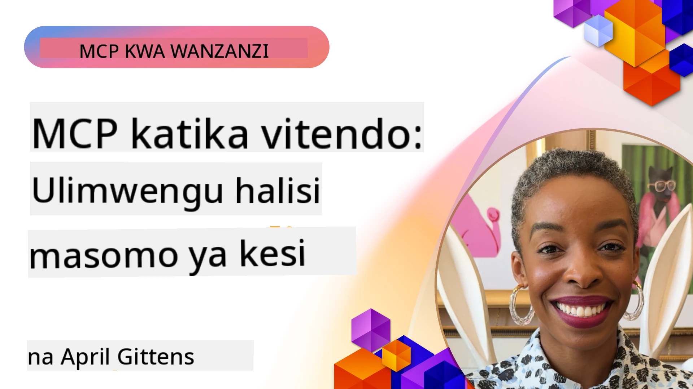

# MCP Katika Vitendo: Mafunzo ya Kesi za Ulimwengu Halisi

_(Bofya picha hapo juu kutazama video ya somo hili)_

Itifaki ya Muktadha wa Mfano (MCP) inabadilisha jinsi programu za AI zinavyoshirikiana na data, zana, na huduma. Sehemu hii inaonyesha mifano halisi ya matukio inayothibitisha matumizi ya vitendo ya MCP katika hali mbalimbali za biashara.

## Muhtasari

Sehemu hii inaonyesha mifano halisi ya utekelezaji wa MCP, ikionyesha jinsi mashirika yanavyotumia itifaki hii kutatua changamoto tata za biashara. Kwa kuchunguza mafunzo haya ya kesi, utapata ufahamu juu ya uwezo wa matumizi mengi, upanuzi, na faida za vitendo za MCP katika hali halisi.

## Malengo Muhimu ya Kujifunza

Kwa kuchunguza mafunzo haya, utakuwa na uwezo wa:

- Kuelewa jinsi MCP inaweza kutumika kutatua matatizo maalum ya biashara
- Kujifunza kuhusu mifumo tofauti ya ushirikiano na mbinu za usanifu
- Kutambua mbinu bora za kutekeleza MCP katika mazingira ya biashara
- Kupata ufahamu juu ya changamoto na suluhisho zilizoletwa katika utekelezaji wa ulimwengu halisi
- Kutambua fursa za kutumia mifumo kama hiyo katika miradi yako mwenyewe

## Mafunzo ya Kesi Yanayojulikana

### 1. [Wakala wa Safiri wa Azure AI – Utekelezaji wa Marejeleo](./travelagentsample.md)

Mafunzo haya ya kesi yanachambua suluhisho kamili la marejeleo la Microsoft linaloonyesha jinsi ya kujenga programu ya upangaji wa safari yenye mawakala wengi, inayotumia AI kwa nguvu kwa kutumia MCP, Azure OpenAI, na Azure AI Search. Mradi huu unaonyesha:

- Uendeshaji wa mawakala wengi kupitia MCP
- Uunganishaji wa data za biashara na Azure AI Search
- Usanifu salama, unaopanuka kwa kutumia huduma za Azure
- Zana zinazoweza kupanuliwa kwa vipengele vya MCP vinavyotumika tena
- Uzoefu wa mtumiaji wa mazungumzo unaotumia Azure OpenAI

Maelezo ya usanifu na utekelezaji yanatoa ufahamu muhimu juu ya jinsi ya kujenga mifumo tata ya mawakala wengi kwa MCP kama safu ya uratibu.

### 2. [Kusasisha Vipengee vya Azure DevOps Kutoka kwa Data ya YouTube](./UpdateADOItemsFromYT.md)

Mafunzo haya ya kesi yanaonyesha matumizi ya vitendo ya MCP kwa kuendesha otomatiki michakato ya kazi. Yanaonyesha jinsi zana za MCP zinaweza kutumika:

- Kutoa data kutoka kwa majukwaa ya mtandaoni (YouTube)
- Kusasisha vipengee vya kazi katika mifumo ya Azure DevOps
- Kuunda michakato ya otomatiki inayoweza kurudiwa
- Kuunganisha data kati ya mifumo tofauti

Mfano huu unaonyesha jinsi hata utekelezaji wa MCP rahisi unaweza kutoa faida kubwa za ufanisi kwa kuendesha kazi za kawaida kwa otomatiki na kuboresha usahihi wa data katika mifumo.

### 3. [Kupata Nyaraka za Wakati Halisi kwa MCP](./docs-mcp/README.md)

Mafunzo haya ya kesi yanakuongoza kuungana na seva ya Itifaki ya Muktadha wa Mfano (MCP) kwa kutumia mteja wa Python console ili kupata na kurekodi nyaraka za Microsoft za wakati halisi na zenye muktadha. Utajifunza jinsi ya:

- Kuungana na seva ya MCP kwa kutumia mteja wa Python na SDK rasmi ya MCP
- Kutumia wateja wa HTTP wanaotiririsha kwa ajili ya kupata data kwa ufanisi na wakati halisi
- Kupiga simu zana za nyaraka kwenye seva na kurekodi majibu moja kwa moja kwenye console
- Kuunganisha nyaraka za Microsoft zilizosasishwa katika mchakato wako bila kutoka kwenye terminal

Sura hii inajumuisha zoezi la vitendo, mfano mdogo wa kazi wa msimbo, na viungo kwa rasilimali zaidi za kujifunza kwa undani zaidi. Tazama maelezo kamili na msimbo katika sura iliyounganishwa kuelewa jinsi MCP inavyoweza kubadilisha upatikanaji wa nyaraka na uzalishaji wa watengenezaji katika mazingira ya console.

### 4. [Programu ya Mtandao ya Kizalishaji ya Mpango wa Masomo Inayowasiliana na MCP](./docs-mcp/README.md)

Mafunzo haya ya kesi yanaonyesha jinsi ya kujenga programu ya mtandao inayowasiliana kwa kutumia Chainlit na Itifaki ya Muktadha wa Mfano (MCP) kuunda mipango ya masomo binafsi kwa mada yoyote. Watumiaji wanaweza kubainisha somo (kama vile "vyeti vya AI-900") na muda wa masomo (kwa mfano, wiki 8), na programu itatoa mgawanyo wa wiki kwa wiki wa maudhui yanayopendekezwa. Chainlit inawezesha kiolesura cha mazungumzo, kufanya uzoefu huo kuvutia na kubadilika.

- Programu ya mazungumzo mtandaoni inayotumia Chainlit
- Maagizo ya mtumiaji kwa mada na muda
- Mapendekezo ya maudhui wiki kwa wiki kwa kutumia MCP
- Majibu ya wakati halisi, yanayobadilika katika kiolesura cha mazungumzo

Mradi unaonyesha jinsi AI ya mazungumzo na MCP vinaweza kuunganishwa kuunda zana za elimu zinazobadilika na zinazotegemea mtumiaji katika mazingira ya mtandao ya kisasa.

### 5. [Nyaraka Ndani ya Mhariri na Seva ya MCP katika VS Code](./docs-mcp/README.md)

Mafunzo haya ya kesi yanaonyesha jinsi unavyoweza kuleta Nyaraka za Microsoft Learn moja kwa moja katika mazingira yako ya VS Code kwa kutumia seva ya MCP—hakuna tena kubadilisha tabo za kivinjari! Utaona jinsi ya:

- Kutafuta na kusoma nyaraka ndani ya VS Code mara moja kwa kutumia paneli ya MCP au menyu ya amri
- Kurejelea nyaraka na kuingiza viungo moja kwa moja katika faili zako za README au markdown za kozi
- Kutumia GitHub Copilot na MCP pamoja kwa mchakato mzuri wa nyaraka na msimbo unaoendeshwa na AI
- Thibitisha na boresha nyaraka zako kwa maoni ya wakati halisi na usahihi unaotoka Microsoft
- Unganisha MCP na michakato ya GitHub kwa uthibitishaji endelevu wa nyaraka

Utekelezaji unajumuisha:

- Mipangilio ya mfano `.vscode/mcp.json` kwa usanidi rahisi
- Mwongozo wa hatua kwa hatua kwa kutumia picha za uzoefu ndani ya mhariri
- Vidokezo vya kuunganisha Copilot na MCP kwa uzalishaji mkubwa zaidi

Hali hii ni bora kwa waandishi wa kozi, waandishi wa nyaraka, na waendelezaji wanaotaka kuendelea kuzingatia katika mhariri wao wakati wakifanya kazi na nyaraka, Copilot, na zana za uthibitishaji—vyote vinavyoendeshwa na MCP.

### 6. [Uundaji wa Seva ya APIM MCP](./apimsample.md)

Mafunzo haya ya kesi yanatoa mwongozo wa hatua kwa hatua juu ya jinsi ya kuunda seva ya MCP kwa kutumia Azure API Management (APIM). Yanajumuisha:

- Kusanidi seva ya MCP katika Azure API Management
- Kutoa huduma za API kama zana za MCP
- Kusanidi sera za kuweka kikomo cha kiwango na usalama
- Kupima seva ya MCP kwa kutumia Visual Studio Code na GitHub Copilot

Mfano huu unaonyesha jinsi ya kutumia uwezo wa Azure kuunda seva imara ya MCP inayoweza kutumika katika programu tofauti, ikiboresha muunganisho wa mifumo ya AI na API za biashara.

### 7. [Rekodi ya MCP ya GitHub — Kuongeza Kasi ya Muunganisho wa Wakala](https://github.com/mcp)

Mafunzo haya ya kesi yanachunguza jinsi Rekodi ya MCP ya GitHub, iliyoanzishwa Septemba 2025, inavyoshughulikia changamoto muhimu katika mfumo wa AI: ugunduzi na uanzishaji wa seva za MCP uliozongwafanywa.

#### Muhtasari
**Rekodi ya MCP** inatatua tatizo la kukusanyika kwa seva za MCP katika hifadhidata na rejista mbalimbali, jambo ambalo awali lilifanya ushirikiano kucheleweshwa na kuwa na makosa. Seva hizi zinawezesha mawakala wa AI kuingiliana na mifumo ya nje kama API, hifadhidata, na vyanzo vya nyaraka.

#### Taarifa ya Tatizo
Waendelezaji wa michakato ya wakala walikumbana na changamoto kadhaa:
- **Ugunduzi mdogo** wa seva za MCP katika majukwaa tofauti
- **Maswali ya kurudia kuhusu usanidi** iliyosambazwa kwenye majukwaa na nyaraka
- **Hatari za usalama** kutoka kwa vyanzo visivyothibitishwa na kutokuwa waaminifu
- **Ukosefu wa viwango** katika ubora na ulinganifu wa seva

#### Usanifu wa Suluhisho
Rekodi ya MCP ya GitHub inajumuisha seva za MCP zilizothibitishwa na sifa kuu kama:
- **Usakinishaji kwa bonyeza moja** kupitia VS Code kwa usanidi rahisi
- **Kupanga ishara juu ya kelele** kwa nyota, shughuli, na uthibitisho wa jumuiya
- **Ushirikiano wa moja kwa moja** na GitHub Copilot na zana zingine zinazolingana na MCP
- **Mfano wazi wa michango** unaowawezesha washirika wa jumuiya na biashara kuchangia

#### Mwelekeo wa Biashara
Rekodi imeleta maboresho yanayopimika:
- **Kuanza kwa haraka** kwa waendelezaji kutumia zana kama Microsoft Learn MCP Server, inayotiririsha nyaraka rasmi moja kwa moja kwa mawakala
- **Kuongeza uzalishaji** kupitia seva maalum kama `github-mcp-server`, inayowezesha otomatiki ya lugha asilia GitHub (kuunda PR, kurudia CI, kuchanganua msimbo)
- **Kuimarisha uaminifu wa mfumo** kupitia orodha zilizoongozwa na viwango vya uwazi vya usanidi

#### Thamani ya Mikakati
Kwa wataalamu wa usimamizi wa mzunguko wa wakala na michakato inayorudiwa, Rekodi ya MCP hutoa:
- **Uwezo wa kusambaza mawakala kwa vipengele vya kawaida**
- **Mistari ya tathmini inayotegemea rekodi** kwa upimaji na uthibitishaji thabiti
- **Ushirikiano wa zana tofauti** unaowezesha muunganisho usio na mshono kati ya majukwaa tofauti ya AI

Mafunzo haya ya kesi yanaonyesha kwamba Rekodi ya MCP si tu saraka—ni jukwaa la msingi kwa muunganisho wa mifano inayoweza kupanuka na usambazaji wa mifumo ya wakala.

### 8. [Kuchapisha kwenye Mitandao ya Kijamii Kutoka kwa Wakala](./publora-social-publishing.md)

Mafunzo haya ya kesi yanaelezea **seva ya MCP ya mbali inayoweza kuandika** — zana zake huchukua hatua zisizoweza kubadilishwa kwa niaba ya mtumiaji — kwa kutumia kuchapisha mitandao ya kijamii kama mfano. Wakala huandika chapisho, mwanadamu huridhia, na seva huandaa ratiba ya kuchapisha mitandaoni.

Sehemu ya kuvutia ni vizingiti vya muundo vinavyowekwa na kuchapisha, ambavyo hutumika kwa seva yoyote inayochapisha badala ya kusoma:

- **Ugonjwa wa wazi, utekelezaji uliothibitishwa** — `tools/list` inajibiwa bila nyaraka ili rejista na wateja waweze kuangalia ndani, wakati kila `tools/call` inahitaji token na vinginevyo hurudisha `401` na kichwa cha `WWW-Authenticate`
- **Usajili wa OAuth bila hatua ya nje** — usajili wa mteja wa moja kwa moja leo, na Hati za Meta-data za Kitambulisho cha Mteja kama mwelekeo wa spishi ya `2026-07-28`
- **Maelezo ya zana** (`readOnlyHint`, `destructiveHint`, `idempotentHint`) ambazo wateja hutumia kuamua nini kuthibitisha — vidokezo zaidi badala ya marufuku, na kitu ambacho saraka za viunganishi sasa zinatarajia katika mapitio
- **Vitambulisho visivyo vya ubunifu**, hivyo thamani ya kufikirika inashindwa kwa kelele badala ya kutenda kwa thamani inayoweza kuonekana kuwa halali
- **Vifunguo vya Idempotency kwenye zana za kuunda chapisho**, hivyo jaribio la wakala halitawasilisha chapisho mara mbili
- **Lengo lisilo la operesheni lililotajwa katika skimu ya zana** linalotumia njia kamili ya kuandika na kuchapishiwa hakuna kitu, kwa wachunguzi na CI

Sura inahitimishwa na orodha fupi ya ukaguzi ambayo unaweza kuitumia kwa seva unayojenga.

## Hitimisho

Mafunzo haya nane ya kina yanaonyesha ufanisi wa ajabu na matumizi ya vitendo ya Itifaki ya Muktadha wa Mfano katika hali mbalimbali za ulimwengu halisi. Kuanzia mifumo tata ya upangaji wa safari yenye mawakala wengi na usimamizi wa API za biashara hadi michakato rahisi ya nyaraka na Rekodi ya MCP ya GitHub inayobadilisha, mifano hii inaonyesha jinsi MCP inavyotoa njia ya kiwango, inayopanuka kuunganisha mifumo ya AI na zana, data, na huduma wanazohitaji kutoa thamani bora.

Mafunzo ya kesi yanagusa vipengele vingi vya utekelezaji wa MCP:
- **Muunganisho wa Biashara**: Usimamizi wa Azure API na otomatiki ya Azure DevOps
- **Uendeshaji wa Mawakala Wengi**: Kupanga safari kwa mawakala wa AI walioratibu
- **Uzalishaji wa Watengenezaji**: Muunganisho wa VS Code na upatikanaji wa nyaraka wakati halisi
- **Maendeleo ya Mfumo wa AI**: Rekodi ya MCP ya GitHub kama jukwaa la msingi
- **Matumizi ya Elimu**: Vizalishaji vya mipango ya masomo inayowasiliana na kiolesura cha mazungumzo

Kwa kusoma utekelezaji huu, unapata ufahamu muhimu juu ya:
- **Mifumo ya usanifu** kwa ukubwa na matumizi tofauti
- **Mikakati ya utekelezaji** inayobalansi utendakazi na urahisi wa matengenezo
- **Mambo ya usalama na upanuzi** kwa usambazaji wa uzalishaji
- **Mbinu bora** za maendeleo ya seva za MCP na ushirikiano wa wateja
- **Fikiria mfumo wa AI** kwa kujenga suluhisho zilizounganishwa na nguvu za AI

Mifano hii kwa pamoja inaonyesha kuwa MCP si mfumo wa nadharia tu bali itifaki yenye ufanisi, tayari kwa uzalishaji inayowezesha suluhisho halisi kwa changamoto tata za biashara. Iwe unajenga zana rahisi za otomatiki au mifumo ya mawakala wengi yenye akili, mifumo na mbinu zilizotolewa hapa hutoa msingi thabiti kwa miradi yako ya MCP.

## Rasilimali Zaidi

- [Hifadhidata ya Wakala wa Safiri wa Azure AI GitHub](https://github.com/Azure-Samples/azure-ai-travel-agents)
- [Zana ya Azure DevOps MCP](https://github.com/microsoft/azure-devops-mcp)
- [Zana ya Playwright MCP](https://github.com/microsoft/playwright-mcp)
- [Seva ya Nyaraka za Microsoft MCP](https://github.com/MicrosoftDocs/mcp)
- [Rekodi ya MCP ya GitHub — Kuongeza Kasi ya Muunganisho wa Wakala](https://github.com/mcp)
- [Mifano ya Jumuiya ya MCP](https://github.com/microsoft/mcp)

## Nini Kifuatacho

- Iliyotangulia: [Moduli 8: Mbinu Bora](../08-BestPractices/README.md)
- Ifuatayo: [Moduli 10: Kurahisisha Michakato ya AI: Kujenga Seva ya MCP na Kifaa cha AI](../10-StreamliningAIWorkflowsBuildingAnMCPServerWithAIToolkit/README.md)

---

<!-- CO-OP TRANSLATOR DISCLAIMER START -->
**Kionyozo**:
Hati hii imetafsiriwa kwa kutumia huduma ya tafsiri ya AI [Co-op Translator](https://github.com/Azure/co-op-translator). Ingawa tunajitahidi kupata usahihi, tafadhali fahamu kwamba tafsiri za kiotomatiki zinaweza kuwa na makosa au upungufu wa usahihi. Hati ya asili katika lugha yake halisi inapaswa kuchukuliwa kama chanzo cha mamlaka. Kwa taarifa muhimu, tafsiri ya kitaalamu inayofanywa na binadamu inapendekezwa. Hatutojibu kwa kuelewa vibaya au tafsiri potofu zinazotokea kutokana na matumizi ya tafsiri hii.
<!-- CO-OP TRANSLATOR DISCLAIMER END -->