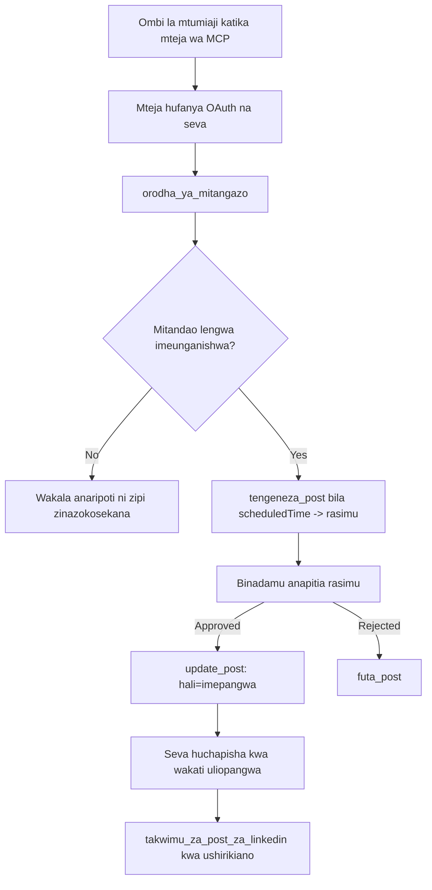

# Uchunguzi wa Kesi: Kuchapisha kwenye Mitandao ya Kijamii kutoka kwa Wakala kwa Server ya MCP ya Mbali

> **Kiarifu cha Masuala:** Huduma kadhaa na miradi ya chanzo wazi inaweza kuchapisha kwenye mitandao ya kijamii, na timu inaweza pia kuunganisha API ya kila mtandao moja kwa moja. Hali iliyopo hapa chini imetolewa kama mfano mmoja wa jinsi **server ya MCP ya mbali inayoweza kuandika** inaweza kubuniwa na kutumiwa. Publora ni huduma ya kibiashara yenye kiwango cha bure; mifumo iliyobainishwa hapa inahusu server yoyote ya MCP inayofanya vitendo visivyorudishwa kwa niaba ya mtumiaji.

## Muhtasari

Wakala ni wazuri katika kutayarisha maudhui na wabovu katika kuyapeleka. Mfano unaweza kuandika tangazo la kutolewa kwa sekunde chache, na kisha kazi inasimama: kuchapisha kunahitaji API kwa mtandao kila mmoja, programu ya OAuth kwa mtandao kila mmoja, na seti tofauti ya sheria za vyombo vya habari kwa kila mmoja. Timu nyingi hushughulikia hili kwa kunakili maandishi kwenye kivinjari kwa mkono.

Uchunguzi huu wa kesi unachunguza jinsi hatua hiyo ya mwisho inafungwa na server moja ya MCP ya mbali, na — kwa manufaa zaidi kwa yeyote anayeijenga — maamuzi ya muundo ambayo server **inayoweza kuandika** inapaswa kufanya sawa. Kusoma data ni msamaha. Kuchapisha siyo: mwito mbaya wa zana ni waonekana kwa watazamaji na hauwezi kubadilishwa.

## Hali

Timu ndogo ya uhusiano wa waundaji wanaandaa machapisho ndani ya wakala (Claude, VS Code, Cursor — mteja hauna umuhimu). Wanataka wakala afanye:

- kuona akaunti za mitandao ya kijamii zilizounganishwa na timu,
- kuandika chapisho na kuacha kama rasimu kwa mtu kuidhinisha,
- kuambatisha picha,
- kupanga kwenye mitandao kadhaa kwa wakati uliochaguliwa,
- na baadaye kuripoti jinsi ilivyofanya kazi.

Muhimu, wanataka wakala asiwe na uwezo wa kuchapisha kwa bahati mbaya wakati bado wanajaribu.

## Zana Zilitumika

- [Publora MCP Server](https://github.com/publora/mcp-server) — server ya MCP ya mbali (`streamable-http`) inayotoa zana za kuchapisha, kupanga, vyombo vya habari na takwimu za LinkedIn. Imejisajili katika rejista rasmi ya MCP kama `com.publora/mcp-server`.

## Mchakato Hatua kwa Hatua

1. **Unganisha server.** Wateja wanaozungumza OAuth hukamilisha mtiririko wa msimbo wa idhini kwa PKCE dhidi ya skrini ya idhini ya server; wateja wasio na uwezo huo, kama CLI zisizo na kichwa, hutumia ufunguo wa API wa Publora kwenye kichwa cha ombi. Njia zote mbili zinasaidiwa, na ni ipi unayoitegemea mteja, si server.
2. **Orodhesha muunganisho.** Wakala huita `list_connections` na kupokea akaunti zilizounganishwa na vitambulisho vyao.
3. **Andaa rasimu.** Wakala huita `create_post` *bila* muda uliopangwa. Chapisho huhifadhiwa kama rasimu — hakuna kinachochapishwa.
4. **Ambatisha media.** URL za picha za umma huzungushwa kwenye mwito huo huo; server hupakua na kuthibitisha.
5. **Panga.** Baada ya binadamu kuidhinisha, `update_post` huweka hali kuwa imepangwa na muda wa ISO 8601.
6. **Pima.** Kwa LinkedIn, `linkedin_post_stats` hurudisha ushiriki mara chapisho linapokuwa hai.

## Mfano wa Ombi

```text
Which social accounts do I have connected?
Draft a post announcing our new changelog page, attach the screenshot at
https://example.com/changelog.png, and keep it as a draft — do not publish it.
Once I approve, schedule it to LinkedIn and Bluesky for tomorrow at 09:00 UTC.
```

## Chati ya Mtiririko ya Mermaid



## Utekelezaji wa Kiufundi

Mafunzo hapa chini ni sehemu inayoweza kuhamishwa ya uchunguzi huu wa kesi.

### Ugunduzi wazi, utekelezaji uliothibitishwa

`tools/list` hupatikana bila vyeti; kila `tools/call` inahitaji token na vinginevyo hurudisha `401` na kichwa cha `WWW-Authenticate` kinachoelekeza kwenye metadata ya rasilimali iliyo chini ya ulinzi. (Server pia hujibu `initialize` isiyo na uthibitisho, ambayo ni muhimu tu kwa wateja wa toleo la awali kabla ya `2026-07-28`; marekebisho hayo yaliondoa kabisa mkono wa mikono.)

Ugawaji huu ni muhimu katika vitendo. Ordinary ya rejista, katalogi na wateja wanaweza kuchunguza eneo la zana — majina, masemo, maelezo — bila kuwa na siri, wakati hakuna chochote kinaweza *kutekelezwa* kiasiri. Server inayotaka token kwa `initialize` haikuonekana na zana; server inayoruhusu `tools/call` ya mjambazi ni hatari.

### Usajili: usajili wa mteja unaobadilika, na kinachobadilisha

Server hutangaza `/.well-known/oauth-protected-resource` na `/.well-known/oauth-authorization-server`, na inasaidia mtiririko wa msimbo wa idhini kwa PKCE (`S256`), token za uhuishaji, na **usajili wa mteja unaobadilika**.

Usajili unaobadilika unaondoa hatua ya mkono: bila huo mteja kila mmoja anahitaji `client_id` iliyotolewa awali, ambayo inamaanisha ombi nje ya mpangilio kwa muuzaji kwa kila mteja mpya.

Tazama hili kama tabia ya ulinganifu badala ya muundo wa kunakili. Marekebisho ya `2026-07-28` ya spesifiesheni yanawasha usajili wa mteja unaobadilika kwa ajili ya Hati za Metadata za Kitambulisho cha Mteja, ambapo mteja huhifadhi hati ya metadata kwenye URL thabiti ya HTTPS na URL hiyo *ndiyo* `client_id`. DCR inaendelea kufanya kazi kwa sasa, lakini server inayojengwa leo inapaswa kupanga kwa CIMD na kuweka DCR tu kwa wateja wazee.

### Maelezo ya zana si mapambo

Kila zana ina `title` na vidokezo vinavyotumika: `readOnlyHint`, `destructiveHint`, `idempotentHint`, `openWorldHint`.

Sababu mbili za kuwekeza kwenye vidokezo hivyo. Kwanza, wateja hutumia vidokezo kuamua nini kuthibitisha kwa mtumiaji — mteja anaweza kuendesha kuaangalia kwa usomaji tu na kusimama kwa idhini kabla ya kufuta. Maelezo ni wazi kwamba vidokezo ni vidokezo visivyoaminika, si utaratibu wa idhini: vinaunda kile mteja hutoa kufanya, havizuizi chochote kwenye server, na server bado lazima ifuate sheria zake. Pili, orodha kuu za waunganishaji sasa *zinahitaji* vidokezo kwa ukaguzi; server zisizo na majina na vidokezo zitarejeshwa bila kujali uwezo wake.

### Fanya vitambulisho visivyovinaweza kubuniwa

Vitambulisho vya jukwaa ni mistari isiyoonekana inayorejeshwa na `list_connections`, na maelezo ya muundo yanasema wazi kuwa lazima vikopiwe tovuti kwa tovuti na usikadiri. Server hukataa chochote kingine.

Mifano ni wachunguzi wenye ufanisi. Server yoyote inayoweza kuandika inapaswa kudhani kitambulisho hatimaye kitatengenezwa kiholela na kutengeneza njia hiyo ishindwe kwa sauti na mapema badala ya kutenda kwa thamani inayoweza kuaminika.

### Gonga kabla ya kuchapisha, na ujumbe wa kutekeleza

Mitandao mingine hukataa machapisho ya maandishi tu na inahitaji picha au video. Hiyo inathibitishwa wakati chapisho linapopangwa, na kosa linaorodhesha jukwaa na hitaji linalokosekana.

Wakala anaweza kupona kutoka kwa "Instagram inahitaji media — ambatisha picha au video" bila ziara nyingine ya mzunguko. Haiwezi kupona kutoka kwa `400` ya jumla.

### Fanya jaribio kuwa salama

Zana mbili zinazotoa maudhui, `create_post` na `update_post`, zinakubali ufunguo wa idempotency: kuutumia tena na ombi sawia hurudia majibu ya awali badala ya kuunda chapisho la pili. Muda wa wakala hurudia inapochelewa; bila idempotency, jibu polepole huwa chapisho maradufu. Zana nyingine za kuandika — kufuta, hatua za media, majibu na maoni ya LinkedIn — hazichukui, kwa hivyo kurudia huko si salama moja kwa moja. Ni vyema kujua ni mabadiliko yapi yako salama na yapi siyo.

### Toa njia ya kujaribu ambayo haichapishi chochote

Server inakubali lengo lililohifadhiwa, `publora-playground`, ambalo linathibitishwa na kukubaliwa kama mwisho halisi na halafu linatupwa — hakuna kinachofika akaunti halisi. Imethibitishwa katika muundo wa zana yenyewe, ambayo mteja yoyote anaweza kusoma bila vyeti: eneo la `platforms` la `create_post` linaliandika kama "lengo la mtihani wa muunganisho linalohitaji hakuna muunganisho halisi — chapisho linakubaliwa na kutupwa, hakuna kinachochapishwa". Litumie kwa kuipitia kama kipengele kimoja tu: `platforms: ["publora-playground"]`.

Hili lilibainika kuwa moja ya maelezo muhimu zaidi ya uso wote. Wakaguzi wa orodha za waunganishaji, wachangiaji na CI wanaweza kufanya njia nzima ya kuandika kwa kina bila hatari kwa watazamaji halisi. Server yeyote ya MCP yenye vitendo visivyozyumbufu inafaidika na eneo lililofafanuliwa la no-op.

## Matokeo na Mwingiliano

- Hatua ya kuchapisha ilihamishwa kutoka kwa kivinjari kwenda kwenye mazungumzo ambapo yaliyomo yanaandikwa, na tabia ya rasimu-ya kwanza huweka binadamu ndani ya mzunguko. Kuwa sahihi kuhusu nini hiyo ni: rasimu ni tamaduni, si mpaka. Cheti sawa kinaweza kupanga au kuchapisha, hivyo mtu yeyote anayeihitaji idhini halisi anapaswa kuitekeleza nje ya uso wa zana — vyeti tofauti, au safu ya sera mbele ya server.
- Tofauti za mtandao kwa mtandao — mahitaji ya media, uzi, udhibiti wa majibu — hushughulikiwa mara moja kwenye server badala ya katika wakala kila mmoja anayezungumza nayo.
- Server hiyo hiyo inasaidia wateja kadhaa wa MCP bila kazi kwa mteja, kwa sababu ugunduzi ni wazi na usajili ni mabadilika.
- Vizuizi vya muundo vilivyotajwa hapo juu viligawanywa na mapitio ya orodha ya waunganishaji kama vile kwa watumiaji: maelezo, OAuth na eneo la mtihani salama yaliombwa kila moja na angalau mmoja wao.

## Marejeleo

- [Publora MCP Server (chanzo)](https://github.com/publora/mcp-server)
- [API ya Publora na nyaraka za MCP](https://docs.publora.com)
- [Entry ya rejista ya MCP: `com.publora/mcp-server`](https://registry.modelcontextprotocol.io/v0/servers?search=com.publora/mcp-server)
- [Spesifiesheni ya MCP — Idhini](https://modelcontextprotocol.io/specification/draft/basic/authorization)
- [Spesifiesheni ya MCP — Maelezo ya zana](https://modelcontextprotocol.io/docs/concepts/tools)

## Kinachofuata

- Chukua server ya MCP unayojenga na angalia mafanikio matatu ya bei nafuu hapa: maelezo kwenye kila zana, ufunguo wa idempotency kwenye kila uandishi, na eneo lililothibitishwa la no-op.
- Jaribu ugawaji wa ugunduzi wazi: ita `tools/list` dhidi ya server ya mbali ya umma bila vyeti, kisha ita zana na angalia changamoto ya `401`.
- Fikiria maana ya "kurejesha" kwa uwanja wako. Kuchapisha kuna rasimu na kufuta; ikiwa vitendo vyako vyanafanana, uthibitisho unapaswa kuwekwa kwenye muundo wa zana, si kwenye ombi.

---

<!-- CO-OP TRANSLATOR DISCLAIMER START -->
**Kionyozo**:
Hati hii imetafsiriwa kwa kutumia huduma ya tafsiri ya AI [Co-op Translator](https://github.com/Azure/co-op-translator). Ingawa tunajitahidi kupata usahihi, tafadhali fahamu kwamba tafsiri za kiotomatiki zinaweza kuwa na makosa au upungufu wa usahihi. Hati ya asili katika lugha yake halisi inapaswa kuchukuliwa kama chanzo cha mamlaka. Kwa taarifa muhimu, tafsiri ya kitaalamu inayofanywa na binadamu inapendekezwa. Hatutojibu kwa kuelewa vibaya au tafsiri potofu zinazotokea kutokana na matumizi ya tafsiri hii.
<!-- CO-OP TRANSLATOR DISCLAIMER END -->