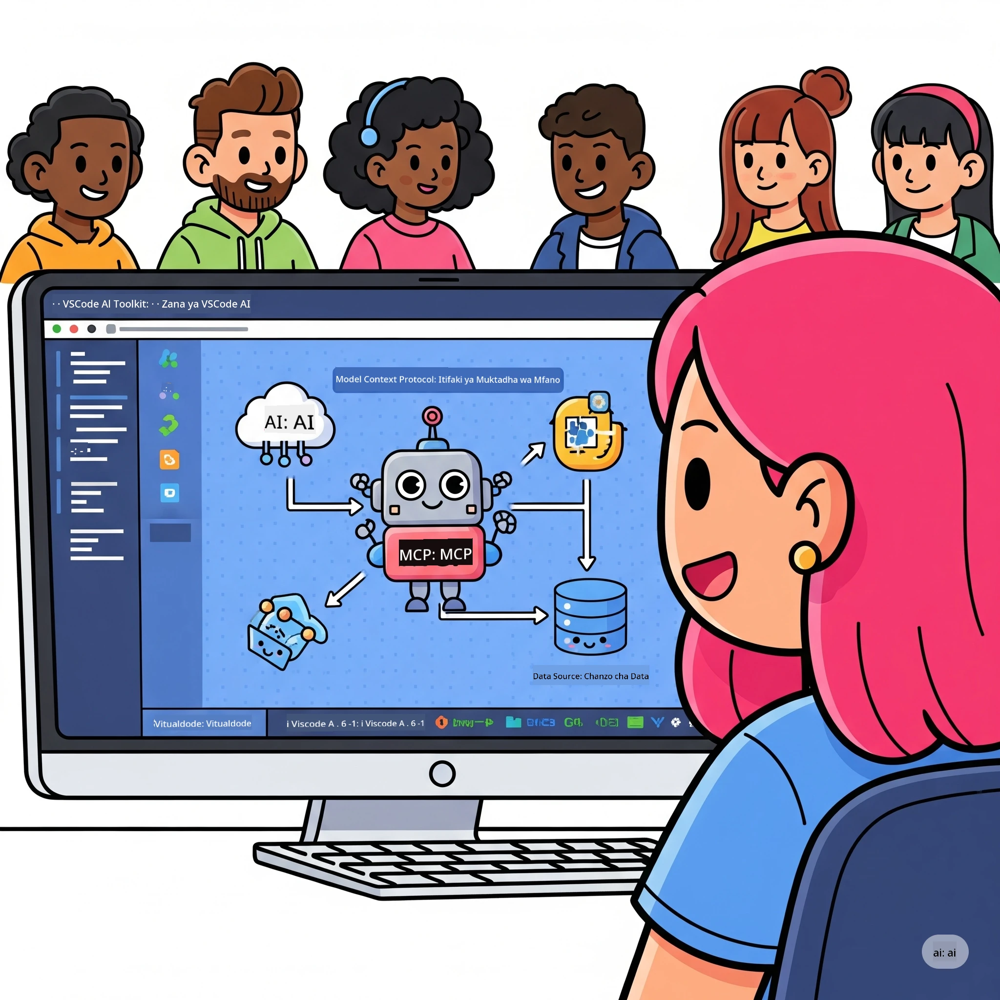
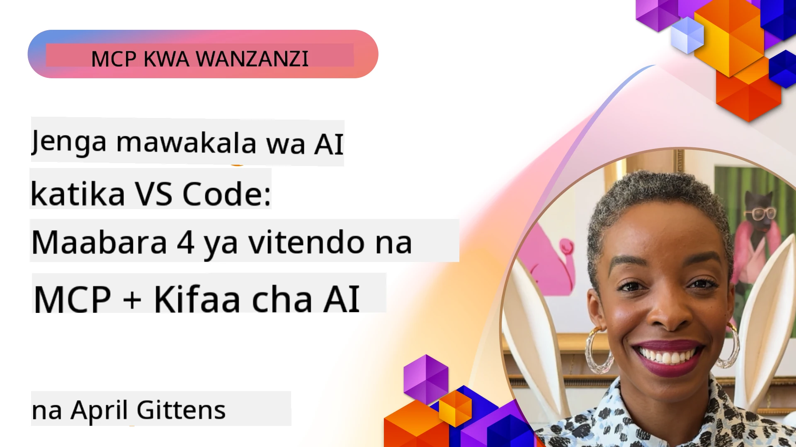

# Kurahisisha Mifereji ya Kazi ya AI: Kujenga Seva ya MCP na Microsoft Foundry Toolkit

## 🎯 Muhtasari

_(Bonyeza picha hapo juu kutazama video ya somo hili)_

Karibu kwenye **Warsha ya Mradi wa Muktadha wa Mfano (MCP)**! Warsha hii ya vitendo yenye maelezo kamili huunganisha teknolojia mbili za kisasa kubadilisha maendeleo ya programu za AI:

> **Kumbusho la ulinganifu:** msimbo wa warsha ujenzi na kujaribiwa na MCP
> `2025-11-25`, kama inavyoonyeshwa na beji hapo juu. Tumia
> [sifa ya sasa ya `2026-07-28`](https://modelcontextprotocol.io/specification/2026-07-28/)
> kwa utekelezaji mpya wa protokoli na hakiki noti za toleo la SDK kabla
> ya kuhama maabara.

- **🔗 Protokoli ya Muktadha wa Mfano (MCP)**: Viwango wazi kwa uunganishaji laini wa zana za AI
- **🛠️ Kiendelezi cha Microsoft Foundry Toolkit kwa VS Code**: Kiendelezi chenye nguvu cha maendeleo ya AI cha Microsoft

### 🎓 Utajifunza Nini

Mwishoni mwa warsha hii, utakuwa na ujuzi wa kujenga programu zenye akili zinazounganisha mifano ya AI na zana na huduma halisi za ulimwengu. Kuanzia upimaji wa moja kwa moja hadi ushirikiano wa API za kawaida, utapata stadi za vitendo kutatua changamoto ngumu za biashara.

## 🏗️ Stack ya Teknolojia

### 🔌 Protokoli ya Muktadha wa Mfano (MCP)

MCP ni **"USB-C kwa AI"** - kiwango cha ulimwengu kinachounganisha mifano ya AI na zana na vyanzo vya data vya nje.

**✨ Vipengele Vikuu:**

- 🔄 **Uunganishaji wa Kiwango**: Kiolesura cha ulimwengu kwa uhusiano wa zana za AI
- 🏛️ **Miundo Raha**: Seva lokal na za mbali kupitia usafirishaji wa stdio/SSE
- 🧰 **Mfumo Wenye Rasilimali Mbalimbali**: Zana, viamsha, na rasilimali katika protokoli moja
- 🔒 **Tayari kwa Biashara**: Usalama na kuaminika vilivyojengwa ndani

**🎯 Kwa Nini MCP Ni Muhimu:**
Kama usb-C ilivyotatua machafuko ya kebo, MCP huondoa ugumu wa uunganishaji wa AI. Protokoli moja, uwezekano usio na kikomo.

### 🤖 Kiendelezi cha Microsoft Foundry Toolkit kwa VS Code

Kiendelezi cha maendeleo ya AI cha ngazi ya juu cha Microsoft kinachobadilisha VS Code kuwa nguvu kubwa ya AI.

**🚀 Uwezo Msingi:**

- 📦 **Katalogi ya Mifano**: Pata mifano kutoka Azure AI, GitHub, Hugging Face, Ollama
- ⚡ **Utabiri Lokal**: Uendeshaji wa ONNX kwa CPU/GPU/NPU
- 🏗️ **Mjenzi wa Mawakala**: Maendeleo ya mwakilishi wa AI kwa picha na ushirikiano MCP
- 🎭 **Multi-Modal**: Msaada wa maandishi, kuona, na matokeo ya muundo

**💡 Faida za Maendeleo:**

- Uwekaji moduli wa mfano bila usanidi wowote
- Uhandisi wa kiamsha picha
- Uwanja wa majaribio wa wakati halisi
- Uunganishaji laini wa seva ya MCP

## 📚 Safari ya Kujifunza

### [🚀 Moduli 1: Misingi ya Microsoft Foundry Toolkit](./lab1/README.md)

**Muda**: Dakika 15

- 🛠️ Sakinisha na sanidi Microsoft Foundry Toolkit kwa VS Code
- 🗂️ Chunguza Katalogi ya Mifano (mifano zaidi ya 100 kutoka GitHub, ONNX, OpenAI, Anthropic, Google)
- 🎮 Dumisha Uwanja wa Maingiliano kwa upimaji wa mfano wa wakati halisi
- 🤖 Jenga wakala wako wa kwanza wa AI kwa Agent Builder
- 📊 Pima utendaji wa mfano kwa vipimo vilivyojengewa ndani (F1, umuhimu, usawa, muunganiko)
- ⚡ Jifunze usindikaji wa kundi na uwezo wa msaada wa multi-modal

**🎯 Matokeo ya Kujifunza**: Tengeneza wakala wa AI wa matumizi kwa uelewa kamili wa uwezo wa Microsoft Foundry Toolkit

### [🌐 Moduli 2: MCP na Misingi ya Microsoft Foundry Toolkit](./lab2/README.md)

**Muda**: Dakika 20

- 🧠 Damirisha usanifu na dhana za Protokoli ya Muktadha wa Mfano (MCP)
- 🌐 Chunguza mfumo wa seva wa MCP wa Microsoft
- 🤖 Jenga wakala wa kuendesha kivinjari ukitumia Playwright MCP server
- 🔧 Unganisha seva za MCP na Microsoft Foundry Toolkit Agent Builder
- 📊 Sanidi na jaribu zana za MCP ndani ya mawakala yako
- 🚀 Hamisha na pakia mawakala yanayotumia MCP kwa matumizi ya uzalishaji

**🎯 Matokeo ya Kujifunza**: Weka wakala wa AI aliyezidiwa nguvu na zana za nje kupitia MCP

### [🔧 Moduli 3: Maendeleo ya Juu ya MCP na Microsoft Foundry Toolkit](./lab3/README.md)

**Muda**: Dakika 20

- 💻 Tengeneza seva za MCP maalum ukitumia Microsoft Foundry Toolkit
- 🐍 Sanidi na tumia MCP Python SDK ya hivi karibuni (tofauti 1.9.3)
- 🔍 Weka na tumia MCP Inspector kwa utatuzi wa makosa
- 🛠️ Jenga Seva ya Hali ya Hewa ya MCP kwa mifereji ya utatuzi wa kisasa
- 🧪 Tatua makosa seva za MCP katika mazingira ya Agent Builder na Inspector

**🎯 Matokeo ya Kujifunza**: Tengeneza na tatua makosa seva za MCP maalum kwa zana za kisasa

### [🐙 Moduli 4: Maendeleo ya Vitendo ya MCP - Seva Maalum ya Nakala ya GitHub](./lab4/README.md)

**Muda**: Dakika 30

- 🏗️ Jenga seva ya nakala ya GitHub MCP kwa mifereji ya maendeleo halisi
- 🔄 Tekeleza kunakili hifadhidata kwa akili kwa uthibitishaji na utunzaji wa makosa
- 📁 Tengeneza usimamizi wa hifadhidata wenye akili na ushirikiano na VS Code
- 🤖 Tumia Hali ya Wakala wa GitHub Copilot na zana maalum za MCP
- 🛡️ Weka kuaminika kwa uzalishaji na ulinganifu wa majukwaa mbalimbali

**🎯 Matokeo ya Kujifunza**: Weka seva ya MCP inayotumika uzalishaji inayorahisisha mifereji halisi ya maendeleo

## 💡 Matumizi Halisi na Athari

### 🏢 Matumizi ya Biashara

#### 🔄 Uendeshaji wa DevOps kwa Hiari

Badilisha mifereji yako ya maendeleo na uendeshaji wenye akili:

- **Usimamizi Mwerevu wa Hifadhidata**: Mapitio ya msimbo yanayotumiwa na AI na maamuzi ya kuunganisha
- **CI/CD Bora**: Uboreshaji wa mfuatano wa moja kwa moja kulingana na mabadiliko ya msimbo
- **Utangamano wa Masuala**: Uainishaji na ugawaji wa makosa kwa moja kwa moja

#### 🧪 Mapinduzi ya Ukaguzi wa Ubora

Ongeza upimaji kwa uendeshaji wa AI:

- **Uundaji Wa Mtihani wa Kitaalamu**: Tengeneza seti za mtihani kwa kina moja kwa moja
- **Upimaji wa Mabadiliko ya Muonekano**: Kugundua mabadiliko ya UI kwa nguvu za AI
- **Ufuatiliaji wa Utendaji**: Utambuzi na utatuzi wa matatizo kwa ufanisi

#### 📊 Akili ya Mifereji ya Data

Jenga mifereji ya usindikaji ya data yenye akili zaidi:

- **Mchakato wa ETL Unaoweza Kujibadilisha**: Mabadiliko ya data yanayojiboresha yenyewe
- **Ugunduzi wa Mazingira**: Ufuatiliaji wa ubora wa data kwa wakati halisi
- **Usimamizi Mwerevu wa Mtiririko wa Data**: Usimamizi wa mtiririko wa data kwa akili

#### 🎧 Kuboresha Uzoefu wa Mteja

Tengeneza mwingiliano wa kipekee wa wateja:

- **Msaada Unaojali Muktadha**: Wakala wa AI wenye ufikiaji wa historia ya mteja
- **Utatuzi wa Matatizo kwa Mbele**: Huduma ya wateja inayotabiri matatizo
- **Ushirikiano wa Mifumo Mbalimbali**: Uzoefu wa AI uliounganishwa kwenye majukwaa yote

## 🛠️ Mahitaji ya Awali na Usanidi

### 💻 Mahitaji ya Mfumo

| Kipengele | Mahitaji | Maelezo |
|-----------|-------------|-------|
| **Mfumo wa Uendeshaji** | Windows 10+, macOS 10.15+, Linux | Mfumo wowote wa kisasa |
| **Visual Studio Code** | Toleo thabiti la hivi karibuni | Inahitajika kwa Microsoft Foundry Toolkit |
| **Node.js** | v18.0+ na npm | Kwa maendeleo ya seva ya MCP |
| **Python** | 3.10+ | Hiari kwa seva za MCP za Python |
| **Kumbukumbu** | RAM 8GB angalau | 16GB inapendekezwa kwa mifano lokal |

### 🔧 Mazingira ya Maendeleo

#### Viendelezi vya VS Code Vilivyopendekezwa

- **Microsoft Foundry Toolkit** (ms-windows-ai-studio.windows-ai-studio)
- **Python** (ms-python.python)
- **Python Debugger** (ms-python.debugpy)
- **GitHub Copilot** (GitHub.copilot) - Hiari lakini ni msaada

#### Zana za Hiari

- **uv**: Meneja wa kisasa wa pakiti za Python
- **MCP Inspector**: Zana ya kuona makosa kwa seva za MCP
- **Playwright**: Kwa mifano ya kuendesha kazi za mtandao kiatomati

## 🎖️ Matokeo ya Kujifunza na Njia ya Cheti

### 🏆 Orodha ya Ustadi wa Kuongoza

Kwa kumaliza warsha hii, utapata ustadi katika:

#### 🎯 Uwezo Msingi

- [ ] **Uelewa wa Protokoli ya MCP**: Uelewa wa kina wa usanifu na mifumo ya utekelezaji
- [ ] **Uwezo wa Microsoft Foundry Toolkit**: Matumizi ya kiwango cha mtaalamu wa Microsoft Foundry Toolkit kwa maendeleo ya haraka
- [ ] **Maendeleo ya Seva Maalum**: Tengeneza, weka, na simamia seva za MCP zinazotumika uzalishaji
- [ ] **Ubora wa Ushirikiano wa Zana**: Unganisha AI na mifereji ya maendeleo iliyopo bila matatizo
- [ ] **Matumizi ya Ustadi wa Kutatua Matatizo**: Tumia stadi ulizojifunza kwa changamoto halisi za biashara

#### 🔧 Ujuzi wa Kifundi

- [ ] Sanidi na tumia Microsoft Foundry Toolkit katika VS Code
- [ ] Tengeneza na tekeleza seva maalum za MCP
- [ ] Unganisha Mifano ya GitHub na usanifu wa MCP
- [ ] Tengeneza mifereji ya majaribio ya kiotomatiki kwa Playwright
- [ ] Tumia mawakala wa AI kwa matumizi ya uzalishaji
- [ ] Tatua makosa na boresha utendaji wa seva za MCP

#### 🚀 Uwezo wa Juu

- [ ] Sanifu uunganishaji wa AI wa kiwango cha biashara
- [ ] Tekeleza mbinu bora za usalama kwa programu za AI
- [ ] Tengeneza usanifu unaoweza kupanuka wa seva za MCP
- [ ] Tengeneza mnyororo wa zana maalum kwa maeneo maalum
- [ ] Fundisha wengine katika maendeleo ya AI asilia

## 📖 Rasilimali Zaidi

- [MCP Specification (2026-07-28)](https://modelcontextprotocol.io/specification/2026-07-28/)
- [Microsoft Foundry Toolkit GitHub Repository](https://github.com/microsoft/vscode-ai-toolkit)
- [Sample MCP Servers Collection](https://github.com/modelcontextprotocol/servers)
- [Best Practices Guide](https://modelcontextprotocol.io/docs/best-practices)
- [OWASP MCP Top 10](https://microsoft.github.io/mcp-azure-security-guide/mcp/) - Mazoezi bora ya usalama

---

**🚀 Tayari kubadilisha njia yako ya maendeleo ya AI?**

Hebu tujenge pamoja mustakabali wa programu zenye akili na MCP na Microsoft Foundry Toolkit!

## Kidirisha Kinachofuata

Endelea kwa: [Moduli 11: Maabara za Mikono za Seva ya MCP](../11-MCPServerHandsOnLabs/README.md)

---

<!-- CO-OP TRANSLATOR DISCLAIMER START -->
**Kionyozo**:
Hati hii imetafsiriwa kwa kutumia huduma ya tafsiri ya AI [Co-op Translator](https://github.com/Azure/co-op-translator). Ingawa tunajitahidi kupata usahihi, tafadhali fahamu kwamba tafsiri za kiotomatiki zinaweza kuwa na makosa au upungufu wa usahihi. Hati ya asili katika lugha yake halisi inapaswa kuchukuliwa kama chanzo cha mamlaka. Kwa taarifa muhimu, tafsiri ya kitaalamu inayofanywa na binadamu inapendekezwa. Hatutojibu kwa kuelewa vibaya au tafsiri potofu zinazotokea kutokana na matumizi ya tafsiri hii.
<!-- CO-OP TRANSLATOR DISCLAIMER END -->