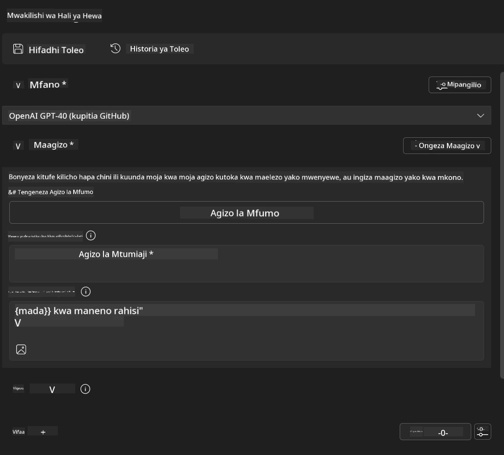
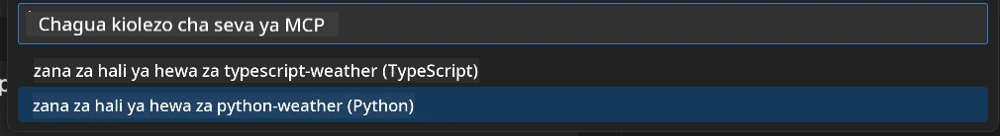
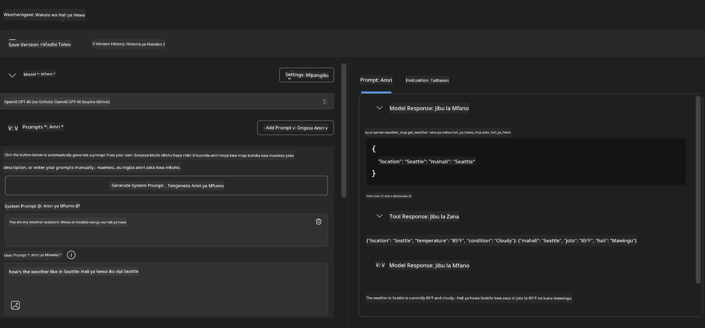
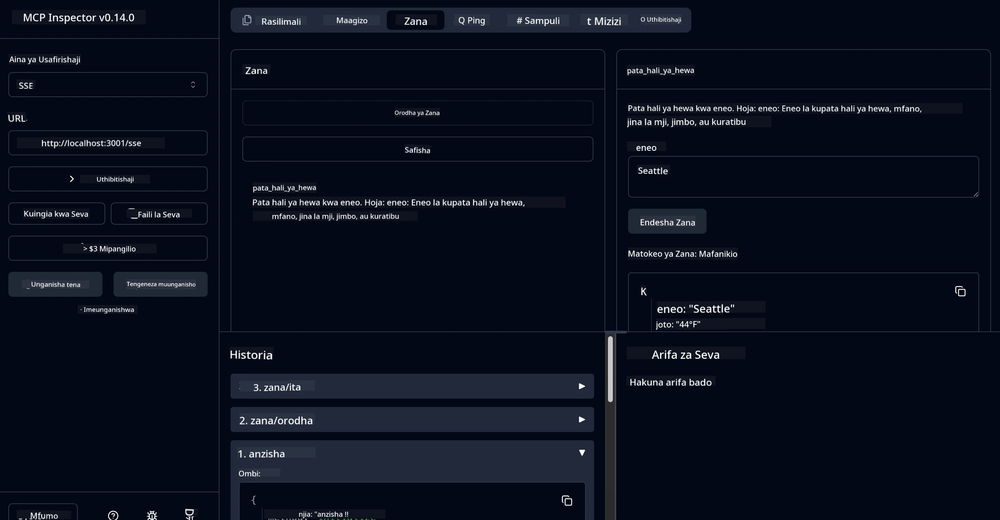

# 🔧 Moduli 3: Maendeleo ya Juu ya MCP kwa Microsoft Foundry Toolkit

> [!NOTE]
> URL za Mkaguzi katika maabara hii zinatumia mwisho wa zamani wa `/sse` na zilenga
> tegemezi za MCP SDK `1.9.3` na Inspector `0.14.0` zilizowekwa. Haziwezi kuwa
> mifano ya sasa ya HTTP inayoweza kupelekwa tarehe `2026-07-28`.


## 🎯 Malengo ya Kujifunza

Mwisho wa maabara hii, utaweza:

- ✅ Tengeneza seva maalum za MCP kwa kutumia Microsoft Foundry Toolkit
- ✅ Sanidi na tumia SDK ya hivi karibuni ya MCP Python (v1.9.3)
- ✅ Weka na tumia MCP Inspector kwa ajili ya kutatua matatizo
- ✅ Tatuakapo seva za MCP katika mazingira ya Agent Builder na Inspector
- ✅ Elewa njia za juu za maendeleo ya seva za MCP

## 📋 Masharti ya Awali

- Kumaliza Maabara 2 (Misingi ya MCP)
- VS Code na ugani wa Microsoft Foundry Toolkit umewekwa
- Mazingira ya Python 3.10+
- Node.js na npm kwa usanidi wa Inspector

## 🏗️ Kile Utakachojenga

Katika maabara hii, utaunda **Seva ya Hali ya Hewa ya MCP** inayonyesha:
- Utekelezaji maalum wa seva ya MCP
- Muunganiko na Microsoft Foundry Toolkit Agent Builder
- Njia za kitaalamu za kutatua matatizo
- Miingiliano ya kisasa ya MCP SDK

---

## 🔧 Muhtasari wa Vipengele Muhimu

### 🐍 MCP Python SDK
MCP Python SDK hutoa msingi wa kujenga seva maalum za MCP. Utatumia toleo 1.9.3 lenye uwezo wa kuboresha upimaji wa matatizo.

### 🔍 MCP Inspector
Chombo cha nguvu cha kutatua matatizo kinachotoa:
- Ufuatiliaji wa seva kwa wakati halisi
- Uonyesho wa utekelezaji wa zana
- Ukaguzi wa maombi/marejesho ya mtandao
- Mazingira ya majaribio ya mwingiliano

---

## 📖 Utekelezaji Hatua kwa Hatua

### Hatua 1: Tengeneza Agent wa Hali ya Hewa katika Agent Builder

1. **Zindua Agent Builder** katika VS Code kupitia programu-jalizi ya Microsoft Foundry Toolkit
2. **Tengeneza wakala mpya** na usanidi ufuatao:
   - Jina la Wakala: `WeatherAgent`



### Hatua 2: Anzisha Mradi wa Seva ya MCP

1. **Nenda kwa Zana** → **Ongeza Zana** katika Agent Builder
2. **Chagua "Seva ya MCP"** kutoka kwa chaguzi zilizopo
3. **Chagua "Tengeneza Seva mpya ya MCP"**
4. **Chagua kiolezo cha `python-weather`**
5. **Jina seva yako:** `weather_mcp`



### Hatua 3: Fungua na Kagua Mradi

1. **Fungua mradi uliotengenezwa** katika VS Code
2. **Kagua muundo wa mradi:**
   ```
   weather_mcp/
   ├── src/
   │   ├── __init__.py
   │   └── server.py
   ├── inspector/
   │   ├── package.json
   │   └── package-lock.json
   ├── .vscode/
   │   ├── launch.json
   │   └── tasks.json
   ├── pyproject.toml
   └── README.md
   ```

### Hatua 4: Sasisha kwa MCP SDK ya Hivi Karibuni

> **🔍 Kwa Nini Kusasisha?** Tunataka kutumia MCP SDK ya hivi karibuni (v1.9.3) na huduma ya Inspector (0.14.0) kwa vipengele vilivyoboreshwa na uwezo bora wa kutatua matatizo.

#### 4a. Sasisha Tegemezi za Python

**Hariri `pyproject.toml`:** sasisha [./code/weather_mcp/pyproject.toml](../../../../10-StreamliningAIWorkflowsBuildingAnMCPServerWithAIToolkit/lab3/code/weather_mcp/pyproject.toml)


#### 4b. Sasisha Usanidi wa Inspector

**Hariri `inspector/package.json`:** sasisha [./code/weather_mcp/inspector/package.json](../../../../10-StreamliningAIWorkflowsBuildingAnMCPServerWithAIToolkit/lab3/code/weather_mcp/inspector/package.json)

#### 4c. Sasisha Tegemezi za Inspector

**Hariri `inspector/package-lock.json`:** sasisha [./code/weather_mcp/inspector/package-lock.json](../../../../10-StreamliningAIWorkflowsBuildingAnMCPServerWithAIToolkit/lab3/code/weather_mcp/inspector/package-lock.json)

> **📝 Kumbuka:** Faili hili lina maelezo mengi ya tegemezi. Hapa chini ni muundo muhimu - yaliyomo kamili yanahakikisha utatuzi sahihi wa tegemezi.


> **⚡ Kufunga Kufuta Kifurushi Kamili:** Faili kamili la package-lock.json lina mistari ~3000 ya maelezo ya tegemezi. Juu linaonyesha muundo muhimu - tumia faili lililotolewa kwa utatuzi kamili wa tegemezi.

### Hatua 5: Sanidi Uboreshaji wa VS Code

*Kumbuka: Tafadhali nakili faili katika njia iliyotajwa ili kubadilisha faili la mtaa linalolingana*

#### 5a. Sasisha Usanidi wa Kuzindua

**Hariri `.vscode/launch.json`:**

```json
{
  "version": "0.2.0",
  "configurations": [
    {
      "name": "Attach to Local MCP",
      "type": "debugpy",
      "request": "attach",
      "connect": {
        "host": "localhost",
        "port": 5678
      },
      "presentation": {
        "hidden": true
      },
      "internalConsoleOptions": "neverOpen",
      "postDebugTask": "Terminate All Tasks"
    },
    {
      "name": "Launch Inspector (Edge)",
      "type": "msedge",
      "request": "launch",
      "url": "http://localhost:6274?timeout=60000&serverUrl=http://localhost:3001/sse#tools",
      "cascadeTerminateToConfigurations": [
        "Attach to Local MCP"
      ],
      "presentation": {
        "hidden": true
      },
      "internalConsoleOptions": "neverOpen"
    },
    {
      "name": "Launch Inspector (Chrome)",
      "type": "chrome",
      "request": "launch",
      "url": "http://localhost:6274?timeout=60000&serverUrl=http://localhost:3001/sse#tools",
      "cascadeTerminateToConfigurations": [
        "Attach to Local MCP"
      ],
      "presentation": {
        "hidden": true
      },
      "internalConsoleOptions": "neverOpen"
    }
  ],
  "compounds": [
    {
      "name": "Debug in Agent Builder",
      "configurations": [
        "Attach to Local MCP"
      ],
      "preLaunchTask": "Open Agent Builder",
    },
    {
      "name": "Debug in Inspector (Edge)",
      "configurations": [
        "Launch Inspector (Edge)",
        "Attach to Local MCP"
      ],
      "preLaunchTask": "Start MCP Inspector",
      "stopAll": true
    },
    {
      "name": "Debug in Inspector (Chrome)",
      "configurations": [
        "Launch Inspector (Chrome)",
        "Attach to Local MCP"
      ],
      "preLaunchTask": "Start MCP Inspector",
      "stopAll": true
    }
  ]
}
```

**Hariri `.vscode/tasks.json`:**

```
{
  "version": "2.0.0",
  "tasks": [
    {
      "label": "Start MCP Server",
      "type": "shell",
      "command": "python -m debugpy --listen 127.0.0.1:5678 src/__init__.py sse",
      "isBackground": true,
      "options": {
        "cwd": "${workspaceFolder}",
        "env": {
          "PORT": "3001"
        }
      },
      "problemMatcher": {
        "pattern": [
          {
            "regexp": "^.*$",
            "file": 0,
            "location": 1,
            "message": 2
          }
        ],
        "background": {
          "activeOnStart": true,
          "beginsPattern": ".*",
          "endsPattern": "Application startup complete|running"
        }
      }
    },
    {
      "label": "Start MCP Inspector",
      "type": "shell",
      "command": "npm run dev:inspector",
      "isBackground": true,
      "options": {
        "cwd": "${workspaceFolder}/inspector",
        "env": {
          "CLIENT_PORT": "6274",
          "SERVER_PORT": "6277",
        }
      },
      "problemMatcher": {
        "pattern": [
          {
            "regexp": "^.*$",
            "file": 0,
            "location": 1,
            "message": 2
          }
        ],
        "background": {
          "activeOnStart": true,
          "beginsPattern": "Starting MCP inspector",
          "endsPattern": "Proxy server listening on port"
        }
      },
      "dependsOn": [
        "Start MCP Server"
      ]
    },
    {
      "label": "Open Agent Builder",
      "type": "shell",
      "command": "echo ${input:openAgentBuilder}",
      "presentation": {
        "reveal": "never"
      },
      "dependsOn": [
        "Start MCP Server"
      ],
    },
    {
      "label": "Terminate All Tasks",
      "command": "echo ${input:terminate}",
      "type": "shell",
      "problemMatcher": []
    }
  ],
  "inputs": [
    {
      "id": "openAgentBuilder",
      "type": "command",
      "command": "ai-mlstudio.agentBuilder",
      "args": {
        "initialMCPs": [ "local-server-weather_mcp" ],
        "triggeredFrom": "vsc-tasks"
      }
    },
    {
      "id": "terminate",
      "type": "command",
      "command": "workbench.action.tasks.terminate",
      "args": "terminateAll"
    }
  ]
}
```


---

## 🚀 Kuendesha na Kupima Seva yako ya MCP

### Hatua 6: Sakinisha Tegemezi

Baada ya kufanya mabadiliko ya usanidi, endesha amri zifuatazo:

**Sakinisha tegemezi za Python:**
```bash
uv sync
```

**Sakinisha tegemezi za Inspector:**
```bash
cd inspector
npm install
```

### Hatua 7: Tatua Matatizo kwa Agent Builder

1. **Bonyeza F5** au tumia usanidi wa **"Debug in Agent Builder"**
2. **Chagua usanidi mchanganyiko** kutoka kwenye paneli ya kupima
3. **Subiri seva ianze** na Agent Builder ifunguliwe
4. **Pima seva yako ya hali ya hewa ya MCP** kwa maswali ya lugha ya asili

Ingiza mfano wa amri kama hii

SYSTEM_PROMPT

```
You are my weather assistant
```

USER_PROMPT

```
How's the weather like in Seattle
```



### Hatua 8: Tatua Matatizo kwa MCP Inspector

1. **Tumia usanidi wa "Debug in Inspector"** (Edge au Chrome)
2. **Fungua kiolesura cha Inspector** kwenye `http://localhost:6274`
3. **Chunguza mazingira ya majaribio ya mwingiliano:**
   - Tazama zana zilizopo
   - Jaribu utekelezaji wa zana
   - Fuatilia maombi ya mtandao
   - Tatua matatizo ya majibu ya seva



---

## 🎯 Matokeo Muhimu ya Kujifunza

Kwa kukamilisha maabara hii, umefanya:

- [x] **Umeunda seva maalum ya MCP** kwa kutumia templeti za Microsoft Foundry Toolkit
- [x] **Umeboresha hadi MCP SDK ya hivi karibuni** (v1.9.3) kwa utendaji ulioboreshwa
- [x] **Usanidi wa njia za kitaalamu za kutatua matatizo** kwa Agent Builder na Inspector
- [x] **Umeweka MCP Inspector** kwa ajili ya majaribio ya seva kwa njia ya mwingiliano
- [x] **Umemjenga uboreshaji wa VS Code** kwa maendeleo ya MCP

## 🔧 Vipengele vya Juu Vilivyotafutwa

| Kipengele | Maelezo | Matumizi |
|---------|-------------|----------|
| **MCP Python SDK v1.9.3** | Utekelezaji wa itifaki ya hivi karibuni | Maendeleo ya seva ya kisasa |
| **MCP Inspector 0.14.0** | Chombo cha kutatua matatizo kwa njia ya mwingiliano | Upimaji wa seva kwa wakati halisi |
| **Uboreshaji wa VS Code** | Mazingira ya maendeleo yaliyounganishwa | Njia ya kitaalamu ya kutatua matatizo |
| **Muungano na Agent Builder** | Muunganisho wa moja kwa moja wa Microsoft Foundry Toolkit | Upimaji wa wakala kuanzia mwanzo hadi mwisho |

## 📚 Rasilimali Zaidi

- [MCP Python SDK Documentation](https://modelcontextprotocol.io/docs/sdk/python)
- [Microsoft Foundry Toolkit Extension Guide](https://code.visualstudio.com/docs/ai/ai-toolkit)
- [VS Code Debugging Documentation](https://code.visualstudio.com/docs/editor/debugging)
- [Model Context Protocol Specification](https://modelcontextprotocol.io/docs/concepts/architecture)

---

**🎉 Hongera!** Umefanikiwa kumaliza Maabara 3 na sasa unaweza kuunda, kutatua matatizo, na kupeleka seva maalum za MCP kwa kutumia njia za maendeleo za kitaalamu.

### 🔜 Endelea kwenye Moduli Ifuatayo

Tayari kutumia ujuzi wako wa MCP kwenye mtiririko wa maendeleo halisi? Endelea kwenye **[Moduli 4: Maendeleo ya Kivitendo ya MCP - Seva Maalum ya Kukunja GitHub](../lab4/README.md)** ambapo utafanya:
- Jenga seva ya MCP inayotumika uzalishaji ambayo inaendesha shughuli za hazina za GitHub kwa automatiska
- Tekeleza utendaji wa kunakili hazina za GitHub kupitia MCP
- Unganisha seva maalum za MCP na VS Code na GitHub Copilot Agent Mode
- Jaribu na pelleka seva maalum za MCP katika mazingira ya uzalishaji
- Jifunze automatiska za mtiririko wa kazi kwa waendelezaji

---

<!-- CO-OP TRANSLATOR DISCLAIMER START -->
**Kionyozo**:
Hati hii imetafsiriwa kwa kutumia huduma ya tafsiri ya AI [Co-op Translator](https://github.com/Azure/co-op-translator). Ingawa tunajitahidi kupata usahihi, tafadhali fahamu kwamba tafsiri za kiotomatiki zinaweza kuwa na makosa au upungufu wa usahihi. Hati ya asili katika lugha yake halisi inapaswa kuchukuliwa kama chanzo cha mamlaka. Kwa taarifa muhimu, tafsiri ya kitaalamu inayofanywa na binadamu inapendekezwa. Hatutojibu kwa kuelewa vibaya au tafsiri potofu zinazotokea kutokana na matumizi ya tafsiri hii.
<!-- CO-OP TRANSLATOR DISCLAIMER END -->