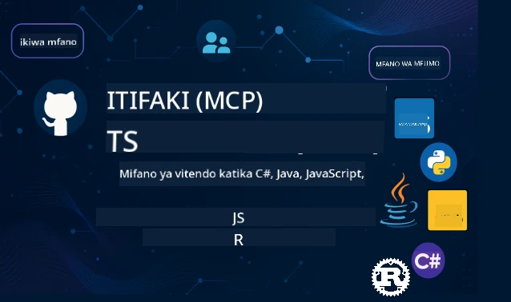

 

[](https://GitHub.com/microsoft/mcp-for-beginners/graphs/contributors)
[](https://GitHub.com/microsoft/mcp-for-beginners/issues)
[](https://GitHub.com/microsoft/mcp-for-beginners/pulls)
[](http://makeapullrequest.com)

[](https://GitHub.com/microsoft/mcp-for-beginners/watchers)
[](https://GitHub.com/microsoft/mcp-for-beginners/fork)
[](https://GitHub.com/microsoft/mcp-for-beginners/stargazers)


[](https://discord.gg/nTYy5BXMWG)

Fuata hatua hizi kuanza kutumia rasilimali hizi:
1. **Fungua Hifadhi (Fork the Repository)**: Bonyeza [](https://GitHub.com/microsoft/mcp-for-beginners/fork)
2. **Nakili Hifadhi (Clone the Repository)**: `git clone https://github.com/microsoft/mcp-for-beginners.git`
3. **Jiunge Na** [](https://discord.gg/nTYy5BXMWG)


### 🌐 Msaada wa Lugha Nyingi

#### Unaungwa Mkono kupitia Kitendo cha GitHub (Moja kwa Moja & Daima Kisasa)

<!-- CO-OP TRANSLATOR LANGUAGES TABLE START -->
[Arabic](../ar/README.md) | [Bengali](../bn/README.md) | [Bulgarian](../bg/README.md) | [Burmese (Myanmar)](../my/README.md) | [Chinese (Simplified)](../zh-CN/README.md) | [Chinese (Traditional, Hong Kong)](../zh-HK/README.md) | [Chinese (Traditional, Macau)](../zh-MO/README.md) | [Chinese (Traditional, Taiwan)](../zh-TW/README.md) | [Croatian](../hr/README.md) | [Czech](../cs/README.md) | [Danish](../da/README.md) | [Dutch](../nl/README.md) | [Estonian](../et/README.md) | [Finnish](../fi/README.md) | [French](../fr/README.md) | [German](../de/README.md) | [Greek](../el/README.md) | [Hebrew](../he/README.md) | [Hindi](../hi/README.md) | [Hungarian](../hu/README.md) | [Indonesian](../id/README.md) | [Italian](../it/README.md) | [Japanese](../ja/README.md) | [Kannada](../kn/README.md) | [Korean](../ko/README.md) | [Lithuanian](../lt/README.md) | [Malay](../ms/README.md) | [Malayalam](../ml/README.md) | [Marathi](../mr/README.md) | [Nepali](../ne/README.md) | [Nigerian Pidgin](../pcm/README.md) | [Norwegian](../no/README.md) | [Persian (Farsi)](../fa/README.md) | [Polish](../pl/README.md) | [Portuguese (Brazil)](../pt-BR/README.md) | [Portuguese (Portugal)](../pt-PT/README.md) | [Punjabi (Gurmukhi)](../pa/README.md) | [Romanian](../ro/README.md) | [Russian](../ru/README.md) | [Serbian (Cyrillic)](../sr/README.md) | [Slovak](../sk/README.md) | [Slovenian](../sl/README.md) | [Spanish](../es/README.md) | [Swahili](./README.md) | [Swedish](../sv/README.md) | [Tagalog (Filipino)](../tl/README.md) | [Tamil](../ta/README.md) | [Telugu](../te/README.md) | [Thai](../th/README.md) | [Turkish](../tr/README.md) | [Ukrainian](../uk/README.md) | [Urdu](../ur/README.md) | [Vietnamese](../vi/README.md)

> **Ungependa Kukopa Kwenye Kompyuta?**

> Hifadhi hii ina tafsiri zaidi ya lugha 50 ambayo huongeza sana ukubwa wa kupakua. Ili kukopa bila tafsiri, tumia sparse checkout:
> ```bash
> git clone --filter=blob:none --sparse https://github.com/microsoft/mcp-for-beginners.git
> cd mcp-for-beginners
> git sparse-checkout set --no-cone '/*' '!translations' '!translated_images'
> ```
> Hii itakupa kila kitu unachohitaji kukamilisha kozi kwa kupakua kwa kasi zaidi.
<!-- CO-OP TRANSLATOR LANGUAGES TABLE END -->

# 🚀 Mtaala wa Itifaki ya Muktadha wa Mfano (MCP) kwa Waanzilishi

## **Jifunze MCP kwa Mifano ya Mikono ya Msimbo katika C#, Java, JavaScript, Rust, Python, na TypeScript**

## 🧠 Muhtasari wa Mtaala wa Itifaki ya Muktadha wa Mfano
Karibu katika safari yako kuelekea Itifaki ya Muktadha wa Mfano! Ikiwa umewahi kujiuliza jinsi programu za AI zinavyowasiliana na zana na huduma tofauti, bado uko karibu kugundua suluhisho rahisi linalobadilisha jinsi waendelezaji wanavyotengeneza mifumo mahiri.

Fikiria MCP kama mtafsiri wa ulimwengu kwa programu za AI - kama vile viunganishi vya USB vinavyokuruhusu kuunganisha kifaa chochote kwa kompyuta yako, MCP huruhusu mifano ya AI kuunganishwa na zana au huduma yoyote kwa njia ya kawaida. Iwe unajenga chatbot yako ya kwanza au unafanya kazi kwenye mchakato tata wa AI, kuelewa MCP kutakupa nguvu ya kuunda programu zenye uwezo zaidi na zinazobadilika.

Mtaala huu umeundwa kwa uvumilivu na uangalifu kwa ajili ya safari yako ya kujifunza. Tutaanza na dhana rahisi unazozifahamu na hatua kwa hatua kukuza utaalamu wako kupitia mazoezi ya mikono kwa lugha yako ya programu unayopendelea. Kila hatua ina maelezo wazi, mifano halisi, na motisha nyingi pamoja na safari.

Ukimaliza safari hii, utakuwa na imani ya kujenga seva zako za MCP mwenyewe, kuziongeza kwenye majukwaa maarufu ya AI, na kuelewa jinsi teknolojia hii inavyoibadilisha mustakabali wa maendeleo ya AI. Tuanzishe adventure hii ya kusisimua pamoja!

### Nyaraka Rasmi na Maelezo ya Kiufundi

Rasilimali hizi zinakuwa na thamani zaidi kadri ufahamu wako unavyoongezeka, lakini usijisukume kusoma kila kitu mara moja. Anza na maeneo yanayokuvutia zaidi!
- 📘 [Nyaraka za MCP](https://modelcontextprotocol.io/) – Hii ni rasilimali yako ya msingi kwa mafunzo hatua kwa hatua na miongozo ya mtumiaji. Nyaraka imeandikwa kwa kuzingatia waanzilishi, inatoa mifano rahisi unaweza kufuata kwa kasi yako mwenyewe.
- 📜 [Maelezo ya MCP](https://modelcontextprotocol.io/docs/) – Fikiria hii kama mwongozo kamili wa rejea. Unapoendelea na mtaala, utajikuta unarudi hapa kutafuta maelezo maalum na kuchunguza vipengele vya hali ya juu.
- 📜 [Maelezo Asili ya MCP](https://modelcontextprotocol.io/specification/versioning) – Hii ina maelezo ya kiufundi zaidi ambayo yanaweza kusaidia kwa utekelezaji wa hali ya juu. Iko pale unapohitaji, lakini usijali kuhusu hii ukianza tu.
- 🧑‍💻 [Hifadhi ya MCP GitHub](https://github.com/modelcontextprotocol) – Hapa utapata SDKs, zana, na mifano ya msimbo kwa lugha kadhaa za programu. Ni kama hazina ya mifano halisi na vipengele vinavyotumiika tayari.
- 🌐 [Jumuiya ya MCP](https://github.com/orgs/modelcontextprotocol/discussions) – Jiunge na wanafunzi wenzako na waendelezaji wenye uzoefu katika mijadala kuhusu MCP. Ni jamii inayounga mkono ambapo maswali yanakaribishwa na maarifa yanashirikiwa kwa uhuru.
  
## Malengo ya Kujifunza

Mwisho wa mtaala huu, utahisi kujiamini na kufurahishwa na ujuzi wako mpya. Hapa ni kile utakachopata:

• **Elewa misingi ya MCP**: Utapata dhana nini Itifaki ya Muktadha wa Mfano ni na kwa nini inaboresha jinsi programu za AI zinavyoshirikiana, kwa kutumia mifano na misemo inayofaa.

• **Jenga seva yako ya kwanza ya MCP**: Uundaji seva ya MCP inayofanya kazi kwa lugha unayopendelea ya programu, kuanzia na mifano rahisi na kukuza ujuzi hatua kwa hatua.

• **Unganisha mifano ya AI na zana halisi**: Utajifunza jinsi ya kuunganisha sakafu kati ya mifano ya AI na huduma halisi, ukitoa nguvu mpya kwa programu zako.

• **Tekeleza mbinu bora za usalama**: Utajifunza jinsi ya kulinda utekelezaji wa MCP, kulinda programu zako na watumiaji wako.

• **Tangaza kwa kujiamini**: Utajua jinsi ya kupeleka miradi yako ya MCP kutoka hatua ya maendeleo hadi uzalishaji kwa mikakati ya utekelezaji inayofaa.

• **Jiunge na jumuiya ya MCP**: Utakuwa sehemu ya jumuiya inayokua ya waendelezaji wanaoendeleza mustakabali wa maendeleo ya programu za AI.

## Msingi Muhimu

Kabla hatujaingia kwenye maelezo ya MCP, tuhakikishe unajisikia vizuri na baadhi ya dhana za msingi. Usijali kama hauwezi ufahamu wa hali ya juu - tutaeleza kila kitu unachotakiwa kujua kadri tunavyoendelea!

### Kuelewa Itifaki (Msingi)

Fikiria itifaki kama sheria za mazungumzo. Unapomuita rafiki, nyote mnajua kusema "hello" unapojibu, mnapiga zamu kuzungumza, na kusema "goodbye" unapomaliza. Programu za kompyuta zinahitaji sheria zinazofanana ili kuwasiliana kwa ufanisi.

MCP ni itifaki - seti ya sheria zilizokubaliwa kusaidia mifano ya AI na programu kuwa na "mazungumzo" yenye tija na zana na huduma. Kama sheria za mazungumzo zinavyorahisisha mawasiliano ya binadamu, MCP inafanya mawasiliano ya programu za AI kuwa ya kuaminika na yenye nguvu zaidi.

### Uhusiano wa Mteja-Seva (Jinsi Programu Zinavyoshirikiana)

Tuweza tumia uhusiano wa mteja-seva kila siku! Unapotumia kivinjari cha wavuti (mteja) kutembelea tovuti, unajiunganisha na seva ya wavuti inayokutumia maudhui ya ukurasa. Kivinjari kinajua jinsi ya kuuliza taarifa, na seva inajua jinsi ya kujibu.

Katika MCP, tuna uhusiano wa aina hiyo: mifano ya AI hufanya kazi kama wateja wanayoomba taarifa au vitendo, na seva za MCP hutoa uwezo huo. Ni kama kuwa na msaidizi mzuri (seva) ambaye AI inamwomba kufanya kazi maalumu.

### Kwa Nini Kuwa na Viwango Ni Muhimu (Kufanya Kazi Pamoja)

Fikiria kama mtengenezaji kila gari anatumia nyongeza tofauti za mafuta - ungetakiwa na kiunganishi tofauti kwa kila gari! Kuweka viwango ni kukubaliana kuhusu mbinu za kawaida ili vitu viendelee kufanya kazi pamoja bila shida.

MCP hutoa viwango hivi kwa programu za AI. Badala ya kila mfano wa AI kuhitaji msimbo maalumu kuendana na kila zana, MCP huunda njia ya ulimwengu wa mawasiliano. Hii inamaanisha waendelezaji wanaweza kujenga zana mara moja na zifanye kazi na mifumo mingi tofauti ya AI.

## 🧭 Muhtasari Wa Njia Yako ya Kujifunza

Safari yako ya MCP imepangwa vizuri ili kukuza ujasiri na ujuzi wako hatua kwa hatua. Kila awamu inatambulisha dhana mpya huku ikithibitisha unachojua tayari.

### 🌱 Awamu ya Msingi: Kuelewa Msingi (Moduli 0-2)

Hapa ndipo adventure yako inaanza! Tutakutambulisha kwa dhana za MCP kwa kutumia mifano inayojulikana na mifano rahisi. Utielewa nini MCP ni, kwa nini ipo, na jinsi inavyolingana na dunia kubwa ya maendeleo ya AI.

• **Moduli 0 - Utangulizi wa MCP**: Tutaanza kwa kuchunguza MCP ni nini na kwanini ni muhimu kwa programu za kisasa za AI. Utaona mifano halisi ya MCP ikitumika na kuelewa jinsi inavyotatua matatizo ya kawaida kwa waendelezaji.

• **Moduli 1 - Maana Muhimu Yaliyoelezewa**: Hapa utajifunza vipengele msingi vya MCP. Tutatumia mifano mingi na michoro ili kuhakikisha dhana hizi zinahisi kuwa rahisi na za kueleweka.

• **Moduli 2 - Usalama katika MCP**: Usalama unaweza kuonekana kama waogopesha, lakini tutakuonyesha jinsi MCP inavyojumuisha vipengele vya usalama na kukuza mbinu bora zinazolinda programu zako tangu mwanzo.

### 🔨 Awamu ya Ujenzi: Kuunda Utekelezaji Wako wa Kwanza (Moduli 3)

Sasa kufurahisha kweli kunaanza! Utapata uzoefu wa mikono katika kujenga seva na wateja wa MCP. Usijali - tutaanza kwa urahisi na kukuelekeza kila hatua.

Moduli hii ina miongozo mbalimbali ya mikono inayokuruhusu kufanya mazoezi kwa lugha yako ya programu unayopendelea. Uundaji seva yako ya kwanza, jenga mteja kuungana nayo, bahkan kuunganishwa na zana maarufu za maendeleo kama VS Code.
Kila mwongozo unajumuisha mifano kamili ya msimbo, vidokezo vya kutatua matatizo, na maelezo ya kwanini tunachagua muundo maalum. Mwishoni mwa awamu hii, utakuwa na utekelezaji wa MCP unaofanya kazi ambao unaweza kujivunia!

### 🚀 Awamu ya Ukuaji: Dhana za Juu na Matumizi Halisi (Moduli 4-5)

Baada ya kupata msingi, uko tayari kuchunguza vipengele vya juu vya MCP. Tutashughulikia mikakati ya utekelezaji wa vitendo, mbinu za kutatua matatizo, na mada za juu kama vile muunganiko wa AI wa modal nyingi.

Pia utajifunza jinsi ya kupanua utekelezaji wako wa MCP kwa matumizi ya uzalishaji na kuunganishwa na majukwaa ya wingu kama Azure. Moduli hizi zinakuandaa kujenga suluhisho za MCP zinazoweza kushughulikia mahitaji halisi ya dunia.

### 🌟 Awamu ya Utaalam: Jamii na Utaalam Maalum (Moduli 6-11)

Awamu ya mwisho inaangazia kujiunga na jamii ya MCP na kuhitimu katika maeneo unayovutiwa nao zaidi. Utajifunza jinsi ya kuchangia katika miradi ya chanzo huria ya MCP, kutekeleza mifumo ya usalama wa hali ya juu, na kujenga suluhisho kamili zilizounganishwa na hifadhidata.

Moduli ya 11 inastahili kutajwa kwa kipekee - ni njia kamili ya mafunzo ya vitendo yenye maabara 13 inayokufundisha jinsi ya kujenga seva za MCP zinazopatikana kwa ajili ya uzalishaji na kuunganishwa na PostgreSQL. Ni sawa na mradi wa mwisho unaoleta pamoja yote uliyoyajifunza!

### 📚 Muundo Kamili wa Mtaala

| Moduli | Mada | Maelezo | Kiungo |
|--------|-------|-------------|------|
| **Moduli 1-3: Misingi** | | | |
| 00 | Utangulizi wa MCP | Muhtasari wa Itifaki ya Muktadha wa Mfano na umuhimu wake katika mizunguko ya AI | [Soma zaidi](./00-Introduction/README.md) |
| 01 | Maoni Makuu Yamefafanuliwa | Uchunguzi wa kina wa dhana kuu za MCP | [Soma zaidi](./01-CoreConcepts/README.md) |
| 02 | Usalama katika MCP | Vitisho vya usalama na mbinu bora | [Soma zaidi](./02-Security/README.md) |
| 03 | Kuanzia na MCP | Kuandaa mazingira, seva/klienti za msingi, muunganiko | [Soma zaidi](./03-GettingStarted/README.md) |
| **Moduli 3: Kujenga Seva & Klienti Yako ya Kwanza** | | | |
| 3.1 | Seva ya Kwanza | Tengeneza seva yako ya kwanza ya MCP | [Mwongozo](./03-GettingStarted/01-first-server/README.md) |
| 3.2 | Klienti ya Kwanza | Tengeneza klienti wa msingi wa MCP | [Mwongozo](./03-GettingStarted/02-client/README.md) |
| 3.3 | Klienti na LLM | Unganisha mifano mikubwa ya lugha | [Mwongozo](./03-GettingStarted/03-llm-client/README.md) |
| 3.4 | Muunganiko wa VS Code | Tumia seva za MCP katika VS Code | [Mwongozo](./03-GettingStarted/04-vscode/README.md) |
| 3.5 | Seva ya stdio | Tengeneza seva kwa kutumia usafirishaji wa stdio | [Mwongozo](./03-GettingStarted/05-stdio-server/README.md) |
| 3.6 | Uenezaji wa HTTP | Tekeleza uenezaji wa HTTP katika MCP | [Mwongozo](./03-GettingStarted/06-http-streaming/README.md) |
| 3.7 | Zana za AI | Tumia Zana za AI pamoja na MCP | [Mwongozo](./03-GettingStarted/07-aitk/README.md) |
| 3.8 | Upimaji | Jaribu utekelezaji wa seva yako ya MCP | [Mwongozo](./03-GettingStarted/08-testing/README.md) |
| 3.9 | Uanzishaji | Anzisha seva za MCP kwa uzalishaji | [Mwongozo](./03-GettingStarted/09-deployment/README.md) |
| 3.10 | Matumizi ya seva ya juu | Tumia seva za juu kwa matumizi ya vipengele vya hali ya juu na usanifu ulioboreshwa | [Mwongozo](./03-GettingStarted/10-advanced/README.md) |
| 3.11 | Uthibitishaji rahisi | Sura inayokuonyesha uthibitishaji kutoka mwanzo na RBAC | [Mwongozo](./03-GettingStarted/11-simple-auth/README.md) |
| **Moduli 4-5: Vitendo & vya Juu** | | | |
| 04 | Utekelezaji wa Vitendo | SDKs, utatuzi, upimaji, mitindo ya maelekezo inayoweza kutumika tena | [Soma zaidi](./04-PracticalImplementation/README.md) |
| 05 | Mada za Juu MCP | AI ya modal nyingi, upanuzi, matumizi ya biashara | [Soma zaidi](./05-AdvancedTopics/README.md) |
| 5.1 | Muunganiko wa Azure | Muunganiko wa MCP na Azure | [Mwongozo](./05-AdvancedTopics/mcp-integration/README.md) |
| 5.2 | Modal-uzito | Kazi na modal nyingi | [Mwongozo](./05-AdvancedTopics/mcp-multi-modality/README.md) |
| 5.3 | Onyesho la OAuth2 | Tekeleza uthibitishaji wa OAuth2 | [Mwongozo](./05-AdvancedTopics/mcp-oauth2-demo/README.md) |
| 5.4 | Muktadha wa Mizizi | Elewa na tekeleza muktadha wa mizizi | [Mwongozo](./05-AdvancedTopics/mcp-root-contexts/README.md) |
| 5.5 | Uelekezaji | Mikakati ya uelekezaji wa MCP | [Mwongozo](./05-AdvancedTopics/mcp-routing/README.md) |
| 5.6 | Sampuli | Mbinu za sampuli katika MCP | [Mwongozo](./05-AdvancedTopics/mcp-sampling/README.md) |
| 5.7 | Upanuzi | Panua utekelezaji wa MCP | [Mwongozo](./05-AdvancedTopics/mcp-scaling/README.md) |
| 5.8 | Usalama | Mazingira ya usalama ya juu | [Mwongozo](./05-AdvancedTopics/mcp-security/README.md) |
| 5.9 | Utafutaji Mtandaoni | Tekeleza uwezo wa utafutaji mtandaoni | [Mwongozo](./05-AdvancedTopics/web-search-mcp/README.md) |
| 5.10 | Uenezaji wa Wakati Halisi | Jenga utendaji wa uenezaji wa wakati halisi | [Mwongozo](./05-AdvancedTopics/mcp-realtimestreaming/README.md) |
| 5.11 | Utafutaji wa Wakati Halisi | Tekeleza utafutaji wa wakati halisi | [Mwongozo](./05-AdvancedTopics/mcp-realtimesearch/README.md) |
| 5.12 | Uthibitishaji wa Entra ID | Uthibitishaji kwa Microsoft Entra ID | [Mwongozo](./05-AdvancedTopics/mcp-security-entra/README.md) |
| 5.13 | Muunganiko wa Foundry | Unganisha na Azure AI Foundry | [Mwongozo](./05-AdvancedTopics/mcp-foundry-agent-integration/README.md) |
| 5.14 | Uhandisi wa Muktadha | Mbinu za uhandisi wa muktadha bora | [Mwongozo](./05-AdvancedTopics/mcp-contextengineering/README.md) |
| 5.15 | Usafirishaji Maalum wa MCP | Utekelezaji wa usafirishaji maalum | [Mwongozo](./05-AdvancedTopics/mcp-transport/README.md) |
| **Moduli 6-10: Jamii & Mbinu Bora** | | | |
| 06 | Michango ya Jamii | Jinsi ya kuchangia kwenye mfumo wa MCP | [Mwongozo](./06-CommunityContributions/README.md) |
| 07 | Maarifa kutoka kwa Matumizi ya Awali | Hadithi za utekelezaji halisi | [Mwongozo](./07-LessonsFromEarlyAdoption/README.md) |
| 08 | Mbinu Bora za MCP | Utendaji, uvumilivu wa matatizo, ustahimilivu | [Mwongozo](./08-BestPractices/README.md) |
| 09 | Masomo ya Kesi za MCP | Mifano ya utekelezaji wa vitendo | [Mwongozo](./09-CaseStudy/README.md) |
| 10 | Warsha ya Vitendo | Kujenga Seva ya MCP na Zana za AI | [Maabara](./10-StreamliningAIWorkflowsBuildingAnMCPServerWithAIToolkit/README.md) |
| **Moduli 11: Maabara za Vitendo ya Seva ya MCP** | | | |
| 11 | Muunganiko wa Hifadhidata wa Seva ya MCP | Njia kamili ya mafunzo ya vitendo yenye maabara 13 ya kuunganishwa na PostgreSQL | [Maabara](./11-MCPServerHandsOnLabs/README.md) |
| 11.1 | Utangulizi | Muhtasari wa MCP na muunganiko wa hifadhidata na kesi ya matumizi ya uchambuzi wa rejareja | [Maabara 00](./11-MCPServerHandsOnLabs/00-Introduction/README.md) |
| 11.2 | Usanifu Msingi | Kuelewa usanifu wa seva ya MCP, tabaka za hifadhidata, na mifumo ya usalama | [Maabara 01](./11-MCPServerHandsOnLabs/01-Architecture/README.md) |
| 11.3 | Usalama & Kuishi kwa Wateja Wengi | Usalama wa Kiwango cha Safu, uthibitishaji, na upatikanaji wa data kwa wateja wengi | [Maabara 02](./11-MCPServerHandsOnLabs/02-Security/README.md) |
| 11.4 | Kuandaa Mazingira | Kuandaa mazingira ya maendeleo, Docker, rasilimali za Azure | [Maabara 03](./11-MCPServerHandsOnLabs/03-Setup/README.md) |
| 11.5 | Muundo wa Hifadhidata | Usanidi wa PostgreSQL, muundo wa skimu ya rejareja, na data ya mfano | [Maabara 04](./11-MCPServerHandsOnLabs/04-Database/README.md) |
| 11.6 | Utekelezaji wa Seva ya MCP | Kujenga seva ya FastMCP pamoja na muunganiko wa hifadhidata | [Maabara 05](./11-MCPServerHandsOnLabs/05-MCP-Server/README.md) |
| 11.7 | Uundaji wa Zana | Kutengeneza zana za maswali ya hifadhidata na uchunguzi wa skimu | [Maabara 06](./11-MCPServerHandsOnLabs/06-Tools/README.md) |
| 11.8 | Utafutaji wa Semantiki | Kutekeleza embeddings vectori na Azure OpenAI na pgvector | [Maabara 07](./11-MCPServerHandsOnLabs/07-Semantic-Search/README.md) |
| 11.9 | Upimaji & Utatuzi | Mikakati ya upimaji, zana za utatuzi, na njia za uhakiki | [Maabara 08](./11-MCPServerHandsOnLabs/08-Testing/README.md) |
| 11.10 | Muunganiko wa VS Code | Kusanidi muunganiko wa MCP wa VS Code na matumizi ya AI Chat | [Maabara 09](./11-MCPServerHandsOnLabs/09-VS-Code/README.md) |
| 11.11 | Mikakati ya Uanzishaji | Uanzishaji wa Docker, Apps za Kontena za Azure, na masharti ya upanuzi | [Maabara 10](./11-MCPServerHandsOnLabs/10-Deployment/README.md) |
| 11.12 | Ufuatiliaji | Maelezo juu ya Application Insights, uandishi wa kumbukumbu, ufuatiliaji wa utendakazi | [Maabara 11](./11-MCPServerHandsOnLabs/11-Monitoring/README.md) |
| 11.13 | Mbinu Bora | Uboreshaji wa utendaji, kuimarisha usalama, na vidokezo vya uzalishaji | [Maabara 12](./11-MCPServerHandsOnLabs/12-Best-Practices/README.md) |

### 💻 Miradi ya Mifano ya Msimbo

Sehemu moja ya kuvutia ya kujifunza MCP ni kuona ujuzi wako wa msimbo ukizidi kuimarika kwa hatua. Tumeundaa mifano yetu ya msimbo kuanzia rahisi hadi kuwa ya hali ya juu kadri kuelewa kwako kunavyozidi. Hapa ndio tunavyoanzisha dhana - na msimbo ambao ni rahisi kuelewa lakini unaonyesha kanuni halisi za MCP, utaelewa sio tu nini msimbo huu unafanya, bali kwa nini umeundwa hivi na jinsi unavyofaa katika programu kubwa za MCP.

#### Mifano ya Kuweka Hesabu ya MCP ya Msingi

| Lugha | Maelezo | Kiungo |
|----------|-------------|------|
| C# | Mfano wa Seva ya MCP | [Tazama Msimbo](./03-GettingStarted/samples/csharp/README.md) |
| Java | Kuweka Hesabu ya MCP | [Tazama Msimbo](./03-GettingStarted/samples/java/calculator/README.md) |
| JavaScript | Demo ya MCP | [Tazama Msimbo](./03-GettingStarted/samples/javascript/README.md) |
| Python | Seva ya MCP | [Tazama Msimbo](../../03-GettingStarted/samples/python/mcp_calculator_server.py) |
| TypeScript | Mfano wa MCP | [Tazama Msimbo](./03-GettingStarted/samples/typescript/README.md) |
| Rust | Mfano wa MCP | [Tazama Msimbo](./03-GettingStarted/samples/rust/README.md) |

#### Utekelezaji wa Juu wa MCP

| Lugha | Maelezo | Kiungo |
|----------|-------------|------|
| C# | Mfano wa Juu | [Tazama Msimbo](./04-PracticalImplementation/samples/csharp/README.md) |
| Java na Spring | Mfano wa Programu ya Kontena | [Tazama Msimbo](./04-PracticalImplementation/samples/java/containerapp/README.md) |
| JavaScript | Mfano wa Juu | [Tazama Msimbo](./04-PracticalImplementation/samples/javascript/README.md) |
| Python | Utekelezaji Changamano | [Tazama Msimbo](../../04-PracticalImplementation/samples/python/READMEmd) |
| TypeScript | Mfano wa Kontena | [Tazama Msimbo](./04-PracticalImplementation/samples/typescript/README.md) |


## 🎯 Masharti ya Awali kwa Kujifunza MCP

Ili kupata faida kubwa kutoka kwa mtaala huu, unapaswa kuwa na:

- Ujuzi wa msingi wa programu kwa angalau mojawapo ya lugha zifuatazo: C#, Java, JavaScript, Python, au TypeScript
- Uelewa wa mfano wa klienti-seva na APIs
- Ujuzi wa dhana za REST na HTTP
- (Hiari) Asili katika dhana za AI/ML

- Kujiunga na majadiliano yetu ya jamii kwa msaada

## 📚 Mwongozo wa Masomo & Rasilimali

Hifadhidata hii ina rasilimali kadhaa za kusaidia kuibuka na kujifunza kwa ufanisi:

### Mwongozo wa Masomo

Mwongozo kamili wa [Masomo](./study_guide.md) upo kusaidia kusafiri kwa urahisi hifadhidata hii. Ramani hii ya mtaala kwa njia ya picha inaonyesha jinsi mada zote zinavyohusiana na kutoa mwongozo wa jinsi ya kutumia miradi ya mfano kwa ufanisi. Ni hasa kusaidia ikiwa wewe ni mwanafunzi wa kuona ambaye anapenda kuona muktadha mzima.

Mwongozo unajumuisha:
- Ramani ya mtaala kwa picha ikionyesha mada zote zilizofunikwa
- Ufafanuzi wa kina wa kila sehemu ya hifadhidata
- Mwongozo wa jinsi ya kutumia miradi ya mfano
- Njia za kujifunza zilizopendekezwa kwa viwango tofauti vya ujuzi
- Rasilimali za ziada kukamilisha safari yako ya kujifunza

### Mabadiliko ya Marekebisho

Tunadumisha [Mabadiliko ya Marekebisho](./changelog.md) kwa kina inayofuata masasisho yote makubwa ya vifaa vya mtaala, ili uweze kuwa na habari za kisasa juu ya maboresho na nyongeza.
- Nyongeza mpya za maudhui
- Mabadiliko ya muundo
- Maboresho ya vipengele
- Sasisho za nyaraka

## 🛠️ Jinsi ya Kutumia Mtaala Huu kwa Ufanisi

Kila somo katika mwongozo huu linajumuisha:
1. Maelezo wazi ya dhana za MCP  
2. Mifano ya msimbo wa moja kwa moja katika lugha nyingi  
3. Mazoezi ya kujenga programu halisi za MCP  
4. Rasilimali za ziada kwa wanaojifunza kwa kiwango cha juu

## Yaliyomo kwa Matakwa 

### [MCP Dev Days Julai 2025](https://developer.microsoft.com/en-us/reactor/series/S-1563/)
#### [➡️Tazama kwa Matakwa - MCP Dev Days](https://developer.microsoft.com/en-us/reactor/series/S-1563/)
Jiandae kwa siku mbili za ufahamu wa kina wa kiufundi, kuunganishwa na jamii, na kujifunza kwa vitendo katika MCP Dev Days, tukio la mtandaoni lililojitolea kwa Model Context Protocol (MCP) — kiwango kinachochipuka kinachounganisha modeli za AI na zana wanazotegemea.  
Unaweza kuangalia MCP Dev Days kwa kujisajili katika ukurasa wetu wa tukio: https://aka.ms/mcpdevdays. 

#### [Siku ya 1: Uzalishaji wa MCP, DevTools, & Jamii:](https://developer.microsoft.com/en-us/reactor/series/S-1563/)

Ni kuhusu kuwawezesha waendelezaji kutumia MCP katika mtiririko wao wa kazi wa maendeleo na kusherehekea jamii ya ajabu ya MCP. Tutakuwa pamoja na wanajamii na washirika kama Arcade, Block, Okta, na Neon kuona jinsi wanavyoshirikiana na Microsoft kuunda mfumo wazi na unaoweza kupanuka wa MCP. Maonesho halisi duniani kote kupitia VS Code, Visual Studio, GitHub Copilot, na zana maarufu za jamii  
Mtiririko wa kazi wenye muktadha na wenye vitendo  
Vikao vinavyoongozwa na jamii na maarifa  
Kama unaanza tu na MCP au tayari unaijenga, Siku ya 1 itaunda msingi wa msukumo na mambo ya kushughulikia yanayoweza kutekelezwa.

#### [Siku ya 2: Jenga Seva za MCP kwa Kujiamini](https://developer.microsoft.com/en-us/reactor/series/S-1563/)

Ni kwa wajenzi wa MCP. Tutachunguza kwa kina mbinu za utekelezaji na mbinu bora za kuunda seva za MCP na kuingiza MCP katika mtiririko wako wa AI.

#### Mada zinajumuisha:

- Kujenga Seva za MCP na kuziunganisha katika uzoefu wa mawakala  
- Maendeleo yanayoendeshwa na hatua  
- Mbinu bora za usalama  
- Kutumia vitu vya msingi kama Kazi, ACA, na Usimamizi wa API  
- Ulinganifu wa rejista na zana (1P + 3P)

Kama wewe ni mtaalamu wa maendeleo, muundaji wa zana, au mkakati wa bidhaa za AI, siku hii imejaa maarifa unayohitaji kujenga suluhisho la MCP linaloweza kupanuka, salama, na tayari kwa siku za usoni.

### MCP Boot Camp Agosti 2025
Jifunze katika vikao vikubwa vya video jinsi ya kuunda seva za MCP, kuziunganisha na VS Code, na kuzitumia kitaalamu kwenye Azure kwa mujibu wa maudhui kutoka kwa mtaala wa MCP kwa Wachangamfu. Toka na ujuzi wa vitendo katika teknolojia ambayo makampuni makubwa tayari yanaitumia.

#### [➡️Tazama kwa Matakwa MCP Bootcamp | Kiingereza](https://developer.microsoft.com/en-us/reactor/series/s-1568/)
#### [➡️Tazama kwa Matakwa MCP Bootcamp | Kireno](https://developer.microsoft.com/en-us/reactor/series/S-1566/)
#### [➡️Tazama kwa Matakwa MCP Bootcamp | Kihispania](https://developer.microsoft.com/en-us/reactor/series/S-1567/)

### Hebu Jifunze MCP na C# - Mfululizo wa Mafunzo
Hebu tujifunze kuhusu Model Context Protocol (MCP), mfumo wa kisasa ulioundwa kuleta muafaka katika mwingiliano kati ya modeli za AI na programu za wateja. Kupitia kikao hiki cha wanzo rahisi, tutakutambulisha MCP na kukuongoza kuunda seva yako ya kwanza ya MCP.  
#### C#: [https://aka.ms/letslearnmcp-csharp](https://aka.ms/letslearnmcp-csharp)  
#### Java: [https://aka.ms/letslearnmcp-java](https://aka.ms/letslearnmcp-java)  
#### JavaScript: [https://aka.ms/letslearnmcp-javascript](https://aka.ms/letslearnmcp-javascript)  
#### Python: [https://aka.ms/letslearnmcp-python](https://aka.ms/letslearnmcp-python)

## 🎓 Safari Yako ya MCP Inaanzia Hapa

Hongera! Umefanya hatua ya kwanza katika safari ya kusisimua ambayo itapanua uwezo wako wa programu na kukuunganisha na teknolojia ya hali ya juu ya maendeleo ya AI.

### Umefanikiwa Nini Hadi Sasa

Kwa kusoma utangulizi huu, tayari umeanza kujenga msingi wa maarifa yako ya MCP. Unaelewa ni nini MCP, kwa nini ni muhimu, na jinsi mtaala huu utakavyosaidia safari yako ya kujifunza. Hilo ni mafanikio makubwa na mwanzo wa utaalamu wako katika teknolojia hii muhimu.

### Adventure Iliyopo Mbele

Unapopita module, kumbuka kwamba kila mtaalamu alikuwa mwanzo. Dhana ambazo zinaweza kuonekana ngumu sasa zitakuwa tabia ya pili unapozoea na kuzitumia. Kila hatua ndogo hujenga uwezo mkubwa ambao utakutumikia katika taaluma yako ya maendeleo.

### Mtandao Wako wa Msaada

Unaungana na jamii ya wanaojifunza na wataalamu wanaopenda MCP na wanaotamani kuwasaidia wengine kufanikisha. Iwe umekwama kwenye changamoto ya coding au unafurahia kushiriki mafanikio, jamii iko hapa kusaidia safari yako.

Iwapo utakumbwa au ukawa na maswali kuhusu kujenga programu za AI. Jiunge na wanaojifunza wenzako na waendelezaji wenye uzoefu katika mijadala kuhusu MCP. Ni jamii yenye msaada ambapo maswali yanakaribishwa na maarifa hushirikiwa kwa uhuru.

[](https://discord.gg/nTYy5BXMWG)

Iwapo una maoni kuhusu bidhaa au makosa wakati wa kujenga tembelea:

[](https://aka.ms/foundry/forum)

### Tayari Kuanzia?

Safari yako ya MCP inaanza sasa! Anza na Module 0 kuingia katika uzoefu wako wa kwanza wa vitendo wa MCP, au chunguza miradi ya mfano kuona kile utakachojenga. Kumbuka - kila mtaalamu alianza mahali ulipo sasa, na kwa subira na mazoezi, utashangazwa na kile unachoweza kufanikisha.

Karibu katika ulimwengu wa maendeleo ya Model Context Protocol. Hebu tujenge kitu kizuri pamoja!

## 🤝 Kuchangia Jamii ya Kujifunza

Mtaala huu unakuwa imara zaidi kwa michango kutoka kwa wanaojifunza kama wewe! Iwe unarekebisha makosa ya tahajia, kupendekeza maelezo ya wazi zaidi, au kuongeza mfano mpya, michango yako husaidia wanaoanza wengine kufanikisha.

Asante kwa Microsoft Valued Professional [Shivam Goyal](https://www.linkedin.com/in/shivam2003/) kwa kuchangia sampuli za msimbo.

Mchakato wa michango umeundwa kuwa wa ukarimu na msaada. Michango mingi inahitaji Makubaliano ya Leseni ya Mchango (CLA), lakini zana za kiotomatiki zitakuongoza kwa urahisi.

## 📜 Kujifunza Chanzo Huria

Mtaala huu wote upo chini ya leseni ya MIT [LICENSE](../../LICENSE), maana yake unaweza kuitumia, kuibadilisha, na kuisambaza kwa uhuru. Hii inaunga mkono dhamira yetu ya kufanya maarifa ya MCP kupatikana kwa waendelezaji kila mahali.

## 🤝 Miongozo ya Michango

Mradi huu unakaribisha michango na mapendekezo. Michango mingi inahitaji kukubali  
Makubaliano ya Leseni ya Mchango (CLA) yanayothibitisha kuwa una haki, na kwa kweli unatuwezesha  
kutumia mchango wako. Kwa maelezo, tembelea <https://cla.opensource.microsoft.com>.

Unapowasilisha ombi la kusukuma, bot wa CLA atabaini moja kwa moja kama unahitaji kutoa  
CLA na kupamba PR ipasavyo (km, ukaguzi wa hali, maoni). Fuata tu maagizo  
yanayotolewa na bot. Hii utahitajika kufanya mara moja tu katika repoj zote zinazotumia CLA yetu.

Mradi huu umeikubali [Microsoft Open Source Code of Conduct](https://opensource.microsoft.com/codeofconduct/).  
Kwa taarifa zaidi tazama [Code of Conduct FAQ](https://opensource.microsoft.com/codeofconduct/faq/) au wasiliana na  
[opencode@microsoft.com](mailto:opencode@microsoft.com) kwa maswali au maoni mengine.

---

*Uko tayari kuanza safari yako ya MCP? Anza na [Module 00 - Utangulizi kwa MCP](./00-Introduction/README.md) na chukua hatua zako za kwanza katika maendeleo ya Model Context Protocol!*

## 🎒 Kozi Nyingine
Timu yetu hutengeneza kozi nyingine! Angalia:

<!-- CO-OP TRANSLATOR OTHER COURSES START -->
### LangChain
[](https://aka.ms/langchain4j-for-beginners)
[](https://aka.ms/langchainjs-for-beginners?WT.mc_id=m365-94501-dwahlin)

---

### Azure / Edge / MCP / Ma wakala  
[](https://github.com/microsoft/AZD-for-beginners?WT.mc_id=academic-105485-koreyst)
[](https://github.com/microsoft/edgeai-for-beginners?WT.mc_id=academic-105485-koreyst)
[](https://github.com/microsoft/mcp-for-beginners?WT.mc_id=academic-105485-koreyst)
[](https://github.com/microsoft/ai-agents-for-beginners?WT.mc_id=academic-105485-koreyst)

---

### Mfululizo wa AI Inayotengeneza  
[](https://github.com/microsoft/generative-ai-for-beginners?WT.mc_id=academic-105485-koreyst)
[-9333EA?style=for-the-badge&labelColor=E5E7EB&color=9333EA)](https://github.com/microsoft/Generative-AI-for-beginners-dotnet?WT.mc_id=academic-105485-koreyst)
[-C084FC?style=for-the-badge&labelColor=E5E7EB&color=C084FC)](https://github.com/microsoft/generative-ai-for-beginners-java?WT.mc_id=academic-105485-koreyst)
[-E879F9?style=for-the-badge&labelColor=E5E7EB&color=E879F9)](https://github.com/microsoft/generative-ai-with-javascript?WT.mc_id=academic-105485-koreyst)

---

### Kujifunza Msingi  
[](https://aka.ms/ml-beginners?WT.mc_id=academic-105485-koreyst)
[](https://aka.ms/datascience-beginners?WT.mc_id=academic-105485-koreyst)
[](https://aka.ms/ai-beginners?WT.mc_id=academic-105485-koreyst)
[](https://github.com/microsoft/Security-101?WT.mc_id=academic-96948-sayoung)
[](https://aka.ms/webdev-beginners?WT.mc_id=academic-105485-koreyst)
[](https://aka.ms/iot-beginners?WT.mc_id=academic-105485-koreyst)
[](https://github.com/microsoft/xr-development-for-beginners?WT.mc_id=academic-105485-koreyst)

---
 
### Mfululizo wa Copilot
[](https://aka.ms/GitHubCopilotAI?WT.mc_id=academic-105485-koreyst)
[](https://github.com/microsoft/mastering-github-copilot-for-dotnet-csharp-developers?WT.mc_id=academic-105485-koreyst)
[](https://github.com/microsoft/CopilotAdventures?WT.mc_id=academic-105485-koreyst)
<!-- CO-OP TRANSLATOR OTHER COURSES END -->

---

<!-- CO-OP TRANSLATOR DISCLAIMER START -->
**Tangazo la Kutolea Mwongozo**:
Nyaraka hii imetafsiriwa kwa kutumia huduma ya tafsiri ya AI [Co-op Translator](https://github.com/Azure/co-op-translator). Ingawa tunajitahidi kuhakikisha usahihi, tafadhali fahamu kwamba tafsiri za kiotomatiki zinaweza kuwa na makosa au ukosefu wa usahihi. Nyaraka ya asili katika lugha yake ya asili inapaswa kuchukuliwa kama chanzo chenye mamlaka. Kwa taarifa muhimu, tafsiri ya kitaalamu inayofanywa na binadamu inapendekezwa. Hatubeba lawama kwa kutoelewana au tafsiri potofu zinazoibuka kutokana na matumizi ya tafsiri hii.
<!-- CO-OP TRANSLATOR DISCLAIMER END -->