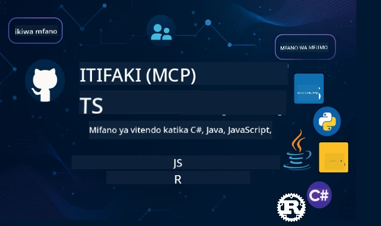

 

[](https://GitHub.com/microsoft/mcp-for-beginners/graphs/contributors)
[](https://GitHub.com/microsoft/mcp-for-beginners/issues)
[](https://GitHub.com/microsoft/mcp-for-beginners/pulls)
[](http://makeapullrequest.com)

[](https://GitHub.com/microsoft/mcp-for-beginners/watchers)
[](https://GitHub.com/microsoft/mcp-for-beginners/fork)
[](https://GitHub.com/microsoft/mcp-for-beginners/stargazers)


[](https://discord.gg/nTYy5BXMWG)

Fuata hatua hizi kuanza kutumia rasilimali hizi:
1. **Fungua Nakala Hii**: Bonyeza [](https://GitHub.com/microsoft/mcp-for-beginners/fork)
2. **Nakili Nakala Hii**:   `git clone https://github.com/microsoft/mcp-for-beginners.git`
3. **Jiunge na** [](https://discord.gg/nTYy5BXMWG)


### 🌐 Msaada wa Lugha Nyingi

#### Unaungwa Mkono Kupitia GitHub Action (Kiotomatiki & Daima Kisasa)

<!-- CO-OP TRANSLATOR LANGUAGES TABLE START -->
[Arabic](../ar/README.md) | [Bengali](../bn/README.md) | [Bulgarian](../bg/README.md) | [Burmese (Myanmar)](../my/README.md) | [Chinese (Simplified)](../zh-CN/README.md) | [Chinese (Traditional, Hong Kong)](../zh-HK/README.md) | [Chinese (Traditional, Macau)](../zh-MO/README.md) | [Chinese (Traditional, Taiwan)](../zh-TW/README.md) | [Croatian](../hr/README.md) | [Czech](../cs/README.md) | [Danish](../da/README.md) | [Dutch](../nl/README.md) | [Estonian](../et/README.md) | [Finnish](../fi/README.md) | [French](../fr/README.md) | [German](../de/README.md) | [Greek](../el/README.md) | [Hebrew](../he/README.md) | [Hindi](../hi/README.md) | [Hungarian](../hu/README.md) | [Indonesian](../id/README.md) | [Italian](../it/README.md) | [Japanese](../ja/README.md) | [Kannada](../kn/README.md) | [Korean](../ko/README.md) | [Lithuanian](../lt/README.md) | [Malay](../ms/README.md) | [Malayalam](../ml/README.md) | [Marathi](../mr/README.md) | [Nepali](../ne/README.md) | [Nigerian Pidgin](../pcm/README.md) | [Norwegian](../no/README.md) | [Persian (Farsi)](../fa/README.md) | [Polish](../pl/README.md) | [Portuguese (Brazil)](../pt-BR/README.md) | [Portuguese (Portugal)](../pt-PT/README.md) | [Punjabi (Gurmukhi)](../pa/README.md) | [Romanian](../ro/README.md) | [Russian](../ru/README.md) | [Serbian (Cyrillic)](../sr/README.md) | [Slovak](../sk/README.md) | [Slovenian](../sl/README.md) | [Spanish](../es/README.md) | [Swahili](./README.md) | [Swedish](../sv/README.md) | [Tagalog (Filipino)](../tl/README.md) | [Tamil](../ta/README.md) | [Telugu](../te/README.md) | [Thai](../th/README.md) | [Turkish](../tr/README.md) | [Ukrainian](../uk/README.md) | [Urdu](../ur/README.md) | [Vietnamese](../vi/README.md)

> **Unapendelea Nakili Kwenye Kompyuta?**
>
> Hii nakala ina tafsiri za lugha zaidi ya 50 ambazo huongeza sana ukubwa wa kupakua. Ili kunakili bila tafsiri, tumia sparse checkout:
>
> **Bash / macOS / Linux:**
> ```bash
> git clone --filter=blob:none --sparse https://github.com/microsoft/mcp-for-beginners.git
> cd mcp-for-beginners
> git sparse-checkout set --no-cone '/*' '!translations' '!translated_images'
> ```
>
> **CMD (Windows):**
> ```cmd
> git clone --filter=blob:none --sparse https://github.com/microsoft/mcp-for-beginners.git
> cd mcp-for-beginners
> git sparse-checkout set --no-cone "/*" "!translations" "!translated_images"
> ```
>
> Hii itakupa kila unachohitaji kukamilisha kozi kwa kupakua kwa kasi zaidi.
<!-- CO-OP TRANSLATOR LANGUAGES TABLE END -->

# 🚀 Mtaala wa Itifaki ya Muktadha wa Mfano (MCP) kwa Waanzilishi

## **Jifunze MCP kwa Mifano ya Programu za Vitendo katika C#, Java, JavaScript, Rust, Python, na TypeScript**

## 🧠 Muhtasari wa Mtaala wa Itifaki ya Muktadha wa Mfano
Karibu kwenye safari yako katika Itifaki ya Muktadha wa Mfano! Ikiwa umewahi kujiuliza jinsi programu za AI zinavyowasiliana na zana na huduma mbalimbali, uko karibu kugundua suluhisho rahisi linalobadilisha jinsi waendelezaji wanavyojenga mifumo yenye akili.

Fikiria MCP kama mtafsiri wa ulimwengu kwa programu za AI - kama vile viunganishi vya USB vinavyokuwezesha kuunganisha kifaa chochote kwenye kompyuta yako, MCP inaruhusu mifano ya AI kuunganishwa na zana au huduma yoyote kwa njia iliyo sanifu. Iwe unajenga chatbot yako ya kwanza au unafanya kazi kwenye mchakato tata wa AI, kuelewa MCP kutakupa nguvu za kuunda programu zenye uwezo mkubwa na zinazobadilika.

Mtaala huu umeundwa kwa uvumilivu na uangalifu kwa ajili ya safari yako ya kujifunza. Tutaanza na dhana rahisi unazozifahamu tayari na polepole kuimarisha ujuzi wako kupitia mazoezi ya vitendo katika lugha yako ya programu unayopenda. Kila hatua inajumuisha maelezo wazi, mifano ya vitendo, na motisha nyingi njiani.

Utakapokamilisha safari hii, utakuwa na ujasiri wa kujenga seva zako za MCP, kuzichanganya na majukwaa maarufu ya AI, na kuelewa jinsi teknolojia hii inavyobadilisha mustakabali wa maendeleo ya AI. Twende pamoja katika adventure hii ya kusisimua!

### Nyaraka Rasmi na Maelezo ya Kiufundi

Mtaala huu unaendana na **Ufafanuzi wa MCP 2025-11-25** (toleo la hivi karibuni thabiti). Ufafanuzi wa MCP hutumia utambulisho wa toleo kulingana na tarehe (muundo wa YYYY-MM-DD) kuhakikisha usimamizi wazi wa toleo la itifaki.

Rasilimali hizi zinakuwa na thamani zaidi unapoelewa zaidi, lakini usijisikie shinikizo la kusoma kila kitu mara moja. Anza na maeneo yanayokuvutia zaidi!
- 📘 [Nyaraka za MCP](https://modelcontextprotocol.io/) – Hii ni rasilimali yako kuu ya mafunzo hatua kwa hatua na mwongozo wa mtumiaji. Nyaraka imeandikwa kwa kuzingatia waanzilishi, ikitoa mifano wazi unaweza kufuata kwa kasi yako.
- 📜 [Ufafanuzi wa MCP](https://modelcontextprotocol.io/specification/2025-11-25) – Fikiria hii kama mwongozo wako kamili wa marejeleo. Unapofanya kazi ndani ya mtaala, utajikuta ukirudi hapa kutafuta maelezo maalum na kuchunguza sifa za hali ya juu.
- 📜 [Usimamizi wa Toleo la Ufafanuzi wa MCP](https://modelcontextprotocol.io/specification/versioning) – Hii ina taarifa kuhusu rekodi za toleo la itifaki na jinsi MCP inavyotumia utambulisho wa tarehe (muundo wa YYYY-MM-DD).
- 🧑‍💻 [Hifadhidata ya MCP GitHub](https://github.com/modelcontextprotocol) – Hapa utapata SDKs, zana, na mifano ya msimbo katika lugha nyingi za programu. Ni kama hazina ya mifano ya vitendo na vipengele vilivyo tayari kutumika.
- 🌐 [Jumuiya ya MCP](https://github.com/orgs/modelcontextprotocol/discussions) – Jiunge na wanafunzi wenzako na waendelezaji waliobobea katika majadiliano kuhusu MCP. Ni jamii yenye msaada ambapo maswali yanakaribishwa na maarifa yanashirikiwa kwa uhuru.
  
## Malengo ya Kujifunza

Mwisho wa mtaala huu, utajihisi na hamu kuhusu ujuzi wako mpya. Hivi ndivyo utakavyopata mafanikio:

• **Fahamu misingi ya MCP**: Utaelewa ni nini Itifaki ya Muktadha wa Mfano na kwa nini inabadilisha jinsi programu za AI zinavyoshirikiana, ukitumia mifano inayofaa na michanganuzi inayotoa maana.

• **Jenga seva yako ya kwanza ya MCP**: Utaunda seva ya MCP inayofanya kazi kwa lugha yako unayopendelea ya programu, kuanzia kwenye mifano rahisi na kukuza ujuzi hatua kwa hatua.

• **Unganisha mifano ya AI na zana halisi**: Utafundishwa jinsi ya kuunganisha pengo kati ya mifano ya AI na huduma halisi, ukipa programu zako uwezo mpya wenye nguvu.

• **Tekeleza mbinu bora za usalama**: Utaelewa jinsi ya kuimarisha utekelezaji wa MCP kwa usalama, kulinda programu zako na watumiaji wako.

• **Weka huduma kwa ujasiri**: Utajua jinsi ya kupeleka miradi yako ya MCP kutoka hatua ya maendeleo hadi uzalishaji, kwa mikakati ya utekelezaji wa vitendo inayofanya kazi katika maisha halisi.

• **Jiunge na jamii ya MCP**: Utakuwa sehemu ya jamii inayokua ya waendelezaji wanaoathiri mustakabali wa maendeleo ya programu za AI. 

## Msingi Muhimu

Kabla hatujaingia katika undani wa MCP, hakikisha unajisikia vizuri na baadhi ya dhana za msingi. Usijali kama huna utaalamu mkubwa katika maeneo haya - tutaeleza kila unachohitaji kujua kadri tunavyosonga!

### Kuelewa Itifaki (Msingi)

Fikiria itifaki kama kanuni za mazungumzo. Unapomuita rafiki, wote mnafahamu kusema "hujambo" unaporudi simu, kuchukua zamu kuzungumza, na kusema "kwaheri" ukimaliza. Programu za kompyuta zinahitaji kanuni kama hizi ili kuwasiliana kwa ufanisi.

MCP ni itifaki - seti ya kanuni zilizokubaliwa zinazosaidia mifano ya AI na programu kuwa na "mazungumzo" ya manufaa na zana na huduma. Kama kanuni za mazungumzo yanavyorahisisha mawasiliano ya watu, MCP inarahisisha sana mawasiliano ya programu za AI na inazifanya kuwa thabiti na zenye nguvu.

### Uhusiano wa Mteja-Seva (Jinsi Programu Zinavyoshirikiana)

Tayari unatumia uhusiano wa mteja-seva kila siku! Unapotumia kivinjari cha wavuti (mteja) kutembelea tovuti, unajiunganisha na seva ya wavuti inayotuma ukurasa kwako. Kivinjari kinajua jinsi ya kuomba taarifa, na seva inajua jinsi ya kutoa majibu.

Katika MCP, tunao uhusiano kama huo: mifano ya AI hutenda kama wateja wanaoomba taarifa au vitendo, wakati seva za MCP hutoa uwezo huu. Ni kama kuwa na msaidizi mkarimu (seva) ambaye AI inaweza kumuomba kufanya kazi maalum.

### Kwa Nini Usanifu ni Muhimu (Kufanya Vitu Kufanye Kazi Pamoja)

Fikiria kama kila mtengenezaji wa magari angetumia aina tofauti ya pampu za mafuta - ungehitaji kiunganisha tofauti kwa kila gari! Usanifu ni makubaliano ya njia za kawaida ili vitu vifanye kazi pamoja bila shida.

MCP hutoa usanifu huu kwa programu za AI. Badala ya kila mfano wa AI kuhitaji msimbo maalum kufanya kazi na kila zana, MCP huunda njia ya kawaida ya kuwasiliana. Hii inamaanisha waendelezaji wanaweza kujenga zana mara moja na ziweze kufanya kazi na mifumo mingi tofauti ya AI.

## 🧭 Muhtasari wa Njia Yako ya Kujifunza

Safari yako ya MCP imepangwa kwa uangalifu kujenga ujasiri na ujuzi hatua kwa hatua. Kila awamu huanzisha dhana mpya huku ikithibitisha kile ulichojifunza.

### 🌱 Awamu ya Msingi: Kuelewa Mambo ya msingi (Moduli 0-2)

Hapa ndipo adventure yako inaanza! Tutakuanzisha kwa dhana za MCP tukitumia mifano inayojulikana na mifano rahisi. Utafahamu ni nini MCP, kwa nini ipo, na jinsi inavyofaa katika dunia kubwa ya maendeleo ya AI.

• **Moduli 0 - Utangulizi wa MCP**: Tutaanza kwa kuchunguza ni nini MCP na kwa nini ni muhimu kwa programu za AI za kisasa. Utaona mifano halisi ya MCP ikifanya kazi na kuelewa jinsi inavyotatua matatizo ya kawaida yanayokabiliwa na waendelezaji.

• **Moduli 1 - Maana ya Dhana Muhimu**: Hapa utajifunza nyenzo muhimu za MCP. Tutatumia mifano mingi na mifano ya kuona kuhakikisha dhana hizi zinaonekana kuwa za kawaida na rahisi kuelewa.

• **Moduli 2 - Usalama katika MCP**: Usalama unaweza kuonekana kuwa waogopesha, lakini tutakuonyesha jinsi MCP inavyojumuisha vipengele vya usalama vilivyojengwa ndani na kukufundisha mbinu bora zinazolinda programu zako tangu mwanzo.

### 🔨 Awamu ya Ujenzi: Kuunda Utekelezaji Wako wa Kwanza (Moduli 3)

Sasa furaha ya kweli inaanza! Utapata uzoefu wa vitendo wa kujenga seva na wateja halisi wa MCP. Usijali - tutaanza kwa urahisi na kukuongoza kila hatua.
Moduli hii ina miongozo mingi ya vitendo inayokuwezesha kufanya mazoezi katika lugha yako unayopendelea ya programu. Utaunda seva yako ya kwanza, kujenga mteja kuungana nayo, na hata kuingiza na zana maarufu za maendeleo kama VS Code.

Kila mwongozo una mifano kamili ya msimbo, vidokezo vya kutatua matatizo, na maelezo ya kwanini tunachagua muundo maalum. Mwisho wa hatua hii, utakuwa na utekelezaji wa MCP unaofanya kazi unaoweza kujivunia!

### 🚀 Hatua ya Ukuaji: Mawazo ya Juu na Matumizi ya Uhalisia (Moduli 4-5)

Baada ya kujifunza misingi, uko tayari kuchunguza sifa za juu zaidi za MCP. Tutashughulikia mbinu za utekelezaji wa vitendo, mbinu za kusahihisha makosa, na mada za juu kama vile kuunganisha AI wa hali mbalimbali.

Pia utajifunza jinsi ya kupanua utekelezaji wako wa MCP kwa matumizi ya uzalishaji na kuingiza na mifumo ya wingu kama Azure. Moduli hizi zinakuandaa kujenga suluhisho za MCP zenye uwezo wa kukabiliana na mahitaji halisi ya dunia.

### 🌟 Hatua ya Utaalamu: Jamii na Utaalam (Moduli 6-11)

Hatua ya mwisho inalenga kujiunga na jamii ya MCP na kuhitimu katika maeneo yanayokuvutia zaidi. Utajifunza jinsi ya kuchangia miradi ya MCP ya chanzo wazi, kutekeleza mifumo ya usalama wa hali ya juu, na kujenga suluhisho za kamili zinazoingiliana na hifadhidata.

Moduli 11 inastahili kutajwa kwa maana maalum - ni mfululizo kamili wa maabara 13 za vitendo zinazokufundisha kujenga seva za MCP zilizo tayari kwa uzalishaji na uunganisho wa PostgreSQL. Ni kama mradi wa mwisho unaoleta pamoja kila kitu ulichojifunza!

### 📚 Muundo Kamili wa Mtaala

| Moduli | Mada | Maelezo | Kiungo |
|--------|-------|-------------|------|
| **Moduli 0-3: Misingi** | | | |
| 00 | Utangulizi wa MCP | Muhtasari wa Itifaki ya Muktadha wa Mfano na umuhimu wake katika mifumo ya AI | [Soma zaidi](./00-Introduction/README.md) |
| 01 | Maelezo ya Dhahania za Msingi | Uchanganuzi wa kina wa dhahania kuu za MCP | [Soma zaidi](./01-CoreConcepts/README.md) |
| 02 | Usalama katika MCP | Vitisho vya usalama na mbinu bora | [Soma zaidi](./02-Security/README.md) |
| 03 | Kuanzisha MCP | Usanidi wa mazingira, seva/mteja wa msingi, uunganisho | [Soma zaidi](./03-GettingStarted/README.md) |
| **Moduli 3: Kujenga Seva yako ya Kwanza & Mteja** | | | |
| 3.1 | Seva ya Kwanza | Tengeneza seva yako ya kwanza ya MCP | [Mwongozo](./03-GettingStarted/01-first-server/README.md) |
| 3.2 | Mteja wa Kwanza | Tengeneza mteja wa msingi wa MCP | [Mwongozo](./03-GettingStarted/02-client/README.md) |
| 3.3 | Mteja na LLM | Unganisha mifano mikubwa ya lugha | [Mwongozo](./03-GettingStarted/03-llm-client/README.md) |
| 3.4 | Uunganisho wa VS Code | Tumia seva za MCP ndani ya VS Code | [Mwongozo](./03-GettingStarted/04-vscode/README.md) |
| 3.5 | Seva ya stdio | Tengeneza seva kwa kutumia usafirishaji wa stdio | [Mwongozo](./03-GettingStarted/05-stdio-server/README.md) |
| 3.6 | Usambazaji wa HTTP | Tekeleza usambazaji wa HTTP katika MCP | [Mwongozo](./03-GettingStarted/06-http-streaming/README.md) |
| 3.7 | AI Toolkit | Tumia AI Toolkit na MCP | [Mwongozo](./03-GettingStarted/07-aitk/README.md) |
| 3.8 | Upimaji | Pima utekelezaji wako wa seva ya MCP | [Mwongozo](./03-GettingStarted/08-testing/README.md) |
| 3.9 | Uwekaji Kwenye Uzalishaji | Weka seva za MCP kwa matumizi halisi | [Mwongozo](./03-GettingStarted/09-deployment/README.md) |
| 3.10 | Matumizi ya seva ya juu | Tumia seva za hali ya juu kwa matumizi ya vipengele vya juu na usanifu ulioboreshwa | [Mwongozo](./03-GettingStarted/10-advanced/README.md) |
| 3.11 | Uthibitishaji rahisi | Sura inayoonyesha uthibitishaji kutoka mwanzo na RBAC | [Mwongozo](./03-GettingStarted/11-simple-auth/README.md) |
| 3.12 | Mabamba ya MCP | Sanidi Claude Desktop, Cursor, Cline, na mabamba mengine ya MCP | [Mwongozo](./03-GettingStarted/12-mcp-hosts/README.md) |
| 3.13 | Mshtakaji wa MCP | Tafuta na pima seva za MCP kwa zana ya Inspector | [Mwongozo](./03-GettingStarted/13-mcp-inspector/README.md) |
| 3.14 | Sampuli | Tumia sampuli kushirikiana na mteja | [Mwongozo](./03-GettingStarted/14-sampling/README.md) |
| 3.15 | Programu za MCP | Jenga Programu za MCP | [Mwongozo](./03-GettingStarted/15-mcp-apps/README.md) |
| **Moduli 4-5: Vitendo & Juu** | | | |
| 04 | Utekelezaji wa Vitendo | SDKs, kusahihisha makosa, upimaji, templeti za maombi zinazoweza kutumika tena | [Soma zaidi](./04-PracticalImplementation/README.md) |
| 4.1 | Upagaji | Shughulikia seti kubwa za matokeo kwa paginatio inayoendeshwa na kidokezo | [Mwongozo](./04-PracticalImplementation/pagination/README.md) |
| 05 | Mada za Juu katika MCP | AI wa hali nyingi, upanuzi, matumizi ya kampuni | [Soma zaidi](./05-AdvancedTopics/README.md) |
| 5.1 | Uunganisho wa Azure | Uunganisho wa MCP na Azure | [Mwongozo](./05-AdvancedTopics/mcp-integration/README.md) |
| 5.2 | Multi-modality | Kutumia hali mbalimbali kwa wakati mmoja | [Mwongozo](./05-AdvancedTopics/mcp-multi-modality/README.md) |
| 5.3 | Onyesho la OAuth2 | Tekeleza uthibitishaji wa OAuth2 | [Mwongozo](./05-AdvancedTopics/mcp-oauth2-demo/README.md) |
| 5.4 | Muktadha wa Msingi | Elewa na tekeleza muktadha wa msingi | [Mwongozo](./05-AdvancedTopics/mcp-root-contexts/README.md) |
| 5.5 | Uelekezaji | Mikakati ya uelekezaji wa MCP | [Mwongozo](./05-AdvancedTopics/mcp-routing/README.md) |
| 5.6 | Sampuli | Mbinu za sampuli katika MCP | [Mwongozo](./05-AdvancedTopics/mcp-sampling/README.md) |
| 5.7 | Upanuzi | Panua utekelezaji wa MCP | [Mwongozo](./05-AdvancedTopics/mcp-scaling/README.md) |
| 5.8 | Usalama | Mambo ya juu ya usalama | [Mwongozo](./05-AdvancedTopics/mcp-security/README.md) |
| 5.9 | Utafutaji wa Wavuti | Tekeleza uwezo wa utafutaji wa wavuti | [Mwongozo](./05-AdvancedTopics/web-search-mcp/README.md) |
| 5.10 | Usambazaji wa Wakati Halisi | Jenga uwezo wa usambazaji wa wakati halisi | [Mwongozo](./05-AdvancedTopics/mcp-realtimestreaming/README.md) |
| 5.11 | Utafutaji wa Wakati Halisi | Tekeleza utafutaji wa wakati halisi | [Mwongozo](./05-AdvancedTopics/mcp-realtimesearch/README.md) |
| 5.12 | Uthibitishaji wa Entra ID | Uthibitishaji kwa Microsoft Entra ID | [Mwongozo](./05-AdvancedTopics/mcp-security-entra/README.md) |
| 5.13 | Uingiliaji wa Foundry | Unganisha na Azure AI Foundry | [Mwongozo](./05-AdvancedTopics/mcp-foundry-agent-integration/README.md) |
| 5.14 | Uhandisi wa Muktadha | Mbinu za uhandisi mzuri wa muktadha | [Mwongozo](./05-AdvancedTopics/mcp-contextengineering/README.md) |
| 5.15 | Usafirishaji wa MCP Ulio Maalum | Utekelezaji wa usafirishaji wa kipengele maalum | [Mwongozo](./05-AdvancedTopics/mcp-transport/README.md) |
| 5.16 | Vipengele vya Itifaki | Arifa za maendeleo, kusitisha, templeti za rasilimali | [Mwongozo](./05-AdvancedTopics/mcp-protocol-features/README.md) |
| **Moduli 6-10: Jamii & Mbinu Bora** | | | |
| 06 | Michango ya Jamii | Jinsi ya kuchangia mfumo wa MCP | [Mwongozo](./06-CommunityContributions/README.md) |
| 07 | Maarifa kutoka kwa Matumizi ya Mapema | Hadithi za utekelezaji halisi | [Mwongozo](./07-LessonsfromEarlyAdoption/README.md) |
| 08 | Mbinu Bora kwa MCP | Utendaji, uvumilivu wa kasoro, ustahimilivu | [Mwongozo](./08-BestPractices/README.md) |
| 09 | Tafiti za Kesi za MCP | Mifano ya utekelezaji wa vitendo | [Mwongozo](./09-CaseStudy/README.md) |
| 10 | Warsha ya Vitendo | Kujenga Seva ya MCP na AI Toolkit | [Maabara](./10-StreamliningAIWorkflowsBuildingAnMCPServerWithAIToolkit/README.md) |
| **Moduli 11: Maabara ya Vitendo ya Seva za MCP** | | | |
| 11 | Uunganisho wa Hifadhidata za Seva za MCP | Njia ya maabara 13 kamili kwa uunganisho wa PostgreSQL | [Maabara](./11-MCPServerHandsOnLabs/README.md) |
| 11.1 | Utangulizi | Muhtasari wa MCP na uunganisho wa hifadhidata na matumizi ya uchambuzi wa rejareja | [Maabara 00](./11-MCPServerHandsOnLabs/00-Introduction/README.md) |
| 11.2 | Usanifu wa Msingi | Kuelewa usanifu wa seva ya MCP, tabaka za hifadhidata, na mifumo ya usalama | [Maabara 01](./11-MCPServerHandsOnLabs/01-Architecture/README.md) |
| 11.3 | Usalama & Multi-Tenancy | Usalama wa Kiwango cha Safu, uthibitishaji, na upatikanaji wa data kwa wamiliki wengi | [Maabara 02](./11-MCPServerHandsOnLabs/02-Security/README.md) |
| 11.4 | Usanidi wa Mazingira | Kuandaa mazingira ya maendeleo, Docker, rasilimali za Azure | [Maabara 03](./11-MCPServerHandsOnLabs/03-Setup/README.md) |
| 11.5 | Ubunifu wa Hifadhidata | Kuandaa PostgreSQL, muundo wa skimu ya rejareja, na data za mfano | [Maabara 04](./11-MCPServerHandsOnLabs/04-Database/README.md) |
| 11.6 | Utekelezaji wa Seva ya MCP | Kujenga seva ya FastMCP yenye uunganisho wa hifadhidata | [Maabara 05](./11-MCPServerHandsOnLabs/05-MCP-Server/README.md) |
| 11.7 | Maendeleo ya Zana | Kuunda zana za uchunguzi wa hifadhidata na utambuzi wake | [Maabara 06](./11-MCPServerHandsOnLabs/06-Tools/README.md) |
| 11.8 | Utafutaji wa Maneno | Kutekeleza ueingizo wa vector na Azure OpenAI na pgvector | [Maabara 07](./11-MCPServerHandsOnLabs/07-Semantic-Search/README.md) |
| 11.9 | Upimaji & Kusahihisha Makosa | Mikakati ya upimaji, zana za kusahihisha makosa, na mbinu za uthibitisho | [Maabara 08](./11-MCPServerHandsOnLabs/08-Testing/README.md) |
| 11.10 | Uunganisho wa VS Code | Kusanidi uunganisho wa MCP katika VS Code na matumizi ya AI Chat | [Maabara 09](./11-MCPServerHandsOnLabs/09-VS-Code/README.md) |
| 11.11 | Mikakati ya Uwekaji Kwenye Uzalishaji | Uwekaji Docker, Azure Container Apps, na mambo ya kupanua | [Maabara 10](./11-MCPServerHandsOnLabs/10-Deployment/README.md) |
| 11.12 | Ufuatiliaji | Application Insights, uandishi wa kumbukumbu, ufuatiliaji wa utendaji | [Maabara 11](./11-MCPServerHandsOnLabs/11-Monitoring/README.md) |
| 11.13 | Mbinu Bora | Uboreshaji wa utendaji, kuimarisha usalama, na vidokezo vya uzalishaji | [Maabara 12](./11-MCPServerHandsOnLabs/12-Best-Practices/README.md) |

### 💻 Miradi ya Mifano ya Msimbo

Sehemu moja ya kupendeza zaidi ya kujifunza MCP ni kuona ujuzi wako wa msimbo ukizidi kupanuka. Tumebuni mifano ya msimbo wetu kuanzia rahisi na kuendelea kuwa tata kadri unavyoongeza kuelewa. Hivi ndivyo tunavyowasilisha dhahania - na msimbo rahisi kuelewa lakini unaoonyesha kanuni halisi za MCP, utaelewa si tu nini msimbo huu unafanya, bali kwa nini umeundwa hivi na jinsi unavyofaa katika programu kubwa za MCP.

#### Sampuli za Kimsingi za Kalkuleta ya MCP

| Lugha | Maelezo | Kiungo |
|----------|-------------|------|
| C# | Mfano wa Seva ya MCP | [Tazama Msimbo](./03-GettingStarted/samples/csharp/README.md) |
| Java | Kalkuleta ya MCP | [Tazama Msimbo](./03-GettingStarted/samples/java/calculator/README.md) |
| JavaScript | Onyesho la MCP | [Tazama Msimbo](./03-GettingStarted/samples/javascript/README.md) |
| Python | Seva ya MCP | [Tazama Msimbo](../../03-GettingStarted/samples/python/mcp_calculator_server.py) |
| TypeScript | Mfano wa MCP | [Tazama Msimbo](./03-GettingStarted/samples/typescript/README.md) |
| Rust | Mfano wa MCP | [Tazama Msimbo](./03-GettingStarted/samples/rust/README.md) |

#### Utekelezaji wa Kukamilika za MCP

| Lugha | Maelezo | Kiungo |
|----------|-------------|------|
| C# | Mfano wa Juu | [Tazama Msimbo](./04-PracticalImplementation/samples/csharp/README.md) |
| Java na Spring | Mfano wa Programu ya Kontena | [Tazama Msimbo](./04-PracticalImplementation/samples/java/containerapp/README.md) |
| JavaScript | Mfano wa Juu | [Tazama Msimbo](./04-PracticalImplementation/samples/javascript/README.md) |
| Python | Utekelezaji Tata | [Tazama Msimbo](./04-PracticalImplementation/samples/python/README.md) |
| TypeScript | Sampuli ya Kontena | [Tazama Msimbo](./04-PracticalImplementation/samples/typescript/README.md) |


## 🎯 Mahitaji ya Awali ya Kujifunza MCP

Ili kupata zaidi kutoka kwenye mtaala huu, unapaswa kuwa na:
- Maarifa ya msingi ya programu kwa angalau moja ya lugha zifuatazo: C#, Java, JavaScript, Python, au TypeScript  
- Uelewa wa mfano wa mteja-mtumiaji na APIs  
- Uzoefu wa dhana za REST na HTTP  
- (Hiari) Asili katika dhana za AI/ML  

- Kushiriki katika majadiliano ya jamii yetu kwa msaada  

## 📚 Mwongozo wa Masomo na Rasilimali  

Hifadhi hii ina rasilimali kadhaa za kukusaidia kuvinjari na kujifunza kwa ufanisi:  

### Mwongozo wa Masomo  

Mwongozo kamili wa [Masomo](./study_guide.md) upo kusaidia kuvinjari hifadhi hii kwa ufanisi. Ramani hii ya mtaala ya kuona inaonyesha jinsi mada zote zilivyounganishwa na inatoa mwongozo wa jinsi ya kutumia miradi ya mfano kwa ufanisi. Ni hasa kusaidia kama wewe ni mwanafunzi anayependa kuona picha kubwa.  

Mwongozo una:  
- Ramani ya mtaala ya kuona inaonyesha mada zote zilizoangaziwa  
- Muhtasari wa kina wa kila sehemu ya hifadhi  
- Mwongozo wa jinsi ya kutumia miradi ya mfano  
- Njia za kujifunza zilizopendekezwa kwa viwango tofauti vya ujuzi  
- Rasilimali za ziada za kuimarisha safari yako ya kujifunza  

### Mabadiliko ya Maudhui  

Tunahifadhi [Mabadiliko ya Maudhui](./changelog.md) yaliyo ya kina yanayofuatilia masasisho yote makubwa ya vifaa vya mtaala, hivyo unaweza kusalia na mabadiliko na nyongeza za hivi karibuni.  
- Nyongeza za maudhui mapya  
- Mabadiliko ya muundo  
- Maboresho ya vipengele  
- Maboresho ya hati  

## 🛠️ Jinsi ya Kutumia Mtaala Huu kwa Ufanisi  

Kila somo katika mwongozo huu linajumuisha:  

1. Maelezo wazi ya dhana za MCP  
2. Mifano ya moja kwa moja ya msimbo katika lugha mbalimbali  
3. Mazoezi ya kujenga programu halisi za MCP  
4. Rasilimali za ziada kwa wanafunzi wa hali ya juu  

### Tujifunze MCP na C# - Mfululizo wa Mafunzo  
Tujifunze kuhusu Model Context Protocol (MCP), mfumo wa kisasa uliobuniwa kuweka viwango kwa ushirikiano kati ya mifano ya AI na programu za mteja. Kupitia kikao hiki cha mwanzoni kirahisi, tutakuletea MCP na kukuongoza kuanzisha seva yako ya kwanza ya MCP.  
#### C#: [https://aka.ms/letslearnmcp-csharp](https://aka.ms/letslearnmcp-csharp)  
#### Java: [https://aka.ms/letslearnmcp-java](https://aka.ms/letslearnmcp-java)  
#### JavaScript: [https://aka.ms/letslearnmcp-javascript](https://aka.ms/letslearnmcp-javascript)  
#### Python: [https://aka.ms/letslearnmcp-python](https://aka.ms/letslearnmcp-python)  

## 🎓 Safari Yako ya MCP Inaanza  

Hongera! Umechukua hatua ya kwanza katika safari ya kusisimua ambayo itapanua uwezo wako wa programu na kukuunganisha na maendeleo ya kisasa ya AI.  

### Umefanya Kile Ambacho Tayari  

Kwa kusoma utangulizi huu, tayari umeanza kujenga msingi wa maarifa ya MCP. Unaelewa MCP ni nini, kwa nini ni muhimu, na mtaala huu utakusaidiaje katika safari yako ya kujifunza. Hiyo ni mafanikio makubwa na mwanzo wa utaalamu wako katika teknolojia hii muhimu.  

### Safari Inayokuja  

Unaposhughulika na moduli, kumbuka kila mtaalamu alikuwa mwanzoni. Dhana ambazo zinaweza kuonekana ngumu sasa zitakuwa rahisi kadri unavyofanya mazoezi na kuzitumia. Kila hatua ndogo hujenga kwa ajili ya uwezo mkubwa ambao utakutumikia katika kazi yako ya maendeleo.  

### Mtandao Wako wa Msaada  

Unajiunga na jamii ya wanafunzi na wataalamu wanaopenda MCP na wanaotamani kusaidia wengine kufanikisha. Ikiwa unashindwa na changamoto ya msimbo au unafurahia kushiriki mafanikio, jamii iko hapa kukuunga mkono.  

Ikiwa unashindwa au una maswali kuhusu ujenzi wa programu za AI, jiunge na wanafunzi wenzako na waendelezaji wenye uzoefu katika majadiliano kuhusu MCP. Ni jamii yenye msaada ambapo maswali yanakaribishwa na maarifa yanashirikiwa kwa uhuru.  

[](https://discord.gg/nTYy5BXMWG)  

Ikiwa una maoni kuhusu bidhaa au makosa wakati wa ujenzi tembelea:  

[](https://aka.ms/foundry/forum)  

### Tayari Kuanza?  

Safari yako ya MCP inaanza sasa! Anza na Moduli 0 kuingia katika uzoefu wako wa kwanza wa moja kwa moja MCP, au chunguza miradi ya mfano kuona kile utakachojenga. Kumbuka - kila mtaalamu alianza mahali ulipo sasa, na kwa uvumilivu na mazoezi, utashangazwa na kile utakachoweza kufanikisha.  

Karibu katika ulimwengu wa maendeleo ya Model Context Protocol. Tujenge kitu kizuri pamoja!  

## 🤝 Kuchangia Jamii ya Kujifunza  

Mtaala huu unakua kwa nguvu zaidi kwa michango kutoka kwa wanafunzi kama wewe! Iwe unarekebisha makosa ya kisarufi, kupendekeza maelezo ya wazi zaidi, au kuongeza mfano mpya, michango yako inasaidia wanowanzoni kufanikisha.  

Asante kwa Microsoft Valued Professional [Shivam Goyal](https://www.linkedin.com/in/shivam2003/) kwa kuchangia sampuli za msimbo.  

Mchakato wa michango umeundwa kuwa wa karibu na wa msaada. Michango mingi inahitaji Makubaliano ya Leseni ya Mchango (CLA), lakini zana za otomatiki zitakuongoza kwa urahisi.  

## 📜 Kujifunza Chanzo Huria  

Mtaala wote upo chini ya [LICENSE](../../LICENSE) ya MIT, ambayo inamaanisha unaweza kutumia, kubadilisha, na kushiriki huru. Hii inaunga mkono dhamira yetu ya kufanya maarifa ya MCP kupatikana kwa watengenezaji kila mahali.  
## 🤝 Miongozo ya Michango  

Mradi huu unakaribisha michango na mapendekezo. Michango mingi inahitaji wewe kukubali Makubaliano ya Leseni ya Mchango (CLA) ikitangaza kuwa una haki, na kwa kweli unaturuhusu kutumia mchango wako. Kwa maelezo, tembelea <https://cla.opensource.microsoft.com>.  

Unapotuma ombi la kuvuta (pull request), bot wa CLA utaamua moja kwa moja kama unahitaji kutoa CLA na kupamba PR ipasavyo (mfano, ukaguzi wa hali, maoni). Fuata tu maelekezo yanayotolewa na bot. Hii utahitaji kufanya mara moja tu katika hifadhidata zote zinazotumia CLA yetu.  

Mradi huu umechukua [Kanuni ya Maadili ya Chanzo Huria ya Microsoft](https://opensource.microsoft.com/codeofconduct/).  
Kwa taarifa zaidi tembelea [Maswali Yanayoulizwa Mara kwa Mara ya Kanuni ya Maadili](https://opensource.microsoft.com/codeofconduct/faq/) au wasiliana na [opencode@microsoft.com](mailto:opencode@microsoft.com) kwa maswali au maoni zaidi.  

---  

*Uko tayari kuanza safari yako ya MCP? Anza na [Moduli 00 - Utangulizi wa MCP](./00-Introduction/README.md) na chukua hatua zako za kwanza katika ulimwengu wa maendeleo ya Model Context Protocol!*  

## 🎒 Kozi Nyingine  
Timu yetu hutengeneza kozi nyingine! Angalia:  

<!-- CO-OP TRANSLATOR OTHER COURSES START -->  
### LangChain  
[](https://aka.ms/langchain4j-for-beginners)  
[](https://aka.ms/langchainjs-for-beginners?WT.mc_id=m365-94501-dwahlin)  
[](https://github.com/microsoft/langchain-for-beginners?WT.mc_id=m365-94501-dwahlin)  
---  

### Azure / Edge / MCP / Agents  
[](https://github.com/microsoft/AZD-for-beginners?WT.mc_id=academic-105485-koreyst)  
[](https://github.com/microsoft/edgeai-for-beginners?WT.mc_id=academic-105485-koreyst)  
[](https://github.com/microsoft/mcp-for-beginners?WT.mc_id=academic-105485-koreyst)  
[](https://github.com/microsoft/ai-agents-for-beginners?WT.mc_id=academic-105485-koreyst)  

---  
   
### Generative AI Series  
[](https://github.com/microsoft/generative-ai-for-beginners?WT.mc_id=academic-105485-koreyst)  
[-9333EA?style=for-the-badge&labelColor=E5E7EB&color=9333EA)](https://github.com/microsoft/Generative-AI-for-beginners-dotnet?WT.mc_id=academic-105485-koreyst)  
[-C084FC?style=for-the-badge&labelColor=E5E7EB&color=C084FC)](https://github.com/microsoft/generative-ai-for-beginners-java?WT.mc_id=academic-105485-koreyst)  
[-E879F9?style=for-the-badge&labelColor=E5E7EB&color=E879F9)](https://github.com/microsoft/generative-ai-with-javascript?WT.mc_id=academic-105485-koreyst)  

---  
   
### Core Learning  
[](https://aka.ms/ml-beginners?WT.mc_id=academic-105485-koreyst)  
[](https://aka.ms/datascience-beginners?WT.mc_id=academic-105485-koreyst)  
[](https://aka.ms/ai-beginners?WT.mc_id=academic-105485-koreyst)  
[](https://github.com/microsoft/Security-101?WT.mc_id=academic-96948-sayoung)  
[](https://aka.ms/webdev-beginners?WT.mc_id=academic-105485-koreyst)  
[](https://aka.ms/iot-beginners?WT.mc_id=academic-105485-koreyst)  
[](https://github.com/microsoft/xr-development-for-beginners?WT.mc_id=academic-105485-koreyst)  

---  
   
### Copilot Series
[](https://aka.ms/GitHubCopilotAI?WT.mc_id=academic-105485-koreyst)
[](https://github.com/microsoft/mastering-github-copilot-for-dotnet-csharp-developers?WT.mc_id=academic-105485-koreyst)
[](https://github.com/microsoft/CopilotAdventures?WT.mc_id=academic-105485-koreyst)
<!-- CO-OP TRANSLATOR OTHER COURSES END -->

---

<!-- CO-OP TRANSLATOR DISCLAIMER START -->
**Tangazo la Kigugumizi**:
Hati hii imetafsiriwa kwa kutumia huduma ya tafsiri ya AI [Co-op Translator](https://github.com/Azure/co-op-translator). Ingawa tunajitahidi kwa usahihi, tafadhali fahamu kwamba tafsiri za kiotomatiki zinaweza kuwa na makosa au kasoro. Hati asili katika lugha yake ya asili inapaswa kuzingatiwa kama chanzo cha mamlaka. Kwa taarifa muhimu, tafsiri ya binadamu mtaalamu inashauriwa. Hatubebeki dhamana kwa kutoelewana au tafsiri potovu zinazotokana na matumizi ya tafsiri hii.
<!-- CO-OP TRANSLATOR DISCLAIMER END -->