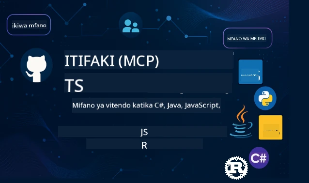

 

[](https://GitHub.com/microsoft/mcp-for-beginners/graphs/contributors)
[](https://GitHub.com/microsoft/mcp-for-beginners/issues)
[](https://GitHub.com/microsoft/mcp-for-beginners/pulls)
[](http://makeapullrequest.com)
[](https://mcptoplist.com/server/mcp.so%2Fmcp-for-beginners%2Fmicrosoft)

[](https://GitHub.com/microsoft/mcp-for-beginners/watchers)
[](https://GitHub.com/microsoft/mcp-for-beginners/fork)
[](https://GitHub.com/microsoft/mcp-for-beginners/stargazers)


[](https://discord.gg/nTYy5BXMWG)

Fuata hatua hizi kuanza kutumia rasilimali hizi:
1. **Fungua Nakala ya Hazina**: Bonyeza [](https://GitHub.com/microsoft/mcp-for-beginners/fork)
2. **Nakili Hazina**:   `git clone https://github.com/microsoft/mcp-for-beginners.git`
3. **Jiunge na** [](https://discord.gg/nTYy5BXMWG)


### 🌐 Msaada wa Lugha Nyingi

#### Inasaidiwa kupitia Kitendo cha GitHub (Kiotomatiki & Kila Wakati cha Kisasa)

<!-- CO-OP TRANSLATOR LANGUAGES TABLE START -->
[Arabic](../ar/README.md) | [Bengali](../bn/README.md) | [Bulgarian](../bg/README.md) | [Burmese (Myanmar)](../my/README.md) | [Chinese (Simplified)](../zh-CN/README.md) | [Chinese (Traditional, Hong Kong)](../zh-HK/README.md) | [Chinese (Traditional, Macau)](../zh-MO/README.md) | [Chinese (Traditional, Taiwan)](../zh-TW/README.md) | [Croatian](../hr/README.md) | [Czech](../cs/README.md) | [Danish](../da/README.md) | [Dutch](../nl/README.md) | [Estonian](../et/README.md) | [Finnish](../fi/README.md) | [French](../fr/README.md) | [German](../de/README.md) | [Greek](../el/README.md) | [Hebrew](../he/README.md) | [Hindi](../hi/README.md) | [Hungarian](../hu/README.md) | [Indonesian](../id/README.md) | [Italian](../it/README.md) | [Japanese](../ja/README.md) | [Kannada](../kn/README.md) | [Khmer](../km/README.md) | [Korean](../ko/README.md) | [Lithuanian](../lt/README.md) | [Malay](../ms/README.md) | [Malayalam](../ml/README.md) | [Marathi](../mr/README.md) | [Nepali](../ne/README.md) | [Nigerian Pidgin](../pcm/README.md) | [Norwegian](../no/README.md) | [Persian (Farsi)](../fa/README.md) | [Polish](../pl/README.md) | [Portuguese (Brazil)](../pt-BR/README.md) | [Portuguese (Portugal)](../pt-PT/README.md) | [Punjabi (Gurmukhi)](../pa/README.md) | [Romanian](../ro/README.md) | [Russian](../ru/README.md) | [Serbian (Cyrillic)](../sr/README.md) | [Slovak](../sk/README.md) | [Slovenian](../sl/README.md) | [Spanish](../es/README.md) | [Swahili](./README.md) | [Swedish](../sv/README.md) | [Tagalog (Filipino)](../tl/README.md) | [Tamil](../ta/README.md) | [Telugu](../te/README.md) | [Thai](../th/README.md) | [Turkish](../tr/README.md) | [Ukrainian](../uk/README.md) | [Urdu](../ur/README.md) | [Vietnamese](../vi/README.md)

> **Unapendelea Kukopa Kwenye Kifaa Chako?**
>
> Hifadhi hii ina tafsiri zaidi ya 50 za lugha ambazo huongeza kiasi cha upakuaji kwa kiasi kikubwa. Ili kukopa bila tafsiri, tumia sparse checkout:
>
> **Bash / macOS / Linux:**
> ```bash
> git clone --filter=blob:none --sparse https://github.com/microsoft/mcp-for-beginners.git
> cd mcp-for-beginners
> git sparse-checkout set --no-cone '/*' '!translations' '!translated_images'
> ```
>
> **CMD (Windows):**
> ```cmd
> git clone --filter=blob:none --sparse https://github.com/microsoft/mcp-for-beginners.git
> cd mcp-for-beginners
> git sparse-checkout set --no-cone "/*" "!translations" "!translated_images"
> ```
>
> Hii inakupa kila kitu unachohitaji kukamilisha kozi kwa upakuaji wa kasi zaidi.
<!-- CO-OP TRANSLATOR LANGUAGES TABLE END -->

# 🚀 Mtaala wa Model Context Protocol (MCP) kwa Wakianza

## **Jifunze MCP kwa Mifano ya Vitendo ya Code katika C#, Java, JavaScript, Rust, Python, na TypeScript**

## 🧠 Muhtasari wa Mtaala wa Model Context Protocol
Karibu kwenye safari yako katika Model Context Protocol! Ikiwa umewahi kujiuliza jinsi programu za AI zinavyowasiliana na zana na huduma mbalimbali, uko karibu kugundua suluhisho maridadi linalobadilisha jinsi waendelezaji wanavyojenga mifumo yenye akili.

Fikiria MCP kama mtafsiri wa ulimwengu wa programu za AI - kama vile viunganishi vya USB vinavyokuwezesha kuunganisha kifaa chochote kwenye kompyuta yako, MCP inaruhusu mifano ya AI kuunganishwa na zana au huduma yoyote kwa njia iliyorekebishwa. Ikiwa unajenga chatbot yako ya kwanza au unafanya kazi kwenye kazi ngumu za AI, kuelewa MCP kutakupa nguvu ya kuunda programu zenye uwezo na zinazobadilika zaidi.

Mtaala huu umeandaliwa kwa subira na uangalifu kwa ajili ya safari yako ya kujifunza. Tutaanzia na dhana rahisi unazozifahamu na taratibu kuendeleza utaalamu wako kupitia mazoezi ya vitendo katika lugha yako unayopendelea ya programu. Kila hatua inajumuisha maelezo wazi, mifano ya vitendo, na mshikamano mwingi wakati wote.

Ukitimiza safari hii, utakuwa na imani ya kujenga seva zako za MCP, kuziunganisha na majukwaa maarufu ya AI, na kuelewa jinsi teknolojia hii inavyobadilisha mustakabali wa maendeleo ya AI. Twende tukaanze adventure hii ya kusisimua pamoja!

### Hati Rasmi na Maelezo ya Kina

Mtaala huu umeendana na **Maelezo ya MCP 2025-11-25** (toleo thabiti la hivi karibuni). Maelezo ya MCP yanatumia usanidi wa tarehe (mchoro wa YYYY-MM-DD) kuhakikisha ufuatiliaji wa toleo la itifaki ni wazi.

> **Tazama mbele:** mgombea wa toleo la itifaki ijayo, **2026-07-28**, umepangwa kutolewa mnamo Julai 28, 2026. Unafanya itifaki kuwa bila hali katika safu ya usafirishaji, utaweka rasmi mfumo wa Nyongeza (MCP Apps, Tasks), kuimarisha idhini, na kuondoa Roots, Sampling, na Logging. Angalia [Mabadiliko katika MCP: Mgombea wa Toleo la 2026-07-28](./01-CoreConcepts/mcp-2026-07-28-release-candidate.md) kwa muhtasari kamili.

Rasilimali hizi zinakuwa na thamani zaidi kadri ufahamu wako unavyozidi, lakini usijisikie shinikizo kusoma kila kitu mara moja. Anza na sehemu unazopendelea zaidi!
- 📘 [Hati za MCP](https://modelcontextprotocol.io/) – Hii ni rasilimali yako ya msingi kwa mafunzo hatua kwa hatua na mwongozo wa mtumiaji. Hati zimeandikwa kwa lengo la kuwasaidia wanaoanza, zikitoa mifano wazi unayoweza kufuata kwa kasi yako mwenyewe.
- 📜 [Muhtasari wa MCP](https://modelcontextprotocol.io/specification/2025-11-25) – Fikiria hii kama mwongozo wako kamili wa rejea. Unapokuwa kwenye mtaala, utarudi hapa kutafuta maelezo maalum na kuchunguza vipengele vya juu.
- 📜 [Usanidi wa Toleo la MCP](https://modelcontextprotocol.io/specification/versioning) – Hii ina taarifa kuhusu historia ya toleo la itifaki na jinsi MCP inavyotumia usanidi wa tarehe (mchoro wa YYYY-MM-DD).
- 🧑‍💻 [Hazina ya MCP GitHub](https://github.com/modelcontextprotocol) – Hapa utapata SDK, zana, na mifano ya code katika lugha mbalimbali za programu. Ni kama hazina ya mifano ya vitendo na vipengele tayari.
- 🌐 [Jumuiya ya MCP](https://github.com/orgs/modelcontextprotocol/discussions) – Jiunge na wanajifunza na waendelezaji wenye uzoefu kwenye mijadala kuhusu MCP. Ni jamii inayounga mkono ambapo maswali yanakaribishwa na maarifa yanashirikishwa kwa uhuru.
  
## Malengo ya Kujifunza

Mwisho wa mtaala huu, utajisikia na furaha na imani kuhusu uwezo wako mpya. Haya ndiyo utakayoyaweka:

• **Fahamu misingi ya MCP**: Utafahamu ni nini Model Context Protocol na kwa nini inabadilisha jinsi programu za AI zinavyofanya kazi pamoja, kwa kutumia mifano na analogia zinazoeleweka.

• **Jenga seva yako ya MCP ya kwanza**: Utagunda seva ya MCP inayofanya kazi katika lugha yako unayopendelea ya programu, kuanzia na mifano rahisi na kuendeleza ujuzi wako hatua kwa hatua.

• **Unganisha mifano ya AI na zana halisi**: Utajifunza jinsi ya kuunganisha pengo kati ya mifano ya AI na huduma halisi, ukitoa programu zako uwezo mpya wenye nguvu.

• **Tekeleza mbinu bora za usalama**: Utafahamu jinsi ya kufanya utekelezaji wa MCP kuwa salama, ukilinda programu zako na watumiaji wako.

• **Tumia kwa imani**: Utajua jinsi ya kupeleka miradi yako ya MCP kutoka kwenye maendeleo hadi uzalishaji, kwa mikakati halisi ya upigaji ambao hufanya kazi katika ulimwengu halisi.

• **Jiunge na jumuiya ya MCP**: Utakuwa sehemu ya jumuiya inayokua ya waendelezaji wanaounda mustakabali wa maendeleo ya programu za AI. 

## Historia Muhimu ya Msingi

Kabla hatujaingia kwa undani wa MCP, tuhakikishe unajisikia vizuri na baadhi ya dhana za msingi. Usijali ikiwa haujafikia ujuzi mkubwa katika maeneo haya - tutaeleza kila kitu unachohitaji unavyosonga!

### Kujua Itifaki (Msingi)

Fikiria itifaki kama sheria za mazungumzo. Unapomuita rafiki, wote mnaelewa kusema "hujambo" unaposikia, mnatumia zamu kusema, na kusema "kwa heri" mnaponamaliza. Programu za kompyuta zinahitaji sheria kama hizo ili kuwasiliana kwa ufanisi.

MCP ni itifaki - seti ya sheria zinazokubaliwa ambazo zinasaidia mifano ya AI na programu kuwa na "mazungumzo" yenye tija na zana na huduma. Kama vile kuwa na sheria za mazungumzo hufanya mawasiliano ya binadamu kuwa laini zaidi, MCP hufanya mawasiliano ya programu za AI kuwa ya kuaminika zaidi na yenye nguvu.

### Uhusiano wa Mteja-Seva (Jinsi Programu Zinavyoshirikiana)

Tayari unatumia uhusiano wa mteja-seva kila siku! Unapotumia kivinjari cha wavuti (mteja) kutembelea tovuti, unahusiana na seva ya wavuti inayotuma maudhui ya ukurasa. Kivinjari kinajua jinsi ya kuomba taarifa, na seva inajua jinsi ya kujibu.

Katika MCP, tuna uhusiano kama huo: mifano ya AI hutumika kama wateja wanaoomba habari au vitendo, wakati seva za MCP hutoa uwezo huo. Ni kama kuwa na mshauri msaada (seva) ambaye AI anaweza kumwomba kufanya kazi maalum.

### Kwa Nini Ulinganifu ni Muhimu (Kufanya Vitu Kufanya Kazi Pamoja)

Fikiria kama kila mtengenezaji wa magari angekuwa na pampu za mafuta za umbo tofauti - ungehitaji kiunganishi tofauti kwa kila gari! Ulinganifu maana yake kukubaliana juu ya mbinu za kawaida ili vitu vifanye kazi pamoja kwa urahisi.

MCP hutoa ulinganifu huu kwa programu za AI. Badala ya mfano wa AI kila mmoja kuhitaji code maalum kufanya kazi na kila zana, MCP huunda njia ya kawaida ya kuwasiliana. Hii inamaanisha waendelezaji wanaweza kujenga zana mara moja na kuifanya ifanye kazi na mifumo mingi ya AI.

## 🧭 Muhtasari wa Njia Yako ya Kujifunza

Safari yako ya MCP imepangwa kwa makini kuendeleza imani na ujuzi wako kwa taratibu. Kila hatua huleta dhana mpya huku ikithibitisha kile ulichojifunza.

### 🌱 Awamu ya Msingi: Kuelewa Msingi (Moduli 0-2)

Hapa ndipo adventure yako inaanza! Tutakuanzisha kwa dhana za MCP kwa kutumia mifano inayojulikana na mifano rahisi. Utajua ni MCP nini, kwa nini ipo, na jinsi inavyoendana na ulimwengu mkubwa wa maendeleo ya AI.


• **Moduli 0 - Utangulizi kwa MCP**: Tutaanza kwa kuchunguza ni MCP ni gani na kwa nini ni muhimu sana kwa programu za kisasa za AI. Utaona mifano halisi ya MCP ikifanya kazi na kuelewa jinsi inavyotatua matatizo ya kawaida yanayowakumba waendelezaji.

• **Moduli 1 - Maelezo ya Misingi Muhimu**: Hapa utajifunza vingi kuhusu misingi muhimu ya MCP. Tutatumia mifano mingi na picha ili kuhakikisha dhana hizi zinakuwa za kawaida na za kueleweka.

• **Moduli 2 - Usalama katika MCP**: Usalama unaweza kuonekana kuwa wa kuogopesha, lakini tutakuonyesha jinsi MCP inavyojumuisha sifa za usalama zilizojengewa ndani na kukufundisha mbinu bora zinazolinda programu zako tangu mwanzo.

### 🔨 Awamu ya Ujenzi: Kuunda Utekelezaji Wako wa Kwanza (Moduli 3)

Sasa burudani halisi inaanza! Utaweza kufanikisha uzoefu wa mikono kwa kujenga seva halisi za MCP na wateja. Usijali - tutaanza kwa urahisi na kukuongoza kila hatua.

Moduli hii ina pamoja miongozo mingi ya vitendo inayokuruhusu kufanya mazoezi kwa lugha ya programu unayopendelea. Utaanzisha seva yako ya kwanza, kujenga mteja wa kuunganishwa nayo, na hata kuingiza vifaa maarufu vya maendeleo kama VS Code.

Kila mwongozo una mifano kamili ya nambari, vidokezo vya kutatua matatizo, na maelezo ya kwanini tunachagua kubuni kwa njia fulani. Mwisho wa awamu hii, utakuwa na utekelezaji wa MCP unaofanya kazi ambao unaweza kujivunia!

### 🚀 Awamu ya Ukuaji: Dhana Zinazoendelea na Matumizi Halisi (Moduli 4-5)

Ukiwa umejifunza mambo ya msingi, uko tayari kuchunguza vipengele vya juu vya MCP. Tutashughulikia mikakati ya utekelezaji wa vitendo, mbinu za kutatua matatizo, na mada za juu kama vile uingizaji wa AI wa modaliti nyingi.

Pia utajifunza jinsi ya kupanua utekelezaji wako wa MCP kwa matumizi ya uzalishaji na kuingiza na majukwaa ya wingu kama Azure. Moduli hizi zitakuandaa kujenga suluhisho za MCP zinazoweza kushughulikia mahitaji halisi ya dunia.

### 🌟 Awamu ya Ustadi: Jumuiya na Kuweka Mtaala Maalum (Moduli 6-11)

Awamu ya mwisho inalenga kujiunga na jumuiya ya MCP na kufanya utaalamu katika maeneo yanayokuvutia zaidi. Utajifunza jinsi ya kuchangia miradi ya chanzo huria ya MCP, kutekeleza mifumo ya hali ya juu ya uthibitishaji, na kujenga suluhisho kamili zinazoingiza database.

Moduli 11 inastahili kutajwa maalum - ni njia kamili ya maabara 13 ya kujifunza kwa vitendo inayokufundisha kujenga seva za MCP zenye uunganisho wa PostgreSQL kwenye mazingira ya uzalishaji. Ni kama mradi wa mwisho unaounganisha kila kitu ulichojifunza!

### 📚 Muundo Kamili wa Mtaala

| Moduli | Mada | Maelezo | Kiungo |
|--------|-------|-------------|------|
| **Moduli 0-3: Misingi** | | | |
| 00 | Utangulizi kwa MCP | Muhtasari wa Itifaki ya Muktadha wa Mfano na umuhimu wake katika mifumo ya AI | [Soma zaidi](./00-Introduction/README.md) |
| 01 | Maelezo ya Msingi | Uchambuzi wa kina wa dhana za msingi za MCP | [Soma zaidi](./01-CoreConcepts/README.md) |
| 1.1 | Mabadiliko katika MCP (RC ya 2026-07-28) | Itifaki isiyo na hali, mfumo wa nyongeza, na kuondolewa kwa vipengele vitakavyoletwa na toleo lijalo la sifa | [Mwongozo](./01-CoreConcepts/mcp-2026-07-28-release-candidate.md) |
| 02 | Usalama katika MCP | Vitisho vya usalama na mbinu bora | [Soma zaidi](./02-Security/README.md) |
| 03 | Kuanzia na MCP | Kuandaa mazingira, seva/wateja wa msingi, uunganisho | [Soma zaidi](./03-GettingStarted/README.md) |
| **Moduli 3: Kujenga Seva Kwa Kwanza & Mteja** | | | |
| 3.1 | Seva ya Kwanza | Tengeneza seva yako ya MCP ya kwanza | [Mwongozo](./03-GettingStarted/01-first-server/README.md) |
| 3.2 | Mteja wa Kwanza | Tengeneza mteja wa msingi wa MCP | [Mwongozo](./03-GettingStarted/02-client/README.md) |
| 3.3 | Mteja na LLM | Jumuisha mifano mikubwa ya lugha | [Mwongozo](./03-GettingStarted/03-llm-client/README.md) |
| 3.4 | Uunganisho wa VS Code | Tumia seva za MCP ndani ya VS Code | [Mwongozo](./03-GettingStarted/04-vscode/README.md) |
| 3.5 | Seva ya stdio | Tengeneza seva kwa kutumia usafirishaji wa stdio | [Mwongozo](./03-GettingStarted/05-stdio-server/README.md) |
| 3.6 | Uenezi wa HTTP | Tekeleza uenezi wa HTTP katika MCP | [Mwongozo](./03-GettingStarted/06-http-streaming/README.md) |
| 3.7 | Kifurushi cha Microsoft Foundry | Tumia Kifurushi cha Microsoft Foundry na MCP | [Mwongozo](./03-GettingStarted/07-aitk/README.md) |
| 3.8 | Upimaji | Jaribu utekelezaji wako wa seva ya MCP | [Mwongozo](./03-GettingStarted/08-testing/README.md) |
| 3.9 | Utekelezaji | Tuma seva za MCP kwenye mazingira ya uzalishaji | [Mwongozo](./03-GettingStarted/09-deployment/README.md) |
| 3.10 | Matumizi ya seva za juu | Tumia seva za hali ya juu kwa matumizi ya vipengele vya hali ya juu na usanifu ulioboreshwa | [Mwongozo](./03-GettingStarted/10-advanced/README.md) |
| 3.11 | Uthibitishaji wa Rahisi | Sura inayokuonyesha uthibitishaji kutoka mwanzo na RBAC | [Mwongozo](./03-GettingStarted/11-simple-auth/README.md) |
| 3.12 | Wenyeji wa MCP | Sanidi Claude Desktop, Cursor, Cline, na wenyeji wengine wa MCP | [Mwongozo](./03-GettingStarted/12-mcp-hosts/README.md) |
| 3.13 | Mkaguzi wa MCP | Tatua na jaribu seva za MCP kwa kutumia zana ya Inspector | [Mwongozo](./03-GettingStarted/13-mcp-inspector/README.md) |
| 3.14 | Sampuli | Tumia sampuli kushirikiana na mteja | [Mwongozo](./03-GettingStarted/14-sampling/README.md) |
| 3.15 | Programu za MCP | Jenga Programu za MCP | [Mwongozo](./03-GettingStarted/15-mcp-apps/README.md) |
| **Moduli 4-5: Vitendo & Hali ya Juu** | | | |
| 04 | Utekelezaji wa Vitendo | SDKs, kutatua matatizo, upimaji, mfumo unaoweza kutumika tena wa maelekezo | [Soma zaidi](./04-PracticalImplementation/README.md) |
| 4.1 | Upangaji kwa Kurasa | Shughulikia matokeo makubwa kwa kutumia pagination inayotegemea kiraka | [Mwongozo](./04-PracticalImplementation/pagination/README.md) |
| 05 | Mada za Juu katika MCP | AI ya modaliti nyingi, kupanua, matumizi ya kampuni | [Soma zaidi](./05-AdvancedTopics/README.md) |
| 5.1 | Uunganisho wa Azure | Uingizaji wa MCP na Azure | [Mwongozo](./05-AdvancedTopics/mcp-integration/README.md) |
| 5.2 | Modaliti Nyingi | Kazi na modaliti nyingi | [Mwongozo](./05-AdvancedTopics/mcp-multi-modality/README.md) |
| 5.3 | Onyesho la OAuth2 | Tekeleza uthibitishaji wa OAuth2 | [Mwongozo](./05-AdvancedTopics/mcp-oauth2-demo/README.md) |
| 5.4 | Muktadha wa Mizizi | Elewa na utekeleze muktadha wa mizizi | [Mwongozo](./05-AdvancedTopics/mcp-root-contexts/README.md) |
| 5.5 | Uendeshaji | Mikakati ya MCP ya uwekaji njia | [Mwongozo](./05-AdvancedTopics/mcp-routing/README.md) |
| 5.6 | Sampuli | Mbinu za sampuli katika MCP | [Mwongozo](./05-AdvancedTopics/mcp-sampling/README.md) |
| 5.7 | Kupanua | Panua utekelezaji wa MCP | [Mwongozo](./05-AdvancedTopics/mcp-scaling/README.md) |
| 5.8 | Usalama | Vizingiti vya juu vya usalama | [Mwongozo](./05-AdvancedTopics/mcp-security/README.md) |
| 5.9 | Utafutaji Mtandaoni | Tekeleza uwezo wa utafutaji mtandaoni | [Mwongozo](./05-AdvancedTopics/web-search-mcp/README.md) |
| 5.10 | Uenezi wa Muda Halisi | Jenga uwezo wa uenezi wa muda halisi | [Mwongozo](./05-AdvancedTopics/mcp-realtimestreaming/README.md) |
| 5.11 | Utafutaji wa Muda Halisi | Tekeleza utafutaji wa muda halisi | [Mwongozo](./05-AdvancedTopics/mcp-realtimesearch/README.md) |
| 5.12 | Uthibitishaji wa Entra ID | Uthibitishaji kwa kutumia Microsoft Entra ID | [Mwongozo](./05-AdvancedTopics/mcp-security-entra/README.md) |
| 5.13 | Uunganisho wa Foundry | Unganisha na Microsoft Foundry | [Mwongozo](./05-AdvancedTopics/mcp-foundry-agent-integration/README.md) |
| 5.14 | Uhandisi wa Muktadha | Mbinu za uhandisi mzuri wa muktadha | [Mwongozo](./05-AdvancedTopics/mcp-contextengineering/README.md) |
| 5.15 | Usafirishaji Maalum MCP | Utekelezaji wa usafirishaji maalum | [Mwongozo](./05-AdvancedTopics/mcp-transport/README.md) |
| 5.16 | Vipengele vya Itifaki | Taarifa za maendeleo, kufuta, mifano ya rasilimali | [Mwongozo](./05-AdvancedTopics/mcp-protocol-features/README.md) |
| 5.17 | Fikra ya Wakala Wahusika Wawili | Wakala wawili wanagawa pande kwa kutumia zana za MCP, tathminiwa na wakala wa hukumu | [Mwongozo](./05-AdvancedTopics/mcp-adversarial-agents/README.md) |
| **Moduli 6-10: Jumuiya & Mabadilishano Bora** | | | |
| 06 | Michango ya Jumuiya | Jinsi ya kuchangia kwa mfumo wa MCP | [Mwongozo](./06-CommunityContributions/README.md) |
| 07 | Maarifa kutoka kwa Matumizi Mapema | Hadithi za utekelezaji halisi | [Mwongozo](./07-LessonsfromEarlyAdoption/README.md) |
| 08 | Mabadilishano Bora kwa MCP | Utendaji, uvumilivu wa makosa, ustahimilivu | [Mwongozo](./08-BestPractices/README.md) |
| 09 | Masomo ya Kesi za MCP | Mifano ya utekelezaji ya vitendo | [Mwongozo](./09-CaseStudy/README.md) |
| 10 | Warsha ya Vitendo | Kujenga Seva ya MCP kwa kutumia Microsoft Foundry Toolkit | [Maabara](./10-StreamliningAIWorkflowsBuildingAnMCPServerWithAIToolkit/README.md) |
| **Moduli 11: Maabara ya Seva ya MCP** | | | |
| 11 | Uingiliaji wa Seva ya MCP na Database | Njia kamili ya maabara 13 ya ujifunzaji kwa vitendo ya uunganisho wa PostgreSQL | [Maabara](./11-MCPServerHandsOnLabs/README.md) |
| 11.1 | Utangulizi | Muhtasari wa MCP na uingizaji wa database na matumizi ya uchambuzi wa rejareja | [Maabara 00](./11-MCPServerHandsOnLabs/00-Introduction/README.md) |
| 11.2 | Usanifu wa Msingi | Kuelewa usanifu wa seva ya MCP, tabaka za database, na mifumo ya usalama | [Maabara 01](./11-MCPServerHandsOnLabs/01-Architecture/README.md) |
| 11.3 | Usalama & Mawasiliano ya Wateja Wengi | Usalama wa Kiwango cha Safu, uthibitishaji, na ufikiaji wa data kwa wateja wengi | [Maabara 02](./11-MCPServerHandsOnLabs/02-Security/README.md) |
| 11.4 | Kuandaa Mazingira | Kuandaa mazingira ya maendeleo, Docker, rasilimali za Azure | [Maabara 03](./11-MCPServerHandsOnLabs/03-Setup/README.md) |
| 11.5 | Ubunifu wa Database | Kuandaa PostgreSQL, muundo wa skema ya rejareja, na data za mfano | [Maabara 04](./11-MCPServerHandsOnLabs/04-Database/README.md) |
| 11.6 | Utekelezaji wa Seva ya MCP | Kujenga seva ya FastMCP yenye uingizaji wa database | [Maabara 05](./11-MCPServerHandsOnLabs/05-MCP-Server/README.md) |
| 11.7 | Maendeleo ya Zana | Kuunda zana za kuuliza database na kuchunguza skema | [Maabara 06](./11-MCPServerHandsOnLabs/06-Tools/README.md) |
| 11.8 | Utafutaji wa Kielelezo | Tekeleza vector embeddings na Azure OpenAI na pgvector | [Maabara 07](./11-MCPServerHandsOnLabs/07-Semantic-Search/README.md) |
| 11.9 | Upimaji & Kutatua Matatizo | Mikakati ya upimaji, zana za kutatua matatizo, na mbinu za uthibitishaji | [Maabara 08](./11-MCPServerHandsOnLabs/08-Testing/README.md) |
| 11.10 | Uunganisho wa VS Code | Kusanidi uunganisho wa VS Code MCP na matumizi ya AI Chat | [Maabara 09](./11-MCPServerHandsOnLabs/09-VS-Code/README.md) |
| 11.11 | Mikakati ya Utekelezaji | Utekelezaji kwa Docker, Azure Container Apps, na mazingatio ya kupanua | [Maabara 10](./11-MCPServerHandsOnLabs/10-Deployment/README.md) |
| 11.12 | Ufuatiliaji | Application Insights, kuandika kumbukumbu, ufuatiliaji wa utendaji | [Maabara 11](./11-MCPServerHandsOnLabs/11-Monitoring/README.md) |
| 11.13 | Mabadilishano Bora | Uboreshaji wa utendaji, kuimarisha usalama, na vidokezo vya uzalishaji | [Maabara 12](./11-MCPServerHandsOnLabs/12-Best-Practices/README.md) |
| **Moduli 12: Zana za MCP** | | | |
| 12.1 | Zana | Matumizi ya MCP katika App ya Copilot | [ Mwongozo ](./12-tooling/README.md) |

### 💻 Miradi ya Mifano ya Nambari

Moja ya sehemu za kusisimua zaidi za kujifunza MCP ni kuona ujuzi wako wa nambari ukiendelea kukuwa. Tumebuni mifano yetu ya nambari kuanzia rahisi na kuendelea kuwa ya hali ya juu kadri unaelewa zaidi. Hapa ndiposa tunavyoanzisha dhana - kwa nambari rahisi kuelewa lakini inayoonyesha kanuni halisi za MCP, utaelewa si tu kile nambari hii inachofanya, bali kwa nini imeundwa kwa njia hii na jinsi inavyofaa katika programu za MCP kubwa.

#### Mifano Misingi ya Kihesabu ya MCP

| Lugha | Maelezo | Kiungo |
|----------|-------------|------|

| C# | Mfano wa MCP Server | [View Code](./03-GettingStarted/samples/csharp/README.md) |
| Java | Kihesabu cha MCP | [View Code](./03-GettingStarted/samples/java/calculator/README.md) |
| JavaScript | Onyesho la MCP | [View Code](./03-GettingStarted/samples/javascript/README.md) |
| Python | MCP Server | [View Code](../../03-GettingStarted/samples/python/mcp_calculator_server.py) |
| TypeScript | Mfano wa MCP | [View Code](./03-GettingStarted/samples/typescript/README.md) |
| Rust | Mfano wa MCP | [View Code](./03-GettingStarted/samples/rust/README.md) |

#### Matumizi ya Juu ya MCP

| Lugha | Maelezo | Kiungo |
|----------|-------------|------|
| C# | Mfano wa Juu | [View Code](./04-PracticalImplementation/samples/csharp/README.md) |
| Java na Spring | Mfano wa Programu ya Kontena | [View Code](./04-PracticalImplementation/samples/java/containerapp/README.md) |
| JavaScript | Mfano wa Juu | [View Code](./04-PracticalImplementation/samples/javascript/README.md) |
| Python | Utekelezaji Mgumu | [View Code](./04-PracticalImplementation/samples/python/README.md) |
| TypeScript | Mfano wa Kontena | [View Code](./04-PracticalImplementation/samples/typescript/README.md) |


## 🎯 Masharti ya Kujifunza MCP

Ili kupata mengi kutoka katika mtaala huu, unapaswa kuwa na:

- Maarifa ya msingi ya programu kwa angalau moja ya lugha zifuatazo: C#, Java, JavaScript, Python, au TypeScript
- Uelewa wa mfano wa mteja-server na APIs
- Uzoefu na dhana za REST na HTTP
- (Hiari) Asili katika dhana za AI/ML

- Kushiriki katika mijadala ya jamii yetu kwa msaada

## 📚 Mwongozo wa Masomo & Rasilimali

Hifadhi hii ina rasilimali kadhaa kusaidia kuongoza na kujifunza kwa ufanisi:

### Mwongozo wa Masomo

Mwongozo kamili wa [Masomo](./study_guide.md) upo kusaidia kuongoza hifadhi hii kwa ufanisi. Ramani hii ya mtaala wa kuona inaonyesha jinsi mada zote zinavyohusiana na kutoa mwongozo wa jinsi ya kutumia miradi ya mfano kwa ufanisi. Ni msaada mkubwa hasa ikiwa wewe ni mjuzi wa kuona ambaye anapenda kuona picha kubwa.

Mwongozo unajumuisha:
- Ramani ya mtaala wa kuona ikionyesha mada zote zinazofunikwa
- Ufafanuzi wa kina wa kila sehemu ya hifadhi
- Mwongozo wa jinsi ya kutumia miradi ya mfano
- Njia zilizopendekezwa za kujifunza kwa ngazi tofauti za ujuzi
- Rasilimali za ziada za kuongeza safari yako ya kujifunza

### Mabadiliko ya Marekebisho

Tunadumisha [Mabadiliko ya Marekebisho](./changelog.md) ya kina yanayofuatilia masasisho yote muhimu ya vifaa vya mtaala, ili uweze kufuatilia maboresho na nyongeza mpya.
- Nyongeza za maudhui mapya
- Mabadiliko ya muundo
- Maboresho ya vipengele
- Sasisho za nyaraka

## 🛠️ Jinsi ya Kutumia Mtaala Huu kwa Ufanisi

Kila somo katika mwongozo huu linajumuisha:

1. Maelezo wazi ya dhana za MCP  
2. Mifano ya moja kwa moja ya msimbo katika lugha mbalimbali  
3. Mazoezi ya kujenga programu halisi za MCP  
4. Rasilimali za ziada kwa wanafunzi wa juu

### Tu Jifunze MCP na C# - Mfululizo wa Mafunzo
Tu kujifunze kuhusu Model Context Protocol (MCP), mfumo wa kisasa ulioundwa kuweka viwango vya mwingiliano kati ya mifano ya AI na programu za mteja. Kupitia kikao hiki rahisi kwa wanaoanza, tutakufahamisha juu ya MCP na kukuongoza kuunda server yako ya MCP ya kwanza.
#### C#: [https://aka.ms/letslearnmcp-csharp](https://aka.ms/letslearnmcp-csharp)
#### Java: [https://aka.ms/letslearnmcp-java](https://aka.ms/letslearnmcp-java)
#### JavaScript: [https://aka.ms/letslearnmcp-javascript](https://aka.ms/letslearnmcp-javascript)
#### Python: [https://aka.ms/letslearnmcp-python](https://aka.ms/letslearnmcp-python)

## 🎓 Safari Yako ya MCP Inaanza

Hongera! Umechukua hatua ya kwanza katika safari ya kusisimua itakayopanua uwezo wako wa programu na kukuunganisha na uhusiano wa kisasa wa maendeleo ya AI.

### Uliofanya Tayari

Kwa kusoma utangulizi huu, tayari umeanza kujenga msingi wako wa maarifa ya MCP. Unaelewa ni nini MCP, kwa nini ni muhimu, na jinsi mtaala huu utakavyosaidia safari yako ya kujifunza. Hilo ni mafanikio makubwa na mwanzo wa utaalamu wako katika teknolojia hii muhimu.

### Adventure Ijayo

Unaposonga mbele katika moduli, kumbuka kuwa kila mtaalamu alikuwa mwanaanza. Dhana ambazo zinaweza kuonekana ngumu sasa zitakuwa kawaida yako unapozoea na kuzitumia. Kila hatua ndogo hujenga uwezo mkubwa utakaokuunga mkono katika kazi yako ya maendeleo.

### Mtandao Wako wa Msaada

Unajiunga na jamii ya wanafunzi na wataalamu wenye shauku kuhusu MCP na wanaotamani kuwasaidia wengine kufanikiwa. Iwe umekwama katika changamoto ya coding au unafurahia kushiriki mafanikio, jamii iko hapa kusaidia safari yako.

Ikiwa utakumbwa na shida au una maswali yoyote kuhusu kujenga programu za AI. Jiunge na wanafunzi wenzako na watengenezaji waliobobea katika mijadala kuhusu MCP. Ni jamii inayounga mkono ambapo maswali yanakaribishwa na maarifa yanasambazwa kwa uhuru.

[](https://discord.gg/nTYy5BXMWG)

Ikiwa una maoni au hitilafu wakati wa kujenga, tembelea:

[](https://aka.ms/foundry/forum)

### Tayari Kuanza?

Safari yako ya MCP inaanza sasa! Anza na Moduli 0 ili kuingia katika uzoefu wako wa kwanza wa MCP, au chunguza miradi ya mfano kuona ni nini utakayojenga. Kumbuka - kila mtaalamu alianza hapo ulipo sasa, na kwa subira na mazoezi, utashangazwa na kile unachoweza kufanikisha.

Karibu katika ulimwengu wa maendeleo ya Model Context Protocol. Hebu tujenge kitu cha ajabu pamoja!

## 🤝 Kuchangia Jamii ya Kujifunza

Mtaala huu unakua na kuwa imara kwa michango kutoka kwa wanafunzi kama wewe! Iwe unarekebisha makosa, kupendekeza maelezo wazi zaidi, au kuongeza mfano mpya, michango yako husaidia wanaoanza wengine kufanikisha.

Asante kwa Mtaalamu Aliyeheshimika wa Microsoft, [Shivam Goyal](https://www.linkedin.com/in/shivam2003/), kwa kutoa mifano ya msimbo.

Mchakato wa mchango umeundwa kuwa maridhawa na wa kusaidia. Michango mingi huhitaji Makubaliano ya Leseni ya Mchango (CLA), lakini zana za kiotomatiki zitakuongoza kwa mchakato kwa urahisi.

## 📜 Kujifunza kwa Chanzo Huria

Mtaala huu mzima upo chini ya leseni ya MIT [LICENSE](../../LICENSE), ikimaanisha unaweza kuutumia, kuubadilisha, na kuushirikisha huru. Hii inasaidia dhamira yetu ya kufanikisha upatikanaji wa maarifa ya MCP kwa watengenezaji kila mahali.
## 🤝 Miongozo ya Michango

Mradi huu unakaribisha michango na mapendekezo. Michango mingi huhitaji kukubali
Makubaliano ya Leseni ya Mchango (CLA) yanayosema una haki za,
na kwa kweli unazipa ruhusa kutumia mchango wako. Kwa maelezo, tembelea <https://cla.opensource.microsoft.com>.

Unapowasilisha ombi la kuuza, bot ya CLA itaamua moja kwa moja kama unahitaji kutoa
CLA na kuonesha PR ipasavyo (mfano, ukaguzi wa hali, maoni). Fuata tu maagizo
yanayotolewa na bot. Hii utaitakiwa kufanya mara moja tu kwa hifadhi zote zinazotumia CLA yetu.

Mradi huu umekubali [Microsoft Open Source Code of Conduct](https://opensource.microsoft.com/codeofconduct/).
Kwa maelezo zaidi angalia [Maswali ya Mara kwa Mara Code of Conduct FAQ](https://opensource.microsoft.com/codeofconduct/faq/) au
wasiliana na [opencode@microsoft.com](mailto:opencode@microsoft.com) kwa maswali au maoni zaidi.

---

*Tayari kuanza safari yako ya MCP? Anza na [Moduli 00 - Utangulizi wa MCP](./00-Introduction/README.md) na chukua hatua zako za kwanza katika ulimwengu wa maendeleo ya Model Context Protocol!*


## 🎒 Kozi Nyingine
Timu yetu hutengeneza kozi nyingine! Angalia:

<!-- CO-OP TRANSLATOR OTHER COURSES START -->
### LangChain
[](https://aka.ms/langchain4j-for-beginners)
[](https://aka.ms/langchainjs-for-beginners?WT.mc_id=m365-94501-dwahlin)
[](https://github.com/microsoft/langchain-for-beginners?WT.mc_id=m365-94501-dwahlin)
---

### Azure / Edge / MCP / Wakala
[](https://github.com/microsoft/AZD-for-beginners?WT.mc_id=academic-105485-koreyst)
[](https://github.com/microsoft/edgeai-for-beginners?WT.mc_id=academic-105485-koreyst)
[](https://github.com/microsoft/mcp-for-beginners?WT.mc_id=academic-105485-koreyst)
[](https://github.com/microsoft/ai-agents-for-beginners?WT.mc_id=academic-105485-koreyst)

---
 
### Mfululizo wa AI Inayoongeza Ubunifu
[](https://github.com/microsoft/generative-ai-for-beginners?WT.mc_id=academic-105485-koreyst)
[-9333EA?style=for-the-badge&labelColor=E5E7EB&color=9333EA)](https://github.com/microsoft/Generative-AI-for-beginners-dotnet?WT.mc_id=academic-105485-koreyst)
[-C084FC?style=for-the-badge&labelColor=E5E7EB&color=C084FC)](https://github.com/microsoft/generative-ai-for-beginners-java?WT.mc_id=academic-105485-koreyst)
[-E879F9?style=for-the-badge&labelColor=E5E7EB&color=E879F9)](https://github.com/microsoft/generative-ai-with-javascript?WT.mc_id=academic-105485-koreyst)

---
 
### Kujifunza Msingi
[](https://aka.ms/ml-beginners?WT.mc_id=academic-105485-koreyst)
[](https://aka.ms/datascience-beginners?WT.mc_id=academic-105485-koreyst)
[](https://aka.ms/ai-beginners?WT.mc_id=academic-105485-koreyst)

[](https://github.com/microsoft/Security-101?WT.mc_id=academic-96948-sayoung)
[](https://aka.ms/webdev-beginners?WT.mc_id=academic-105485-koreyst)
[](https://aka.ms/iot-beginners?WT.mc_id=academic-105485-koreyst)
[](https://github.com/microsoft/xr-development-for-beginners?WT.mc_id=academic-105485-koreyst)

---
 
### Mfululizo wa Copilot
[](https://aka.ms/GitHubCopilotAI?WT.mc_id=academic-105485-koreyst)
[](https://github.com/microsoft/mastering-github-copilot-for-dotnet-csharp-developers?WT.mc_id=academic-105485-koreyst)
[](https://github.com/microsoft/CopilotAdventures?WT.mc_id=academic-105485-koreyst)
<!-- CO-OP TRANSLATOR OTHER COURSES END -->

---

<!-- CO-OP TRANSLATOR DISCLAIMER START -->
**Kionyozo**:
Hati hii imetafsiriwa kwa kutumia huduma ya tafsiri ya AI [Co-op Translator](https://github.com/Azure/co-op-translator). Ingawa tunajitahidi kupata usahihi, tafadhali fahamu kwamba tafsiri za kiotomatiki zinaweza kuwa na makosa au upungufu wa usahihi. Hati ya asili katika lugha yake halisi inapaswa kuchukuliwa kama chanzo cha mamlaka. Kwa taarifa muhimu, tafsiri ya kitaalamu inayofanywa na binadamu inapendekezwa. Hatutojibu kwa kuelewa vibaya au tafsiri potofu zinazotokea kutokana na matumizi ya tafsiri hii.
<!-- CO-OP TRANSLATOR DISCLAIMER END -->