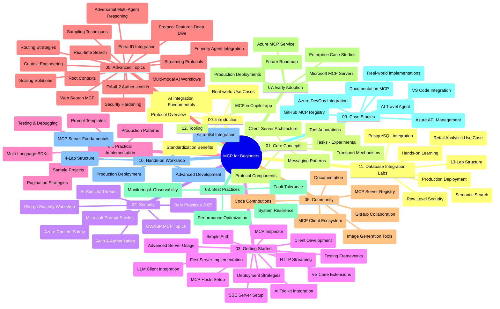

# Itifaki ya Muktadha wa Mfano (MCP) kwa Waanzilishi - Mwongozo wa Kusoma

Mwongozo huu wa kusoma unatoa muhtasari wa muundo wa hifadhidata na maudhui kwa mtaala wa "Itifaki ya Muktadha wa Mfano (MCP) kwa Waanzilishi". Tumia mwongozo huu kuvinjari hifadhidata kwa ufanisi na kufaidika zaidi na rasilimali zilizopo.

## Muhtasari wa Hifadhidata

Itifaki ya Muktadha wa Mfano (MCP) ni mfumo uliowekwa kwa muktadha wa mwingiliano kati ya mifano ya AI na programu za wateja. Mwanzo ilitumika na Anthropic, MCP sasa inasimamiwa na jamii kubwa ya MCP kupitia shirika rasmi la GitHub. Hifadhidata hii inatoa mtaala kamili yenye mifano ya vitendo ya msimbo kwa C#, Java, JavaScript, Python, na TypeScript, iliyoundwa kwa waendelezaji wa AI, wasanifu wa mifumo, na wahandisi wa programu.

## Ramani ya Mtaala kwa Maono

## Muundo wa Hifadhidata

Hifadhidata imepangwa katika sehemu kumi na mbili kuu, kila moja ikilenga maeneo tofauti ya MCP:

1. **Utangulizi (00-Introduction/)**
   - Muhtasari wa Itifaki ya Muktadha wa Mfano
   - Kwa nini kuweka viwango ni muhimu katika njia za AI
   - Matumizi halisi na faida

2. **Madhumuni Msingi (01-CoreConcepts/)**
   - Muundo wa mteja-mtumiaji (client-server)
   - Sehemu muhimu za itifaki
   - Mifumo ya ujumbe katika MCP
   - Maelezo ya sasa: [Nini Kilibadilika katika MCP: Maelezo ya 2026-07-28](./01-CoreConcepts/mcp-2026-07-28.md) — msingi wa itifaki isiyo na hali, mfumo wa Miongezeko, na kuondolewa kwa Mizizi/Sampling/Logging

3. **Usalama (02-Security/)**
   - Vitisho vya usalama katika mifumo ya MCP
   - Mbinu bora za kulinda utekelezaji
   - Mikakati ya uthibitishaji na ruhusa
   - Mfano wa vitendo wa [CIMD na ruhusa ya DCR](./02-Security/samples/cimd-dcr-auth/README.md)
   - **Nyaraka Kamili za Usalama**:
     - Mbinu Bora za Usalama za MCP
     - Mwongozo wa Utekelezaji wa Usalama wa Azure Content Safety
     - Udhibiti na Mbinu za Usalama za MCP
     - Marejeleo ya Haraka ya Mbinu Bora za MCP
   - **Mada Muhimu za Usalama**:
     - Mashambulizi ya usinjishaji wa agizo na sumu za vifaa
     - Uvunjifu wa kikao na matatizo ya mwakilishi mchanganyiko
     - Urahisishaji wa alama za kutambua (token)
     - Ruhusa za kupita kiasi na udhibiti wa upatikanaji
     - Usalama wa mnyororo wa usambazaji kwa vipengele vya AI
     - Muunganiko wa Kinga za Mashambulizi za Microsoft Prompt Shields

4. **Anza Kutumia (03-GettingStarted/)**
   - Usanidi wa mazingira na usanidi
   - Kuunda seva na wateja wa msingi wa MCP
   - Muungano na programu zilizopo
   - Inajumuisha sehemu za:
     - Utekelezaji wa seva ya kwanza
     - Maendeleo ya wateja
     - Muungano wa wateja wa LLM
     - Muungano wa VS Code
     - Seva ya Tukio zinazotumwa (SSE)
     - Matumizi ya seva ya hali ya juu
     - Uenezaji wa HTTP
     - Muungano wa Kikasha cha AI
     - Mikakati ya majaribio
     - Miongozo ya uenezwaji

5. **Utekelezaji wa Vitendo (04-PracticalImplementation/)**
   - Kutumia SDK katika lugha tofauti za programu
   - Mbinu za uchunguzi, majaribio, na uthibitisho
   - Kutengeneza templeti zinazoweza kutumika tena za maagizo na njia za kazi
   - Miradi ya mfano na mifano ya utekelezaji

6. **Mada za Juu (05-AdvancedTopics/)**
   - Mbinu za uhandisi wa muktadha
   - Muungano na wakala wa Foundry
   - Njia za kazi za AI yenye njia nyingi (multi-modal)
   - Maonyesho ya uthibitishaji wa OAuth2
   - Uwezo wa utafutaji wa wakati halisi
   - Uenezaji wa moja kwa moja (real-time streaming)
   - Utekelezaji wa muktadha wa Mizizi
   - Mikakati ya marudio (routing)
   - Mbinu za uchambuzi (sampling)
   - Mbinu za kupanua kasi
   - Masuala ya usalama
   - Muungano wa usalama wa Entra ID
   - Muungano wa utafutaji wa wavuti
   - Utafiti wa wabishani wa wawakilishi wengi (mifumo ya mijadala)

7. **Michango ya Jamii (06-CommunityContributions/)**
   - Jinsi ya kuchangia msimbo na nyaraka
   - Ushirikiano kupitia GitHub
   - Maboresho na maoni yanayoendeshwa na jamii
   - Matumizi ya wateja mbalimbali wa MCP (Claude Desktop, Cline, VSCode)
   - Kazi na seva maarufu za MCP ikiwa ni pamoja na uzalishaji wa picha

8. **Mafunzo ya Awali (07-LessonsfromEarlyAdoption/)**
   - Utekelezaji halisi na hadithi za mafanikio
   - Ujengo na uenezaji wa suluhisho za MCP
   - Mwelekeo na ramani ya mkondo wa baadaye
   - **Mwongozo wa Seva za Microsoft MCP**: Mwongozo kamili wa seva 10 za Microsoft MCP zinazotumika kiuzalishaji zikiwemo:
     - Seva ya MCP ya Microsoft Learn Docs
     - Seva ya MCP ya Azure (viunganishi 15+ maalum)
     - Seva ya MCP ya GitHub
     - Seva ya MCP ya Azure DevOps
     - Seva ya MCP ya MarkItDown
     - Seva ya MCP ya SQL Server
     - Seva ya MCP ya Playwright
     - Seva ya MCP ya Dev Box
     - Seva ya MCP ya Microsoft Foundry
     - Seva ya MCP ya Microsoft 365 Agents Toolkit

9. **Mbinu Bora (08-BestPractices/)**
   - Urekebishaji wa utendaji na uboreshaji
   - Kubuni mifumo ya MCP isiyovunjika
   - Mikakati ya majaribio na uimara

10. **Mifano ya Kesi (09-CaseStudy/)**
    - **Mifano saba kamili ya kesi** inayoonyesha ufanisi wa MCP katika matukio mbalimbali:
    - **Wakala wa Usafiri wa Azure AI**: Usimamizi wa wawakilishi wengi kwa Azure OpenAI na AI Search
    - **Muungano wa Azure DevOps**: Kuendesha mizunguko ya kazi kwa otomatiki kwa masasisho ya data ya YouTube
    - **Upataji wa Nyaraka wa Wakati Halisi**: Mteja wa dirisha la Python na uenezaji wa HTTP
    - **Kizalishaji cha Mpango wa Masomo wa Kituo**: Tovuti ya Chainlit yenye AI ya mazungumzo
    - **Nyaraka Ndani ya Mhariri**: Muungano wa VS Code na mizunguko ya GitHub Copilot
    - **Usimamizi wa API wa Azure**: Muungano wa API wa biashara na uundaji seva ya MCP
    - **Usajili wa MCP wa GitHub**: Maendeleo ya mazingira na jukwaa la muungano wa wakala
    - Mifano ya utekelezaji inayogusa muungano wa biashara, uzalishaji wa waendelezaji, na maendeleo ya mazingira

11. **Warsha ya Vitendo (10-StreamliningAIWorkflowsBuildingAnMCPServerWithAIToolkit/)**
    - Warsha kamili ya vitendo inayochanganya MCP na Kikasha cha AI
    - Kujenga programu mahiri zinazounganisha mifano ya AI na zana za dunia halisi
    - Moduli za vitendo zinazoelezea misingi, maendeleo ya seva za kawaida, na mikakati ya uenezaji viwandani
    - **Muundo wa Maabara**:
      - Maabara 1: Misingi ya Seva ya MCP
      - Maabara 2: Maendeleo ya Seva ya MCP ya Juu
      - Maabara 3: Muungano wa Kikasha cha AI
      - Maabara 4: Ueneaji na Upanuzi wa Kiwanda
    - Mbinu ya kujifunza kwa maabara kwa maelekezo taratibu

12. **Maabara ya Muungano wa Hifadhidata za Seva za MCP (11-MCPServerHandsOnLabs/)**
    - **Njia ya kujifunza ya maabara 13 kamili** kwa kujenga seva za MCP zinazotumika viwandani zenye muungano wa PostgreSQL
    - **Utekelezaji halisi wa uchambuzi wa rejareja** kwa kutumia kesi ya matumizi ya Zava Retail
    - **Mifumo ya daraja la biashara** ikijumuisha Usalama wa Kiwango cha Safu (RLS), utafutaji wa maana, na upatikanaji wa data ya wamiliki wengi
    - **Muundo Kamili wa Maabara**:
      - **Maabara 00-03: Misingi** - Utangulizi, Usanifu, Usalama, Usanidi wa Mazingira
      - **Maabara 04-06: Kujenga Seva ya MCP** - Ubunifu wa Hifadhidata, Utekelezaji wa Seva ya MCP, Maendeleo ya Zana

      - **Maabara 07-09: Vipengele vya Juu** - Utafutaji wa Semantiki, Upimaji & Utatuzi wa Hitilafu, Muunganisho wa VS Code
      - **Maabara 10-12: Uzalishaji & Mazoezi Bora** - Ueneaji, Ufuatiliaji, Uboreshaji
    - **Teknolojia Zilizofunikwa**: Mfumo wa FastMCP, PostgreSQL, Azure OpenAI, Azure Container Apps, Application Insights
    - **Matokeo ya Kujifunza**: Seva za MCP tayari kwa uzalishaji, mifumo ya muunganisho wa hifadhidata, uchambuzi unaotumia AI, usalama wa shirika

13. **Vifaa (12-tooling/)**
    - Jifunze jinsi ya kutumia MCP katika programu ya Copilot na zana nyingine

## Vyanzo Zaidi

Hifadhi ina vyanzo vya msaada:

- **Folda ya Picha**: Inajumuisha michoro na vielezi vinavyotumika katika mtaala mzima
- **Tafsiri**: Msaada wa lugha nyingi kwa tafsiri za moja kwa moja za nyaraka
- **Vyanzo Rasmi vya MCP**:
  - [Nyaraka za MCP](https://modelcontextprotocol.io/)
  - [Maelezo ya MCP](https://modelcontextprotocol.io/specification/2026-07-28/)
  - [Hifadhi ya MCP GitHub](https://github.com/modelcontextprotocol)

## Jinsi ya Kutumia Hifadhi Hii

1. **Kujifunza kwa Mfuatano**: Fuata sura kwa mpangilio (00 hadi 11) kwa uzoefu wa kujifunza uliopangwa.
2. **Mzingatio wa Lugha Mahsusi**: Ikiwa una nia ya lugha fulani ya programu, angalia folda za mifano kwa utekelezaji katika lugha unayopendelea.
3. **Utekelezaji wa Kivitendo**: Anza na sehemu ya "Kuanzia" kuweka mazingira yako na kuunda seva na mteja wako wa MCP wa kwanza.
4. **Uchunguzi wa Juu**: Ukijisikiliza vizuri na misingi, chora juu ya mada za juu ili kuongeza ujuzi wako.
5. **Shiriki Jamii**: Jiunge na jumuiya ya MCP kupitia mijadala ya GitHub na vituo vya Discord kuungana na wataalamu na waendelezaji wenza.

## Wateja wa MCP na Vifaa

Mtaala unafunika wateja na zana mbalimbali za MCP:

1. **Wateja Rasmi**:
   - Visual Studio Code 
   - MCP katika Visual Studio Code
   - Claude Desktop
   - Claude katika VSCode 
   - API ya Claude

2. **Wateja wa Jamii**:
   - Cline (inayotumia terminal)
   - Cursor (mhariri wa msimbo)
   - ChatMCP
   - Windsurf

3. **Vifaa vya Usimamizi wa MCP**:
   - MCP CLI
   - Meneja wa MCP
   - MCP Linker
   - MCP Router

## Seva Maarufu za MCP

Hifadhi inatambulisha seva mbalimbali za MCP, zikiwemo:

1. **Seva Rasmi za Microsoft MCP**:
   - Seva ya Nyaraka za Microsoft Learn MCP
   - Seva ya Azure MCP (vinyang'anyiro 15+ maalum)
   - Seva ya GitHub MCP
   - Seva ya Azure DevOps MCP
   - Seva ya MarkItDown MCP
   - Seva ya SQL Server MCP
   - Seva ya Playwright MCP
   - Seva ya Dev Box MCP
   - Seva ya Microsoft Foundry MCP
   - Seva ya Microsoft 365 Agents Toolkit MCP

2. **Seva za Marejeleo Rasmi**:
   - Mfumo wa Faili
   - Fetch
   - Kumbukumbu
   - Fikiria Mfuatano

3. **Uundaji wa Picha**:
   - Azure OpenAI DALL-E 3
   - Stable Diffusion WebUI
   - Replicate

4. **Vifaa vya Maendeleo**:
   - Git MCP
   - Udhibiti wa Terminal
   - Msaidizi wa Msimbo

5. **Seva Maalum**:
   - Salesforce
   - Microsoft Teams
   - Jira & Confluence

## Kuchangia

Hifadhi hii inakaribisha michango kutoka kwa jamii. Angalia sehemu ya Michango ya Jamii kwa mwongozo wa jinsi ya kuchangia kwa ufanisi katika mfumo wa MCP.

----

*Mwongozo huu wa masomo ulisasishwa mwisho tarehe 9 Septemba 2026. Unaakisi MCP
Maelezo `2026-07-28`, marekebisho ya sasa ya itifaki. Mifano kadhaa ya vitendo bado ina toleo
maalum la `2025-11-25` wakati SDK zao na zana
zinatumia API zisizo na jimbo za itifaki.*

---

<!-- CO-OP TRANSLATOR DISCLAIMER START -->
**Kionyozo**:
Hati hii imetafsiriwa kwa kutumia huduma ya tafsiri ya AI [Co-op Translator](https://github.com/Azure/co-op-translator). Ingawa tunajitahidi kupata usahihi, tafadhali fahamu kwamba tafsiri za kiotomatiki zinaweza kuwa na makosa au upungufu wa usahihi. Hati ya asili katika lugha yake halisi inapaswa kuchukuliwa kama chanzo cha mamlaka. Kwa taarifa muhimu, tafsiri ya kitaalamu inayofanywa na binadamu inapendekezwa. Hatutojibu kwa kuelewa vibaya au tafsiri potofu zinazotokea kutokana na matumizi ya tafsiri hii.
<!-- CO-OP TRANSLATOR DISCLAIMER END -->