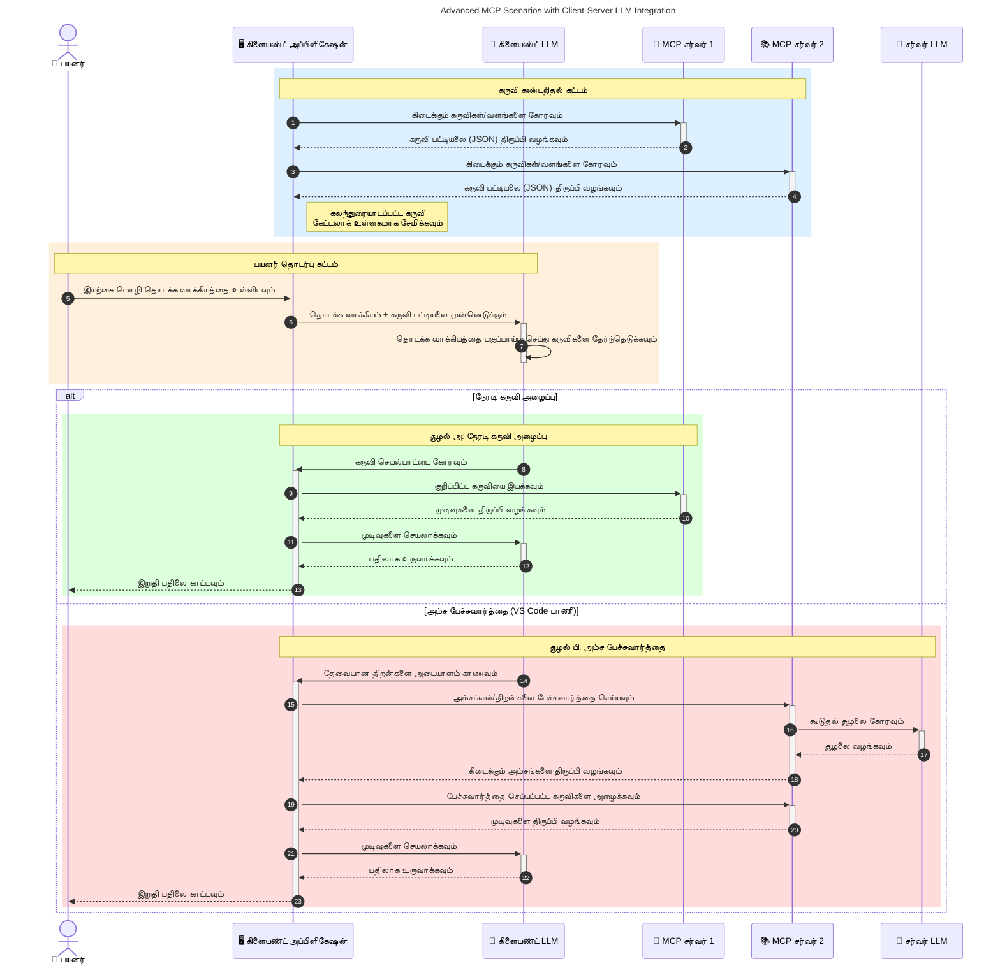

# மாடல்_CONTEXT_பிரொடோக்கால் (MCP) அறிமுகம்: அளவுகோலாக்கக்கூடிய AI பயன்பாடுகளுக்கு இது முக்கியமானது ஏன்

[](https://youtu.be/agBbdiOPLQA)

_(இந்த பாடத்தின் வீடியோவை பார்க்க மேலுள்ள படத்தை கிளிக் செய்யவும்)_

உருவாக்கும் AI பயன்பாடுகள் ஒரு நல்ல முன்னேற்றம் ஆகும், ஏனெனில் அவை பெரும்பாலும் இயல்பான மொழி கொடுப்பனவுகளை பயன்படுத்தி பயனாளரை செயலியில் இணைக்க அனுமதிக்கின்றன. எனினும், அதிக நேரம் மற்றும் வளங்கள் இத்தகைய செயலிகளுக்கு செலவிடப்படுகிறபோது, நீங்கள் செயலிகளின் செயல்பாடுகளையும் வளங்களையும் எளிதில் ஒருங்கிணைக்க முடியும் என்பதை உறுதி செய்ய விரும்புவீர்கள், மேலும் உங்கள் செயலி ஒன்றுக்கு மேலும் பல மாடல்கள் பயன்படுத்தப்படலாம் மற்றும் பல மாடல் சிக்கல்களை கையாள முடியும். சுருக்கமாக, Gen AI செயலிகளை உருவாக்குவது ஆரம்பத்தில் எளிதானது, ஆனால் அவை வளர்ந்துவைத்து மேலும் சிக்கலானதைப்போன்றது ஆகும்போது, ஒரு கட்டமைப்பினை வரையறுக்க ஆரம்பிக்க வேண்டும் மற்றும் உங்கள் செயலிகள் ஒரே விதமாக கட்டப்படுவதை உறுதி செய்ய ஒரு நிலையானக்கு நம்பிக்கை வைப்பது அவசியமாகும். இதன் மூலம் MCP தாக்குப்படுத்த ஒரு நிலையான முறையை வழங்குகிறது.

---

## **🔍 மாடல்_CONTEXT_பிரொடோக்கால் (MCP) என என்ன?**

**மாடல்_CONTEXT_பிரொடோக்கால் (MCP)** என்பது ஒரு **திறந்த, நிலையான இடைமுகம்** ஆகும், இது பெரிய மொழி மாடல்கள் (LLMs) வெளிப்புற கருவிகள், API-கள் மற்றும் தரவுகள் மூலங்களுடன் தடையின்றி தொடர்பு கொள்ள உதவுகிறது. இது AI மாடல் செயல்பாட்டை அவர்களின் பயிற்சி தரவுக்குப் பின்பற்றாமல் மேம்படுத்த துவக்க கட்டமைப்பை வழங்கி, புத்திசாலித்தன்மை, அளவுகோல் மற்றும் மிகுந்த பதிலளிக்கக்கூடிய AI அமைப்புகளை உருவாக்குகிறது.

---

## **🎯 AI-ல் நிலையானமைப்பு ஏன் முக்கியம்**

உருவாக்கும் AI செயலிகள் மேலும் சிக்கலானவையாக மாறும் போது, **அளவுகோல், விரிவாக்கம், பராமரிக்கக்கூடிய தன்மை** மற்றும் **விநியோகஸ்தர் பூட்டு தவிர்க்கும்** ஆகியவற்றை உறுதி செய்வதற்கான நிலையானங்களை ஏற்க வேண்டும். MCP இவை தேவைகளை பூர்த்தி செய்கிறது:

- மாடல்-கருவி ஒருங்கிணைப்புகளை ஒருங்கிணைத்தல்
- உடைந்துவிடும் தனிச்சிறப்புகள் குறைத்தல்
- பல்வேறு விநியோகஸ்தர்களிலிருந்து பல மாடல்கள் ஒரே சூழலில் சேர்ந்து இயங்கும் வகையில் அனுமதி

**குறிப்பு:** MCP தன்னை திறந்த நிலையானாக விளக்கியுள்ளாலும், IEEE, IETF, W3C, ISO அல்லது வேறு எந்த நிலையான அமைப்புகளும் MCP-ஐ நிலையானாக்க திட்டமிடவில்லை.

---

## **📚 கற்றல் குறிக்கோள்கள்**

இந்த கட்டுரையின் முடிவில், நீங்கள் என்ன செய்யக்கூடும்:

- **மாடல்_CONTEXT_பிரொடோக்கால் (MCP)** என்றால் என்ன மற்றும் அதன் பயன்பாடுகள் என்ன என்பதை வரையறுக்க
- MCP எப்படி மாடல்-கருவி தொடர்புகலை நிலையானாக்கின்றது என்பதை புரிந்துகொள்
- MCP கட்டமைப்பின் முக்கிய கூறுகளை அடையாளம் காண
- நிறுவன மற்றும் மேம்பாட்டு சூழல்களில் MCP-இன் நேர்மறை பயன்பாடுகளை ஆராய

---

## **💡 மாடல்_CONTEXT_பிரொடோக்கால் (MCP) எப்படி விளையாட்டை மாற்றும்**

### **🔗 MCP AI தொடர்புகளில் பிளவான தன்மையை தீர்க்கிறது**

MCP முன்பு, மாடல்களுடன் கருவிகளை ஒருங்கிணைப்பது தேவையானது:

- கருவி-மாடல் ஜோடி ஒன்றுக்கொருவர் தனிப்பட்ட குறியீடு எழுத்து
- ஒவ்வொரு தொழிலாளருக்கும் தனித்துவமான APIகள்
- புதுப்பிப்புகள் காரணமாக அடிக்கடி இடையூறுகள்
- மேலும் கருவிகளோடு மோசமான அளவுகோல்

### **✅ MCP நிலையானத்துவத்தின் நன்மைகள்**

| **நன்மை**              | **விளக்கம்**                                                                |
|--------------------------|------------------------------------------------------------------------------|
| ஒருங்கிணைவு         | LLMக்கள் வெவ்வேறு விநியோகஸ்தர்களின் கருவிகளோடு தடையின்றி செயல்படுகின்றன   |
| ஒருமைப்படுத்தல்       | தளங்களிலும் கருவிகளிலும் ஒரே மாதிரியான நடத்தை                                  |
| மீண்டும் பயன்படுத்தும் திறன்  | ஒருமுறை உருவாக்கப்பட்ட கருவிகள் பல திட்டங்களிலும் அமைப்புகளிலும் பயன்படுத்தக்கூடும்   |
| விரைவு மேம்பாடு        | நிலையான, உடனுக்குடன் அதிரடி இடைமுகங்களைக் கொண்டு மேம்பாட்டு நேரத்தை குறைக்கும்    |

---

## **🧱 உயர்தர MCP கட்டமைப்பு வரைபடம்**

MCP ஒரு **கிளையன்ட்-சர்வர் மாடல்** பின்பற்றுகிறது, அங்கு:

- **MCP ஹோஸ்ட்கள்** AI மாடல்களை இயக்குகின்றனர்
- **MCP கிளையன்ட்கள்** கோரிக்கைகளை தொடங்குகின்றனர்
- **MCP சர்வர்கள்** CONTEXT, கருவிகள் மற்றும் திறன்களை வழங்குகின்றனர்

### **முக்கிய கூறுகள்:**

- **வளங்கள்** – மாடல்களுக்கு நிலையான அல்லது இயக்கக தரவுகள்  
- **குறிப்புக்கள்** – வழிநடத்தப்பட்ட உருவாக்கத்துக்கான முன்கூட்டிய வேலைபாடுகள்  
- **கருவிகள்** – தேடல், கணக்கீடு போன்ற செயல்படும் செயலிகள்  
- **மாதிரிக் கணிப்புகள்** – ஆஜென்ட் முறையில் மேலெழுந்த அழைப்புகள் மூலம் நடப்பது (MCP `2026-07-28` இல் ஒருபடி வேறு; புதிய வடிவாக்கங்கள் நேரடியாக LLM வழங்கியாளருடன் இணைக்க வேண்டும்)  
  
 
- **அழைப்புகள்** – சர்வர் தொடங்கும் பயனர் உள்ளீடு கோரிக்கைகள்  
- **ரூட்டுகள்** – சர்வருக்கு தொடர்புடைய தகவல் கோப்பு அமைவிடம்  
    (MCP `2026-07-28` இல் பின்வாங்கப்பட்டது; கருவி அளவுருக்கள், வள URIகள் அல்லது சர்வர் கட்டமைப்பை முன்னுரிமையிடவும்)  


### **பிரொடோக்கால் கட்டமைப்பு:**

MCP இரண்டு அடுக்கு கட்டமைப்பைக் பயன்படுத்துகிறது:
- **தரவு அடுக்கு**: JSON-RPC 2.0 செய்திகள், கோரிக்கை தொடர்பான மெட்டா தரவு, கண்டறிதல் மற்றும் பிரதிமைகள்  
 
- **இடமாற்று அடுக்கு**: உள்ளூர் சப்-செயலிகளுக்கு stdio மற்றும் தொலைசேவை சர்வர்களுக்கு Streamable HTTP. Streamable HTTP SSE வழியாக பதில்களை ஸ்ட்ரீம் செய்ய முடியும், ஆனால் பழைய HTTP+SSE இடமாற்று பின்வாங்கப்பட்டுள்ளது.  
 
 

---

## MCP சர்வர்கள் எப்படி செயல்படுகின்றன

MCP சர்வர்கள் பின்வருமாறு செயல்படுகின்றன:

- **கோரிக்கை ஓட்டம்**:
    1. ஒரு கோரிக்கை இறுதி பயனர் அல்லது அவர behalf ஆக செயல்படும் மென்பொருள் மூலம் தொடங்கப்படுகிறது.
    2. **MCP கிளையன்ட்** ஒரு கோரிக்கையை **MCP ஹோஸ்டுக்கு** அனுப்புகிறது, இது AI மாடல் பயிற்சி சூழலை நிர்வகிக்கிறது.
    3. **AI மாடல்** பயனர் குறிப்பை பெறுகிறது மற்றும் வெளிப்புற கருவிகள் அல்லது தரவுக்கான அணுகலை ஒரு அல்லது பல கருவி அழைப்புகளின் மூலமாக கோரலாம்.
    4. **MCP ஹோஸ்ட்**, மாடல் நேரடியாக அல்ல, சரியான **MCP சர்வர்(களுடன்)** நிலையான போர்டோக்கால் மூலம் தொடர்புகொள்கிறது.
- **MCP ஹோஸ்ட் செயல்பாட்டுக்கள்**:
    - **கருவி பதிவேட்டை**: கிடைக்கும் கருவிகள் மற்றும் திறன்களின் பட்டியலை பராமரிக்கிறது.
    - **அங்கீகாரம்**: கருவி அணுகலில் அனுமதிகளை சரிபார்க்கிறது.
    - **கோரிக்கை நிர்வாகி**: மாடலிலிருந்து வரும் கருவி கோரிக்கைகளை செயலாக்குகிறது.
    - **பதிலளிப்பு வடிவமைப்பாளர்**: கருவி வெளியீடுகளை மாடல் புரிந்துகொள்ளும் வடிவத்தில் அமைக்கிறது.
- **MCP சர்வர் செயலாக்கம்**:
    - **MCP ஹோஸ்ட்** கருவி அழைப்புகளை ஒரே அல்லது பல **MCP சர்வர்களுக்கு** வழிமாற்றுகிறது, ஒவ்வும் சிறப்பான பணி செயல்களை (தேடல், கணக்கீடு, தரவுத்தள விசாரணை போன்றவை) வெளிப்படுத்துகிறது.
    - **MCP சர்வர்கள்** தமது செயல்பாடுகளை செய்து முடிவுகளை அடுக்கு வடிவில் MCP ஹோஸ்டுக்கு திருப்பி அனுப்புகின்றன.
    - **MCP ஹோஸ்ட்** இந்த முடிவுகளை வடிவமைத்து **AI மாடலுக்கு** வழங்குகிறது.
- **பதிலளிப்பு நிறைவு**:
    - **AI மாடல்** கருவி வெளியீடுகளை இறுதி பதிலில் இணைக்கிறது.
    - **MCP ஹோஸ்ட்** இந்த பதிலை **MCP கிளையன்ட்**க்கு அனுப்புகிறது, அது இறுதி பயனர் அல்லது அழைக்கும் மென்பொருளுக்கு வழங்குகிறது.

```mermaid
---
title: MCP Architecture and Component Interactions
description: A diagram showing the flows of the components in MCP.
---
graph TD
    Client[MCP கிளையண்ட்/பயன்பாடு] -->|கோரிக்கை அனுப்புகிறது| H[MCP ஹோஸ்ட்]
    H -->|அழைக்கிறது| A[செயற்கை நுண்ணறிவு மாதிரி]
    A -->|கருவி அழைப்பு கோரிக்கை| H
    H -->|MCP Protocol| T1[MCP Server Tool 01: வலை தேடல்]
    H -->|MCP Protocol| T2[MCP Server Tool 02: கணக்கீட்டுக் கருவி]
    H -->|MCP Protocol| T3[MCP Server Tool 03: தரவுத்தளம் அணுகல் கருவி]
    H -->|MCP Protocol| T4[MCP Server Tool 04: கோப்பு அமைப்பு கருவி]
    H -->|பதில் அனுப்புகிறது| Client

    subgraph "MCP ஹோஸ்ட் கூறுகள்"
        H
        G[கருவி பதிவு]
        I[அங்கீகாரம்]
        J[கோரிக்கை கையாளுபவர்]
        K[பதில் வடிவமைப்பாளர்]
    end

    H <--> G
    H <--> I
    H <--> J
    H <--> K

    style A fill:#f9d5e5,stroke:#333,stroke-width:2px
    style H fill:#eeeeee,stroke:#333,stroke-width:2px
    style Client fill:#d5e8f9,stroke:#333,stroke-width:2px
    style G fill:#fffbe6,stroke:#333,stroke-width:1px
    style I fill:#fffbe6,stroke:#333,stroke-width:1px
    style J fill:#fffbe6,stroke:#333,stroke-width:1px
    style K fill:#fffbe6,stroke:#333,stroke-width:1px
    style T1 fill:#c2f0c2,stroke:#333,stroke-width:1px
    style T2 fill:#c2f0c2,stroke:#333,stroke-width:1px
    style T3 fill:#c2f0c2,stroke:#333,stroke-width:1px
    style T4 fill:#c2f0c2,stroke:#333,stroke-width:1px
```
    



## 👨‍💻 MCP சர்வர் எப்படி கட்டுவது (உதாரணங்களுடன்)

MCP சர்வர்கள் LLM திறன்களை விரிவுபடுத்த தரவு மற்றும் செயல்பாட்டை வழங்க அனுமதிக்கின்றன. 

முயற்சி செய்ய தயாரா? வெவ்வேறு மொழிகள்/சங்கிலிகள் கொண்ட உதாரண MCP சர்வர்கள் உருவாக்க SDKகள் இங்கே:

- **Python SDK**: https://github.com/modelcontextprotocol/python-sdk

- **TypeScript SDK**: https://github.com/modelcontextprotocol/typescript-sdk

- **Java SDK**: https://github.com/modelcontextprotocol/java-sdk

- **C#/.NET SDK**: https://github.com/modelcontextprotocol/csharp-sdk


## 🌍 MCP-க்கு யாரும் பயன்படுத்தும் சூழல்கள்

MCP AI திறன்களை விரிவுபடுத்த பரபரப்பான பயன்பாடுகளை அனுமதிக்கிறது:

| **பயன்பாடு**              | **விளக்கம்**                                                               |
|------------------------------|-----------------------------------------------------------------------------|
| நிறுவன தரவு ஒருங்கிணைவு    | LLMகளை தரவுத்தளங்கள், CRMகள், அல்லது உள்ளக கருவிகளுக்கு இணைக்கிறது         |
| ஆஜென்ட் AI அமைப்புகள்        | கருவி அணுகல் மற்றும் முடிவெடுக்கல் வேலைப்பாடுகளோடு சுயசார்ந்த முகவர்கள்       |
| பலவகை செயலிகள்           | எழுத்து, படம், ஒலி கருவிகளை ஒரே AI செயலியில் இணைத்தல்                      |
| நேரடி தரவு ஒருங்கிணைவு      | AI தொடர்புகளில் நேரடி தரவை கொண்டு வந்து துல்லியமான, இன்றைய வெளியீடுகளை வழங்குகிறது |


### 🧠 MCP = AI தொடர்புகளுக்கு உலகளாவிய நிலையானமுறை

மாடல்_CONTEXT_பிரொடோக்கால் (MCP) USB-C-உம் போன்ற உலகளாவிய நிலையானமாக AI தொடர்புக்கு செயல்படுகிறது. AI உலகத்தில் MCP மாதிரிகள் (கிளையன்ட்கள்) வெளிப்புற கருவிகள் மற்றும் தரவு வழங்குநர்களுடன் (சர்வர்கள்) தடையின்றி இணைக்க வழிகாட்டுகிறது. இது ஒவ்வொரு API அல்லது தரவு மூலத்திலும் பல்வேறு தனிப்பட்ட புரொடோக்கால்களின் தேவையை நீக்குகிறது.

MCP உட்பட MCP-ஐ வரைபடமாக்கும் கருவி (MCP சர்வர் என்று அழைக்கப்படுகிறது) ஒருங்கிணைந்த நிலையானதை பின்பற்றுகிறது. இந்த சர்வர்கள் வழங்கும் கருவிகள் அல்லது நடவடிக்கைகளை பட்டியலிட்டு அவற்றை AI முகவாளரால் வேண்டியபோது இயக்க முடியும். MCP ஆதரவு கொண்ட AI முகவாளி தளங்கள் சர்வர்களிலிருந்து கிடைக்கும் கருவிகளை கண்டுபிடித்து இந்த நிலையான புரொடோக்காலின் மூலம் அழைக்க முடியும்.

### 💡 அறிவிற்கு அணுகலை சாத்தியம் செய்கிறது

கருவிகள் மட்டுமின்றி MCP அறிவிற்கு அணுகலைவும் சாத்தியம் செய்கிறது. பெரிய மொழி மாடல்களுக்கு (LLMs) சூழலை வழங்க பல்வேறு தரவு மூலங்களுடன் இணைக்க பயன்பாடுகளுக்கு உதவுகிறது. உதாரணமாக, MCP சர்வர் ஒரு நிறுவனத்தின் ஆவணக் காதகமாக அமையலாம், அங்கு முகவர்கள் தேவையான தகவலை அவசரமின்றி பெற முடியும். மற்றொரு சர்வர் மின்னஞ்சல் அனுப்புதல் அல்லது பதிவுகளை புதுப்பித்தல் போன்ற குறிப்பிட்ட நடவடிக்கைகளை கையாளலாம். முகவாளரின் பார்வையில், இவை வலுவான கருவிகள்; சில கருவிகள் தரவு (அறிவு சூழல்) வழங்குகின்றன, மற்றவை நடவடிக்கைகள் செய்கின்றன. MCP இரண்டையும் திறம்பட கையாள்கிறது.

ஒரு முகவர் MCP சர்வருடன் இணைந்தவுடன் அந்த சர்வரின் கிடைக்கும் திறன்களையும் அணுகக்கூடிய தரவுகளையும் ஒரு நிலையான வடிவில் தானாக கற்கிறது. இந்த நிலையானமைப்பு கருவி கிடைமையும் மாற்றும் திறனையும் வழங்குகிறது. உதாரணமாக, ஒரு புதிய MCP சர்வரை ஒரு முகவர் அமைப்பில் சேர்ப்பது, அதன் செயல்பாடுகளை உடனடியாக பயன்படுத்தக்கூடியவையாக மாற்றுகிறது, முகவரின் வழிமுறைகளை மேலும் மாற்ற வேண்டாம்.

இந்த எளிமைப்படுத்தப்பட்ட ஒருங்கிணைவு கீழ்க்காணும் வரைபடத்தில் காட்டப்படுவது போல சர்வர்கள் கருவிகள் மற்றும் அறிவையும் வழங்கி, அமைப்புகளுக்கிடையே தடையற்ற ஒத்துழைப்பு கிடைக்க செய்கிறது.

### 👉 உதாரணம்: அளவுகோலான முகவர் தீர்வு

```mermaid
---
title: Scalable Agent Solution with MCP
description: A diagram illustrating how a user interacts with an LLM that connects to multiple MCP servers, with each server providing both knowledge and tools, creating a scalable AI system architecture
---
graph TD
    User -->|கூற்று| LLM
    LLM -->|பதில்| User
    LLM -->|MCP| ServerA
    LLM -->|MCP| ServerB
    ServerA -->|பொதுவான இணைப்பி| ServerB
    ServerA --> KnowledgeA
    ServerA --> ToolsA
    ServerB --> KnowledgeB
    ServerB --> ToolsB

    subgraph சேவையக A
        KnowledgeA[அறிவு]
        ToolsA[கருவிகள்]
    end

    subgraph சேவையக B
        KnowledgeB[அறிவு]
        ToolsB[கருவிகள்]
    end
```
 யுனிவர்சல் கனெக்டர் MCP சர்வர்களுக்கிடையே தொடர்பு வைத்து திறன்களை பகிர அனுமதிக்கிறது, இதனால் ServerA ServerB க்கு பணிகளை ஒப்படைக்கலாம் அல்லது அதன் கருவிகள் மற்றும் அறிவை அணுகலாம். இது சர்வரோடு கருவிகள் மற்றும் தரவை பகிர்ந்து அளவுகோலான மற்றும் தொகுதியான முகவர் கட்டமைப்புகளுக்கு ஆதரவு தருகிறது. MCP கருவி வெளிப்பாடுகளை நிலையானமாக்குவதால், முகவர்கள் சர்வர்களுக்கிடையே கோரிக்கைகளை தானாக கண்டுபிடித்து வழிசெலுத்த முடியும், கடின ஒருங்கிணைப்புகள் தேவையில்லை.


கருவி மற்றும் அறிவு பகிர்வு: கருவிகளும் தரவுகளும்த் சர்வர்களுக்குள் பகிரப்பட்டு, மேலும் அளவுகோலான மற்றும் தொகுதியான முகவர் கட்டமைப்புகளை செயல் படுத்துகிறது.

### 🔄 மேம்பட்ட MCP சூழல்கள்: கிளையன்ட்-பக்கம் LLM ஒருங்கிணைப்பு

அடிப்படையிலான MCP கட்டமைப்புக்கு மேலாக, கிளையன்ட் மற்றும் சர்வர் இரண்டிலும் LLMக்கள் இருக்கின்ற வர்த்தகங்கள் உள்ளன, மேலும் மேம்பட்ட தொடர்புகளை உருவாக்குகின்றன. கீழ்க்காணும் வரைபடத்தில், **கிளையன்ட் செயலி** ஒரு IDE ஆக இருக்கலாம், அங்கே பல MCP கருவிகள் LLM-ன் பயனுக்காக கிடைக்கின்றன:



## 🔐 MCP-இன் நடைமுறை நன்மைகள்

MCP பயன்படுத்துவதன் நடைமுறை நன்மைகள் இவை:

- **புதிய தகவல்**: மாடல்கள் பயிற்சி தரவுக்கு மேலாக சமீபத்திய தகவலை அணுக முடியும்
- **திறன்கள் விரிவு**: மாடல்கள் பயிற்சி பெறாத பணிகளுக்கான சிறப்பு கருவிகளை பயன்படுத்த முடியும்
- **கற்பனைகள் குறைவு**: வெளிப்புற தரவுகள் உண்மை நிலையை வழங்குகின்றன
- **தனியுரிமை**: உணர்திகழாய தரவுகள் கோருப்புகளில் அடங்காமல் பாதுகாப்பான சூழலில் இருக்கலாம்

## 📌 முக்கியக் குறிப்புகள்

MCP பயன்படுத்துவதற்கான முக்கியக் குறிப்புகள்:

- **MCP** AI மாடல்கள் கருவிகளுடன் மற்றும் தரவுகளோடு தொடர்புகொள்வதை ஒருமைப்படுத்துகிறது
- **விரிவாக்கம், ஒருமைப்படுத்தல் மற்றும் ஒருங்கிணைவு** ஆகியவற்றை ஊக்குவிக்கிறது
- MCP மேம்பாட்டு நேரத்தை குறைத்து, நம்பகத்தன்மையை மேம்படுத்தி, மாடல் திறன்களை விரிவாக்க உதவுகிறது
- கிளையன்ட்-சர்வர் கட்டமைப்பு **நிர்வகிக்கக்கூடிய, விரிவாக்கக்கூடிய AI செயலிகளை அமல் படுத்த உதவுகிறது**

## 🧠 பயிற்சி

நீங்கள் உருவாக்க நினைக்கும் AI பயன்பாட்டைப் பற்றி யோசிக்கவும்.

- அதை மேம்படுத்த **எந்த வெளிப்புற கருவிகள் அல்லது தரவு** பயன்படும்?
- MCP ஒருங்கிணைப்பை எப்படி **சுலபமாகவும் நம்பகமானதாகவும்** செய்கிறது?

## கூடுதல் வளங்கள்

- [MCP GitHub சேமிப்பக](https://github.com/modelcontextprotocol)


## அடுத்து என்ன

அடுத்து: [அத்தியாயம் 1: முக்கிய கருத்துகள்](../01-CoreConcepts/README.md)

---

<!-- CO-OP TRANSLATOR DISCLAIMER START -->
**மறுப்பு**:
இந்த ஆவணம் AI மொழிபெயர்ப்பு சேவை [Co-op Translator](https://github.com/Azure/co-op-translator) பயன்படுத்தி மொழிபெயர்க்கப்பட்டுள்ளது. நாங்கள் துல்லியத்திற்காக முயற்சி செய்துள்ளோம், ஆனால் தானாக செய்யப்படும் மொழிபெயர்ப்புகளில் பிழைகள் அல்லது தவறுகள் இருக்கலாம் என்பதை கவனத்தில் கொள்ளவும். அசல் ஆவணம் அதன் தாய்மொழியில் அதிகாரப்பூர்வ ஆதாரமாக கருதப்பட வேண்டும். முக்கியமான தகவல்களுக்கு, தொழில்நுட்பமான மனித மொழிபெயர்ப்பு பரிந்துரைக்கப்படுகிறது. இந்த மொழிபெயர்ப்பைப் பயன்படுத்துவதால் ஏற்படும் எந்த தவறான புரிதல்கள் அல்லது தவறான விளக்கத்திற்கும் நாங்கள் பொறுப்பில்வில்லை.
<!-- CO-OP TRANSLATOR DISCLAIMER END -->