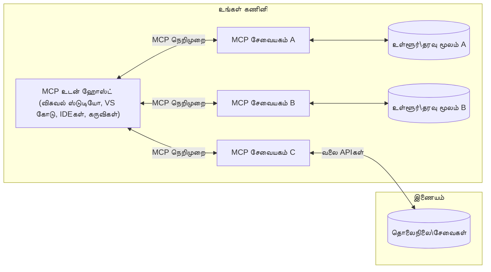

# MCP கோர் கருத்துக்கள்: AI ஒருங்கிணைப்புக்கான மாடல் சூழல் நெறிமுறை (Model Context Protocol) கற்றல்

[](https://youtu.be/earDzWGtE84)

_(இந்த பாடத்தின் வீடியோவை பார்க்க மேலே உள்ள படத்தை கிளிக் செய்யவும்)_

[Model Context Protocol (MCP)](https://github.com/modelcontextprotocol) என்பது பெரிய மொழி மாதிரிகள் (LLMs) மற்றும் வெளிப்புற கருவிகள், பயன்பாடுகள் மற்றும் தரவுத் தளங்களுக்கிடையேயான தொடர்பை மேம்படுத்தும் சக்திவாய்ந்த, தரநிலைப்படுத்தப்பட்ட கட்டமைப்பு ஆகும்.  
இந்த வழிகாட்டி MCP இன் முக்கிய கருத்துக்களை உங்களுக்கு அறிமுகப்படுத்தும். அதன் கிளையன்ட்-சர்வர் கட்டமைப்பு, அவசியமான கூறுகள், தொடர்பு இயந்திரங்கள் மற்றும் செயல்படுத்தும் சிறந்த நடைமுறைகள் பற்றி நீங்கள் கற்றுக்கொள்ளப்போகிறீர்கள்.

- **தெளிவான பயனர் ஒப்புதல்**: அனைத்து தரவு அணுகல் மற்றும் செயல்பாடுகளும் செயல்படுத்துவதற்கு முன் தெளிவான பயனர் அனுமதியை தேவைப்படுத்தும். பயனர்கள் எந்த தரவு அணுகப்படும் மற்றும் எந்த நடவடிக்கைகள் மேற்கொள்ளப்படும் என்பதை தெளிவாக புரிந்துகொள்ள வேண்டும், அனுமதிகள் மற்றும் அங்கீகாரங்களை நுணுக்கமாக கட்டுப்படுத்த வேண்டும்.

- **தரவு தனியுரிமை பாதுகாப்பு**: பயனர் தரவு தெளிவான ஒப்புதலுடன் மட்டுமே வெளிப்படுத்தப்பட வேண்டும் மற்றும் முழு தொடர்பு வாழ்நாளில் வலுவான அணுகல் கட்டுப்பாடுகளால் பாதுகாக்கப்பட வேண்டும். செயல்படுத்தல்கள் அனுமதியற்ற தரவு பரிமாற்றத்தை தடுக்கும் மற்றும் கடுமையான தனியுரிமை எல்லைகளை பராமரிக்கும்.

- **கருவி செயல்படுத்தல் பாதுகாப்பு**: ஒவ்வொரு கருவி அழைப்பும் கருவியின் செயல்பாடு, அளவுருக்கள் மற்றும் சாத்தியமான தாக்கம் பற்றி தெளிவான புரிதலுடன் தெளிவான பயனர் ஒப்புதலை தேவைப்படுத்தும். வலுவான பாதுகாப்பு எல்லைகள் தவறான, பாதுகாப்பற்ற அல்லது தீய கருவி செயல்படுத்தலை தடுக்கும்.

- **பரிமாற்ற அடுக்கு பாதுகாப்பு**: அனைத்து தொடர்பு சேனல்களும் பொருத்தமான குறியாக்கம் மற்றும் அங்கீகார முறைகளை பயன்படுத்த வேண்டும். தொலைதூர இணைப்புகள் பாதுகாப்பான பரிமாற்ற நெறிமுறைகள் மற்றும் சரியான அங்கீகார மேலாண்மையை செயல்படுத்த வேண்டும்.

#### செயல்படுத்தல் வழிகாட்டிகள்:

- **அனுமதி மேலாண்மை**: பயனர்கள் எந்த சர்வர்கள், கருவிகள் மற்றும் வளங்கள் அணுகக்கூடியவை என்பதை நுணுக்கமாக கட்டுப்படுத்தும் அனுமதி அமைப்புகளை செயல்படுத்தவும்  
- **அங்கீகாரம் மற்றும் அங்கீகாரம்**: பாதுகாப்பான அங்கீகார முறைகள் (OAuth, API விசைகள்) மற்றும் சரியான டோக்கன் மேலாண்மை மற்றும் காலாவதியாகும் காலத்துடன் பயன்படுத்தவும்  
- **உள்ளீடு சரிபார்ப்பு**: ஊடுருவல் தாக்குதல்களைத் தடுக்கும் வகையில் அனைத்து அளவுருக்கள் மற்றும் தரவு உள்ளீடுகளையும் வரையறுக்கப்பட்ட திட்டங்களின்படி சரிபார்க்கவும்  
- **ஆடிட் பதிவு**: பாதுகாப்பு கண்காணிப்பு மற்றும் ஒத்துழைப்பு நோக்கங்களுக்காக அனைத்து செயல்பாடுகளின் விரிவான பதிவுகளை பராமரிக்கவும்

## கண்ணோட்டம்

இந்த பாடம் Model Context Protocol (MCP) சூழல் அமைப்பின் அடிப்படை கட்டமைப்பு மற்றும் கூறுகளை ஆராய்கிறது. MCP தொடர்புகளை இயக்கும் கிளையன்ட்-சர்வர் கட்டமைப்பு, முக்கிய கூறுகள் மற்றும் தொடர்பு இயந்திரங்களை நீங்கள் கற்றுக்கொள்ளப்போகிறீர்கள்.

## முக்கிய கற்றல் நோக்கங்கள்

இந்த பாடத்தின் முடிவில், நீங்கள்:

- MCP கிளையன்ட்-சர்வர் கட்டமைப்பை புரிந்துகொள்ளுவீர்கள்.  
- ஹோஸ்ட்கள், கிளையன்ட்கள் மற்றும் சர்வர்களின் பங்கு மற்றும் பொறுப்புகளை அடையாளம் காண்பீர்கள்.  
- MCP ஐ ஒரு நெகிழ்வான ஒருங்கிணைப்பு அடுக்கு ஆக்குகின்ற முக்கிய அம்சங்களை பகுப்பாய்வு செய்வீர்கள்.  
- MCP சூழலில் தகவல் எப்படி ஓடுகிறது என்பதை கற்றுக்கொள்வீர்கள்.  
- .NET, ஜாவா, பைதான் மற்றும் ஜாவாஸ்கிரிப்ட் ஆகிய மொழிகளில் குறியீடு உதாரணங்களின் மூலம் நடைமுறை அறிவைப் பெறுவீர்கள்.

## MCP கட்டமைப்பு: ஆழமான பார்வை

MCP சூழல் ஒரு கிளையன்ட்-சர்வர் மாதிரியில் கட்டமைக்கப்பட்டுள்ளது. இந்த தொகுதி அமைப்பு AI பயன்பாடுகள் கருவிகள், தரவுத்தளங்கள், APIகள் மற்றும் சூழல் வளங்களுடன் திறம்பட தொடர்பு கொள்ள உதவுகிறது. இந்த கட்டமைப்பை அதன் முக்கிய கூறுகளாக பிரிப்போம்.

அதன் அடிப்படையில், MCP ஒரு கிளையன்ட்-சர்வர் கட்டமைப்பை பின்பற்றுகிறது, இதில் ஒரு ஹோஸ்ட் பயன்பாடு பல சர்வர்களுடன் இணைக்க முடியும்:


- **MCP ஹோஸ்ட்கள்**: VSCode, Claude Desktop, IDEகள் அல்லது MCP மூலம் தரவை அணுக விரும்பும் AI கருவிகள் போன்ற நிகழ்ச்சிகள்  
- **MCP கிளையன்ட்கள்**: சர்வர்களுடன் 1:1 இணைப்புகளை பராமரிக்கும் நெறிமுறை கிளையன்ட்கள்  
- **MCP சர்வர்கள்**: ஒவ்வொரு சர்வரும் தரநிலைப்படுத்தப்பட்ட Model Context Protocol மூலம் குறிப்பிட்ட திறன்களை வெளிப்படுத்தும் எளிய நிகழ்ச்சிகள்  
- **உள்ளூர் தரவு மூலங்கள்**: உங்கள் கணினியின் கோப்புகள், தரவுத்தளங்கள் மற்றும் MCP சர்வர்கள் பாதுகாப்பாக அணுகக்கூடிய சேவைகள்  
- **தொலை சேவைகள்**: இணையத்தின் மூலம் கிடைக்கும் வெளிப்புற அமைப்புகள், MCP சர்வர்கள் APIகளின் மூலம் இணைக்கக்கூடியவை.

MCP நெறிமுறை ஒரு வளர்ந்து வரும் தரநிலை ஆகும், இது தேதி அடிப்படையிலான பதிப்பு (YYYY-MM-DD வடிவம்) பயன்படுத்துகிறது. தற்போதைய நெறிமுறை பதிப்பு **2025-11-25** ஆகும். [நெறிமுறை விவரக்குறிப்பு](https://modelcontextprotocol.io/specification/2025-11-25/) இல் சமீபத்திய புதுப்பிப்புகளை நீங்கள் பார்க்கலாம்.

### 1. ஹோஸ்ட்கள்

Model Context Protocol (MCP) இல், **ஹோஸ்ட்கள்** என்பது பயனர்கள் நெறிமுறையுடன் தொடர்பு கொள்ளும் முதன்மை இடைமுகமாக செயல்படும் AI பயன்பாடுகள் ஆகும். ஹோஸ்ட்கள் பல MCP சர்வர்களுடன் இணைப்புகளை ஒருங்கிணைத்து நிர்வகிக்க MCP கிளையன்ட்களை ஒவ்வொரு சர்வர் இணைப்புக்கும் தனித்தனியாக உருவாக்குகின்றன. ஹோஸ்ட்களின் உதாரணங்கள்:

- **AI பயன்பாடுகள்**: Claude Desktop, Visual Studio Code, Claude Code  
- **வளர்ச்சி சூழல்கள்**: MCP ஒருங்கிணைப்புடன் IDEகள் மற்றும் குறியீடு தொகுப்பிகள்  
- **தனிப்பயன் பயன்பாடுகள்**: நோக்கத்திற்கேற்ற AI முகவர்கள் மற்றும் கருவிகள்

**ஹோஸ்ட்கள்** AI மாதிரி தொடர்புகளை ஒருங்கிணைக்கும் பயன்பாடுகள் ஆகும். அவை:

- **AI மாதிரிகளை ஒருங்கிணைக்கின்றன**: பதில்களை உருவாக்க LLMகளை இயக்க அல்லது தொடர்பு கொள்கின்றன மற்றும் AI பணிகள் ஒருங்கிணைக்கின்றன  
- **கிளையன்ட் இணைப்புகளை நிர்வகிக்கின்றன**: ஒவ்வொரு MCP சர்வர் இணைப்புக்கும் ஒரு MCP கிளையன்டை உருவாக்கி பராமரிக்கின்றன  
- **பயனர் இடைமுகத்தை கட்டுப்படுத்துகின்றன**: உரையாடல் ஓட்டம், பயனர் தொடர்புகள் மற்றும் பதிலளிப்பு கையாள்கின்றன  
- **பாதுகாப்பை அமல்படுத்துகின்றன**: அனுமதிகள், பாதுகாப்பு கட்டுப்பாடுகள் மற்றும் அங்கீகாரத்தை கட்டுப்படுத்துகின்றன  
- **பயனர் ஒப்புதலை கையாள்கின்றன**: தரவு பகிர்வு மற்றும் கருவி செயல்படுத்தலுக்கான பயனர் அனுமதியை நிர்வகிக்கின்றன

### 2. கிளையன்ட்கள்

**கிளையன்ட்கள்** என்பது ஹோஸ்ட்கள் மற்றும் MCP சர்வர்களுக்கு இடையில் தனித்தனியான 1:1 இணைப்புகளை பராமரிக்கும் அவசியமான கூறுகள் ஆகும். ஒவ்வொரு MCP கிளையன்டும் ஹோஸ்ட் மூலம் குறிப்பிட்ட MCP சர்வருடன் இணைக்க உருவாக்கப்படுகிறது, இது ஒழுங்கமைக்கப்பட்ட மற்றும் பாதுகாப்பான தொடர்பு சேனல்களை உறுதி செய்கிறது. பல கிளையன்ட்கள் ஹோஸ்ட்களுக்கு பல சர்வர்களுடன் ஒரே நேரத்தில் இணைக்க உதவுகின்றன.

**கிளையன்ட்கள்** என்பது ஹோஸ்ட் பயன்பாட்டுக்குள் இணைப்புக் கூறுகள் ஆகும். அவை:

- **நெறிமுறை தொடர்பு**: JSON-RPC 2.0 கோரிக்கைகளை சர்வர்களுக்கு அனுப்பி, ஊக்கங்கள் மற்றும் வழிமுறைகளை வழங்குகின்றன  
- **திறன் பேச்சுவார்த்தை**: துவக்கத்தில் சர்வர்களுடன் ஆதரிக்கப்படும் அம்சங்கள் மற்றும் நெறிமுறை பதிப்புகளை பேச்சுவார்த்தை செய்கின்றன  
- **கருவி செயல்படுத்தல்**: மாதிரிகளிடமிருந்து கருவி செயல்படுத்தல் கோரிக்கைகளை நிர்வகித்து பதில்களை செயலாக்குகின்றன  
- **நேரடி புதுப்பிப்புகள்**: சர்வர்களிடமிருந்து அறிவிப்புகள் மற்றும் நேரடி புதுப்பிப்புகளை கையாள்கின்றன  
- **பதில் செயலாக்கம்**: பயனர்களுக்கு காட்சிப்படுத்த சர்வர் பதில்களை செயலாக்கி வடிவமைக்கின்றன

### 3. சர்வர்கள்

**சர்வர்கள்** என்பது MCP கிளையன்ட்களுக்கு சூழல், கருவிகள் மற்றும் திறன்களை வழங்கும் நிகழ்ச்சிகள் ஆகும். அவை உள்ளூராக (ஹோஸ்ட் இயந்திரத்தில்) அல்லது தொலைதூரமாக (வெளிப்புற தளங்களில்) இயங்கலாம், மற்றும் கிளையன்ட் கோரிக்கைகளை கையாள்ந்து கட்டமைக்கப்பட்ட பதில்களை வழங்க பொறுப்பாக உள்ளன. சர்வர்கள் தரநிலைப்படுத்தப்பட்ட Model Context Protocol மூலம் குறிப்பிட்ட செயல்பாடுகளை வெளிப்படுத்துகின்றன.

**சர்வர்கள்** என்பது சூழல் மற்றும் திறன்களை வழங்கும் சேவைகள் ஆகும். அவை:

- **அம்ச பதிவு**: கிளையன்ட்களுக்கு கிடைக்கும் மூலப்பொருட்கள் (வளங்கள், ஊக்கங்கள், கருவிகள்) பதிவு செய்து வெளிப்படுத்துகின்றன  
- **கோரிக்கை செயலாக்கம்**: கருவி அழைப்புகள், வள கோரிக்கைகள் மற்றும் ஊக்க கோரிக்கைகளை பெறும் மற்றும் செயல்படுத்தும்  
- **சூழல் வழங்கல்**: மாதிரி பதில்களை மேம்படுத்த சூழல் தகவல் மற்றும் தரவை வழங்கும்  
- **நிலை மேலாண்மை**: அமர்வு நிலையை பராமரித்து தேவையான போது நிலை சார்ந்த தொடர்புகளை கையாளும்  
- **நேரடி அறிவிப்புகள்**: திறன் மாற்றங்கள் மற்றும் புதுப்பிப்புகள் குறித்து இணைக்கப்பட்ட கிளையன்ட்களுக்கு அறிவிப்புகளை அனுப்பும்

சர்வர்கள் யாரும் உருவாக்கி மாதிரி திறன்களை விரிவுபடுத்தலாம், மற்றும் உள்ளூர் மற்றும் தொலைதூர அமர்வு சூழல்களை ஆதரிக்கின்றன.

### 4. சர்வர் மூலப்பொருட்கள்

Model Context Protocol (MCP) இல் சர்வர்கள் மூன்று முக்கிய **மூலப்பொருட்களை** வழங்குகின்றன, அவை கிளையன்ட்கள், ஹோஸ்ட்கள் மற்றும் மொழி மாதிரிகளுக்கு இடையேயான வளமான தொடர்புகளுக்கான அடிப்படை கட்டுமானங்களை வரையறுக்கின்றன. இந்த மூலப்பொருட்கள் நெறிமுறையின் மூலம் கிடைக்கும் சூழல் தகவல் மற்றும் செயல்பாடுகளின் வகைகளை குறிப்பிடுகின்றன.

MCP சர்வர்கள் கீழ்க்காணும் மூன்று முக்கிய மூலப்பொருட்களில் எந்தவொரு கலவையையும் வெளிப்படுத்தலாம்:

#### வளங்கள் (Resources)

**வளங்கள்** என்பது AI பயன்பாடுகளுக்கு சூழல் தகவலை வழங்கும் தரவு மூலங்கள் ஆகும். அவை மாதிரியின் புரிதல் மற்றும் முடிவெடுப்பை மேம்படுத்தும் நிலையான அல்லது இயக்கமுள்ள உள்ளடக்கங்களை பிரதிநிதித்துவப்படுத்துகின்றன:

- **சூழல் தரவு**: AI மாதிரி பயன்பாட்டிற்கான கட்டமைக்கப்பட்ட தகவல் மற்றும் சூழல்  
- **அறிவு தளங்கள்**: ஆவணக் களஞ்சியங்கள், கட்டுரைகள், கையேடுகள் மற்றும் ஆராய்ச்சி கட்டுரைகள்  
- **உள்ளூர் தரவு மூலங்கள்**: கோப்புகள், தரவுத்தளங்கள் மற்றும் உள்ளூர் அமைப்பு தகவல்  
- **வெளிப்புற தரவு**: API பதில்கள், வலை சேவைகள் மற்றும் தொலை அமைப்பு தரவு  
- **இயக்கமுள்ள உள்ளடக்கம்**: வெளிப்புற நிலைகளின் அடிப்படையில் புதுப்பிக்கப்படும் நேரடி தரவு

வளங்கள் URIகளால் அடையாளம் காணப்படுகின்றன மற்றும் `resources/list` மூலம் கண்டுபிடிப்பு மற்றும் `resources/read` மூலம் பெறுதல் ஆதரிக்கப்படுகின்றன:

```text
file://documents/project-spec.md
database://production/users/schema
api://weather/current
```

#### ஊக்கங்கள் (Prompts)

**ஊக்கங்கள்** என்பது மொழி மாதிரிகளுடன் தொடர்புகளை அமைப்பதற்கான மீண்டும் பயன்படுத்தக்கூடிய வார்ப்புருக்கள் ஆகும். அவை தரநிலைப்படுத்தப்பட்ட தொடர்பு மாதிரிகள் மற்றும் வார்ப்புரு பணிகள் வழங்குகின்றன:

- **வார்ப்புரு அடிப்படையிலான தொடர்புகள்**: முன்கூட்டியே கட்டமைக்கப்பட்ட செய்திகள் மற்றும் உரையாடல் தொடக்கங்கள்  
- **பணி வார்ப்புருக்கள்**: பொதுவான பணிகள் மற்றும் தொடர்புகளுக்கான தரநிலைப்படுத்தப்பட்ட தொடர்கள்  
- **சிறு-தொடர் உதாரணங்கள்**: மாதிரி வழிமுறைக்கான உதாரண அடிப்படையிலான வார்ப்புருக்கள்  
- **கணினி ஊக்கங்கள்**: மாதிரி நடத்தை மற்றும் சூழலை வரையறுக்கும் அடிப்படை ஊக்கங்கள்  
- **இயக்கமுள்ள வார்ப்புருக்கள்**: குறிப்பிட்ட சூழல்களுக்கு ஏற்ப மாறும் அளவுரு ஊக்கங்கள்

ஊக்கங்கள் மாறிலி மாற்றத்தையும் ஆதரிக்கின்றன மற்றும் `prompts/list` மூலம் கண்டுபிடித்து `prompts/get` மூலம் பெறப்படலாம்:

```markdown
Generate a {{task_type}} for {{product}} targeting {{audience}} with the following requirements: {{requirements}}
```

#### கருவிகள் (Tools)

**கருவிகள்** என்பது AI மாதிரிகள் குறிப்பிட்ட செயல்களை செய்ய அழைக்கக்கூடிய செயல்படுத்தக்கூடிய செயல்பாடுகள் ஆகும். அவை MCP சூழலின் "வினைகள்" ஆகும், மாதிரிகள் வெளிப்புற அமைப்புகளுடன் தொடர்பு கொள்ள உதவுகின்றன:

- **செயல்படுத்தக்கூடிய செயல்பாடுகள்**: மாதிரிகள் குறிப்பிட்ட அளவுருக்களுடன் அழைக்கக்கூடிய தனித்துவமான செயல்பாடுகள்  
- **வெளிப்புற அமைப்பு ஒருங்கிணைப்பு**: API அழைப்புகள், தரவுத்தள விசாரணைகள், கோப்பு செயல்பாடுகள், கணக்கீடுகள்  
- **தனித்துவ அடையாளம்**: ஒவ்வொரு கருவிக்கும் தனித்துவமான பெயர், விளக்கம் மற்றும் அளவுரு திட்டம் உள்ளது  
- **கட்டமைக்கப்பட்ட உள்ளீடு/வெளியீடு**: கருவிகள் சரிபார்க்கப்பட்ட அளவுருக்களை ஏற்றுக்கொண்டு கட்டமைக்கப்பட்ட, வகைப்படுத்தப்பட்ட பதில்களை வழங்குகின்றன  
- **செயல் திறன்கள்**: மாதிரிகள் உலகில் நடக்கும் செயல்களை செய்ய மற்றும் நேரடி தரவை பெற உதவுகின்றன

கருவிகள் அளவுரு சரிபார்ப்புக்காக JSON திட்டத்துடன் வரையறுக்கப்பட்டு `tools/list` மூலம் கண்டுபிடித்து `tools/call` மூலம் செயல்படுத்தப்படுகின்றன:

```typescript
server.tool(
  "search_products", 
  {
    query: z.string().describe("Search query for products"),
    category: z.string().optional().describe("Product category filter"),
    max_results: z.number().default(10).describe("Maximum results to return")
  }, 
  async (params) => {
    // தேடலை இயக்கி கட்டமைக்கப்பட்ட முடிவுகளை திருப்பி அளிக்கவும்
    return await productService.search(params);
  }
);
```

## கிளையன்ட் மூலப்பொருட்கள்

Model Context Protocol (MCP) இல், **கிளையன்ட்கள்** ஹோஸ்ட் பயன்பாட்டிலிருந்து கூடுதல் திறன்களை சர்வர்களுக்கு கோர அனுமதிக்கும் மூலப்பொருட்களை வெளிப்படுத்தலாம். இந்த கிளையன்ட் பக்க மூலப்பொருட்கள் வளமான, மேலும் தொடர்புடைய சர்வர் செயல்பாடுகளை உருவாக்க உதவுகின்றன, அவை AI மாதிரி திறன்கள் மற்றும் பயனர் தொடர்புகளை அணுக முடியும்.

### மாதிரிப்பதிவு (Sampling)

**மாதிரிப்பதிவு** சர்வர்களுக்கு கிளையன்ட் AI பயன்பாட்டிலிருந்து மொழி மாதிரி முடிவுகளை கோர அனுமதிக்கிறது. இந்த மூலப்பொருள் சர்வர்களுக்கு தங்களுடைய மாதிரி சார்புகளை உட்படுத்தாமல் LLM திறன்களை அணுக உதவுகிறது:

- **மாதிரி சார்பற்ற அணுகல்**: சர்வர்கள் LLM SDKகளை உட்படுத்தாமல் அல்லது மாதிரி அணுகலை நிர்வகிக்காமல் முடிவுகளை கோரலாம்  
- **சர்வர் துவக்க AI**: சர்வர்கள் தன்னாட்சி முறையில் கிளையன்ட் AI மாதிரியை பயன்படுத்தி உள்ளடக்கம் உருவாக்க முடியும்  
- **மறுமொழி LLM தொடர்புகள்**: சர்வர்கள் செயலாக்கத்திற்கு AI உதவியை தேவைப்படுத்தும் சிக்கலான சூழல்களை ஆதரிக்கிறது  
- **இயக்கமுள்ள உள்ளடக்கம் உருவாக்கல்**: ஹோஸ்ட் மாதிரியை பயன்படுத்தி சூழல் சார்ந்த பதில்களை உருவாக்க சர்வர்களுக்கு அனுமதி

மாதிரிப்பதிவு `sampling/complete` முறையின் மூலம் துவங்கப்படுகிறது, இதில் சர்வர்கள் முடிவு கோரிக்கைகளை கிளையன்ட்களுக்கு அனுப்புகின்றன.

### தகவல் சேகரிப்பு (Elicitation)

**தகவல் சேகரிப்பு** சர்வர்களுக்கு கிளையன்ட் இடைமுகத்தின் மூலம் பயனர்களிடமிருந்து கூடுதல் தகவல் அல்லது உறுதிப்படுத்தலை கோர அனுமதிக்கிறது:

- **பயனர் உள்ளீடு கோரிக்கைகள்**: கருவி செயல்படுத்தலுக்கு தேவையான கூடுதல் தகவல்களை சர்வர்கள் கேட்கலாம்  
- **உறுதிப்படுத்தல் உரையாடல்கள்**: உணர்ச்சிமிக்க அல்லது தாக்கம் உள்ள செயல்களுக்கு பயனர் ஒப்புதலை கோருதல்  
- **இணைய செயல்முறை**: படி படியாக பயனர் தொடர்புகளை உருவாக்க சர்வர்களுக்கு அனுமதி  
- **இயக்கமுள்ள அளவுரு சேகரிப்பு**: கருவி செயல்படுத்தும் போது காணாமல் போன அல்லது விருப்ப அளவுருக்களை சேகரித்தல்

தகவல் சேகரிப்பு கோரிக்கைகள் `elicitation/request` முறையின் மூலம் கிளையன்ட் இடைமுகத்தில் பயனர் உள்ளீட்டை சேகரிக்க அனுப்பப்படுகின்றன.

### பதிவு (Logging)

**பதிவு** சர்வர்களுக்கு கிளையன்ட்களுக்கு கட்டமைக்கப்பட்ட பதிவு செய்திகளை அனுப்ப அனுமதிக்கிறது, இது பிழைத்திருத்தம், கண்காணிப்பு மற்றும் செயல்பாட்டு தெளிவுக்கு உதவும்:

- **பிழைத்திருத்த ஆதரவு**: பிழைகளை தீர்க்க விரிவான செயல்பாட்டு பதிவுகளை வழங்க சர்வர்களுக்கு உதவும்  
- **செயல்பாட்டு கண்காணிப்பு**: நிலை புதுப்பிப்புகள் மற்றும் செயல்திறன் அளவுகோல்களை கிளையன்ட்களுக்கு அனுப்புதல்  
- **பிழை அறிக்கை**: விரிவான பிழை சூழல் மற்றும் பகுப்பாய்வு தகவலை வழங்குதல்  
- **ஆடிட் தடங்கள்**: சர்வர் செயல்பாடுகள் மற்றும் முடிவுகளின் விரிவான பதிவுகளை உருவாக்குதல்

பதிவு செய்திகள் சர்வர் செயல்பாடுகளில் வெளிப்படைத்தன்மையை வழங்கவும் பிழைத்திருத்தத்தை எளிதாக்கவும் கிளையன்ட்களுக்கு அனுப்பப்படுகின்றன.

## MCP இல் தகவல் ஓட்டம்

Model Context Protocol (MCP) ஹோஸ்ட்கள், கிளையன்ட்கள், சர்வர்கள் மற்றும் மாதிரிகளுக்கு இடையேயான கட்டமைக்கப்பட்ட தகவல் ஓட்டத்தை வரையறுக்கிறது. இந்த ஓட்டத்தை புரிந்துகொள்வது பயனர் கோரிக்கைகள் எப்படி செயலாக்கப்படுகின்றன மற்றும் வெளிப்புற கருவிகள் மற்றும் தரவு மாதிரி பதில்களில் எவ்வாறு ஒருங்கிணைக்கப்படுகின்றன என்பதை தெளிவுபடுத்த உதவும்.

- **ஹோஸ்ட் இணைப்பை துவக்குகிறது**  
  ஹோஸ்ட் பயன்பாடு (IDE அல்லது உரையாடல் இடைமுகம் போன்றது) MCP சர்வருடன் STDIO, WebSocket அல்லது மற்ற ஆதரவு பரிமாற்ற வழியாக இணைப்பை நிறுவுகிறது.

- **திறன் பேச்சுவார்த்தை**  
  கிளையன்ட் (ஹோஸ்டில் உள்ள) மற்றும் சர்வர் தங்கள் ஆதரிக்கப்படும் அம்சங்கள், கருவிகள், வளங்கள் மற்றும் நெறிமுறை பதிப்புகள் பற்றி தகவலை பரிமாறிக் கொள்கின்றன. இது இரு பக்கங்களும் அமர்வு திறன்களை புரிந்துகொள்ள உதவுகிறது.

- **பயனர் கோரிக்கை**  
  பயனர் ஹோஸ்டுடன் தொடர்பு கொள்கின்றார் (உதா., ஊக்கம் அல்லது கட்டளை உள்ளிடுதல்). ஹோஸ்ட் இந்த உள்ளீட்டை சேகரித்து செயலாக்க கிளையன்டுக்கு அனுப்புகிறது.

- **வளம் அல்லது கருவி பயன்பாடு**  
  - மாதிரி புரிதலை மேம்படுத்த கிளையன்ட் சர்வரிடம் கூடுதல் சூழல் அல்லது வளங்களை (கோப்புகள், தரவுத்தள பதிவுகள், அறிவுத் தளக் கட்டுரைகள் போன்றவை) கோரலாம்.  
  - மாதிரி கருவி தேவைப்படுவதாக தீர்மானித்தால் (உதா., தரவை பெற, கணக்கிட, API அழைக்க), கிளையன்ட் கருவி அழைப்புக் கோரிக்கையை சர்வருக்கு அனுப்பி, கருவி பெயர் மற்றும் அளவுருக்களை குறிப்பிடும்.

- **சர்வர் செயல்படுத்தல்**  
  சர்வர் வளம் அல்லது கருவி கோரிக்கையை பெற்று தேவையான செயல்பாடுகளை (செயல்பாடு இயக்குதல், தரவுத்தள விசாரணை, கோப்பு பெறுதல்) செய்கிறது மற்றும் கட்டமைக்கப்பட்ட வடிவில் முடிவுகளை கிளையன்டுக்கு திருப்பி அனுப்புகிறது.

- **பதில் உருவாக்கல்**  
  கிளையன்ட் சர்வர் பதில்களை (வள தரவு, கருவி வெளியீடுகள் மற்றும் பிற) தொடர்ச்சியான மாதிரி தொடர்பில் ஒருங்கிணைக்கிறது. மாதிரி இந்த தகவலை பயன்படுத்தி விரிவான மற்றும் சூழல் சார்ந்த பதிலை உருவாக்குகிறது.

- **முடிவு காட்சிப்படுத்தல்**  
  ஹோஸ்ட் இறுதி வெளியீட்டை கிளையன்டிடமிருந்து பெற்று பயனருக்கு வழங்குகிறது, பொதுவாக மாதிரி உருவாக்கிய உரையும் கருவி செயல்படுத்தல் அல்லது வள தேடலின் முடிவுகளும் சேர்த்து.

இந்த ஓட்டம் MCPக்கு மேம்பட்ட, தொடர்புடைய மற்றும் சூழல் அறிவுள்ள AI பயன்பாடுகளை ஆதரிக்க, மாதிரிகளை வெளிப்புற கருவிகள் மற்றும் தரவு மூலங்களுடன் இணைக்க உதவுகிறது.

## நெறிமுறை கட்டமைப்பு மற்றும் அடுக்குகள்

MCP இரண்டு தனித்துவமான கட்டமைப்பு அடுக்குகளைக் கொண்டுள்ளது, அவை முழுமையான தொடர்பு கட்டமைப்பை வழங்க ஒன்றாக வேலை செய்கின்றன:

### தரவு அடுக்கு

**தரவு அடுக்கு** அதன் அடிப்படையாக **JSON-RPC 2.0** ஐ பயன்படுத்தி MCP நெறிமுறையின் முக்கிய அம்சங்களை செயல்படுத்துகிறது. இந்த அடுக்கு செய்தி கட்டமைப்பு, அர்த்தவியல் மற்றும் தொடர்பு மாதிரிகளை வரையறுக்கிறது:

#### முக்கிய கூறுகள்:

- **JSON-RPC 2.0 நெறிமுறை**: அனைத்து தொடர்புகளும் முறையான JSON-RPC 2.0 செய்தி வடிவத்தை பயன்படுத்தி முறைகள் அழைப்புகள், பதில்கள் மற்றும் அறிவிப்புகளுக்கு பயன்படுத்தப்படுகின்றன
- **வாழ்க்கைச் சுழற்சி மேலாண்மை**: கிளையன்ட்களுக்கும் சர்வர்களுக்கும் இடையேயான இணைப்பு துவக்கம், திறன் பேச்சுவார்த்தை மற்றும் அமர்வு முடிவடைவதை கையாள்கிறது  
- **சர்வர் அடிப்படைகள்**: கருவிகள், வளங்கள் மற்றும் தூண்டுதல்களின் மூலம் சர்வர்களுக்கு முக்கிய செயல்பாடுகளை வழங்க உதவுகிறது  
- **கிளையன்ட் அடிப்படைகள்**: சர்வர்களுக்கு LLM-களில் இருந்து மாதிரிப்பெறுதல் கோர, பயனர் உள்ளீட்டை பெற, மற்றும் பதிவு செய்திகளை அனுப்ப உதவுகிறது  
- **நேரடி அறிவிப்புகள்**: பொலிங் இல்லாமல் இயக்கமுள்ள புதுப்பிப்புகளுக்கான அசிங்க்ரோனஸ் அறிவிப்புகளை ஆதரிக்கிறது  

#### முக்கிய அம்சங்கள்:

- **நெறிமுறை பதிப்பு பேச்சுவார்த்தை**: பொருத்தத்தைக் உறுதிப்படுத்த தேதி அடிப்படையிலான பதிப்பை (YYYY-MM-DD) பயன்படுத்துகிறது  
- **திறன் கண்டறிதல்**: துவக்கத்தில் கிளையன்ட்களும் சர்வர்களும் ஆதரவு கொண்ட அம்ச தகவல்களை பரிமாறிக்கொள்கின்றன  
- **நிலையான அமர்வுகள்**: பல தொடர்புகளுக்கு இடையே இணைப்பு நிலையை பராமரித்து சூழல் தொடர்ச்சியை உறுதிப்படுத்துகிறது  

### போக்குவரத்து அடுக்கு

**போக்குவரத்து அடுக்கு** MCP பங்கேற்பாளர்களுக்கு இடையேயான தொடர்பு சேனல்கள், செய்தி வடிவமைப்பு மற்றும் அங்கீகாரத்தை நிர்வகிக்கிறது:

#### ஆதரவு பெற்ற போக்குவரத்து முறைகள்:

1. **STDIO போக்குவரத்து**:  
   - நேரடி செயல்முறை தொடர்புக்கு நிலையான உள்ளீடு/வெளியீடு ஓட்டங்களை பயன்படுத்துகிறது  
   - ஒரே இயந்திரத்தில் உள்ள உள்ளூர் செயல்முறைகளுக்கு சிறந்தது, எந்த நெட்வொர்க் ஓவர்ஹெடும் இல்லாமல்  
   - பொதுவாக உள்ளூர் MCP சர்வர் செயலாக்கங்களுக்கு பயன்படுத்தப்படுகிறது  

2. **ஸ்ட்ரீமபிள் HTTP போக்குவரத்து**:  
   - கிளையன்ட்-சர்வர் செய்திகளுக்கு HTTP POST பயன்படுத்துகிறது  
   - விருப்பமான சர்வர்-அனுப்பும் நிகழ்வுகள் (SSE) சர்வர்-கிளையன்ட் ஸ்ட்ரீமிங்குக்கு  
   - வலைப்பின்னல்களுக்குள் தொலைதூர சர்வர் தொடர்பை இயலுமைப்படுத்துகிறது  
   - நிலையான HTTP அங்கீகாரம் (பேரர் டோக்கன்கள், API விசைகள், தனிப்பயன் தலைப்புகள்) ஆதரிக்கிறது  
   - பாதுகாப்பான டோக்கன் அடிப்படையிலான அங்கீகாரத்திற்கு MCP OAuth பரிந்துரைக்கிறது  

#### போக்குவரத்து சுருக்கம்:

போக்குவரத்து அடுக்கு தொடர்பு விவரங்களை தரவு அடுக்கிலிருந்து சுருக்குகிறது, அனைத்து போக்குவரத்து முறைகளிலும் ஒரே JSON-RPC 2.0 செய்தி வடிவத்தை இயலுமைப்படுத்துகிறது. இந்த சுருக்கம் பயன்பாடுகளுக்கு உள்ளூர் மற்றும் தொலைதூர சர்வர்களுக்கு இடையே எளிதாக மாறுவதற்கு உதவுகிறது.

### பாதுகாப்பு பரிசீலனைகள்

MCP செயலாக்கங்கள் அனைத்து நெறிமுறை செயல்பாடுகளிலும் பாதுகாப்பான, நம்பகமான மற்றும் பாதுகாப்பான தொடர்புகளை உறுதிப்படுத்த பல முக்கிய பாதுகாப்பு கொள்கைகளை பின்பற்ற வேண்டும்:

- **பயனர் ஒப்புதல் மற்றும் கட்டுப்பாடு**: எந்த தரவையும் அணுகுவதற்கு அல்லது செயல்பாடுகளை மேற்கொள்ளுவதற்கு முன் பயனர்கள் தெளிவான ஒப்புதலை வழங்க வேண்டும். பகிரப்படும் தரவு மற்றும் அங்கீகரிக்கப்பட்ட செயல்கள் குறித்து தெளிவான கட்டுப்பாடு இருக்க வேண்டும், மற்றும் செயல்பாடுகளை மதிப்பாய்வு செய்து அங்கீகரிக்க பயனர் நட்பு இடைமுகங்கள் வழங்கப்பட வேண்டும்.

- **தரவு தனியுரிமை**: பயனர் தரவு தெளிவான ஒப்புதலுடன் மட்டுமே வெளிப்படுத்தப்பட வேண்டும் மற்றும் பொருத்தமான அணுகல் கட்டுப்பாடுகளால் பாதுகாக்கப்பட வேண்டும். MCP செயலாக்கங்கள் அனுமதியில்லாத தரவு பரிமாற்றத்திலிருந்து பாதுகாப்பு அளிக்க வேண்டும் மற்றும் அனைத்து தொடர்புகளிலும் தனியுரிமை பராமரிக்கப்பட வேண்டும்.

- **கருவி பாதுகாப்பு**: எந்த கருவியையும் அழைக்கும் முன் தெளிவான பயனர் ஒப்புதல் தேவை. பயனர்கள் ஒவ்வொரு கருவியின் செயல்பாட்டை தெளிவாக புரிந்துகொள்ள வேண்டும், மற்றும் தவறான அல்லது பாதுகாப்பற்ற கருவி செயல்பாட்டை தடுக்கும் வலுவான பாதுகாப்பு எல்லைகள் அமல்படுத்தப்பட வேண்டும்.

இந்த பாதுகாப்பு கொள்கைகளை பின்பற்றுவதன் மூலம், MCP அனைத்து நெறிமுறை தொடர்புகளிலும் பயனர் நம்பிக்கை, தனியுரிமை மற்றும் பாதுகாப்பை பராமரிக்கிறது மற்றும் சக்திவாய்ந்த AI ஒருங்கிணைப்புகளை இயலுமைப்படுத்துகிறது.

## குறியீடு உதாரணங்கள்: முக்கிய கூறுகள்

கீழே சில பிரபலமான நிரலாக்க மொழிகளில் முக்கிய MCP சர்வர் கூறுகள் மற்றும் கருவிகளை செயல்படுத்தும் முறையை விளக்கும் குறியீடு உதாரணங்கள் உள்ளன.

### .NET உதாரணம்: கருவிகளுடன் எளிய MCP சர்வர் உருவாக்குதல்

இது ஒரு நடைமுறை .NET குறியீடு உதாரணம், தனிப்பயன் கருவிகளுடன் எளிய MCP சர்வரை செயல்படுத்தும் முறையை காட்டுகிறது. இந்த உதாரணம் கருவிகளை வரையறுத்து பதிவு செய்வது, கோரிக்கைகளை கையாள்வது மற்றும் Model Context Protocol மூலம் சர்வரை இணைப்பது எப்படி என்பதை விளக்குகிறது.

```csharp
using System;
using System.Threading.Tasks;
using ModelContextProtocol.Server;
using ModelContextProtocol.Server.Transport;
using ModelContextProtocol.Server.Tools;

public class WeatherServer
{
    public static async Task Main(string[] args)
    {
        // Create an MCP server
        var server = new McpServer(
            name: "Weather MCP Server",
            version: "1.0.0"
        );
        
        // Register our custom weather tool
        server.AddTool<string, WeatherData>("weatherTool", 
            description: "Gets current weather for a location",
            execute: async (location) => {
                // Call weather API (simplified)
                var weatherData = await GetWeatherDataAsync(location);
                return weatherData;
            });
        
        // Connect the server using stdio transport
        var transport = new StdioServerTransport();
        await server.ConnectAsync(transport);
        
        Console.WriteLine("Weather MCP Server started");
        
        // Keep the server running until process is terminated
        await Task.Delay(-1);
    }
    
    private static async Task<WeatherData> GetWeatherDataAsync(string location)
    {
        // This would normally call a weather API
        // Simplified for demonstration
        await Task.Delay(100); // Simulate API call
        return new WeatherData { 
            Temperature = 72.5,
            Conditions = "Sunny",
            Location = location
        };
    }
}

public class WeatherData
{
    public double Temperature { get; set; }
    public string Conditions { get; set; }
    public string Location { get; set; }
}
```

### ஜாவா உதாரணம்: MCP சர்வர் கூறுகள்

இந்த உதாரணம் மேலே உள்ள .NET உதாரணத்துடன் ஒரே MCP சர்வர் மற்றும் கருவி பதிவை ஜாவாவில் செயல்படுத்துகிறது.

```java
import io.modelcontextprotocol.server.McpServer;
import io.modelcontextprotocol.server.McpToolDefinition;
import io.modelcontextprotocol.server.transport.StdioServerTransport;
import io.modelcontextprotocol.server.tool.ToolExecutionContext;
import io.modelcontextprotocol.server.tool.ToolResponse;

public class WeatherMcpServer {
    public static void main(String[] args) throws Exception {
        // ஒரு MCP சேவையகத்தை உருவாக்கவும்
        McpServer server = McpServer.builder()
            .name("Weather MCP Server")
            .version("1.0.0")
            .build();
            
        // ஒரு வானிலை கருவியை பதிவு செய்யவும்
        server.registerTool(McpToolDefinition.builder("weatherTool")
            .description("Gets current weather for a location")
            .parameter("location", String.class)
            .execute((ToolExecutionContext ctx) -> {
                String location = ctx.getParameter("location", String.class);
                
                // வானிலை தரவுகளை பெறவும் (எளிமைப்படுத்தப்பட்டது)
                WeatherData data = getWeatherData(location);
                
                // வடிவமைக்கப்பட்ட பதிலை திருப்பவும்
                return ToolResponse.content(
                    String.format("Temperature: %.1f°F, Conditions: %s, Location: %s", 
                    data.getTemperature(), 
                    data.getConditions(), 
                    data.getLocation())
                );
            })
            .build());
        
        // stdio போக்குவரத்தைக் கொண்டு சேவையகத்தை இணைக்கவும்
        try (StdioServerTransport transport = new StdioServerTransport()) {
            server.connect(transport);
            System.out.println("Weather MCP Server started");
            // செயல்முறை நிறுத்தப்படும் வரை சேவையகத்தை இயக்கவும்
            Thread.currentThread().join();
        }
    }
    
    private static WeatherData getWeatherData(String location) {
        // செயலாக்கம் வானிலை API ஐ அழைக்கும்
        // எடுத்துக்காட்டு நோக்கங்களுக்காக எளிமைப்படுத்தப்பட்டது
        return new WeatherData(72.5, "Sunny", location);
    }
}

class WeatherData {
    private double temperature;
    private String conditions;
    private String location;
    
    public WeatherData(double temperature, String conditions, String location) {
        this.temperature = temperature;
        this.conditions = conditions;
        this.location = location;
    }
    
    public double getTemperature() {
        return temperature;
    }
    
    public String getConditions() {
        return conditions;
    }
    
    public String getLocation() {
        return location;
    }
}
```

### பைதான் உதாரணம்: MCP சர்வர் கட்டமைத்தல்

இந்த உதாரணம் fastmcp பயன்படுத்துகிறது, எனவே முதலில் அதை நிறுவியிருப்பதை உறுதிப்படுத்தவும்:

```python
pip install fastmcp
```
குறியீடு மாதிரி:

```python
#!/usr/bin/env python3
import asyncio
from fastmcp import FastMCP
from fastmcp.transports.stdio import serve_stdio

# ஒரு FastMCP சேவையகத்தை உருவாக்கவும்
mcp = FastMCP(
    name="Weather MCP Server",
    version="1.0.0"
)

@mcp.tool()
def get_weather(location: str) -> dict:
    """Gets current weather for a location."""
    return {
        "temperature": 72.5,
        "conditions": "Sunny",
        "location": location
    }

# ஒரு வகுப்பு பயன்படுத்தி மாற்று அணுகுமுறை
class WeatherTools:
    @mcp.tool()
    def forecast(self, location: str, days: int = 1) -> dict:
        """Gets weather forecast for a location for the specified number of days."""
        return {
            "location": location,
            "forecast": [
                {"day": i+1, "temperature": 70 + i, "conditions": "Partly Cloudy"}
                for i in range(days)
            ]
        }

# வகுப்பு கருவிகளை பதிவு செய்யவும்
weather_tools = WeatherTools()

# சேவையகத்தை துவக்கவும்
if __name__ == "__main__":
    asyncio.run(serve_stdio(mcp))
```

### ஜாவாஸ்கிரிப்ட் உதாரணம்: MCP சர்வர் உருவாக்குதல்

இந்த உதாரணம் ஜாவாஸ்கிரிப்டில் MCP சர்வர் உருவாக்கத்தை மற்றும் இரண்டு வானிலை தொடர்புடைய கருவிகளை பதிவு செய்வதை காட்டுகிறது.

```javascript
// அதிகாரப்பூர்வமான மாடல் கான்டெக்ஸ்ட் புரோட்டோக்கால் SDK ஐ பயன்படுத்துதல்
import { McpServer } from "@modelcontextprotocol/sdk/server/mcp.js";
import { StdioServerTransport } from "@modelcontextprotocol/sdk/server/stdio.js";
import { z } from "zod"; // அளவுரு சரிபார்ப்புக்கு

// ஒரு MCP சேவையகத்தை உருவாக்கவும்
const server = new McpServer({
  name: "Weather MCP Server",
  version: "1.0.0"
});

// ஒரு வானிலை கருவியை வரையறுக்கவும்
server.tool(
  "weatherTool",
  {
    location: z.string().describe("The location to get weather for")
  },
  async ({ location }) => {
    // இது பொதுவாக ஒரு வானிலை API ஐ அழைக்கும்
    // காட்சிப்படுத்த எளிமைப்படுத்தப்பட்டது
    const weatherData = await getWeatherData(location);
    
    return {
      content: [
        { 
          type: "text", 
          text: `Temperature: ${weatherData.temperature}°F, Conditions: ${weatherData.conditions}, Location: ${weatherData.location}` 
        }
      ]
    };
  }
);

// ஒரு முன்னறிவிப்பு கருவியை வரையறுக்கவும்
server.tool(
  "forecastTool",
  {
    location: z.string(),
    days: z.number().default(3).describe("Number of days for forecast")
  },
  async ({ location, days }) => {
    // இது பொதுவாக ஒரு வானிலை API ஐ அழைக்கும்
    // காட்சிப்படுத்த எளிமைப்படுத்தப்பட்டது
    const forecast = await getForecastData(location, days);
    
    return {
      content: [
        { 
          type: "text", 
          text: `${days}-day forecast for ${location}: ${JSON.stringify(forecast)}` 
        }
      ]
    };
  }
);

// உதவி செயல்பாடுகள்
async function getWeatherData(location) {
  // API அழைப்பை சிமுலேட் செய்க
  return {
    temperature: 72.5,
    conditions: "Sunny",
    location: location
  };
}

async function getForecastData(location, days) {
  // API அழைப்பை சிமுலேட் செய்க
  return Array.from({ length: days }, (_, i) => ({
    day: i + 1,
    temperature: 70 + Math.floor(Math.random() * 10),
    conditions: i % 2 === 0 ? "Sunny" : "Partly Cloudy"
  }));
}

// stdio போக்குவரத்தைக் கொண்டு சேவையகத்தை இணைக்கவும்
const transport = new StdioServerTransport();
server.connect(transport).catch(console.error);

console.log("Weather MCP Server started");
```
  
இந்த ஜாவாஸ்கிரிப்ட் உதாரணம் சர்வருடன் இணையும் MCP கிளையன்டை உருவாக்கி, ஒரு தூண்டுதலை அனுப்பி, செய்யப்பட்ட கருவி அழைப்புகளையும் உட்பட பதிலை செயலாக்குவது எப்படி என்பதை விளக்குகிறது.

## பாதுகாப்பு மற்றும் அங்கீகாரம்

MCP நெறிமுறையின் முழு பரப்பிலும் பாதுகாப்பு மற்றும் அங்கீகாரத்தை நிர்வகிக்க பல உள்ளமைக்கப்பட்ட கருத்துக்கள் மற்றும் முறைகள் கொண்டுள்ளது:

1. **கருவி அனுமதி கட்டுப்பாடு**:  
   அமர்வின் போது ஒரு மாதிரி எந்த கருவிகளை பயன்படுத்த அனுமதிக்கப்படுவதாக கிளையன்ட்கள் குறிப்பிடலாம். இது தெளிவாக அங்கீகரிக்கப்பட்ட கருவிகள் மட்டுமே அணுகக்கூடியதாக இருப்பதை உறுதிப்படுத்தி, தவறான அல்லது பாதுகாப்பற்ற செயல்பாடுகளின் அபாயத்தை குறைக்கிறது. அனுமதிகள் பயனர் விருப்பங்கள், நிறுவன கொள்கைகள் அல்லது தொடர்பின் சூழல் அடிப்படையில் இயக்கமாற்றமாக அமைக்கப்படலாம்.

2. **அங்கீகாரம்**:  
   கருவிகள், வளங்கள் அல்லது நுண்ணறிவு செயல்பாடுகளுக்கு அணுக அனுமதிக்க முன் சர்வர்கள் அங்கீகாரத்தை கோரலாம். இது API விசைகள், OAuth டோக்கன்கள் அல்லது பிற அங்கீகார திட்டங்களை உள்ளடக்கலாம். சரியான அங்கீகாரம் நம்பகமான கிளையன்ட்கள் மற்றும் பயனர்கள் மட்டுமே சர்வர் பக்க திறன்களை அழைக்க முடியும் என்பதை உறுதிப்படுத்துகிறது.

3. **சரிபார்ப்பு**:  
   அனைத்து கருவி அழைப்புகளுக்கும் அளவுரு சரிபார்ப்பு கடைபிடிக்கப்படுகிறது. ஒவ்வொரு கருவியும் அதன் அளவுருக்களின் எதிர்பார்க்கப்படும் வகைகள், வடிவங்கள் மற்றும் கட்டுப்பாடுகளை வரையறுக்கிறது, மற்றும் சர்வர் வரும் கோரிக்கைகளை அதன்படி சரிபார்க்கிறது. இது தவறான அல்லது தீங்கான உள்ளீடுகள் கருவி செயல்பாடுகளுக்கு செல்லாமல் தடுக்கும் மற்றும் செயல்பாடுகளின் ஒருங்கிணைப்பை பாதுகாக்க உதவுகிறது.

4. **விகித வரம்பு**:  
   சர்வர் வளங்களின் தவறான பயன்பாட்டை தடுக்கும் மற்றும் நியாயமான பயன்பாட்டை உறுதிப்படுத்த MCP சர்வர்கள் கருவி அழைப்புகள் மற்றும் வள அணுகலுக்கு விகித வரம்பை அமல்படுத்தலாம். விகித வரம்புகள் பயனர், அமர்வு அல்லது உலகளாவிய அளவில் பொருந்தக்கூடும், மற்றும் சேவை மறுத்தல் தாக்குதல்கள் அல்லது அதிக வள பயன்பாட்டை தடுக்கும்.

இந்த முறைகளை இணைத்து, MCP மொழி மாதிரிகளை வெளிப்புற கருவிகள் மற்றும் தரவு மூலங்களுடன் ஒருங்கிணைக்க பாதுகாப்பான அடித்தளத்தை வழங்குகிறது, மேலும் பயனர்கள் மற்றும் டெவலப்பர்களுக்கு அணுகல் மற்றும் பயன்பாட்டில் நுணுக்கமான கட்டுப்பாட்டை வழங்குகிறது.

## நெறிமுறை செய்திகள் மற்றும் தொடர்பு ஓட்டம்

MCP தொடர்பு தெளிவான மற்றும் நம்பகமான தொடர்புகளை எளிதாக்க கட்டமைக்கப்பட்ட **JSON-RPC 2.0** செய்திகளை பயன்படுத்துகிறது. நெறிமுறை வெவ்வேறு வகை செயல்பாடுகளுக்கான குறிப்பிட்ட செய்தி வடிவங்களை வரையறுக்கிறது:

### முக்கிய செய்தி வகைகள்:

#### **துவக்க செய்திகள்**  
- **`initialize` கோரிக்கை**: இணைப்பை நிறுவி நெறிமுறை பதிப்பு மற்றும் திறன்களை பேச்சுவார்த்தை செய்கிறது  
- **`initialize` பதில்**: ஆதரவு கொண்ட அம்சங்கள் மற்றும் சர்வர் தகவலை உறுதிப்படுத்துகிறது  
- **`notifications/initialized`**: துவக்கம் முடிந்தது மற்றும் அமர்வு தயாராக உள்ளது என்பதை குறிக்கிறது  

#### **கண்டறிதல் செய்திகள்**  
- **`tools/list` கோரிக்கை**: சர்வரிலிருந்து கிடைக்கும் கருவிகளை கண்டறிகிறது  
- **`resources/list` கோரிக்கை**: கிடைக்கும் வளங்களை (தரவு மூலங்கள்) பட்டியலிடுகிறது  
- **`prompts/list` கோரிக்கை**: கிடைக்கும் தூண்டுதல் வார்ப்புருக்களை பெறுகிறது  

#### **நிர்வாக செய்திகள்**  
- **`tools/call` கோரிக்கை**: வழங்கப்பட்ட அளவுருக்களுடன் குறிப்பிட்ட கருவியை இயக்குகிறது  
- **`resources/read` கோரிக்கை**: குறிப்பிட்ட வளத்திலிருந்து உள்ளடக்கத்தை பெறுகிறது  
- **`prompts/get` கோரிக்கை**: விருப்ப அளவுருக்களுடன் தூண்டுதல் வார்ப்புருவை பெறுகிறது  

#### **கிளையன்ட் பக்க செய்திகள்**  
- **`sampling/complete` கோரிக்கை**: சர்வர் கிளையன்டிடமிருந்து LLM முடிவை கோருகிறது  
- **`elicitation/request`**: சர்வர் கிளையன்ட் இடைமுகத்தின் மூலம் பயனர் உள்ளீட்டை கோருகிறது  
- **பதிவு செய்திகள்**: சர்வர் கிளையன்டுக்கு கட்டமைக்கப்பட்ட பதிவு செய்திகளை அனுப்புகிறது  

#### **அறிவிப்பு செய்திகள்**  
- **`notifications/tools/list_changed`**: கருவி மாற்றங்களை சர்வர் கிளையன்டுக்கு அறிவிக்கிறது  
- **`notifications/resources/list_changed`**: வள மாற்றங்களை சர்வர் கிளையன்டுக்கு அறிவிக்கிறது  
- **`notifications/prompts/list_changed`**: தூண்டுதல் மாற்றங்களை சர்வர் கிளையன்டுக்கு அறிவிக்கிறது  

### செய்தி அமைப்பு:

அனைத்து MCP செய்திகள் JSON-RPC 2.0 வடிவத்தை பின்பற்றுகின்றன:  
- **கோரிக்கை செய்திகள்**: `id`, `method`, மற்றும் விருப்பமான `params` உடன்  
- **பதில் செய்திகள்**: `id` மற்றும் `result` அல்லது `error` உடன்  
- **அறிவிப்பு செய்திகள்**: `method` மற்றும் விருப்பமான `params` உடன் (`id` அல்லது பதில் எதிர்பார்க்கப்படாது)  

இந்த கட்டமைக்கப்பட்ட தொடர்பு நம்பகமான, தடயமிடக்கூடிய மற்றும் விரிவாக்கக்கூடிய தொடர்புகளை உறுதிப்படுத்துகிறது, நேரடி புதுப்பிப்புகள், கருவி சங்கிலி மற்றும் வலுவான பிழை கையாளல் போன்ற முன்னேற்றமான சூழல்களை ஆதரிக்கிறது.

## முக்கிய எடுத்துக்காட்டுகள்

- **கட்டமைப்பு**: MCP ஒரு கிளையன்ட்-சர்வர் கட்டமைப்பை பயன்படுத்துகிறது, இதில் ஹோஸ்ட்கள் பல கிளையன்ட் இணைப்புகளை சர்வர்களுக்கு நிர்வகிக்கின்றன  
- **பங்கேற்பாளர்கள்**: சூழல் ஹோஸ்ட்கள் (AI பயன்பாடுகள்), கிளையன்ட்கள் (நெறிமுறை இணைப்பாளர்கள்), மற்றும் சர்வர்கள் (திறன் வழங்குநர்கள்) ஆகியவற்றை உள்ளடக்கியது  
- **போக்குவரத்து முறைகள்**: STDIO (உள்ளூர்) மற்றும் விருப்பமான SSE உடன் ஸ்ட்ரீமபிள் HTTP (தொலை) தொடர்பை ஆதரிக்கிறது  
- **முக்கிய அடிப்படைகள்**: சர்வர்கள் கருவிகள் (நிர்வகிக்கக்கூடிய செயல்பாடுகள்), வளங்கள் (தரவு மூலங்கள்), மற்றும் தூண்டுதல்கள் (வார்ப்புருக்கள்) வழங்குகின்றன  
- **கிளையன்ட் அடிப்படைகள்**: சர்வர்கள் மாதிரிப்பெறுதல் (LLM முடிவுகள்), உள்ளீடு பெறுதல் (பயனர் உள்ளீடு), மற்றும் பதிவு அனுப்புதலை கிளையன்ட்களிடமிருந்து கோரலாம்  
- **நெறிமுறை அடித்தளம்**: JSON-RPC 2.0 மற்றும் தேதி அடிப்படையிலான பதிப்புடன் கட்டமைக்கப்பட்டுள்ளது (தற்போது: 2025-11-25)  
- **நேரடி திறன்கள்**: இயக்கமுள்ள புதுப்பிப்புகள் மற்றும் நேரடி ஒத்திசைவை ஆதரிக்கிறது  
- **பாதுகாப்பு முதன்மை**: தெளிவான பயனர் ஒப்புதல், தரவு தனியுரிமை பாதுகாப்பு மற்றும் பாதுகாப்பான போக்குவரத்து அடிப்படையான தேவைகள்  

## பயிற்சி

உங்கள் துறையில் பயனுள்ள எளிய MCP கருவியை வடிவமைக்கவும். வரையறுக்கவும்:  
1. கருவியின் பெயர் என்னவாக இருக்கும்  
2. அது ஏதேனும் அளவுருக்களை ஏற்குமா  
3. அது என்ன வெளியீட்டை வழங்கும்  
4. பயனர் பிரச்சனைகளை தீர்க்க மாதிரி இந்த கருவியை எப்படி பயன்படுத்தலாம்  

---

## அடுத்தது என்ன

அடுத்தது: [அத்தியாயம் 2: பாதுகாப்பு](../02-Security/README.md)

---

<!-- CO-OP TRANSLATOR DISCLAIMER START -->
**குறிப்பு**:  
இந்த ஆவணம் AI மொழிபெயர்ப்பு சேவை [Co-op Translator](https://github.com/Azure/co-op-translator) மூலம் மொழிபெயர்க்கப்பட்டுள்ளது. நாங்கள் துல்லியத்திற்காக முயற்சித்தாலும், தானியங்கி மொழிபெயர்ப்புகளில் பிழைகள் அல்லது தவறுகள் இருக்கக்கூடும் என்பதை தயவுசெய்து கவனிக்கவும். அசல் ஆவணம் அதன் சொந்த மொழியில் அதிகாரப்பூர்வ மூலமாக கருதப்பட வேண்டும். முக்கியமான தகவல்களுக்கு, தொழில்முறை மனித மொழிபெயர்ப்பை பரிந்துரைக்கிறோம். இந்த மொழிபெயர்ப்பின் பயன்பாட்டால் ஏற்படும் எந்தவொரு தவறான புரிதலுக்கும் அல்லது தவறான விளக்கங்களுக்கும் நாங்கள் பொறுப்பேற்கமாட்டோம்.
<!-- CO-OP TRANSLATOR DISCLAIMER END -->