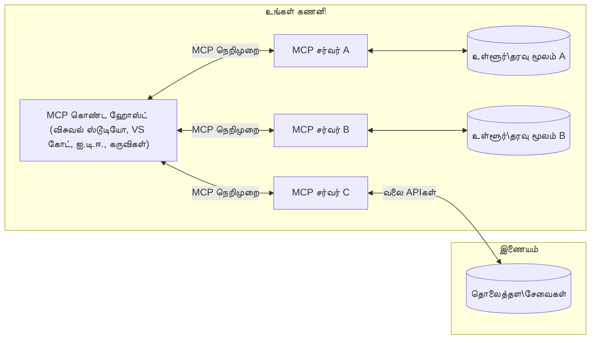

# MCP மையக் கருத்துகள்: AI ஒருங்கிணைப்பிற்கான மாடல் சூழல் நெறிமுறை ஓருவிதானம் கற்குதல்

[](https://youtu.be/earDzWGtE84)

_(இந்த பாடத்தின் வீடியோவை பார்க்க மேலுள்ள படத்தை கிளிக் செய்யவும்)_

[Model Context Protocol (MCP)](https://github.com/modelcontextprotocol) என்பது பெரிய மொழி மாதிரிகளின் (LLMs) மற்றும் வெளிப்புற கருவிகள், பயன்பாடுகள் மற்றும் தரவு மூலங்களுக்கிடையேயான தொடர்பை சிறப்பாக கட்டுப்படுத்தும் சக்திவாய்ந்த, தரமான கட்டமைப்பு ஆகும்.  
இந்த வழிகாட்டி MCP இன் மையக் கருத்துக்களை உங்களுக்கு விளக்கும். அதில் அதன் கிளையன்ட்-சர்வர் கட்டமைப்பு, முக்கிய கூறுகள், தொடர்பு முறைகள் மற்றும் செயல்பாட்டு சிறந்த பயிற்சிகள் பற்றியது இருக்கும்.

- **விரிவான பயனர் அனுமதி**: அனைத்து தரவு அணுகலும் செயல்பாடுகளும் தெளிவான பயனர் ஒப்புதலுடன் மட்டுமே நடைபெறும். பயனர்கள் எந்த தரவு அணுகப்படும் மற்றும் எந்த நடவடிக்கைகள் செய்யப்படும் என்பதில் தெளிவாக அறிந்திருத்தல் அவசியம், அனுமதி மற்றும் அதிகாரப்பூர்வ கட்டுப்பாடுகளுடன்.

- **தரவு தனியுரிமைக் காப்பு**: பயனர் தரவு தெளிவான அனுமதி இல்லாமல் வெளிப்படாது மற்றும் முழு தொடர்பு வலயத்தின் போது வலுவான அணுகல் கட்டுப்பாடுகளால் பாதுகாக்கப்பட வேண்டும். அமல்படுத்தல்கள் அனுமதியின்றி தரவு பரிமாற்றத்தை தடுக்கும் மற்றும் தனியுரிமை எல்லைகளை கடைபிடிக்கும்.

- **கருவிப் பாதுகாப்பு**: ஒவ்வொரு கருவி அழைப்பும் தெளிவான பயனர் அனுமதியுடன் செயல்படுத்தப்பட வேண்டும், கருவியின் செயல்பாடு, அளவுருக்கள் மற்றும் தாக்கங்கள் பற்றிய தெளிவு உடன். வலுவான பாதுகாப்பு எல்லைகள் தவறான, பாதுகாப்பற்ற அல்லது தீங்கு விளைவிக்கும் கருவி இயக்கத்தை தடுக்கும்.

- **பரிமாற்ற அடுக்கு பாதுகாப்பு**: அனைத்து தொடர்பு சேனல்கள் பொருத்தமான குறியாக்க மற்றும் அங்கீகாரம் முறைமைகளை பயன்படுத்த வேண்டும். தொலைதூர இணைப்புகள் பாதுகாப்பான பரிமாற்ற நெறிமுறைகள் மற்றும் சரியான சான்றிதழ் மேலாண்மையை இயக்க வேண்டும்.

#### செயல்படுத்தல் வழிகாட்டுதல்கள்:

- **அனுமதி மேலாண்மை**: பயனர்களுக்கு எந்த சர்வர்கள், கருவிகள் மற்றும் வளங்கள் அணுகப்பட வேண்டும் என்பதை நுணுக்கமான அனுமதி முறைகள் மூலம் கட்டுப்படுத்தலாம்
- **அங்கீகாரம் மற்றும் அதிகாரம்**: பாதுகாப்பான அங்கீகாரம் முறைகள் (OAuth, API விசைகள்) பயன்படுத்தி சரியான டோக்கன் மேலாண்மை மற்றும் காலாவதியாகத்தன்மையுடன்  
- **உள்ளீடு சரிபார்ப்பு**: அனைத்துப் பரிமாணங்கள் மற்றும் தரவுகளை நிர்ணயிக்கப்பட்ட திட்டங்களுக்கு ஏற்ப சரிபார்க்கவும், ஊசல் தாக்குதல் தடுப்பதற்காக
- **அங்கீகார பதிவு**: பாதுகாப்பு கண்காணிப்பு மற்றும் ஒழுங்குமுறை பின்பற்றலுக்காக அனைத்து செயல்பாடுகளின் விரிவான பதிவுகளை பேணவும்

## சுருக்கம்

இந்த பாடம் Model Context Protocol (MCP) சூழலின் அடிப்படை கட்டமைப்பு மற்றும் கூறுகளை ஆராய்கிறது. MCP தொடர்புகளுக்கு சக்தியளிக்கும் கிளையன்ட்-சர்வர் கட்டமைப்பு, முக்கிய கூறுகள் மற்றும் தொடர்பு முறைகள் பற்றி நீங்கள் கற்பீர்கள்.

## முக்கிய கற்றல் நோக்கங்கள்

இந்த பாடத்தின் முடிவில் நீங்கள்:

- MCP கிளையன்ட்-சர்வர் கட்டமைப்பைப் புரிந்து கொள்வீர்கள்.
- ஹோஸ்ட்கள், கிளையன்ட்கள், சர்வர்கள் ஆகியோரின் பாத்திரங்கள் மற்றும் பொறுப்புகளை அடையாளம் காண்பீர்கள்.
- MCP ஐ அமைப்பு வரிசையில் மாறும் ஒருங்கிணைப்பு அடுக்கு என்று உருவாக்கும் முக்கிய அம்சங்களை பகுப்பாய்வு செய்யலாம்.
- MCP சூழலில் தகவல் வேறு எப்படி செல்லும் என்பதை கற்பீர்கள்.
- .NET, Java, Python மற்றும் JavaScript இல் குறியீட்டு உதாரணங்களின் மூலம் நடைமுறை அறிவைப் பெறுவீர்கள்.

## MCP கட்டமைப்பு: விரிவான பார்வை

MCP சூழல் ஒரு கிளையன்ட்-சர்வர் மாதிரியில் கட்டப்பட்டது. இந்த தொகுத்தமைப்பு AI பயன்பாடுகள் கருவிகள், தரவுத்தளங்கள், APIகள் மற்றும் சூழல் வளங்களுடன் திறம்பட தொடர்பு கொள்ள அனுமதிக்கிறது. இந்த கட்டமைப்பின் முக்கிய கூறுகளை நாம்வெளிப்படுத்துவோம்.

அதன் மையத்தில், MCP ஒரு கிளையன்ட்-சர்வர் கட்டமைப்பை பின்பற்றுகிறது, அதில் ஒரு ஹோஸ்ட் செயலி பல சர்வர்களுடன் இணைக்கப்படுகிறது:


```mermaid
flowchart LR
    subgraph "உங்கள் கணனி"
        Host["MCP கொண்ட ஹோஸ்ட் (விசுவல் ஸ்டூடியோ, VS கோட், ஐ.டி.ஈ., கருவிகள்)"]
        S1["MCP சர்வர் A"]
        S2["MCP சர்வர் B"]
        S3["MCP சர்வர் C"]
        Host <-->|"MCP நெறிமுறை"| S1
        Host <-->|"MCP நெறிமுறை"| S2
        Host <-->|"MCP நெறிமுறை"| S3
        S1 <--> D1[("உள்ளூர்\தரவு மூலம் A")]
        S2 <--> D2[("உள்ளூர்\தரவு மூலம் B")]
    end
    subgraph "இணையம்"
        S3 <-->|"வலை APIகள்"| D3[("தொலைத்தள\சேவைகள்")]
    end
```
- **MCP ஹோஸ்ட்கள்**: VSCode, Claude Desktop, IDEகள் அல்லது தரவு அணுக MCP பயன்படுத்த வேண்டிய AI கருவிகள் போன்ற நிரல்கள்  
- **MCP கிளையன்ட்கள்**: சர்வர்களுடன் 1:1 தொடர்புகளை பராமரிக்கும் நெறிமுறை கிளையன்ட்கள்  
- **MCP சர்வர்கள்**: ஒவ்வொரு சர்வர் தனித்துவ உடையில் Model Context Protocol மூலம் குறிப்பிட்ட செயல்பாடுகளை வெளிப்படுத்தும் குறைந்தபருமன் நிரல்கள்  
- **உள்ளூர் தரவு மூலங்கள்**: உங்கள் கணினியின் கோப்புகள், தரவுத்தளங்கள் மற்றும் MCP சர்வர்கள் பாதுகாப்புடன் அணுகக்கூடிய சேவைகள்  
- **தொலைசேவை**: இணையம் மூலம் கிடைக்கும் வெளிப்புற அமைப்புகள், MCP சர்வர்கள் API வழியாக இணைக்கக்கூடும்.

MCP நெறிமுறை நாள் அடிப்படையிலான பதிப்பீடுகளுக்கு (YYYY-MM-DD வடிவம்) துடுப்பான தரமானது ஆகும். தற்போதைய திட்ட பதிப்பு **2025-11-25** ஆகும். சமீபத்திய [நெறிமுறை விவரமைப்பை](https://modelcontextprotocol.io/specification/2025-11-25/) நீங்கள் பார்க்கலாம்.

### 1. ஹோஸ்ட்கள்

Model Context Protocol (MCP) இல், **ஹோஸ்ட்கள்** என்பது பயனர்கள் நெறிமுறையை ஊடுருவி தொடர்பு கொள்ளும் முதன்மை இடைமுகமான AI பயன்பாடுகள் ஆகும். ஹோஸ்ட்கள் பல MCP சர்வர்களுடன் இணைக்கவும், ஒவ்வொரு சர்வர் இணைப்புக்கான தனித்துவமான MCP கிளையன்ட்களை உருவாக்கி நிர்வகிக்கவும் ஒருங்கிணைப்பார்கள். ஹோஸ்ட்களின் உதாரணங்கள்:

- **AI பயன்பாடுகள்**: Claude Desktop, Visual Studio Code, Claude Code  
- **தொடரமைப்பு சூழல்கள்**: MCP ஒருங்கிணைப்புள்ள IDEகள் மற்றும் குறியீடு தொகுப்பிகள்  
- **தனிப்பயன் பயன்பாடுகள்**: குறிக்கப்பட்ட AI முகவர்கள் மற்றும் கருவிகள்

**ஹோஸ்ட்கள்** என்பது AI மாதிரிகளின் தொடர்புகளை ஒருங்கிணைக்கும் பயன்பாடுகள். அவை:

- **AI மாதிரிகளை ஒருங்கிணைக்கின்றன**: பதில்கள் உருவாக்க LLMகளை இயக்குதல் அல்லது தொடர்பு கொள்ளுதல் மற்றும் AI பணிச்சூழல்களை ஒருங்கிணைத்தல்  
- **கிளையன்ட் இணைப்புகளை நிர்வகித்தல்**: ஒவ்வொரு MCP சர்வர் இணைப்புக்கான ஒரு MCP கிளையன்டை உருவாக்கல் மற்றும் பராமரித்தல்  
- **பயனர் இடைமுகத்தை கட்டுப்படுத்தல்**: உரையாடல் ஒழுங்கு, பயனர் தொடர்புகள் மற்றும் பதில்களின் காட்சியளிப்பு  
- **பாதுகாப்பை அமல்படுத்தல்**: அனுமதி, பாதுகாப்பு கட்டுப்பாடுகள் மற்றும் அங்கீகாரங்களை கட்டுப்படுத்தல்  
- **பயனர் ஒப்புதலை கையாளுதல்**: தரவு பகிர்வு மற்றும் கருவி இயக்கத்திற்கு பயனர் ஒப்புதலை நிர்வகித்தல்

### 2. கிளையன்ட்கள்

**கிளையன்ட்கள்** என்பது ஹோஸ்ட் மற்றும் MCP சர்வர்களுக்கு இடையேயான தனித்துவமான 1:1 இணைப்புகளை பராமரிக்கும் முக்கிய கூறுகள். ஒவ்வொரு MCP கிளையன்டும் ஒரு குறிப்பிட்ட MCP சர்வருடன் இணைக்க ஹோஸ்ட் மூலம் உருவாக்கப்படுகிறது, அவை ஒழுங்கான மற்றும் பாதுகாப்பான தொடர்பு சேனல்களை உறுதி செய்யும். பல கிளையன்ட்கள் ஹோஸ்ட்களுக்கு பல சர்வர்களுடன் ஒரே நேரத்தில் இணைவதற்கு வழிகாட்டும்.

**கிளையன்ட்கள்** என்பது ஹோஸ்ட் செயலியில் இணைப்பு கூறுகள் ஆகும். அவை:

- **நெறிமுறை தொடர்பு**: JSON-RPC 2.0 கோரிக்கைகள் சர்வர்களுக்கு அனுப்புதல், ஊடுருவல் மற்றும் வழிமுறைகள்  
- **செயல்திறன் பேச்சுவார்த்தை**: தொடக்கம் முறையில் சர்வர்களுடன் ஆதரவு அம்சங்கள் மற்றும் பதிப்புகளை பேச்சுவார்த்தை செய்யுதல்  
- **கருவி இயக்கம்**: மாதிரிகள் வழங்கும் கருவி இயக்க கோரிக்கைகளை நிர்வகித்து பதில்களை செயலாக்குதல்  
- **உண்மையிலான புதுப்பிப்புகள்**: சர்வர்களிடமிருந்து அறிவிப்புகள் மற்றும் நேரடி புதுப்பிப்புகளை கையாளுதல்  
- **பதில் செயலாக்கம்**: பயனர்களுக்கு காட்சி அளிக்க சர்வர் பதில்களை செயலாக்கி வடிவமைத்தல்

### 3. சர்வர்கள்

**சர்வர்கள்** என்பது MCP கிளையன்ட்களுக்கு சூழல், கருவிகள் மற்றும் செயல்திறன் வழங்கும் நிரல்கள். அவை உள்ளூர் (ஹோஸ்ட் இயங்கும் இயந்திரத்தில்) அல்லது தொலைநிலை (வெளிப்புற மேடைகளில்) இயங்கலாம்; கிளையன்ட் கோரிக்கைகளை கையாளுதல் மற்றும் அமைப்புடனான பதில்களை வழங்குதல் அவற்றின் பொறுப்பு ஆகும். சர்வர்கள் Model Context Protocol தரநிலையால் பண்புக்கூறுகளை வெளிப்படுத்துகின்றன.

**சர்வர்கள்** என்பது சூழல் மற்றும் செயல்திறன்களை வழங்கும் சேவைகள். அவை:

- **செயல்திறன் பதிவுசெய்தல்**: கிளையன்ட்களுக்கு கிடைக்கும் மூலப்பொருட்கள் (வளங்கள், ஊடுருவல்கள், கருவிகள்) பதிவு செய்து வெளிப்படுத்தல்  
- **கோரிக்கை செயலாக்கம்**: கருவி அழைப்புகள், வளங்களுக்கான கோரிக்கைகள் மற்றும் ஊடுருவல் கோரிக்கைகளை பெறுதல் மற்றும் இயக்குதல்  
- **சூழல் வழங்கல்**: மாதிரி பதில்களை மேம்படுத்தும் சூழல் தகவல்களை வழங்குதல்  
- **நிலை மேலாண்மை**: அமர்வு நிலைகளை பராமரித்து, தேவையான நேரங்களில் நிலைத்த தொடர்புகளை கையாளுதல்  
- **நேரடி அறிவிப்புகள்**: செயல்திறன் மாற்றங்கள் மற்றும் புதுப்பிப்புகளை கிளையன்ட்களுக்கு அறிவித்தல்

சர்வர்கள் யாராலும் உருவாக்கப்படலாம், குறிப்பிட்ட செயல்திறனுடன் மாதிரி செயல்பாடுகளை விரிவுபடுத்த அதிக சாத்தியமானவை; அவர்கள் உள்ளூர் மற்றும் தொலைநிலை செயல்பாட்டை ஆதரிக்கிறார்கள்.

### 4. சர்வர் மூலப்பொருட்கள்

Model Context Protocol (MCP) சர்வர்கள் மூன்று முக்கிய **மೂಲப்பொருட்களை** வழங்குகின்றன, அவை கிளையன்ட், ஹோஸ்ட் மற்றும் மொழி மாதிரிகளுக்கிடையில் வளமான தொடர்புகளுக்கான அடிப்படை கட்டுமானங்களை குறிக்கின்றன. இவை நெறிமுறையின் வாயிலாக கிடைக்கும் சூழல் தகவல் மற்றும் செயல்பாடுகளை வரையறுக்கின்றன.

MCP சர்வர்கள் கீழ்காணும் மூன்று முக்கிய மூலப்பொருட்களில் ஏதேனும் ஒன்றின் கலவையை வெளிப்படுத்தலாம்:

#### வளங்கள் 

**வளங்கள்** என்பது AI பயன்பாடுகளுக்கு சூழல் தகவலை வழங்கும் தரவு மூலங்கள் ஆகும். அவை மாதிரியின் புரிதல் மற்றும் முடிவெடுப்பை மேம்படுத்தக்கூடிய நிலையான அல்லது இயக்கக்கூடிய உள்ளடக்கத்தைக் குறிக்கின்றன:

- **சூழல் தரவு**: AI மாதிரிக்கு வழங்கப்படும் அமைப்புக்கட்டுத்துறை மற்றும் தகவல்  
- **அறிவுத்தளம்**: ஆவண சேமிப்புகள், கட்டுரைகள், கையேடுகள் மற்றும் ஆய்வுக் கட்டுரைகள்  
- **உள்ளூர் தரவுத் தோட்டங்கள்**: கோப்புகள், தரவுத்தளங்கள் மற்றும் உள்ளூர் அமைப்பு தகவல்கள்  
- **வெளிப்புற தரவு**: API பதில்கள், வலைசேவைகள் மற்றும் தொலை அமைப்பு தரவு  
- **இயங்கும் உள்ளடக்கம்**: வெளிப்புற சூழல் காரணிகளின் அடிப்படையில் நேரடியாக புதுப்பிக்கப்படும் தரவுகள்

வளங்கள் URIகளால் அடையாளப்படுத்தப்படுகின்றன மற்றும் `resources/list` மூலம் கண்டுபிடிப்பு மற்றும் `resources/read` மூலம் பெறல் வேலை செய்யும்:

```text
file://documents/project-spec.md
database://production/users/schema
api://weather/current
```

#### ஊடுருவல்கள்

**ஊடுருவல்கள்** என்பது மொழி மாதிரிகளுடன் தொடர்பு கொள்ள உருவாக்கப்பட்ட மீண்டும் பயன்படுத்தக்கூடிய வார்ப்புரு வடிவங்கள் ஆகும். அவை தரமான தொடர்பு மாதிரிகள் மற்றும் வடிவிடப்பட்ட பணிசூழல்களை வழங்குகின்றன:

- **வார்ப்புரு அடிப்படையிலான தொடர்புகள்**: முன்னே திட்டமிடப்பட்ட செய்திகள் மற்றும் உரையாடல் துவக்கிகள்  
- **பணிசூழல் வார்ப்புருக்கள்**: பொதுவான பணிகளுக்கான ஒழுங்கமைக்கப்பட்ட தொடர்ச்சிகள் மற்றும் தொடர்புகள்  
- **சில-தாய்முறை உதாரணங்கள்**: மாதிரி வழிகாட்டலுக்கு உதவியளிக்கும் உதாரண வார்ப்புருக்கள்  
- **கணினி ஊடுருவல்கள்**: மாதிரி நடத்தை மற்றும் சூழலை வரையறுக்கும் அடிப்படைக் ஊடுருவல்கள்  
- **இயங்கும் வார்ப்புருக்கள்**: குறிப்பிட்ட சூழல் சோதனைகளுக்கு ஏற்ப மாறும் அளவுரு அடிப்படையிலான ஊடுருவல்கள்

ஊடுருவல்கள் மாறிலிகள் மாற்றத்தையும் ஆதரிக்கின்றன மற்றும் `prompts/list` மூலம் கண்டுபிடித்து `prompts/get` மூலம் பெறலாம்:

```markdown
Generate a {{task_type}} for {{product}} targeting {{audience}} with the following requirements: {{requirements}}
```

#### கருவிகள்

**கருவிகள்** என்பது AI மாதிரிகள் குறிப்பிட்ட செயல்களை செய்ய கூர்ந்த இயங்கக்கூடிய செயல்பாடுகள் ஆகும். அவை MCP சூழல் "வினைச்சொற்கள்" ஆகும், மாதிரிகள் வெளிப்புற அமைப்புகளுடன் தொடர்பு கொள்ள உதவுகின்றன:

- **இயங்கக்கூடிய செயல்பாடுகள்**: மாதிரிகள் குறிப்பிட்ட அளவுருக்களுடன் அழைக்க முடியுமென discrete செயல்பாடுகள்  
- **வெளிப்புற அமைப்பு ஒருங்கிணைப்பு**: API அழைப்புகள், தரவுத்தள விசாரணைகள், கோப்பு செயல்பாடுகள், கணக்கீட்டுகள்  
- **தனித்துவ அடையாளம்**: ஒவ்வொரு கருவிக்கும் தனித்துவமான பெயர், விளக்கம் மற்றும் அளவுரு ஸ்கீமா உள்ளது  
- **கட்டமைக்கப்பட்ட I/O**: கருவிகள் சரிபார்க்கப்பட்ட அளவுருக்களையும் கட்டமைக்கப்பட்ட மற்றும் வகைப்படுத்தப்பட்ட பதில்களையும் ஏற்றுக்கொள்கின்றன  
- **செயல்பாடு திறன்கள்**: மாதிரிகள் நிஜ உலக நடவடிக்கைகள் செய்ய மற்றும் நேரடி தரவைப் பெற இயலும்

கருவிகள் JSON ஸ்கீமாவுடன் அளவுரு சரிபார்ப்புக்கு வரையறுக்கப்படுகின்றன மற்றும் `tools/list` மூலம் கண்டுபிடிக்கப்பட்டு `tools/call` மூலம் இயக்கப்படுகின்றன. கருவிகளுக்கு கூட UI வெளிப்பாட்டிற்கு கூடுதல் மெட்டாடேட்டாவாக **கணிகள்** க்கும் அனுமதி உண்டு.

**கருவி குறியீடுகள்**: கருவிகள் நடத்தை குறியீடுகளை (உதா., `readOnlyHint`, `destructiveHint`) ஆதரிக்கின்றன, அவை ஒரு கருவி வாசிப்பிற்கு மட்டும் உள்ளதா அல்லது அழிப்பானதா என்பதை விளக்கி, கிளையன்ட்களுக்கு கருவி செயல்பாட்டைப் பற்றிய அறிவுரையை வழங்கும்.

கருவி வரையறை உதாரணம்:

```typescript
server.tool(
  "search_products", 
  {
    query: z.string().describe("Search query for products"),
    category: z.string().optional().describe("Product category filter"),
    max_results: z.number().default(10).describe("Maximum results to return")
  }, 
  async (params) => {
    // தேடலை நடத்தி கட்டமைக்கப்பட்ட முடிவுகளை திரும்ப வழங்கவும்
    return await productService.search(params);
  }
);
```

## கிளையன்ட் மூலப்பொருட்கள்

Model Context Protocol (MCP) இல், **கிளையன்ட்கள்** ஹோஸ்ட் செயலியில் கூடுதல் திறன்களை சர்வர்களுக்கு கோர முடியும் என்பதற்கான மூலப்பொருட்களை வெளிப்படுத்தலாம். இந்த கிளையன்ட் பக்க மூலப்பொருட்கள், AI மாதிரி திறன்களையும் பயனர் தொடர்புகளையும் அணுகும் வளமான, இன்டர்அக்டிவ் சர்வர் செயல்பாடுகளை சாத்தியமாக்குகின்றன.

### மாதிரிபெறுதல்

**மாதிரிபெறுதல்** மூலம் சர்வர்கள் கிளையன்டின் AI பயன்பாட்டிலிருந்து மொழி மாதிரி பூர்த்திகளை கோரலாம். இந்த மூலப்பொருள் சர்வர்களுக்கு தங்கள் சொந்த மாதிரி சார்ந்த சாதனத்தின்மை இல்லாமல் LLM திறன்களை அணுக அனுமதிக்கிறது:

- **மாதிரி சார்பற்ற அணுகல்**: சர்வர்கள் LLM SDKகளை உட்படுத்தாமல் அல்லது மாதிரி அணுகலை நிர்வகிக்காமலே பூர்த்திகளை கோரலாம்  
- **சர்வர் தொடக்கம் AI**: சர்வர்கள் தானாகவே கிளையன்டின் AI மாதிரியை பயன்படுத்தி உள்ளடக்கம் உருவாக்க அனுமதிக்கும்  
- **மீள்-புதிர்தல் LLM தொடர்புகள்**: சர்வர்கள் AI உதவியுடன் பணிகளைச் செயலாக்க வேண்டுமென்ற சூழல் கற்றுக்கொள்ளாகும்  
- **இயங்கும் உள்ளடக்கம் உருவாக்கல்**: ஹோஸ்டின் மாதிரியை பயன்படுத்தி சூழல் பதில்களை உருவாக்க அனுமதிக்கும்  
- **கருவி அழைப்பு ஆதரவு**: சர்வர்கள் `tools` மற்றும் `toolChoice` அளவுருக்களை அமைப்பினால் கிளையன்டின் மாதிரி மாதிரிபெற்றலின் போது கருவிகளை அழைக்க அனுமதிக்கலாம்

மாதிரிபெறுதல் `sampling/complete` முறையின் மூலம் துவங்கப்படுகிறது, இதில் சர்வர்கள் கிளையன்ட்களுக்கு பூர்த்தி கோரிக்கைகளை அனுப்புகின்றனர்.

### ரூட்கள்

**ரூட்கள்** என்பது சர்வர்களுக்கு கோப்புறைகளின் எல்லைகளை ஒருமுறையாக வெளிப்படுத்த கிளையன்ட்களுக்கு வழி காண்பிக்கும் முறையே ஆகும், இதனால் சர்வர்கள் எந்த கோப்புறைகள் மற்றும் கோப்புகளில் அவர்களுக்கு அணுகல் உரிமை உள்ளதோ தெளிவாக அறிவதற்கு உதவி செய்கின்றன:

- **கோப்புற எல்லைகள்**: சர்வர்கள் கோப்புறைவள பகுதியில் இயங்கும் எல்லைகளைக் குறிப்பது  
- **அணுகல் கட்டுப்பாடு**: சர்வர்கள் எந்த கோப்புறைகளும் கோப்புகளும் அவர்களுக்கு அனுமதி உள்ளன என தெரிந்து கொள்ள உதவுதல்  
- **இயங்கும் புதுப்பிப்புகள்**: ரூட் பட்டியல் மாறும் போது கிளையன்ட்கள் சர்வர்களுக்கு அறிவித்தல்  
- **URI அடிப்படையிலான அடையாளம்**: ரூட்கள் `file://` URIகளை பயன்படுத்தி அணுகக்கூடிய கோப்புறைகளையும் கோப்புகளையும் அடையாளப்படுத்துகின்றன

ரூட்கள் `roots/list` முறையின் மூலம் கண்டுபிடிக்கப்படுகின்றன, கிளையன்ட்கள் `notifications/roots/list_changed` அறிவிப்பை ரூட்கள் மாற்றம் ஏற்படும் போது அனுப்புகின்றனர்.

### கோரல்

**கோரல்** சர்வர்களுக்கு கிளையன்ட் இடைமுகத்தின் வாயிலாக பயனர்களிடமிருந்து கூடுதல் தகவல் அல்லது உறுதிப்படுத்தலை கோர அனுமதிக்கிறது:

- **பயனர் உள்ளீடு கோரிக்கைகள்**: கருவி இயக்கத்திற்கு தேவையான கூடுதல் தகவல்களைக் கோர சக்தி  
- **உறுதிப்படுத்தல் संवादங்கள்**: கருதி அல்லது தாக்கம் வாய்ந்த நடவடிக்கைகளுக்கான பயனர் ஒப்புதலை கோருதல்  
- **இன்டர்அக்டிவ் பணிசூழல்கள்**: சர்வர்களுக்கு படிப்படி பயனர் தொடர்புகளை உருவாக்க அனுமதிக்கும்  
- **இயங்கும் அளவுரு சேகரிப்பு**: கருவி இயக்கத்திற்குப் பயன்படுத்த அட்டவணையில் இல்லாத அல்லது விருப்ப அளவுருக்களை சேகரித்தல்

கோரல் கோரிக்கைகள் `elicitation/request` முறையை பயன்படுத்தி கிளையன்டின் இடைமுகம் வழியாக பயனர் உள்ளீட்டை சேகரிக்க ஏற்படுத்துகின்றன.

**URL முறை கோரல்**: சர்வர்கள் URL அடிப்படையிலான பயனர் தொடர்புகளைவும் கோரலாம், இது சர்வர்களுக்கு பயனர்களை அங்கீகாரம், உறுதிப்படுத்தல் அல்லது தரவு நுழைக்க வலைப்பக்கங்களுக்கு வாயிலாக வழிநடத்த அனுமதிக்கிறது.

### பதிவு

**பதிவு** சர்வர்களுக்கு கிளையன்ட்களுக்கு கட்டமைக்கப்பட்ட பதிவுச் செய்திகள் அனுப்பிய Debugging, கண்காணிப்பு மற்றும் செயல்பாட்டுத் திறனுக்காக அனுமதிக்கிறது:

- **பிழைதிருத்த ஆதரவு**: சிக்கலை ஆராய்ச்சி செய்வதற்கான விரிவான இயக்க பதிவுகளை வழங்க அனுமதிக்கும்  
- **செயல்பாட்டு கண்காணிப்பு**: நிலை மேம்பாட்டு தகவல்களையும் செயல்திறன் கணக்குகளையும் கிளையன்ட்களுக்கு அனுப்புதல்  
- **பிழை அறிக்கை**: விரிவான பிழை சூழல் மற்றும் நுண்ணறிவு தகவல்களை வழங்குதல்  
- **கணக்கெடுப்பு சுருக்கங்கள்**: சர்வர் செயல்பாடுகள் மற்றும் முடிவுகளின் விரிவான பதிவுகளை உருவாக்குதல்

பதிவு செய்திகள் கிளையன்ட்களுக்கு அனுப்பப்படுவதால் சர்வர் செயல்பாடுகளை தெளிவாகக் காண்பிக்கவும் பிழைதிருத்தத்தை வசதிப்படுத்தவும் உதவுகின்றன.

## MCPல் தகவல் ஓட்டம்

Model Context Protocol (MCP) ஹோஸ்ட்கள், கிளையன்ட்கள், சர்வர்கள் மற்றும் மாதிரிகளுக்கு இடையில் அமைக்கப்பட்ட தகவல் ஓட்டத்தை வரையறுக்கிறது. இந்த ஓட்டத்தைப் புரிந்து கொள்ளுதல் பயனர் கோரிக்கைகள் எப்படி செயலாக்கப்படும் மற்றும் வெளிப்புற கருவிகள் மற்றும் தரவு மாதிரி பதில்களில் எவ்வாறு ஒருங்கிணைக்கப்படுகின்றன என்பதை தெளிவுபடுத்த உதவும்.
- **ஹோஸ்ட் தொடர்பு தொடங்குகிறது**  
  ஹோஸ்ட் பயன்பாடு (IDE அல்லது உரையாடல் இடைமுகம் போன்றது) பொதுவாக STDIO, WebSocket அல்லது மற்ற ஆதரவு கொண்ட பரிமாற்றம் மூலம் MCP சேவையகத்துடன் ஒரு தொடர்பை ஏற்படுத்துகிறது.

- **சிறப்புச் செயல்திறன் பேச்சுவார்த்தை**  
  ஹோஸ்டில் உள்ள கிளையன்ட் மற்றும் சேவையகம் தங்கள் ஆதரவு வாய்ந்த அம்சங்கள், கருவிகள், வளங்கள் மற்றும் நெறிமுறை பதிப்புகளின் தகவலை பரிமாறிக்கொள்கின்றன. இதனால் இரு பக்கங்களும் அமர்வு தொடர்பாக கிடைக்கும் திறன்களை புரிந்துகொள்ள முடிகிறது.

- **பயனர் கோரிக்கை**  
  பயனர் ஹோஸ்டுடன் தொடர்பு கொள்கிறார் (உதாரணமாக, குறுக்கு முனை அல்லது கட்டளை வழங்குதல்). ஹோஸ்ட் இந்த உள்ளீட்டைக் சேகரித்து கிளையன்ட்டிற்கு செயலாக்கத்துக்காக அனுப்புகிறது.

- **வழங்கும் வளம் அல்லது கருவி பயன்பாடு**  
  - கிளையன்ட், சேவையகத்திடமிருந்து கூடுதல் சூழல் அல்லது வளங்களை (கோப்புகள், தரவுத்தள பதிவுகள், அறிவுத்தளம் கட்டுரைகள் போன்றவை) கோரலாம், இது மாடல் புரிதலை மேம்படுத்த உதவுகிறது.  
  - மாடல் கருவி தேவைப்படுவதாக தீர்மானித்தால் (தரவிறக்கம், கணக்கீடு செய்வது, API அழைப்பு போன்றவை), கிளையன்ட் கருவி அழைப்பு கோரிக்கையை சேவையகத்திற்கு அனுப்புகிறது, கருவி பெயர் மற்றும் அளவுருக்களுடன்.

- **சேவையக செயலாக்கம்**  
  சேவையகம் வளம் அல்லது கருவி கோரிக்கையை பெற்றுக்கொண்டு தேவையான செயல்பாடுகளை (ஒரு செயல்பாட்டை இயக்குதல், தரவுத்தள வினவல், கோப்பைப் பெறுதல்) விரைந்து செய்து, முழுமையான வடிவத்தில் முடிவுகளை கிளையன்டுக்கு அனுப்புகிறது.

- **பதில் உருவாக்கம்**  
  கிளையன்ட் சேவையகத்தின் பதில்களை (வளத் தகவல்கள், கருவி வெளியீடுகள் போன்றவை) தொடர்ச்சியான மாடல் தொடர்பில் ஒருங்கிணைக்கிறது. மாடல் இந்த தகவலை பயன்படுத்தி விரிவான மற்றும் சுட்டுரூபமான பதிலை உருவாக்குகிறது.

- **முடிவு முன்வைத்தல்**  
  ஹோஸ்ட் இறுதி விளைவினை கிளையன்டிடமிருந்து பெற்று பயனருக்கு காட்டுகிறது, இதில் பொதுவாக மாடல் உருவாக்கிய உரை மற்றும் கருவி செயல்பாடுகளிலிருந்து அல்லது வள தேடல்களிலிருந்து கிடைத்த முடிவுகள் இரண்டும் உள்ளடங்கும்.

இந்த ஓட்டம் MCP ஐ மேம்பட்ட, பரிணாமமான மற்றும் சூழல்பொருந்திய AI பயன்பாடுகளை ஆதரிக்க, மாதிரிகளை வெளிப்புற கருவிகள் மற்றும் தரவுகளுடன் இணைப்பதற்கான வழியைத் திறக்கிறது.

## நெறிமுறை கட்டமைப்பு மற்றும் படிகள்

MCP இரண்டு தனித்துவமான கட்டமைப்பு படிகளைக் கொண்டுள்ளது, அவை முழுமையான தொடர்பு நெறிமுறையை வழங்க ஒருங்கிணைக்கின்றன:

### தரவு படி

**தரவு படி** மைய MCP நெறிமுறையை **JSON-RPC 2.0** அடிப்படையில் செயல்படுத்துகிறது. இந்த படி செய்தி வடிவமைப்பு, அர்த்தங்கள், மற்றும் தொடர்பு முறை வகைகளை வரையறுக்கிறது:

#### முக்கிய கூறுகள்:

- **JSON-RPC 2.0 நெறிமுறை**: அனைத்து தொடர்புகளும் நடைமுறைக் கூற்றுகள், பதில்கள் மற்றும் அறிவித்தல்களுக்கான ஒழுங்கு செய்யப்பட்ட JSON-RPC 2.0 செய்தி வடிவத்தை பயன்படுத்தும்  
- **வாழ்க்கைசூழல் மேலாண்மை**: கிளையன்டுகள் மற்றும் சேவையகங்களுக்கு இடையேயான தொடர்பு துவக்கம், சிறப்புச்சொல்லீடல் பேச்சுவார்த்தை மற்றும் அமர்வு முடிப்பை கையாள்கிறது  
- **சேவையக அடிப்படை கூறுகள்**: கருவிகள், வளங்கள் மற்றும் முன்மாதிரிகள் மூலம் மையப் பண்புகளை வழங்குகிறது  
- **கிளையன்ட் அடிப்படை கூறுகள்**: LLM களில் மாதிரிகள் கோருகையை அனுப்ப, பயனர் உள்ளீட்டைக் கேட்க மற்றும் புகைப்படங்களை அனுப்ப சேவையகத்துக்கு அனுமதிக்கிறது  
- **உண்மைக் கால அறிவிப்புகள்**: பொறுப்பற்ற அறிவிப்புகளை ஆதரவளித்து இயக்கங்களின் புதுப்பிப்புகளை தஞ்சக்காமல் வழங்குகிறது

#### முக்கிய அம்சங்கள்:

- **நெறிமுறை பதிப்பு பேச்சுவார்த்தை**: YYYY-MM-DD என்ற தேதியியல் பதிப்பீட்டை பயன்படுத்தி பொருந்துதலை உறுதி செய்கிறது  
- **சிறப்புச்செயல்திறன் கண்டுபிடிப்பு**: துவக்கத்தில் கிளையன்ட்கள் மற்றும் சேவையகங்கள் ஆதரவு அளவுகோல்கள் பற்றி பரிமாறிக் கொள்கின்றன  
- **நிலையான அமர்வுகள்**: ஒரு சில தொடர்புகளுக்கு இடையே நிலையை பராமரித்து சூழலின் தொடர்ச்சியை உறுதி செய்கிறது

### பரிமாற்ற படி

**பரிமாற்ற படி** MCP பங்காளிகளுக்கு இடையில் தொடர்பு வழிகளை, செய்தி உருவாக்கத்தையும் அங்கீகாரத்தையும் நிர்வகிக்கிறது:

#### ஆதரவு பெற்ற பரிமாற்ற முறைகள்:

1. **STDIO பரிமாற்றம்**:  
   - நேரடி செயல்முறைக் தொடர்புக்காக நிலையான உள்ளீடு/வெளியீட்டு ஓட்டங்களை பயன்படுத்துகிறது  
   - அதே இயந்திரத்தில் உள்ள செயல்முறைகளுக்கு சிறந்தது, வலையமைப்புச் சுமை இல்லை  
   - அடிக்கடி உள்ளூர் MCP சேவையகம் செயலாக்கத்திற்கு பயன்படுத்தப்படுகிறது

2. **பிரவக்ஷமிக்க HTTP பரிமாற்றம்**:  
   - கிளையன்டில் இருந்து சேவையகத்திற்கு HTTP POST பயன்படுத்துகிறது  
   - விருப்பமான Server-Sent Events (SSE) மூலம் சேவையகம்-கிளையன்ட் குறிப்புகள் வழங்குகிறது  
   - வலையமைப்புகளுக்கு அப்பால் சேவையக தொடர்பை செயல்படுத்துகிறது  
   - நிலையான HTTP அங்கீகாரம் (bearer tokenகள், API விசைகள், தனிப்பயன் தலைப்புகள்) ஆதரிக்கப்படுகிறது  
   - MCP கடுமையான பாதுகாப்பிற்காக OAuth ஐ பரிந்துரைக்கின்றது

#### பரிமாற்றத் தொகுப்பு:

பரிமாற்ற படி தரவு படியிலிருந்து தொடர்பு விவரங்களை சுருக்கிவைத்து அனைத்து பரிமாற்ற முறைகளிலும் ஒரே JSON-RPC 2.0 செய்தி வடிவத்தை பயன்படுத்த இயலும். இதனால் உள்ளூர் மற்றும் தொலைவிலிருந்து சேவையகங்களுக்கு இடையே தடி இல்லாமல் மாறுதலை வழங்க முடிகிறது.

### பாதுகாப்பு கருத்துக்கள்

MCP அமல்படுத்தல்கள் அனைத்து நெறிமுறை செயல்பாடுகளிலும் பாதுகாப்பான, நம்பகமான மற்றும் நெருக்கடியற்ற தொடர்புகளை உறுதி செய்ய தேவையான பல முக்கிய பாதுகாப்பு கொள்கைகளை பின்பற்ற வேண்டும்:

- **பயனர் ஒப்புதல் மற்றும் கட்டுப்பாடு**: எந்த தரவோ அணுகப்படுவதற்கு முன் அல்லது எந்த செயல்பாடுகளோ நடைபெறுவதற்கு முன் பயனரின் தெளிவான ஒப்புதல் அவசியம். பகிரப்படும் தரவு மற்றும் அனுமதிக்கப்பட்ட நடவடிக்கைகள் குறித்து பயனர் தெளிவான கட்டுப்பாடுகளை கொண்டிருக்க வேண்டும், செயல்பாடுகளை பரிசீலிக்கும் மற்றும் அங்கீகரிக்கும் எளிய பயனர் இடைமுகங்கள் இவை ஆதரவு அளிக்க வேண்டும்.

- **தரவு தனியுரிமை**: பயனர் தரவு தெளிவான ஒப்புதலுடன் மட்டுமே பகிரப்பட வேண்டும் மற்றும் தேவையான அணுகல் கட்டுப்பாடுகளால் பாதுகாக்கப்பட வேண்டும். MCP அமல்படுத்தல்கள் அங்கீகாரம் இல்லாத தரவு பரிமாற்றத்திலிருந்து பாதுகாப்பிற்கும், அனைத்து தொடர்புகளிலும் தனியுரிமை காக்கவும் கட்டாயமாக இருக்கிறது.

- **கருவி பாதுகாப்பு**: எந்த கருவி அழைப்புக்கும் முன்பு தெளிவான பயனர் ஒப்புதல் பெறப்பட வேண்டும். பயனர்கள் ஒவ்வொரு கருவியின் செயல்பாடு எப்படியென்று தெளிவாக அறிந்திருக்க வேண்டும், மற்றும் தவறான அல்லது பாதுகாப்பற்ற கருவி செயல்பாடுகளைத் தடுக்கும் வலுவான பாதுகாப்பு எல்லைகள் அமல்படுத்தப்பட வேண்டும்.

இந்த பாதுகாப்பு கொள்கைகளை பின்பற்றுவதன் மூலம் MCP பயனர் நம்பிக்கை, தனியுரிமை மற்றும் பாதுகாப்பை உறுதிப்படுத்தி சக்திவாய்ந்த AI ஒருங்கிணைப்புகளை சாத்தியப்படுத்துகிறது.

## குறியீட்டு உதாரணங்கள்: முக்கிய கூறுகள்

கீழே உள்ள பல பிரபல நிரலாக்க மொழிகளில் MCP சேவையகத்தின் முக்கிய கூறுகள் மற்றும் கருவிகள் எப்படி செயல்படுத்தப்படுவது என்பதற்கான எடுத்துக்காட்டுகள் வழங்கப்பட்டுள்ளன.

### .NET எடுத்துக்காட்டு: கருவிகளுடன் ஒரு எளிய MCP சேவையகம் உருவாக்குதல்

இதில் தனிப்பயன் கருவிகளை வரையறுக்கும், கோரிக்கைகளை கையாளும் மற்றும் Model Context Protocol மூலம் சேவையகத்துடன் இணைக்கும் வழியை வெளிப்படுத்துகிறது.

```csharp
using System;
using System.Threading.Tasks;
using ModelContextProtocol.Server;
using ModelContextProtocol.Server.Transport;
using ModelContextProtocol.Server.Tools;

public class WeatherServer
{
    public static async Task Main(string[] args)
    {
        // Create an MCP server
        var server = new McpServer(
            name: "Weather MCP Server",
            version: "1.0.0"
        );
        
        // Register our custom weather tool
        server.AddTool<string, WeatherData>("weatherTool", 
            description: "Gets current weather for a location",
            execute: async (location) => {
                // Call weather API (simplified)
                var weatherData = await GetWeatherDataAsync(location);
                return weatherData;
            });
        
        // Connect the server using stdio transport
        var transport = new StdioServerTransport();
        await server.ConnectAsync(transport);
        
        Console.WriteLine("Weather MCP Server started");
        
        // Keep the server running until process is terminated
        await Task.Delay(-1);
    }
    
    private static async Task<WeatherData> GetWeatherDataAsync(string location)
    {
        // This would normally call a weather API
        // Simplified for demonstration
        await Task.Delay(100); // Simulate API call
        return new WeatherData { 
            Temperature = 72.5,
            Conditions = "Sunny",
            Location = location
        };
    }
}

public class WeatherData
{
    public double Temperature { get; set; }
    public string Conditions { get; set; }
    public string Location { get; set; }
}
```

### ஜாவா எடுத்துக்காட்டு: MCP சேவையக கூறுகள்

மேலே கூறிய .NET எடுத்துக்காட்டில் உள்ளதே ஆகினும், இங்கு ஜாவாவில் செயல்படுத்தப்பட்டதாக உள்ளது.

```java
import io.modelcontextprotocol.server.McpServer;
import io.modelcontextprotocol.server.McpToolDefinition;
import io.modelcontextprotocol.server.transport.StdioServerTransport;
import io.modelcontextprotocol.server.tool.ToolExecutionContext;
import io.modelcontextprotocol.server.tool.ToolResponse;

public class WeatherMcpServer {
    public static void main(String[] args) throws Exception {
        // ஒரு MCP சேவையகம் உருவாக்கவும்
        McpServer server = McpServer.builder()
            .name("Weather MCP Server")
            .version("1.0.0")
            .build();
            
        // ஒரு வானிலை கருவியை பதிவு செய்யவும்
        server.registerTool(McpToolDefinition.builder("weatherTool")
            .description("Gets current weather for a location")
            .parameter("location", String.class)
            .execute((ToolExecutionContext ctx) -> {
                String location = ctx.getParameter("location", String.class);
                
                // வானிலை தரவைப் பெறவும் (எளிய வடிவம்)
                WeatherData data = getWeatherData(location);
                
                // வடிவமைக்கப்பட்ட பதிலை திருப்பவும்
                return ToolResponse.content(
                    String.format("Temperature: %.1f°F, Conditions: %s, Location: %s", 
                    data.getTemperature(), 
                    data.getConditions(), 
                    data.getLocation())
                );
            })
            .build());
        
        // stdio போக்குவரத்தைக் கொண்டு சேவையகத்தை இணைக்கவும்
        try (StdioServerTransport transport = new StdioServerTransport()) {
            server.connect(transport);
            System.out.println("Weather MCP Server started");
            // செயல்முறை நிறுத்தப்படும்வரை சேவையகம் இயங்க வைத்து கொள்ளவும்
            Thread.currentThread().join();
        }
    }
    
    private static WeatherData getWeatherData(String location) {
        // அமல்படுத்தல் ஒரு வானிலை API ஐ அழைக்கும்
        // உதாரண நோக்கங்களுக்காக எளிமைப்படுத்தப்பட்டது
        return new WeatherData(72.5, "Sunny", location);
    }
}

class WeatherData {
    private double temperature;
    private String conditions;
    private String location;
    
    public WeatherData(double temperature, String conditions, String location) {
        this.temperature = temperature;
        this.conditions = conditions;
        this.location = location;
    }
    
    public double getTemperature() {
        return temperature;
    }
    
    public String getConditions() {
        return conditions;
    }
    
    public String getLocation() {
        return location;
    }
}
```

### பைத்தான் எடுத்துக்காட்டு: MCP சேவையகம் கட்டமைத்தல்

இந்த எடுத்துக்காட்டு fastmcp ஐ பயன்படுத்துகிறது, முதலில் அதை நிறுவியிருக்குமாறு தயவுசெய்து உறுதி செய்யவும்:

```python
pip install fastmcp
```
Code Sample:

```python
#!/usr/bin/env python3
import asyncio
from fastmcp import FastMCP
from fastmcp.transports.stdio import serve_stdio

# ஒரு FastMCP சேவையகத்தை உருவாக்கவும்
mcp = FastMCP(
    name="Weather MCP Server",
    version="1.0.0"
)

@mcp.tool()
def get_weather(location: str) -> dict:
    """Gets current weather for a location."""
    return {
        "temperature": 72.5,
        "conditions": "Sunny",
        "location": location
    }

# ஒரு வகுப்பு பயன்படுத்தி மாற்றீட்டு அணுகுமுறை
class WeatherTools:
    @mcp.tool()
    def forecast(self, location: str, days: int = 1) -> dict:
        """Gets weather forecast for a location for the specified number of days."""
        return {
            "location": location,
            "forecast": [
                {"day": i+1, "temperature": 70 + i, "conditions": "Partly Cloudy"}
                for i in range(days)
            ]
        }

# வகுப்பு கருவிகளை பதிவு செய்யவும்
weather_tools = WeatherTools()

# சேவையகத்தை தொடங்கவும்
if __name__ == "__main__":
    asyncio.run(serve_stdio(mcp))
```

### ஜாவாஸ்கிரிப்ட் எடுத்துக்காட்டு: MCP சேவையகம் உருவாக்குதல்

இங்கு இரண்டு வானிலை தொடர்புடைய கருவிகளை பதிவு செய்வதையும் MCP சேவையகத்தை stdio பரிமாற்றம் மூலம் கிளையன்ட் கோரிக்கைகளை கையாள உதவுவதையும் காட்டுகிறது.

```javascript
// அதிகாரப்பூர்வ Model Context Protocol SDK ஐ பயன்படுத்துகிறது
import { McpServer } from "@modelcontextprotocol/sdk/server/mcp.js";
import { StdioServerTransport } from "@modelcontextprotocol/sdk/server/stdio.js";
import { z } from "zod"; // அளவுரு சரிபார்ப்புக்கு

// ஒரு MCP சேவையகத்தை உருவாக்கவும்
const server = new McpServer({
  name: "Weather MCP Server",
  version: "1.0.0"
});

// ஒரு காலநிலை கருவியை வரையறுக்கவும்
server.tool(
  "weatherTool",
  {
    location: z.string().describe("The location to get weather for")
  },
  async ({ location }) => {
    // இது சாதாரணமாக ஒரு காலநிலை API ஐ அழைக்கும்
    // காட்சிப்படுத்த எளிமைப்படுத்தப்பட்டுள்ளது
    const weatherData = await getWeatherData(location);
    
    return {
      content: [
        { 
          type: "text", 
          text: `Temperature: ${weatherData.temperature}°F, Conditions: ${weatherData.conditions}, Location: ${weatherData.location}` 
        }
      ]
    };
  }
);

// ஒரு முன்னறிவிப்பு கருவியை வரையறுக்கவும்
server.tool(
  "forecastTool",
  {
    location: z.string(),
    days: z.number().default(3).describe("Number of days for forecast")
  },
  async ({ location, days }) => {
    // இது சாதாரணமாக ஒரு காலநிலை API ஐ அழைக்கும்
    // காட்சிப்படுத்த எளிமைப்படுத்தப்பட்டுள்ளது
    const forecast = await getForecastData(location, days);
    
    return {
      content: [
        { 
          type: "text", 
          text: `${days}-day forecast for ${location}: ${JSON.stringify(forecast)}` 
        }
      ]
    };
  }
);

// உதவி செயல்பாடுகள்
async function getWeatherData(location) {
  // API அழைப்பை மாதிரியிடுக
  return {
    temperature: 72.5,
    conditions: "Sunny",
    location: location
  };
}

async function getForecastData(location, days) {
  // API அழைப்பை மாதிரியிடுக
  return Array.from({ length: days }, (_, i) => ({
    day: i + 1,
    temperature: 70 + Math.floor(Math.random() * 10),
    conditions: i % 2 === 0 ? "Sunny" : "Partly Cloudy"
  }));
}

// stdio போக்குவரத்துடன் சேவையகத்தை இணைக்கவும்
const transport = new StdioServerTransport();
server.connect(transport).catch(console.error);

console.log("Weather MCP Server started");
```

இந்த ஜாவாஸ்கிரிப்ட் எடுத்துக்காட்டு stdio பரிமாற்றம் மூலம் இணைந்து வானிலை சார்ந்த கருவிகளை பதிவு செய்து MCP சேவையகத்தை உருவாக்குகின்றது.

## பாதுகாப்பு மற்றும் அங்கீகாரம்

MCP அனைத்து நெறிமுறை செயல்களில் பாதுகாப்பு மற்றும் அங்கீகாரத்தை நிர்வகிக்க பல கட்டமைப்புகள் மற்றும் கருவிகளை உள்ளடக்கியுள்ளது:

1. **கருவி அனுமதி கட்டுப்பாடு**:  
  மாதிரி அமர்வின் போது பயன்படுத்த அனுமதிக்கப்பட்ட கருவிகளை கிளையன்ட் குறிப்பிடலாம். இது தெளிவான அங்கீகாரம் பெற்ற கருவிகள் மட்டுமே அண்மையில் வருவதற்கு காப்பாற்றுகிறது, தவறான அல்லது பாதுகாப்பற்ற செயல்களை குறைக்கிறது. அனுமதிகள் பயனர் விருப்பங்கள், நிறுவனர் கொள்கைகள் அல்லது தொடர்பு சூழலைப் பொறுத்து மாற்றக்கூடியவையாக இருக்கலாம்.

2. **அங்கீகாரம்**:  
  சேவையகங்கள் கருவிகள், வளங்கள் அல்லது நுணுக்கமான செயல்களுக்கு அணுகுதல் வழங்க முன்னர் அங்கீகாரத்தை கோரலாம். இது API விசைகள், OAuth டோக்கன்கள் அல்லது பிற அங்கீகார முறைகளை உள்ளடக்கியிருக்கலாம். சரியான அங்கீகாரம் நம்பகமான கிளையன்ட்கள் மற்றும் பயனர்களுக்கு மட்டுமே சேவையக திறன்களை அழைக்க அனுமதிக்கிறது.

3. **திடீர்த்திசை சேர்ந்த சோதனை**:  
  அனைத்து கருவி அழைப்புகளுக்கும் அளவுருக்கள் சரிபார்க்கப்படுகின்றன. ஒவ்வொரு கருவியும் அதன் அளவுருக்களின் எதிர்பார்க்கப்படும் வகைகள், வடிவங்கள் மற்றும் கட்டுப்பாடுகளை வரையறுக்கிறது, மேலும் சேவையகம் வந்த கோரிக்கைகளை அதற்கு ஏற்ப உறுதிப்படுத்துகிறது. இது தவறான அல்லது தீய நோக்கத்துடன் உள்ள உள்ளீடுகளும் கருவி செயல்பாடுகளுக்கு செல்லாமல் தடுக்கும் மற்றும் செயல்பாடுகளின் ஒருமித்தத்தன்மையை பாதுகாக்கிறது.

4. **எல்லை நிர்ணயம்**:  
  சேவையக வளங்கள் மற்றும் கருவி அழைப்புக்களுக்கு அதி பயன்பாடு தடுக்கும் மற்றும் பொது பயன்பாட்டை உறுதிப்படுத்த MCP சேவையகங்கள் வீதம் நிர்ணயம் அமல்படுத்தலாம். இது பயனர், அமர்வு அல்லது உலகளாவிய அளவில் பாவனைக் கட்டுப்பாடுகளை உட்படுத்தலாம், மறுப்புச் சேவை தாக்குதல்களுக்கு எதிராகவும் மற்றும் அதிக வள பயன்பாட்டை தடுக்கவும் உதவுகிறது.

இந்தக் கருவிகள் ஒரு சேர்கையில் MCP ஐ வெளி கருவிகள் மற்றும் தரவுத்தளங்களுடன் பாதுகாப்பான அடித்தளமாக அமைத்து, பயனர்கள் மற்றும் மேம்படுத்துநர்களுக்கு அணுகல் மற்றும் பயன்பாட்டை நுட்பமாகக் கட்டுப்படுத்தும் சக்தி வழங்குகின்றன.

## நெறிமுறை செய்திகள் மற்றும் தொடர்பு ஓட்டம்

MCP தொடர்பு ஆராய்ச்சியான, நம்பகமான தொடர்புகளை எளிதாக்க **JSON-RPC 2.0** அமைப்பு செய்யப்பட்ட செய்திகளை உபயோகிக்கிறது. பல்வேறு செயல்பாடுகளுக்கான குறிப்பிட்ட செய்தி முறைவடிவங்கள் வரையறுக்கப்பட்டுள்ளன:

### மைய செய்தி வகைகள்:

#### **துவக்கக் கோரிக்கைகள்**  
- **`initialize` கோரிக்கை**: தொடர்பை நிறுவி நெறிமுறை பதிப்பும் சிறப்புமற்ற அம்சங்களையும் பேச்சுவார்த்தை செய்கிறது  
- **`initialize` பதில்**: ஆதரவு பெரும் அம்சங்கள் மற்றும் சேவையகத் தகவலை உறுதி செய்கிறது  
- **`notifications/initialized`**: துவக்கம் முடிவடைந்ததும் மற்றும் அமர்வு தயாராக உள்ளதை அறிவிக்கிறது

#### **கண்டறிதல் செய்திகள்**  
- **`tools/list` கோரிக்கை**: சேவையகத்தின் கிடைக்கும் கருவிகளை கண்டறிகிறது  
- **`resources/list` கோரிக்கை**: கிடைக்கும் வளங்கள் (தரவு ஆதாரங்கள்) பட்டியலை வழங்குகிறது  
- **`prompts/list` கோரிக்கை**: கிடைக்கும் முன்மாதிரி வார்ப்புருக்களை பெறுகிறது

#### **செயலாக்க செய்திகள்**  
- **`tools/call` கோரிக்கை**: அளவுருக்கள் கொண்ட ஒரு கருவியை இயக்குகிறது  
- **`resources/read` கோரிக்கை**: குறிப்பிட்ட வளத்தின் உள்ளடக்கத்தை பெறுகிறது  
- **`prompts/get` கோரிக்கை**: விருப்பமான அளவுருக்களுடன் ஒரு முன்மாதிரியை பெறுகிறது

#### **கிளையன்ட் பக்கம் செய்திகள்**  
- **`sampling/complete` கோரிக்கை**: சேவையகம் கிளையன்டிடமிருந்து LLM முடிப்பை கேட்கிறது  
- **`elicitation/request`**: பயனர் உள்ளீட்டுக்கான கோரிக்கையை கிளையன்ட் இடைமுகமாக கேட்கிறது  
- **பதிவேடு செய்திகள்**: சேவையகம் கட்டமைக்கப்பட்ட பதிவு செய்திகளை கிளையன்ட் அனுப்புகிறது

#### **அறிவிப்பு செய்திகள்**  
- **`notifications/tools/list_changed`**: கருவி மாற்றங்களை கிளையன்டுக்கு அறிவிக்கிறது  
- **`notifications/resources/list_changed`**: வள மாற்றங்களை கிளையன்டுக்கு அறிவிக்கிறது  
- **`notifications/prompts/list_changed`**: முன்மாதிரி மாற்றங்களை கிளையன்டுக்கு அறிவிக்கிறது

### செய்தி அமைப்பு:

அனைத்து MCP செய்திகள் JSON-RPC 2.0 வடிவத்தின்படி தொடர்பு கொள்கின்றன:  
- **கோரிக்கை செய்திகள்**: `id`, `method` மற்றும் விருப்பமான `params` கொண்டவை  
- **பதில் செய்திகள்**: `id` மற்றும் `result` அல்லது `error` கொண்டவை  
- **அறிவிப்பு செய்திகள்**: `method` மற்றும் விருப்பமான `params` கொண்டவை (id இல்லை, பதில் எதிர்பார்க்கப்படாது)

இந்த கட்டமைக்கப்பட்ட தொடர்பு உயர் தரமான, வழிப்படுத்தக்கூடிய மற்றும் விரிவாக்கக்கூடிய தொடர்புகளை சாத்தியப்படுத்தி, உண்மைக் கால புதுப்பிப்புகள், கருவி சங்கிலிகள் மற்றும் வலுவான பிழை கையாளல் போன்ற முன்னேற்ற நிலைகளை ஆதரிக்கிறது.

### பணிகள் (விழிப்புணர்வு)

**பணிகள்** என்பது MCP கோரிக்கைகளுக்கான நீடித்த செயலாக்க மூடுபனி (wrapper) ஆகும், இது முடிவுகளை பின் தொடரவும் நிலையை கண்காணிக்கவும் உதவுகிறது:

- **நீண்டகால செயல்பாடுகள்**: உயர்தர கணக்கீடு, வேலைநிரல் தானியங்கி மற்றும் தொகுப்பு செயலாக்கத்தைத் தொடர் கண்காணிக்கும்  
- **பின்னிலை முடிவுகள்**: பணியின் நிலையை ஆராய்ந்து முடிந்ததும் முடிவுகளைப் பெறுதல்  
- **நிலையை கண்காணித்தல்**: வரையறுக்கப்பட்ட வாழ்க்கைசுற்று நிலையிலிருந்து பணியின் முன்னேற்றத்தை கண்காணிக்கிறது  
- **பல படி செயல்பாடுகள்**: பல தொடர்புகளை கடந்து பரிமாறும் கடுமையான வேலைநிரல்கள் ஆதரவு

பணிகள் உடனே முடியாத செயல்களுக்கான பொறுத்த துணை நடவடிக்கைகளை நெறிமுறை கோரிக்கைகளுக்கு விடுவிக்கிறது.

## முக்கிய நோக்குகள்

- **கட்டமைப்பு**: MCP ஹோஸ்ட்கள் பல கிளையன்ட் தொடர்புகளை சேவையகங்களுடன் நிர்வகிக்கும் கிளையன்ட்-சேவையக கட்டமைப்பை உபயோகிக்கிறது  
- **பங்காளிகள்**: சூழலில் ஹோஸ்ட்கள் (AI பயன்பாடுகள்), கிளையன்ட்கள் (நெறிமுறை இணைப்பாளர்கள்), மற்றும் சேவையகங்கள் (சிறப்புகளுக்கான வழங்குநர்கள்) அடங்கும்  
- **பரிமாற்ற முறைகள்**: STDIO (உள்ளூர்) மற்றும் Streamable HTTP புத்துவிதமான SSE உடன் (தொலை) ஆதரிக்கிறது  
- **மைய அடிப்படைகள்**: சேவையகங்கள் கருவிகள் (நிரல்படுத்தக்கூடிய செயல்பாடுகள்), வளங்கள் (தரவு ஆதாரங்கள்), முன்மாதிரிகள் (வார்ப்புருக்கள்) வெளிப்படுத்துகின்றன  
- **கிளையன்ட் அடிப்படைகள்**: சேவையகங்கள் மாதிரி அமைப்பு, பயனர் உள்ளீட்டு கேள்வி (URL முறையை உட்பட), ரூட்டுகள் (கோப்புரு எல்லைகள்), மற்றும் பதிவுகள் கோரலாம்  
- **விழிப்புணர்வு அம்சங்கள்**: பணிகள் நீடித்த செயல்பாட்டிற்கான மூடுபனிகளை வழங்குகின்றன  
- **நெறிமுறை ஆதாரம்**: JSON-RPC 2.0 அடிப்படையில் தேதியைக் கொண்டு பதிப்பு (தற்போது: 2025-11-25)  
- **உண்மைக் கால திறன்கள்**: இயங்கும் அவசர அறிவிப்புகளை மற்றும் நேரடி ஒத்திசைய ஆதரவு  
- **பாதுகாப்பு முதன்மை**: தெளிவான பயனர் ஒப்புதல், தனியுரிமை பாதுகாப்பு மற்றும் பாதுகாப்பான பரிமாற்றம் அடிப்படைகள்

## பயிற்சி

உங்கள் துறையில் பயன்படக்கூடிய ஒரு எளிய MCP கருவியை வடிவமைக்கவும். வரையறுக்கவும்:  
1. கருவி பெயர் என்னவாக இருக்கும்  
2. எந்த அளவுருக்களை அங்கீகரிக்கும்  
3. எந்தவொரு வெளியீட்டை வழங்கும்  
4. பயனர் பிரச்சனைகளை தீர்க்க மாடல் இந்த கருவியை எப்படி பயன்படுத்தலாம்

---

## அடுத்தது என்ன

அடுத்தது: [Chapter 2: Security](../02-Security/README.md)

---

<!-- CO-OP TRANSLATOR DISCLAIMER START -->
**பராமரிப்பு**:  
இந்த ஆவணம் AI மொழிபெயர்ப்பு சேவை [Co-op Translator](https://github.com/Azure/co-op-translator) மூலம் மொழிபெயர்க்கப்பட்டுள்ளது. நாங்கள் துல்லியம் பெற முயலினாலும், தானாக இயங்கும் மொழிபெயர்ப்புகள் குறைபாடுகள் அல்லது தவறுகள் இருக்க வாய்ப்பு உள்ளது. அதன் சொந்த மொழியில் உள்ள மூல ஆவணத்தை அங்கீகாரம் பெற்ற ஆதாரமாக எடுத்துக்கொள்ள வேண்டும். முக்கியமான தகவல்களுக்கு தொழில்முறை மனித மொழிபெயர்ப்பை பரிந்துரைக்கப்படுகிறது. இந்த மொழிபெயர்ப்பின் பயன்பாட்டிலிருந்து ஏற்பட்ட எந்தவொரு தவறான புரிதல் அல்லது விளக்க வழுவுக்கும் நாங்கள் பொறுப்பு ஏற்றுக்கொள்ளமாட்டோம்.
<!-- CO-OP TRANSLATOR DISCLAIMER END -->