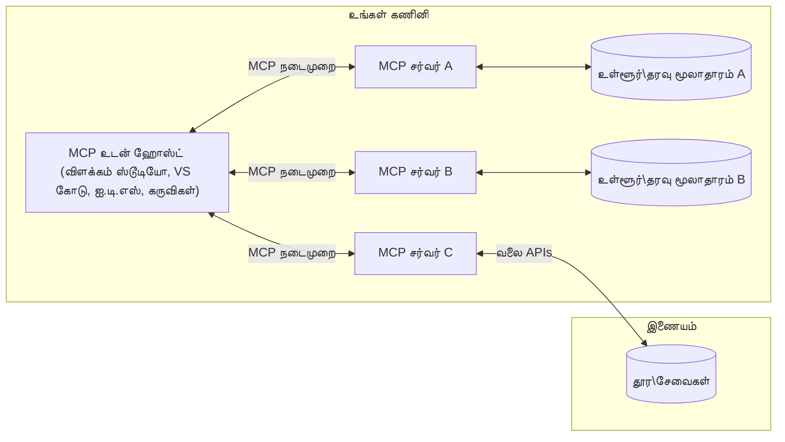

# MCP மெதோட்பொருள் கருத்துக்கள்: செயற்கை நுண்ணறிவுடன் ஒருங்கிணைப்பதற்கான மாதிரி சூழல் புரோட்டோகால் ஆற்றல்

[](https://youtu.be/earDzWGtE84)

_(இந்த பாடத்திட்டத்தின் காணொளியைக் காண மேலே உள்ள படத்தை கிளிக் செய்யவும்)_

[Model Context Protocol (MCP)](https://github.com/modelcontextprotocol) என்பது பெரிய மொழி மாதிரிகள் (LLMs) மற்றும் வெளியுறவுப் பொருட்கள், பயன்பாடுகள் மற்றும் தரவு மூலங்களுக்குள் தொடர்பு மேம்படுத்தும் சக்திவாய்ந்த, மாதிரிபடுத்தப்பட்ட கட்டமைப்பாகும்.  
இந்த கையேடு MCP-ன் முக்கிய கருத்துக்களை விளக்குகிறது. நீங்கள் இதன் கிளையண்ட்-சர்வர் அமைப்பு, அத்தியாவசிய கூறுகள், தொடர்பு முறைகள் மற்றும் செயலாக்க சிறந்த நடைமுறைகள் பற்றி அறிந்துகொள்பீர்கள்.

- **தனிப்பட்ட பயனர் அனுமதி**: அனைத்து தரவு அணுகலும் மற்றும் செயல்பாடுகளும் மேற்கொள்ளும்போது தெளிவான பயனர் அனுமதி அவசியம். பயனர்கள் எந்த தரவு அணுகப்படுகிறது, என்ன செயல்கள் மேற்கொள்ளப்படுகின்றன என்பதை தெளிவாக புரிந்துகொள்ள வேண்டும்; அனுமதிகள் மற்றும் அதிகாரங்களுக்கு துல்லியக் கட்டுப்பாடுகள் வழங்கப்பட வேண்டும்.

- **தரவு தனியுரிமை பாதுகாப்பு**: பயனர் தரவு தெளிவான அனுமதியோடு மட்டுமே வெளிப்படுத்தப்பட வேண்டும் மற்றும் முழுமையான தொடர்பு வாழ்க்கைச்சுற்று காலத்தில்ஆனால் உறுதியான அணுகல் கட்டுப்பாடுகள் மூலம் பாதுகாக்கப்பட வேண்டும். அனுமதி இல்லாத தரவு பரிமாற்றத்தைத் தடுப்பது கடமை.

- **கருவி செயல்பாட்டின் பாதுகாப்பு**: ஒவ்வொரு கருவி அழைப்பும் தெளிவான பயனர் அனுமதி தேவைப்படுகிறது, அந்த கருவியின் செயல்பாடு, அளவுருக்கள், மற்றும் சாத்தியமான தாக்கம் முழுமையாக புரிந்துகொள்ளப்பட வேண்டும். உறுதியான பாதுகாப்பு எல்லைகள் நிவாரணமற்ற, பாதுகாப்பற்ற அல்லது தீய அரவாண்மைக் கருவி செயல்பாட்டைத் தடுக்கும்.

- **சேவை பொருத்து பாதுகாப்பு**: அனைத்து தொடர்பு சேனல்கள் பொருத்தமான குறியாக்கம் மற்றும் அடையாளத் தேர்வு முறைகள் பயன்படுத்த வேண்டும். தொலைதூர இணைப்புகள் பாதுகாப்பான சேவை பொருத்து பிரოტோகால்களைப் பயன்படுத்துவதுடன் சரியான அடையாள நிர்வாகம் செய்யப்பட வேண்டும்.

#### செயலாக்க வழிகாட்டுதல்கள்:

- **அனுமதி மேலாண்மை**: பயனர்கள் எந்த சர்வர்கள், கருவிகள் மற்றும் வளங்களை அணுக முடியும் என்பதை நுட்பமாகக் கட்டுப்படுத்தும் அனுமதி அமைப்புகளை செயலாக்கவும்  
- **அடையாளம் மற்றும் அதிகார வழங்கல்**: பாதுகாப்பான அடையாளக் கண்டறிதல் முறைகள் (OAuth, API விசைகள்) மற்றும் பொருத்தமான டோக்கன் நிர்வகிப்பு மற்றும் காலாவதி  
- **உள்ளீடு சரிபார்த்தல்**: அனைத்து அளவுருக்கள் மற்றும் தரவு உள்ளீடுகளை வரையறுக்கப்பட்ட பின்வரிசைகளுக்கு ஏற்பச் சரிபார்க்கவும், ஊட்டச்சத்து தாக்குதல்களைத் தடுக்கும்  
- **விசாரணை பதிவுகள்**: அனைத்து செயல்பாடுகளின் விரிவான பதிவுகளை பாதுகாப்பு கண்காணிப்பு மற்றும் ஒழுங்குமுறை பூர்த்திக்கு காப்பாற்றவும்  

## மேற்பார்வை

இந்த பாடம் Model Context Protocol (MCP) சூழலை உருவாக்கும் அடிப்படை கட்டமைப்பு மற்றும் கூறுகளை ஆராய்கிறது. நீங்கள் கிளையண்ட்-சர்வர் கட்டமைப்பு, முக்கிய கூறுகள் மற்றும் MCP தொடர்பு இயந்திரங்களைப் பற்றி அறிந்து கொள்வீர்கள்.

## முக்கியக் கற்றல் குறிக்கோள்கள்

இந்த பாடத்தின் முடிவில், நீங்கள்:

- MCP கிளையண்ட்-சர்வர் கட்டமைப்பை புரிந்துகொள்ள முடியும்.  
- ஹோஸ்ட்கள், கிளையண்ட்கள் மற்றும் சர்வர்களின் பங்கு மற்றும் பொறுப்புகளை அடையாளம் காணலாம்.  
- MCP-யினை நெகிழ்வான ஒருங்கிணைப்புக் கட்டமாக்கும் முக்கிய அம்சங்களை சுற்றி ஆய்வு செய்யலாம்.  
- MCP சூழல் அமைப்பில் தகவல் எப்படி ஓடுகிறது என்பதைக் கற்றுக்கொள்ளலாம்.  
- .NET, ஜாவா, பைத்தான் மற்றும் ஜாவாஸ்கிரிப்ட் நிரல் உதாரணங்களைக் கொண்டு நடைமுறை அறிவை பெறலாம்.  

## MCP கட்டமைப்பு: ஆழ்ந்த பார்வை

MCP சூழல் திட்டம் கிளையண்ட்-சர்வர் முறைமையை அடிப்படையாகக் கொண்டுள்ளது. இந்த தொகுப்பு அமைப்பு செயற்கை நுண்ணறிவுப் பயன்பாடுகள் கருவிகள், தரவுத்தளங்கள், API-கள் மற்றும் சூழல் வளங்களுடன் திறமையாக தொடர்பு கொள்ள உதவுகிறது. இந்த கட்டமைப்பை அதன் முக்கிய கூறுகளாக பிரிப்போம்.

அதன் அடிப்படையில், MCP கிளையண்ட்-சர்வர் கட்டமைப்பை பின்பற்றுகிறது, இங்கு ஒரு ஹோஸ்ட் பயன்பாடு பல சர்வர்களுடன் இணைக்க முடியும்:


```mermaid
flowchart LR
    subgraph "உங்கள் கணினி"
        Host["MCP உடன் ஹோஸ்ட் (விளக்கம் ஸ்டூடியோ, VS கோடு, ஐ.டி.எஸ், கருவிகள்)"]
        S1["MCP சர்வர் A"]
        S2["MCP சர்வர் B"]
        S3["MCP சர்வர் C"]
        Host <-->|"MCP நடைமுறை"| S1
        Host <-->|"MCP நடைமுறை"| S2
        Host <-->|"MCP நடைமுறை"| S3
        S1 <--> D1[("உள்ளூர்\தரவு மூலாதாரம் A")]
        S2 <--> D2[("உள்ளூர்\தரவு மூலாதாரம் B")]
    end
    subgraph "இணையம்"
        S3 <-->|"வலை APIs"| D3[("தூர\சேவைகள்")]
    end
```

- **MCP ஹோஸ்ட்கள்**: MCP வழியாக தரவை அணுக விரும்பும் VSCode, Claude Desktop, IDEs அல்லது AI கருவிகள் போன்ற செயலிகள்  
- **MCP கிளையண்ட்கள்**: சர்வர்களுடன் 1:1 இணைப்புகளை பராமரிக்கும் புரோட்டோக்கால் கிளையண்ட்கள்  
- **MCP சர்வர்கள்**: ஒவ்வொருவரும் மாதிரி சூழல் புரோட்டோக்கால் வழியாக குறிப்பிட்ட திறன்களை வெளிப்படுத்தும் இலகுரக செயலிகள்  
- **உள் தரவு மூலங்கள்**: உங்கள் கணினியின் கோப்புகள், தரவுத்தளங்கள் மற்றும் MCP சர்வர்கள் பாதுகாப்புடன் அணுகக்கூடிய சேவைகள்  
- **தொலை சேவைகள்**: MCP சர்வர்கள் API-களின் மூலம் இணையத்தில் கிடைக்கும் வெளி அமைப்புகளுடன் இணைக்க முடியும்  

MCP புரோட்டோக்கால் காரியம் மாறும் நிலைமையில், தேதியைக் கொண்ட பதிப்பு முறையைப் பயன்படுத்துகிறது (YYYY-MM-DD வடிவில்). தற்போதைய புரோட்டோக்கால் பதிப்பு **2025-11-25** ஆகும். நீங்கள் [புரோட்டோக்கால் விவரக்குறிப்புகள்](https://modelcontextprotocol.io/specification/2025-11-25/) இல் சமீபத்திய புதுப்பிப்புகளை காணலாம்.

> ** எதிர்பார்க்கவும்:** அடுத்த பதிப்பு வகையமைப்புக்கான வெளியீட்டு வேதியாளர், **2026-07-28**, 2026 மே மாதம் அறிவிக்கப்பட்டு, 2026 ஜூலை 28 அன்று வெளியிட திட்டமிடப்பட்டுள்ளது. இது சேவை பொருத்து கட்டத்தில் நிலைத்தன்மையின்மை (initialize கைபிடி மற்றும் session ஐடிகளை அகற்றுதல்), விரிவாக்க உள்வட்டமைப்பை வழக்குமுறைப்படுத்துதல் மற்றும் புதுப்பித்த வடிவமைப்புகளுக்காக Roots, Sampling மற்றும் Logging ஆகியவற்றை தவிர்க்கிறது. முழு விவரங்களுக்கு [MCP இல் என்ன மாற்றுகிறது: 2026-07-28 வெளியீட்டு வேதியாளர்](./mcp-2026-07-28-release-candidate.md) ஐப் படியுங்கள்.

### 1. ஹோஸ்ட்கள்

Model Context Protocol (MCP)-ல், **ஹோஸ்ட்கள்** என்பது பயனர்கள் புரோட்டோக்கால் வழியாக தொடர்பு கொள்ளும் முதன்மை இடைமுகமாக செயல்படும் செயற்கை நுண்ணறிவு பயன்பாடுகள் ஆகும். ஹோஸ்ட்கள் பல MCP சர்வர்களுடன் இணைப்புகளை ஒருங்கிணைத்து நிர்வகிப்பதற்கும் ஒவ்வொரு சர்வர் இணைப்பிற்கும் தனித்துவமான MCP கிளையண்ட்களை உருவாக்கிக் கொள்கின்றன. ஹோஸ்ட் எடுத்துக்காட்டுகள்:

- **AI பயன்பாடுகள்**: Claude Desktop, Visual Studio Code, Claude Code  
- **வளரும் சூழல்கள்**: IDE கள் மற்றும் MCP ஒருங்கிணைப்பை கொண்ட குறியீட்டு தொகுப்பிகள்  
- **தனிப்பயன் பயன்பாடுகள்**: குறிப்பாக உருவாக்கப்பட்ட AI முகவர்கள் மற்றும் கருவிகள்  

**ஹோஸ்ட்கள்** AI மாதிரிகள் தொடர்புகளை ஒருங்கிணைக்கும் செயலிகள். அவை:

- **AI மாதிரிகளை ஒருங்கிணைக்கும்**: பதில்கள் உருவாக்க LLM-களை இயக்கவோ தொடர்பு கொள்ளவோ மற்றும் AI பணிச்சுழற்சிகளை ஒருங்கிணைப்பவோ  
- **கிளையண்ட் இணைப்புகளை நிர்வகிக்கும்**: ஒவ்வொரு MCP சர்வர் இணைப்பிற்கும் ஒரு MCP கிளையண்ட் உருவாக்கி பராமரிக்கும்  
- **பயனர் இடைமுகக் கட்டுப்பாடு**: உரையாடல் ஓட்டம், பயனர் தொடர்புகள் மற்றும் பதில்களின் காட்சியிடலை நிர்வகிக்கும்  
- **பாதுகாப்பு அமலாக்குதல்**: அனுமதிகள், பாதுகாப்பு கட்டுப்பாடு மற்றும் அடையாள நிரூபிப்பை கட்டுப்படும்  
- **பயனர் ஒப்புதலை கையாளுதல்**: தரவு பகிர்வு மற்றும் கருவி செயல்பாட்டுக்கான பயனர் அனுமதிகளை நிர்வகிக்கும்  

### 2. கிளையண்ட்கள்

**கிளையண்ட்கள்** என்பது ஹோஸ்ட்களுடனும் MCP சர்வர்களுடனும் தனித்த தனி இணைப்புகளை பராமரிக்கும் அத்தியாவசிய கூறுகள். ஒவ்வொரு MCP கிளையண்டும் குறிப்பிட்ட MCP சர்வருடன் இணைக்க ஹோஸ்ட் உருவாக்கும், இது அமைந்து வாயிலாக ஒழுங்குபடுத்தப்பட்ட, பாதுகாப்பான தொடர்பு சேனல் வாயிலாக செயல்படுகிறது. பல கிளையண்ட்கள் ஹோஸ்ட்களுக்குக் 동시에 பல இனப்படியாளர் சர்வர்களுடன் இணைய விடுவதாகும்.

**கிளையண்ட்கள்** என்பது ஹோஸ்ட் செயலியில் உள்ள இணைப்புக் கூறுகள். அவை:

- **புரோட்டோக்கால் தொடர்பு**: JSON-RPC 2.0 கோரிக்கைகளை சர்வர்களுக்கு அனுப்பி, பதிலடி மற்றும் வழிமுறைகளை வழங்கும்  
- **சாதனத் திறன் பேச்சுவார்த்தை**: துவங்கும் போதே சர்வர்களுடன் ஆதரவு அம்சங்களையும் புரோட்டோக்கால் பதிப்புகளையும் பேச்சுவார்த்தை செய்து ஒப்படைக்கும்  
- **கருவி செயல்பாடு**: மாதிரிகளிலிருந்து கருவி செயல்பாட்டு கோரிக்கைகளை நிர்வகித்தலும் பதில்களை செயலாக்கலும்  
- **நேரடி புதுப்பிப்புகள்**: சர்வர்களிடமிருந்து அறிவிப்புகள் மற்றும் நேரடி புதுப்பிப்புகளை கையாளல்  
- **பதில் செயலாக்கம்**: பயனர்களுக்கு காட்சி அளிக்க சர்வர் விடைகளை செயலி வடிவமைத்தல்  

### 3. சர்வர்கள்

**சர்வர்கள்** என்பது MCP கிளையண்ட்களுக்கு சூழல், கருவி மற்றும் திறன்களை வழங்கும் செயலிகள். அவை உள்ளகமாக (ஹோஸ்ட் இயந்திரத்தில்) அல்லது தொலைவில் (வெளிப்புற தளங்களில்) இயங்கி கிளையண்ட் கோரிக்கைகளை கையாளி கட்டமைக்கப்பட்ட பதில்களை வழங்கும். சர்வர்கள் மாதிரி சூழல் புரோட்டோக்கால் வழியாக குறிப்பிட்ட செயல்திறன்களை வெளிப்படுத்துகின்றன.

**சர்வர்கள்** என்பது சூழல் மற்றும் திறன்களை வழங்கும் சேவைகள். அவை:

- **அம்சப் பதிவு**: கிடைக்கும் முந்தைய அடிப்படைகளை (சேவைகள், பதிலடி, கருவிகள்) கிளையண்ட்களுக்கு பதிவு செய்து வெளிப்படுத்தும்  
- **கோரிக்கை செயலாக்கம்**: கருவி அழைப்புகள், வள கோரிக்கைகள் மற்றும் பதிலடி கோரிக்கைகளை பெறவும், செயல்படுத்தவும்  
- **சூழல் வழங்கல்**: மாதிரி பதில்களை மேம்படுத்த சூழல் தகவல் மற்றும் தரவுகளை வழங்குதல்  
- **நிலை நிர்வகிப்பு**: அவசியமான போதிலும் அமர்வுக் கட்டுப்பாடு மற்றும் நிலைத்த உறவுகளை கையாளுதல்  
- **நேரடி அறிவிப்பு**: அம்ச மாற்றங்கள் மற்றும் புதுப்பிப்புக்களை தொடர்புடைய கிளையண்ட்களுக்கு அறிவித்தல்  

சர்வர்கள் யாராலும் உருவாக்கப்படலாம், சிறப்பான செயல்பாடுகளுடன் மாதிரியின் திறன்களை விரிவடையச் செய்யலாம், மேலும் உள்ளக மற்றும் தொலை வழங்கல் நிலைகளும் தக்கவையாகவும் இருக்கின்றன.

### 4. சர்வர் அடிப்படைகள்

Model Context Protocol (MCP) சர்வர்கள் கிளையண்ட்கள், ஹோஸ்ட்கள் மற்றும் மொழி மாதிரிகள் இடையேயான வளமான தொடர்புக்கு அடிப்படையான அமைப்புகளான மூன்று முக்கிய **அடிப்படைகளை** வழங்குகின்றன. இந்த அடிப்படைகள் புரோட்டோகால் மூலம் கிடைக்கும் சூழல் தகவல் மற்றும் செயல்களை வரையறுக்கின்றன.

MCP சர்வர்கள் கீழ்க்காணும் மூன்று முக்கிய அடிப்படைகளை எந்தவொரு சேர்க்கையிலும் வெளிப்படுத்தலாம்:

#### வளங்கள்

**வளங்கள்** என்பது செயற்கை நுண்ணறிவு பயன்பாடுகளுக்கு சூழல் தகவலை வழங்கும் தரவுதளங்கள் ஆகும். அவைகள் மாதிரியின் புரிதல் மற்றும் முடிவு எடுப்பை மேம்படுத்தும் நியமிக்கப்பட்ட அல்லது இயக்கமான உள்ளடக்கங்களை குறிப்பதாகும்:

- **சூழலியல் தரவு**: AI மாதிரி பயன்பாட்டிற்கு கட்டமைக்கப்பட்ட தகவல்கள் மற்றும் சூழல்  
- **அறிவு தளங்கள்**: ஆவணக் களஞ்சியங்கள், கட்டுரைகள், கைபுத்தகங்கள் மற்றும் ஆராய்ச்சி ஆவணங்கள்  
- **உள்ளக தரவு மூலங்கள்**: கோப்புகள், தரவுத்தளங்கள் மற்றும் உள்ளக அமைப்பு தகவல்  
- **வெளியக தரவு**: API பதில்கள், வலை சேவைகள் மற்றும் தொலை அமைப்பு தரவு  
- **இயக்கமான உள்ளடக்கங்கள்**: வெளி சூழல் நிலைகளுக்கு ஏற்ப புதுப்பிக்கப்படும் நேரடி தரவு  

வளங்கள் URI-களால் அடையாளப்படுத்தப்படுகின்றன மற்றும் `resources/list`-ஐ வழியாக கண்டறியவும், `resources/read`-ஐ வழியாக வாசிக்கவும் உதவுகின்றன:

```text
file://documents/project-spec.md
database://production/users/schema
api://weather/current
```

#### பதிலடி

**பதிலடி** என்பவை மொழி மாதிரிகளுடன் தொடர்புகளை கட்டமைக்கும் பயன்பாட்டுக்கான மறுபயன்படுத்தக்கூடிய வார்ப்புருக்கள் ஆகும். இவை நிலையான தொடர்பு வடிவங்களையும் வார்ப்புரு அடிப்படையிலான பணிச்சுழற்சிகளையும் வழங்குகின்றன:

- **வார்ப்புரு அடிப்படையிலான தொடர்புகள்**: முன்கு வடிவமைக்கப்பட்ட செய்தி மற்றும் உரையாடல் தொடக்கங்கள்  
- **பணிச்சுழற்சி வார்ப்புருக்கள்**: பொதுவான பணிகளுக்கும் தொடர்புகளுக்கும் நிலையான வரிசைகள்  
- **சிறு எடுத்துக்காட்டு**: மாதிரி அறிவுறுத்தலுக்கான எடுத்துக்காட்டு அடிப்படையிலான வார்ப்புருக்கள்  
- **கணினி பதிலடி**: மாதிரி தாக்கத்தையும் சூழலையும் வரையறுக்கும் அடிப்படையியல் பதிலடி  
- **இயங்குபடும் வார்ப்புருக்கள்**: குறிப்பிட்ட சூழலுக்கு ஏற்ப மாற்றத்தக்க அளவுருக்கள் கொண்ட பதிலடி  

பதிலடிகளுக்கு மாறும் அளவுருக்கள் நிரப்பப்படுதல் ஆதரிக்கப்படுகின்றது, மேலும் `prompts/list` மூலம் கண்டறியவும், `prompts/get` மூலம் பெறவும் முடியும்:

```markdown
Generate a {{task_type}} for {{product}} targeting {{audience}} with the following requirements: {{requirements}}
```

#### கருவிகள்

**கருவிகள்** என்பது செயற்கை நுண்ணறிவு மாதிரிகள் குறிப்பிட்ட செயல்களை செய்ய அழைக்கக்கூடிய இயக்கக்கூடிய செயல்பாடுகள் ஆகும். அவை MCP சூழல் அமைப்பின் "வினைகளாக" இருந்தாலும்கூட, மாதிரிகள் வெளியுறவுக் கணினி அமைப்புகளுடன் தொடர்பு கொள்ள உதவுகின்றன:

- **இயக்கக்கூடிய செயல்பாடுகள்**: மாதிரிகள் குறிப்பிட்ட அளவுருக்கள் கொண்டு கூப்பிடக்கூடிய தனித்திட்ட செயல்கள்  
- **வெளியுறவு அமைப்பு இணைப்பு**: API அழைப்புகள், தரவுத்தள கேள்விகள், கோப்பு செயல்கள், கணக்கீடுகள்  
- **தனித்துவ அடையாளம்**: ஒவ்வொரு கருவிக்கும் தனி பெயர், விளக்கம் மற்றும் அளவுரு அமைப்பு உள்ளது  
- **கட்டமைக்கப்பட்ட உள்ளீடு/வெளியீடு**: கருவிகள் சரிபார்க்கப்பட்ட அளவுருக்களை ஏற்றிக் கொள்கின்றன மற்றும் கட்டமைக்கப்பட்ட, வகைப்படுத்தப்பட்ட பதில்களை வழங்குகின்றன  
- **செயல் திறன்கள்**: மாதிரிகள் நடைமுறை செயல்களை செய்ய மற்றும் நேரடி தரவுகளை பெற உதவுகின்றன  

கருவிகள் அளவுரு சரிபார்ப்பிற்கான JSON Schema உடன் வரையறுக்கப்படுகின்றன, `tools/list` மூலம் கண்டறியப்படுகின்றன, மற்றும் `tools/call` மூலம் இயக்கப்படுகின்றன. UIதிர்க்குத் திருத்தங்களுக்கும் சிறந்த விளக்கத்திற்கும் கருவிகளுக்கு **ஸ்தம்பங்கள் (icons)** சேர்க்கப்படலாம்.

**கருவி குறிப்பு**: கருவிகள் பார்த்துக்கொள்ள வேண்டிய நடைமுறை பண்புத்தன்மைகளை (எ.கா., `readOnlyHint`, `destructiveHint`) ஆதரிக்கின்றன, இதனால் கிளையண்ட்களுக்குத் தெளிவான கருவி செயல்பாட்டை முடிவு செய்ய உதவுகிறது.

கருவி எடுத்துக்காட்டு வரையறை:

```typescript
server.tool(
  "search_products", 
  {
    query: z.string().describe("Search query for products"),
    category: z.string().optional().describe("Product category filter"),
    max_results: z.number().default(10).describe("Maximum results to return")
  }, 
  async (params) => {
    // தேடலை செயல்படுத்து மற்றும் கட்டமைக்கப்பட்ட முடிவுகளை வழங்கு
    return await productService.search(params);
  }
);
```

## கிளையண்ட் அடிப்படைகள்

Model Context Protocol (MCP)-ல், **கிளையண்ட்** சார்பிலும் அடிப்படைகள் வழங்கப்படுகின்றன, அவை சர்வர்களுக்கு ஹோஸ்ட் செயலியில் இருந்து கூடுதல் திறன்கள் கோர அனுமதிக்கின்றன. இந்த கிளையண்ட் பக்கம் அடிப்படைகள் வளமான, குறைந்த பதிவுகள் கொண்ட சர்வர் செயலாக்கங்களை இயக்க மற்றும் செயற்கை நுண்ணறிவு திறன்களை அணுக அனுமதிக்கின்றன.

### மாதிரிப்படுதல்

> **முடிவடைய அறிவிப்பு:** `2026-07-28` பதிப்பு வெளியீட்டு வேதியாளர் மாதிரிப்படுதலை LLM வழங்குநர் API-களுடன் நேரடி ஒருங்கிணைப்பாக மாற்றுவதற்கான முறையில் முடிந்துள்ளதாகக் குறி சொல்கிறது. இது `2025-11-25` நாளுக்குள் மற்றும் குறைந்தது ஒரு ஆண்டிற்கு தொடர்ந்து செயல்படும், ஆனால் புதிய வடிவமைப்புகள் மாற்றியை முன்னுரிமை தரவேண்டும். முழு விவரத்திற்கு [MCP இல் என்ன மாற்றம்: 2026-07-28 வெளியீட்டு வேதியாளர்](./mcp-2026-07-28-release-candidate.md) பாருங்கள்.

**மாதிரிப்படுதல்** சர்வர்களுக்கு கிளையண்டின் AI பயன்பாட்டிலிருந்து மொழி மாதிரி நிறைவேற்றல்களை கோர அனுமதிக்கிறது. இந்த அடிப்படை சர்வர்களுக்குத் தங்கள் சொந்த மாதிரி சாராத அணுகலை ஏற்படுத்துகிறது:

- **மாதிரி சாராத அணுகல்**: சர்வர்கள் LLM SDK-களை உள்ளடக்காமல் அல்லது மாதிரி அணுகலை நிர்வகிக்காமல் நிறைவேற்றல்களை கோரலாம்  
- **சர்வர் துவக்க AI**: சர்வர்கள் தானாகவே கிளையண்டின் AI மாதிரியை பயன்படுத்தி உள்ளடக்கத்தை உருவாக்கும் திறன்  
- **மறுஉரை LLM தொடர்புகள்**: சம்பந்தப்பட்ட செயலாக்கங்களுக்கு AI உதவி தேவைப்படும் சிக்கலான சூழல் ஆதரம்  
- **இயங்குபடும் உள்ளடக்க உருவாக்கம்**: ஹோஸ்டின் மாதிரியைப் பயன்படுத்தி சூழலால் சார்ந்த பதில்களை உருவாக்கும் திறன்  
- **கருவி அழைப்பு ஆதரவு**: சர்வர்கள் `tools` மற்றும் `toolChoice` அளவுருக்களை சேர்த்து, கிளையண்டின் மாதிரி மாதிரிப்படுதலில் கருவிகளை அழைக்க முடியும்  

மாதிரிப்படுதல் `sampling/complete` முறையின் வழியாக துவங்கப்படுகிறது, இங்கு சர்வர்கள் நிறைவேற்றல் கோரிக்கைகளை கிளையண்டுக்கு அனுப்புகின்றன.

### ரூட்டுகள்

> **முடிவடைய அறிவிப்பு:** `2026-07-28` வெளியீட்டு வேதியாளர் ரூட்டுகளை கருவியின் அளவுருக்கள், வள URI-கள் அல்லது சர்வர் கட்டமைப்பிற்குப் பதிலாக முடித்துவிடுகிறது. இது `2025-11-25` நாளிலிருந்து தொடர்ந்தும் மற்றும் குறைந்தது ஒரு ஆண்டிற்குப் பிறகும் செயல்படும். முழு விவரங்களுக்கு [MCP இல் என்ன மாற்றுகிறது: 2026-07-28 வெளியீட்டு வேதியாளர்](./mcp-2026-07-28-release-candidate.md) பாருங்கள்.

**ரூட்டுகள்** சர்வர்களுக்கு கோப்பு அமைப்பு எல்லைகளை கிளையண்ட்கள் வெளிப்படுத்த ஒரு நிலையான முறையை வழங்குகின்றன, இது சர்வர்கள் எந்த அடைவுகளிலும் கோப்புகளிலும் அவதி உள்ளது என்பதை புரிந்துகொள்ள உதவுகிறது:

- **கோப்பு அமைப்பு எல்லைகள்**: சர்வர்கள் கோப்பு அமைப்பில் செயல்படும் எல்லைகளை வரையறுக்கும்  
- **அணுகல் கட்டுப்பாடு**: சர்வர்கள் எந்த அடைவுகளிலும் கோப்புகளிலும் அணுகலுக்கு அனுமதி உள்ளதோ என்பதை புரிந்து கொள்வது  
- **இயங்கும் புதுப்பிப்புகள்**: ரூட்டுகள் மாற்றப்பட்ட போது கிளையண்ட்கள் சர்வர்களுக்கு அறிவிக்கும்  
- **URI அடிப்படையிலான அடையாளம்**: ரூட்டுகள் `file://` URI-களை பயன்படுத்தி அணுகக்கூடிய அடைவுகளையும் கோப்புகளையும் அடையாளப்படுத்தும்  

ரூட்டுகள் `roots/list` முறையில் கண்டறியப்படுகின்றன, மாற்றம் ஏற்பட்டால் கிளையண்ட்கள் `notifications/roots/list_changed` அறிவிப்புகளை அனுப்புகின்றன.

### கேள்விப்பட்டல்  

**கேள்விப்பட்டல்** சர்வர்களுக்கு கிளையண்ட் இடைமுகத்தின் வழியாக பயனர்களிடமிருந்து கூடுதல் தகவல்கள் அல்லது உறுதிப்பாடுகளை கேட்டல் செய்ய உதவுகிறது:

- **பயனர் உள்ளீட்டு கோரிக்கைகள்**: கருவி செயல்பாட்டிற்கு தேவையான கூடுதல் தகவல்களை சர்வர்கள் கேட்கலாம்  
- **உறுதிப்படுத்தல் உரையாடல்கள்**: அ்திருட்டான அல்லது தாக்கம் உடைய செயல்களுக்காக பயனர் ஒப்புதலைக் கோருதல்  
- **இணைய பணிச்சுழற்சிகள்**: படிநிலை வழிகாட்டும் பயனர் தொடர்புகளை உருவாக்குவது  
- **இயங்குபடும் அளவுரு சேகரிப்பு**: கருவி செயல்பாட்டின் போது குறைத்து விடப்பட்டவோ விருப்பமானவோ ஆகிய அளவுருக்களை பெறுதல்  

கேள்விப்பட்டல் கோரிக்கைகள் `elicitation/request` முறையில் கிளையண்டின் இடைமுகத்துக்குள் பயனர் உள்ளீட்டை சேகரிக்க அனுப்பப்படுகின்றன.

**URL முறையின் கேள்விப்பட்டல்**: சர்வர்கள் URL அடிப்படையிலான பயனர் தொடர்புகளையும் கேட்க முடியும், இப்படியானவை பயனர்களை வெளி வலைப்பக்கங்களுக்கு வழிநடத்த, சான்றளிப்பு, உறுதிப்படுத்தல் அல்லது தரவுத்தேட்டிற்கு அனுப்ப பயன்படுத்தப்படலாம்.

### பதிவு
> **மறுப்பு அறிவிப்பு:** `2026-07-28` வெளியீடு வேட்பாளர்கள் stdio பரிமாற்றங்களுக்கு `stderr` மற்றும் கட்டமைக்கப்பட்ட பார்வைக்கு OpenTelemetry ஐ முன்னுரிமை அளிக்கும் வகையில் Logging ஐ மறுக்கப்படுகிறது என்று குறிக்கிறது. இது `2025-11-25` இல் மற்றும் மறுப்பு அறிவிப்புக்குப் பிறகு குறைந்தது ஒரு வருடம் வேலை செய்கிறது. பாருங்கள் [MCP இல் என்ன மாற்றம்: 2026-07-28 வெளியீடு வேட்பாளர்](./mcp-2026-07-28-release-candidate.md).

**Logging** சர்வர்களுக்கு டீபக்கிங், கண்காணிப்பு மற்றும் செயல்பாட்டு பார்வைக்கு கட்டமைக்கப்பட்ட பதிவு செய்திகளை கிளையண்டுகளுக்கு அனுப்ப அனுமதிக்கிறது:

- **டீபக்கிங் ஆதரவு**: தடைகள் தீர்க்க விரிவான செயலாக்க பதிவு வசதிகளை சர்வர்களுக்கு வழங்க
- **செயல்பாட்டு கண்காணிப்பு**: நிலை புதுப்பிப்புகள் மற்றும் செயல்திறன் அளவுகோல்களை கிளையண்டுகளுக்கு அனுப்பு
- **பிழை அறிக்கை**: விரிவான பிழை சூழல் மற்றும் நோயறிதல் தகவலை வழங்க
- **ஆடிட் தடங்கள்**: சர்வர் செயல்பாடுகள் மற்றும் முடிவுகளின் விரிவான பதிவுகளை உருவாக்கு

Logging செய்திகள் சர்வர் செயல்பாடுகளை வெளிப்படுத்த மற்றும் டீபக்கிங் எளிதாக்க கிளையண்டுகளுக்கு அனுப்பப்படுகிறது.

## MCP இல் தகவல் ஓட்டம்

மாடல் சமய கட்டமைப்பு நெறிமுறை (MCP) ஹோஸ்ட்கள், கிளையண்ட்கள், சர்வர்கள் மற்றும் மாடல்கள் இடையேயான கட்டமைக்கப்பட்ட தகவல் ஓட்டத்தைக் குறிக்கிறது. இந்த ஓட்டத்தைப் புரிந்துகொள்வது பயனர் கோரிக்கைகள் எப்படி செயலாக்கப்படுகின்றன மற்றும் எப்படி வெளிப்புற கருவிகள் மற்றும் தரவு மாடலின் பதிலில் ஒருங்கிணைக்கப்படுகின்றன என்பதை தெளிவுபடுத்த உதவும்.

- **ஹோஸ்ட் இணைப்பு துவக்கம்**  
  ஹோஸ்ட் பயன்பாடு (IDE அல்லது உரையாடல் முகப்பு போன்றவை) பொதுவாக STDIO, WebSocket அல்லது மற்ற ஆதரவு பெறும் பரிமாற்றத்தின் மூலம் MCP சர்வருக்கு இணைப்பை நிறுவுகிறது.

- **சாத்தியக்கூறுநிலை பேச்சுவார்த்தை**  
  கிளையண்ட் (ஹோஸ்டில் உட்படுத்தப்பட்ட) மற்றும் சர்வர் தங்கள் ஆதரவு பெறும் அம்சங்கள், கருவிகள், வளங்கள் மற்றும் நெறிமுறை பதிப்புகள் பற்றி தகவல் பரிமாற்றம் செய்கின்றன. இது இருபக்கமும் அந்த அம்சங்கள் அமர்ந்திருப்பதை உறுதி செய்யிறது.

- **பயனர் கோரிக்கை**  
  பயனர் ஹோஸ்டுடன் தொடர்பு கொள்கிறது (உதாரணமாக, ஒரு கேள்வி அல்லது கட்டளை உள்ளிடல்). ஹோஸ்ட் இந்த உள்ளீட்டை சேகரித்து செயலாக்க கிளையண்டுக்கு அனுப்புகிறது.

- **வளங்கள் அல்லது கருவி பயன்முறை**  
  - கிளையண்ட் மாடலின் புரிந்துகொள்ளுதலை செறிவூட்ட சர்வரிலிருந்து மேலதிக சூழல் அல்லது வளங்களை (கோப்புகள், தரவுத்தளம் பதிவுகள், அறிவியல் விதிகள் போன்றவை) கோரலாம்.  
  - மாடல் கருவி தேவைப்படும் போது (உதாரணமாக, தரவு எடுத்துக்கொள்ள, கணக்கிட, API அழைக்க) கிளையண்ட் கருவி அழைப்புக் கோரிக்கையை சர்வருக்கு அனுப்பி கருவி பெயர் மற்றும் அளவுருக்களை குறிப்பிடுகிறது.

- **சர்வர் செயலாக்கம்**  
  சர்வர் வளம் அல்லது கருவி கோரிக்கையை பெறுகிறது, தேவையான செயல்களை (ஊர்வலம் இயக்கல், தரவுத்தள விசாரணை, கோப்பு மீட்பு) செயல்படுத்தி தொகுப்புகளை கட்டமைக்கப்பட்ட வடிவத்தில் கிளையண்டுக்கு அனுப்புகிறது.

- **பதில் உருவாக்கம்**  
  கிளையண்ட் சர்வர் பதில்களை (வளத் தகவல், கருவி வெளியீடுகள்) தொடர்ச்சியான மாடல் தொடர்பில் ஒருங்கிணைக்கிறது. மாடல் இந்த தகவலைப் பயன்படுத்தி முழுமையான மற்றும் சூழலுக்கு பொருத்தமான பதிலை உருவாக்குகிறது.

- **பயனாளருக்கு முடிவுகளை வழங்கல்**  
  ஹோஸ்ட் கிளையண்ட் வழங்கும் இறுதி வெளியீட்டை பெறுகிறது மற்றும் பயனருக்கு காட்டுகிறது, பொதுவாக மாடல் உருவாக்கிய உரையும் கருவி இயக்கங்கள் அல்லது வள தேடலின் முடிவுகளும் இடம்பெறுகின்றன.

இந்த ஓட்டம் MCP இரு கருவிகளுடன் மற்றும் தரவுத்தளங்களுடன் மாடல்களை இணைத்து மேம்பட்ட, வரையறைவுடனான செயற்பாடுகளை ஆதரிக்க உதவுகிறது.

## நெறிமுறை கட்டமைப்பு மற்றும் அடுக்கு

MCP இரண்டு வித்தியாசமான கட்டமைப்பு அடுக்குகளை கொண்டுள்ளது, அவை முறையான தொடர்பு கட்டமைப்பை வழங்க ஒன்றோடொன்று இணைந்து வேலை செய்கின்றன:

### தரவு அடுக்கு

**தரவு அடுக்கு** முதன்மை MCP நெறிமுறையை **JSON-RPC 2.0** அடிப்படையாகக் கொண்டு செயல்படுத்துகிறது. இந்த அடுக்கு செய்தி கட்டமைப்பு, பொருள் மற்றும் தொடர்பு முறைப்பாட்டை வரையறுக்கிறது:

#### முக்கிய கூறுகள்:

- **JSON-RPC 2.0 நெறிமுறை**: அனைத்து தொடர்பு முறைகளும் நடைமுறைப்படுத்திய JSON-RPC 2.0 செய்தி வடிவத்தைக் கொண்டுள்ளது
- **வாழ்க்கைச் சுழற்சி மேலாண்மை**: கிளையண்ட்கள் மற்றும் சர்வர்கள் சந்திப்புக்கான தொடக்கம், அம்ச பேச்சுவார்த்தை மற்றும் அமர்வு முடிவுகளை நிர்வகிக்கிறது
- **சர்வர் அடிப்படை கூறுகள்**: கருவிகள், வளங்கள் மற்றும் வழிகாட்டுதல்களைக் கொண்டு முக்கிய செயல்பாடுகளை வழங்க சர்வர்களுக்கு அனுமதி
- **கிளையண்ட் அடிப்படை கூறுகள்**: LLM இலிருந்து எடுத்துக்காட்டுதல், பயனர் உள்ளீட்டை கேட்கல் மற்றும் பதிவை அனுப்பல் செயல்பாடுகளை சர்வர்கள் கோர இயலும்
- **நேரடி அறிவிப்புகள்**: விசாரணை இல்லாமல் சீரமைந்திருக்கும் புதுப்பிப்புகளுக்கான முறையற்ற அறிவிப்புகளை ஆதரிக்கிறது

#### முக்கிய அம்சங்கள்:

- **நெறிமுறை பதிப்பு பேச்சுவார்த்தை**: YYYY-MM-DD வடிவில் பதிப்பை உறுதி செய்ய பயன்படுகிறது
- **அம்ச கண்டுபிடிப்பு**: துவக்கத்தில் கிளையண்ட்கள் மற்றும் சர்வர்கள் ஆதரிக்கும் அம்சங்களை பரிமாற்றம் செய்கின்றன
- **நிலை மாறாத அமர்வுகள்**: ஒன்றுக்கு மேற்பட்ட தொடர்புகளுக்கு இடையேயான நிலைத்த நிலையைக் பராமரிக்கிறது

### பரிமாற்ற அடுக்கு

**பரிமாற்ற அடுக்கு** MCP பங்கேற்பாளர்களுக்கிடையேயான தொடர்பு சேனல், செய்தி தொகுப்பு மற்றும் அங்கீகாரத்தை நிர்வகிக்கிறது:

#### ஆதரவாகும் பரிமாற்ற முறைகள்:

1. **STDIO பரிமாற்றம்**:  
   - நேரடி செயல்முறை தொடர்புக்கான நிலையான உள்ளீடு/வெளியீடு ஸ்ட்ரீம்களைப் பயன்படுத்துகிறது  
   - அதே இயந்திரத்தின் உள்ளக செயல்முறைகளுக்கு மிகவும் சாதகமானது, எந்த வெப்தள ஓவர் ஹெடும் இல்லை  
   - உள்ளக MCP சர்வர் அமலாக்கங்களுக்காக பொதுவாக பயன்படுத்தப்படுகிறது

2. **நிரலைக் கொண்ட HTTP பரிமாற்றம்**:  
   - கிளையண்ட்-சர்வர் செய்திகளுக்கான HTTP POST ஐ பயன்படுத்துகிறது  
   - விருப்பமான Server-Sent Events (SSE) மூலம் சர்வர்-கிளையண்ட் ஸ்ட்ரீமிங்  
   - வலைப்பின்னல்களை கடக்க வெளி சர்வர் தொடர்பை மட்டும் செய்யும்  
   - நிலையான HTTP அங்கீகாரம் (Bearer குறியீடு, API விசைகள், தனிப்பட்ட தலைப்புகள்) ஆதரிக்கிறது  
   - MCP பாதுகாப்பான குறியீடு அடிப்படையிலான அங்கீகாரத்திற்கு OAuth ஐ பரிந்துரைக்கிறது

#### பரிமாற்ற சுருக்கம்:

பரிமாற்ற அடுக்கு தொடர்பு விவரங்களை தரவு அடுக்கிலிருந்து பிரித்தறுத்து JSON-RPC 2.0 செய்தி வடிவத்தை அனைத்து பரிமாற்ற முறைகளிலும் ஒரே மாதிரியாக அனுமதிக்கிறது. இது பயன்பாடுகளை உள்ளக மற்றும் வெளிநாட்டு சர்வர்களுக்கு இடையில் எளிதாக மாற்ற அனுமதிக்கிறது.

### பாதுகாப்பு கருதுகோல்கள்

MCP அமலாக்கங்கள் அனைத்து நெறிமுறை நடவடிக்கைகளிலும் பாதுகாப்பான, நம்பகமான மற்றும் பாதுகாப்பான தொடர்புகளை உறுதி செய்யும் முக்கிய பாதுகாப்பு கோட்பாடுகளை பின்பற்ற வேண்டும்:

- **பயனர் ஒப்புதல் மற்றும் கட்டுப்பாடு**: தரவு அணுகுதல் அல்லது செயல்பாடு நடைபெறுவதற்கு முன்னதாக பயனரின் தெளிவான ஒப்புதல் வேண்டும். எந்த தரவு பகிரப்படும் மற்றும் எந்த செயல்கள் அனுமதிக்கப்படும் என்பதை பயனர்களுக்கு சுத்தமான கட்டுப்பாடு வழங்கப்பட வேண்டும். செயல்பாடுகளை மதிப்பாய்வு மற்றும் அங்கீகாரம் செய்ய பயனர் இடைமுகங்கள் இருக்க வேண்டும்.

- **தரவு தனியுரிமை**: பயனர் தரவு தெளிவான ஒப்புதலுடன் மட்டுமே வெளிப்படுத்தப்பட வேண்டும் மற்றும் சூழல் அணுகல் கட்டுப்பாடுகளால் பாதுகாக்கப்பட வேண்டும். MCP செயலாக்கங்கள் அனுமதி இல்லாத தரவுப் பரிமாற்றங்களைத் தடுக்கும் மற்றும் அனைத்து தொடர்புகளிலும் தனியுரிமை பாதுகாப்பு உறுதி செய்ய வேண்டும்.

- **கருவி பாதுகாப்பு**: எந்த கருவியையும் பயன்படுத்துவதற்கு முன் தெளிவான பயனர் ஒப்புதல் தேவைப்படுகின்றது. ஒவ்வொரு கருவியின் செயல்பாடு பயனர்களால் தெளிவாக புரிந்துகொள்ளப்பட வேண்டும்; தவறான அல்லது பாதுகாப்பற்ற செயல்முறை நடக்கும் வாய்ப்பை தடுக்கும் கடுமையான பாதுகாப்பு எல்லைகள் அமுல்படுத்தப்பட வேண்டும்.

இந்த பாதுகாப்பு கொள்கைகளின் மூலம் MCP அனைத்து நெறிமுறை தொடர்புகளிலும் பயனர் நம்பிக்கை, தனியுரிமை மற்றும் பாதுகாப்பு காப்பாற்றப்படுகிறது மற்றும் சக்திவாய்ந்த AI ஒருங்கிணைப்புகளை முழுமையாக இயல்பாக்கிறது.

## குறியீட்டு உதாரணங்கள்: முக்கிய கூறுகள்

பின்வரும் பொதுவான மென்பொருள் மொழிகளில் முக்கிய MCP சர்வர் கூறுகளும் கருவிகளும் செயல்படுத்த எப்படி என்பது காட்டும் குறியீட்டு உதாரணங்கள் உள்ளன.

### .NET உதாரணம்: கருவிகளுடன் எளிய MCP சர்வர் உருவாக்குதல்

இங்கே ஒரு நடைமுறை .NET குறியீடு உள்ளது, இதில் தனிப்பயன் கருவிகளுடன் எளிய MCP சர்வர் உருவாக்குவது எவ்வாறு என்று காட்டப்பட்டுள்ளது. இது கருவிகளை வரையறுத்து பதிவு செய்வது, கோரிக்கைகளைக் கையாள்வது மற்றும் Model Context Protocol ஐப் பயன்படுத்தி சர்வரை இணைப்பது ஆகியவற்றை காட்சிப்படுத்துகிறது.

```csharp
using System;
using System.Threading.Tasks;
using ModelContextProtocol.Server;
using ModelContextProtocol.Server.Transport;
using ModelContextProtocol.Server.Tools;

public class WeatherServer
{
    public static async Task Main(string[] args)
    {
        // Create an MCP server
        var server = new McpServer(
            name: "Weather MCP Server",
            version: "1.0.0"
        );
        
        // Register our custom weather tool
        server.AddTool<string, WeatherData>("weatherTool", 
            description: "Gets current weather for a location",
            execute: async (location) => {
                // Call weather API (simplified)
                var weatherData = await GetWeatherDataAsync(location);
                return weatherData;
            });
        
        // Connect the server using stdio transport
        var transport = new StdioServerTransport();
        await server.ConnectAsync(transport);
        
        Console.WriteLine("Weather MCP Server started");
        
        // Keep the server running until process is terminated
        await Task.Delay(-1);
    }
    
    private static async Task<WeatherData> GetWeatherDataAsync(string location)
    {
        // This would normally call a weather API
        // Simplified for demonstration
        await Task.Delay(100); // Simulate API call
        return new WeatherData { 
            Temperature = 72.5,
            Conditions = "Sunny",
            Location = location
        };
    }
}

public class WeatherData
{
    public double Temperature { get; set; }
    public string Conditions { get; set; }
    public string Location { get; set; }
}
```

### ஜாவா உதாரணம்: MCP சர்வர் கூறுகள்

இந்த உதாரணம் முன்னணியில் உள்ள .NET உதாரணத்துடன் அதே MCP சர்வர் மற்றும் கருவி பதிவு செயல்பாட்டை ஜாவாவில் செயல்படுத்துகிறது.

```java
import io.modelcontextprotocol.server.McpServer;
import io.modelcontextprotocol.server.McpToolDefinition;
import io.modelcontextprotocol.server.transport.StdioServerTransport;
import io.modelcontextprotocol.server.tool.ToolExecutionContext;
import io.modelcontextprotocol.server.tool.ToolResponse;

public class WeatherMcpServer {
    public static void main(String[] args) throws Exception {
        // ஒரு MCP சேவையகத்தை உருவாக்கவும்
        McpServer server = McpServer.builder()
            .name("Weather MCP Server")
            .version("1.0.0")
            .build();
            
        // ஒரு வானிலை கருவியை பதிவு செய்யவும்
        server.registerTool(McpToolDefinition.builder("weatherTool")
            .description("Gets current weather for a location")
            .parameter("location", String.class)
            .execute((ToolExecutionContext ctx) -> {
                String location = ctx.getParameter("location", String.class);
                
                // வானிலை தரவை பெறவும் (எளிமைப்படுத்திய)
                WeatherData data = getWeatherData(location);
                
                // வடிவமைக்கப்பட்ட பதிலை திருப்பவும்
                return ToolResponse.content(
                    String.format("Temperature: %.1f°F, Conditions: %s, Location: %s", 
                    data.getTemperature(), 
                    data.getConditions(), 
                    data.getLocation())
                );
            })
            .build());
        
        // stdio பரிமாற்றத்தை பயன்படுத்தி சேவையகத்தை இணைக்கவும்
        try (StdioServerTransport transport = new StdioServerTransport()) {
            server.connect(transport);
            System.out.println("Weather MCP Server started");
            // செயல்முறை நிறுத்தப்படும் வரை சேவையகத்தை இயங்க வைத்திருங்கள்
            Thread.currentThread().join();
        }
    }
    
    private static WeatherData getWeatherData(String location) {
        // செயலாக்கம் வானிலை APIஐ அழைக்கும்
        // உதாரணத்துக்காக எளிமைப்படுத்தப்பட்டது
        return new WeatherData(72.5, "Sunny", location);
    }
}

class WeatherData {
    private double temperature;
    private String conditions;
    private String location;
    
    public WeatherData(double temperature, String conditions, String location) {
        this.temperature = temperature;
        this.conditions = conditions;
        this.location = location;
    }
    
    public double getTemperature() {
        return temperature;
    }
    
    public String getConditions() {
        return conditions;
    }
    
    public String getLocation() {
        return location;
    }
}
```

### பைதான் உதாரணம்: MCP சர்வரை கட்டமைத்தல்

இந்த உதாரணம் fastmcp பயன்படுத்துகிறது, தயவுசெய்து முதலில் அதை நிறுவியிருப்பதை உறுதி செய்யவும்:

```python
pip install fastmcp
```
குறியீட்டு மாதிரிகள்:

```python
#!/usr/bin/env python3
import asyncio
from fastmcp import FastMCP
from fastmcp.transports.stdio import serve_stdio

# ஒரு FastMCP சர்வரை உருவாக்கவும்
mcp = FastMCP(
    name="Weather MCP Server",
    version="1.0.0"
)

@mcp.tool()
def get_weather(location: str) -> dict:
    """Gets current weather for a location."""
    return {
        "temperature": 72.5,
        "conditions": "Sunny",
        "location": location
    }

# ஒரு வகுப்பு பயன்படுத்தி மாற்று அணுகுமுறை
class WeatherTools:
    @mcp.tool()
    def forecast(self, location: str, days: int = 1) -> dict:
        """Gets weather forecast for a location for the specified number of days."""
        return {
            "location": location,
            "forecast": [
                {"day": i+1, "temperature": 70 + i, "conditions": "Partly Cloudy"}
                for i in range(days)
            ]
        }

# வகுப்பு கருவிகளை பதிவு செய்தல்
weather_tools = WeatherTools()

# சர்வரை தொடங்கி வையுங்கள்
if __name__ == "__main__":
    asyncio.run(serve_stdio(mcp))
```

### ஜாவாஸ்கிரிப்ட் உதாரணம்: MCP சர்வர் உருவாக்குதல்

இந்த உதாரணம் MCP சர்வர் உருவாக்கத்தை ஜாவாஸ்கிரிப்டில் காட்டுகிறது மற்றும் இரண்டு வானிலை தொடர்பான கருவிகளை பதிவு செய்வதை விவரிக்கிறது.

```javascript
// அதிகாரப்பூர்வ Model Context Protocol SDK ஐ பயன்படுத்துதல்
import { McpServer } from "@modelcontextprotocol/sdk/server/mcp.js";
import { StdioServerTransport } from "@modelcontextprotocol/sdk/server/stdio.js";
import { z } from "zod"; // பண்புரு சோதனைக்காக

// ஒரு MCP சேவையகத்தை உருவாக்குக
const server = new McpServer({
  name: "Weather MCP Server",
  version: "1.0.0"
});

// ஒரு காலநிலை கருவியை வரையறு
server.tool(
  "weatherTool",
  {
    location: z.string().describe("The location to get weather for")
  },
  async ({ location }) => {
    // இது சாதாரணமாக ஒரு காலநிலை API கையாளும்
    // காட்சிப்படுத்த எளிமைப்படுத்தப்பட்டது
    const weatherData = await getWeatherData(location);
    
    return {
      content: [
        { 
          type: "text", 
          text: `Temperature: ${weatherData.temperature}°F, Conditions: ${weatherData.conditions}, Location: ${weatherData.location}` 
        }
      ]
    };
  }
);

// ஒரு முன்னெச்சரிக்கை கருவியை வரையறு
server.tool(
  "forecastTool",
  {
    location: z.string(),
    days: z.number().default(3).describe("Number of days for forecast")
  },
  async ({ location, days }) => {
    // இது சாதாரணமாக ஒரு காலநிலை API கையாளும்
    // காட்சிப்படுத்த எளிமைப்படுத்தப்பட்டது
    const forecast = await getForecastData(location, days);
    
    return {
      content: [
        { 
          type: "text", 
          text: `${days}-day forecast for ${location}: ${JSON.stringify(forecast)}` 
        }
      ]
    };
  }
);

// உதவி செயலிகள்
async function getWeatherData(location) {
  // API அழைப்பை மையச் செய்ய்க
  return {
    temperature: 72.5,
    conditions: "Sunny",
    location: location
  };
}

async function getForecastData(location, days) {
  // API அழைப்பை மையச் செய்ய்க
  return Array.from({ length: days }, (_, i) => ({
    day: i + 1,
    temperature: 70 + Math.floor(Math.random() * 10),
    conditions: i % 2 === 0 ? "Sunny" : "Partly Cloudy"
  }));
}

// stdio காப்புச்செலுத்தலைப் பயன்படுத்தி சேவையகத்தை இணைத்தல்
const transport = new StdioServerTransport();
server.connect(transport).catch(console.error);

console.log("Weather MCP Server started");
```

இந்த ஜாவாஸ்கிரிப்ட் உதாரணம் Model Context Protocol SDK ஐப் பயன்படுத்தி MCP சர்வரை உருவாக்கும் முறையை காட்டுகிறது. இதில் `weatherTool` மற்றும் `forecastTool` என்னும் இரண்டு கருவிகளை பதிவு செய்து, அவற்றை MCP கிளையண்டுகளுக்கு `StdioServerTransport` மூலம் வழங்குகிறது.

## பாதுகாப்பு மற்றும் அங்கீகாரம்

MCP பின்வரும் பாதுகாப்பு மற்றும் அங்கீகாரத்தை நிர்வகிக்கும் பல உள்ளமைக்கப்பட்ட கொள்கைகள் மற்றும் இயந்திரங்களை கொண்டுள்ளது:

1. **கருவி அனுமதி கட்டுப்பாடு**:  
  மாதிரிக்கு ஒரு அமர்வு போது எந்த கருவியை பயன்படுத்த அனுமதிக்கிறார்கள் என்பதை கிளையண்ட்கள் குறிப்பிடலாம். இது தெளிவாக அங்கீகரிக்கப்பட்ட கருவிகள் மட்டுமே அணுகப்படுவதை உறுதி செய்து தவறான அல்லது பாதுகாப்பற்ற செயல்களை குறைக்க உதவுகிறது. அனுமதிகள் பயனர் விருப்பங்கள், அமைப்பின் கொள்கைகள் அல்லது தொடர்பு சூழல் அடிப்படையில் பரிமாற்றப்படலாம்.

2. **அங்கீகாரம்**:  
  கருவிகள், வளங்கள் அல்லது உணர்ச்சி செயல்பாடுகளுக்கு அணுக அனுமதிக்க முன் சர்வர்கள் அங்கீகாரம் கோரலாம். இது API விசைகள், OAuth குறியீடுகள் அல்லது மற்ற அங்கீகார முறைகள் மூலம் நடக்கலாம். சரியான அங்கீகாரம் நம்பகமான கிளையண்ட்கள் மற்றும் பயனர்களுக்கு மட்டுமே சர்வர் திறன்களை அழைக்க அனுமதிக்கிறது.

3. **செல்லற் சரிபார்ப்பு**:  
  அனைத்து கருவி அழைப்புகளுக்கும் அளவுரு சரிபார்ப்பு கடுமையாக அமுல்படுத்தப்படுகிறது. ஒவ்வொரு கருவியும் அதன் அளவுருக்களுக்கு எதிர்பார்க்கப்படும் வகைகள், வடிவங்கள் மற்றும் வரம்புகளை வரையறுக்கிறது, சர்வர் வரும் கோரிக்கைகளை அதன்படி பரிசோதிக்கிறது. இது தவறான அல்லது தீங்கான உள்ளீட்டின் கருவி செயல்பாட்டுக்குள் செல்ல தடுக்கும் மற்றும் செயல்பாட்டின் நம்பகத்தன்மையை பேண உதவும்.

4. **அளவிடும் வரம்பு**:  
  சர்வர் வளங்களின் தவறான பயன்பாடுகளைத் தடுக்கும் மற்றும் நியாயமான பயன்பாட்டை உறுதி செய்ய MCP சர்வர்கள் கருவி அழைப்புகளுக்கும் வள அணுகலுக்கும் அளவிடும் வரம்பிடலை செயல்படுத்தலாம். இது பயனர், அமர்வு அல்லது உலகளவில் அமல்படுத்தப்படலாம் மற்றும் சேவை மறுத்தல் தாக்குதல் அல்லது அதிக வள பயன்பாட்டைத் தடுக்க உதவும்.

இவை அனைத்தையும் ஒன்றிணைத்து MCP வெளிப்புற கருவிகள் மற்றும் தரவு ஆதாரங்களுடன் மொழி மாதிரிகளை பாதுகாப்பாக ஒருங்கிணைக்கும் அடித்தளத்தை வழங்குகிறது, மேலும் பயனர்கள் மற்றும் மேம்பாட்டாளர்களுக்கு அணுகல் மற்றும் பயன்பாட்டில் எடைப்பதிவைக் கொடுகிறது.

## நெறிமுறை செய்திகள் மற்றும் தொடர்பு ஓட்டம்

MCP தொடர்பு உறுதிப்படுத்தப்பட்ட மற்றும் நம்பகமான தொடர்புகளுக்கான கட்டமைக்கப்பட்ட **JSON-RPC 2.0** செய்திகளைக் கொண்டு நடக்கிறது. வெவ்வேறு செயல்பாடுகளுக்கான குறிப்பிட்ட செய்தி மாதிரிகள் வரையறுக்கப்பட்டுள்ளன:

### முக்கிய செய்தி வகைகள்:

#### **துவக்கக் செய்திகள்**
- **`initialize` கோரிக்கை**: இணைப்பைப் நிறுவி நெறிமுறை பதிப்பையும் அம்சங்களையும் பேச்சுவார்த்தை செய்கிறது
- **`initialize` பதில்**: ஆதரவு பெறும் அம்சங்கள் மற்றும் சர்வர் தகவலை உறுதிப்படுத்துகிறது  
- **`notifications/initialized`**: துவக்கம் முடிந்து அமர்வு தயார் என்ற அறிகுறி

#### **கண்டறிதல் செய்திகள்**
- **`tools/list` கோரிக்கை**: சர்வரிலுள்ள கருவிகளை கண்டறிதல்
- **`resources/list` கோரிக்கை**: வள (தரவு மூலங்கள்) பட்டியலை பெறல்
- **`prompts/list` கோரிக்கை**: பயன்படுத்தக்கூடிய முன்மாதிரி வார்த்தைகள் பட்டியலை பெறல்

#### **செயலாக்கம் செய்திகள்**  
- **`tools/call` கோரிக்கை**: கொடுக்கப்பட்ட அளவுருக்களுடன் குறிப்பிட்ட கருவியை இயக்குதல்
- **`resources/read` கோரிக்கை**: குறிப்பிட்ட வளத்திலிருந்து உள்ளடக்கம் பெறுதல்
- **`prompts/get` கோரிக்கை**: விருப்ப அளவுருக்களுடன் முன்மாதிரி வார்த்தையை பெற்றல்

#### **கிளையண்ட் பக்கம் செய்திகள்**
- **`sampling/complete` கோரிக்கை**: சர்வர் LLM முடிவுகளை கிளையண்டிடமிருந்து கோருகிறது
- **`elicitation/request`**: சர்வர் கிளையண்ட் இடைமுகம் மூலம் பயனர் உள்ளீடுகளை கோருகிறது
- **Logging செய்திகள்**: சர்வர் கட்டமைக்கப்பட்ட பதிவு செய்திகளை கிளையண்டுக்கு அனுப்புகிறது

#### **அறிவிப்பு செய்திகள்**
- **`notifications/tools/list_changed`**: கருவி மாற்றங்களை சர்வர் கிளையண்டுக்கு அறிவிக்கிறது
- **`notifications/resources/list_changed`**: வள மாற்றங்களை சர்வர் கிளையண்டுக்கு அறிவிக்கிறது  
- **`notifications/prompts/list_changed`**: முன்மாதிரி வார்த்தை மாற்றங்களை சர்வர் கிளையண்டுக்கு அறிவிக்கிறது

### செய்தி கட்டமைப்பு:

எல்லா MCP செய்திகள் JSON-RPC 2.0 வடிவத்தின்படி பின்வருபவை:
- **கோரிக்கை செய்திகள்**: `id`, `method`, மற்றும் விருப்பமான `params` கொண்டவை
- **பதில் செய்திகள்**: `id` மற்றும் `result` அல்லது `error` கொண்டவை  
- **அறிவிப்பு செய்திகள்**: `method` மற்றும் விருப்பமான `params` கொண்டவை (`id` அல்லது பதில் எதிர்பார்க்கப்படாது)

இந்த கட்டமைக்கப்பட்ட தொடர்பு வலுவுயர்ந்த, பின்தொடரப்படக்கூடிய மற்றும் விரிவாக்கக்கூடிய தொடர்புகளை உறுதி செய்து நேரடி புதுப்பிப்புகள், கருவி தொடுப்பு, மற்றும் தீர்மானமான பிழை கையாளல் போன்ற உயர்ந்த கட்டளைகளை ஆதரிக்கிறது.

### பணிகள் (சோதனை)

> **எதிர்காலம் நோக்கிக் காண்க:** `2026-07-28` வெளியீடு வேட்பாளர் பணிகளை (Tasks) சோதனை மூலமான முதன்மை விவரத்திலிருந்து தனித்துக் கொண்ட ஒரு பணிக்கூட்டம் நீக்கப்பட்ட புதிய வாழ்க்கைச் சுழற்சி (`tasks/get`, `tasks/update`, `tasks/cancel`; `tasks/list` நீக்கப்பட்டது) உடன் மாற்றுகிறது. கீழே விளக்கப்பட்ட சோதனை API அடிப்படையில் நீங்கள் கட்டுமானம் செய்தால், மாற்றத் திட்டமிடவும். பாருங்கள் [MCP இல் என்ன மாற்றம்: 2026-07-28 வெளியீடு வேட்பாளர்](./mcp-2026-07-28-release-candidate.md).

**பணிகள்** என்பது நீடித்த செயலாக்க பிரெகிகள் வழங்கும் சோதனை அம்சமாகும், இது MCP கோரிக்கைகளுக்கான முடிவுகளை தாமதமாக மீட்டெடுக்கவும் நிலை கண்காணிப்பையும் செய்கிறது:

- **நீண்டகால செயல்பாடுகள்**: உயர்ந்த கணக்கீடு, வேலைப்பாட்டியல் தானியங்கி மற்றும் தொகுப்பு செயலாக்கங்களை கண்காணிக்க
- **தாமதமடைந்த முடிவுகள்**: பணியின் நிலையை கண்காணித்து செயல்பாடு முடிந்தபோது முடிவுகளை மீட்டெடுக்க
- **நிலைக் கண்காணிப்பு**: வரையறுக்கப்பட்ட வாழ்க்கைச் சுழற்சி நிலைகளின் மூலம் பணியின் முன்னேற்றத்தை கண்காணிக்க
- **பன்முக செயல்பாடுகள்**: பல தொடர்புக்களில் பரந்து விரிந்த சிக்கலான வேலைப்பாடுகளை ஆதரிக்க

பணிகள் உடனடி முடிவுகள் இல்லாத செயல்பாடுகளுக்கு மாற்றுக்கால செயலாக்க முறைமைகளை இயக்கும் முறையாக MCP கோரிக்கைகளை சுற்றி அமைக்கப்படுகின்றன.

## முக்கியக் குறிக்கோள்கள்

- **கட்டமைப்பு**: MCP ஹோஸ்ட்கள் பல கிளையண்ட் இணைப்புகளை சர்வர்களுக்கு நிர்வகிக்கும் கிளையண்ட்-சர்வர் கட்டமைப்பைக் கொண்டுள்ளது
- **பங்கேற்பாளர்கள்**: சூழல் ஹோஸ்ட்கள் (AI பயன்பாடுகள்), கிளையண்ட்கள் (நெறிமுறை இணைப்பிகள்), சர்வர்கள் (அம்ச வழங்குநர்கள்)
- **பரிமாற்ற முறைகள்**: தொடர்பு STDIO (உள்ளக) மற்றும் Streamable HTTP உடன் SSE விருப்ப (வெளி) ஆகியவற்றை ஆதரிக்கின்றது
- **முக்கிய அடிப்படை கூறுகள்**: சர்வர்கள் கருவிகள் (நடத்தியிடக்கூடிய செயல்பாடுகள்), வளங்கள் (தரவு மூலங்கள்), மற்றும் வழிகாட்டுதல்களை (teamplates) வெளிப்படுத்துகின்றனர்
- **கிளையண்ட் அடிப்படை கூறுகள்**: சர்வர்கள் எடுத்துக்காட்டுதல் (கருவி அழைக்கும் ஆதரவுடன் LLM நிறைவேற்றல்), உள்ளீடு கேட்கல் (URL முறை உட்பட), ரூட்டுகள் (கோப்பு அமைப்பு எல்லைகள்), மற்றும் பதிவுகளை கிளையண்டுகளிடமிருந்து கோரலாம்
- **சோதனை அம்சங்கள்**: பணிகள் நீண்டகால செயல்பாடுகளுக்கு நீடித்த செயலாக்க பிரெகிகளை வழங்குகின்றன
- **நெறிமுறை அடித்தளம்**: தேதி அடிப்படையிலான பதிப்புடன் JSON-RPC 2.0 இல் கட்டமைக்கப்பட்டது (தற்போதைய பதிப்பு: 2025-11-25)
- **நேரடி சாத்தியங்கள்**: இயக்கம் புதுப்பிப்புகள் மற்றும் நேரடி ஒத்திசைவை ஆதரிக்கிறது
- **பாதுகாப்பு முதலில்**: தெளிவான பயனர் ஒப்புதல், தரவு தனியுரிமை பாதுகாப்பு மற்றும் பாதுகாப்பான பரிமாற்றம் முக்கிய தேவைகள்

## பயிற்சி

உங்கள் துறையில் பயனுள்ள எளிய MCP கருவி ஒன்றை வடிவமைக்கவும். வரையறுக்கவும்:
1. கருவி பெயர் என்னவாக இருக்கும்
2. எந்த அளவுருக்களை ஏற்றுக் கொள்வது
3. என்ன வெளியீட்டை வழங்கும்
4. மாடல் பயனர் பிரச்சினைகளை தீர்க்க இந்த கருவியை எப்படி பயன்படுத்தலாம்


---

## அடுத்து என்ன

அடுத்து: [அத்தியாயம் 2: பாதுகாப்பு](../02-Security/README.md)
2025-11-25 அன்று பிறகு என்ன வருகிறது என்று ஆர்வமாக இருக்கிறீர்களா? [MCP இல் என்ன மாற்றம் வருகிறது: 2026-07-28 வெளியீடு வேட்பாளர்](./mcp-2026-07-28-release-candidate.md) ஐ படியுங்கள்.

---

<!-- CO-OP TRANSLATOR DISCLAIMER START -->
**மறுப்பு**:
இந்த ஆவணம் AI மொழிபெயர்ப்பு சேவை [Co-op Translator](https://github.com/Azure/co-op-translator) பயன்படுத்தி மொழிபெயர்க்கப்பட்டுள்ளது. நாங்கள் துல்லியத்திற்காக முயற்சி செய்துள்ளோம், ஆனால் தானாக செய்யப்படும் மொழிபெயர்ப்புகளில் பிழைகள் அல்லது தவறுகள் இருக்கலாம் என்பதை கவனத்தில் கொள்ளவும். அசல் ஆவணம் அதன் தாய்மொழியில் அதிகாரப்பூர்வ ஆதாரமாக கருதப்பட வேண்டும். முக்கியமான தகவல்களுக்கு, தொழில்நுட்பமான மனித மொழிபெயர்ப்பு பரிந்துரைக்கப்படுகிறது. இந்த மொழிபெயர்ப்பைப் பயன்படுத்துவதால் ஏற்படும் எந்த தவறான புரிதல்கள் அல்லது தவறான விளக்கத்திற்கும் நாங்கள் பொறுப்பில்வில்லை.
<!-- CO-OP TRANSLATOR DISCLAIMER END -->