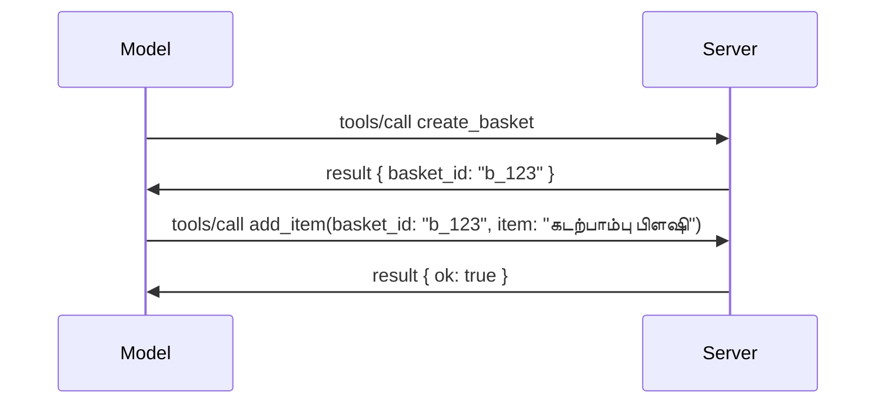

# MCP இல் என்ன மாற்றம் இருக்கிறது: 2026-07-28 வெளியீட்டு வேட்பாளர்

> **நிலை:** வெளியீட்டு வேட்பாளர். `2026-07-28` விவரக்குறிப்பு எழுதும் பொழுது இறுதி நிலைவில் இல்லை. இது 2026 மே 21 அன்று அறிவிக்கப்பட்டது மற்றும் 2026 ஜூலை 28 அன்று வெளியிட திட்டமிடப்பட்டுள்ளது. இந்த பாடத்தில் உள்ள அனைத்தும் வெளியீட்டு வேட்பாளரை விவரிக்கின்றன; அதற்கு எதிராக நீங்கள் கட்டமைக்க முன்னர் சமீபத்திய நிலைமைக்கான [வரைவுத் தொகுப்பு](https://modelcontextprotocol.io/specification/draft) மற்றும் அதன் [மாற்றக் குறிப்பு](https://modelcontextprotocol.io/specification/draft/changelog) பாருங்கள். இந்த படிப்பு தொடர் தற்போது நிலையான வெளியீட்டு, **MCP விவரக்குறிப்பு 2025-11-25** மீது எழுதப்பட்டு உள்ளது, `2026-07-28` வெளியிடப்பட்ட பிறகு புதுப்பிக்கப்படும்.

## ஒவ்வோவே பார்வை

`2026-07-28` MCP வெளியீட்டுப் பிறகு terbesar திருத்தம் ஆகும். ஆறு விவரக்குறிப்பு மேம்பாட்டு முன்மொழிவுகள் (SEPகள்) சாம்பிளிங் நிலைகளை நீக்கி MCPஐ பரிமாற்ற அடுக்கு லாரில் நிலைகாணாதவையாக ஆக்குகின்றன, நீட்டிப்புகள் முதல் கூடுதல் வகுப்பு மற்றும் பதிப்பு கொண்ட அமைப்பாக மாறுகின்றன மற்றும் இந்த படிப்பில் முன்பு கற்றுக் கொண்ட சில அம்சங்கள் (ரூட்ஸ், சாம்பிளிங், பதிவு) புதிய ஆயுள் கொள்கையின் கீழ் பழையவையாக அறிவிக்கப்படுகின்றன. இந்த பாடம் என்ன மாற்றம், ஏன் அது முக்கியம் மற்றும் `2025-11-25`க்கு எதிராக நீங்கள் ஏற்கனவே எழுதிய குறியீட்டிற்கு இதன் பொருள் என்ன என்பதை சுருக்கமாக கூறுகிறது.

மூலம்: [2026-07-28 MCP விவரக்குறிப்பு வெளியீட்டு வேட்பாளர்](https://blog.modelcontextprotocol.io/posts/2026-07-28-release-candidate/) (Model Context Protocol பிளாக், டேவிட் சோரியா பார்ரா மற்றும் டென் เดளிமார்ஸ்கி).

## கற்றல் நோக்கங்கள்

இந்த பாடம் முடிவில், நீங்கள் திறன் பெறுவீர்கள்:

- MCP எதற்காக நிலைகாணாத நெறிமுறை மையத்துக்குச் செல்கிறது மற்றும் இது செங்குத்தாக விரிந்த பிறழ்வு அமைப்புகளில் என்ன பிரச்சினையை தீர்க்கிறது என்பதைக் விளக்கவும்.
- `initialize`/`initialized` கைசந்திக்கும் முறையும் `Mcp-Session-Id` ஹெடரும் எப்படி மாற்றம் கொடுத்துள்ளன என்பதைக் கூறவும்.
- புதிய `Mcp-Method` மற்றும் `Mcp-Name` ஹெடர்கள் மற்றும் `ttlMs`/`cacheScope` கேச்சிங் மெட்டாடேட்டாவைப் பரிசீலிக்கவும்.
- நீட்டிப்புகள் வடிவமைப்பையும் இந்த வெளியீட்டுடன் வழங்கப்படும் இரண்டு நீட்டிப்புகளையும் (MCP Apps மற்றும் Tasks) அடையாளம் காணவும்.
- OAuth 2.0 / OIDC ஒத்திசைவை வலுப்படுத்தும் ஆறு அனுமதி SEPகளை பட்டியலிடவும்.
- எந்த மைய அம்சங்கள் (ரூட்ஸ், சாம்பிளிங், பதிவு) இப்போது பழையவையாக உள்ளன மற்றும் அது நடைமுறையில் என்ன பொருள் என்பதைக் கண்டறியவும்.
- கருவி `inputSchema`/`outputSchema`க்கான முழுமையான JSON சக்கீமா 2020-12 மாற்றத்தை விளக்கவும்.

## நிலைகாணாத நெறிமுறை

முதன்மை மாற்றம்: MCP நெறிமுறை அடைப்பில் நிலைகாணாததாக மாறுகிறது.

### முன்பு (2025-11-25): அமர்வுக்கள் ஒரே சேவையக உதாரணத்துடன் அச்சிடும்

Streamable HTTP மூலம் கருவியை அழைக்கும் பொழுது `initialize` கைசந்தி ஆரம்பிக்கிறது. சேவையகம் அதற்குப் பதிலாக ஒவ்வொரு அடுத்தக்கூட்டிய கோரிக்கையிலும் கொண்டு செல்ல வேண்டிய `Mcp-Session-Id` ஹெடரை அனுப்புகிறது:

```http
POST /mcp HTTP/1.1
Mcp-Session-Id: 1868a90c-3a3f-4f5b
Content-Type: application/json

{"jsonrpc":"2.0","id":2,"method":"tools/call",
 "params":{"name":"search","arguments":{"q":"otters"}}}
```
  
அமர்வு அதை வழங்கிய எந்த ஒரு சேவையக உதாரணத்துக்கும் கட்டுப்பட்டிருக்கும் காரணத்தால், செங்குத்தாக விரிந்த அமைப்புகளுக்கு **விபரிப்பு வழிமுறையினை** (sticky routing) மற்றும் உதாரணங்களுக்கிடையே **பகிரப்பட்ட அமர்வு கடை** தேவைப்படுகிறது.

### பின் (2026-07-28): ஒவ்வொரு கோரிக்கும் தன்னிச்சையானது

```http
POST /mcp HTTP/1.1
MCP-Protocol-Version: 2026-07-28
Mcp-Method: tools/call
Mcp-Name: search
Content-Type: application/json

{"jsonrpc":"2.0","id":1,"method":"tools/call",
 "params":{"name":"search","arguments":{"q":"otters"},
           "_meta":{"io.modelcontextprotocol/clientInfo":{"name":"my-app","version":"1.0"}}}}
```
  
எந்த சேவையக உதாரணமும் இந்த கோரிக்கையை கையாளக்கூடும். முக்கிய மாற்றங்கள்:

- **`initialize`/`initialized` கைசந்தி நீக்கப்பட்டது** ([SEP-2575](https://github.com/modelcontextprotocol/modelcontextprotocol/pull/2575)). நெறிமுறை பதிப்பு, கிளையண்ட் தகவல், மற்றும் கிளையண்ட் திறன்கள் ஒவ்வொரு கோரிக்கும் `_meta` இல் செல்கின்றன. புதிய `server/discover` முறை பண்டியாளருக்கு முன்னதாக சேவையக திறன்களை பெற உதவுகிறது.
- **`Mcp-Session-Id` ஹெடரும் நெறிமுறை நிலை அமர்வும் நீக்கப்பட்டது** ([SEP-2567](https://github.com/modelcontextprotocol/modelcontextprotocol/pull/2567)). நெறிமுறை அடிப்படையில் விபரிப்பு வழிமுறை மற்றும் பகிரப்பட்ட அமர்வு கடைகள் தேவை இல்லை.

### நிலைகாணாத நெறிமுறை, நிலைசார் பயன்பாடுகள்

நெறிமுறை அடிப்படையில் அமர்வை நீக்குவது உங்கள் சேவையகம் நிலைசாராய் இருக்க முடியாது என்று பொருள் இல்லை. பரிந்துரைக்கப்படும் நடைமுறை HTTP APIகள் எப்போதும் பின்பற்றும் அலக்கலை தான்: ஒரு கருவி அழைப்பிலிருந்து (உதாரணமாக, `basket_id`, `browser_id`) ஒரு சுட்டியினை உருவாக்கி, பின்னர் அதைக் கடந்த அழைப்பில்கள் வழியாக சாதாரண கூறாக மாடலை அனுப்புங்கள்.


  
இது மாநிலத்தை மறைத்து வைப்பதற்குப் பதிலாக மாடலுக்குப் பிரதி அளவிலும் விளக்கமாக்கும் மற்றும் எந்த சேவையக உதாரணமும் எந்த அழைப்பையும் கையாளக்கூடியதாக இருக்கும்.

### சேவையகம்-மூலமாகும் கோரிக்கைகள் மறுசீரமைப்பு

நிலைகாணாத நெறிமுறைக்கு நடுவில் (mid-call) சேவையகம் கிளையண்டைப் புறப்படுத்தி ஏதோ கோருவதற்கான வழி இன்னும் தேவை:

- **சேவையகம் தொடங்கும் கோரிக்கைகள் சேவையகம் தற்போது கிளையண்ட் கோரிக்கையை செயலாக்கும் பொழுதே மட்டுமே விடுபடும்** ([SEP-2260](https://github.com/modelcontextprotocol/modelcontextprotocol/pull/2260)) — முன்னால் பரிந்துரைக்கும் நிலையில் இருந்தது, இப்போது தேவை. பயனர் எதுவும் திடீரென கேட்கப்பட மாட்டான்.
- **பல சுற்றுலா கோரிக்கைகள்** ([SEP-2322](https://github.com/modelcontextprotocol/modelcontextprotocol/pull/2322)) ஒரு SSE ஸ்ட்ரீம் திறந்துவைக்கும் மாற்றமாகும். அதன் பதிலாக, சேவையகம் `InputRequiredResult` ஐ திருப்பி விடுகிறது:

  ```json
  {
    "resultType": "inputRequired",
    "inputRequests": {
      "confirm": {
        "type": "elicitation",
        "message": "Delete 3 files?",
        "schema": { "type": "boolean" }
      }
    },
    "requestState": "eyJzdGVwIjoxLCJmaWxlcyI6WyJhIiwiYiIsImMiXX0="
  }
  ```
  
கிளையண்ட் பதில்களை திரட்டிக் கொண்டு `inputResponses` மற்றும் `requestState` ஐ ஒளிப்பகுத்து அந்தக் கோரிக்கையை மீண்டும் அனுப்புகிறது. எல்லா தேவைப்பட்ட தகவலும் பேலக்களில் இருப்பதால் எந்த சேவையக உதாரணமும் மீண்டும் முயற்சிக்கக் கூடியதாகும்.

### வழிசெலுத்தக்கூடிய, கேச்சிங் செய்யக்கூடிய, கண்காணிக்கக்கூடிய

நிலைகாணாத போக்குவரத்தை இயக்கு எளிதாக்கும் மூன்று சிறிய மாற்றங்கள்:

- **Streamable HTTP-ல் `Mcp-Method` மற்றும் `Mcp-Name` ஹெடர்கள் தேவை** ([SEP-2243](https://github.com/modelcontextprotocol/modelcontextprotocol/pull/2243)), இதனால் லோட் பாலன்சர்கள், வாயில்கள் மற்றும் ரேட் லிமிட்டர்கள் JSON உடல் பாராமல் பணி வகை மூலம் வழிசெலுத்த முடியும். ஹெடர்களும் உடலும் பொருந்தாத கோரிக்கைகள் நிராகரிக்கப்படும்.
- **`tools/list` மற்றும் வள வாசிப்பு முடிவுகள் `ttlMs` மற்றும் `cacheScope` உடன் சுமக்கப்படுகின்றன** ([SEP-2549](https://github.com/modelcontextprotocol/modelcontextprotocol/pull/2549)), HTTP `Cache-Control` போல வடிவமைக்கப்பட்டவை. கிளையண்ட்கள் ஒரு பட்டியல் முடிவு எவ்வளவு தங்கி இருக்கும் மற்றும் பல பயனர்களுக்கு பகிர்வது பாதுகாப்பானதா என்று தெரிந்து கொள்வதற்கு இது உதவுகிறது, SSE ஸ்ட்ரீம் இல்லாமல் கூட.
- **`_meta` இல் W3C Trace Context பரவல் விவரிக்கபடுகிறது** ([SEP-414](https://github.com/modelcontextprotocol/modelcontextprotocol/pull/414)), `traceparent`, `tracestate`, மற்றும் `baggage` முக்கியப் பெயர்களை சரிசெய்கிறது, இதனால் பகிரப்பட்ட கண்காணிப்பு OpenTelemetry-க்கு இணக்கமான பின்புற அமைப்புகளில் வாடிக்கையாளர் SDK, MCP சேவையகம் மற்றும் கீழ் ஓடுதல்கள் உட்பட பாய்ச்சப்பட முடியும்.

## நீட்டிப்புகள் முதன்மைப் பரிமாற்றமாக மாறுகின்றன

`2025-11-25` இல் நீட்டிப்புகள் உரிமையற்ற முறையில் இருந்தன. [SEP-2133](https://github.com/modelcontextprotocol/modelcontextprotocol/pull/2133) அவற்றை உரிமமான அமைப்பாக்குகிறது:

- நீட்டிப்புகள் எதிர்-DNS ஐடிகளால் அடையாளப்படுத்தப்படுகின்றன.
- அவை கிளையண்ட் மற்றும் சேவையகம் திறன்களில் `extensions` வரைபடத்தின் மூலம் பேச்சுவார்த்தை செய்யப்படுகின்றன.
- அவை தனித்தனியான `ext-*` சேமிப்பகங்களில் இருந்து வாழ்கின்றன, பிணைய நிர்வாகிகளுக்கு ஒப்படைக்கப்பட்டு மைய விவரக்குறிப்பிலிருந்து உரிமையாளராய் பதிப்பு செய்யப்படுகின்றன.
- SEP செயல்முறையில் புதிய நீட்டிப்பு வகை அதனை பரிசோதனையில் இருந்து அதிகாரப்பூர்வமாக மாற்றும்வரை வழி தருகிறது.

இந்த வெளியீடு இரண்டு அதிகாரப்பூர்வ நீட்டிப்புகளை வழங்குகிறது.

### MCP Apps: சேவையகம் சித்தமாக்கிய பயனர் இடைமுகங்கள்

[MCP Apps](https://blog.modelcontextprotocol.io/posts/2026-01-26-mcp-apps/) ([SEP-1865](https://github.com/modelcontextprotocol/modelcontextprotocol/pull/1865)) சேவையகங்களுக்கு sandboxப்பட்ட iframeஇல் ஹோஸ்ட் செய்யும் தொடர்புடைய HTML இடைமுகங்களை அனுப்ப அனுமதிக்கிறது. கருவிகள் முன்பதிவு செய்யும் UI மாதிரிகளை அறிவிக்கின்றன, அதனால் ஹோஸ்ட்கள் முன்கூட்டியே பெற்று, கேச்சிங் செய்து, பாதுகாப்பு மதிப்பீடு செய்ய முடியும். [பாடம் 15: MCP Apps](../03-GettingStarted/15-mcp-apps/README.md) இல் இதன் அடிப்படைகளை நீங்கள் ஏற்கனவே கற்றுள்ளீர்கள் — நீட்டிப்பு வடிவமைப்பின் கீழ், MCP Apps இப்போது அதிகாரப்பூர்வ நீட்டிப்பாக இருக்கிறது, பரிசோதனையில் இருந்த மைய அம்சமாக இல்லை.

### Tasks நீட்டிப்பாக தேர்வு

Tasks `2025-11-25` இல் பரிசோதனையில் இருந்த மைய அம்சமாக வந்தது. உற்பத்தியில் பயன்படுத்தப்படுவதால் அது மீண்டும் வடிவமைக்கப்பட்டு, நிலைகாணாத மடலுக்கு ஏற்ப அந்தவகையில் மாற்றப்பட்டது: [Tasks நீட்டிப்பு](https://github.com/modelcontextprotocol/modelcontextprotocol/pull/2663). சேவையகம் `tools/call` அழைப்புக்கு ஒரு task ஹேண்டிலைத் திருப்ப முடியும், கிளையண்ட் அதை `tasks/get`, `tasks/update`, மற்றும் `tasks/cancel` மூலம் இயக்கி தொடுக்கிறது. Task உருவாக்குதல் சேவையகம் வழிநடத்துகிறது: கிளையண்ட் நீட்டிப்பை அறிவிப்பது, சேவையகம் அழைப்பை task ஆக இயக்க வேண்டுமென்ற தீர்மானம் எடுப்பது. `tasks/list` முழுமையாக நீக்கப்பட்டது, ஏனெனில் அமர்வுகள் இல்லாமல் பாதுகாப்பான பரப்பிடல் முடியாது.

> **பரிமாற்ற குறிப்பு:** நீங்கள் பரிசோதனையில் இருந்த `2025-11-25` Tasks APIஐ பயன்படுத்தியிருந்தால், புதிய நீட்டிப்பு ஆயுள் கொள்கைக்கு மாற வேண்டும் — அது பின் பொருந்தாது.

## அனுமதி வலுப்படுத்தல்

ஆறு SEPகள் உண்மையான OAuth 2.0 / OpenID Connect செயல்பாடுகளுடன் நெருக்கமாக ஒத்திசைவடைய [அனுமதி விவரக்குறிப்பினை](https://modelcontextprotocol.io/specification/draft/basic/authorization) வலுப்படுத்துகின்றன:

| SEP | மாற்றம் |
|---|---|
| [SEP-2468](https://github.com/modelcontextprotocol/modelcontextprotocol/pull/2468) | கிளையண்ட்கள் அனுமதி பதில்களில் `iss` புலத்தை கொண்டு சரிபார்க்க வேண்டும் RFC 9207 பின்பற்றுபவராக, இது MCP-இல் பல சேவையகங்களுடன் ஒரே கிளையண்டின் விண்டமைப்பிலுள்ள கலப்பு தாக்குதல்களை தடுக்கும். எதிர்கால பதிப்பில் `iss` இல்லாத பதில்களை நிராகரிக்க தேவைப்படும். |
| [SEP-837](https://github.com/modelcontextprotocol/modelcontextprotocol/pull/837) | கிளையண்டுகள் Dynamic Client Registration போது OpenID Connect `application_type` கூற வேண்டும், இது அங்கீகரிப்பு சேவையகங்களை மடிக்/CLI கிளையண்டை `"web"` என தவறாக கருதாமல் செல்போர் மாற்ற வழிமுறைகளை நிராகரிக்காமல் தடுக்கும். |
| [SEP-2352](https://github.com/modelcontextprotocol/modelcontextprotocol/pull/2352) | கிளையண்டுகள் பதிவு செய்யப்பட்ட அங்கீகாரச் சான்றுகளைக் கிடைக்கும் அங்கீகார சேவையகத்தின் `issuer` உடன் கட்டுப்படுத்து; வளம் அங்கீகார சேவையகங்களை மாற்றும் பொழுது மீண்டும் பதிவு செய்ய வேண்டும். |
| [SEP-2207](https://github.com/modelcontextprotocol/modelcontextprotocol/pull/2207) | OpenID Connect வகை அங்கீகாரச் சேவையகங்களிடமிருந்து புதுப்பிப்பு டோக்கன்களை கேட்கும் முறைகள் விளக்கமாக்கப்பட்டுள்ளது. |
| [SEP-2350](https://github.com/modelcontextprotocol/modelcontextprotocol/pull/2350) | தரவரிசை உயர்வு (step-up authorization) போது பரப்பளவு சேர்க்கை விளக்கப்பட்டுள்ளது. |
| [SEP-2351](https://github.com/modelcontextprotocol/modelcontextprotocol/pull/2351) | `.well-known` கண்டறிதல் சாத்திரம் தெளிவுப்படுத்தப்பட்டது. |

நீங்கள் இன்று MCPக்காக ஒரு அனுமதி சேவையகத்தை உருவாக்கினால், இப்போது அங்கீகரிப்பு பதில்களில் `iss` கொடுக்க தொடங்குங்கள் — இதில் கட்டமைப்பிற்கு ஆதரவாக [02-Security](../02-Security/README.md) இல் தற்போதைய அனுமதி வழிகாட்டலை பார்க்கலாம்.

## ரூட்ஸ், சாம்பிளிங் மற்றும் பதிவு பழையதாக அறிவிப்பு

புதிய [அம்ச ஆயுள் கொள்கை](https://github.com/modelcontextprotocol/modelcontextprotocol/pull/2577) ([SEP-2577]) கீழ், நீங்கள் [Core Concepts](./README.md#roots) இல் கற்ற மூன்று மைய கிளையண்ட் மொழிகள் **Deprecated** நிலைக்கு செல்கின்றன:

| அம்சம் | பரிந்துரைக்கப்டும் மாற்று |
|---|---|
| ரூட்ஸ் | கருவி அளவுருக்கள், வள URIகள் அல்லது சேவையகம் கட்டமைப்பு |
| சாம்பிளிங் | நேரடி LLM வழங்குனர் APIகளை இணைத்தல் |
| பதிவு | ஸ்டென்டர் காரணம் stdio கனியில்; OpenTelemetry கட்டமைக்கப்பட்ட கண்காணிப்பிற்கு |

இவை **விளக்க உரை மட்டுமே பழைய வடிவனம்கள்**: முறைமைகளும் வகைகளும் திறன்கள் இந்த வெளியீட்டிலும் மற்றும் அடுத்த ஒரு ஆண்டுக்குள் வெளியிடப்படும் எல்லா விவரக்குறிப்பு பதிப்புகளிலும் வேலை செய்யும். அவற்றை முற்றிலும் நீக்க தனி SEP தேவையாகும் — எனவே உங்கள் தற்போதைய [சாம்பிளிங்](../03-GettingStarted/14-sampling/README.md) மாதிரிகள் இன்று உடனடியாக பாதிக்கப்படாது, ஆனால் புதிய சேவையகங்கள் மேலே உள்ள மாற்று நடைமுறைகளை விரும்ப வேண்டும்.

## கருவிகளுக்கான முழுமையான JSON Schema 2020-12

கருவி `inputSchema` மற்றும் `outputSchema` முழுமையான [JSON Schema 2020-12](https://json-schema.org/draft/2020-12) ஆக உயர்க்கப்பட்டது ([SEP-2106](https://github.com/modelcontextprotocol/modelcontextprotocol/pull/2106)):

- உள்ளீட்டுக் கட்டமைப்புகள் `type: "object"` அடிப்படைக் கட்டாயத்துடன் இருக்க வேண்டும் ஆனால் இப்பொழுது சேர்க்கும் (`oneOf`, `anyOf`, `allOf`), நிபந்தனைகள் மற்றும் குறிப்ப-reference (`$ref`, `$defs`) பயன்படுத்த அனுமதிக்கபடுகின்றன.
- வெளியீட்டு கட்டமைப்புகள் கட்டுப்படுத்தப்படாதவை, மேலும் `structuredContent` இப்போது எந்த JSON மதிப்பையும் கொள்ள முடியும் (முன்பு மட்டும் பொருள்).
- அமலாக்கங்கள் வெளியூர் `$ref` URIகளை தானாக விவரிக்கக்கூடாது, மேலும் கட்டமைப்பு ஆழம் மற்றும் சரிபார்ப்பு நேரத்தை கட்டுப்படுத்த வேண்டும் (சாதனை சேவை மறுப்பைத் தவிர்க்க).

மறுபடியும், பழைய முறை MCP தனிப்பட்ட `-32002` குறியீட்டை JSON-RPC அளவுகோல் `-32602` (தவறான அளவுருக்கள்) ஆக மாற்றுகிறது ([SEP-2164](https://github.com/modelcontextprotocol/modelcontextprotocol/pull/2164)). உங்கள் கிளையண்ட் `-32002` ஐ மட்டும் கண்டறிந்தால், அதை புதுப்பிக்க வேண்டும்.

## இந்த நெறிமுறை இங்கே இருந்து எப்படி வளர்கிறது

இந்த வெளியீடு உடைத்த மாற்றங்களை கொண்டுள்ளது, MCP பராமரிப்பாளர்கள் இது எதிர்காலத்தில் வழக்கம் ஆகாது என்று கருதுகிறார்கள். மூன்று ஆளுநர் SEPகள் இதை தடுக்கும்:

- **அம்ச ஆயுள் கொள்கை** ஒவ்வொரு அம்சத்துக்கும் Active → Deprecated → Removed பாதையை வழங்குகிறது மற்றும் பழைய நிலையில் இருந்து குறைந்தது பன்னிரண்டு மாதங்கள் இடைவெளி வைக்கிறது.
- **நீட்டிப்பு வடிவமைப்பு** புதிய திறன்களை விருப்பமுடிதல் நீட்டிப்புகளாக வழங்கி அது உறுதி பெறும் முன் (என்றும்) மைய விவரக்குறிப்பில் சேர்க்கிறது.
- ஒரு தரநிலை பாதை SEP மேலும் இறுதி நிலையை அடைய முடியாது ஒரு பொருந்தும் சூழல் [conformance suite](https://github.com/modelcontextprotocol/conformance)யில் வரும்வரை ([SEP-2484](https://github.com/modelcontextprotocol/modelcontextprotocol/pull/2484)) — அதே சூட் [SDK அடுக்கு அமைப்பு](https://github.com/modelcontextprotocol/modelcontextprotocol/pull/1777) அதிகாரப்பூர்வ SDKகளை எதிர்கொள்ள மதிப்பிடுகிறது.

## வெளியீட்டு காலவரிசை மற்றும் சரிபார்ப்பு

- வெளியீட்டு வேட்பு தேதியாக 2026 மே 21 பூட்டப்பட்டது.
- இறுதி விவரக்குறிப்பு 2026 ஜூலை 28 ஆக திட்டமிடப்பட்டுள்ளது.
- இரண்டிற்கும் இடையேயான பத்து வாரங்கள் SDK பராமரிப்பாளர்கள் மற்றும் கிளையன்ட் அமலாக்கிகள் மாற்றங்களை உண்மையான வேலைப்பளுவுக்கு எதிராக சரிபார்க்க அனுமதிக்கின்றன; அடுக்கு 1 SDKக்கள் இந்த விண்டோவில் ஆதரவுடன் அனுப்பப்படுவதாக எதிர்பார்க்கப்படுகிறது [SDK அடுக்கு அமைப்பு](https://modelcontextprotocol.io/docs/sdk)யின் கீழ்.
- முழு மாற்றங்கள் தொகுப்பை பின்தொடரவும் [வரைவுத் தகவல்](https://modelcontextprotocol.io/specification/draft) மற்றும் அதன் [மாற்ற அட்டவணை](https://modelcontextprotocol.io/specification/draft/changelog)ல்.

## இந்த பாடத்திட்டத்திற்காக இதன் பொருள்

இதுவரை இந்த பாடத்தில் நீங்கள் கற்றுக்கொண்ட அனைத்தும் **2025-11-25** க்கு இலக்கு வைக்கப்பட்டுள்ளது, இது `2026-07-28` வெளியிடப்படும் வரை தற்போதைய நிலையான விவரக்குறிப்பாக உள்ளது. தெளிவாக:

- **சேஷன்கள் மற்றும் `initialize` கைமாறு** ([Core Concepts](./README.md) மற்றும் [Lesson 6: HTTP Streaming](../03-GettingStarted/06-http-streaming/README.md)யில் கவர் செய்யப்பட்டவை) இன்னும் இன்று விவரிக்கப்பட்டபடி செயல்படுகின்றன, ஆனால் நீங்கள் `2026-07-28`-க்கு பொருந்தும் SDKகளுக்கு மேம்படுத்தும் பொழுது மேலே உள்ள நிலை இல்லாத கோரிக்கை மாதிரிகளால் அவை மாற்றப்படும் என்று எதிர்பாருங்கள்.
- **சேம்பிளிங்கும் ரூட்ஸும்** ([Core Concepts](./README.md)யிலும் கவர் செய்யப்பட்டவை) முழுமையாக செயல்படுகின்றன ஆனால் பழையவை — புதிய வடிவமைப்புகள் மேலே பட்டியலிடப்பட்ட மாற்று முறைகளைக் குறிவைத்திருக்க வேண்டும்.
- **சோதனைபூர்வமான டாஸ்க் அம்சம்**, நீங்கள் பயன்படுத்தியிருந்தால், டாஸ்க் நீட்டிப்பின் புதிய வாழ்க்கைச்சுழற்சிக்கு மாற்றப்பட வேண்டும்.
- **MCP பயன்பாடுகள்** ([Lesson 15](../03-GettingStarted/15-mcp-apps/README.md)) நடைமுறையில் பாதிக்கப்படவில்லை; அது அதிகாரபூர்வ நீட்டிப்புகள் கட்டமைப்பின் கீழ் நகரப்படுகின்றது.

## கூடுதல் வளங்கள்

- [2026-07-28 MCP விவரக்குறிப்பு வெளியீட்டு வேட்பு (வலைப்பதிவு பதிவு)](https://blog.modelcontextprotocol.io/posts/2026-07-28-release-candidate/)
- [MCP போக்குவரத்துகளின் எதிர்காலம்](https://blog.modelcontextprotocol.io/posts/2025-12-19-mcp-transport-future/)
- [MCP வரைவுத் தகவல்](https://modelcontextprotocol.io/specification/draft)
- [MCP மாற்ற அட்டவணை](https://modelcontextprotocol.io/specification/draft/changelog)
- [SEP வழிகாட்டுதல்கள்](https://modelcontextprotocol.io/community/sep-guidelines)
- [MCP SDK அடுக்கு அமைப்பு](https://modelcontextprotocol.io/docs/sdk)

## அடுத்த படிகள்

[Core Concepts](./README.md)க்கு திரும்பவும் அல்லது [Security](../02-Security/README.md)க்கு தொடரவும் இன்று உள்ள `2025-11-25` வழிகாட்டி எப்படித் திருப்பப்படும் என்பதை காண.

---

<!-- CO-OP TRANSLATOR DISCLAIMER START -->
**மறுப்பு**:
இந்த ஆவணம் AI மொழிபெயர்ப்பு சேவை [Co-op Translator](https://github.com/Azure/co-op-translator) பயன்படுத்தி மொழிபெயர்க்கப்பட்டுள்ளது. நாங்கள் துல்லியத்திற்காக முயற்சி செய்துள்ளோம், ஆனால் தானாக செய்யப்படும் மொழிபெயர்ப்புகளில் பிழைகள் அல்லது தவறுகள் இருக்கலாம் என்பதை கவனத்தில் கொள்ளவும். அசல் ஆவணம் அதன் தாய்மொழியில் அதிகாரப்பூர்வ ஆதாரமாக கருதப்பட வேண்டும். முக்கியமான தகவல்களுக்கு, தொழில்நுட்பமான மனித மொழிபெயர்ப்பு பரிந்துரைக்கப்படுகிறது. இந்த மொழிபெயர்ப்பைப் பயன்படுத்துவதால் ஏற்படும் எந்த தவறான புரிதல்கள் அல்லது தவறான விளக்கத்திற்கும் நாங்கள் பொறுப்பில்வில்லை.
<!-- CO-OP TRANSLATOR DISCLAIMER END -->