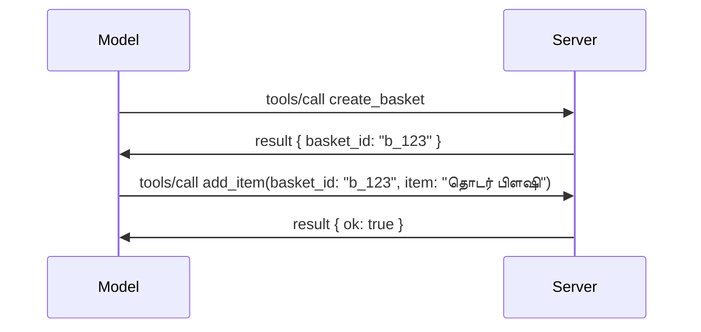

# MCP இல் என்ன மாற்றப்பட்டுள்ளது: 2026-07-28 விவரக்குறிப்பு

> **நிலை:** இறுதி. MCP விவரக்குறிப்பான `2026-07-28` 2026 ஜூலை 28 அன்று வெளியிடப்பட்டுள்ளது
> மற்றும் இது தற்போதைய நெறிமுறை திருத்தமாகும். இந்த பாடம் இறுதி
> விவரக்குறிப்பைப் பற்றி விவரிக்கிறது. சில பாடத்திட்ட எடுத்துக்காட்டுகள் தெளிவாக `2025-11-25` க்கு பதிப்பிடப்பட்டுள்ளன
> ஏனெனில் அவற்றின் SDKகள் இன்னும் புதிய நிலைமையில்லாத API-யை ஏற்றுக் கொள்ளவில்லை;
> அந்த எடுத்துக்காட்டுகளை பழைய பொருத்தத்திற்கான வழிகாட்டுதலாக கருதவும்.

## மேலாண்மை

`2026-07-28` என்பது MCP வெளியான இடமிருந்து மிகப்பெரிய திருத்தமாகும். ஆறு
விவரக்குறிப்பு மேம்பாட்டு முன்மொழிவுகள் (SEPs) நெறிமுறை நிலை அமர்வுகளை நீக்குகின்றன மற்றும்
MCP டிரான்ஸ்போர்ட் அடர்த்தியில் நிலைமையில்லாததாக ஆகிறது, விரிவுகள் முதன்மையான,
பதிப்பிடப்பட்ட அமைப்பாக மாறுகின்றன, மற்றும் இந்த பாடத்திட்டத்தின் சில முன்பு கையாளப்பட்ட அம்சங்கள்
(Roots, Sampling, Logging) புதிய வாழ்க்கைசுழற்சி கொள்கையின் கீழ் ஓரடி செய்யப்பட்டுள்ளன. இது
பாடம் என்ன மாற்றப்பட்டு உள்ளது, அது ஏன் முக்கியம் மற்றும் `2025-11-25` க்கு எதிராக எழுதப்பட்ட
குறியீட்டிற்கான விளக்கமாகும்.

மூலம்: [The 2026-07-28 MCP Specification Release Candidate](https://blog.modelcontextprotocol.io/posts/2026-07-28-release-candidate/) (Model Context Protocol Blog, டேவிட் சோரியா பாரா மற்றும் டென் டெலிமார்ஸ்க்கி).

## கற்றல் குறிக்கோள்கள்

இந்த பாடம் முடிவில், நீங்கள் இயல்பாக:

- MCP எதற்காக நிலைமையில்லாத நெறிமுறை கோருக்காக நகர்கிறது மற்றும் அது இயக்கநிலை பரப்புன்மாற்றுகளுக்காக எந்த பிரச்சனைக்கு தீர்வு அளிக்கின்றது என்பதை விளக்கவும்.
- `initialize`/`initialized` கைமாற்றும் மற்றும் `Mcp-Session-Id` தலைப்புகள் எப்படி மாற்றப்பட்டன என்பதைக் கூறவும்.
- புதிய `Mcp-Method` மற்றும் `Mcp-Name` தலைப்புகள் மற்றும் `ttlMs`/`cacheScope` சேமிப்பு சார்ந்த தகவல்களை அடையாளம் காண்க.
- விரிவுகள் அமைப்பையும் மற்றும் இந்த வெளியீட்டுடன் வரும் இரண்டு விரிவாக்கங்கள்: MCP செயலிகள் மற்றும் பணிகளை அங்கீகரிக்கவும்.
- அங்கீகார உறுதியும் மற்றும் Dynamic Client Registration
  ஓரடியின்மை பற்றி சுருக்கமாக கூறவும்.
- எந்த முக்கிய அம்சங்கள் (Roots, Sampling, Logging) இப்போது ஓரடி செய்யப்பட்டுள்ளன மற்றும் அதன் நடைமுறை விளைவுகள் என்ன என்பதைக் குறிப்பிடவும்.
- கருவி `inputSchema`/`outputSchema` க்கான முழுமையான JSON Schema 2020-12 மாற்றங்களை விளக்கவும்.

## நிலைமையில்லாத நெறிமுறை

தலைப்பு மாற்றம்: MCP நெறிமுறை அடர்த்தியில் நிலைமையில்லாததாக மாறுகிறது.

### முன் (2025-11-25): அமர்வுகள் உங்களை ஒரு சேவையக நிகழ்வுக்கு பிணைத்து வைத்திருக்கும்

Streamable HTTP வழியாக கருவியை அழைக்கும் போது `initialize` கைமாற்றுடன் தொடங்குகிறது. சேவையகம் `Mcp-Session-Id` தலைப்பை பதிலளிக்கிறது, அடுத்த அனைத்து கோரிக்கைகளிலும் உள்வாங்கப்பட வேண்டும்:

```http
POST /mcp HTTP/1.1
Mcp-Session-Id: 1868a90c-3a3f-4f5b
Content-Type: application/json

{"jsonrpc":"2.0","id":2,"method":"tools/call",
 "params":{"name":"search","arguments":{"q":"otters"}}}
```

அமர்வு அதை வழங்கிய எந்த சேவையக நிகழ்வுடனும் பிணைக்கப்பட்டிருப்பதால், நிலை பரவலாக சீரமைக்கப்பட்ட இடம்திறனும்தாளின் முனையில் **ஒட்டுமொத்த வழிசெலுத்தல்** மற்றும் **பகிரப்பட்ட அமர்வு சேமிப்பு** தேவைப்படுகிறது.

### பின் (2026-07-28): ஒவ்வொரு கோரிக்கையும் தன்னிலை கொண்டது

```http
POST /mcp HTTP/1.1
MCP-Protocol-Version: 2026-07-28
Mcp-Method: tools/call
Mcp-Name: search
Content-Type: application/json

{"jsonrpc":"2.0","id":1,"method":"tools/call",
 "params":{"name":"search","arguments":{"q":"otters"},
           "_meta":{"io.modelcontextprotocol/protocolVersion":"2026-07-28",
                    "io.modelcontextprotocol/clientInfo":{"name":"my-app","version":"1.0"},
                    "io.modelcontextprotocol/clientCapabilities":{}}}}
```

எந்த சேவையக நிகழ்வும் இந்த கோரிக்கையை கையாள முடியும். முக்கிய மாற்றங்கள்:

- **`initialize`/`initialized` கைமாற்று நீக்கப்பட்டுள்ளன** ([SEP-2575](https://github.com/modelcontextprotocol/modelcontextprotocol/pull/2575)). நெறிமுறை பதிப்பு, கிளையண்ட் தகவல் மற்றும் திறன்கள் ஒவ்வொரு கோரிக்கையிலும் `_meta` க்கு நகர்வதாகவும், புதிய `server/discover` முறையால் கிளையண்ட் தேவையான போது சேவையக திறன்களை முன்மொழிவதாகவும் உள்ளது.
- **`Mcp-Session-Id` தலைப்பு மற்றும் நெறிமுறை நிலை அமர்வு நீக்கப்பட்டுள்ளன** ([SEP-2567](https://github.com/modelcontextprotocol/modelcontextprotocol/pull/2567)). நிலை பரவல் மற்றும் பகிரப்பட்ட அமர்வு சேமிப்புகள் நெறிமுறை அடர்த்தியில் தேவையில்லை.

### நிலைமையில்லாத நெறிமுறை, நிலைமைக் கொண்ட பயன்பாடுகள்

நெறிமுறை நிலை அமர்வுகளை நீக்குவது உங்கள் சேவையகம் நிலைமைக் கொண்டதாக இருக்க முடியாது என்பதை பொருள் கொள்ளாது. பரிந்துரைக்கப்படும் மாதிரி HTTP APIs எப்போதும் பயன்படுத்திய மாதிரியைப் பின்பற்றுகிறது: ஒரு கருவி அழைப்பில் இருந்து ஒரு திறந்த கையொப்பத்தை (ஒரு `basket_id`, ஒரு `browser_id`) உருவாக்கி, பிறகு அந்த கையொப்பத்தை மாதிரி பிறக்கூற்றுகளுக்கு போதுமான சாதாரண வாதமாக்கி திருப்பிக் கொடுக்குமாறு செய்கிறது.



இது நிலையை மாதிரிக்கு தெரியும் மற்றும் பொருத்தமானதாக மாற்றுகிறது, அது போதுமான சேமிப்பு மேலதிகதலை மறைக்காமல், எந்த சேவையகம் நிகழ்வும் எந்த அழைப்பையும் கையாள முடியும்.

### சேவையகத்திலிருந்து கிளையண்டுக்கு கோரிக்கைகள், மறுசீரமைக்கப்பட்டவை

நிலைமையில்லாத நெறிமுறைக்கும் ஒரு சேவையகம் நடுவில் ஒரு கிளையண்டை ஏதேனும் கேட்க (எ.கா., elicitation prompt) வழி தேவைப்படுகிறது:

- **சேவையக தொடங்கிய கோரிக்கைகள் மட்டும் சேவையகத்தை அவசரமாக செயலாக்கும் போது வெளியிடப்படலாம்** ([SEP-2260](https://github.com/modelcontextprotocol/modelcontextprotocol/pull/2260)) — முன்பு பரிந்துரையாக இருந்தது, இப்போது தேவையாக உள்ளது. பயனர் எப்போதும் அச்சம்பரவிட திடீரென கேட்கப்படுவதில்லை.
- **பல சுற்று கோரிக்கைகள்** ([SEP-2322](https://github.com/modelcontextprotocol/modelcontextprotocol/pull/2322)) SSE ஸ்டிரீத்தை திறப்பதைக் கையாள்வதை மாற்றுகின்றன. அதற்குப் பதிலாக, சேவையகம் ஒரு `InputRequiredResult` களை வழங்குகிறது:

  ```json
  {
    "resultType": "input_required",
    "inputRequests": {
      "confirm": {
        "type": "elicitation",
        "message": "Delete 3 files?",
        "schema": { "type": "boolean" }
      }
    },
    "requestState": "eyJzdGVwIjoxLCJmaWxlcyI6WyJhIiwiYiIsImMiXX0="
  }
  ```

  கிளையண்ட் பதில்களைச் சேகரித்து `inputResponses` மற்றும் எதிரொலித்த `requestState` உடன் ஆரம்பக்கோரிக்கையை மீண்டும் இயக்குகிறது. தேவையான அனைத்தும் பார்சலிலே இருப்பதால் எந்த சேவையகம் நிகழ்வும் மறுபடியும் முயற்சியை எடுக்கலாம்.

### வழிசெய்யக்கூடியது, சேமிக்கக்கூடியது, தடப் பிடிக்கக்கூடியது

மூன்று சிறிய மாற்றங்கள் நிலைமையில்லாத போக்குவரத்தை செயல்படுத்த எளிதாக்குகின்றன:

- **Streamable HTTP-யில் `Mcp-Method` மற்றும் `Mcp-Name` தலைப்புகள் அவசியமாக உள்ளது** ([SEP-2243](https://github.com/modelcontextprotocol/modelcontextprotocol/pull/2243)), இதனால் சுமை சமநிலைபவருகள், வாயில்கள் மற்றும் வீதம் வரம்பாளர்கள் JSON உடல் ஆய்வினைத் தவிர செயல்பாட்டின் மூலம் வழிசெய்ய முடியும். தலைப்புகள் மற்றும் உடல் பொருந்தாத கோரிக்கைகள் நிராகரிக்கப்படுகின்றன.
- **`tools/list` மற்றும் வள படிப்பு முடிவுகள் `ttlMs` மற்றும் `cacheScope` மதிப்புகளை கொண்டுள்ளன** ([SEP-2549](https://github.com/modelcontextprotocol/modelcontextprotocol/pull/2549)), HTTP `Cache-Control` முறைப்படி மாதிரியாக்கப்பட்டவை. கிளையண்டுகள் ஒரு பட்டியல் முடிவு எவ்வளவு காலம் புதியதாக இருக்கும் மற்றும் அது பயனர்களுக்கு பகிரக் கூடியது என்பதை தெரிந்து கொள்கின்றன, நீண்டகாலம் உள்ள SSE ஸ்டிரீம் தேவைப்படாமல்.
- **`_meta` இல் W3C தடம் பின்தொடர்தல் ஆவணம் செய்யப்பட்டுள்ளன** ([SEP-414](https://github.com/modelcontextprotocol/modelcontextprotocol/pull/414)), `traceparent`, `tracestate`, மற்றும் `baggage` முக்கிய பெயர்களை சரிசெய்கிறது, பிந்தைய அமைப்புகள், MCP சேவையகம் மற்றும் கீழிழைச் கணினிகளில் [OpenTelemetry](https://opentelemetry.io/)-ஐ பொருந்தக்கூடிய பின்னணி மூலம் அழைப்பை துறையாக பின்தொடர முடியும்.

## விரிவாக்கங்கள் முதன்மை வகை ஆகின்றன

விரிவாக்கங்கள் `2025-11-25` இல் غیرஅங்கீக்ருதமாக இருந்தன. [SEP-2133](https://github.com/modelcontextprotocol/modelcontextprotocol/pull/2133) அவற்றை ஒழுங்குபடுத்துகிறது:

- விரிவாக்கங்கள் பின்விளம்பர-DNS ஐடியுடன் அடையாளமிடப்படுகின்றன.
- அவைகள் கிளையண்ட் மற்றும் சேவையக திறன்களில் `extensions` வரைபடத்தில் பேச்சுவார்த்தையிடப்படுகின்றன.
- அவை தங்களுடன் சொந்தமான `ext-*` குடியிருப்புகளில் இருக்கின்றன, பொறுப்பற்ற பராமரிப்பாளர்களுடன் மற்றும் முதன்மை விவரக்குறிப்புகளிலிருந்து தனித்துவமாக பதிப்பிடப்படுகின்றன.
- SEP நடைமுறையில் புதிய விரிவாக்க பாதை உள்ளது அது அவற்றுக்கு ஆராய்ச்சிமூலம் அதிகாரபூர்வம் ஆகும் வழியை வழங்குகிறது.

இந்த வெளியீடு இரண்டு அதிகாரபூர்வ விரிவாக்கங்களை அனுப்புகிறது.


### MCP செயலிகள்: சர்வர்-இயக்கப்படும் பயனர் முகப்புகள்

[MCP செயலிகள்](https://blog.modelcontextprotocol.io/posts/2026-01-26-mcp-apps/) ([SEP-1865](https://github.com/modelcontextprotocol/modelcontextprotocol/pull/1865)) சர்வர்களுக்கு நடைய HTML முகப்புகளை அனுப்ப அனுமதிக்கிறது, அவை ஹோஸ்டுகள் ஒரு சேனல் iframe இல் இயக்கப்படும். கருவிகள் தங்களது UI வடிவமைப்புகளை முன்கூட்டியே கூறுகின்றன, ஆகவே ஹோஸ்டுகள் அவற்றை முன்னெடுத்து, சேமித்து, மற்றும் பாதுகாப்பு மதிப்பாய்வு செய்யலாம் எந்தவொரு செயலாக்கமும் ஆரம்பித்தாலும் முன்பே. நீங்கள் இதன் அடிப்படைகளை ஏற்கனவே [பாடம் 15: MCP செயலிகள்](../03-GettingStarted/15-mcp-apps/README.md) இல் கற்று கொண்டுள்ளீர்கள் — விரிவாக்கங்கள் கட்டமைப்பின் கீழ், MCP செயலிகள் இப்போது அப்போதைய முக்கிய அம்சம் அல்லாமல் ஒரு சட்டரீதியான விரிவாக்கமாக உள்ளது.

### பணிகள் ஒரு விரிவாக்கமாக நிலைத்தன

பணிகள் `2025-11-25` அன்று ஒரு பரிசோதனை அடிப்படையிலான முக்கிய அம்சமாக வழங்கப்பட்டன. உற்பத்தி பயன்பாட்டில் மீளமைப்பு தேவையான அளவு இருந்ததால், அதன் சரியான இடம் ஒரு விரிவாக்கமாகும்: [பணிகள் விரிவாக்கம்](https://github.com/modelcontextprotocol/modelcontextprotocol/pull/2663) நிலைத்த மாதிரிக்கான வாழ்க்கைச்சுழற்சியை மறுபடியும் வடிகட்டுகிறது — ஒரு சர்வர் `tools/call` உடன் ஒரு பணிகள் கையாளியை (task handle) பதிலளிக்க முடியும், மற்றும் கிளையன் `tasks/get`, `tasks/update`, மற்றும் `tasks/cancel` களால் அதை முன்னேற்றுகிறது. பணிகள் உருவாக்கல் சர்வர் வழிகாட்டியாகும்: கிளையன் விரிவாக்கத்தை அறிவிக்கும், சர்வர் ஒரு அழைப்பு எப்போது பணியாக இயங்க வேண்டும் என்பதை தீர்மானிக்கிறது. `tasks/list` முற்றிலும் நீக்கப்பட்டது ஏனெனில் அது நிலையான அமர்வுகளும் இல்லாமல் பாதுகாப்புடன் வரையறுக்க முடியாது.

> **பரிமாற்றக் குறிப்பு:** நீங்கள் பரிசோதனை `2025-11-25` பணிகள் API ஐ செயல்படுத்தியிருந்தால், புதிய விரிவாக்க வாழ்க்கைச்சுழற்சிக்கு மாற்ற வேண்டும் — இது முந்தைய பதிப்புகளுடன் பொருந்தாது.

## அங்கீகாரம் கடுமைப்படுத்தல்

பல SEP கள்
[அங்கீகாரம் விவரக்குறிப்பு](https://modelcontextprotocol.io/specification/2026-07-28/basic/authorization)
உண்மையான OAuth 2.0 / OpenID Connect நடைமுறைகளுக்கு இன்னும் நெருக்கமாக இணைக்கப் படுகின்றன:

| SEP | மாற்றம் |
|---|---|
| [SEP-2468](https://github.com/modelcontextprotocol/modelcontextprotocol/pull/2468) | வாடிக்கையாளர்கள் அங்கீகாரம் பதில்களில் `iss` அளவுருவை [RFC 9207](https://www.rfc-editor.org/rfc/rfc9207) படி சரிபார்க்க வேண்டும், இது MCP இன் ஒரே கிளையண்ட், பல சர்வர் மாதிரியில் காணப்படும் கலப்பு தாக்குதல்களை குறைக்கிறது. எதிர்கால பதிப்பில் `iss` இல்லாத பதில்களை நிராகரிக்க தேவைப்படும். |
| [SEP-837](https://github.com/modelcontextprotocol/modelcontextprotocol/pull/837) | பொருந்துதலுக்கு மட்டுமே உள்ள டைனமிக் கிளையன் பதிவு வாடிக்கையாளர்கள் தங்கள் OpenID Connect `application_type` ஐ அறிவிக்கின்றனர், டெஸ்க்டாப் மற்றும் CLI வாடிக்கையாளர்களுக்கு தவறான `"web"` இயல்புநிலையை தவிர்க்க. |
| [SEP-2352](https://github.com/modelcontextprotocol/modelcontextprotocol/pull/2352) | பொருந்துதலுக்கு மட்டும் பதிவு செய்யப்பட்ட அங்கீகாரக் குறியீடுகள் வழங்கும் அங்கீகாரம் சர்வரின் `issuer` க்கு கட்டுப்படுத்தப்பட்டுள்ளன; வாடிக்கையாளர்கள் ஒரு வளம் இடமாற்றம் செய்யப்பட்டால் மீண்டும் பதிவு செய்ய வேண்டும். |
| [SEP-2207](https://github.com/modelcontextprotocol/modelcontextprotocol/pull/2207) | OpenID Connect-பாணி அங்கீகாரம் சர்வர்களிடமிருந்து ரீஃப்ரெஷ் டோக்கன்களை கேட்கும் முறையை ஆவணப்படுத்துகிறது. |
| [SEP-2350](https://github.com/modelcontextprotocol/modelcontextprotocol/pull/2350) | நிலை உயர்வு அங்கீகாரத்தின் போது ஸ்கோப் சேர்க்கையை தெளிவுபடுத்துகிறது. |
| [SEP-2351](https://github.com/modelcontextprotocol/modelcontextprotocol/pull/2351) | `.well-known` கண்டு பிடிப்பு முடிவுக்கூற்றை (suffix) தெளிவுபடுத்துகிறது. |

நீங்கள் MCP க்கான ஒரு அங்கீகாரம் சர்வரை கட்டியெடுக்கினால், அங்கீகாரம் பதில்களில் `iss` ஐ வழங்கவும் மற்றும் இறுதி அங்கீகாரம் விவரக்குறிப்பினை பின்பற்றவும். அமல்படுத்தல் வழிகாட்டலுக்கு [02-Security](../02-Security/README.md) ஐ பார்க்கவும்.


## பழைய அம்சங்கள்


புதிய
[அம்ச வாழ்க்கைச்சுழற்சி கொள்கை](https://github.com/modelcontextprotocol/modelcontextprotocol/pull/2577) கீழ்,


| அம்சம் | பரிந்துரைக்கப்படும் மாற்று |
|---|---|
| ரூட்ஸ் | கருவி அளவுருக்கள், வள URI கள் அல்லது சர்வர் கட்டமைப்பு |
| சாம்பிளிங் | நேரடி ஒருங்கிணைப்பு LLM வழங்குநர் API களுடன் |
| பதிவு | stdio போக்குகளுக்கான `stderr`; கட்டமைக்கப்பட்ட பார்வைக்கான OpenTelemetry |


இந்த அம்சங்கள் `2026-07-28` இல் பொருந்துதலுக்காக நிறுத்தப்பட்டுள்ளன. அவை முதல் குறிப்பிட்ட திருத்தத்தில் அகற்றப்படக்கூடியவை, ஜூலை 28, 2027 அல்லது அதற்குப் பிறகு வெளியிடப்படும்; உண்மையான அகற்றல் பின்னர் தான் ஏற்படும். புதிய செயலிகள் மேலே குறிப்பிட்ட மாற்று முறைகள் பயன்படுத்த வேண்டும்.


## கருவிகளுக்கான முழுமையான JSON விவரக்கோப்பு 2020-12

கருவி `inputSchema` மற்றும் `outputSchema` முழுமையான [JSON Schema 2020-12](https://json-schema.org/draft/2020-12) ஆக மேம்படுத்தியுள்ளன ([SEP-2106](https://github.com/modelcontextprotocol/modelcontextprotocol/pull/2106)):

- உள்ளீட்டு ஸ்கீமாக்கள் `type: "object"` மூல கட்டுப்பாட்டைப் பாதுகாத்து இப்போது தொகுப்பு (`oneOf`, `anyOf`, `allOf`), நிபந்தனைகள் மற்றும் குறிப்புக்களை (`$ref`, `$defs`) அனுமதிக்கின்றன.
- வெளியீட்டு ஸ்கீமாக்கள் விதிவிலக்கற்றவை, மேலும் `structuredContent` இப்போது ஒரு பாகமாக இல்லாமல் எந்த JSON மதிப்பாகவும் இருக்கலாம்.
- செயல்பாடுகள் வெளிப்புற `$ref` URI களை தானாக தீர்மானிக்க கூடாது, மேலும் ஸ்கீமா ஆழம் மற்றும் சரிபார்ப்பு நேரத்தை கட்டமைக்க வேண்டும் (சர்வர் பக்கத்தில் ஸ்கீமாக்களை சரிபார்க்கும் போது நிராகரிப்பு-சேவை பரிசீலனை).

தனித்தனியாக, இல்லாத வளத்திற்கான பிழை குறியீடு MCP-செயல்படுத்தப்பட்டது `-32002` இல் இருந்து JSON-RPC நிலையான `-32602` (தவறான அளவுருக்கள்) ஆக மாற்றப்படுகிறது ([SEP-2164](https://github.com/modelcontextprotocol/modelcontextprotocol/pull/2164)). உங்கள் கிளையன் `-32002` மதிப்பை நேரடியாக பொருத்தினால், அதை புதுப்பிக்க வேண்டியிருக்கும்.

## இங்கு இருந்து முறையியல் எப்படி முன்னேறும்

இந்த வெளியீடு உடைக்கும் மாற்றங்களை கொண்டுள்ளது, MCP பராமரிப்பவர்கள் இதை எதிர்காலத்தில் வழக்கமாகத்தான் நினைக்கவில்லை. மூன்று ஆளுநிர்வாக SEP கள் இதனால் மறுபடியும் ஏற்படாமல் தடுக்கும் நோக்கத்துடன் உள்ளன:

- **அம்ச வாழ்க்கைச்சுழற்சி கொள்கை** ஒவ்வொரு அம்சத்துக்கும் ஒரு செயல்பாட்டிலிருந்து → பழமைவாய்ந்த → அகற்றப்பட்ட பாதையை வழங்குகிறது, பழமைவாய்தல் மற்றும் அகற்றத்துக்கிடையில் குறைந்தது பதினெட்டு மாதங்கள் இருக்க வேண்டும்.
- **விரிவாக்கங்கள் கட்டமைப்பு** புதிய செயல்பாடுகளை விருப்பவிரிவாக்கங்களாக வழங்க அனுமதிக்கிறது மற்றும் அங்கு நிலையானவையாக மாறும் முன் (எப்போதும் என்றால்) முக்கிய குறிப்புறையில் சேர்க்கிறது.
- ஒரு தரநிலை வழிசெலுத்தும் SEP ஐ [conformance suite](https://github.com/modelcontextprotocol/conformance) இல் பொருந்தும் நிலை பெற இந்த SEP-2484) வரையறைகூடிய சீர்மான நிலையை இல்லை — அதே தொகுப்பில் [SDK அடுக்கு அமைப்பு](https://github.com/modelcontextprotocol/modelcontextprotocol/pull/1777) அதிகாரப்பூர்வ SDK களை மதிப்பீடு செய்கிறது.

## வெளியீட்டு நேரவரிசை மற்றும் சரிபார்ப்பு

- வெளியீட்டு தேர்வாளர் மே 21, 2026 அன்று பூட்டப்பட்டது.
- இறுதி குறிப்புறை ஜூலை 28, 2026 அன்று வெளியிடப்பட்டது.

- SDK ஆதரவு பொதுமுறைத் தன்மையைத் தள்ளுபடி செய்யலாம். ஒரு உதாரணத்தை மையாக்குவதற்கு முன்
  [SDK ஆவணம்](https://modelcontextprotocol.io/docs/sdk) மற்றும் SDKயின்
  வெளியீடு குறிப்புகளைப் பார்க்கவும்.
- கடைசி மாற்றங்களை பின்பற்றுக
  [2026-07-28 பொதுமுறை](https://modelcontextprotocol.io/specification/2026-07-28/)
  மற்றும் அதன்
  [மாற்றுமாற்று குறிப்புகள்](https://modelcontextprotocol.io/specification/2026-07-28/changelog).

## இந்த பாடத்திட்டத்திற்கு இதன் விளைவு என்ன

பாடத்திட்டம் `2025-11-25` உதாரணங்களிலிருந்து தற்போதைய
`2026-07-28` பொதுமுறைக்கு மாறுகிறது. தெளிவாக:

- **அமர்வுகள் மற்றும் `initialize` கைபிடி** பிரத்யேகமாக
  `2025-11-25` நோக்கமாக்கப்பட்ட உதாரணங்களில் பழங்கால செயல் முறையாக உள்ளன. `2026-07-28` நெறிமுறை
  மேலே உள்ள நிலைத்தன்மையற்ற கோரிக்கை மாதிரியால் அவற்றை மாற்றுகிறது.
- **சேம்பிளிங் மற்றும் வேர்** இணக்கமானதற்காக இருக்கின்றன ஆனால் மறுக்கப்படுகின்றன.
  புதிய வடிவமைப்புகள் மேலே பட்டியலிடப்பட்ட மாற்று முறைகளை பயன்படுத்த வேண்டும்.
- **பரிசோதனையான பணி வசதி**, நீங்கள் பயன்படுத்தியிருந்தால், பணி நீட்டிப்பின் புதிய வாழ்நாள் சுழற்சிக்கு மாற்ற வேண்டும்.
- **MCP செயலிகள்** ([பாடம் 15](../03-GettingStarted/15-mcp-apps/README.md)) நடைமுறையில் பாதிக்கப்படவில்லை; அது அசல் விரிவாக்கங்கள் அடிப்படையில் பரிமாறப்படுகிறது.

## கூடுதல் ஆதாரங்கள்

- [MCP பொதுமுறை 2026-07-28](https://modelcontextprotocol.io/specification/2026-07-28/)
- [2026-07-28 மாற்றுக் குறிப்புகள்](https://modelcontextprotocol.io/specification/2026-07-28/changelog)
- [2026-07-28 MCP பொதுமுறை வெளியீட்டு பிரதி (வரலாற்று வலைப்பதிவு)](https://blog.modelcontextprotocol.io/posts/2026-07-28-release-candidate/)
- [MCP போக்குவரத்து எதிர்காலம்](https://blog.modelcontextprotocol.io/posts/2025-12-19-mcp-transport-future/)
- [SEP வழிகாட்டிகள்](https://modelcontextprotocol.io/community/sep-guidelines)
- [MCP SDK தர அமைப்பு](https://modelcontextprotocol.io/docs/sdk)

## அடுத்து செய்ய வேண்டியவை

[முக்கிய கருத்துகள்](./README.md) க்கு திரும்பவோ அல்லது தொடர்வோ
[பாதுகாப்பு](../02-Security/README.md)க்கு சென்று தற்போதைய `2026-07-28` வழிகாட்டுதலைப் பயன்படுத்தவும்.

---

<!-- CO-OP TRANSLATOR DISCLAIMER START -->
**மறுப்பு**:
இந்த ஆவணம் AI மொழிபெயர்ப்பு சேவை [Co-op Translator](https://github.com/Azure/co-op-translator) பயன்படுத்தி மொழிபெயர்க்கப்பட்டுள்ளது. நாங்கள் துல்லியத்திற்காக முயற்சி செய்துள்ளோம், ஆனால் தானாக செய்யப்படும் மொழிபெயர்ப்புகளில் பிழைகள் அல்லது தவறுகள் இருக்கலாம் என்பதை கவனத்தில் கொள்ளவும். அசல் ஆவணம் அதன் தாய்மொழியில் அதிகாரப்பூர்வ ஆதாரமாக கருதப்பட வேண்டும். முக்கியமான தகவல்களுக்கு, தொழில்நுட்பமான மனித மொழிபெயர்ப்பு பரிந்துரைக்கப்படுகிறது. இந்த மொழிபெயர்ப்பைப் பயன்படுத்துவதால் ஏற்படும் எந்த தவறான புரிதல்கள் அல்லது தவறான விளக்கத்திற்கும் நாங்கள் பொறுப்பில்வில்லை.
<!-- CO-OP TRANSLATOR DISCLAIMER END -->