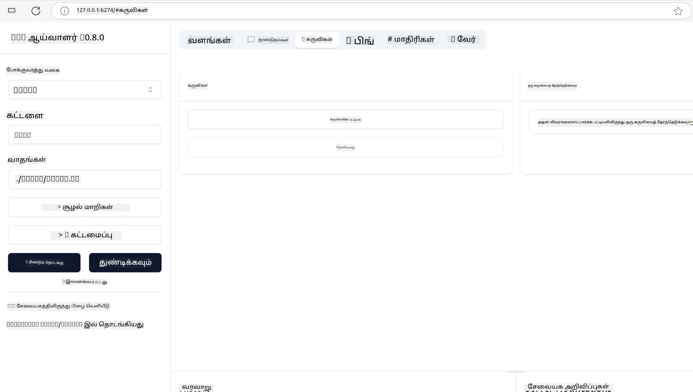
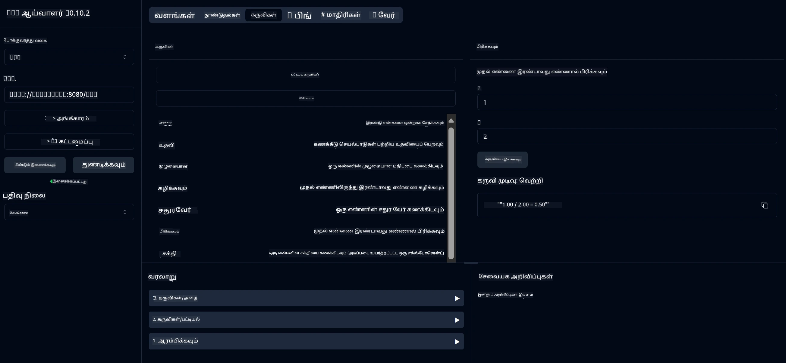
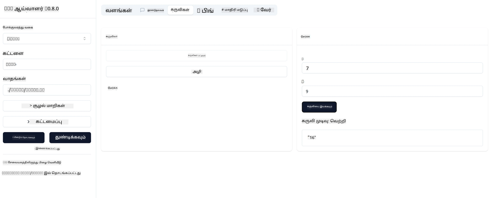

# MCP உடன் தொடங்குதல்

> [!NOTE]
> இந்த பாடத்தில் உள்ள ஜாவா HTTP உதாரணம் பாரம்பரிய HTTP+SSE போக்குவரத்தைப் பயன்படுத்துகிறது மற்றும்
> MCP `2025-11-25` உடன் பொருத்தமான SDK-ஐ இலக்காகக் கொண்டுள்ளது. புதிய தொலைவிலான சர்வர்கள் ஆனால்,
> `2026-07-28` ஸ்ட்ரீமபிள் HTTP போக்குவரத்தைப் பயன்படுத்தவும் உங்கள் SDK இல் ஆதரவை சரிபார்க்கவும்.

உங்கள் முதல் படிகளை Model Context Protocol (MCP) உடன் வரவேற்கிறோம்! நீங்கள் MCP-க்கு புதியவராக இருக்கிறீர்களானால் அல்லது உங்கள் புரிதலை விரிவுபடுத்த விரும்பினால், இந்த வழிகாட்டி அவசியமான அமைப்பையும் வளர்ச்சி முறையையும் ஊக்குவிக்கும். MCP எப்படி AI மாடல்கள் மற்றும் செயலிகளுக்கிடையே தொடர் ஒருங்கிணைப்பை வழங்குகிறதென நீங்கள் கண்டுபிடிப்பீர்கள், மேலும் MCP மூலம் இயக்கப்படும் தீர்வுகளை உருவாக்க மற்றும் சோதனை செய்ய உங்கள் சூழலை விரைவாக தயாரிப்பது எப்படி என்பதை அறிந்து கொள்வீர்கள்.

> TLDR; நீங்கள் AI செயலிகளை உருவாக்கினால், நீங்கள் உங்கள் LLM (பெரிய மொழி மாடல்) க்கு கருவிகள் மற்றும் பிற வளங்களைச் சேர்க்க முடியும் என்பதை நீங்கள் அறிவீர்கள், LLM அதிக அறிவு என பயன்படுத்த. ஆனால் அந்த கருவிகளையும் வளங்களையும் ஒரு சர்வரில் வைப்பதனால், செயலியும் சர்வர் திறன்களும் எந்தக் கிளையன்டுக்கும் LLM உடன் அல்லது இல்லாமல் பயன்படுத்தக்கூடியவை ஆகும்.

## கண்ணோட்டம்

இந்த பாடம் MCP சூழல்களை அமைக்கும் மற்றும் உங்கள் முதல் MCP செயலிகளை உருவாக்குவது குறித்து நடைமுறை வழிகாட்டுதலை வழங்குகிறது. தேவையான கருவிகள் மற்றும் கட்டமைப்புகளை அமைக்க, அடிப்படையான MCP சர்வர்கள் உருவாக்க, ஹோஸ்ட் செயலிகள் உருவாக்க மற்றும் உங்கள் அமல்படுத்தல்களை சோதனை செய்வது போன்றவை நீங்கள் கற்றுக்கொள்வீர்கள்.

Model Context Protocol (MCP) என்பது செயலிகள் LLM க்களுக்கு உள்ளடக்கத்தை வழங்கும் முறையை ஒருங்கிணைக்கும் திறந்த நெறிமுறை. MCP ஐ AI செயலிகளுக்கு USB-C போர்ட் போன்றதாக நினைக்கவும்—இதன் மூலம் AI மாடல்களை வேறுபட்ட தரவுத்தளங்கள் மற்றும் கருவிகளுடன் இணைக்க ஒரு ஒருங்கிணைந்த வழி வழங்கப்படுகிறது.

## கற்கும் நோக்கங்கள்

இந்த பாடம் முடிந்தபின், நீங்கள் இதில் திறன் பெறுவீர்கள்:

- C#, Java, Python, TypeScript மற்றும் Rust இல் MCP க்கான வளர்ச்சி சூழல்களை அமைக்க
- தனிப்பயன் அம்சங்கள் (வளங்கள், கூரைகள் மற்றும் கருவிகள்) கொண்ட அடிப்படையான MCP சர்வர்களை உருவாக்கி விநியோகிக்க
- MCP சர்வர்களுடன் இணைக்கும் ஹோஸ்ட் செயலிகளை உருவாக்க
- MCP செயல்படுத்தல்களை சோதனை மற்றும் பிழைத்திருத்தம் செய்ய

## உங்கள் MCP சூழலை அமைத்தல்

MCP உடன் பணியில் ஈடுபட துவங்குவதற்கு முன், உங்கள் வளர்ச்சி சூழலை தயாரிப்பதும் அடிப்படையான பணிச் சுற்றத்தை புரிந்துகொள்வதும் முக்கியம். இந்த பகுதி MCP உடன் மென்மையான துவக்கத்தை உறுதிசெய்ய ஆரம்ப அமைப்பு படிகளை வழிநடத்தும்.

### தேவைகள்

MCP வளர்ச்சியில் இறங்குவதற்கு முன், நீங்கள் கீழ்கண்டவற்றைக் கொண்டுள்ளதாக உறுதிப்படுத்துக:

- **வளர்ச்சி சூழல்**: உங்கள் தேர்ந்த மொழிக்கான (C#, Java, Python, TypeScript, அல்லது Rust)
- **IDE/எடிட்டர்**: Visual Studio, Visual Studio Code, IntelliJ, Eclipse, PyCharm அல்லது எந்த நவீன குறியீட்டு எடிட்டர்
- **பொதி மேலாளர்கள்**: NuGet, Maven/Gradle, pip, npm/yarn, அல்லது Cargo
- **API விசைகள்**: உங்கள் ஹோஸ்ட் செயலிகளில் பயன்படுத்தும் எந்த AI சேவைகளுக்கானவையும்

## அடிப்படைக் MCP சர்வர் கட்டமைப்பு

ஒரு MCP சர்வர் பொதுவாக கொண்டிருக்கும் பகுதிகள்:

- **சர்வர் கட்டமைப்பு**: போர்ட், அங்கீகார மற்றும் பிற அமைப்புகளை செட் செய்யும்
- **வளங்கள்**: LLM க்களுக்கு வழங்கப்படும் தரவு மற்றும் உள்ளடக்கம்
- **கருவிகள்**: மாடல்கள் அழைக்கும் செயல்பாடுகள்
- **கூறுகள்**: உரையமைப்புக்கும் உருவாக்கதிற்குமான வார்ப்புருக்கள்

TypeScript இல் இதோ ஒரு சுருக்கமான உதாரணம்:

```typescript
import { McpServer, ResourceTemplate } from "@modelcontextprotocol/sdk/server/mcp.js";
import { StdioServerTransport } from "@modelcontextprotocol/sdk/server/stdio.js";
import { z } from "zod";

// ஒரு MCP சேவையகத்தை உருவாக்கவும்
const server = new McpServer({
  name: "Demo",
  version: "1.0.0"
});

// ஒரு கூட்டல் கருவியை சேர்க்கவும்
server.tool("add",
  { a: z.number(), b: z.number() },
  async ({ a, b }) => ({
    content: [{ type: "text", text: String(a + b) }]
  })
);

// ஒரு গতிஸ்திர வரவேற்பு வளத்தைச் சேர்க்கவும்
server.resource(
  "file",
  // 'list' உடன் அளிக்கப்பட்டும் வளம் எவ்வாறு கிடைக்கக்கூடிய கோப்புகளை பட்டியலிடுமென கட்டுப்படுத்துகிறது. இதனை undefiend ஆக அமைத்தால், இந்த வளத்திற்கு பட்டியலிடல் செயலிழக்கிறது.
  new ResourceTemplate("file://{path}", { list: undefined }),
  async (uri, { path }) => ({
    contents: [{
      uri: uri.href,
      text: `File, ${path}!`
    }]
  })
);

// கோப்பின் உள்ளடக்கங்களைப் படிக்கும் ஒரு கோப்பு வளத்தைச் சேர்க்கவும்
server.resource(
  "file",
  new ResourceTemplate("file://{path}", { list: undefined }),
  async (uri, { path }) => {
    let text;
    try {
      text = await fs.readFile(path, "utf8");
    } catch (err) {
      text = `Error reading file: ${err.message}`;
    }
    return {
      contents: [{
        uri: uri.href,
        text
      }]
    };
  }
);

server.prompt(
  "review-code",
  { code: z.string() },
  ({ code }) => ({
    messages: [{
      role: "user",
      content: {
        type: "text",
        text: `Please review this code:\n\n${code}`
      }
    }]
  })
);

// stdin இல் இருந்து செய்திகளைப் பெறத் தொடங்கி, stdout இல் செய்திகளை அனுப்பத் தொடங்கவும்
const transport = new StdioServerTransport();
await server.connect(transport);
```

மேல் உள்ள குறியீட்டில் நாம்:

- MCP TypeScript SDK இல் இருந்து தேவையான வகுப்புகளை இறக்குமதி செய்தோம்.
- புதிய MCP சர்வர் உதாரணத்தை உருவாக்கி அமைத்தோம்.
- ஒரு தனிப்பயன் கருவி (`calculator`) ஒன்றை ஹேண்ட்லர் செயலூட்டியுடன் பதிவு செய்தோம்.
- வரவிருக்கும் MCP கோரிக்கைகளுக்காக சர்வரை கேளுங்கள் துவங்கியோம்.

## சோதனை மற்றும் பிழைத்திருத்தம்

உங்கள் MCP சர்வரை சோதனை செய்யத் துவங்கும் முன், கிடைக்கும் கருவிகள் மற்றும் சிறந்த நடைமுறைகளை புரிந்து கொள்வது முக்கியம். பயனுள்ள சோதனை உங்கள் சர்வர் எதிர்பார்த்தபடி செயல்படுவதை உறுதி செய்யும் மற்றும் பிரச்சனைகளை விரைவாக கண்டுபிடித்து தீர்க்க உதவும். கீழ்காணும் பகுதி உங்கள் MCP செயல்படுத்தலைச் சரிபார்க்க பரிந்துரைக்கப்படும் முறைகளை விளக்கும்.

MCP உங்கள் சர்வர்களை சோதனை மற்றும் பிழைத்திருத்த உதவ கருவிகளை வழங்குகிறது:

- **இன்ஸ்பெக்டர் கருவி**, இது ஒரு காட்சிப்படுத்தும் இடைமுகம், உங்கள் சர்வருடன் இணைக்கவும் உங்கள் கருவிகள், கூறுகள் மற்றும் வளங்களை சோதிக்கவும் உதவும்.
- **curl**, நீங்கள் curl போன்ற கட்டளை வரிசைப் பார்வையாளர் பயன்படுத்தி அல்லது HTTP கட்டளைகளை உருவாக்கி இயக்கக்கூடிய பிற கிளையன்டுகளைப் பயன்படுத்தி சர்வருடன் இணைக்கலாம்.

### MCP இன்ஸ்பெக்டர் பயன்பாடு

[MCP இன்ஸ்பெக்டர்](https://github.com/modelcontextprotocol/inspector) என்பது ஒரு காட்சிப்படுத்தும் சோதனை கருவி இது உங்களுக்கு உதவும்:

1. **சர்வர் திறன்னுக்களை கண்டறிதல்**: கிடைக்கும் வளங்கள், கருவிகள் மற்றும் கூறுகளை தானாக கண்டுபிடிக்க
2. **கருவி செயல்பாட்டு சோதனை**: வெவ்வேறு அளவுருக்களை முயற்சி செய்து நேரடி பதில்களை பார்ப்பது
3. **சர்வர் மெட்டাডேட்டாவைக் காணுதல்**: சர்வர் தகவல், திட்டங்கள் மற்றும் கட்டமைப்புகளை பரிசீலனை செய்க

```bash
# உதாரணம் TypeScript, MCP இன்ஸ்பெக்டர் நிறுவுதல் மற்றும் இயக்குதல்
npx @modelcontextprotocol/inspector node build/index.js
```

மேலேயுள்ள கட்டளைகள் இயக்கும் போது, MCP இன்ஸ்பெக்டர் உலாவியில் உள்ளூர் வலை இடைமுகத்தை தொடங்கும். உங்கள் பதிவுசெய்யப்பட்ட MCP சர்வர்கள், அவற்றின் கிடைக்கும் கருவிகள், வளங்கள் மற்றும் கூறுகளை காட்சி வடிவமாக காண்பிக்கும் டாஷ்போர்ட்டை நீங்கள் எதிர்பார்க்கலாம். இந்த இடைமுகம் கருவி இயக்கத்தையும் சர்வர் மெட்டாடேட்டாவையும் வெளிப்படையாக சோதிக்கவும் நேரடி பதில்களை பார்வையிடவும் உதவுகிறது, இதனால் உங்கள் MCP சர்வர் செயல்படுத்தல்களை சரிபார்த்தலும் பிழைத்திருத்தலும் எளிதாக இருக்கும்.

இதோ அதின் ஸ்கிரீன்சாட்:



## பொதுவான அமைப்பு பிரச்சனைகள் மற்றும் தீர்வுகள்

| பிரச்சனை | சாத்தியமான தீர்வு |
|-------|-------------------|
| இணைப்பு நிராகரிக்கப்பட்டது | சர்வர் இயக்கப்படுகிறதா மற்றும் போர்ட் சரியானதா என்பதைச் சரிபார்க்கவும் |
| கருவி செயலாற்றல் பிழைகள் | அளவுரு சரிபார்ப்பு மற்றும் பிழை கையாள்தலை மீண்டும் பார்க்கவும் |
| அங்கீகார தோல்விகள் | API விசைகள் மற்றும் அனுமதிகளை உறுதிசெய்க |
| திட்ட சரிபார்ப்பு பிழைகள் | அளவுருக்கள் வரையறுக்கப்பட்ட திட்டத்துடன் பொருந்துகிறதா என்பதை உறுதிசெய்க |
| சர்வர் திடீரென நிறுத்தப்பட்டது | போர்ட் மோதல்கள் அல்லது தேவையான சார்புகள் இல்லாமல் இருப்பதைச் சரிபார்க்கவும் |
| CORS பிழைகள் | கடந்து வரும் கோரிக்கைகளுக்கு முறையான CORS தலைப்புகளை அமைக்கவும் |
| அங்கீகார பிரச்சனைகள் | டோகன் செல்லுபடியாகும் போது மற்றும் அனுமதிகளை சரிபார்க்கவும் |

## உள்ளூர் வளர்ச்சிக் கட்டமைப்பு

உள்ளூர் வளர்ச்சிக்காக மற்றும் சோதனைக்காக, MCP சர்வர்களை நேரடியாக உங்கள் கணினியில் இயக்கலாம்:

1. **சர்வர் செயல்பாட்டை துவக்கவும்**: உங்கள் MCP சர்வர் செயலியை இயக்கவும்
2. **பிணையமைப்பை அமைக்கவும்**: சர்வர் எதிர்பார்க்கப்படும் போர்ட்டில் அணுகக்கூடியதாக இருக்க வேண்டும்
3. **கிளையன்ட்களை இணைக்கவும்**: `http://localhost:3000` போன்ற உள்ளூர்நிலை இணைப்பு URL களை பயன்படுத்தவும்

```bash
# உதாரணம்: TypeScript MCP சர்வரை உள்ளூர் முறையில் இயக்குதல்
npm run start
# சர்வர் இயங்குகிறது http://localhost:3000
```

## உங்கள் முதல் MCP சர்வரை உருவாக்குதல்

[Core concepts](../../01-CoreConcepts/README.md) பற்றி கடந்த பாடத்தில் கற்றுக்கொண்டோம், இப்போது அந்த அறிவைப் பயன்படுத்தி வேலை செய்வோம்.

### சர்வர் என்ன செய்யலாம்

குறியீடு எழுத தொடங்குவதற்கு முன், சர்வர் என்ன செய்யக்கூடுமென நினைவூட்டிக் கொள்வோம்:

ஒரு MCP சர்வர் உதாரணமாக:

- உள்ளூர் கோப்புகள் மற்றும் தரவுத்தளங்களில் அணுகல்
- தொலை API களுடன் இணைபெர்சல்
- கணக்கீடுகளை செய்தல்
- பிற கருவிகள் மற்றும் சேவைகளுடன் ஒருங்கிணைப்பு
- பயனர் இடைமுகத்தை வழங்குதல் தொடர்புக்கு

நன்று, இப்போது சர்வர் எப்படி செயல்பட வேண்டும் என்று அறிந்துள்ளோம், குறியீடு எழுதத் தொடங்கலாம்.

## பயிற்சி: ஒரு சர்வர் உருவாக்குதல்

சர்வர் உருவாக்க, நீங்கள் இந்த படிகளை பின்பற்ற வேண்டும்:

- MCP SDK-ஐ நிறுவுக.
- ஒரு திட்டத்தை உருவாக்கி அதன் கட்டமைப்பை அமைக்க.
- சர்வர் குறியீட்டை எழுதுக.
- சர்வரை சோதனை செய்யவும்.

### -1- திட்டத்தை உருவாக்கு

#### TypeScript

```sh
# திட்ட கோப்புறை உருவாக்கி npm திட்டத்தை துவங்கவும்
mkdir calculator-server
cd calculator-server
npm init -y
```

#### Python

```sh
# திட்ட கோப்பகத்தை உருவாக்கு
mkdir calculator-server
cd calculator-server
# Visual Studio Code-ல் கோப்புறையை திறக்கவும் - வேறு IDE பயன்படுத்துபவர்கள் இதை தவிர்க்கவும்
code .
```

#### .NET

```sh
dotnet new console -n McpCalculatorServer
cd McpCalculatorServer
```

#### Java

ஜாவாவிற்கான ஒரு Spring Boot திட்டத்தை உருவாக்குக:

```bash
curl https://start.spring.io/starter.zip \
  -d dependencies=web \
  -d javaVersion=21 \
  -d type=maven-project \
  -d groupId=com.example \
  -d artifactId=calculator-server \
  -d name=McpServer \
  -d packageName=com.microsoft.mcp.sample.server \
  -o calculator-server.zip
```

சிப் கோப்பை வெளியேற்று:

```bash
unzip calculator-server.zip -d calculator-server
cd calculator-server
# விருப்பத் தேர்வாக பயன்பாட்டில் இல்லாத சோதனையை நீக்கவும்
rm -rf src/test/java
```

உங்கள் *pom.xml* கோப்பிற்கு முழுமையான கட்டமைப்பை கீழ்த்தமிழில் சேர்:

```xml
<?xml version="1.0" encoding="UTF-8"?>
<project xmlns="http://maven.apache.org/POM/4.0.0"
    xmlns:xsi="http://www.w3.org/2001/XMLSchema-instance"
    xsi:schemaLocation="http://maven.apache.org/POM/4.0.0 http://maven.apache.org/xsd/maven-4.0.0.xsd">
    <modelVersion>4.0.0</modelVersion>
    
    <!-- Spring Boot parent for dependency management -->
    <parent>
        <groupId>org.springframework.boot</groupId>
        <artifactId>spring-boot-starter-parent</artifactId>
        <version>3.5.0</version>
        <relativePath />
    </parent>

    <!-- Project coordinates -->
    <groupId>com.example</groupId>
    <artifactId>calculator-server</artifactId>
    <version>0.0.1-SNAPSHOT</version>
    <name>Calculator Server</name>
    <description>Basic calculator MCP service for beginners</description>

    <!-- Properties -->
    <properties>
        <java.version>21</java.version>
        <maven.compiler.source>21</maven.compiler.source>
        <maven.compiler.target>21</maven.compiler.target>
    </properties>

    <!-- Spring AI BOM for version management -->
    <dependencyManagement>
        <dependencies>
            <dependency>
                <groupId>org.springframework.ai</groupId>
                <artifactId>spring-ai-bom</artifactId>
                <version>1.0.0-SNAPSHOT</version>
                <type>pom</type>
                <scope>import</scope>
            </dependency>
        </dependencies>
    </dependencyManagement>

    <!-- Dependencies -->
    <dependencies>
        <dependency>
            <groupId>org.springframework.ai</groupId>
            <artifactId>spring-ai-starter-mcp-server-webflux</artifactId>
        </dependency>
        <dependency>
            <groupId>org.springframework.boot</groupId>
            <artifactId>spring-boot-starter-actuator</artifactId>
        </dependency>
        <dependency>
         <groupId>org.springframework.boot</groupId>
         <artifactId>spring-boot-starter-test</artifactId>
         <scope>test</scope>
      </dependency>
    </dependencies>

    <!-- Build configuration -->
    <build>
        <plugins>
            <plugin>
                <groupId>org.springframework.boot</groupId>
                <artifactId>spring-boot-maven-plugin</artifactId>
            </plugin>
            <plugin>
                <groupId>org.apache.maven.plugins</groupId>
                <artifactId>maven-compiler-plugin</artifactId>
                <configuration>
                    <release>21</release>
                </configuration>
            </plugin>
        </plugins>
    </build>

    <!-- Repositories for Spring AI snapshots -->
    <repositories>
        <repository>
            <id>spring-milestones</id>
            <name>Spring Milestones</name>
            <url>https://repo.spring.io/milestone</url>
            <snapshots>
                <enabled>false</enabled>
            </snapshots>
        </repository>
        <repository>
            <id>spring-snapshots</id>
            <name>Spring Snapshots</name>
            <url>https://repo.spring.io/snapshot</url>
            <releases>
                <enabled>false</enabled>
            </releases>
        </repository>
    </repositories>
</project>
```

#### Rust

```sh
mkdir calculator-server
cd calculator-server
cargo init
```

### -2- சார்புகளைச் சேர்க்கவும்

உங்கள் திட்டம் உருவாக்கப்பட்டுள்ளதால், அடுத்து சார்புகள் சேர்ப்போம்:

#### TypeScript

```sh
# ஏற்கனவே நிறுவப்படாவிட்டால், TypeScript ஐ உலகளாவியமாக நிறுவவும்
npm install typescript -g

# ஸ்கீமா சோதனைக்காக MCP SDK மற்றும் Zod ஐ நிறுவவும்
npm install @modelcontextprotocol/sdk zod
npm install -D @types/node typescript
```

#### Python

```sh
# ஒரு மெய்நிகர் சூழலை உருவாக்கி சார்பு knihangal ஐ நிறுவுக
python -m venv venv
venv\Scripts\activate
pip install "mcp[cli]"
```

#### Java

```bash
cd calculator-server
./mvnw clean install -DskipTests
```

#### Rust

```sh
cargo add rmcp --features server,transport-io
cargo add serde
cargo add tokio --features rt-multi-thread
```

### -3- திட்ட கோப்புகளை உருவாக்குக

#### TypeScript

*package.json* கோப்பை திறந்து சர்வரை கட்டவும் இயக்கவும்:url:அந்த உள்ளடக்கத்தை கீழ்காணும் குறியீட்டுடன் மாற்றுக:

```json
{
  "name": "calculator-server",
  "version": "1.0.0",
  "main": "index.js",
  "type": "module",
  "scripts": {
    "build": "tsc",
    "start": "npm run build && node ./build/index.js",
  },
  "keywords": [],
  "author": "",
  "license": "ISC",
  "description": "A simple calculator server using Model Context Protocol",
  "dependencies": {
    "@modelcontextprotocol/sdk": "^1.16.0",
    "zod": "^3.25.76"
  },
  "devDependencies": {
    "@types/node": "^24.0.14",
    "typescript": "^5.8.3"
  }
}
```

*tsconfig.json* ஒன்றை உருவாக்கி இதனை உள்ளடக்குக:

```json
{
  "compilerOptions": {
    "target": "ES2022",
    "module": "Node16",
    "moduleResolution": "Node16",
    "outDir": "./build",
    "rootDir": "./src",
    "strict": true,
    "esModuleInterop": true,
    "skipLibCheck": true,
    "forceConsistentCasingInFileNames": true
  },
  "include": ["src/**/*"],
  "exclude": ["node_modules"]
}
```

உங்கள் மூல கோடுகளுக்கான அடைவை உருவாக்குக:

```sh
mkdir src
touch src/index.ts
```

#### Python

*server.py* என்ற கோப்பை உருவாக்குக

```sh
touch server.py
```

#### .NET

தேவையான NuGet தொகுப்புகளை நிறுவுக:

```sh
dotnet add package ModelContextProtocol --prerelease
dotnet add package Microsoft.Extensions.Hosting
```

#### Java

ஜாவா Spring Boot திட்டங்களில், திட்ட கட்டமைப்பு தானாக உருவாக்கப்படுகிறது.

#### Rust

Rust இல், `cargo init` இயக்கப்பட்டபோது *src/main.rs* கோப்பு இயல்பாக உருவாக்கப்படும். அந்த கோப்பை திறந்து இயல்புச்செயல்பாட்டைக் களைந்து விடவும்.

### -4- சர்வர் குறியீட்டை உருவாக்குக

#### TypeScript

*index.ts* என்ற கோப்பை உருவாக்கி இதைக் கீழ்காணும் குறியீட்டுடன் நிரப்புக:

```typescript
import { McpServer, ResourceTemplate } from "@modelcontextprotocol/sdk/server/mcp.js";
import { StdioServerTransport } from "@modelcontextprotocol/sdk/server/stdio.js";
import { z } from "zod";
 
// ஒரு MCP சேவையகம் உருவாக்கவும்
const server = new McpServer({
  name: "Calculator MCP Server",
  version: "1.0.0"
});
```

இப்பொழுது ஒரு சர்வரைக் கொண்டுள்ளோம், ஆனாலும் அது பல செயல்கள் செய்யவில்லை, அதை சரியாக்குவோம்.

#### Python

```python
# server.py
from mcp.server.fastmcp import FastMCP

# ஒரு MCP சர்வரை உருவாக்கவும்
mcp = FastMCP("Demo")
```

#### .NET

```csharp
using Microsoft.Extensions.DependencyInjection;
using Microsoft.Extensions.Hosting;
using Microsoft.Extensions.Logging;
using ModelContextProtocol.Server;
using System.ComponentModel;

var builder = Host.CreateApplicationBuilder(args);
builder.Logging.AddConsole(consoleLogOptions =>
{
    // Configure all logs to go to stderr
    consoleLogOptions.LogToStandardErrorThreshold = LogLevel.Trace;
});

builder.Services
    .AddMcpServer()
    .WithStdioServerTransport()
    .WithToolsFromAssembly();
await builder.Build().RunAsync();

// add features
```

#### Java

ஜாவாவிற்கு, முதலில் முக்கிய சர்வர் கூறுகளை உருவாக்குக. முதலில், முக்கிய பயன்பாட்டு வகுப்பை மாற்றுக:

*src/main/java/com/microsoft/mcp/sample/server/McpServerApplication.java*:

```java
package com.microsoft.mcp.sample.server;

import org.springframework.ai.tool.ToolCallbackProvider;
import org.springframework.ai.tool.method.MethodToolCallbackProvider;
import org.springframework.boot.SpringApplication;
import org.springframework.boot.autoconfigure.SpringBootApplication;
import org.springframework.context.annotation.Bean;
import com.microsoft.mcp.sample.server.service.CalculatorService;

@SpringBootApplication
public class McpServerApplication {

    public static void main(String[] args) {
        SpringApplication.run(McpServerApplication.class, args);
    }
    
    @Bean
    public ToolCallbackProvider calculatorTools(CalculatorService calculator) {
        return MethodToolCallbackProvider.builder().toolObjects(calculator).build();
    }
}
```

கணக்குபெறல் சேவையை உருவாக்குக *src/main/java/com/microsoft/mcp/sample/server/service/CalculatorService.java*:

```java
package com.microsoft.mcp.sample.server.service;

import org.springframework.ai.tool.annotation.Tool;
import org.springframework.stereotype.Service;

/**
 * Service for basic calculator operations.
 * This service provides simple calculator functionality through MCP.
 */
@Service
public class CalculatorService {

    /**
     * Add two numbers
     * @param a The first number
     * @param b The second number
     * @return The sum of the two numbers
     */
    @Tool(description = "Add two numbers together")
    public String add(double a, double b) {
        double result = a + b;
        return formatResult(a, "+", b, result);
    }

    /**
     * Subtract one number from another
     * @param a The number to subtract from
     * @param b The number to subtract
     * @return The result of the subtraction
     */
    @Tool(description = "Subtract the second number from the first number")
    public String subtract(double a, double b) {
        double result = a - b;
        return formatResult(a, "-", b, result);
    }

    /**
     * Multiply two numbers
     * @param a The first number
     * @param b The second number
     * @return The product of the two numbers
     */
    @Tool(description = "Multiply two numbers together")
    public String multiply(double a, double b) {
        double result = a * b;
        return formatResult(a, "*", b, result);
    }

    /**
     * Divide one number by another
     * @param a The numerator
     * @param b The denominator
     * @return The result of the division
     */
    @Tool(description = "Divide the first number by the second number")
    public String divide(double a, double b) {
        if (b == 0) {
            return "Error: Cannot divide by zero";
        }
        double result = a / b;
        return formatResult(a, "/", b, result);
    }

    /**
     * Calculate the power of a number
     * @param base The base number
     * @param exponent The exponent
     * @return The result of raising the base to the exponent
     */
    @Tool(description = "Calculate the power of a number (base raised to an exponent)")
    public String power(double base, double exponent) {
        double result = Math.pow(base, exponent);
        return formatResult(base, "^", exponent, result);
    }

    /**
     * Calculate the square root of a number
     * @param number The number to find the square root of
     * @return The square root of the number
     */
    @Tool(description = "Calculate the square root of a number")
    public String squareRoot(double number) {
        if (number < 0) {
            return "Error: Cannot calculate square root of a negative number";
        }
        double result = Math.sqrt(number);
        return String.format("√%.2f = %.2f", number, result);
    }

    /**
     * Calculate the modulus (remainder) of division
     * @param a The dividend
     * @param b The divisor
     * @return The remainder of the division
     */
    @Tool(description = "Calculate the remainder when one number is divided by another")
    public String modulus(double a, double b) {
        if (b == 0) {
            return "Error: Cannot divide by zero";
        }
        double result = a % b;
        return formatResult(a, "%", b, result);
    }

    /**
     * Calculate the absolute value of a number
     * @param number The number to find the absolute value of
     * @return The absolute value of the number
     */
    @Tool(description = "Calculate the absolute value of a number")
    public String absolute(double number) {
        double result = Math.abs(number);
        return String.format("|%.2f| = %.2f", number, result);
    }

    /**
     * Get help about available calculator operations
     * @return Information about available operations
     */
    @Tool(description = "Get help about available calculator operations")
    public String help() {
        return "Basic Calculator MCP Service\n\n" +
               "Available operations:\n" +
               "1. add(a, b) - Adds two numbers\n" +
               "2. subtract(a, b) - Subtracts the second number from the first\n" +
               "3. multiply(a, b) - Multiplies two numbers\n" +
               "4. divide(a, b) - Divides the first number by the second\n" +
               "5. power(base, exponent) - Raises a number to a power\n" +
               "6. squareRoot(number) - Calculates the square root\n" + 
               "7. modulus(a, b) - Calculates the remainder of division\n" +
               "8. absolute(number) - Calculates the absolute value\n\n" +
               "Example usage: add(5, 3) will return 5 + 3 = 8";
    }

    /**
     * Format the result of a calculation
     */
    private String formatResult(double a, String operator, double b, double result) {
        return String.format("%.2f %s %.2f = %.2f", a, operator, b, result);
    }
}
```

**உற்பাদனத்திற்கு தயாரான சேவைக்கான விருப்ப கூறுகள்:**

துவக்க கட்டமைப்பை உருவாக்குக *src/main/java/com/microsoft/mcp/sample/server/config/StartupConfig.java*:

```java
package com.microsoft.mcp.sample.server.config;

import org.springframework.boot.CommandLineRunner;
import org.springframework.context.annotation.Bean;
import org.springframework.context.annotation.Configuration;

@Configuration
public class StartupConfig {
    
    @Bean
    public CommandLineRunner startupInfo() {
        return args -> {
            System.out.println("\n" + "=".repeat(60));
            System.out.println("Calculator MCP Server is starting...");
            System.out.println("SSE endpoint: http://localhost:8080/sse");
            System.out.println("Health check: http://localhost:8080/actuator/health");
            System.out.println("=".repeat(60) + "\n");
        };
    }
}
```

ஆரோக்கியக் குறியாளர் உருவாக்குக *src/main/java/com/microsoft/mcp/sample/server/controller/HealthController.java*:

```java
package com.microsoft.mcp.sample.server.controller;

import org.springframework.http.ResponseEntity;
import org.springframework.web.bind.annotation.GetMapping;
import org.springframework.web.bind.annotation.RestController;
import java.time.LocalDateTime;
import java.util.HashMap;
import java.util.Map;

@RestController
public class HealthController {
    
    @GetMapping("/health")
    public ResponseEntity<Map<String, Object>> healthCheck() {
        Map<String, Object> response = new HashMap<>();
        response.put("status", "UP");
        response.put("timestamp", LocalDateTime.now().toString());
        response.put("service", "Calculator MCP Server");
        return ResponseEntity.ok(response);
    }
}
```

விதிவிலக்கு கையாளுனரை உருவாக்குக *src/main/java/com/microsoft/mcp/sample/server/exception/GlobalExceptionHandler.java*:

```java
package com.microsoft.mcp.sample.server.exception;

import org.springframework.http.HttpStatus;
import org.springframework.http.ResponseEntity;
import org.springframework.web.bind.annotation.ExceptionHandler;
import org.springframework.web.bind.annotation.RestControllerAdvice;

@RestControllerAdvice
public class GlobalExceptionHandler {

    @ExceptionHandler(IllegalArgumentException.class)
    public ResponseEntity<ErrorResponse> handleIllegalArgumentException(IllegalArgumentException ex) {
        ErrorResponse error = new ErrorResponse(
            "Invalid_Input", 
            "Invalid input parameter: " + ex.getMessage());
        return new ResponseEntity<>(error, HttpStatus.BAD_REQUEST);
    }

    public static class ErrorResponse {
        private String code;
        private String message;

        public ErrorResponse(String code, String message) {
            this.code = code;
            this.message = message;
        }

        // பெறுநர்கள்
        public String getCode() { return code; }
        public String getMessage() { return message; }
    }
}
```

தனிப்பயன் பேனரை உருவாக்குக *src/main/resources/banner.txt*:

```text
_____      _            _       _             
 / ____|    | |          | |     | |            
| |     __ _| | ___ _   _| | __ _| |_ ___  _ __ 
| |    / _` | |/ __| | | | |/ _` | __/ _ \| '__|
| |___| (_| | | (__| |_| | | (_| | || (_) | |   
 \_____\__,_|_|\___|\__,_|_|\__,_|\__\___/|_|   
                                                
Calculator MCP Server v1.0
Spring Boot MCP Application
```

</details>

#### Rust

கீழ்காணும் குறியீட்டை *src/main.rs* கோப்பின் மேல் பகுதி சேர்க்கவும். இது MCP சர்வருக்கான தேவையான நூலகங்கள் மற்றும் தொகுதிகளை இறக்குமதி செய்கிறது.

```rust
use rmcp::{
    handler::server::{router::tool::ToolRouter, tool::Parameters},
    model::{ServerCapabilities, ServerInfo},
    schemars, tool, tool_handler, tool_router,
    transport::stdio,
    ServerHandler, ServiceExt,
};
use std::error::Error;
```

கணக்குபெறல் சர்வர் எளிதாக இரண்டு எண்களை கூட்டக்கூடியது. கணக்குபெறல் கோரிக்கை ஒன்றை பிரதிநிதித்துவம் செய்ய ஒரு struct உருவாக்குவோம்.

```rust
#[derive(Debug, serde::Deserialize, schemars::JsonSchema)]
pub struct CalculatorRequest {
    pub a: f64,
    pub b: f64,
}
```

அடுத்து, கணக்குப் பெற்று சர்வரை பிரதிநிதித்துவம் செய்ய struct ஒன்றை உருவாக்கவும். இந்த struct கருவி வழிசெலுத்தியை (tool router), இதன் உள்ளே கருவிகளை பதிவு செய்ய பயன்படுத்தப்படும்.

```rust
#[derive(Debug, Clone)]
pub struct Calculator {
    tool_router: ToolRouter<Self>,
}
```

இப்போது, சர்வர் தகவலை வழங்க சர்வர் ஹேண்ட்லரை அமல்படுத்துவதற்காக `Calculator` struct ஐ செயல்படுத்துவோம்.

```rust
#[tool_router]
impl Calculator {
    pub fn new() -> Self {
        Self {
            tool_router: Self::tool_router(),
        }
    }
}

#[tool_handler]
impl ServerHandler for Calculator {
    fn get_info(&self) -> ServerInfo {
        ServerInfo {
            instructions: Some("A simple calculator tool".into()),
            capabilities: ServerCapabilities::builder().enable_tools().build(),
            ..Default::default()
        }
    }
}
```

கடைசியாக, சர்வரை துவக்குவதற்கு முதன்மை செயல்பாட்டை (main function) செயல்படுத்த வேண்டும். இந்த செயல்பாடு `Calculator` struct உதாரணத்தை உருவாக்கி அதை நிலையான உள்ளீடு/வெளியேற்றம் வழியாக சேவை செய்யும்.

```rust
#[tokio::main]
async fn main() -> Result<(), Box<dyn Error>> {
    let service = Calculator::new().serve(stdio()).await?;
    service.waiting().await?;
    Ok(())
}
```

சர்வர் இப்போது தன்னுடைய அடிப்படை தகவலை வழங்க தயாராக உள்ளது. அடுத்து கூட்டல் செயல்பாட்டை செய்ய ஒரு கருவியைச் சேர்ப்போம்.

### -5- கருவி மற்றும் வளங்களைச் சேர்க்க

கீழ்காணும் குறியீட்டைச் சேர்த்து ஒரு கருவி மற்றும் வளங்களைச் சேர்க்கவும்:

#### TypeScript

```typescript
server.tool(
  "add",
  { a: z.number(), b: z.number() },
  async ({ a, b }) => ({
    content: [{ type: "text", text: String(a + b) }]
  })
);

server.resource(
  "greeting",
  new ResourceTemplate("greeting://{name}", { list: undefined }),
  async (uri, { name }) => ({
    contents: [{
      uri: uri.href,
      text: `Hello, ${name}!`
    }]
  })
);
```

உங்கள் கருவி `a` மற்றும் `b` என்ற அளவுருக்களை எடுத்துக் கொண்டு கீழ்க்காணும் வடிவில் பதிலை வழங்கும் ஒரு செயல்பாட்டை இயக்கும்:

```typescript
{
  contents: [{
    type: "text", content: "some content"
  }]
}
```

உங்கள் வளம் "greeting" என்ற சரத்தை வழியாக அணுகப்படுகிறது மற்றும் `name` என்ற அளவுருக்களுடன் கருவிக்கு ஒத்த பதிலை உருவாக்கும்:

```typescript
{
  uri: "<href>",
  text: "a text"
}
```

#### Python

```python
# ஒரு கூட்டல் கருவியைச் சேர்க்கவும்
@mcp.tool()
def add(a: int, b: int) -> int:
    """Add two numbers"""
    return a + b


# ஒரு இயக்கங்கள் அங்கீகார வளத்தைச் சேர்க்கவும்
@mcp.resource("greeting://{name}")
def get_greeting(name: str) -> str:
    """Get a personalized greeting"""
    return f"Hello, {name}!"
```

மேல் குறியீட்டில் நாம்:

- `add` என்ற கருவி உருவாக்கியுள்ளோம், இது `a` மற்றும் `b` என்ற இரண்டு முழு எண்களை எடுத்துக் கொள்கிறது.
- `greeting` என்ற வளத்தை உருவாக்கியுள்ளோம், இது `name` என்ற அளவுருவை ஏற்கிறது.

#### .NET

இதை உங்கள் Program.cs கோப்பில் சேர்க்கவும்:

```csharp
[McpServerToolType]
public static class CalculatorTool
{
    [McpServerTool, Description("Adds two numbers")]
    public static string Add(int a, int b) => $"Sum {a + b}";
}
```

#### Java

கருவிகள் ஏற்கனவே முன்பு படியில் உருவாக்கப்பட்டுள்ளன.

#### Rust

`impl Calculator` பிளாக்குக்குள் புதிய கருவியை சேர்க்கவும்:

```rust
#[tool(description = "Adds a and b")]
async fn add(
    &self,
    Parameters(CalculatorRequest { a, b }): Parameters<CalculatorRequest>,
) -> String {
    (a + b).to_string()
}
```

### -6- கடைசி குறியீடு

சர்வர் துவங்க முழுமையான கடைசி குறியீட்டைச் சேர்ப்போம்:

#### TypeScript

```typescript
// stdin இல் இருந்து மெசேஜ்களை பெறத் தொடங்கி, stdout இல் மெசேஜ்களை அனுப்புதல்
const transport = new StdioServerTransport();
await server.connect(transport);
```

முழு குறியீடு இதோ:

```typescript
// index.ts
import { McpServer, ResourceTemplate } from "@modelcontextprotocol/sdk/server/mcp.js";
import { StdioServerTransport } from "@modelcontextprotocol/sdk/server/stdio.js";
import { z } from "zod";

// ஒரு MCP சர்வரை உருவாக்கவும்
const server = new McpServer({
  name: "Calculator MCP Server",
  version: "1.0.0"
});

// ஒரு கூட்டல் கருவியை சேர்க்கவும்
server.tool(
  "add",
  { a: z.number(), b: z.number() },
  async ({ a, b }) => ({
    content: [{ type: "text", text: String(a + b) }]
  })
);

// ஒரு இயக்கமுள்ள வரவேற்பு வளத்தை சேர்க்கவும்
server.resource(
  "greeting",
  new ResourceTemplate("greeting://{name}", { list: undefined }),
  async (uri, { name }) => ({
    contents: [{
      uri: uri.href,
      text: `Hello, ${name}!`
    }]
  })
);

// stdin இல் இருந்து செய்திகள் பெறத் தொடங்கி stdout இல் செய்திகள் அனுப்பவும்
const transport = new StdioServerTransport();
server.connect(transport);
```

#### Python

```python
# server.py
from mcp.server.fastmcp import FastMCP

# ஒரு MCP சேவையகத்தை உருவாக்கவும்
mcp = FastMCP("Demo")


# ஒரு கூட்டல் கருவியைச் சேர்க்கவும்
@mcp.tool()
def add(a: int, b: int) -> int:
    """Add two numbers"""
    return a + b


# ஒரு மாறிக்கொள்ளக்கூடிய வரவேற்பு வளத்தைச் சேர்க்கவும்
@mcp.resource("greeting://{name}")
def get_greeting(name: str) -> str:
    """Get a personalized greeting"""
    return f"Hello, {name}!"

# பிரதான நிறைவேற்றும் பகுதி - சேவையகத்தை இயக்க இது அவசியம்
if __name__ == "__main__":
    mcp.run()
```

#### .NET

கீழ்காணும் உள்ளடக்கத்துடன் Program.cs கோப்பை உருவாக்கவும்:

```csharp
using Microsoft.Extensions.DependencyInjection;
using Microsoft.Extensions.Hosting;
using Microsoft.Extensions.Logging;
using ModelContextProtocol.Server;
using System.ComponentModel;

var builder = Host.CreateApplicationBuilder(args);
builder.Logging.AddConsole(consoleLogOptions =>
{
    // Configure all logs to go to stderr
    consoleLogOptions.LogToStandardErrorThreshold = LogLevel.Trace;
});

builder.Services
    .AddMcpServer()
    .WithStdioServerTransport()
    .WithToolsFromAssembly();
await builder.Build().RunAsync();

[McpServerToolType]
public static class CalculatorTool
{
    [McpServerTool, Description("Adds two numbers")]
    public static string Add(int a, int b) => $"Sum {a + b}";
}
```

#### Java

உங்கள் முழுமையான முதன்மை பயன்பாட்டு வகுப்பு பின்வருமாறு இருக்கும்:

```java
// McpServerApplication.java
package com.microsoft.mcp.sample.server;

import org.springframework.ai.tool.ToolCallbackProvider;
import org.springframework.ai.tool.method.MethodToolCallbackProvider;
import org.springframework.boot.SpringApplication;
import org.springframework.boot.autoconfigure.SpringBootApplication;
import org.springframework.context.annotation.Bean;
import com.microsoft.mcp.sample.server.service.CalculatorService;

@SpringBootApplication
public class McpServerApplication {

    public static void main(String[] args) {
        SpringApplication.run(McpServerApplication.class, args);
    }
    
    @Bean
    public ToolCallbackProvider calculatorTools(CalculatorService calculator) {
        return MethodToolCallbackProvider.builder().toolObjects(calculator).build();
    }
}
```

#### Rust

Rust சர்வருக்கான இறுதி குறியீடு பின்வருமாறு இருக்கும்:

```rust
use rmcp::{
    ServerHandler, ServiceExt,
    handler::server::{router::tool::ToolRouter, tool::Parameters},
    model::{ServerCapabilities, ServerInfo},
    schemars, tool, tool_handler, tool_router,
    transport::stdio,
};
use std::error::Error;

#[derive(Debug, serde::Deserialize, schemars::JsonSchema)]
pub struct CalculatorRequest {
    pub a: f64,
    pub b: f64,
}

#[derive(Debug, Clone)]
pub struct Calculator {
    tool_router: ToolRouter<Self>,
}

#[tool_router]
impl Calculator {
    pub fn new() -> Self {
        Self {
            tool_router: Self::tool_router(),
        }
    }
    
    #[tool(description = "Adds a and b")]
    async fn add(
        &self,
        Parameters(CalculatorRequest { a, b }): Parameters<CalculatorRequest>,
    ) -> String {
        (a + b).to_string()
    }
}

#[tool_handler]
impl ServerHandler for Calculator {
    fn get_info(&self) -> ServerInfo {
        ServerInfo {
            instructions: Some("A simple calculator tool".into()),
            capabilities: ServerCapabilities::builder().enable_tools().build(),
            ..Default::default()
        }
    }
}

#[tokio::main]
async fn main() -> Result<(), Box<dyn Error>> {
    let service = Calculator::new().serve(stdio()).await?;
    service.waiting().await?;
    Ok(())
}
```

### -7- சர்வரை சோதிக்கவும்

கீழ்காணும் கட்டளையுடன் சர்வரைத் துவங்குக:

#### TypeScript

```sh
npm run build
```

#### Python

```sh
mcp run server.py
```

> MCP இன்ஸ்பெக்டரைப் பயன்படுத்த, `mcp dev server.py` ஐப் பயன்படுத்துங்கள், இது இன்ஸ்பெக்டரை தானாகத் துவக்கி தேவையான பிராக்சி ஒப்பந்த டோகனை வழங்கும். `mcp run server.py` பயன்படுத்தினால், இன்ஸ்பெக்டரை கைமுறையாகத் துவக்கி இணைப்பை அமைக்க வேண்டியிருக்கும்.

#### .NET

உங்கள் திட்ட அடைவிலுள்ளீர்கள் என்பதை உறுதிசெய்க:

```sh
cd McpCalculatorServer
dotnet run
```

#### Java

```bash
./mvnw clean install -DskipTests
java -jar target/calculator-server-0.0.1-SNAPSHOT.jar
```

#### Rust

சர்வரை வடிவமைத்து இயக்கு கீழ்காணும் கட்டளைகளைப்பயன்படுத்தவும்:

```sh
cargo fmt
cargo run
```

### -8- இன்ஸ்பெக்டரை பயன்படுத்தி இயக்குதல்

இன்ஸ்பெக்டர் ஒரு சிறந்த கருவி, இது உங்கள் சர்வரை துவங்கி அதனுடன் தொடர்பு கொண்டு செயல்பாட்டை சோதிக்க உதவும். இதோ துவங்குவோம்:

> [!NOTE]
> "command" புலத்தில் இது வேறுபடலாம், ஏனெனில் அது உங்கள் குறிப்பிட்ட ரன்ன்டைம்/ஐயுடன் சர்வர் இயக்கக்கான கட்டளையை கொண்டிருக்கும்.

#### TypeScript

```sh
npx @modelcontextprotocol/inspector node build/index.js
```

அல்லது இதனை உங்கள் *package.json* இல் `"inspector": "npx @modelcontextprotocol/inspector node build/index.js"` என சேர்த்து பிறகு `npm run inspector` ஐ இயக்கவும்

#### Python

Python Node.js கருவியான inspector-ஐ சுற்றி அமைக்கிறது. கீழ்காணும் வழியில் இதனை இயக்க முடியும்:

```sh
mcp dev server.py
```


இருப்பினும், இது கருவியில் கிடைக்கும் அனைத்து முறைகளையும் அமல்படுத்தவில்லை ஆகவே நீங்கள் கீழே உள்ளவற்றைப் போல நேரடியாக Node.js கருவியை இயக்க பரிந்துரைக்கப்படுகிறது:

```sh
npx @modelcontextprotocol/inspector mcp run server.py
```

நீங்கள் ஸ்கிரிப்டுகளை இயக்க கட்டளைகள் மற்றும்_arguments_ஐ அமைக்க அனுமதிக்கும் கருவி அல்லது IDE ஒன்றைப் பயன்படுத்தினால்,
`Command` புலத்தில் `python` மற்றும் `Arguments` ஆவது `server.py` என அமைக்க உறுதி செய்யுங்கள். இது ஸ்கிரிப்ட் சரியாக இயங்குவதை உறுதி செய்யும்.

#### .NET

உங்கள் திட்ட அடைவில் இருப்பதை உறுதி செய்யுங்கள்:

```sh
cd McpCalculatorServer
npx @modelcontextprotocol/inspector dotnet run
```

#### Java

உங்கள் calculator server இயங்கிவருவதை உறுதி செய்யுங்கள்
இன்ப்ஸ்பெக்டரை இயக்குங்கள்:

```cmd
npx @modelcontextprotocol/inspector
```

இன்ப்ஸ்பெக்டர் வலை முகப்பில்:

1. பரிமாற்ற வகையாக "SSE" ஐ தேர்ந்தெடுக்கவும்
2. URL ஐ இந்தவாறு அமைக்கவும்: `http://localhost:8080/sse`
3. "Connect" ஐ கிளிக் செய்க



**நீங்கள் இப்போது சர்வருடன் இணைக்கப்பட்டுள்ளீர்கள்**
**Java சர்வர் சோதனை பகுதி இப்போது முடிந்துள்ளது**

அடுத்த பகுதி சர்வருடன் தொடர்பு கொள்ளும் பற்றியது.

நீங்கள் பின்வரும் பயனர் இடைமுகத்தை காண்பீர்கள்:


1. இணைப்பைத் தெரிவுசெய்து சர்வருடன் இணைக
  சர்வருடன் இணைந்ததும், கீழ்க்காணும் விஷயங்களை நீங்கள் காண்பீர்கள்:

  

1. "Tools" மற்றும் "listTools" ஐ தேர்ந்தெடுக்கவும், "Add" தோன்றும், "Add" ஐ தேர்ந்தெடுத்து அளவுரு மதிப்புகளை நிரப்பவும்.

  நீங்கள் பின்வரும் பதிலை காண்பீர்கள், அதாவது "add" கருவியில் இருந்து பெறப்பட்ட முடிவு:

  

வாழ்த்துக்கள், நீங்கள் உங்கள் முதல் சர்வரை உருவாக்கி இயக்க முடிந்தது!

#### Rust

MCP Inspector CLI உடன் Rust சர்வரை இயக்க, பின்வரும் கட்டளையை பயன்படுத்துங்கள்:

```sh
npx @modelcontextprotocol/inspector cargo run --cli --method tools/call --tool-name add --tool-arg a=1 b=2
```

### அதிகாரப்பூர்வ SDKகள்

MCP பல மொழிகளுக்குமான அதிகாரப்பூர்வ SDKகளை வழங்குகிறது:

- [C# SDK](https://github.com/modelcontextprotocol/csharp-sdk) - Microsoft உடன் ஒத்துழைப்பில் பராமரிக்கப்படுகிறது
- [Java SDK](https://github.com/modelcontextprotocol/java-sdk) - Spring AI உடன் ஒத்துழைப்பில் பராமரிக்கிறது
- [TypeScript SDK](https://github.com/modelcontextprotocol/typescript-sdk) - அதிகாரப்பூர்வ TypeScript செயலாக்கம்
- [Python SDK](https://github.com/modelcontextprotocol/python-sdk) - அதிகாரப்பூர்வ Python செயலாக்கம்
- [Kotlin SDK](https://github.com/modelcontextprotocol/kotlin-sdk) - அதிகாரப்பூர்வ Kotlin செயலாக்கம்
- [Swift SDK](https://github.com/modelcontextprotocol/swift-sdk) - Loopwork AI உடன் ஒத்துழைப்பில் பராமரிக்கப்படுகிறது
- [Rust SDK](https://github.com/modelcontextprotocol/rust-sdk) - அதிகாரப்பூர்வ Rust செயலாக்கம்

## முக்கிய கருத்துக்கள்

- மொழி-சார்ந்த SDKகளுடன் MCP அபிவிருத்தி சூழலை அமைத்தல் எளிதாக உள்ளது
- MCP சர்வர்களை உருவாக்குதல் என்பது தெளிவான திட்டங்களுடன் கருவிகளை உருவாக்கி பதிவு செய்வதில் உள்ளது
- விசாரணை மற்றும் பிழை பரிசோதனை MCP செயலாக்கங்களுக்கு அவசியமானவை

## மாதிரிகள்

- [Java Calculator](../samples/java/calculator/README.md)
- [.NET Calculator](../../../../03-GettingStarted/samples/csharp)
- [JavaScript Calculator](../samples/javascript/README.md)
- [TypeScript Calculator](../samples/typescript/README.md)
- [Python Calculator](../../../../03-GettingStarted/samples/python)
- [Rust Calculator](../../../../03-GettingStarted/samples/rust)

## பணிகள்

உங்கள் தேர்ந்த கருவியுடன் ஒரு எளிய MCP சர்வரை உருவாக்குங்கள்:

1. உங்கள் விருப்ப மொழியில் கருவியை செயல்படுத்துங்கள் (.NET, Java, Python, TypeScript, அல்லது Rust).
2. உள்ளீட்டு அளவுருக்கள் மற்றும் திருப்பி விடும் மதிப்புகளை வரையறுக்கவும்.
3. சர்வர் முறையாக இயங்குவதை உறுதிப்படுத்த இன்ஸ்பெக்டர் கருவியை இயக்கவும்.
4. பல்வேறு உள்ளீடுகளுடன் செயல்பாட்டைப் பரிசோதிக்கவும்.

## தீர்வு

[Solution](./solution/README.md)

## கூடுதல் ஆதாரங்கள்

- [Azure இல் Model Context Protocol பயன்படுத்தி Build Agents உருவாக்குதல்](https://learn.microsoft.com/azure/developer/ai/intro-agents-mcp)
- [Azure Container Apps உடன் அடிக்கடி இயங்கும் MCP (Node.js/TypeScript/JavaScript)](https://learn.microsoft.com/samples/azure-samples/mcp-container-ts/mcp-container-ts/)
- [.NET OpenAI MCP Agent](https://learn.microsoft.com/samples/azure-samples/openai-mcp-agent-dotnet/openai-mcp-agent-dotnet/)

## அடுத்து என்ன

அடுத்து: [MCP கிளயண்ட்களுடன் ஆரம்பிப்பது](../02-client/README.md)

---

<!-- CO-OP TRANSLATOR DISCLAIMER START -->
**மறுப்பு**:
இந்த ஆவணம் AI மொழிபெயர்ப்பு சேவை [Co-op Translator](https://github.com/Azure/co-op-translator) பயன்படுத்தி மொழிபெயர்க்கப்பட்டுள்ளது. நாங்கள் துல்லியத்திற்காக முயற்சி செய்துள்ளோம், ஆனால் தானாக செய்யப்படும் மொழிபெயர்ப்புகளில் பிழைகள் அல்லது தவறுகள் இருக்கலாம் என்பதை கவனத்தில் கொள்ளவும். அசல் ஆவணம் அதன் தாய்மொழியில் அதிகாரப்பூர்வ ஆதாரமாக கருதப்பட வேண்டும். முக்கியமான தகவல்களுக்கு, தொழில்நுட்பமான மனித மொழிபெயர்ப்பு பரிந்துரைக்கப்படுகிறது. இந்த மொழிபெயர்ப்பைப் பயன்படுத்துவதால் ஏற்படும் எந்த தவறான புரிதல்கள் அல்லது தவறான விளக்கத்திற்கும் நாங்கள் பொறுப்பில்வில்லை.
<!-- CO-OP TRANSLATOR DISCLAIMER END -->