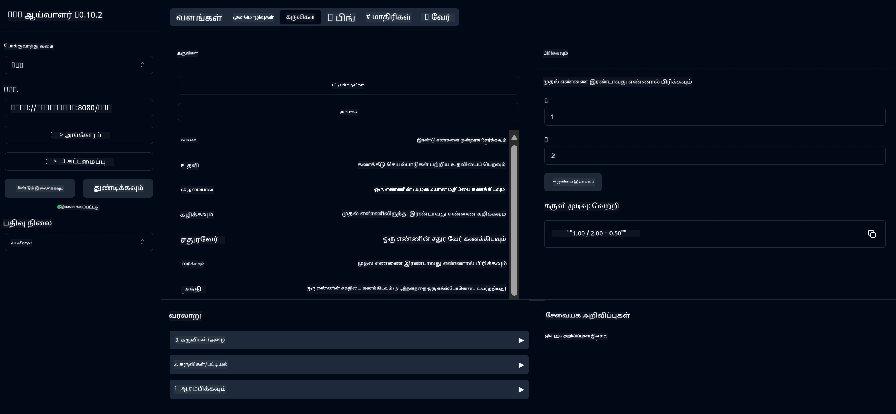

# அடிப்படையிலான கால்குலேட்டர் MCP சேவை

> [!NOTE]
> இந்த ஜாவா தீர்வு பழைய HTTP+SSE போக்குவரத்தைக் கையாள்கிறது மற்றும் MCP `2025-11-25` உடன் பொருந்தக்கூடிய ஒரு SDK ஐ இலக்காகக் கொண்டு உள்ளது.
> இது படிப்புத் திருத்தக் குறியீட்டுடன் பொருந்துவதற்காக வைத்திருக்கப்படுகிறது;
> புதிய தொலைநிலை சர்வர்கள் `2026-07-28` ஸ்ட்ரீமபிள் HTTP ஆதரவை பயன்படுத்த வேண்டும்.

இது ஸ்பிரிங் பூட் மற்றும் WebFlux போக்குவரத்தைப் பயன்படுத்தி Model Context Protocol (MCP) மூலம் அடிப்படையான கால்குலேட்டர் செயல்பாடுகளை வழங்கும் சேவை ஆகும். MCP அமலாக்கங்களை பற்றி கற்றுக்கொள்ளும் தொடக்கநிலை பயனாளிகளுக்கான எளிய உதாரணமாக வடிவமைக்கப்பட்டுள்ளது.

மேலதிக தகவலுக்கு, [MCP Server Boot Starter](https://docs.spring.io/spring-ai/reference/api/mcp/mcp-server-boot-starter-docs.html) குறிப்பு ஆவணத்தை பார்க்கவும்.


## சேவையைப் பயன்படுத்துதல்

இந்த சேவை MCP நெறிமுறையின் மூலம் பின்வரும் API முனையங்களை வெளிப்படுத்துகிறது:

- `add(a, b)`: இரண்டு எண்களை கூட்டவும்
- `subtract(a, b)`: இரண்டாவது எண்ணை முதல் எண்ணிலிருந்து கழிக்கவும்
- `multiply(a, b)`: இரண்டு எண்களை பெருக்கவும்
- `divide(a, b)`: முதல் எண்ணை இரண்டாவது எண்ணால் பகுக்கவும் (பூஜ்யத் தணிக்கை உடன்)
- `power(base, exponent)`: ஒரு எண்ணின் சக்தியை கணக்கிடவும்
- `squareRoot(number)`: ஒரு எண்ணின் விகுது வீதத்தை கணக்கிடவும் (எதிர்மறை எண் சோதனையுடன்)
- `modulus(a, b)`: வகுத்த பின்னர் மீதமானதை கணக்கிடவும்
- `absolute(number)`: ஒரு எண்ணின் பரிந்துவ மதிப்பை கணக்கிடவும்

## சாரவினைகள்

இந்த திட்டத்திற்கு பின்வரும் முக்கிய சாரவினைகள் தேவைப்படுகின்றன:

```xml
<dependency>
    <groupId>org.springframework.ai</groupId>
    <artifactId>spring-ai-starter-mcp-server-webflux</artifactId>
</dependency>
```

## திட்டத்தை உருவாக்குதல்

Maven ஐ பயன்படுத்தி திட்டத்தை உருவாக்கவும்:
```bash
./mvnw clean install -DskipTests
```

## சர்வரை இயக்குதல்

### ஜாவாவைப் பயன்படுத்துதல்

```bash
java -jar target/calculator-server-0.0.1-SNAPSHOT.jar
```

### MCP இன்ஸ்பेक்டரைப் பயன்படுத்துதல்

MCP இன்ஸ்பெக்டர் என்பது MCP சேவைகளுடன் தொடர்பு கொள்வதற்கு உதவியாகும் ஒரு கருவி ஆகும். இந்த கால்குலேட்டர் சேவையுடன் இதைப் பயன்படுத்த:

1. **MCP இன்ஸ்பெக்டரை நிறுவி இயக்கவும்** புதிய டெர்மினல் சாளரத்தில்:
   ```bash
   npx @modelcontextprotocol/inspector
   ```

2. **வலை UI ஐ அணுகவும்** செயலியின் காட்டிய URL ஐ கிளிக் செய்து (பொதுவாக http://localhost:6274)

3. **தொடர் அமைக்கவும்**:
   - போக்குவரத்து வகையை "SSE" ஆக அமைக்கவும்
   - உங்களின் இயக்குநர் சர்வரின் SSE முனைய URL ஐ அமைக்கவும்: `http://localhost:8080/sse`
   - "Connect" பட்டனை கிளிக் செய்யவும்

4. **கருவிகளைப் பயன்படுத்தவும்**:
   - "List Tools" ஐ கிளிக் செய்து கிடைக்கும் கால்குலேட்டர் செயல்பாடுகளை பார்க்கவும்
   - ஒரு கருவியை தேர்வு செய்து "Run Tool" ஐ கிளிக் செய்து செயல்பாட்டை இயக்கவும்



---

<!-- CO-OP TRANSLATOR DISCLAIMER START -->
**மறுப்பு**:
இந்த ஆவணம் AI மொழிபெயர்ப்பு சேவை [Co-op Translator](https://github.com/Azure/co-op-translator) பயன்படுத்தி மொழிபெயர்க்கப்பட்டுள்ளது. நாங்கள் துல்லியத்திற்காக முயற்சி செய்துள்ளோம், ஆனால் தானாக செய்யப்படும் மொழிபெயர்ப்புகளில் பிழைகள் அல்லது தவறுகள் இருக்கலாம் என்பதை கவனத்தில் கொள்ளவும். அசல் ஆவணம் அதன் தாய்மொழியில் அதிகாரப்பூர்வ ஆதாரமாக கருதப்பட வேண்டும். முக்கியமான தகவல்களுக்கு, தொழில்நுட்பமான மனித மொழிபெயர்ப்பு பரிந்துரைக்கப்படுகிறது. இந்த மொழிபெயர்ப்பைப் பயன்படுத்துவதால் ஏற்படும் எந்த தவறான புரிதல்கள் அல்லது தவறான விளக்கத்திற்கும் நாங்கள் பொறுப்பில்வில்லை.
<!-- CO-OP TRANSLATOR DISCLAIMER END -->