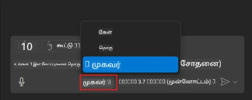
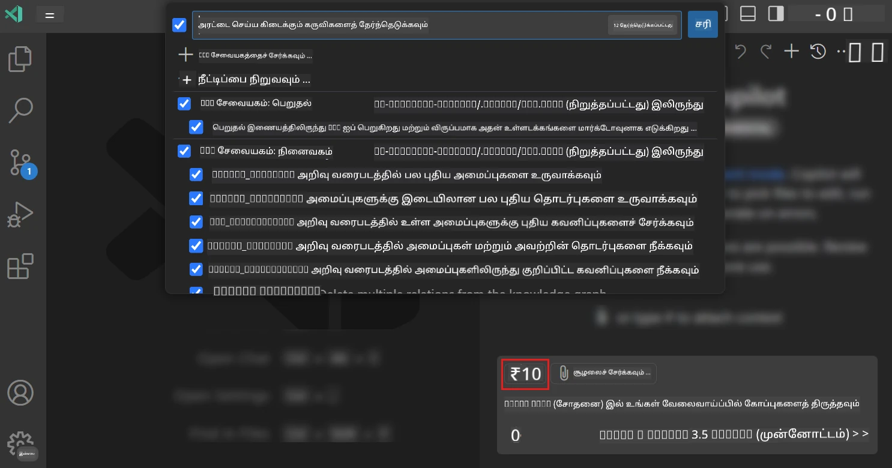
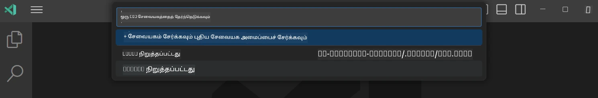
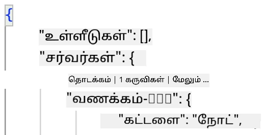
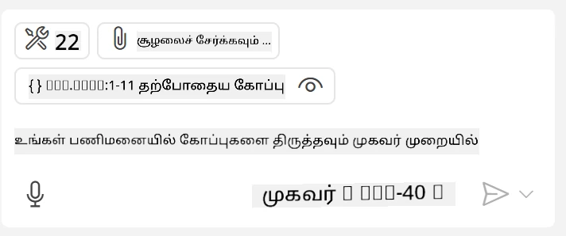
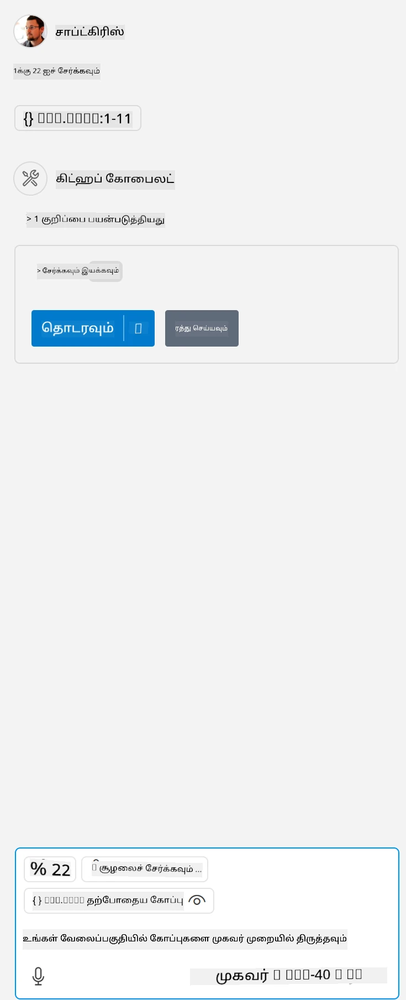

# GitHub Copilot முகவர் முறையிலிருந்து ஒரு சேவையகம் உபயோகிப்பது

Visual Studio Code மற்றும் GitHub Copilot ஒரு கிளையண்டாக செயல்பட்டு MCP சேவையகத்தைப் பயன்படுத்திக்கொள்ளலாம். நீங்கள் இதற்கு ஏன் விரும்புவீர்கள் என்று கேட்கலாம், சரி, அதனால் MCP சேவையகத்தில் உள்ள எந்த வசதிகளும் இப்போது உங்கள் IDE உள்ளே பயன்படுத்தக்கூடியதாக இருக்கும். உதாரணமாக நீங்கள் GitHub இன் MCP சேவையகத்தைச் சேர்க்கிறீர்கள் என்று கற்பனை செய்க, இப்பொழுது குறிப்பிட்ட கட்டளைகளை டெர்மினலில் تایப்பதைவிட, GitHub ஐ இளச்செலுத்தும் முறையில் கட்டுப்படுத்த முடியும். அல்லது எந்தவொரு விஷயமும் உங்கள் டெவலப்பர் அனுபவத்தை மேம்படுத்தலாம், அனைத்தும் இயல்பான மொழியால் கட்டுப்படுத்தப்படலாம். இப்போது நீங்கள் வெற்றி காண ஆரம்பித்தீர்களா?

## உட்பிரிவு

இந்த பாடம் Visual Studio Code மற்றும் GitHub Copilot-ன் முகவர் முறையை உங்கள் MCP சேவையகத்திற்கான கிளையண்டாக எப்படி பயன்படுத்துவது என்பதைக் கற்றுக்கொள்கிறது.

## கற்றல் குறிக்கோள்கள்

இந்தப் பாடத்தின் முடிவில், நீங்கள் இது அனைத்தையும் செய்யக்கூடும்:

- Visual Studio Code மூலம் MCP சேவையகத்தை உபயோகிப்பது.
- GitHub Copilot மூலம் கருவிகளை இயக்குதல்.
- உங்கள் MCP சேவையகத்தை கண்டுபிடித்து நிர்வகிக்க Visual Studio Code ஐ அமைக்குவது.

## பயன்பாடு

நீங்கள் உங்கள் MCP சேவையகத்தை இரண்டு விதிகளில் கட்டுப்படுத்தலாம்:

- பயனர் இடைமுகம், இதை எப்படி செய்வதென்பதை இந்த அத்தியாயத்தின் பிற பகுதிகளில் பார்க்கலாம்.
- டெர்மினல், `code` இயங்குதளத்தைப் பயன்படுத்தி டெர்மினலிலேயே கட்டுப்படுத்த முடியும்:

  உங்கள் பயனர் சுயவிவரத்திற்கு MCP சேவையகத்தைச் சேர்க்க, --add-mcp கட்டளைக்கு பயன்படுத்தவும், JSON சேவையகத்திட்டலை {\"name\":\"server-name\",\"command\":...} வடிவத்தில் வழங்கவும்.

  ```
  code --add-mcp "{\"name\":\"my-server\",\"command\": \"uvx\",\"args\": [\"mcp-server-fetch\"]}"
  ```

### திரைப் புகைப்படங்கள்





அடுத்து உள்ள பகுதிகளில் நாம் காட்சி இடைமுகத்தை எப்படி பயன்படுத்துவதைப் பற்றி பேசுவோம்.

## அணுகுமுறை

இங்கு எங்களுக்கு ஒரு உயர் நிலை முறையில் அணுக வேண்டியுள்ளது:

- MCP சேவையகத்தை கண்டுபிடிக்க ஒரு கோப்பை அமைக்கவும்.
- அந்தச் சேவையகத்தைத் தொடங்கவும் / இணைக்கவும், அதன் திறன்களை பட்டியலிட.
- GitHub Copilot காட்சி உரையாடல் இடைமுகத்தின் மூலம் அந்த திறன்களைப் பயன்படுத்தவும்.

சரி, இப்போது இது எப்படி இயங்குகிறது என்பதை புரிந்துகொண்டோம், Visual Studio Code மூலம் MCP சேவையகம் எப்படி உபயோகிக்கலாம் என்பதை ஒரு பயிற்சியில் முயற்சி செய்யலாம்.

## பயிற்சி: ஒரு சேவையகத்தை உபயோகிப்பது

இந்தப் பயிற்சியில், Visual Studio Code ஐ உங்கள் MCP சேவையகத்தை கண்டுபிடிக்க அமைக்கப்போகிறோம், இது GitHub Copilot உரையாடல் இடைமுகத்திலிருந்து பயன்படுத்தக்கூடியதாக இருக்கும்.

### -0- முன்னோடி, MCP சேவையக கண்டுபிடிப்பை இயக்கு

உங்கள் அணி MCP சேவையக கண்டுபிடிப்பை இயக்கு வேண்டும்.

1. Visual Studio Codeல் `File -> Preferences -> Settings` செல்லவும்.

1. "MCP" என்று தேடி settings.json கோப்பில் `chat.mcp.discovery.enabled` ஐ இயக்கு.

### -1- கட்டமைப்பு கோப்பை உருவாக்கு

உங்கள் திட்ட ரூட்டில் MCP.json என்ற கோப்பை .vscode என்ற கோப்புறையில் உருவாக்கி கீழ்காணும் மாதிரியாகக் கொள்ளவும்:

```text
.vscode
|-- mcp.json
```

அடுத்து, சேவையகத்தின் இடுகையை எப்படி சேர்ப்பது என்று பார்ப்போம்.

### -2- சேவையகத்தை கட்டமைக்கவும்

*mcp.json*க்கு கீழ்காணும் தகவலைச் சேர்க்கவும்:

```json
{
    "inputs": [],
    "servers": {
       "hello-mcp": {
           "command": "node",
           "args": [
               "build/index.js"
           ]
       }
    }
}
```

மேலே ஒரு எளிய Node.js இல் எழுதப்பட்ட சேவையகத்தைக் கொண்டு எப்படி தொடங்குவது என்பதற்கான உதாரணம் உள்ளது, மற்ற இயக்கக்கூறுகளுக்கு சரியான கட்டளையை `command` மற்றும் `args` மூலம் குறிப்பிடவும்.

### -3- சேவையகத்தை தொடங்கு

இடுகையைச் சேர்ந்தவுடன், சேவையகத்தைத் தொடங்குவோம்:

1. *mcp.json*இல் உங்கள் இடுகையை கண்டுபிடித்து "play" ஐகானைக் காண்க:

    

1. "play" ஐகானை சொடுக்குங்கள், GitHub Copilot உரையாடலில் கருவி ஐகான் அதிகரித்து கிடைக்கும் கருவிகளின் எண்ணிக்கை அதிகரிக்கும். அந்த கருவி ஐகானை சொடுக்கும்போது பதிவு செய்யப்பட்ட கோர்ஸ்களின் பட்டியலை காணலாம். GitHub Copilot அவற்றை பின்னூட்டமாகப் பயன்படுத்த விரும்பினால் ஒவ்வொரு கருவியையும் தேர்வு/விலக்கு செய்யலாம்:

  

1. கருவியை இயக்க, உங்கள் கருவிகளில் ஒன்றின் விளக்கத்துடன் பொருந்தும் இவ்விதமான ஒரு உத்தரவுரையை டைப் செய்யவும், உதாரணமாக "add 22 to 1" போன்ற பதிவு:

  

  23 என்று பதில் கிடைக்கும்.

## பணிகள்

உங்கள் *mcp.json* கோப்பினுள் சேவையக அட்டவணையைச் சேர்த்து, சேவையகத்தை தொடங்க/நிறுத்தும் செயல்களைச் செய்ய முயற்சிக்கவும். மேலும் GitHub Copilot உரையாடல் இடைமுகத்தினூடாக உங்கள் சேவையக கருவிகளுடன் தொடர்பு கொள்ள முடிந்தால் சரிபார்க்கவும்.

## தீர்வு

[தீர்வு](./solution/README.md)

## முக்கிய எடுத்துக்காட்டுகள்

இந்த அத்தியாயத்தில் முக்கியமாகப் பெற வேண்டியவைகள் பின்வருமாறு:

- Visual Studio Code சிறந்த கிளையண்டாக பல MCP சேவையகங்களையும் அவற்றது கருவிகளையும் பயன்படுத்த அனுமதிக்கிறது.
- GitHub Copilot உரையாடல் இடைமுகம் மூலம் சேவையகங்களுடன் நீங்கள் தொடர்பு கொள்கிறீர்கள்.
- MCP சேவையக இடுகையை *mcp.json* கோப்பில் அமைப்பதற்கும், API விசைகள் போன்ற உள்ளீடுகளை பயனரிடம் கேட்டு அவற்றை MCP சேவையகத்திற்கு அனுப்புவதற்கு உங்களுக்கு வாய்ப்பு உள்ளது.

## மாதிரிகள்

- [ஜாவா கணக்கெங்கீட்டாளர்](../samples/java/calculator/README.md)
- [.Net கணக்கெங்கீட்டாளர்](../../../../03-GettingStarted/samples/csharp)
- [JavaScript கணக்கெங்கீட்டாளர்](../samples/javascript/README.md)
- [TypeScript கணக்கெங்கீட்டாளர்](../samples/typescript/README.md)
- [Python கணக்கெங்கீட்டாளர்](../../../../03-GettingStarted/samples/python)

## கூடுதல் வளங்கள்

- [Visual Studio ஆவணங்கள்](https://code.visualstudio.com/docs/copilot/chat/mcp-servers)

## அடுத்தது என்ன

- அடுத்து: [stdio சேவையகம் உருவாக்குதல்](../05-stdio-server/README.md)

---

<!-- CO-OP TRANSLATOR DISCLAIMER START -->
**மறுப்பு**:
இந்த ஆவணம் AI மொழிபெயர்ப்பு சேவை [Co-op Translator](https://github.com/Azure/co-op-translator) பயன்படுத்தி மொழிபெயர்க்கப்பட்டுள்ளது. நாங்கள் துல்லியத்திற்காக முயற்சி செய்துள்ளோம், ஆனால் தானாக செய்யப்படும் மொழிபெயர்ப்புகளில் பிழைகள் அல்லது தவறுகள் இருக்கலாம் என்பதை கவனத்தில் கொள்ளவும். அசல் ஆவணம் அதன் தாய்மொழியில் அதிகாரப்பூர்வ ஆதாரமாக கருதப்பட வேண்டும். முக்கியமான தகவல்களுக்கு, தொழில்நுட்பமான மனித மொழிபெயர்ப்பு பரிந்துரைக்கப்படுகிறது. இந்த மொழிபெயர்ப்பைப் பயன்படுத்துவதால் ஏற்படும் எந்த தவறான புரிதல்கள் அல்லது தவறான விளக்கத்திற்கும் நாங்கள் பொறுப்பில்வில்லை.
<!-- CO-OP TRANSLATOR DISCLAIMER END -->