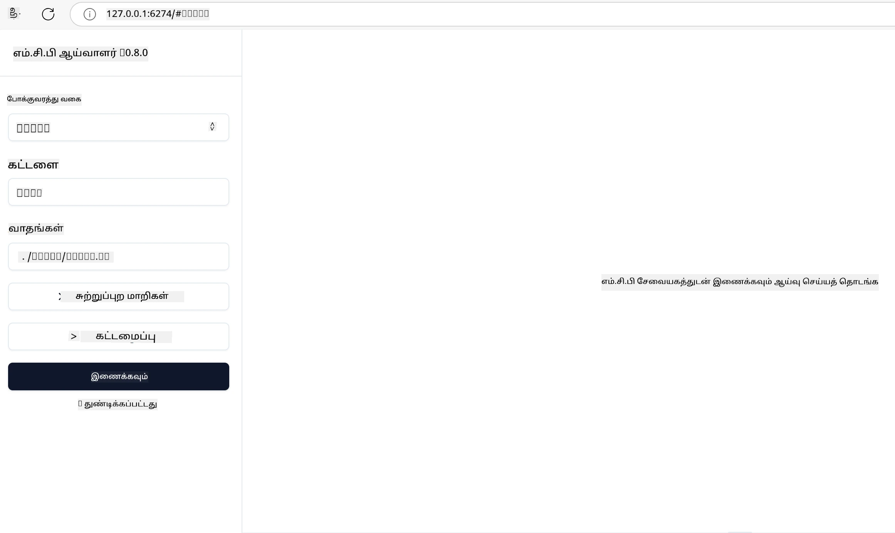

## சோதனை மற்றும் பிழைத்திருத்தம்

உங்கள் MCP சர்வரை சோதிக்கத் தொடங்குவதற்கு முன், கிடைக்கும் கருவிகள் மற்றும் பிழைத்திருத்தத்திற்கான சிறந்த நடைமுறைகளைப் புரிந்து கொள்வது முக்கியம். பயனுள்ள சோதனை உங்கள் சர்வர் எதிர்பார்ப்புக்கு ஏற்ப நடக்க உறுதி செய்யும் மற்றும் நீங்கள் விரைவாக பிரச்சனைகளை அடையாளம் காணவும் தீர்க்கவும் உதவும். பின்வரும் பிரிவு உங்கள் MCP அமல் பொருந்துதல் சரிபார்க்க பரிந்துரைக்கப்படும் அணுகுமுறைகளை விளக்குகிறது.

## கண்ணோட்டம்

இந்த பாடம் சரியான சோதனை முறையை தேர்ந்தெடுக்கும் மற்றும் மிகவும் பயனுள்ள சோதனை கருவியைப் பற்றியும் கற்பிக்கும்.

## கற்கும் இலக்குகள்

இந்த பாடத்தின் முடிவில், நீங்கள்:

- சோதனையிற்கான பல அணுகுமுறைகளை விவரிக்க முடியும்.
- உங்கள் குறியீட்டை பயனுள்ளதாக சோதிக்க பல கருவிகளைப் பயன்படுத்த முடியும்.


## MCP சர்வர்களை சோதித்தல்

MCP உங்கள் சர்வர்களை சோதிக்கவும் பிழைத்திருத்தவும் உதவும் கருவிகளை வழங்குகிறது:

- **MCP இன்ஸ்பெக்டர்**: CLI கருவியாகவும் பார்வை கருவியாகவும் இயங்கக்கூடிய கட்டளை வரி கருவி.
- **கைமுறை சோதனை**: curl போன்ற கருவியை பயன்படுத்தி வலை கோரிக்கைகளைச் செய்யலாம், ஆனால் HTTP இயங்கக்கூடிய எந்த கருவியும் பரணிும்.
- **அலகு சோதனை**: உங்கள் விருப்ப சோதனை கட்டமைப்பை பயன்படுத்தி சர்வர் மற்றும் கிளையண்டின் அம்சங்களை சோதிக்க முடியும்.

### MCP இன்ஸ்பெக்டரைப் பயன்படுத்துதல்

இந்த கருவியின் பயன்பாட்டை முன்பண்ட பாடங்களில் விவரித்துள்ளோம், ஆனால் இப்போது சிறிது உயர் மட்டத்தில் பேசுவோம். இது Node.js இல் உருவாக்கப்பட்ட கருவி மற்றும் நீங்கள் `npx` எக்ஸிகியூட்டபிளை அழைப்பதன் மூலம் பயன்படுத்தலாம், இது கருவியை தற்காலிகமாக பதிவிறக்கும் மற்றும் நிறுவும் மற்றும் உங்கள் கோரிக்கை ஓட்டி முடிந்தவுடன் தானாக அகற்றும்.

[MCP இன்ஸ்பெக்டர்](https://github.com/modelcontextprotocol/inspector) உதவுகிறது:

- **சர்வர் திறன்களை கண்டறிதல்**: கிடைக்கும் வளங்கள், கருவிகள் மற்றும் தூண்டுதல்களை தானாக கண்டறிதல்
- **கருவி செயல்பாட்டை சோதித்தல்**: பல்வேறு அளவுருக்களை முயற்சி செய்து நேரடி பதில்களை பார்க்க
- **சர்வர் மெட்டாடேட்டாவை பார்க்க**: சர்வர் தகவல், விளக்கக்கோவை மற்றும் கட்டமைப்புகளை ஆய்வு செய்ய

கருவியின் வழக்கமான ஓட்டம் இவ்வாறு இருக்கும்:

```bash
npx @modelcontextprotocol/inspector node build/index.js
```

மேலே உள்ள கட்டளை ஒரு MCP ஐத் தொடங்கி அதன் பார்வை இடைமுகத்தையும் துரித இணைய உலாவலில் வெளிப்படுத்துகிறது. பதிவு செய்யப்பட்ட MCP சர்வர்கள், அவற்றின் கிடைக்கும் கருவிகள், வளங்கள் மற்றும் தூண்டுதல்களை காட்டும் ஒரு டாஷ்போர்டை பார்க்கலாம். இடைமுகம் உங்கள் MCP சர்வர் அமலாக்கங்களை சரிபார்க்க மற்றும் பிழைத்திருத்த எளிதாக்கி கருவி செயல்பாட்டை குறும்படமாக சோதிக்கவும், சர்வர் மெட்டாடேட்டாவை ஆய்வுசெய்யவும் நேரடி பதில்களைப் பார்க்கவும் அனுமதிக்கிறது.

இது எப்படி தோன்றும்: 

நீங்கள் இந்த கருவியை CLI முறையில் இயக்கலாம் இதில் `--cli` பண்பை சேர்க்க வேண்டும். இது "CLI" முறையில் கருவி இயக்கும் உதாரணம், இதில் சர்வரில் உள்ள அனைத்து கருவிகளும் பட்டியலிடப்பட்டிருக்கும்:

```sh
npx @modelcontextprotocol/inspector --cli node build/index.js --method tools/list
```

### கைமுறை சோதனை

சர்வர் திறன்களைச் சோதிக்க இன்ஸ்பெக்டர் கருவியினை ஓட்டுவதற்கு மேலாக, HTTP பயன்படுத்தக்கூடிய கிளையண்டை, உதாரணமாக curl, இயக்குவதும் ஒரு இதர அணுகுமுறை ஆகும்.

curl கொண்டு நேரடியாக MCP சர்வர்களை HTTP கோரிக்கைகளின் மூலம் சோதிக்கலாம்:

```bash
# உதாரணம்: சோதனை சேவையக மெட்டாடேட்டா
curl http://localhost:3000/v1/metadata

# உதாரணம்: ஒரு கருவியை இயக்குக
curl -X POST http://localhost:3000/v1/tools/execute \
  -H "Content-Type: application/json" \
  -d '{"name": "calculator", "parameters": {"expression": "2+2"}}'
```

மேலே curl பயன்பாட்டில் காண்க, நீங்கள் கருவியின் பெயர் மற்றும் அதன் அளவுருக்களை கொண்ட payload ஐ பாஸ்ட் கோரிக்கையால் ஒரு கருவியை இயக்குகிறீர்கள். உங்களுக்கு பொருத்தமான அணுகுமுறையை பயன்படுத்தவும். CLI கருவிகள் பொதுவாக வேகமாக பயன்படுத்தப்படக்கூடியவை, மேலும் அவை நாடகமாக்கப்படக்கூடியவை என்றாலும் CI/CD சுற்றுச்சூழலில் பயன்படலாம்.

### அலகு சோதனை

உங்கள் கருவிகளுக்கும் வளங்களுக்கும் அலகு சோதனைகளை உருவாக்கி அவைகள் எதிர்பார்ப்புக்கு ஏற்ப செயல்படுகின்றன என்று உறுதி செய்யவும். சில உதாரண சோதனை குறியீட்டு கீழே உள்ளன.

```python
import pytest

from mcp.server.fastmcp import FastMCP
from mcp.shared.memory import (
    create_connected_server_and_client_session as create_session,
)

# முழு மாடியூலை அசிங்க் சோதனைகளுக்கு குறியிடுக
pytestmark = pytest.mark.anyio


async def test_list_tools_cursor_parameter():
    """Test that the cursor parameter is accepted for list_tools.

    Note: FastMCP doesn't currently implement pagination, so this test
    only verifies that the cursor parameter is accepted by the client.
    """

 server = FastMCP("test")

    # சில சோதனை கருவிகளை உருவாக்குக
    @server.tool(name="test_tool_1")
    async def test_tool_1() -> str:
        """First test tool"""
        return "Result 1"

    @server.tool(name="test_tool_2")
    async def test_tool_2() -> str:
        """Second test tool"""
        return "Result 2"

    async with create_session(server._mcp_server) as client_session:
        # கன்சர் பராமரிப்பின்றி சோதனை (விடுபட்டது)
        result1 = await client_session.list_tools()
        assert len(result1.tools) == 2

        # cursor=None உடன் சோதனை
        result2 = await client_session.list_tools(cursor=None)
        assert len(result2.tools) == 2

        # குறிச்சொல் ஓர் சரமாக இருக்கும் சோதனை
        result3 = await client_session.list_tools(cursor="some_cursor_value")
        assert len(result3.tools) == 2

        # காலியான சரியான குறிசியுடன் சோதனை
        result4 = await client_session.list_tools(cursor="")
        assert len(result4.tools) == 2
    
```

மேற்கண்ட குறியீடு பின்வருமாறு செய்கிறது:

- pytest கட்டமைப்பை பயன்படுத்துகிறது, இது நீங்கள் செயல்கள் மற்ற கூறுகள் போல் சோதனைகளை உருவாக்கவும் assert அறிக்கைகள் பயன்படுத்தவும் உதவுகிறது.
- இரண்டு வித்தியாசமான கருவிகளுடன் MCP சர்வரை உருவாக்குகிறது.
- குறிப்பிட்ட நிபந்தனைகள் பூர்த்தியாகும் என்று சரிபார்க்க `assert` அறிக்கையைப் பயன்படுத்துகிறது.

முழு கோப்பை இங்கு பார்க்கவும் [full file here](https://github.com/modelcontextprotocol/python-sdk/blob/main/tests/client/test_list_methods_cursor.py)

மேலே உள்ள கோப்பின் அடிப்படையில், உங்கள் சொந்த சர்வரை சோதித்து திறன்கள் சரியாக உருவாக்கப்பட்டுள்ளன என உறுதி செய்யலாம்.

அனைத்து முக்கிய SDK களிலும் இதே போன்ற சோதனை பிரிவுகள் உள்ளன, எனவே நீங்கள் தேர்ந்தெடுத்த ரன்டைமுக்கு ஏற்ப அதை ஏற்படுத்திக் கொள்ளலாம்.

## உதாரணங்கள்

- [Java Calculator](../samples/java/calculator/README.md)
- [.Net Calculator](../../../../03-GettingStarted/samples/csharp)
- [JavaScript Calculator](../samples/javascript/README.md)
- [TypeScript Calculator](../samples/typescript/README.md)
- [Python Calculator](../../../../03-GettingStarted/samples/python)

## கூடுதல் வளங்கள்

- [Python SDK](https://github.com/modelcontextprotocol/python-sdk)

## அடுத்தது என்ன

- அடுத்தது: [பதிவேற்றம்](../09-deployment/README.md)

---

<!-- CO-OP TRANSLATOR DISCLAIMER START -->
**மறுப்பு**:
இந்த ஆவணம் AI மொழிபெயர்ப்பு சேவை [Co-op Translator](https://github.com/Azure/co-op-translator) பயன்படுத்தி மொழிபெயர்க்கப்பட்டுள்ளது. நாங்கள் துல்லியத்திற்காக முயற்சி செய்துள்ளோம், ஆனால் தானாக செய்யப்படும் மொழிபெயர்ப்புகளில் பிழைகள் அல்லது தவறுகள் இருக்கலாம் என்பதை கவனத்தில் கொள்ளவும். அசல் ஆவணம் அதன் தாய்மொழியில் அதிகாரப்பூர்வ ஆதாரமாக கருதப்பட வேண்டும். முக்கியமான தகவல்களுக்கு, தொழில்நுட்பமான மனித மொழிபெயர்ப்பு பரிந்துரைக்கப்படுகிறது. இந்த மொழிபெயர்ப்பைப் பயன்படுத்துவதால் ஏற்படும் எந்த தவறான புரிதல்கள் அல்லது தவறான விளக்கத்திற்கும் நாங்கள் பொறுப்பில்வில்லை.
<!-- CO-OP TRANSLATOR DISCLAIMER END -->