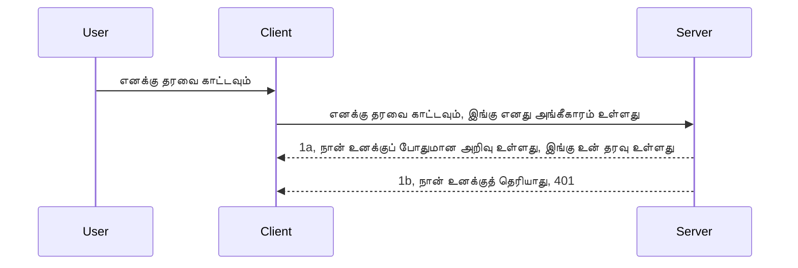

# எளிய அத்தொடு

MCP SDKகள் OAuth 2.1 பயன்பாட்டை ஆதரிக்கிறது, இது நியாயமாகச் சொல்லப்போனால் அத்தொடு சேவையகம், வள சேவையகம், அடைவைச் சேவைப்பது, குறியீட்டை பெறுவது, குறியீட்டை கையொப்ப அடையாளத்துக்குப் பரிமாற்றுவது ஆகிய கருத்துக்களை உள்ளடக்கிய ஒரு சிக்கலான செயல்முறை ஆகும், முடிவாக நீங்கள் உங்கள் வள தரவுக்களைப் பெற முடியும். OAuth குறித்து நீங்கள் பழகியிருக்காவிட்டால், இது செயற்படுத்த நல்லது, சிக்கலற்ற அடிப்படை நிலை அத்தொடு கொண்டு தொடங்கி சிறந்த பாதுகாப்பு நிலைக்கு முன்னேறுவது நல்ல யோசனை. இதனால் இந்த அத்தியாயம் உள்ளது, இது உங்களை மேம்பட்ட அத்தொடு நிலைக்கு கட்டமைக்கிறது.

## அத்தொடு என்றால் என்ன?

அத்தொடு என்பது அங்கீகாரம் மற்றும் அங்கீகரிப்புக்கான சுருக்கம். நாங்கள் செய்ய வேண்டியது இரண்டு விஷயங்கள்:

- **அங்கீகாரம்**, ஒருவரை நமது வீட்டுக்குள் அனுமதிப்பதா என, அவர்கள் "இங்கே" இருக்கச் செல்லுபடியான என்று தெரிந்து கொள்ளும் செயல்முறை, அதாவது நமது MCP சேவையக அம்சங்கள் இருப்பது வள சேவையகத்துக்கு அணுகல் உள்ளது என்பதைக் கணக்கிடுதல்.
- **அங்கீகரிப்பு**, ஒரு பயனர் கேட்கும் குறிப்பிட்ட வளங்களுக்கு அணுகலை பெற்றிருக்க வேண்டுமா என்று பார்க்கும் செயல்முறை, எடுத்துக்காட்டாக இந்த ஆர்டர்கள் அல்லது இந்த பொருட்களைப்பற்றி தாங்கள் படிக்க அனுமதி உள்ளது, அழிக்க அனுமதி இல்லை போன்றவை.

## அடையாளச் சான்றுகள்: நாங்கள் யார் என்பதைப் பத்திரமாக சொல்லுவது எப்படி

பெரும்பாலான வலை மேம்பாட்டாளர்கள் சேவையகத்துக்கு அடையாளச் சான்றை வழங்க வேண்டும் என்று நினைக்கத் தொடங்குகிறார்கள், பொதுவாக அது ஒரு ரகசியம், அதற்கு அவர்களுக்கு இங்கே இருப்பதற்கான அங்கீகாரம் உள்ளதா என காண்பது. இந்த அடையாளச் சான்று பொதுவாக பயனர்பெயர் மற்றும் கடவுச்சொல்லின் base64 குறியாக்கப்பட்ட வடிவமோ, அல்லது ஒரு API விசையாக இருக்க வாய்ப்பு உள்ளது, இது தனித்துவமாக பயனர்த் தனிப்பட்ட அடையாளத்தைக் குறிக்கிறது.

இது நிரலாக "Authorization" என்ற தலைப்புக் கொண்டு அனுப்பப்படுகிறது:

```json
{ "Authorization": "secret123" }
```

இது பொதுவாக அடிப்படையிலான அங்கீகாரம் என்று அழைக்கப்படுகிறது. இதன் முழுமையான ஓட்டம் பின்வரும் முறையில் செயல்படுகின்றது:


ஆனால் ஓட்ட முனையிலிருந்து இது எப்படி செயல்படுகிறது என்பதைத் தெரிந்து கொண்டபின்பு, நாம் இதை எப்படி நடைமுறைப்படுத்துவது? பெரும்பாலான வலை சேவையகங்களுக்கு "middleware" எனும் கொள்கை உள்ளது, இது கோரிக்கையின் ஒரு பகுதியாக இயங்கும் குறியீடு உண்டு, இது அடையாளச் சான்றுகளை சரிபார்க்கும்; சான்றுகள் செல்லுபடியானவையாக இருந்தால் கோரிக்கையை அனுமதிக்கிறது. கோரிக்கையில் செல்லுபடி இல்லாத சான்றுகள் இருந்தால், அத்தொடு பிழை வருகிறது. இதை எப்படி நடைமுறைப்படுத்துவது பார்த்தோம்:

**Python**

```python
class AuthMiddleware(BaseHTTPMiddleware):
    async def dispatch(self, request, call_next):

        has_header = request.headers.get("Authorization")
        if not has_header:
            print("-> Missing Authorization header!")
            return Response(status_code=401, content="Unauthorized")

        if not valid_token(has_header):
            print("-> Invalid token!")
            return Response(status_code=403, content="Forbidden")

        print("Valid token, proceeding...")
       
        response = await call_next(request)
        # எதையாவது வாடிக்கையாளர் தலைப்புகளைச் சேர்க்கவும் அல்லது பதிலில் ஏதாவது மாற்றம் செய்யவும்
        return response


starlette_app.add_middleware(CustomHeaderMiddleware)
```

இங்கே:

- `AuthMiddleware` என்ற இடைநிலைய செயலியை உருவாக்கியுள்ளோம், இதன் `dispatch` முறை வலை சேவையகத்தால் அழைக்கப்படுகின்றது.
- இடைநிலை செயலியை வலை சேவையகத்தில் சேர்த்துள்ளோம்:

    ```python
    starlette_app.add_middleware(AuthMiddleware)
    ```

- "Authorization" தலைப்பு இருப்பதை சரிபார்த்து அனுப்பப்பட்ட ரகசியம் செல்லுபடியானதாக இருக்கிறதா என்பதை நிரூபிக்கும் சரிபார்ப்புக் குறியீட்டை எழுதினோம்:

    ```python
    has_header = request.headers.get("Authorization")
    if not has_header:
        print("-> Missing Authorization header!")
        return Response(status_code=401, content="Unauthorized")

    if not valid_token(has_header):
        print("-> Invalid token!")
        return Response(status_code=403, content="Forbidden")
    ```

    ரகசியம் இருந்தும் செல்லுபடியானதும் எனில், `call_next` அழைத்து கோரிக்கையை அனுப்ப அனுமதித்து பதிலளிக்கிறோம்.

    ```python
    response = await call_next(request)
    # எந்தவொரு வாடிக்கையாளர் தலைப்புகளையும் சேர்க்கவும் அல்லது பதிலில் எந்தவொரு விதமாக மாற்றவும்
    return response
    ```

இது எப்படி செயல்படுகிறது என்றால், வலை கோரிக்கை சேவையகத்துக்கு வந்தால் இடைநிலை செயலி இயங்குகிறது, அதை இயங்கச்செய்யும் செயல்பாட்டின்படி கோரிக்கையை அனுப்பவோ அல்லது அத்தொடு பிழையை திருப்பவோ செய்கிறது, இது வாடிக்கையாளர் தொடர முடியாது என குறிக்கிறது.

**TypeScript**

இனி கட்டுமான பிரபலமான Express கட்டமைப்பைப் பயன்படுத்தி இடைநிலை செயலியை உருவாக்கி MCP சேவையகத்திற்கு முன் கோரிக்கையை தடுக்கிறோம். இதோ குறியீடு:

```typescript
function isValid(secret) {
    return secret === "secret123";
}

app.use((req, res, next) => {
    // 1. அங்கீகார தலைப்புப் பகுதி உள்ளது என்பது?
    if(!req.headers["Authorization"]) {
        res.status(401).send('Unauthorized');
    }
    
    let token = req.headers["Authorization"];

    // 2. செல்லுபடித்தன்மையை சரிபார்க்கவும்.
    if(!isValid(token)) {
        res.status(403).send('Forbidden');
    }

   
    console.log('Middleware executed');
    // 3. கோரிக்கை குழாயில் அடுத்த படிக்கு கோரிக்கையை அனுப்புகிறது.
    next();
});
```

இந்த குறியீட்டில்:

1. முதலில் "Authorization" தலைப்பு உள்ளதா என்று பாருங்கள்; இல்லையெனில் 401 பிழையை அனுப்புகிறோம்.
2. சான்று/டோக்கன் செல்லுபடியாக உள்ளதா என்பதை உறுதிப்படுத்துங்கள்; இல்லை என்றால் 403 பிழையை அனுப்புகிறோம்.
3. கடைசியில் கோரிக்கை வழிக் கடத்தப்பட்டு கேட்கப்பட்ட வளத்தை தருகிறது.

## பயிற்சி: அங்கீகாரம் நடைமுறைப்படுத்துதல்

என் கல்வியை எடுத்துக் கொண்டு இதை நடைமுறைப்படுத்த முயலுவோம். திட்டம் இதுவாகும்:

சேவையகம்

- வலை சேவையகமும் MCP நிகழ்வும் உருவாக்குக.
- சேவையகத்துக்கான இடைநிலை செயலியை செயல்படுத்துக.

வாடிக்கையாளர்

- தலைப்பின் மூலம் சான்றோடு வலை கோரிக்கை அனுப்பு.

### -1- வலை சேவையகம் மற்றும் MCP நிகழ்வை உருவாக்குதல்

நமக்கு முதலில் வலை சேவையக நிகழ்வையும் MCP சேவையகத்தையும் வேண்டியது.

**Python**

இங்கே MCP சேவையக நிகழ்வை உருவாக்கி, starlette வலை செயலியை உருவாக்கி uvicorn மூலம் அதனை நடத்துகிறோம்.

```python
# MCP சರ್ವரை உருவாக்குதல்

app = FastMCP(
    name="MCP Resource Server",
    instructions="Resource Server that validates tokens via Authorization Server introspection",
    host=settings["host"],
    port=settings["port"],
    debug=True
)

# starlette வலை பயன்பாட்டை உருவாக்குதல்
starlette_app = app.streamable_http_app()

# uvicorn மூலம் பயன்பாட்டை வழங்குதல்
async def run(starlette_app):
    import uvicorn
    config = uvicorn.Config(
            starlette_app,
            host=app.settings.host,
            port=app.settings.port,
            log_level=app.settings.log_level.lower(),
        )
    server = uvicorn.Server(config)
    await server.serve()

run(starlette_app)
```

இந்த குறியீட்டில்:

- MCP சேவையகத்தை உருவாக்கினோம்.
- MCP சேவையகத்திலிருந்து starlette வலை செயலியை உருவாக்கினோம், `app.streamable_http_app()` என்று அழைக்கப்படுகிறது.
- uvicorn `server.serve()` கொண்டு அதை நடத்துகிறோம்.

**TypeScript**

இங்கே MCP சேவையக நிகழ்வை உருவாக்குகிறோம்.

```typescript
const server = new McpServer({
      name: "example-server",
      version: "1.0.0"
    });

    // ... சேவையகம் வளங்கள், கருவிகள் மற்றும் ஊக்கங்களை அமைக்கவும் ...
```

இந்த MCP சேவையக உருவாக்கல் POST /mcp வழியில் நடப்பதால் மேலே குறியீட்டை அப்படியே அங்கே மாற்ற வேண்டும்:

```typescript
import express from "express";
import { randomUUID } from "node:crypto";
import { McpServer } from "@modelcontextprotocol/sdk/server/mcp.js";
import { StreamableHTTPServerTransport } from "@modelcontextprotocol/sdk/server/streamableHttp.js";
import { isInitializeRequest } from "@modelcontextprotocol/sdk/types.js"

const app = express();
app.use(express.json());

// அமர்வு ஐடியால் போக்குவரத்துகளை சேமிக்க வரைபடம்
const transports: { [sessionId: string]: StreamableHTTPServerTransport } = {};

// கிளையன்ட்-தரவு சேவையக தொடர்புக்கான POST கோரிக்கைகளை கையாள்க
app.post('/mcp', async (req, res) => {
  // உள்ள அமர்வு ஐடி இருப்பதைக் கவனிக்கவும்
  const sessionId = req.headers['mcp-session-id'] as string | undefined;
  let transport: StreamableHTTPServerTransport;

  if (sessionId && transports[sessionId]) {
    // உள்ள போக்குவரத்தை மீண்டும் பயன்படுத்தவும்
    transport = transports[sessionId];
  } else if (!sessionId && isInitializeRequest(req.body)) {
    // புதிய துவக்க கோரிக்கை
    transport = new StreamableHTTPServerTransport({
      sessionIdGenerator: () => randomUUID(),
      onsessioninitialized: (sessionId) => {
        // அமர்வு ஐடியால் போக்குவரத்தை சேமிக்கவும்
        transports[sessionId] = transport;
      },
      // DNS மறுச்சமர்ப்பிப்பு பாதுகாப்பு பழைய பண்புடனான பொருந்துதலுக்காக இயல்பாக முடக்கப்பட்டுள்ளது. நீங்கள் இந்த சேவையகத்தை
      // உள்ளகமாக இயக்கினால், கீழ்காணும் அமைப்புகளைச் சரிபார்க்கவும்:
      // enableDnsRebindingProtection: true,
      // allowedHosts: ['127.0.0.1'],
    });

    // மூடியபோது போக்குவரத்தை சுத்தம் செய்யவும்
    transport.onclose = () => {
      if (transport.sessionId) {
        delete transports[transport.sessionId];
      }
    };
    const server = new McpServer({
      name: "example-server",
      version: "1.0.0"
    });

    // ... சேவையக வளங்கள், கருவிகள் மற்றும் விருப்பங்களை அமைக்கவும் ...

    // MCP சேவையகத்துடன் இணைக
    await server.connect(transport);
  } else {
    // தவறான கோரிக்கை
    res.status(400).json({
      jsonrpc: '2.0',
      error: {
        code: -32000,
        message: 'Bad Request: No valid session ID provided',
      },
      id: null,
    });
    return;
  }

  // கோரிக்கையை கையாள்க
  await transport.handleRequest(req, res, req.body);
});

// GET மற்றும் DELETE கோரிக்கைகளுக்கான மீண்டும் பயன்பாட்டான கையாள்தலர்
const handleSessionRequest = async (req: express.Request, res: express.Response) => {
  const sessionId = req.headers['mcp-session-id'] as string | undefined;
  if (!sessionId || !transports[sessionId]) {
    res.status(400).send('Invalid or missing session ID');
    return;
  }
  
  const transport = transports[sessionId];
  await transport.handleRequest(req, res);
};

// SSE வழியாக சேவையகத்திலிருந்து கிளையன்டுக்கு அறிவிப்புகளுக்கான GET கோரிக்கைகளை கையாள்க
app.get('/mcp', handleSessionRequest);

// அமர்வு நிறுத்தத்துக்கான DELETE கோரிக்கைகளை கையாள்க
app.delete('/mcp', handleSessionRequest);

app.listen(3000);
```

இப்போது MCP சேவையக உருவாக்கம் `app.post("/mcp")` உள்ளே எப்படி நகர்த்தப்பட்டது பார்க்கின்றீர்கள்.

இப்போது அடுத்த படி இடைநிலை செயலியை உருவாக்கி வருகையும் சான்றையும் சரிபார்ப்பதற்குச் செல்லலாம்.

### -2- சேவையகத்துக்கான இடைநிலை செயலியை செயல்படுத்தல்

இப்போது இடைநிலை செயலியை உருவாக்குவோம். இதன் `Authorization` தலைப்பில் சான்று இருப்பதைத் தேடி அதனை சரிபார்க்கிறது. செல்லுபடியானதாக இருந்தால் கோரிக்கை கடந்து தேவையானதைச் செய்கிறது (எ.கா., கருவிகள் பட்டியலிடல், வள வாசித்தல் அல்லது வாடிக்கையாள் கேட்கும் MCP செயல்பாட்டைச் செயல் படுத்தல்).

**Python**

இடைநிலை செயலியை உருவாக்க நாம் `BaseHTTPMiddleware` ஐப் பின்தொடர்வது வேண்டும். அதில் இரண்டு முக்கிய பகுதிகள்:

- `request`, அதில் தலைப்பு தகவலை நாங்கள் படிக்கிறோம்.
- `call_next` என்பதே வாடிக்கையாளர் சான்று ஏற்றுக்கொள்ளப்பட்டால் அழைக்கும் மறுமொழி.

முதலில், `Authorization` தலைப்பில்லாவிட்டால் என்ன செய்வது என்பதை கையாள வேண்டியிருக்கு:

```python
has_header = request.headers.get("Authorization")

# தலைப்பு இல்லை, 401 தோல்வியடையவும், இல்லையெனில் தொடரவும்.
if not has_header:
    print("-> Missing Authorization header!")
    return Response(status_code=401, content="Unauthorized")
```

இங்கு வாடிக்கையாளர் அங்கீகாரம் தோல்வியடைந்ததால் 401 அனுமதியற்ற செய்தி அனுப்புகிறோம்.

அடுத்து, சான்று சமர்ப்பிக்கப்பட்டால், அதன் செல்லுபடியை இதுபோல் சரிபார்க்கிறோம்:

```python
 if not valid_token(has_header):
    print("-> Invalid token!")
    return Response(status_code=403, content="Forbidden")
```

மேலே 403 அனுமதியற்று செய்தியை அனுப்புகிறோம். கீழே முழு இடைநிலை செயலியை பார்க்கலாம்:

```python
class AuthMiddleware(BaseHTTPMiddleware):
    async def dispatch(self, request, call_next):

        has_header = request.headers.get("Authorization")
        if not has_header:
            print("-> Missing Authorization header!")
            return Response(status_code=401, content="Unauthorized")

        if not valid_token(has_header):
            print("-> Invalid token!")
            return Response(status_code=403, content="Forbidden")

        print("Valid token, proceeding...")
        print(f"-> Received {request.method} {request.url}")
        response = await call_next(request)
        response.headers['Custom'] = 'Example'
        return response

```

சிறப்பாக உள்ளது, ஆனால் `valid_token` செயல்பாடு பற்றி? கீழே அதைப் பாருங்கள்:

```python
# தயாரிப்பில் பயன்படுத்த வேண்டாம் - அதை மேம்படுத்துங்கள் !!
def valid_token(token: str) -> bool:
    # "Bearer " முன்னொட்டை நீக்கவும்
    if token.startswith("Bearer "):
        token = token[7:]
        return token == "secret-token"
    return False
```

நிச்சயமாக இதை மேம்படுத்த வேண்டும்.

முக்கியம்: குறியீட்டில் இத்தகைய ரகசியங்களை ஒருபோதும் வைக்காதீர்கள். ஒப்பிடும் மதிப்பை தரவுத்தளத்திலிருந்து அல்லது அடையாள சேவை வழங்குநரிடமிருந்து (IDP) பெற்றுக் கொள்ள வேண்டும் அல்லது சிறந்த முறையாக IDP தானே அங்கீகாரம் செய்யட்டும்.

**TypeScript**

Express மூலம் இது நடைமுறைப்படுத்த `use` முறையை அழைக்க middleware செயல்பாடுகள் எடுத்துக்கொள்ள வேண்டும்.

நாம் செய்யவேண்டும்:

- கோரிக்கை மாறியில், `Authorization` பண்பில் செலுத்திய சான்றை சரிபார்க்க.
- எண்முதலீடு சரிபார்க்கப்பட்டால் கோரிக்கையை அனுமதி, வாடிக்கையாளரின் MCP கோரிக்கைப்போல செயல்களைச் செய்ய அனுமதி (கருவிகள் பட்டியலிடல், வள வாசித்தல் அல்லது பிற செயற்திட்டங்கள்).

இங்கு "Authorization" தலைப்பு இல்லாவிட்டால் 401 பிழை அனுப்பி கோரிக்கையை நிறுத்துகிறோம்:

```typescript
if(!req.headers["authorization"]) {
    res.status(401).send('Unauthorized');
    return;
}
```

தலைப்பு முதலில் அனுப்பப்படவில்லை என்றால் 401 பெறுவீர்கள்.

அடுத்து சான்று செல்லுபடியாக உள்ளதா பார்க்கிறோம், இல்லால் வேறொரு செய்தியுடன் கோரிக்கையை நிறுத்துகிறோம்:

```typescript
if(!isValid(token)) {
    res.status(403).send('Forbidden');
    return;
} 
```

இப்போது 403 பிழை கிடைக்கிறது.

முழு குறியீடு கீழே:

```typescript
app.use((req, res, next) => {
    console.log('Request received:', req.method, req.url, req.headers);
    console.log('Headers:', req.headers["authorization"]);
    if(!req.headers["authorization"]) {
        res.status(401).send('Unauthorized');
        return;
    }
    
    let token = req.headers["authorization"];

    if(!isValid(token)) {
        res.status(403).send('Forbidden');
        return;
    }  

    console.log('Middleware executed');
    next();
});
```

வலை சேவையகத்தில் வாடிக்கையாளர்கள் அனுப்பும் சான்றுகளை சரிபார்க்க இடைநிலை செயலியை அமைத்துள்ளோம். வாடிக்கையாளர் பற்றி என்ன?

### -3- தலைப்பின் மூலம் சான்றோடு வலை கோரிக்கை அனுப்புதல்

வாடிக்கையாளர் தலைப்பின் மூலம் சான்றை கடத்துவதை உறுதிசெய்ய வேண்டும். MCP வாடிக்கையாளரைப் பயன்படுத்தவுள்ளோம், அதற்கான செயன்முறை இதோ:

**Python**

வாடிக்கையாளர்க்கு header-ல் சான்றுடன் அனுப்ப வேண்டும்:

```python
# மதிப்பை கடினமாக குறியீட்டுக்கு எழுத வேண்டாம், குறைந்தபட்சம் அதை ஒரு சூழல் மாறியில் அல்லது மேலும் பாதுகாப்பான சேமிப்பில் வைத்திருங்கள்
token = "secret-token"

async with streamablehttp_client(
        url = f"http://localhost:{port}/mcp",
        headers = {"Authorization": f"Bearer {token}"}
    ) as (
        read_stream,
        write_stream,
        session_callback,
    ):
        async with ClientSession(
            read_stream,
            write_stream
        ) as session:
            await session.initialize()
      
            # செய்ய வேண்டியது, நீங்கள் கிளையன்டில் செய்ய விரும்புவது, உதாரணமாக கருவிகளை பட்டியலிடுதல், கருவிகளை அழைத்தல் போன்றவை.
```

`headers = {"Authorization": f"Bearer {token}"}` எனக்குப் பார்க்கலாம் எப்படிப் பாராமிடர்கள் நிரப்பப்படுகின்றன.

**TypeScript**

இதை இரண்டு படிகளால் தீர்க்கலாம்:

1. ஓர் வேலைநிறுத்தத் தொகுப்பை சான்றுடன் நிரப்புதல்.
2. வேலைநிறுத்தத் தொகுப்பை போக்குவரத்துக்கு வழங்குதல்.

```typescript

// இங்கே காட்டப்பட்டுள்ளதைப் போல மதிப்பை கடுமையாக நிரலாக்க வேண்டாம். குறைந்தபட்சம் அதை ஒரு சூழல் மாறியாக வைத்திருங்கள் மற்றும் dev mode இல் dotenv போன்ற ஒன்றைப் பயன்படுத்துங்கள்.
let token = "secret123"

// கிளையன்ட் டிரான்ஸ்போர்ட் விருப்ப பொருளை வரையறுக்கவும்
let options: StreamableHTTPClientTransportOptions = {
  sessionId: sessionId,
  requestInit: {
    headers: {
      "Authorization": "secret123"
    }
  }
};

// விருப்ப பொருளை டிரான்ஸ்போர்டிற்கு அனுப்பவும்
async function main() {
   const transport = new StreamableHTTPClientTransport(
      new URL(serverUrl),
      options
   );
```

மேலே, `options` என்ற பொருளைப் உருவாக்கி, அதன் `requestInit` பண்பில் தலைப்புகள் வைக்கப்படுகின்றன.

முக்கியம்: இதை மேம்படுத்துவது எப்படி? இப்போதைய நடைமுறை சில பிரச்சனைகள் உள்ளது. முதலில், இப்படி சான்று அனுப்புவது HTTPS இல்லாவிட்டால் ஆபத்தானது. இருந்தும் சான்று திருடப்படக்கூடியது, ஆகவே டோக்கன் மறுப்பு மற்றும் கூடுதல் சரிபார்ப்புப் படி அமைக்க வேண்டும்: உலகில் எங்கிருந்து வருகிறது, கூடாது மீள வழங்கல், உள்பட, பல பாதுகாப்பு கவலைகள் உள்ளன.

அவர் சொல்ல விரும்புவது, மிக எளிய APIகளுக்கு இது ஒரு நல்ல தொடக்கம்.

இதற்குப் பிறகு JSON வலை டோக்கன்களை (JWT) பயன்படுத்தி பாதுகாப்பை மேலும் உறுதி செய்ய முயற்சிப்போம்.

## JSON வலை டோக்கன்கள், JWT

என்றால், மிகவும் எளிய அடையாள அணுகலை மேம்படுத்த முயல்கிறோம். JWT ஏற்றுக்கொள்வதன் உடனடி மேம்பாடுகள் என்ன?

- **பாதுகாப்பு மேம்பாடுகள்**. அடிப்படையிலான அங்கீகாரத்தில் நீங்கள் பயனர்பெயர் மற்றும் கடவுச்சொல்லை base64 குறியாக்கத்துடன் (அல்லது API விசையாக) அனுப்புகிறீர்கள், இது அபாயத்தை அதிகரிக்கும். JWT-இல், username மற்றும் password அனுப்பி டோக்கன் பெறுகிறீர்கள், மேலும் இது காலக்கெடுப்புடன் இருக்கும். JWT விரிவான அணுகல் கட்டுப்பாட்டை உள்ளடக்கியுள்ளது (பாத்திரங்கள், உரிமைகள்).
- **நிகழ்தரக்கம் இல்லாமை மற்றும் ஊடுருவல்**. JWT கள் தன்னாட்சி கொண்டவை, சுயமான பயனர் தகவல்களை உடையவை, சேவையக பக்க நிகழ்தரவு சேமிப்பை தவிர்க்கும். டோக்கனை உள்ளூராக சரிபார்க்க முடியும்.
- **இணைப்பு திறன் மற்றும் கூட்டாட்சி**. JWT Open ID Connect இல் மையப்புள்ளியாக உள்ளது மற்றும் Entra ID, Google Identity, Auth0 போன்ற அடையாள வழங்குநர்களுடன் பயன்படுகின்றது. ஒற்றை நுழைவு இயலுமையாகும் மற்றும் நிறுவன நிலைக்கு ஏற்றது.
- **தொகுதி தன்மை மற்றும் வளைவுகளும்**. JWT களை Azure API நிர்வாகம், NGINX போன்ற API வாயிலிகள் மற்றும் அங்கீகாரம், சேவை இடைமுகப் பேச்சுவார்த்தை போன்றவற்றுடன் உபயோகிக்கக் கூடியது.
- **திறன் மற்றும் சாத்தரவியல்**. JWT-களை கூடுதலாக பார்சிங் தேவையை குறைத்து சேமிக்கலாம், அதிக போக்குவரத்துடன் செயல்திறனை மேம்படுத்துகிறது.
- **மேம்பட்ட அம்சங்கள்**. அது சரிபார்ப்பு (சேவையகத்தில் செல்லுபடியில் பார்வை) மற்றும் டோக்கன் ரத்துசெய்தல் (மீண்டும் செல்லுபடியற்றது ஆக்குதல்) களை ஆதரிக்கிறது.

இந்த அனைத்து நன்மைகளுடன், நமது நடைமுறையை அடுத்த நிலைக்கு எடுத்துச் செல்லுவோம்.

## அடிப்படை அத்தொடைக்கும் JWT க்குமான மாற்றம்

எனவே, மிக உயர்நிலை மாற்றங்கள் என்பது:

- **JWT டோக்கன் கட்டமைத்தல்** மற்றும் வாடிக்கையாளரிடமிருந்து சேவையகத்திற்கு அனுப்ப தயாராக்குதல்.
- **JWT டோக்கன் சரிபார்ப்பு** செய்து செல்லுபடியானால் வாடிக்கையாளருக்கு வளங்களை வழங்குதல்.
- **டோக்கன் பாதுகாப்பான சேமிப்பு**. டோக்கனை எங்கே மற்றும் எப்படி சேமிப்பது.
- **பாதுகாப்பான வழிகளைக் காக்குதல்**. நமது வழிகள் மற்றும் குறிப்பிட்ட MCP அம்சங்களைப் பாதுகாப்பது.
- **புதுப்பிப்பு டோக்கன்கள் சேர்த்தல்**. குறுகிய ஆயுளிலுள்ள டோக்கன்களை உருவாக்கி நிறுத்துதல் மற்றும் நீண்ட ஆயுளான புதுப்பிப்பு டோக்கன்களை உண்டாக்குதல். புதுப்பிப்புக் கடவுச்சுட்டி மற்றும் சுழற்சி உத்திகள் உள்ளன.

### -1- JWT டோக்கன் கட்டமைத்தல்

முதலில் JWT டோக்கனுக்கு பின்வரும் பகுதிகள் உள்ளன:

- **தலைப்பு**, பயன்படும் நுழைவழி மற்றும் டோக்கன் வகை.
- **பொருள்**, உரிமைகள், உதாரணமாக sub (டோக்கன் குறிக்கும் பயனர் அல்லது அங்கம்), exp (காலாவதி), role (பாத்திரம்).
- **கையொப்பம்**, ரகசியம் அல்லது தனிப்பட்ட விசையில் கையொப்பம் இடப்பட்டது.

இதற்கு தலைப்பு, பொருள் மற்றும் குறியாக்கப்பட்ட டோக்கனை உருவாக்க வேண்டும்.

**Python**

```python

import jwt
import jwt
from jwt.exceptions import ExpiredSignatureError, InvalidTokenError
import datetime

# JWT-ஐ கையெழுத்திட பயன்படுத்தப்படும் ரகசிய விசை
secret_key = 'your-secret-key'

header = {
    "alg": "HS256",
    "typ": "JWT"
}

# பயனர் தகவல் மற்றும் அதன் ஆதிமானங்கள் மற்றும் காலாவதி நேரம்
payload = {
    "sub": "1234567890",               # பொருள் (பயனர் ஐடி)
    "name": "User Userson",                # தனிப்பயன் ஆதிமான்
    "admin": True,                     # தனிப்பயன் ஆதிமான்
    "iat": datetime.datetime.utcnow(),# வெளியிடப்பட்டது
    "exp": datetime.datetime.utcnow() + datetime.timedelta(hours=1)  # காலாவதி
}

# இதனை குறியாக்கம் செய்க
encoded_jwt = jwt.encode(payload, secret_key, algorithm="HS256", headers=header)
```

மேலே குறியீட்டில்:

- HS256 என்ற நுழைவழியை பயன்படுத்தி JWT வகையை குறிப்பிடும் தலைப்பை உருவாக்கினோம்.
- பொருள் கட்டமைப்பில் பயன்பாட்டாளர் ID, பெயர், பங்கு, வெளியிட்ட நேரம் மற்றும் காலாவதியான நேரம் சேர்க்கப்பட்டுள்ளது, கால நிர்ணய அம்சம் இடம்பெற்றுள்ளது.

**TypeScript**

செயல்பட சில ஆதரவு நூலகங்கள் தேவை.

ஆதரவு நூலகங்கள்

```sh

npm install jsonwebtoken
npm install --save-dev @types/jsonwebtoken
```

இப்போது தலைப்பு, பொருள் உருவாக்கி குறியாக்கப்பட்ட டோக்கன் உருவாக்குவோம்.

```typescript
import jwt from 'jsonwebtoken';

const secretKey = 'your-secret-key'; // உற்பத்தியில் env மாறிலிகளைப் பயன்படுத்துங்கள்

// பேலோட்டை வரையறுக்கவும்
const payload = {
  sub: '1234567890',
  name: 'User usersson',
  admin: true,
  iat: Math.floor(Date.now() / 1000), // வெளியிடப்பட்ட தேதி
  exp: Math.floor(Date.now() / 1000) + 60 * 60 // 1 மணி நேரத்தில் காலாவதியாகும்
};

// தலைப்பை வரையறுக்கவும் (விருப்பமானது, jsonwebtoken இயல்புநிலைகளை அமைக்கும்)
const header = {
  alg: 'HS256',
  typ: 'JWT'
};

// டோக்கனை உருவாக்கு
const token = jwt.sign(payload, secretKey, {
  algorithm: 'HS256',
  header: header
});

console.log('JWT:', token);
```

இது HS256 கையொப்பமிடப்பட்டது
1 மணி நேர துவார்டாக நடைமுறையில் உள்ளது.
sub, name, admin, iat, exp போன்ற உரிமைகள் உள்ளன.

### -2- டோக்கன் சரிபார்த்தல்

சரிபார்க்க தேவையுள்ளது, இது சேவையகத்தில் செய்யவேண்டியது, வாடிக்கையாளர் அனுப்பும் டோக்கன் செல்லுபடியானதா என உறுதிப்படுத்த.

பல சரிபார்ப்புகள் செய்யப்பட வேண்டும், கட்டமைப்பு மற்றும் செல்லுபடிச் சோதனை உட்பட. மேலும, நமது அமைப்பில் பயனர் உள்ளார் என உறுதி செய்ய கூடுதல் பரிசோதனைகள் செய்ய ஊக்குவிக்கப்படுகிறீர்கள்.

டோக்கனை பாஷையாக்கி வாசித்து சரிபார்க்க வேண்டும்:

**Python**

```python

# JWT-ஐ டிகோடு செய்து சரிபார்க்கவும்
try:
    decoded = jwt.decode(token, secret_key, algorithms=["HS256"])
    print("✅ Token is valid.")
    print("Decoded claims:")
    for key, value in decoded.items():
        print(f"  {key}: {value}")
except ExpiredSignatureError:
    print("❌ Token has expired.")
except InvalidTokenError as e:
    print(f"❌ Invalid token: {e}")

```

இந்த குறியீட்டில் `jwt.decode` அழைக்கப்படுகிறது, டோக்கன், ரகசிய விசை மற்றும் நுழைவழியுடன் இணைத்து. தவறான சரிபார்ப்பின் போது பிழை எழுப்ப try-catch பயன்படுகிறது.

**TypeScript**

இங்கே `jwt.verify` அழைத்து டோக்கனை உடைத்த வாசிப்பதற்கான பயன்பாட்டைக் காண்கிறோம். தோல்வியாயின் கட்டமைப்பு தவறானதாகும் அல்லது செல்லுபடியற்றது.

```typescript

try {
  const decoded = jwt.verify(token, secretKey);
  console.log('Decoded Payload:', decoded);
} catch (err) {
  console.error('Token verification failed:', err);
}
```

குறிப்பு: மேலே சொன்னதுபோல், இந்த டோக்கன் நமது அமைப்பில் பயனரை குறிக்கிறதா மற்றும் உரிமைகள் சரிபார்க்கப்படுகிறதா என்று கூடுதல் சோதனைகள் செய்ய வேண்டும்.

அடுத்து பங்கு அடிப்படையிலான அணுகல் கட்டுப்பாட்டைப் பார்ப்போம், RBAC என அழைக்கப்படுகிறது.
## பங்கு அடிப்படையிலான அணுகல் கட்டுப்பாட்டை சேர்க்குதல்

வேறு வேறு பங்குகளுக்கு வேறு வேறு அனுமதிகள் உள்ளன என்று நாம்விருப்பதை வெளிப்படுத்த வேண்டும். உதாரணமாக, ஒரு நிர்வாகி (admin) எல்லாவற்றையும் செய்ய முடியும் என்று நாம்பருவோம், சாதாரண பயனர்கள் வாசிக்க/எழுத முடியும், ஒரு விருந்தினர் வெறும் வாசிக்க மட்டுமே முடியும். எனவே, சில சாத்தியமான அனுமதி அளவுகள் இங்கே:

- Admin.Write  
- User.Read  
- Guest.Read  

மிடில்வேர் (middleware) மூலம் இதுபோன்ற கட்டுப்பாட்டை எவ்வாறு நடைமுறைப்படுத்தலாம் என்பது பார்க்கவோம். மிடில்வேர்கள் ஒரு வழிச்ச.pollும் உருவாக்கலாம் மற்றும் அனைத்து வழிச்ச.pollுக்கும் சேர்க்கலாம்.

**Python**

```python
from starlette.middleware.base import BaseHTTPMiddleware
from starlette.responses import JSONResponse
import jwt

# அந்த இரகசியத்தை குறியீட்டில் வைத்திராதே, இது காட்சிக்காக மட்டுமே. பாதுகாப்பான இடமிருந்து இதை படியுங்கள்.
SECRET_KEY = "your-secret-key" # இதை env மாறியில் வைக்கவும்
REQUIRED_PERMISSION = "User.Read"

class JWTPermissionMiddleware(BaseHTTPMiddleware):
    async def dispatch(self, request, call_next):
        auth_header = request.headers.get("Authorization")
        if not auth_header or not auth_header.startswith("Bearer "):
            return JSONResponse({"error": "Missing or invalid Authorization header"}, status_code=401)

        token = auth_header.split(" ")[1]
        try:
            decoded = jwt.decode(token, SECRET_KEY, algorithms=["HS256"])
        except jwt.ExpiredSignatureError:
            return JSONResponse({"error": "Token expired"}, status_code=401)
        except jwt.InvalidTokenError:
            return JSONResponse({"error": "Invalid token"}, status_code=401)

        permissions = decoded.get("permissions", [])
        if REQUIRED_PERMISSION not in permissions:
            return JSONResponse({"error": "Permission denied"}, status_code=403)

        request.state.user = decoded
        return await call_next(request)


```
  
கீழே உள்ளபோல் மிடில்வேர் சேர்க்க சில விதிகள் உள்ளன:

```python

# Alt 1: ஸ்டார்லெட்டு செயலியை உருவாக்குகையில் மிடிள்வேரை சேர்க்கவும்
middleware = [
    Middleware(JWTPermissionMiddleware)
]

app = Starlette(routes=routes, middleware=middleware)

# Alt 2: ஸ்டார்லெட்டு செயலி ஏற்கனவே உருவாக்கப்பட்ட பிறகு மிடிள்வேரை சேர்க்கவும்
starlette_app.add_middleware(JWTPermissionMiddleware)

# Alt 3: ஒரு பாதைக்கு மிடிள்வேரை சேர்க்கவும்
routes = [
    Route(
        "/mcp",
        endpoint=..., # ஹேண்ட்லர்
        middleware=[Middleware(JWTPermissionMiddleware)]
    )
]
```
  

**TypeScript**

`app.use` மற்றும் அனைத்து கோரிக்கைகளுக்கும் இயங்கும் ஒரு மிடில்வேரை பயன்படுத்தலாம்.

```typescript
app.use((req, res, next) => {
    console.log('Request received:', req.method, req.url, req.headers);
    console.log('Headers:', req.headers["authorization"]);

    // 1. அங்கீகார தலைப்பு அனுப்பியுள்ளதாக சோதிக்கவும்

    if(!req.headers["authorization"]) {
        res.status(401).send('Unauthorized');
        return;
    }
    
    let token = req.headers["authorization"];

    // 2. டோக்கன் செல்லுபடியாக இருக்கிறதா என்று சோதிக்கவும்
    if(!isValid(token)) {
        res.status(403).send('Forbidden');
        return;
    }  

    // 3. டோக்கன் பயனர் எங்கள் அமைப்பில் இருப்பதைச் சரிபார்க்கவும்
    if(!isExistingUser(token)) {
        res.status(403).send('Forbidden');
        console.log("User does not exist");
        return;
    }
    console.log("User exists");

    // 4. டோக்கனுக்கு சரியான அனுமதிகள் உள்ளனவா என்று உறுதி செய்யவும்
    if(!hasScopes(token, ["User.Read"])){
        res.status(403).send('Forbidden - insufficient scopes');
    }

    console.log("User has required scopes");

    console.log('Middleware executed');
    next();
});

```
  
நாம் எங்கள் மிடில்வேர் செய்யக்கூடியவை மற்றும் செய்யவேண்டியது என்னவென்பதற்கான சில முக்கிய அம்சங்கள்:

1. அங்கீகார ஹெடர் (authorization header) உள்ளதா என்றதை சரிபார்க்கவும்  
2. டோக்கன் செல்லுபடியாக இருக்கிறதா என்று சரிபார்க்கவும், நாமும் எழுதின `isValid` என்ற முறை மூலம் JWT டோக்கன் முழுமை மற்றும் செல்லுபடியை பார் க்கிறோம்.  
3. பயனர் எங்கள் அமைப்பில் இருக்கிறாரா என்று சரிபார்க்குங்கள், இதற்கான சரிபார்ப்பு அவசியம்.  

   ```typescript
    // தரவுத்தளத்தில் பயனர்கள்
   const users = [
     "user1",
     "User usersson",
   ]

   function isExistingUser(token) {
     let decodedToken = verifyToken(token);

     // செய்வது, பயனர் தரவுத்தளத்தில் இல்லையெனில் சரிபார்க்கவும்
     return users.includes(decodedToken?.name || "");
   }
   ```
  
மேலே, நாமொரு எளிய `users` பட்டியலை உருவாக்கினோம், இது இயல்பாக தரவுத்தளத்தில் இருக்க வேண்டும்.

4. கூடுதலாக, டோக்கன் சரியான அனுமதிகளைக் கொண்டுள்ளதா என்று சரிபார்க்கவும்.

   ```typescript
   if(!hasScopes(token, ["User.Read"])){
        res.status(403).send('Forbidden - insufficient scopes');
   }
   ```
  
மேலே உள்ள மிடில்வேர் குறியீட்டில் நாம்பார்க்கும் போது, டோக்கன் User.Read அனுமதியை கொண்டுள்ளதா என்று பார்க்கின்றோம், இல்லையெனில் 403 பிழை அனுப்புகிறோம். கீழே `hasScopes` உதவி முறை உள்ளது.

   ```typescript
   function hasScopes(scope: string, requiredScopes: string[]) {
     let decodedToken = verifyToken(scope);
    return requiredScopes.every(scope => decodedToken?.scopes.includes(scope));
  }  
   ```

Have a think which additional checks you should be doing, but these are the absolute minimum of checks you should be doing.

Using Express as a web framework is a common choice. There are helpers library when you use JWT so you can write less code.

- `express-jwt`, helper library that provides a middleware that helps decode your token.
- `express-jwt-permissions`, this provides a middleware `guard` that helps check if a certain permission is on the token.

Here's what these libraries can look like when used:

```typescript
const express = require('express');
const jwt = require('express-jwt');
const guard = require('express-jwt-permissions')();

const app = express();
const secretKey = 'your-secret-key'; // put this in env variable

// Decode JWT and attach to req.user
app.use(jwt({ secret: secretKey, algorithms: ['HS256'] }));

// Check for User.Read permission
app.use(guard.check('User.Read'));

// multiple permissions
// app.use(guard.check(['User.Read', 'Admin.Access']));

app.get('/protected', (req, res) => {
  res.json({ message: `Welcome ${req.user.name}` });
});

// Error handler
app.use((err, req, res, next) => {
  if (err.code === 'permission_denied') {
    return res.status(403).send('Forbidden');
  }
  next(err);
});

```
  
இப்போது நீங்கள் பார்த்தீர்கள் மிடில்வேர் உள்நுழைவு மற்றும் அங்கீகாரத்தில் எவ்வாறு பயன்படுத்தப்படலாம் என்பதை, MCP பற்றி என்ன? உள்நுழைவின் செயல்முறை மாற்றமா? அடுத்த பிரிவில் உலகம் கண்டோம்.

### -3- MCPக்கு RBAC சேர்க்கும்

இன்றுவரை நீங்கள் மிடில்வேர் மூலம் RBAC சேர்ப்பது எப்படி என்பதைப் பார்த்தீர்கள், ஆனால் MCPக்கு ஒரு ஒவ்வொரு MCP அம்சத்திற்கும் RBAC சேர்ப்பது எளிதான வழி இல்லை. அதனால் என்ன செய்தால் போதும்? இதுபோன்றொன்றைப் பயன்படுத்தி குறிப்பிட்ட கருவியை அழைக்க மனிதனுக்கு உரிமைகள் உள்ளதா என்று பரிசோதிக்க வேண்டும்:

ஒவ்வொரு அம்சத்திற்கும் RBAC பெறுவதற்கு நீங்கள் சில முறை தேர்வு செய்யலாம், அவை:

- ஒவ்வொரு கருவி, வளம், அல்லது கேள்விக்கான அனுமதி நிலையை பரிசோதிக்கச் சரிபார்ப்பு சேர்க்கவும்.  

  **python**  

   ```python
   @tool()
   def delete_product(id: int):
      try:
          check_permissions(role="Admin.Write", request)
      catch:
        pass # கிளையென்ட் அங்கீகாரத்தில் தோல்வியடைந்தது, அங்கீகாரப் பிழையை எழுப்புக
   ```
  
  **typescript**  

   ```typescript
   server.registerTool(
    "delete-product",
    {
      title: Delete a product",
      description: "Deletes a product",
      inputSchema: { id: z.number() }
    },
    async ({ id }) => {
      
      try {
        checkPermissions("Admin.Write", request);
        // செய்ய, id ஐ productService க்கு மற்றும் remote entry க்கு அனுப்பவும்
      } catch(Exception e) {
        console.log("Authorization error, you're not allowed");  
      }

      return {
        content: [{ type: "text", text: `Deletected product with id ${id}` }]
      };
    }
   );
   ```
  

- முன்னேற்றமான சர்வர் முனையத்தையும் கோரிக்கை கையாளர்களையும் பயன்படுத்தி, பரிசோதனை செய்ய வேண்டிய இடங்களின் எண்ணிக்கையை குறைக்கவும்.

  **Python**

   ```python
   
   tool_permission = {
      "create_product": ["User.Write", "Admin.Write"],
      "delete_product": ["Admin.Write"]
   }

   def has_permission(user_permissions, required_permissions) -> bool:
      # user_permissions: பயனருக்கு உள்ள அனுமதிகளின் பட்டியல்
      # required_permissions: கருவிக்கு தேவையான அனுமதிகளின் பட்டியல்
      return any(perm in user_permissions for perm in required_permissions)

   @server.call_tool()
   async def handle_call_tool(
     name: str, arguments: dict[str, str] | None
   ) -> list[types.TextContent]:
    # request.user.permissions என்பது பயனருக்கு உள்ள அனுமதிகளின் பட்டியலாக கருதவும்
     user_permissions = request.user.permissions
     required_permissions = tool_permission.get(name, [])
     if not has_permission(user_permissions, required_permissions):
        # தவறு எழுப்பவும் "நீங்கள் கருவி {name} ஐ பார்க்க அனுமதி இல்லை"
        raise Exception(f"You don't have permission to call tool {name}")
     # தொடரவும் மற்றும் கருவியை அழைக்கவும்
     # ...
   ```   
    

  **TypeScript**

   ```typescript
   function hasPermission(userPermissions: string[], requiredPermissions: string[]): boolean {
       if (!Array.isArray(userPermissions) || !Array.isArray(requiredPermissions)) return false;
       // பயனருக்கு குறைந்த பட்சம் ஒரு தேவையான அனுமதி இருந்தால் true காட்சியிடவும்
       
       return requiredPermissions.some(perm => userPermissions.includes(perm));
   }
  
   server.setRequestHandler(CallToolRequestSchema, async (request) => {
      const { params: { name } } = request;
  
      let permissions = request.user.permissions;
  
      if (!hasPermission(permissions, toolPermissions[name])) {
         return new Error(`You don't have permission to call ${name}`);
      }
  
      // தொடரவும்..
   });
   ```
  
  கவனிக்கவும், நீங்கள் உங்கள் மிடில்வேர் அனுமதி பெறும் உண்மையான டோக்கனை கோரிக்கையின் பயனர் பண்புக்கு ஒதுக்க வேண்டும், அப்பொழுது மேலே உள்ள குறியீடு எளிதாக்கப்படுகிறது.

### மொத்தமாக்கல்

இப்போது நாம்பாராச்சமாக RBACக்கான ஆதரவை பொதுவாக மற்றும் MCP க்கானதை குறிப்பாக எப்படி சேர்ப்பது என்பதைக் கேட்டுள்ளோம், அந்த கருத்துக்களை விளக்கியதனை தங்களால் புரிந்து கொண்டீர்கள் என்பதை உறுதிசெய்ய உங்களைத் தங்களைப் பாதுகாப்பாக உருவாக்க முயற்சியிடவும்.

## பணிமுனை 1: அடிப்படையான அங்கீகாரத்தை பயன்படுத்தி mcp சர்வர் மற்றும் mcp கிளையண்டை கட்டமைக்கவும்

இங்கு நீங்கள் ஹெடர்கள் மூலம் கடவுச்சான்றுகளை அனுப்புவதில் கற்றுக் கொண்டதை எடுத்துக் கொள்ளப்போகிறீர்கள்.

## தீர்வு 1

[Solution 1](./code/basic/README.md)

## பணிமுனை 2: பணிமுனை 1ல் இருந்து தீர்வை JWT பயன்படுத்த மேம்படுத்தவும்

முதல் வழியை எடுத்துக் கொள்ளவும், ஆனால் இப்போதும் அதைப் மேம்படுத்துவோம்.

அடிப்படையான அங்கீகாரத்திற்கு பதிலாக, JWTயைப் பயன்படுத்துவோம்.

## தீர்வு 2

[Solution 2](./solution/jwt-solution/README.md)

## சவால்

"Add RBAC to MCP" பகுதியில்தான் விவரித்துள்ள கருவி ஒன்றுக்கு ஒருங்கிய RBAC சேர்க்கவும்.

## சுருக்கம்

இந்த அத்தியாயத்தில் நீங்கள் மிகுந்த அணுகல் பாதுகாப்பை, அடிப்படை பாதுகாப்பை, JWT மற்றும் அதை MCPக்கு எப்படி சேர்க்கலாம் என்பதையும் கற்றுக் கொண்டிருப்பீர்கள் என்று நம்புகிறோம்.  

நாம் தனிப்பயன் JWTகளைக் கொண்டு வலுவான அடித்தளத்தை வைத்துள்ளோம், ஆனால் அளவு அதிகரிக்கும் போது, ஒருங்கிணைந்த அடையாள முறைமையை நோக்கி நகர்கிறோம். Entra அல்லது Keycloak போன்ற IdPயை ஏற்றுக்கொள்வது டோக்கன் வழங்கல், பரிசோதனை மற்றும் வாழ்நாள் மேலாண்மையை நம்பகமான மேடைக்குச் செலுத்தும் — இது நம்மை பயன்பாட்டு தார்க்கி மற்றும் பயனர் அனுபவத்துக்கு கவனம் செலுத்த விடும்.

இதற்காக, நமக்கு மேலும் [முன்னேற்றப்பட்ட அத்தியாயம் - Entra](../../05-AdvancedTopics/mcp-security-entra/README.md) உள்ளது.

## அடுத்து என்ன

- அடுத்து: [MCP ஹோஸ்ட்களை அமைத்தல்](../12-mcp-hosts/README.md)

---

<!-- CO-OP TRANSLATOR DISCLAIMER START -->
**தவறுதலின்றி அறிவிப்பு**:  
இந்த ஆவணம் AI மொழிபெயர்ப்பு சேவை [Co-op Translator](https://github.com/Azure/co-op-translator) மூலம் மொழிபெயர்க்கப்பட்டுள்ளது. நாம் துல்லியத்துக்கு போராடியாலும், தானாக செய்யப்பட்ட மொழிபெயர்ப்புகளில் பிழைகள் அல்லது தவறுகள் இருக்கக்கூடும் என்பதை அறிந்து கொள்ளவும். ஆவணத்தின் அசல் மொழியில் உள்ள பதிப்பே அதிகார பூர்வமான ஆதாரமாக கருதப்பட வேண்டும். முக்கியமான தகவல்களுக்கு, தொழில்முறை மனித மொழிபெயர்ப்பு பரிந்துரைக்கப்படுகிறது. இந்த மொழிபெயர்ப்பின் பயன்பாட்டால் ஏற்படும் எந்தவொரு தவறான புரிதலுக்கும் அல்லது தவறான விளக்கங்களுக்கும் நாம் பொறுப்பு ஏற்க மாட்டோம்.
<!-- CO-OP TRANSLATOR DISCLAIMER END -->