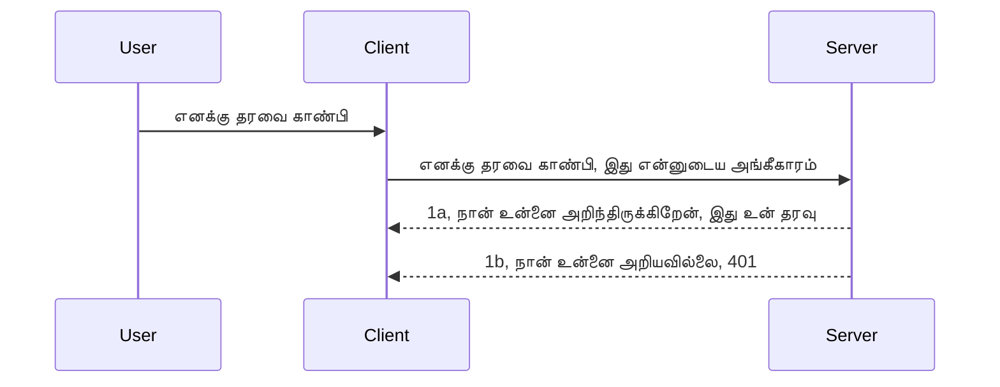

# எளிய அத்தார்டிகேஷன்

MCP SDKகள் OAuth 2.1 பயன்பாட்டை ஆதரிக்கின்றன, இது உண்மையில் ஒரு நுணுக்கமான செயல்முறை ஆகும், அதில் அத்தார்டிகேஷன் சர்வர், வள சர்வர், அங்கீகார தகவல்களை அனுப்புதல், ஒரு குறியீட்டை பெறுதல், அந்த குறியீட்டை பேயர் டோக்கனுக்காக மாற்றுதல் ஆகிய கருத்துக்களை உள்ளடக்கியது, மேலும் நீங்கள் இறுதியில் உங்கள் வளத் தரவுகளைப் பெற முடியும். நீங்கள் OAuth-க்கு பழகாமல் இருந்தால், அது செயல்படுத்துவதற்கு சிறந்தது; அடிப்படையான அத்தார்டிகேஷனுடன் துவங்கி, சிறந்த மற்றும் நன்றாக பாதுகாப்பான முறைகளுக்கு முன்னேறுவது நல்லது. அதனால்தான் இந்த அத்தியாயம் உருவாக்கப்பட்டுள்ளது, உங்களை மேம்பட்ட அத்தார்டிகேஷனை உருவாக்க உதவ.

## அத்தார்டிகேஷன், என்ன பொருள்?

அத்தார்டிகேஷன் என்பது authentication மற்றும் authorization என்பதற்கான சுருக்கம். இங்கே நாம் இரண்டு காரியங்களை செய்ய வேண்டும்:

- **அங்கீகரிப்பது**, அது ஒரு நபர் நமது வீட்டிற்கு செல்ல அனுமதிப்பதா என்பதை ஆராயும் செயல்முறை, அவர்கள் "இங்கே" இருக்க உரிமை உள்ளதா என பொருள், அதாவது நமது MCP சர்வர் உள்ள வள சர்வருக்கு அணுகல் உள்ளது என்று சோதனை செய்கின்றது.
- **அங்கீகாரம்**, பயன்படுத்துபவர் கோருகின்ற குறிப்பிட்ட வளங்களுக்கு சம்மந்தப்பட்ட அனுமதி உள்ளதா அல்லது இல்லை என்பதை தெரிந்து கொள்ளும் செயல்முறை, உதாரணமாக இந்த ஆர்டர்கள் அல்லது பொருட்களை அல்லது அவர்கள் உள்ளடக்கத்தை படிக்க அனுமதி இருப்பது ஆனால் நீக்க அனுமதி இல்லை என்பது மற்றொரு உதாரணமாகும்.

## அங்கீகார தகவல்கள்: நாம் யார் என்பதை சிஸ்டத்திற்கு எப்படி கூறுவது

பொதுவாக, பெரும்பாலான வலை டெவலப்பர்கள் சர்வருக்கு ஒரு அங்கீகார தகவலை (குறிப்பாக ஒரு ரகசியத்தை) வழங்குவது தான் அங்கீகரிப்பாகும் என்று நினைக்கின்றனர். இது பொதுவாக உபயோகபயர்பெயர் மற்றும் கடவுச்சொல் ஆகியவற்றை base64 அடியாக குறியாக்கப்பட்டவையாக அல்லது தனித்துவமாக ஒரு பயனரை அடையாளம் காண API உப்பி இருக்கலாம்.

இது "Authorization" என்ற தலைப்புக்குள் பின்வருமாறு அனுப்பப்படுகிறது:

```json
{ "Authorization": "secret123" }
```

இது பெரும்பாலும் அடிப்படையான அங்கீகரிப்பாக அழைக்கப்படுகின்றது. முழு பணிவழியின் செயல் பின்வருமாறு உள்ளது:


```mermaid
sequenceDiagram
   participant User
   participant Client
   participant Server

   User->>Client: எனக்கு தரவை காண்பி
   Client->>Server: எனக்கு தரவை காண்பி, இது என்னுடைய அங்கீகாரம்
   Server-->>Client: 1a, நான் உன்னை அறிந்திருக்கிறேன், இது உன் தரவு
   Server-->>Client: 1b, நான் உன்னை அறியவில்லை, 401 
```

இப்போது இது எப்படி பணிபுரிகிறது என்பதை புரிந்துகொண்டோம், அதை எப்படிச் செயல்படுத்துவது? பெரும்பாலும் வலை சர்வர்கள் "middleware" எனப்படும் ஒரு கருத்தைக் கொண்டுள்ளன, இது பின் தொடரும் கேட்டலுக்கான ஒரு பகுதி என்று செயல்படுகின்றது, இது அங்கீகார தகவல்களை சரிபார்க்க முடியும்; அங்கீகார தகவல்கள் செல்லுபடியானால் கேட்டலை அனுமதிக்கிறது. சரிபார்ப்பு பிழை ஏற்படும் போது அது ஒரு பிழை காட்டும். அதை எப்படி செயல்படுத்தலாம் பார்ப்போம்:

**Python**

```python
class AuthMiddleware(BaseHTTPMiddleware):
    async def dispatch(self, request, call_next):

        has_header = request.headers.get("Authorization")
        if not has_header:
            print("-> Missing Authorization header!")
            return Response(status_code=401, content="Unauthorized")

        if not valid_token(has_header):
            print("-> Invalid token!")
            return Response(status_code=403, content="Forbidden")

        print("Valid token, proceeding...")
       
        response = await call_next(request)
        # எந்தவொரு வாடிக்கையாளர் தலைப்புக்களைச் சேர்க்கவும் அல்லது பதிலில் சிலவாறு மாற்றவும்
        return response


starlette_app.add_middleware(CustomHeaderMiddleware)
```

இங்கே:

- `AuthMiddleware` என்ற மிடில்வேர் உருவாக்கப்பட்டுள்ளது, அதன் `dispatch` முறை இணைய சர்வரால் அழைக்கப்படுகிறது.
- மிடில்வேர் இணைய சர்வருக்கு சேர்க்கப்பட்டுள்ளது:

    ```python
    starlette_app.add_middleware(AuthMiddleware)
    ```

- "Authorization" தலைப்பு இருக்கிறதா மற்றும் அனுப்பப்பட்ட ரகசியம் செல்லுபடியானதா என்பதனை சரிபார்க்கும் சரிபார்ப்பு நியமங்கள் எழுதப்பட்டுள்ளன:

    ```python
    has_header = request.headers.get("Authorization")
    if not has_header:
        print("-> Missing Authorization header!")
        return Response(status_code=401, content="Unauthorized")

    if not valid_token(has_header):
        print("-> Invalid token!")
        return Response(status_code=403, content="Forbidden")
    ```

    ரகசியம் இருக்கிறதும் செல்லுபடியானதும் இருந்தால், `call_next` அழைப்பை கொண்டு கேட்டலை அனுமதித்து பதிலைக் கொடுக்கின்றது.

    ```python
    response = await call_next(request)
    # எந்தவொரு வாடிக்கையாளர் தலைப்புக்களையும் சேர்க்கவோ அல்லது பதிலில் ஏதாவது மாற்றம் செய்வதோ
    return response
    ```

இதன் செயல்முறை என்ன என்றால், வலைக் கேட்டல் சர்வருக்குக் செல்லும் போது மிடில்வேர் செயல்படுத்து; அதன் செயல்பாட்டின் அடிப்படையில் கேட்டலை அனுமதிக்கும் அல்லது அமுக்கப்பெற்ற பிழை மிக்கையும் ஐந்து அனுமதிக்காது என்று தெரிவிக்கும்.

**TypeScript**

இங்கே, பிரபலமான Express செயற்குழுவுடன் மிடில்வேர் உருவாக்கி MCP சர்வருக்கு கேட்டல் செல்லும் முன் தடுக்கின்றோம். இதோ அதன் குறியீடு:

```typescript
function isValid(secret) {
    return secret === "secret123";
}

app.use((req, res, next) => {
    // 1. அங்கீகாரம் தலைப்பு உள்ளது எனக்கொன்?
    if(!req.headers["Authorization"]) {
        res.status(401).send('Unauthorized');
    }
    
    let token = req.headers["Authorization"];

    // 2. செல்லுபடியாக இருப்பதை சரிபார்க்கவும்.
    if(!isValid(token)) {
        res.status(403).send('Forbidden');
    }

   
    console.log('Middleware executed');
    // 3. கோரிக்கையை கோரிக்கை குழாயின் அடுத்த படிக்கு அனுப்புகிறது.
    next();
});
```

இந்தக் குறியீட்டில்:

1. முதலில் "Authorization" தலைப்பு இருக்கிறதா எனப் பாருங்கள், இல்லையெனில் 401 பிழை அனுப்பி நிறுத்துங்கள்.
2. அங்கீகார தகவல்/டோக்கன் செல்லுபடியானதா என உறுதி செய்கிறது, இல்லையெனில் 403 பிழையை அனுப்புங்கள்.
3. இறுதியாக கேட்டலை தொடர்ச்சி உண்டு நிலையில் அனுமதித்து கேட்டலின் வாயிலாக கோரப்பட்ட வளத்தை மீண்டும் அளிக்கிறது.

## பயிற்சி: அங்கீகரிப்பை செயல்படுத்துக

நமது அறிவை கொண்டு செயல்படுத்த முயற்சிக்கிறோம். திட்டம் பின்வருமாறு:

சர்வர்

- வலை சர்வர் மற்றும் MCP அலகை உருவாக்குக.
- சர்வர் உபயோகப்படுத்தி மிடில்வேர் செயல்படுத்துக.

கிளையன்

- அங்கீகார தகவலுடன் வலைக் கேட்டல் அனுப்புக.

### -1- வலை சர்வர் மற்றும் MCP அலகு உருவாக்குக

> [!WARNING]
> கீழ்காணும் TypeScript எடுத்துக்காட்டு MCP `2025-11-25`க்கு பொருந்தும். இது `mcp-session-id` மூலம் போக்குவரத்தை கண்காணிக்கிறது
> மற்றும் தற்போதைய `2026-07-28` போக்குவரத்து எடுத்துக்காட்டல்ல; MCP `2026-07-28` 
> `initialize` கைமாற்றும் மற்றும் செயல்முறையமைவு அமர்வு ஐடியை அகற்றுகிறது; புதிய செயல்பாடுகள் 
> சுயமாக நிறைவேற்றும் கோடுகளைக் கொண்டிருக்கின்றன. பார்க்கவும் 
> [MCP-ல் என்ன மாற்றம்: 2026-07-28 குறிப்புரை](../../01-CoreConcepts/mcp-2026-07-28.md).

முதலாம் படியில், வலை சர்வர் அலகும் MCP சர்வர் உருவாக்க வேண்டும்.

**Python**

இங்கே MCP சர்வர் அலகை உருவாக்கி starlette வலைப் பயன்பாட்டை உருவாக்கி uvicorn கொண்டு நடத்துக.

```python
# MCP சர்வரை உருவாக்குதல்

app = FastMCP(
    name="MCP Resource Server",
    instructions="Resource Server that validates tokens via Authorization Server introspection",
    host=settings["host"],
    port=settings["port"],
    debug=True
)

# starlette வலை பயன்பாட்டை உருவாக்குதல்
starlette_app = app.streamable_http_app()

# uvicorn மூலம் பயன்பாட்டை சேவை செய்வது
async def run(starlette_app):
    import uvicorn
    config = uvicorn.Config(
            starlette_app,
            host=app.settings.host,
            port=app.settings.port,
            log_level=app.settings.log_level.lower(),
        )
    server = uvicorn.Server(config)
    await server.serve()

run(starlette_app)
```

இதில்:

- MCP சர்வரை உருவாக்கியது.
- MCP சர்வரிலிருந்து starlette வலைப் பயன்பாட்டை கட்டமைத்தது, `app.streamable_http_app()`.
- uvicorn கொண்டு வலைப் பயன்பாட்டை நடத்தியது `server.serve()`.

**TypeScript**

இங்கே MCP சர்வர் அலகை உருவாக்குகிறோம்.

```typescript
const server = new McpServer({
      name: "example-server",
      version: "1.0.0"
    });

    // ... சர்வர் வளங்கள், கருவிகள், மற்றும் முன்மொழிவுகளை அமைக்கவும் ...
```

MCP சர்வர் உருவாக்கம் POST /mcp வழி வரையறைக்குள் இருக்க வேண்டும், அதனால் மேலே உள்ள குறியீட்டைப் எடுத்து பின்வருமாறு இடமாற்றம் செய்க:

```typescript
import express from "express";
import { randomUUID } from "node:crypto";
import { McpServer } from "@modelcontextprotocol/sdk/server/mcp.js";
import { StreamableHTTPServerTransport } from "@modelcontextprotocol/sdk/server/streamableHttp.js";
import { isInitializeRequest } from "@modelcontextprotocol/sdk/types.js"

const app = express();
app.use(express.json());

// அமர்வு ஐடியாக்களால் போக்குவரத்தை சேமிக்கும் வரைபடம்
const transports: { [sessionId: string]: StreamableHTTPServerTransport } = {};

// கிளையன்ட்-இருந்து சர்வர் தொடர்புக்கு POST கோரிக்கைகளை கையாளவும்
app.post('/mcp', async (req, res) => {
  // உள்ளமைவு அமர்வு ஐடியை சரிபார்க்கவும்
  const sessionId = req.headers['mcp-session-id'] as string | undefined;
  let transport: StreamableHTTPServerTransport;

  if (sessionId && transports[sessionId]) {
    // உள்ளமைவு போக்குவரத்தை மீண்டும் பயன்படுத்தவும்
    transport = transports[sessionId];
  } else if (!sessionId && isInitializeRequest(req.body)) {
    // புதிய ஆரம்ப கோரிக்கை
    transport = new StreamableHTTPServerTransport({
      sessionIdGenerator: () => randomUUID(),
      onsessioninitialized: (sessionId) => {
        // அமர்வு ஐடியாக վրையிலான போக்குவரத்தை சேமிக்கவும்
        transports[sessionId] = transport;
      },
      // DNS மீண்டும் சேர்ந்தல் பாதுகாப்பு பழைய பொருந்துதலுக்காக இயல்புநிலையாக முடக்கப்பட்டுள்ளது. நீங்கள் இந்த சர்வரை
      // உள்ளூர் முறையில் இயக்கினால், கொள்கையை அமைக்கவும்:
      // enableDnsRebindingProtection: true,
      // allowedHosts: ['127.0.0.1'],
    });

    // மூடப்படும்போது போக்குவரத்தை சுத்தம் செய்யவும்
    transport.onclose = () => {
      if (transport.sessionId) {
        delete transports[transport.sessionId];
      }
    };
    const server = new McpServer({
      name: "example-server",
      version: "1.0.0"
    });

    // ... சர்வர் வளங்கள், கருவிகள், மற்றும் அழைப்புகளை அமைக்கவும் ...

    // MCP சர்வருடன் இணைக்கவும்
    await server.connect(transport);
  } else {
    // தவறான கோரிக்கை
    res.status(400).json({
      jsonrpc: '2.0',
      error: {
        code: -32000,
        message: 'Bad Request: No valid session ID provided',
      },
      id: null,
    });
    return;
  }

  // கோரிக்கையை கையாளவும்
  await transport.handleRequest(req, res, req.body);
});

// GET மற்றும் DELETE கோரிக்கைகளுக்கான மறுபயன்பாட்டு கையாள்வாளர்
const handleSessionRequest = async (req: express.Request, res: express.Response) => {
  const sessionId = req.headers['mcp-session-id'] as string | undefined;
  if (!sessionId || !transports[sessionId]) {
    res.status(400).send('Invalid or missing session ID');
    return;
  }
  
  const transport = transports[sessionId];
  await transport.handleRequest(req, res);
};

// சர்வர்-இருந்து-கிளையன் அறிவிப்புகளுக்கான GET கோரிக்கைகளை SSE மூலம் கையாளவும்
app.get('/mcp', handleSessionRequest);

// அமர்வு முடிவுக்கு DELETE கோரிக்கைகளை கையாளவும்
app.delete('/mcp', handleSessionRequest);

app.listen(3000);
```

இப்போது MCP சர்வர் உருவாக்கம் `app.post("/mcp")` உள்ளே நகர்த்தப்பட்டதை பார்த்தீர்கள்.

அடுத்த படியாக, வரும் அங்கீகார தகவலை சரிபார்க்க மிடில்வேர் உருவாக்குவோம்.

### -2- சர்வருக்கான மிடில்வேர் செயல்படுத்துக

அடுத்ததாக மிடில்வேர் பகுதியை செயல் படுத்துவோம். இங்கே "Authorization" தலைப்பிலுள்ள அங்கீகார தகவலை நோக்கி அதை சரிபார்க்கும் மிடில்வேர் உருவாகும். அவ்வாறானதானால் கேட்டல் தொடர்ந்து மேற்கொண்டது (உதா: கருவிகளைப் பட்டியலிடுதல், வளத்தைப் படித்தல் அல்லது கிளையன் கோரிய MCP செயல்பாடு).

**Python**

மிடில்வேர் உருவாக்க `BaseHTTPMiddleware`யிலிருந்து வாரிசு பெற்ற ஒரு வகுப்பை உருவாக்க வேண்டும். இரண்டு முக்கியமான பகுதி உள்ளன:

- `request`, நாமintha தலைப்பு தகவலை படிக்கும் கேட்டல்.
- `call_next`, கிளையன் வழங்கிய அங்கீகார தகவல் ஏற்றுக்கொள்ளப்பட்டால் அழைக்க வேண்டிய பின்ன_CALL.

முதலில், `Authorization` தலைப்பு இல்லாவிட்டால் என்ன செய்ய வேண்டும்:

```python
has_header = request.headers.get("Authorization")

# தலைப்பு இல்லை, 401 இல் தோல்வியடையவும், இல்லையெனில் தொடரவும்.
if not has_header:
    print("-> Missing Authorization header!")
    return Response(status_code=401, content="Unauthorized")
```

இங்கே 401 அனுமதி இல்லா மூலம் செய்தி அனுப்பப்படுகிறது, ஏனெனில் கிளையன் அங்கீகரிப்பில் தோல்வி அடைந்துள்ளது.

அடுத்ததாக, அங்கீகார தகவல் சமர்ப்பிக்கப்பட்டால் அதன் செல்லுபடியை பின்வருமாறு சரிபார்க்க வேண்டும்:

```python
 if not valid_token(has_header):
    print("-> Invalid token!")
    return Response(status_code=403, content="Forbidden")
```

மேல் 403 தடை செய்தி அனுப்பப்படுவது குறிப்பிடத்தக்கது. கீழே முழுமையான மிடில்வேர் உள்ளது, மேலே கூறிய அனைத்தையும் செயல்படுத்துகிறது:

```python
class AuthMiddleware(BaseHTTPMiddleware):
    async def dispatch(self, request, call_next):

        has_header = request.headers.get("Authorization")
        if not has_header:
            print("-> Missing Authorization header!")
            return Response(status_code=401, content="Unauthorized")

        if not valid_token(has_header):
            print("-> Invalid token!")
            return Response(status_code=403, content="Forbidden")

        print("Valid token, proceeding...")
        print(f"-> Received {request.method} {request.url}")
        response = await call_next(request)
        response.headers['Custom'] = 'Example'
        return response

```

சிறந்தது, ஆனால் `valid_token` ֆунк்சիա எப்படி இயங்கும்? இங்கே அது:

```python
# உற்பத்திக்காக பயன்படுத்தாதீர்கள் - இதனை மேம்படுத்துங்கள் !!
def valid_token(token: str) -> bool:
    # "Bearer " முன்னொட்டியை அகற்றவும்
    if token.startswith("Bearer "):
        token = token[7:]
        return token == "secret-token"
    return False
```

இது நிச்சயமாக மேம்படுத்தப்பட வேண்டும்.

முக்கியம்: நீங்கள் இதுபோன்ற ரகசியங்களை குறியீட்டில் எப்போதும் வைத்திரக்கக்கூடாது. அதை தரவுத்தளத்திலிருந்து அல்லது IDP (அடையாள சேவை வழங்குநர்) மூலம் பெறுவது சிறந்தது; சிறந்த முறையில் IDP தான் சரிபார்ப்பு செய்யட்டும்.

**TypeScript**

Express உடன் அதை செயல்படுத்த, `use` முறை அழைக்கப்பட வேண்டும், இது மிடில்வேர் செயல்பாடுகளை ஏற்றுக்கொள்ளும்.

நாம்:

- கேட்டல் மாறியில் "Authorization" உடன் அனுப்பப்பட்ட அங்கீகார தகவலைப் பார்வையிட வேண்டும்.
- அங்கீகாரத்தை சோதனை செய்ய வேண்டும், அதில் இருந்தால் கேட்டலை தொடரவும் மற்றும் கிளையனின் MCP கோரிக்கையை நிறைவேற்றவும்.

இங்கே, "Authorization" தலைப்பு இருக்கிறதா எனப் பார்ப்போம், இல்லையெனில் கேட்டலை நிறுத்துகிறோம்:

```typescript
if(!req.headers["authorization"]) {
    res.status(401).send('Unauthorized');
    return;
}
```

தலைப்பு இல்லாவிட்டால் 401 பெறுவீர்கள்.

அடுத்ததாக, அங்கீகார தகவல் செல்லுபடியானதா என்று சரிபார்த்து, இல்லையெனில் 403 தவறு காட்டி கேட்டலை நிறுத்துகிறோம்:

```typescript
if(!isValid(token)) {
    res.status(403).send('Forbidden');
    return;
} 
```

இப்போது 403 பிழையைப் பெறுவீர்கள்.

முழு குறியீடு இங்கே:

```typescript
app.use((req, res, next) => {
    console.log('Request received:', req.method, req.url, req.headers);
    console.log('Headers:', req.headers["authorization"]);
    if(!req.headers["authorization"]) {
        res.status(401).send('Unauthorized');
        return;
    }
    
    let token = req.headers["authorization"];

    if(!isValid(token)) {
        res.status(403).send('Forbidden');
        return;
    }  

    console.log('Middleware executed');
    next();
});
```

நாங்கள் வலை சர்வரை, கிளையன் அனுப்பும் அங்கீகார தகவலைச் சரிபார்க்க மிடில்வேர் ஏற்றுக்கொள்ளக் கொண்டு அமைத்திருக்கிறோம். கிளையன் எப்படி உள்ளது?

### -3- தலைப்பில் அங்கீகார தகவலுடன் வலைக் கேட்டல் அனுப்புக

கிளையன் அந்த அங்கீகாரத்தைக் தலைப்பில் அனுப்புகிறதா என்பதை உறுதிப்படுத்த வேண்டும். MCP கிளையன் மூலம் எப்படி செய்யக்கூடும் என்பதை தெரிந்துகொள்ள வேண்டும்.

**Python**

கிளையனுக்கு, அங்கே இவ்வழியில் தலைப்புடன் அங்கீகாரத்தை அனுப்புக:

```python
# மதிப்பை ஹார்கோடாகக் கடினமாக்க வேண்டாம், குறைந்தபட்சமாக ஒரு சூழல் மாறியின் அல்லது மிகவும் பாதுகாப்பான சேமிப்பிடத்தில் வைக்கவும்
token = "secret-token"

async with streamablehttp_client(
        url = f"http://localhost:{port}/mcp",
        headers = {"Authorization": f"Bearer {token}"}
    ) as (
        read_stream,
        write_stream,
        session_callback,
    ):
        async with ClientSession(
            read_stream,
            write_stream
        ) as session:
            await session.initialize()
      
            # செய்ய வேண்டியது, கிளையண்டில் என்ன செய்யவேண்டும் என்றால், உதா. கருவிகளை பட்டியலிடுவது, கருவிகளை அழைக்கின்றது போன்றவை.
```

`headers` என்பதை இவ்வாறு நிரப்புகிறோம் ` headers = {"Authorization": f"Bearer {token}"}`.

**TypeScript**

இதை இரண்டு படிகளில் தீர்க்கலாம்:

1. அக்னீகார தகவலுடன் உள்ள அமைப்பு பொருளை நிரப்புக.
2. அந்த அமைப்பு பொருளை போக்குவரத்திற்கு அனுப்புக.

```typescript

// இங்கு காட்டியபோல் மதிப்பை கடினமாக நிரல் எழுத்தில் எழுத வேண்டாம். குறைந்தது அதை ஒரு env மாறியாக வைத்திருக்கவும் dev முறையில் dotenv போன்ற ஒன்றைப் பயன்படுத்தவும் செய்யவும்.
let token = "secret123"

// ஒரு கிளையன்ட் டிரான்ஸ்போர்ட் விருப்பங்களின் பொருளை வரையறு
let options: StreamableHTTPClientTransportOptions = {
  sessionId: sessionId,
  requestInit: {
    headers: {
      "Authorization": "secret123"
    }
  }
};

// அந்த விருப்பங்களின் பொருளை டிரான்ஸ்போர்ட் காலுக்கு அனுப்பு
async function main() {
   const transport = new StreamableHTTPClientTransport(
      new URL(serverUrl),
      options
   );
```

மேலே பார்க்கும் போது, `options` பொருளை உருவாக்கி `requestInit` உட்கொண்டுள்ள தலைப்புகளை நிரப்பியுள்ளோம்.

முக்கியம்: இதை எப்படி மேம்படுத்துவது? தற்போதைய செயல்பாடு சில பிரச்சனைகளை கொண்டுள்ளது. குறைந்தது HTTPS இருக்காவிட்டால் இது ஆபத்தானது. கூடவே, அங்கீகாரத்தை திருடலாம்; ஆகவே எளிதாக டோக்கன் ரத்து செய்வது மற்றும் கூடுதல் சோதனைகள் (எங்கே இருந்து வந்தது, மோசடி செயல் போன்றவை) தேவை.

மிக எளிய API க்கு இது ஒரு நல்ல துவக்கம் என்று சொல்லலாம், அதில் அங்கீகரிக்கப்படாமை இல்லாமல் எவரும் APIயை அழைக்க முடியாது.

இந்த அடிப்படையில், நாம பயனுள்ள பாதுகாப்பை மேம்படுத்த JSON Web Token (JWT அல்லது "JOT") பயன்படுத்த முயலுவோம்.

## JSON வலை டோக்கன்கள், JWT

எனவே, எளிமையான அங்கீகாரத் தகவலை அனுப்புவதிலிருந்து மேம்படுத்த முயல்கிறோம். JWTயை ஏற்றுக்கொள்ளுவதன் உடனடி நன்மைகள் என்ன?

- **பாதுகாப்பு முன்னேற்றங்கள்**. அடிப்படையான அத்தார்டிகேஷனில், உபயோகபயர்பெயர் மற்றும் கடவுச்சொல் base64 குறியாக்கப்பட்ட டோக்கனாக (அல்லது API உப்பி) அடிக்கடி அனுப்பப்படுகிறது, இது ஆபத்தை அதிகரிக்கிறது. JWT யில் உபயோகபயர்பெயர் மற்றும் கடவுச்சொல்லை அனுப்பி ஒரு கால வரம்புள்ள டோக்கனைப் பெறுகிறீர்கள், இது காலாவதியாகும். JWT இல் உரிமைகள், பராமானங்கள் மற்றும் அனுமதிகள் போன்ற நுணுக்கமான அணுகல் கட்டுப்பாடு உள்ளது.
- **இடமாற்றமற்ற தன்மை மற்றும் பரிமாண நூல்கள்**. JWTகள் சுயம் கொண்டவை, பயனர் தகவல்களை உள்ளடக்கி, சர்வர் பக்க அமர்வு சேமிப்பை தேவையின்றி செய்கின்றன. டோக்கன் உள்ளூராகவே சரிபார்க்கப்பட முடியும்.
- **இணக்கத்தன்மை மற்றும் கூட்டமைப்பு**. JWTகள் Open ID Connect-ன் மையத்தில் உள்ளது மற்றும் Entra ID, Google Identity, Auth0 போன்ற அறிந்த அடையாள வழங்குநர்களுடன் பயன்படுத்தப்படுகின்றன. கூட SINGLE SIGN-ON போன்றவைகளையும் செய்யலாம், ஏன்ரெனில் இது தொழிற்சாலை தரம் கொண்டது.
- **பகுப்பாய்வு மற்றும் தான்திருத்தம்**. JWTகளை Azure API Management, NGINX போன்ற API Gatewayகளுடன் பயன்படுத்தலாம். இது உள்நுழைவு வேலைமைப்புகளையும் சர்வர்-சேவை தொடர்பையும் (அடையாளத்தைக் காட்சி அடையாளப்படுத்தல், பிரதிநிதித்துவம்) ஆதரிக்கும்.
- **செலவுகுறை மற்றும் கேச்சிங்**. JWT டோக்கன்கள் குறியிடப்பட்ட பிறகே கேசால் சேமிக்கப்படலாம், இது பகுப்பாய்வின் தேவையை குறைக்கின்றது. இது அதிக போக்குவரத்திற்கான பயன்பாடுகள் விரைவாக செயல்படுவதற்கு உதவும்.
- **மேம்பட்ட அம்சங்கள்**. இது சர்வரில் சரிபார்த்தல் மற்றும் டோக்கன் ரத்து செய்வதை ஆதரிக்கின்றது.

இந்த நன்மைகளுடன், நமது செயல்பாட்டைக் சிறப்பிக்கும் வழிகளை பார்ப்போம்.

## அடிப்படை அத்தார்டிகேஷனை JWT ஆக மாற்றுதல்

பெரிய அளவில் செய்ய வேண்டிய மாற்றங்கள்:

- **JWT டோக்கன் உருவாக்க கற்க** மற்றும் கிளையனில் இருந்து சர்வருக்கு அனுப்பத் தயாராக செய்ய.
- **JWT டோக்கனை சரிபார்க்க**; செல்லுபடியானதானால், கிளையன் வளங்களைப் பெறலாம்.
- **பாதுகாப்பான டோக்கன் சேமிப்பு**. டோக்கனை எவ்வாறு சேமிப்பது.
- **வழிகளைக் காக்க**, MCP அம்சங்களை காப்பதற்கு.
- **ரீஃப்ரெஷ் டோக்கன்கள் சேர்க்க**. குறுகிய ஆயுட்கால டோக்கன்களை வைத்து நீண்ட ஆயுட்கால ரீஃப்ரெஷ் டோக்கன்கள் உள்ளடக்கி, அவை காலாவதியானபோது புதிய டோக்கனைப் பெற செய்யும். ரீஃப்ரெஷ் எண்ட்பாயிண்ட் மற்றும் சுழற்சி திட்ட முறைவும் இருக்க வேண்டும்.

### -1- JWT டோக்கன் உருவாக்குக

JWT டோக்கன் பின் உறுப்புகளைக் கொண்டது:

- **தலைப்பு**, பயன்படுத்தப்படும் ஆல்கோரிதம் மற்றும் டோக்கன் வகை.
- **படையணி**, உரிமைகள், உதா: sub (டோக்கன் பிரதிநிதித்துவம் செய்யும் பயனர்/உலகம். அத்தார்டிகேஷனில் பொதுவாக பயனர் ஐடி), exp (காலாவதி நேரம்), role (பங்கு).
- **கையொப்பம்**, ரகசியம் அல்லது தனிப்பட்ட விசையுடன் கையொப்பமிடப்பட்டது.

இதற்கு, தலைப்பு, படையணி மற்றும் குறியாக்க டோக்கனை உருவாக்க முடியும்.

**Python**

```python

import jwt
import jwt
from jwt.exceptions import ExpiredSignatureError, InvalidTokenError
import datetime

# JWT க்கான கையொப்பம் செய்ய பயன்படுத்தப்படும் ரகசிய விசை
secret_key = 'your-secret-key'

header = {
    "alg": "HS256",
    "typ": "JWT"
}

# பயனர் தகவல் மற்றும் அதன் உரிமைகள் மற்றும் காலாவதியான நேரம்
payload = {
    "sub": "1234567890",               # பொருள் (பயனர் ஐடி)
    "name": "User Userson",                # விருப்ப உரிமை
    "admin": True,                     # விருப்ப உரிமை
    "iat": datetime.datetime.utcnow(),# வழங்கப்பட்ட தேதி
    "exp": datetime.datetime.utcnow() + datetime.timedelta(hours=1)  # காலாவதி தேதி
}

# அதை குறியாக்கம் செய்யவும்
encoded_jwt = jwt.encode(payload, secret_key, algorithm="HS256", headers=header)
```

மேலுள்ள குறியீட்டில்:

- HS256 ஐ ஆல்கோரிதமாகவும் JWTவாக தலைமையைக் குறித்துள்ளோம்.
- ஒரு படையணி உருவாக்கப்பட்டுள்ளது, அதில் ஒரு பொருள் (user id), பயனர் பெயர், பங்கு, வெளியீட்டு நேரம் மற்றும் காலாவதியடையும் நேரம் உள்ளடக்கப்பட்டுள்ளன; இதன் மூலம் நேரம் நிர்ணயிக்கப்பட்டுள்ளது.

**TypeScript**

இங்கே JWT டோக்கன் உருவாக்க விதிகளை உதவும் ஒரு சில சார்புப் பொருட்கள் தேவை.

சார்புகள்

```sh

npm install jsonwebtoken
npm install --save-dev @types/jsonwebtoken
```

இவற்றை வைத்த பிறகு, தலைப்பு, படையணி மற்றும் குறியாக்க டோக்கன் உருவாக்குவோம்.

```typescript
import jwt from 'jsonwebtoken';

const secretKey = 'your-secret-key'; // உற்பத்தியில் env மாறிலிகளை பயன்படுத்தவும்

// பண்புப்பட்டை வரையறுக்கவும்
const payload = {
  sub: '1234567890',
  name: 'User usersson',
  admin: true,
  iat: Math.floor(Date.now() / 1000), // வெளியிடப்பட்ட தேதி
  exp: Math.floor(Date.now() / 1000) + 60 * 60 // 1 மணி நேரத்தில் காலாவதி
};

// தலைப்பை வரையறுக்கவும் (ऐच्छிக, jsonwebtoken இயல்புகளை அமைக்கிறது)
const header = {
  alg: 'HS256',
  typ: 'JWT'
};

// டோக்கனை உருவாக்கவும்
const token = jwt.sign(payload, secretKey, {
  algorithm: 'HS256',
  header: header
});

console.log('JWT:', token);
```

இவ்வாறு டோக்கன்:

HS256 கொண்டு கையொப்பமிடப்பட்டுள்ளது
1 மணி நேரத்திற்கு செல்லுபடியானது
sub, name, admin, iat, exp போன்ற உரிமைகள் உள்ளன.

### -2- டோக்கனை சரிபார்க்க

டோக்கனை சரிபார்க்க வேண்டும், இது சர்வரில் செய்யப்படும் ஒரு பணியாகும், கிளையன் அனுப்பும் கோரிக்கை செல்லுபடியானதா என்று உறுதி செய்ய. பல பரிசோதனைகள் செய்ய வேண்டும், உருவாக்க அமைப்பு மற்றும் செல்லுபடியை சரிபார்க்க வேண்டும். நீங்கள் மேலும் உங்கள் பயனர் சிஸ்டத்தில் உள்ளாரா, இன்னும் விசாரணைகள் சேர்க்க encouraged ஆக இருக்கிறீர்கள்.

டோக்கன் சரிபார்க்க, அதை எடுத்து குறியாக்கத்தை மீட்டெடுத்து பாது நடப்பதை அறிந்து, அதன் செல்லுபடியைக் கண்டறிய வேண்டும்:

**Python**

```python

# JWT ஐ டிகோடோடு சரிபார்க்கவும்
try:
    decoded = jwt.decode(token, secret_key, algorithms=["HS256"])
    print("✅ Token is valid.")
    print("Decoded claims:")
    for key, value in decoded.items():
        print(f"  {key}: {value}")
except ExpiredSignatureError:
    print("❌ Token has expired.")
except InvalidTokenError as e:
    print(f"❌ Invalid token: {e}")

```


இந்த கோடில், நாமே `jwt.decode` ஐ டோக்கன், ரகசிய விசை மற்றும் தேர்ந்தெடுக்கப்பட்ட ஆல்கோரிதம் ஆகியவற்றைக் கொண்டு அழைக்கிறோம். தோல்வியடைந்த சரிபார்ப்பு ஒரு பிழையை எழுப்புவதற்கு வழிவகுப்பதை கவனியுங்கள், அதனால் நாம ஒரு try-catch கட்டுமானத்தை பயன்படுத்துகிறோம்.

**TypeScript**

இங்கே நாம `jwt.verify` ஐ அழைக்க வேண்டும், இதனால் நாம மேலும் பகுப்பாய்வு செய்யக்கூடிய டோக்கன் வைத்திருக்கும் ஒரு எளிமையான பதிப்பை பெறுவோம். இந்த அழைப்பு தோல்வியடைந்தால், அதாவது டோக்கனின் கட்டமைப்பு தவறாக இருந்தது அல்லது அது இனி செல்லாது.

```typescript

try {
  const decoded = jwt.verify(token, secretKey);
  console.log('Decoded Payload:', decoded);
} catch (err) {
  console.error('Token verification failed:', err);
}
```

குறிப்பு: முன்பு குறிப்பிடப்பட்டபடி, இந்த டோக்கன் நமது கணக்கில் உள்ள ஒரு பயனரை குறிக்கின்றது என்று உறுதி செய்ய நாம கூடுதல் சோதனைகளை செய்ய வேண்டும் மற்றும் பயனர் கூறும் உரிமைகள் உண்மை என்று உறுதி செய்ய வேண்டும்.

அடுத்ததாக, நாம பங்கு அடிப்படையிலான அணுகல் கட்டுப்பாட்டை (RBAC) பார்ப்போம்.

## பங்கு அடிப்படையிலான அணுகல் கட்டுப்பாட்டைச் சேர்க்குதல்

விதிமுறை என்னவெனில், நாம வெவ்வேறு பங்குகளுக்கு வெவ்வேறு அனுமதிகள் உள்ளன என்று வெளிப்படுத்த விரும்புகிறோம். உதாரணமாக, நாம ஒரு நிர்வாகி (admin) எல்லாம் செய்யமுடியும் என்று கருதுகிறோம், ஒரு சாதாரண பயனர் படிக்க/எழுத முடியும் என்றும் மற்றும் ஒரு விருந்தினர் (guest) மட்டும் படிக்க முடியும் என்றும் கருதுகிறோம். எனவே, சில சாத்தியமான அனுமதி நிலைகள் இவை:

- Admin.Write 
- User.Read
- Guest.Read

இவ்வாறு கட்டுப்பாட்டை மிடில்웨어 மூலமாக எப்படி நடைமுறைப்படுத்துவது என்று பார்ப்போம். மிடில் வேர் ஒவ்வொரு பாதைக்கும் சேர்க்கப்படலாம், மற்றும் அனைத்து பாதைகளுக்கும் சேர்த்துக் கொள்ளப்படலாம்.

**Python**

```python
from starlette.middleware.base import BaseHTTPMiddleware
from starlette.responses import JSONResponse
import jwt

# போதனைக்கே இந்த ரகசியத்தை கோடில் கொண்டிருப்பதை தவிருங்கள், இது முக்கியமாக கற்பனை நோக்கங்களுக்கே. அதை பாதுகாப்பான இடத்திலிருந்து படியுங்கள்.
SECRET_KEY = "your-secret-key" # இதை env மாறிலியில் சேர்
REQUIRED_PERMISSION = "User.Read"

class JWTPermissionMiddleware(BaseHTTPMiddleware):
    async def dispatch(self, request, call_next):
        auth_header = request.headers.get("Authorization")
        if not auth_header or not auth_header.startswith("Bearer "):
            return JSONResponse({"error": "Missing or invalid Authorization header"}, status_code=401)

        token = auth_header.split(" ")[1]
        try:
            decoded = jwt.decode(token, SECRET_KEY, algorithms=["HS256"])
        except jwt.ExpiredSignatureError:
            return JSONResponse({"error": "Token expired"}, status_code=401)
        except jwt.InvalidTokenError:
            return JSONResponse({"error": "Invalid token"}, status_code=401)

        permissions = decoded.get("permissions", [])
        if REQUIRED_PERMISSION not in permissions:
            return JSONResponse({"error": "Permission denied"}, status_code=403)

        request.state.user = decoded
        return await call_next(request)


```

கீழே உள்ள மாதிரியில் போன்ற மிடில் வேர் சேர்க்க பல வழிகள் உள்ளன:

```python

# மாற்று 1: starlette செயலியை உருவாக்கும் போது மிடில்வேர் சேர்க்கவும்
middleware = [
    Middleware(JWTPermissionMiddleware)
]

app = Starlette(routes=routes, middleware=middleware)

# மாற்று 2: starlette செயலி உருவாக்கப்பட்ட பிறகு மிடில்வேர் சேர்க்கவும்
starlette_app.add_middleware(JWTPermissionMiddleware)

# மாற்று 3: ஒவ்வொரு மார்க்கத்திலும் மிடில்வேர் சேர்க்கவும்
routes = [
    Route(
        "/mcp",
        endpoint=..., # கையாள்பவர்
        middleware=[Middleware(JWTPermissionMiddleware)]
    )
]
```

**TypeScript**

நாம `app.use` மற்றும் எல்லா கோரிக்கைகளுக்கும் இயங்கும் ஒரு மிடில் வேர் பயன்படுத்தலாம்.

```typescript
app.use((req, res, next) => {
    console.log('Request received:', req.method, req.url, req.headers);
    console.log('Headers:', req.headers["authorization"]);

    // 1. அங்கீகார தலைப்பு அனுப்பப்பட்டுள்ளதா என்று சரிபார்க்கவும்

    if(!req.headers["authorization"]) {
        res.status(401).send('Unauthorized');
        return;
    }
    
    let token = req.headers["authorization"];

    // 2. அங்கீகாரம் செல்லுபடியாகும் என்பதை சரிபார்க்கவும்
    if(!isValid(token)) {
        res.status(403).send('Forbidden');
        return;
    }  

    // 3. அங்கீகாரம் வழங்கிய பயனர் எங்களின் அமைப்பில் இருக்கிறாரா என்பதை சரிபார்க்கவும்
    if(!isExistingUser(token)) {
        res.status(403).send('Forbidden');
        console.log("User does not exist");
        return;
    }
    console.log("User exists");

    // 4. அங்கீகாரம் சரியான அனுமதிகளைக் கொண்டுள்ளதா என்பதை உறுதிப்படுத்தவும்
    if(!hasScopes(token, ["User.Read"])){
        res.status(403).send('Forbidden - insufficient scopes');
    }

    console.log("User has required scopes");

    console.log('Middleware executed');
    next();
});

```

நமது மிடில் வேர் செய்யக்கூடிய மற்றும் செய்யவேண்டும் என்பவற்றில் பல விஷயங்கள் உள்ளன, குறிப்பாக:

1. அங்கீகாரம் தலைப்புரை (authorization header) இருக்கிறதா என்பதைச் சோதி
2. டோக்கன் செல்லுபடியாகிறதா என்று சரிபார்த்து, நாம எழுதிய `isValid` என்ற முறையை அழைக்கிறோம் இது JWT டோக்கனின் முழுமை மற்றும் செல்லுபடைத்தன்மையை சரிபார்க்கிறது.
3. பயனர் நமது கணக்கில் இருக்கிறாரா என சரிபார்க்க வேண்டும்.

   ```typescript
    // தரவுத்தளத்தில் பயனர்கள்
   const users = [
     "user1",
     "User usersson",
   ]

   function isExistingUser(token) {
     let decodedToken = verifyToken(token);

     // செய்வது, பயனர் தரவுத்தளத்தில் சென்றுபார்க்க வேண்டும்
     return users.includes(decodedToken?.name || "");
   }
   ```

மேல், நாம ஒரு எளிய `users` பட்டியலை உருவாக்கியுள்ளோம், இது ஒரு தரவுத்தளத்தில் இருக்க வேண்டும் என்பது தெளிவானது.

4. கூடுதலாக, டோக்கனில் சரியான அனுமதிகள் உள்ளதா எனவும் சரிபார்க்க வேண்டும்.

   ```typescript
   if(!hasScopes(token, ["User.Read"])){
        res.status(403).send('Forbidden - insufficient scopes');
   }
   ```

மேலே உள்ள மிடில் வேர் கோடில், நாம டோக்கனில் User.Read அனுமதி உள்ளதா என்று சரிபார்க்கிறோம், இல்லையெனில் 403 பிழையை அனுப்புகிறோம். கீழே `hasScopes` உதவியாளர் முறை உள்ளது.

   ```typescript
   function hasScopes(scope: string, requiredScopes: string[]) {
     let decodedToken = verifyToken(scope);
    return requiredScopes.every(scope => decodedToken?.scopes.includes(scope));
  }
   ```

Have a think which additional checks you should be doing, but these are the absolute minimum of checks you should be doing.

Using Express as a web framework is a common choice. There are helpers library when you use JWT so you can write less code.

- `express-jwt`, helper library that provides a middleware that helps decode your token.
- `express-jwt-permissions`, this provides a middleware `guard` that helps check if a certain permission is on the token.

Here's what these libraries can look like when used:

```typescript
const express = require('express');
const jwt = require('express-jwt');
const guard = require('express-jwt-permissions')();

const app = express();
const secretKey = 'your-secret-key'; // put this in env variable

// Decode JWT and attach to req.user
app.use(jwt({ secret: secretKey, algorithms: ['HS256'] }));

// Check for User.Read permission
app.use(guard.check('User.Read'));

// multiple permissions
// app.use(guard.check(['User.Read', 'Admin.Access']));

app.get('/protected', (req, res) => {
  res.json({ message: `Welcome ${req.user.name}` });
});

// Error handler
app.use((err, req, res, next) => {
  if (err.code === 'permission_denied') {
    return res.status(403).send('Forbidden');
  }
  next(err);
});

```

இப்போது நீங்கள் மிடில் வேர் அங்கீகாரம் மற்றும் அங்கீகாரம் இருவருக்கும் எப்படி பயன்படுத்தக்கூடியது என்பதை பார்த்துவிட்டீர்கள், MCP யை பற்றி என்ன? அது எங்கள் அங்கீகார முறையை மாற்றுமா? அடுத்த பிரிவில் கண்டுபிடிப்போம்.

### -3- MCPக்கு RBAC ஐச் சேர்க்குதல்

இப்போது வரையில், நீங்கள் எப்படி மிடில் வேர் வழியாக RBAC ஐச் சேர்க்கலாம் என்பதைப் பார்த்தீர்கள், ஆனால் MCPக்கு ஒவ்வொரு MCP அம்சத்திற்கும் தனிப்பட்ட RBAC சேர்க்க எளிய வழி இல்லை, அப்படியானால் என்ன செய்வது? நன்றாக, ஒரு குறிப்பிட்ட கருவியை அழைக்க கிளையண்டுக்கு உரிமைகள் உள்ளதா என்று இந்தக் கோடுகளைச் சேர்க்கவேண்டும்:

ஒரு அம்சத்திற்கு RBAC செய்முறை செய்ய பல்வேறு விருப்பங்கள் உண்டு, இவை சில:

- ஒவ்வொரு கருவி, வளம், பிரேரணைக்கு அனுமதி நிலையைச் சரிபார்க்க ஒரு சோதனையைச் சேர்க்கவும்.

   **python**

   ```python
   @tool()
   def delete_product(id: int):
      try:
          check_permissions(role="Admin.Write", request)
      catch:
        pass # கிளையண்ட் அங்கீகாரம் தோல்வியடைந்தது, அங்கீகார பிழையை எழுப்பவும்
   ```

   **typescript**

   ```typescript
   server.registerTool(
    "delete-product",
    {
      title: Delete a product",
      description: "Deletes a product",
      inputSchema: { id: z.number() }
    },
    async ({ id }) => {
      
      try {
        checkPermissions("Admin.Write", request);
        // செய்ய வேண்டியது, id ஐ productService மற்றும் remote entry க்கு அனுப்பு
      } catch(Exception e) {
        console.log("Authorization error, you're not allowed");  
      }

      return {
        content: [{ type: "text", text: `Deletected product with id ${id}` }]
      };
    }
   );
   ```


- மேம்பட்ட சேவையகம் அணுகுமுறையை பயன்படுத்தி கோரிக்கை மேலாளர்களை உள்ளடக்கியால், நீங்கள் எங்கு சோதனை செய்ய வேண்டும் என்பதன் எண்ணிக்கையை குறைத்துக்கொள்ளலாம்.

   **Python**

   ```python
   
   tool_permission = {
      "create_product": ["User.Write", "Admin.Write"],
      "delete_product": ["Admin.Write"]
   }

   def has_permission(user_permissions, required_permissions) -> bool:
      # user_permissions: பயனரிடம் உள்ள அனுமதிகளின் பட்டியல்
      # required_permissions: கருவிக்கான தேவையான அனுமதிகளின் பட்டியல்
      return any(perm in user_permissions for perm in required_permissions)

   @server.call_tool()
   async def handle_call_tool(
     name: str, arguments: dict[str, str] | None
   ) -> list[types.TextContent]:
    # request.user.permissions என்பது பயனருக்கான அனுமதிகளின் பட்டியல் என்று நினைக்கவும்
     user_permissions = request.user.permissions
     required_permissions = tool_permission.get(name, [])
     if not has_permission(user_permissions, required_permissions):
        # "நீங்கள் கருவி {name}-ஐ அழைக்க அனுமதி இல்லை" என்ற பிழை எழுப்பவும்
        raise Exception(f"You don't have permission to call tool {name}")
     # தொடரவும் மற்றும் கருவியை அழைக்கவும்
     # ...
   ```   
   

   **TypeScript**

   ```typescript
   function hasPermission(userPermissions: string[], requiredPermissions: string[]): boolean {
       if (!Array.isArray(userPermissions) || !Array.isArray(requiredPermissions)) return false;
       // பயனருக்கு ஒரு தேவையான அனுமதி இருந்தால் உண்மை திருப்புக
       
       return requiredPermissions.some(perm => userPermissions.includes(perm));
   }
  
   server.setRequestHandler(CallToolRequestSchema, async (request) => {
      const { params: { name } } = request;
  
      let permissions = request.user.permissions;
  
      if (!hasPermission(permissions, toolPermissions[name])) {
         return new Error(`You don't have permission to call ${name}`);
      }
  
      // தொடருங்கள்..
   });
   ```

   குறிப்பு, உங்கள் மிடில் வேர் ஒரு அறிவுறுத்தல் பயனர் சொத்துக்கு ஒரு குறியீட்டு டோக்கனை ஒதுக்க வேண்டும் என நீங்கள் உறுதி செய்ய வேண்டும், இதனால் மேலே உள்ள கோடு எளிமையாக இருக்கும்.

### சுருக்கமாக

இப்போது நாம் சாதாரணமாகவும் MCPக்காகவும் RBAC ஆதரவைச் சேர்ப்பது எப்படி என்பதைப் பற்றி பேசியுள்ளோம், நீங்கள் வெற்றிகரமாக கற்றுக்கொண்டீர்கள் என்று உறுதி செய்வதற்காக தானாக பாதுகாப்பை நடைமுறைப்படுத்த முயற்சி செய்ய நேரம் வந்தது.

## பணிகள் 1: அடிப்படை அங்கீகாரமாக MCP சேவையகத்தையும் MCP கிளையண்டையும் கட்டமைக்கவும்

இங்கே நீங்கள் தலைப்பிரிவுகள் மூலம் அடையாள அட்டை அனுப்புவது பற்றி கற்றுக்கொண்டதை எடுத்துக் கொள்கிறீர்கள்.

## தீர்வு 1

[Solution 1](./code/basic/README.md)

## பணிகள் 2: பணிகள் 1 இலிருந்து JWT பயன்படுத்தும் தீர்வை மேம்படுத்தவும்

முதற்கட்ட தீர்வை எடுக்கவும், ஆனால் இந்த முறையில் அதனை மேம்படுத்த விரும்புகிறோம்.

அடிப்படை அங்கீகாரம் பயன்படுத்தும் பதிலாக, இப்போது JWT ஐப் பயன்படுத்துவோம்.

## தீர்வு 2

[Solution 2](./solution/jwt-solution/README.md)

## சவால்

"MCPக்கு RBAC ஐச் சேர்க்கவும்" பிரிவில் விவரிக்கும் போல கருவி ஒன்றுக்கு RBAC சேர்க்கவும்.

## சுருக்கம்

இந்த அத்தியாயத்தில் நீங்கள் பாதுகாப்பற்ற நிலையில் இருந்து அடிப்படை பாதுகாப்புக்கு, JWT க்கு மற்றும் அதனை MCPக்கு சேர்ப்பது எப்படி என்பது பற்றி நிறைய கற்றிருப்பீர்கள் என்று நம்புகிறோம்.

நாம தனிப்பயன் JWTகளுடன் ஒரு வலுவான அடிப்படையை உருவாக்கியுள்ளோம், ஆனால் வளர்ச்சியடைந்தபோது, நாம ஒரு தரநிலை அடிப்படையிலான அடையாள மாதிரிக்கே நகர்கிறோம். Entra அல்லது Keycloak போன்ற IdPஐப் பின்பற்றுவது நமக்கு டோக்கன் வெளியீடு, சரிபார்ப்பு மற்றும் வாழ்நாள் மேலாண்மையை நம்பகமான தளத்திற்கு ஒப்படைக்க உதவுகிறது — இதனால் நாம செயலியைப் பற்றிய சூழலை மற்றும் பயனர் அனுபவத்தை மேம்படுத்த இலவசமாக இருக்கிறோம்.

அதற்காக நமக்கு ஒரு [மேம்பட்ட அத்தியாயம் Entra பற்றி](../../05-AdvancedTopics/mcp-security-entra/README.md) உள்ளது

## அடுத்து என்ன

- அடுத்து: [MCP ஹோஸ்ட்களை அமைத்தல்](../12-mcp-hosts/README.md)

---

<!-- CO-OP TRANSLATOR DISCLAIMER START -->
**மறுப்பு**:
இந்த ஆவணம் AI மொழிபெயர்ப்பு சேவை [Co-op Translator](https://github.com/Azure/co-op-translator) பயன்படுத்தி மொழிபெயர்க்கப்பட்டுள்ளது. நாங்கள் துல்லியத்திற்காக முயற்சி செய்துள்ளோம், ஆனால் தானாக செய்யப்படும் மொழிபெயர்ப்புகளில் பிழைகள் அல்லது தவறுகள் இருக்கலாம் என்பதை கவனத்தில் கொள்ளவும். அசல் ஆவணம் அதன் தாய்மொழியில் அதிகாரப்பூர்வ ஆதாரமாக கருதப்பட வேண்டும். முக்கியமான தகவல்களுக்கு, தொழில்நுட்பமான மனித மொழிபெயர்ப்பு பரிந்துரைக்கப்படுகிறது. இந்த மொழிபெயர்ப்பைப் பயன்படுத்துவதால் ஏற்படும் எந்த தவறான புரிதல்கள் அல்லது தவறான விளக்கத்திற்கும் நாங்கள் பொறுப்பில்வில்லை.
<!-- CO-OP TRANSLATOR DISCLAIMER END -->