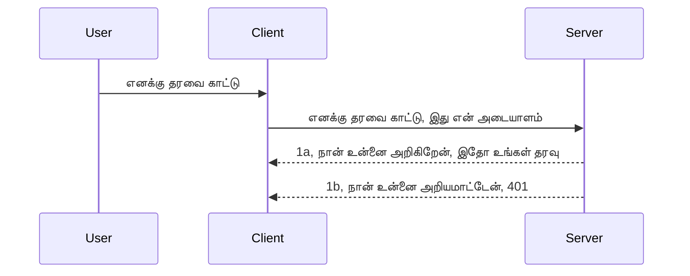

# எளிய அங்கீகாரம்

MCP SDKகள் OAuth 2.1-ஐ பயன்படுத்த விரும்புகின்றன, இது ஒரு சிக்கலான செயல்முறை ஆகும், இதில் அங்கீகார சேவையகம், வள சேவையகம், உரிமப்பத்திரம் அனுப்புதல், குறியீடு பெறுதல், குறியீட்டை ஒரு பரிதான அடையாளமாக மாற்றுதல் போன்ற கருத்துக்கள் உள்ளன, இறுதியில் வள தரவுகளைப் பெறலாம். நீங்கள் OAuthக்கு பழைய அனுபவமில்லாமல் இருக்கலாம், அது நன்றான அம்சமாகும் என்றாலும், முதல் அடிப்படையான அங்கீகாரத்தை தொடங்கி, அதற்கு மேலான பாதுகாப்பு கட்டமைக்க ஆரம்பிப்பது நல்லது. அதனால் இத்தொடர் உள்ளது, அதிக அவதான அங்கீகாரத்துக்கு உங்களை தயாரித்தல்.

## அங்கீகாரம், எதை குறிக்கிறது?

அங்கீகாரம் எனப்படும் அதாவது ஆஐடென்டிபிகேஷன் மற்றும் அத்தாரைசேஷன் ஆகும். நாம் இரண்டு விஷயங்களை செய்ய வேண்டும்:

- **ஆஐடென்டிபிகேஷன்**, ஒருவர் எங்கள் வீட்டுக்கு நுழைய அனுமதிக்கப்பட்டுள்ளாரா என்று கண்டுபிடிக்கும் செயல்முறை, அவர்கள் "இங்கு" இருப்பதற்குரிய உரிமை உள்ளதா, அதாவது எங்கள் வள சேவையகத்துக்கு அணுகல் உண்டு என்பதை நிரூபிப்பது.
- **அத்தாரைசேஷன்**, பயனர் கேட்கிற குறிப்பிட்ட வளங்களுக்கு அவர்களுக்கு அணுகல் உண்டா என்பதை கண்டறிதல், உதாரணத்திற்கு இந்த ஆர்டர்கள் அல்லது இந்த தயாரிப்புகள் அல்லது அவர்கள் உள்ளடக்கத்தை வாசிக்க அனுமதி உள்ளதா, ஆனால் அழிக்க அனுமதி இல்லை என்று போன்ற அம்சங்களில்.

## அனுமதிப்பத்திரங்கள்: நாம் அமைப்பை எப்படிக் கூறுகிறோம்

அனைத்து வலை டெவலப்பர்கள் பெரும்பாலும் சர்வருக்கு ஒரு அனுமதிப்பத்திரம் தர வேண்டியதாக நினைக்கின்றனர், இது ஒரு ரகசியமாக இருக்கும், அது "ஆஐடென்டிபிகேஷன்"க்கு தேவையானது. இந்த அனுமதிப்பத்திரம் பொதுவாக பயனர் பெயர் மற்றும் கடவுச்சொல்லின் base64 குறியீட்டாக்கம் அல்லது API முகவரி விசையாக இருக்கும், இது குறிப்பிட்ட பயனரை அடையாளம் காண்பிக்கிறது.

இது "Authorization" எனும் தலைப்பில் அனுப்பப்படுகிறது:

```json
{ "Authorization": "secret123" }
```

இது பொதுவாக basic authentication எனவும் அழைக்கப்படுகிறது. முழுமையான ஓட்டம் கீழ்காணும் முறையில் செயல்படுகிறது:


```mermaid
sequenceDiagram
   participant User
   participant Client
   participant Server

   User->>Client: எனக்கு தரவை காட்டு
   Client->>Server: எனக்கு தரவை காட்டு, இது என் அடையாளம்
   Server-->>Client: 1a, நான் உன்னை அறிகிறேன், இதோ உங்கள் தரவு
   Server-->>Client: 1b, நான் உன்னை அறியமாட்டேன், 401
```

இப்போது ஓட்டத்தை புரிந்து கொண்டோம், நாம் அதை எவ்வாறு செயல்படுத்த வேண்டும்? பெரும்பாலான வலை சர்வர்கள் 'middleware' எனப்படும் நிறுவனம் உண்டு, இது கோரிக்கை ஓடும் போது ஓடும் ஒரு குறியீடு துண்டு, அது அனுமதிப்பத்திரங்களை சரிபார்க்கிறது, சரியானால் கோரிக்கையை அனுமதிக்கிறது, இல்லையெனில் அகற்றுகிறது. இதை எவ்வாறு செயற்படுத்துவோம் என்று பார்ப்போம்:

**Python**

```python
class AuthMiddleware(BaseHTTPMiddleware):
    async def dispatch(self, request, call_next):

        has_header = request.headers.get("Authorization")
        if not has_header:
            print("-> Missing Authorization header!")
            return Response(status_code=401, content="Unauthorized")

        if not valid_token(has_header):
            print("-> Invalid token!")
            return Response(status_code=403, content="Forbidden")

        print("Valid token, proceeding...")
       
        response = await call_next(request)
        # எந்தவொரு வாடிக்கையாளர் தலைப்புகளைச் சேர் அல்லது பதிலில் எதෙாவது மாற்றம் செய்யவும்
        return response


starlette_app.add_middleware(CustomHeaderMiddleware)
```

இதில்:

- `AuthMiddleware` என்ற middleware ஐ உருவாக்கியுள்ளோம், அதில் உள்ள `dispatch` முறை வலை சர்வரால் அழைக்கப்படுகின்றது. 
- middleware ஐ web server க்கு சேர்த்துள்ளோம்:

    ```python
    starlette_app.add_middleware(AuthMiddleware)
    ```

- Authorization தலைப்பு உள்ளதா என்றும் அனுப்பப்படும் ரகசியம் சரியானதா என்றும் சரிபார்க்கும் சரிபார்ப்பு லாஜிக் எழுதியுள்ளோம்:

    ```python
    has_header = request.headers.get("Authorization")
    if not has_header:
        print("-> Missing Authorization header!")
        return Response(status_code=401, content="Unauthorized")

    if not valid_token(has_header):
        print("-> Invalid token!")
        return Response(status_code=403, content="Forbidden")
    ```

    ரகசியம் இருந்தும் சரியானதும் என்றால், `call_next` ஐ அழைத்து கோரிக்கை ஓடத் அனுமதித்து பதிலை திருப்புகிறது.

    ```python
    response = await call_next(request)
    # எந்த வாடிக்கையாளர் தலைப்புகளைச் சேர்க்கவும் அல்லது பதிலில் ஏதேனும் மாற்றவும்
    return response
    ```

இது எப்படி இயங்கும் என்றால், வலை கோரிக்கை சர்வருக்கு வந்தால் middleware இயங்கும், அதன் செயலாக்கப்படி கோரிக்கையை அனுமதிப்பதோ, வேண்டும் ஆகவில்லை என்றால் தவறை திருப்புவதோ ஆகும்.

**TypeScript**

இங்கு Express என்ற பிரபலமான கட்டமைப்புடன் middleware உருவாக்கி, MCP Server-க்கு வரும் கோரிக்கையை இடையே பிடிக்கும். இதோ அதற்கான குறியீடு:

```typescript
function isValid(secret) {
    return secret === "secret123";
}

app.use((req, res, next) => {
    // 1. அங்கீகாரம் தலைப்பு உள்ளதா?
    if(!req.headers["Authorization"]) {
        res.status(401).send('Unauthorized');
    }
    
    let token = req.headers["Authorization"];

    // 2. செல்லுபடித்தன்மையை சரிபார்க்கவும்.
    if(!isValid(token)) {
        res.status(403).send('Forbidden');
    }

   
    console.log('Middleware executed');
    // 3. கோரிக்கையை அடுத்த படிக்கு அனுப்புகிறது.
    next();
});
```

இதில்:

1. முதலில் Authorization தலைப்பு உள்ளதா என பார்க்கிறோம், இல்லையெனில் 401 பிழை.
2. அனுமதிப்பத்திரம் சரியானதா என உறுதி செய்கிறது, இல்லையெனில் 403 பிழை அனுப்புகிறது.
3. இறுதியில் கோரிக்கை தொடர்ந்து கேட்கப்பட்ட வளத்தை ஏற்று பதிலளிக்கிறது.

## பயிற்சி: அங்கீகாரம் செயல்படுத்து

நாம் கற்றதை பயன்படுத்தி முயற்சி செய்போம். திட்டம் இதுவாக இருக்கிறது:

சர்வர்

- வலை சர்வர் மற்றும் MCP உள்ளமைவை உருவாக்கு.
- சர்வருக்கு middleware செயல்படுத்து.

கஸ்டமர்

- தலைப்பில் அனுமதிப்பத்திரத்தை கொண்ட வலை கோரிக்கையை அனுப்பு.

### -1- வலை சர்வர் மற்றும் MCP உள்ளமைவை உருவாக்கு

> **முன்னே பார்க்க:** கீழே TypeScript உதாரணம் HTTP போக்குவரத்தை `mcp-session-id` விசையுடன் `transports` என்ற வரைபடத்தில் பதிவு செய்கிறது, **MCP Specification 2025-11-25** படி. `2026-07-28` வெளியீடு அந்த ஹாண்ட்‌ஷேக் மற்றும் session ஐ முற்றிலும் அகற்றுகிறது, அதனால் இந்த per-session போக்குவரத்து வரைபடம் இடம் விட்டு நீதிமுறை, சுயContained கோரிக்கைகள் முறை வருகிறது. விரிவாகப் பார்க்க [What's Changing in MCP: The 2026-07-28 Release Candidate](../../01-CoreConcepts/mcp-2026-07-28-release-candidate.md).

முதல் கட்டமாக, வலை சர்வர் மற்றும் MCP Server உருவாக்க வேண்டும்.

**Python**

இங்கு MCP சர்வர் உருவாக்கி, starlette web பயன்பாடை உருவாக்கி uvicorn மூலம் ஓட்டுகிறோம்.

```python
# MCP சேவையகத்தை உருவாக்குதல்

app = FastMCP(
    name="MCP Resource Server",
    instructions="Resource Server that validates tokens via Authorization Server introspection",
    host=settings["host"],
    port=settings["port"],
    debug=True
)

# starlette வலை செயலியை உருவாக்குதல்
starlette_app = app.streamable_http_app()

# uvicorn மூலம் செயலியை பரிமாறுதல்
async def run(starlette_app):
    import uvicorn
    config = uvicorn.Config(
            starlette_app,
            host=app.settings.host,
            port=app.settings.port,
            log_level=app.settings.log_level.lower(),
        )
    server = uvicorn.Server(config)
    await server.serve()

run(starlette_app)
```

இதில்:

- MCP Server உருவாக்கப்பட்டது.
- MCP Server விதத்தில் இருந்து starlette web app `app.streamable_http_app()` உருவாக்கப்பட்டது.
- uvicorn மூலம் web app ஐ முதன்மை சேவை செய்யப்பட்டது `server.serve()`.

**TypeScript**

இங்கு MCP Server உருவாக்கப்படுகிறது.

```typescript
const server = new McpServer({
      name: "example-server",
      version: "1.0.0"
    });

    // ... சர்வர் வளங்கள், கருவிகள் மற்றும் பிராம்ப்ட்களை அமைத்தல் ...
```

இந்த MCP Server உருவாக்கம் POST /mcp வழியில் செயல்படுத்தப்பட வேண்டும், மேலே குறியீட்டை கீழே போல் மாற்றுகின்றோம்:

```typescript
import express from "express";
import { randomUUID } from "node:crypto";
import { McpServer } from "@modelcontextprotocol/sdk/server/mcp.js";
import { StreamableHTTPServerTransport } from "@modelcontextprotocol/sdk/server/streamableHttp.js";
import { isInitializeRequest } from "@modelcontextprotocol/sdk/types.js"

const app = express();
app.use(express.json());

// அமர்வு ID மூலம் போக்குவரத்தை சேமிக்க மேப்பர்
const transports: { [sessionId: string]: StreamableHTTPServerTransport } = {};

// கிளையண்ட்-இல் இருந்து சர்வருக்கு தொடர்புக்கு POST கோரிக்கைகளை கையாள்க
app.post('/mcp', async (req, res) => {
  // ஏற்கனவே உள்ள அமர்வு ID ஐ சரிபார்
  const sessionId = req.headers['mcp-session-id'] as string | undefined;
  let transport: StreamableHTTPServerTransport;

  if (sessionId && transports[sessionId]) {
    // ஏற்கனவே இருக்கும் போக்குவரத்தை மீண்டும் பயன்படுத்துக
    transport = transports[sessionId];
  } else if (!sessionId && isInitializeRequest(req.body)) {
    // புதிய துவக்க கோரிக்கை
    transport = new StreamableHTTPServerTransport({
      sessionIdGenerator: () => randomUUID(),
      onsessioninitialized: (sessionId) => {
        // அமர்வு ID மூலம் போக்குவரத்தை சேமி
        transports[sessionId] = transport;
      },
      // பின்தள்ளப்பட்ட பொருந்துதன்மைக்காக DNS மறுஅமைப்பைத் தடுப்பது பொதுவாக முடக்கப்பட்டுள்ளது. நீங்கள் இந்த சர்வரை
      // உள்ளூர் இயக்கினால், கீழ்க்காணும் அமைவுகளை நிச்சயமாகச் செய்க:
      // enableDnsRebindingProtection: true,
      // allowedHosts: ['127.0.0.1'],
    });

    // போக்குவரத்தை மூடியபோது சுத்தம் செய்க
    transport.onclose = () => {
      if (transport.sessionId) {
        delete transports[transport.sessionId];
      }
    };
    const server = new McpServer({
      name: "example-server",
      version: "1.0.0"
    });

    // ... சர்வர் வளங்கள், கருவிகள் மற்றும் முனைகளைக் அமைக்கவும் ...

    // MCP சர்வருடன் இணைக்கவும்
    await server.connect(transport);
  } else {
    // தவறான கோரிக்கை
    res.status(400).json({
      jsonrpc: '2.0',
      error: {
        code: -32000,
        message: 'Bad Request: No valid session ID provided',
      },
      id: null,
    });
    return;
  }

  // கோரிக்கையை கையாள்க
  await transport.handleRequest(req, res, req.body);
});

// GET மற்றும் DELETE கோரிக்கைகளுக்கு மறுபயன்பாட்டுக் கையொப்பி
const handleSessionRequest = async (req: express.Request, res: express.Response) => {
  const sessionId = req.headers['mcp-session-id'] as string | undefined;
  if (!sessionId || !transports[sessionId]) {
    res.status(400).send('Invalid or missing session ID');
    return;
  }
  
  const transport = transports[sessionId];
  await transport.handleRequest(req, res);
};

// சர்வர்-இல் இருந்து கிளையண்டிற்கு அறிவிப்புகளுக்கான GET கோரிக்கைகளை SSE மூலம் கையாள்க
app.get('/mcp', handleSessionRequest);

// அமர்வு முடிவுக்கு DELETE கோரிக்கைகளை கையாள்க
app.delete('/mcp', handleSessionRequest);

app.listen(3000);
```

இப்போது MCP Server உருவாக்கம் `app.post("/mcp")` உள்ளே எப்படி இடம் பெற்றது என்பதைக் காண்கிறோம்.

Middleware உருவாக்கம் தொடர்வோம், அது அனுமதிப்பத்திரத்தைக் சரிபார்க்கும்.

### -2- சர்வருக்கு middleware செயல்படுத்து

இப்போது middleware பகுதி. இதன் மூலம் `Authorization` தலைப்பில் அனுமதிப்பத்திரம் தேடி சரிபார்க்கும் middleware உருவாக்குவோம். அது ஏற்றுக்கொள்ளத்தக்கதாக இருந்தால் கோரிக்கை தொடரும் (மாதிரி கருவிகள் பட்டியல், வளம் வாசித்தல் அல்லது MCP வகைகள்).

**Python**

middleware உருவாக்க BaseHTTPMiddleware-ஐ பரம்பரையாகக் கொண்ட ஒரு வகுப்பை உருவாக்க வேண்டும். இரண்டு முக்கிய அம்சங்கள்:

- கோரிக்கை `request`, அதிலிருந்து தலைப்பு தகவலைப் படிக்கிறோம்.
- `call_next` என்ற அழைப்பை பயன்படுத்தி கோரிக்கையைப் பின்பற்றச் செய்வது.

முதலில், `Authorization` தலைப்பு இல்லாத போது:

```python
has_header = request.headers.get("Authorization")

# தலைப்பு இல்லை, 401 தவறுடன் தோல்வி, இல்லையெனில் தொடரவும்.
if not has_header:
    print("-> Missing Authorization header!")
    return Response(status_code=401, content="Unauthorized")
```

இங்கு 401 Unauthorized என அனுப்பி கஸ்டமர் தோல்வி அடைந்ததைக் காட்டுகிறது.

அடுத்து அனுமதிப்பத்திரம் இருந்தால், அதன் செல்லுபடித்தன்மையைப் பரிசோதிக்க:

```python
 if not valid_token(has_header):
    print("-> Invalid token!")
    return Response(status_code=403, content="Forbidden")
```

மேலே 403 Forbidden அனுப்புகிறோம். முழு middleware இங்கே:

```python
class AuthMiddleware(BaseHTTPMiddleware):
    async def dispatch(self, request, call_next):

        has_header = request.headers.get("Authorization")
        if not has_header:
            print("-> Missing Authorization header!")
            return Response(status_code=401, content="Unauthorized")

        if not valid_token(has_header):
            print("-> Invalid token!")
            return Response(status_code=403, content="Forbidden")

        print("Valid token, proceeding...")
        print(f"-> Received {request.method} {request.url}")
        response = await call_next(request)
        response.headers['Custom'] = 'Example'
        return response

```

சிறப்பாக உள்ளது; ஆனால் `valid_token` என்னும் செயல்பாடு?

```python
# உற்பத்திக்கு பயன்படுத்தாதீர்கள் - அதை மேம்படுத்துங்கள் !!
def valid_token(token: str) -> bool:
    # "Bearer " முன்னொட்டை அகற்றுக
    if token.startswith("Bearer "):
        token = token[7:]
        return token == "secret-token"
    return False
```

இது மூலதன வேளையில் மேம்படுத்தப்பட வேண்டும்.

[!IMPORTANT] கடுமையாக: ரகசியங்களை இந்த குறியீட்டில் வைத்திருக்க கூடாது. தரவுத்தளம் அல்லது IDP (அடையாள சேவை) இல் இருந்து மதிப்பிட வேண்டும் அல்லது IDP தான் சரிபார்க்க உதவ வேண்டும்.

**TypeScript**

Express-இல் இதனைப் பயன்படுத்த middleware செயல்படுத்த `use` முறையை அழைக்க வேண்டும்.

- கோரிக்கையைப் பார்வையிட்டு `Authorization` தலைப்பில் அனுமதிப்பத்திரம் சரிபார்க்க வேண்டும்.
- சரியானது என்றால் கோரிக்கை தொடர்ந்து நிறைவேற்றப்பட வேண்டும் (கருவிகள் பட்டியல், வள வாசித்தல் போன்ற MCP அம்சங்கள்).

இங்கு `Authorization` தலைப்பு சரிபார்க்கின்றோம், இல்லையெனில் 401 திருப்புவோம்:

```typescript
if(!req.headers["authorization"]) {
    res.status(401).send('Unauthorized');
    return;
}
```

தலைப்பு இல்லையெனில் 401.

அடுத்து அனுமதிப்பத்திரத்தை சரிபார்க்கின்றோம், தவறானால் 403:

```typescript
if(!isValid(token)) {
    res.status(403).send('Forbidden');
    return;
} 
```

இப்போது 403 பிழை திருப்பப்படுகிறது.

முழு குறியீடு:

```typescript
app.use((req, res, next) => {
    console.log('Request received:', req.method, req.url, req.headers);
    console.log('Headers:', req.headers["authorization"]);
    if(!req.headers["authorization"]) {
        res.status(401).send('Unauthorized');
        return;
    }
    
    let token = req.headers["authorization"];

    if(!isValid(token)) {
        res.status(403).send('Forbidden');
        return;
    }  

    console.log('Middleware executed');
    next();
});
```

middleware மூலம் கிளையண்ட் அனுப்பும் அனுமதிப்பத்திரம் சரிபார்க்கப்படுகிறது. கிளையண்ட் எப்படி?

### -3- அனுமதிப்பத்திரத்துடன் வலை கோரிக்கை அனுப்பு

கிளையண்ட் அனுமதிப்பத்திரத்துடன் தலைப்பில் அனுப்ப வேண்டியது அவசியம். MCP கிளையண்ட் பயன்படுத்துவது எப்படி என்று தீர்மானிக்க வேண்டும்.

**Python**

கிளையண்ட் தலைப்பில் அனுமதிப்பத்திரத்துடன் அனுப்புவதைப் பார்:

```python
# மதிப்பை கடினமாக கோடிங் செய்ய வேண்டாம், குறைந்தபட்சம் ஒரு சுற்றுச்சூழல் மாறிலியில் அல்லது ஒரு அதிக பாதுகாப்பான சேமிப்பில் வைத்திருங்கள்
token = "secret-token"

async with streamablehttp_client(
        url = f"http://localhost:{port}/mcp",
        headers = {"Authorization": f"Bearer {token}"}
    ) as (
        read_stream,
        write_stream,
        session_callback,
    ):
        async with ClientSession(
            read_stream,
            write_stream
        ) as session:
            await session.initialize()
      
            # செய்யவேண்டியது, கிளையெண்டில் நீங்கள் செய்யவேண்டும் என்று நினைக்கும் செயல்கள், ตัวอย่างként கருவிகள் பட்டியலிடுதல், கருவிகளை அழைத்தல் போன்றவை.
```

`headers = {"Authorization": f"Bearer {token}"}` போல இருக்கிறது.

**TypeScript**

இது இரண்டு படிகள்:

1. அனுமதிப்பத்திரத்துடன் ஒரு கட்டமைப்பு ஆவண உருவாக்கு.
2. அதை போக்குவரத்திற்கு கொடு.

```typescript

// இங்கே காண்பிக்கப்பட்ட மதிப்பை கடுமையாக கோடிட்டு எழுதாதீர்கள். குறைந்தபட்சமாக அதை ஒரு சூழல் மாறியாக வைத்துக் கொள்ளவும் dev mode இல் dotenv போன்றவற்றைப் பயன்படுத்தவும்.
let token = "secret123"

// ஒரு கிளையன்ட் பரிமாற்ற விருப்ப பொருளை வரையறுக்கவும்
let options: StreamableHTTPClientTransportOptions = {
  sessionId: sessionId,
  requestInit: {
    headers: {
      "Authorization": "secret123"
    }
  }
};

// விருப்ப பொருளை பரிமாற்றத்துக்கு அனுப்பவும்
async function main() {
   const transport = new StreamableHTTPClientTransport(
      new URL(serverUrl),
      options
   );
```

மேலே `options` உருவாக்கி `requestInit` இல் தலைப்புகளை வைத்துள்ளோம்.

[!IMPORTANT] இது எப்படி மேம்படும்? HTTPS இல்லாமல் அனுமதிப்பத்திரம் அனுப்புவது ஆபத்தாகும். கூடுதலாக, அனுமதிப்பத்திரம் திருடப்படலாம், எனவே அதை ரத்து செய்யும் முறை, எந்த இடத்திலிருந்து வருகிறது, அதிகம் கோரிக்கை செய்கிறதா (போட் செயல்பாடு), போன்ற பல பாதுகாப்பு அம்சங்கள் தேவையாகும்.

இது மிகவும் எளிய APIகளுக்கு ஆரம்ப கட்ட பாதுகாப்பாக நன்று.

இப்போது ஒரு தரமான வடிவமாக JSON Web Token (JWT), அதாவது "JOT" பயன்படுத்த முயற்சிப்போம்.

## JSON Web Tokens, JWT

எளிய அனுமதிப்பத்திரங்களை மாற்றுவதில் என்ன நன்மைகள்?

- **பாதுகாப்பு மேம்பாடுகள்**. Basic authல் username, password ஐ base64 ஆன token போல தொடர்ந்து அனுப்புவதால் அபாயம் அதிகம். JWTயில் username மற்றும் password அனுப்பி token பெறுகிறீர்கள், அது காலாவதியாகும். Roles, scopes, permissions பரிந்துரைக்கும்.
- **ஸ்டேட்லெஸ்ஸ்ட்னஸ் மற்றும் அளவீடு**. JWT தானே அனைத்து பயனர் தகவல்களையும் உடையது, சேவையகம் பக்க session சேமிப்பை நீக்குகிறது. tokens உள்ளூர் சரிபார்க்கக் கூடும்.
- **இணையமைப்பு மற்றும் கூட்டாட்சி**. JWT Open ID Connectக்கு மூலமாகும், Entra ID, Google Identity, Auth0 போன்ற அடையாள வழங்கிகளுடன் பயன்படுத்தப்படுகிறது. Single sign on போன்ற அம்சங்களால் நிறுவன தரமானது.
- **பகுதிச் செயல்பாடு மற்றும் தழுவல்**. Azure API Management, NGINX போன்ற API வாயில்களுடன் கூட பயன்படுத்தப்படுகிறது. அங்கீகாரம் மற்றும் சேவை-சேவை தொடர்புகளுக்கும் உகந்தது.
- **செயல்திறன் மற்றும் கேச்சிங்**. உருக்கப்பட்ட பின் கேச் செய்வது பரிமாற்றத்தை அதிகரிக்கும், அதிகபடியான பயன்பாடுகளுக்கு உதவும்.
- **மேம்பட்ட அம்சங்கள்**. சர்வரில் சரிபார்ப்பு மற்றும் ரத்து போன்ற அம்சங்கள்.

இவ்வற்றின் மூலம் கீழ்காணும் வலைப்பொருளுடன் செயல்படுத்துவோம்.

## Basic auth ஐ JWT ஆக மாற்றல்

பெரிய அளவில் மாற்றங்கள் என்ன?

- **JWT token உருவாக்க அறிந்து கொள்ளுதல்** மற்றும் கிளையண்ட்-சர்வர் இடையே அனுப்ப.
- **JWT token சரிபார்ப்பு** மற்றும் வழிகளுக்கு அனுமதி.
- **Token பாதுகாப்பான சேமிப்பு**.
- **வழிகளை பாதுகாப்பு**. நமது வழிகள் MCP அம்சங்களுடன் விரிவுபடுத்தல்.
- **Refresh tokens சேர்க்க**. குறுகிய ஆயுள் tokens மற்றும் நீண்ட ஆயுள் refresh tokens உருவாக்கல், புதுப்பிக்கும் முடிச்சு மற்றும் சுற்றுச்சூழல்.

### -1- JWT token உருவாக்குதல்

முதலில் JWT token பாகங்கள்:

- **header**, பயன்படும் ஆல்கோரிதம் மற்றும் token வகை.
- **payload**, கோரிக்கை, உதாரணம் sub (token பிரதிநிதித்துவம் செய்பவர்), exp (காலாவது), role (பங்கு).
- **signature**, ரகசியம் அல்லது தனிப்பட்ட விசையால் கையெழுத்து.

இதற்கு header, payload மற்றும் குறியீட்டாக்கப்பட்ட token உருவாக்க வேண்டும்.

**Python**

```python

import jwt
import jwt
from jwt.exceptions import ExpiredSignatureError, InvalidTokenError
import datetime

# JWTக்கு கையொப்பம் இட பயன்படுத்தப்படும் ரகசிய திறவு
secret_key = 'your-secret-key'

header = {
    "alg": "HS256",
    "typ": "JWT"
}

# பயனர் தகவல் மற்றும் அதற்கான உரிமைகள் மற்றும் காலாவதி நேரம்
payload = {
    "sub": "1234567890",               # பொருள் (பயனர் ஐடி)
    "name": "User Userson",                # தனிப்பயன் உரிமை
    "admin": True,                     # தனிப்பயன் உரிமை
    "iat": datetime.datetime.utcnow(),# வெளியிடப்பட்ட நாள்
    "exp": datetime.datetime.utcnow() + datetime.timedelta(hours=1)  # காலாவதி
}

# அதை குறியாக்கம் செய்
encoded_jwt = jwt.encode(payload, secret_key, algorithm="HS256", headers=header)
```

மேலே:

- HS256 ஆல்கோரிதம் மற்றும் JWT வகையுடன் header விளக்கப்பட்டது.
- ஒரு பயனர் id, பயனர் பெயர், பங்கு, வெளியிடப்பட்ட நேரம் மற்றும் காலாவதி ஆகிய விடயங்கள் payload இணைக்கப்பட்டு, காலவரையறுப்பை செயல்படுத்தியது.

**TypeScript**

இதற்காக சில கோட்பாடுகள் தேவை.

முன்னுதாரங்கள்

```sh

npm install jsonwebtoken
npm install --save-dev @types/jsonwebtoken
```

இவை தயார், header, payload உருவாக்கி குறியீடு token உருவாக்குவோம்:

```typescript
import jwt from 'jsonwebtoken';

const secretKey = 'your-secret-key'; // proizvodstve env vars ஐ பயன்படுத்தவும்

// payload ஐ வரையறு
const payload = {
  sub: '1234567890',
  name: 'User usersson',
  admin: true,
  iat: Math.floor(Date.now() / 1000), // வெளியிடப்பட்டது
  exp: Math.floor(Date.now() / 1000) + 60 * 60 // 1 மணிநேரத்திற்கு பிறகு காலாவதி
};

// தலைப்பை வரையறு (விருப்பமானது, jsonwebtoken இயல்புநிலைகளை அமைக்கிறது)
const header = {
  alg: 'HS256',
  typ: 'JWT'
};

// டோக்கனை உருவாக்குக
const token = jwt.sign(payload, secretKey, {
  algorithm: 'HS256',
  header: header
});

console.log('JWT:', token);
```

இது:

HS256 மூலம் கையெழுத்திடப்பட்டது
1 மணி நேரத்திற்கு செல்லுபடியானது
sub, name, admin, iat, exp போன்ற கோரிக்கைகள் அடங்கியுள்ளது.

### -2- token சரிபார்க்க

token சரிபார்ப்பு உறுப்புகளுக்கு இடையே செல்லுபடியானது என்பதை சரிபார்க்க வேண்டும். இதற்கு token ஐ பிளவு செய்து படிக்க வேண்டும், மேலும் பல சரிபார்ப்புகள் தேவை, அதற்கு மேலும, பயனர் உங்கள் தரவுத்தளத்தில் உண்டா, சரிபார்க்கலாம்.

**Python**

```python

# JWT-ஐ டிகோடு செய்து சரிபார்க்கவும்
try:
    decoded = jwt.decode(token, secret_key, algorithms=["HS256"])
    print("✅ Token is valid.")
    print("Decoded claims:")
    for key, value in decoded.items():
        print(f"  {key}: {value}")
except ExpiredSignatureError:
    print("❌ Token has expired.")
except InvalidTokenError as e:
    print(f"❌ Invalid token: {e}")

```

இந்தக் கோடில், டோக்கன், ரகசிய விசை மற்றும் தேர்ந்தெடுக்கப்பட்ட ஆல்கோரிதத்தை உள்ளீடாகக் கொண்டு `jwt.decode` அழைக்கபடுகிறோம். தவறான சரிபார்ப்பு ஏற்படும் போது ஒரு பிழை எழுகிறது என்பதால் நாம் try-catch கட்டமைப்பைப் பயன்படுத்துகிறோம் என்பதை கவனிக்கவும்.

**TypeScript**

இங்கு, நாங்கள் டோக்கனின் டிகோடட் பதிப்பைப் பெற `jwt.verify` ஐ அழைக்க வேண்டும், பின்னர் அதை மேலும் பகுப்பாய்வு செய்யலாம். இந்த அழைப்பு தோல்வியடையுமானால், அது டோக்கனின் அமைப்பு தவறு அல்லது அது இனி செல்லுபடியாகாது என்பதைக் குறிக்கிறது.

```typescript

try {
  const decoded = jwt.verify(token, secretKey);
  console.log('Decoded Payload:', decoded);
} catch (err) {
  console.error('Token verification failed:', err);
}
```

NOTE: முன்பே கூறியது போல், இந்த டோக்கன் எங்கள் அமைப்பில் ஒரு பயனரை குறிக்கிறதா என்பதை உறுதிப்படுத்த கூடுதல் சரிபார்ப்புகளை மேற்கொள்ள வேண்டும் மற்றும் பயனர் அதன் உரிமைகளைக் குறிக்கிறது என்பதை உறுதிசெய்ய வேண்டும்.

அடுத்ததாக, ரோல் அடிப்படையிலான அணுகல் கட்டுப்பாட்டை (RBAC என்றும் அழைக்கப்படும்) பரிசீலிக்கலாம்.

## ரோல் அடிப்படையிலான அணுகல் கட்டுப்பாட்டை சேர்த்தல்

வெவ்வேறு ரோல்கள் வெவ்வேறு அனுமதிகளை கொண்டுள்ளன என்று வெளிப்படுத்த விரும்புகிறோம். உதாரணமாக, ஒரு நிருவாகி எல்லா செயல்களையும் செய்ய முடியும் என்றும் ஒரு சாதாரண பயனர் படித்தல்/எழுத்து மட்டுமே செய்ய முடியும் என்றும், ஒரு விருந்தினர் படிப்பதற்கே அனுமதிக்கப்பட்டவர் என கருதுகின்றோம். ஆகவே, சில சாத்தியமான அனுமதி நிலைகள்:

- Admin.Write
- User.Read
- Guest.Read

இப்படிப்பட்ட கட்டுப்பாட்டை மிடில்வேருடன் எப்படி அமல்படுத்தலாம் என்பதை பார்ப்போம். மிடில்வேர் ஒவ்வொரு மார்க்கத்துக்கும் மற்றும் எல்லா மார்க்கத்துக்கும் சேர்க்கப்படலாம்.

**Python**

```python
from starlette.middleware.base import BaseHTTPMiddleware
from starlette.responses import JSONResponse
import jwt

# ரகசியத்தை கோடில் வைத்துக்கொள்ள வேண்டாம், இது சான்றிதழ் நோக்கத்துக்காக மட்டுமே. இதை ஒரு பாதுகாப்பான இடத்திலிருந்து வாசிக்கவும்.
SECRET_KEY = "your-secret-key" # இதை env மாறியில் வைக்கவும்
REQUIRED_PERMISSION = "User.Read"

class JWTPermissionMiddleware(BaseHTTPMiddleware):
    async def dispatch(self, request, call_next):
        auth_header = request.headers.get("Authorization")
        if not auth_header or not auth_header.startswith("Bearer "):
            return JSONResponse({"error": "Missing or invalid Authorization header"}, status_code=401)

        token = auth_header.split(" ")[1]
        try:
            decoded = jwt.decode(token, SECRET_KEY, algorithms=["HS256"])
        except jwt.ExpiredSignatureError:
            return JSONResponse({"error": "Token expired"}, status_code=401)
        except jwt.InvalidTokenError:
            return JSONResponse({"error": "Invalid token"}, status_code=401)

        permissions = decoded.get("permissions", [])
        if REQUIRED_PERMISSION not in permissions:
            return JSONResponse({"error": "Permission denied"}, status_code=403)

        request.state.user = decoded
        return await call_next(request)


```

கீழே உள்ளவை போன்ற மிடில்வேரைச் சேர்க்க சில விதிகள் உள்ளன:

```python

# மாற்று 1: starlette செயலியை உருவாக்கும் போது மிடில்வேர் சேர்க்கவும்
middleware = [
    Middleware(JWTPermissionMiddleware)
]

app = Starlette(routes=routes, middleware=middleware)

# மாற்று 2: starlette செயலி ஏற்கனவே உருவாக்கப்பட்ட பிறகு மிடில்வேர் சேர்க்கவும்
starlette_app.add_middleware(JWTPermissionMiddleware)

# மாற்று 3: ஒவ்வொரு மார்க்கத்திலும் மிடில்வேர் சேர்க்கவும்
routes = [
    Route(
        "/mcp",
        endpoint=..., # கைமுறையாளர்
        middleware=[Middleware(JWTPermissionMiddleware)]
    )
]
```

**TypeScript**

எல்லா கோரிக்கைகளுக்கும் இயக்கப்படும் மிடில்வேர் ஒன்றை `app.use` மூலம் பயன்படுத்தலாம்.

```typescript
app.use((req, res, next) => {
    console.log('Request received:', req.method, req.url, req.headers);
    console.log('Headers:', req.headers["authorization"]);

    // 1. அங்கீகார ஹெடர் அனுப்பப்பட்டுள்ளதா என்பதை சரிபார்க்கவும்

    if(!req.headers["authorization"]) {
        res.status(401).send('Unauthorized');
        return;
    }
    
    let token = req.headers["authorization"];

    // 2. டோக்கன் செல்லுபடியாக உள்ளதா என்பதை சரிபார்க்கவும்
    if(!isValid(token)) {
        res.status(403).send('Forbidden');
        return;
    }  

    // 3. டோக்கன் பயனர் எங்கள் ம 시스템ல் உள்ளது என்பதை சரிபார்க்கவும்
    if(!isExistingUser(token)) {
        res.status(403).send('Forbidden');
        console.log("User does not exist");
        return;
    }
    console.log("User exists");

    // 4. டோக்கனுக்கு சரியான அனுமதிகள் உள்ளனவா என்பதை உறுதிப்படுத்தவும்
    if(!hasScopes(token, ["User.Read"])){
        res.status(403).send('Forbidden - insufficient scopes');
    }

    console.log("User has required scopes");

    console.log('Middleware executed');
    next();
});

```

எங்கள் மிடில்வேர் செய்ய வேண்டிய முக்கிய பணிகள்:

1. அங்கீகார தலைப்பு இருக்கிறதா என சரிபார்க்கவும்
2. டோக்கன் செல்லுபடியாகுமா என `isValid` என்ற நாங்கள் எழுதி இருக்கும் முறையை அழைத்துச் சரிபார்க்கவும்
3. பயனர் எங்கள் அமைப்பில் உள்ளாரா என்பதையும் சரிபார்க்க வேண்டும்

   ```typescript
    // தரவுத்தளத்தில் பயன்படுத்துநர்கள்
   const users = [
     "user1",
     "User usersson",
   ]

   function isExistingUser(token) {
     let decodedToken = verifyToken(token);

     // செய்யவேண்டியது, பயனாளர் தரவுத்தளத்தில் உள்ளாரா என்பதைக் பார்க்கவும்
     return users.includes(decodedToken?.name || "");
   }
   ```

   மேலே, எளிய `users` பட்டியலை உருவாக்கியுள்ளோம், இது பொதுவாக தரவுத்தளத்தில் இருக்கவேண்டும்.

4. கூடுதலாக, டோக்கனை சரியான அனுமதிகளுடன் கொண்டுள்ளதா என்பதைச் சரிபார்க்க வேண்டும்.

   ```typescript
   if(!hasScopes(token, ["User.Read"])){
        res.status(403).send('Forbidden - insufficient scopes');
   }
   ```

   மேலே உள்ள மிடில்வேர் குறியீட்டில், டோக்கனில் User.Read அனுமதி உள்ளதா என்று சரிபார்க்கப்படுகிறது, இல்லையெனில் 403 பிழை அனுப்பப்படுகிறது. கீழே `hasScopes` உதவி முறையை காணலாம்.

   ```typescript
   function hasScopes(scope: string, requiredScopes: string[]) {
     let decodedToken = verifyToken(scope);
    return requiredScopes.every(scope => decodedToken?.scopes.includes(scope));
  }
   ```

Have a think which additional checks you should be doing, but these are the absolute minimum of checks you should be doing.

Using Express as a web framework is a common choice. There are helpers library when you use JWT so you can write less code.

- `express-jwt`, helper library that provides a middleware that helps decode your token.
- `express-jwt-permissions`, this provides a middleware `guard` that helps check if a certain permission is on the token.

Here's what these libraries can look like when used:

```typescript
const express = require('express');
const jwt = require('express-jwt');
const guard = require('express-jwt-permissions')();

const app = express();
const secretKey = 'your-secret-key'; // put this in env variable

// Decode JWT and attach to req.user
app.use(jwt({ secret: secretKey, algorithms: ['HS256'] }));

// Check for User.Read permission
app.use(guard.check('User.Read'));

// multiple permissions
// app.use(guard.check(['User.Read', 'Admin.Access']));

app.get('/protected', (req, res) => {
  res.json({ message: `Welcome ${req.user.name}` });
});

// Error handler
app.use((err, req, res, next) => {
  if (err.code === 'permission_denied') {
    return res.status(403).send('Forbidden');
  }
  next(err);
});

```

இப்போது நீங்கள் மிடில்வேர் பரிசோதனை மற்றும் அங்கீகாரத்திற்கேற்ற வகையில் எவ்வாறு பயன்படுத்தப்படலாம் என்பதைப் பார்த்தீர்கள், MCP பற்றியோ? அது அங்கீகார முறையை மாற்றுமா? அடுத்த பதிவில் காண்போம்.

### -3- MCPக்கு RBAC சேர்த்தல்

இதுவரை, நீங்கள் மிடில்வேர் மூலம் RBAC ஐச் சேர்க்க முடியும் என்பதைப் பார்த்தீர்கள், ஆனால் MCPக்கு ஒரு தனிப்பட்ட அம்சத்திற்கு RBAC சேர்க்க எளிய வழி இல்லை, எனவே என்ன செய்வது? இங்கு ஒரு குறிப்பிட்ட கருவியை அழைக்க கிளையன்ட் உரிமைகள் கொண்டிருக்கிறாரா என்பதை சரிபார்க்கும் குறியீட்டை சேர்க்க வேண்டும்.

ஒரு அம்சத்திற்கு RBAC சேர்க்க சில வழிகள் உண்டு, சில:

- თითო கருவி, வளம், அல்லது கோரிக்கைக்கு அனுமதி நிலையை சரிபார்க்க ஒரு சரிபார்ப்பு சேர்க்கவும்.

   **python**

   ```python
   @tool()
   def delete_product(id: int):
      try:
          check_permissions(role="Admin.Write", request)
      catch:
        pass # கிளையன்ட் அனுமதி தோல்வியடைந்தது, அனுமதி பிழையை எழுப்புக
   ```

   **typescript**

   ```typescript
   server.registerTool(
    "delete-product",
    {
      title: Delete a product",
      description: "Deletes a product",
      inputSchema: { id: z.number() }
    },
    async ({ id }) => {
      
      try {
        checkPermissions("Admin.Write", request);
        // செய்ய வேண்டியது, id ஐ productService மற்றும் remote entry க்கு அனுப்பவும்
      } catch(Exception e) {
        console.log("Authorization error, you're not allowed");  
      }

      return {
        content: [{ type: "text", text: `Deletected product with id ${id}` }]
      };
    }
   );
   ```


- மேம்பட்ட சேவையகம் அணுகல் மற்றும் கோரிக்கை ஹேண்ட்லர்களைப் பயன்படுத்தி எங்கு நிலைக்கு சரிபார்ப்பு செய்யவேண்டும் என்பதைக் குறைக்கவும்.

   **Python**

   ```python
   
   tool_permission = {
      "create_product": ["User.Write", "Admin.Write"],
      "delete_product": ["Admin.Write"]
   }

   def has_permission(user_permissions, required_permissions) -> bool:
      # user_permissions: பயனருக்கு உள்ள அனுமதிகள் பட்டியல்
      # required_permissions: கருவிக்கு தேவையான அனுமதிகள் பட்டியல்
      return any(perm in user_permissions for perm in required_permissions)

   @server.call_tool()
   async def handle_call_tool(
     name: str, arguments: dict[str, str] | None
   ) -> list[types.TextContent]:
    # request.user.permissions என்பது பயனருக்கான அனுமதிகளின் பட்டியல் என்று கருதுக
     user_permissions = request.user.permissions
     required_permissions = tool_permission.get(name, [])
     if not has_permission(user_permissions, required_permissions):
        # பிழை எழுப்புக "நீங்கள் கருவியை அழைக்க அனுமதி இல்லை {name}"
        raise Exception(f"You don't have permission to call tool {name}")
     # தொடர்ந்து சென்று கருவியை அழைக்கவும்
     # ...
   ```   
   

   **TypeScript**

   ```typescript
   function hasPermission(userPermissions: string[], requiredPermissions: string[]): boolean {
       if (!Array.isArray(userPermissions) || !Array.isArray(requiredPermissions)) return false;
       // பயனருக்கு குறைந்தபட்சம் ஒரு தேவையான அனுமதி இருந்தால் உண்மையை திரும்ப செய்கிறார்
       
       return requiredPermissions.some(perm => userPermissions.includes(perm));
   }
  
   server.setRequestHandler(CallToolRequestSchema, async (request) => {
      const { params: { name } } = request;
  
      let permissions = request.user.permissions;
  
      if (!hasPermission(permissions, toolPermissions[name])) {
         return new Error(`You don't have permission to call ${name}`);
      }
  
      // தொடரவும்..
   });
   ```

   குறிப்பாக, உங்கள் மிடில்வேர் கோரிக்கையின் பயனர் சொத்துக்கு ஒரு டிகோடட் டோக்கனை நியமிக்க வேண்டும், இதனால் மேலே குறியீடு எளிதாக இருக்கும் என்பதை உறுதிசெய்யுங்கள்.

### சுருக்கமாக

இப்போது நாம் பொதுவாக மற்றும் குறிப்பாக MCPக்கு RBAC ஆதரவினை எவ்வாறு சேர்ப்பது என்பதைப் பற்றி விவாதித்தோம், நீங்கள் கற்றுள்ள கருத்துக்களை உறுதிப்படுத்த உங்கள் சொந்தமாக பாதுகாப்பு அமல்படுத்த முயற்சிக்க நேரம்.

## பணிமொழி 1: அடிப்படைக் அங்கீகாரத்தைப் பயன்படுத்தி mcp சர்வர் மற்றும் mcp கிளையண்ட் கட்டமைக்கவும்

இங்கு, தலைப்புகளின் மூலம் சான்றுகளை அனுப்புவதில் நீங்கள் கற்றுக்கொண்டதைப் பயன்படுத்துவீர்கள்.

## தீர்வு 1

[Solution 1](./code/basic/README.md)

## பணிமொழி 2: பணிமொழி 1 இல் இருந்து தீர்வை JWT பயன்படுத்த மேம்படுத்தவும்

முதல் தீர்வைப் பின் தொடரவும், ஆனால் இந்த முறையில் மேம்பாடு செய்யலாம்.

அடிப்படைக் அங்கீகாரத்திற்குப் பதிலாக JWT ஐப் பயன்படுத்துவோம்.

## தீர்வு 2

[Solution 2](./solution/jwt-solution/README.md)

## சவால்

"Add RBAC to MCP" பிரிவில் விவரிக்கப்பட்டுள்ள கருவி அடிப்படையிலான RBAC ஐச் சேர்க்கவும்.

## சுருக்கம்

இந்த அத்தியாயத்தில் நீங்கள் அறிவு பெறுவீர்கள் என்று நம்புகிறோம், பாதுகாப்பின்றி இருந்து அடிப்படைக் பாதுகாப்பு, JWT மற்றும் MCPடையிலும் அதை எவ்வாறு சேர்ப்பது என்பவரை.

நாம் தனிப்பயன் JWT களுடன் உறுதியான அடித்தளத்தை உருவாக்கியுள்ளோம், ஆனால் நாம் விரிவடையும் போது, நம்முடைய அடையாள மாதிரியை தரக்களிக்கப்பட்டு அங்கே செல்பவராக மாறுகிறோம். Entra அல்லது Keycloak போன்ற IdP ஐ ஏற்றுக்கொள்வது டோக்கன் வெளியீடு, சரிபார்ப்பு மற்றும் ஆயுள் நிர்வாகத்தை நம்பகமான தளத்திற்கு வழங்க உதவும் — இது நமக்குக் பயன்பாட்டு தர்க்கம் மற்றும் பயனர் அனுபவத்தில் கவனம் செலுத்த விடும்.

அதற்காக, நமக்கு மேலும் ஒரு [மேம்பட்ட அத்தியாயம் Entra குறித்து](../../05-AdvancedTopics/mcp-security-entra/README.md) உள்ளது.

## அடுத்து என்ன

- அடுத்து: [MCP ஹோஸ்ட்களை அமைத்தல்](../12-mcp-hosts/README.md)

---

<!-- CO-OP TRANSLATOR DISCLAIMER START -->
**மறுப்பு**:
இந்த ஆவணம் AI மொழிபெயர்ப்பு சேவை [Co-op Translator](https://github.com/Azure/co-op-translator) பயன்படுத்தி மொழிபெயர்க்கப்பட்டுள்ளது. நாங்கள் துல்லியத்திற்காக முயற்சி செய்துள்ளோம், ஆனால் தானாக செய்யப்படும் மொழிபெயர்ப்புகளில் பிழைகள் அல்லது தவறுகள் இருக்கலாம் என்பதை கவனத்தில் கொள்ளவும். அசல் ஆவணம் அதன் தாய்மொழியில் அதிகாரப்பூர்வ ஆதாரமாக கருதப்பட வேண்டும். முக்கியமான தகவல்களுக்கு, தொழில்நுட்பமான மனித மொழிபெயர்ப்பு பரிந்துரைக்கப்படுகிறது. இந்த மொழிபெயர்ப்பைப் பயன்படுத்துவதால் ஏற்படும் எந்த தவறான புரிதல்கள் அல்லது தவறான விளக்கத்திற்கும் நாங்கள் பொறுப்பில்வில்லை.
<!-- CO-OP TRANSLATOR DISCLAIMER END -->