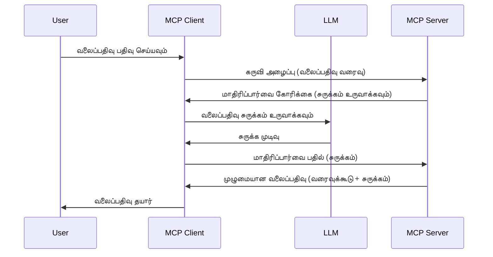

# மாதிரித்தல்ால் - கிளையண்டுக்கு அம்சங்களை ஒப்படைத்தல்

> **பழையதாக அறிவித்தல்:** `2026-07-28` MCP விவரக்குறிப்பு வெளியீடு மாதிரித்தல்ால் நேரடி ஒருங்கிணைப்புக்குப் பதிலாக பழையதாகக் குறிக்கிறது LLM வழங்குநர் APIகளுடன். மாதிரித்தல்ால் `2025-11-25` இல் மற்றும் எந்தவொரு அதிகாரப்பூர்வ பழைய அறிவிப்பிற்குப் பின் குறைந்தது ஒரு ஆண்டு வேலை செய்கிறது, எனவே இந்த பாடத்தில் உள்ள அனைத்தும் சரியானவை — ஆனால் புதிய சேவையகம் வடிவமைப்புகள் மாற்றும் முறைமையை மதிப்பாய்வு செய்ய வேண்டும். பார்க்கவும் [MCP இல் என்ன மாற்றமடைந்துள்ளது: 2026-07-28 வெளியீடு மக்கள் கவனிப்பு](../../01-CoreConcepts/mcp-2026-07-28-release-candidate.md).

சமயம், MCP கிளையண்ட் மற்றும் MCP சேவையகம் ஒரே இலக்கை அடைய ஒருங்கிணைந்து வேலை செய்ய வேண்டும். சேவையகம் கிளையண்டில் இருக்கும் LLM உதவியைப் பெற வேண்டிய ஒரு நிலைமை இருக்கலாம். இந்த நிலைக்கு, மாதிரித்தல்ால் நீங்கள் பயன்படுத்தவேண்டிய பொருள்.

சில பயன்பாடுகளை ஆராய்ந்து மற்றும் மாதிரித்தல்ால் உள்ள தீர்வை எப்படி உருவாக்குவது என்பதை விலக்கி பார்ப்போம்.

## ஒட்டுமொத்தம்

இந்த பாடத்தில், நாம் எப்பொழுது மற்றும் எங்கே மாதிரித்தல்ால் பயன்படுத்த வேண்டும் என்பதையும் அதை எப்படி கட்டமைக்க வேண்டும் என்பதையும் கவனம் செலுத்துகிறோம்.

## கற்றல் நோக்கங்கள்

இந்த அத்தியாயத்தில், நாம்:

- மாதிரித்தல்ால் என்ன மற்றும் அதை எப்போது பயன்படுத்த வேண்டும் என்பதை விளக்கவும்.
- MCPல் மாதிரித்தல்ாலை எப்படி அமைக்க வேண்டும் என்பதைக் காண்போம்.
- மாதிரித்தல்ால் செயலில் எடுத்துக்காட்டுகளை வழங்குவோம்.

## மாதிரித்தல்ால் என்றால் என்ன மற்றும் ஏன் பயன்படுத்த வேண்டும்?

மாதிரித்தல்ால் ஒரு முன்னேற்றமான அம்சமாகும், இது கீழ்க்கண்ட முறையில் செயல்படுகிறது:



### மாதிரித்தல்ால் கோரிக்கை

சரி, இப்போது நமக்கு நம்பகமான சூழ்நிலையின் உயரமான பார்வை உள்ளது, சேவையகம் கிளையண்டுக்கு அனுப்பும் மாதிரித்தல்ால் கோரிக்கையைப் பற்றி பேசுவோம். JSON-RPC வடிவத்தில் இப்படிப்பட்ட ஒரு கோரிக்கை இதுபோல் இருக்கும்:

```json
{
  "jsonrpc": "2.0",
  "id": 1,
  "method": "sampling/createMessage",
  "params": {
    "messages": [
      {
        "role": "user",
        "content": {
          "type": "text",
          "text": "Create a blog post summary of the following blog post: <BLOG POST>"
        }
      }
    ],
    "modelPreferences": {
      "hints": [
        {
          "name": "claude-3-sonnet"
        }
      ],
      "intelligencePriority": 0.8,
      "speedPriority": 0.5
    },
    "systemPrompt": "You are a helpful assistant.",
    "maxTokens": 100
  }
}
```

இங்கே குறிப்பிட worth இடங்கள் சில:

- Prompt, content -> text கீழ், LLM-க்கு வலைப்பதிவு உள்ளடக்கத்தை சுருக்க வழிமுறையாக உள்ள நமது கேள்வி.

- **modelPreferences**. இந்தப் பகுதி அப்படிதான், ஒரு விருப்பம், LLM உடன் எந்த கட்டமைப்பைப் பயன்படுத்த வேண்டும் என்பது பரிந்துரையானது. பயனர் இந்த பரிந்துரைகளை ஏற்க அல்லது மாற்ற முடியும். இந்த நிலைமையில் பயன்படுத்த வேண்டிய மாதிரியும் வேகம் மற்றும் நுண்ணறிவு முன்னுரிமை உள்ளன.
- **systemPrompt**, இது உங்கள் சாதாரண სისტემ் கேள்வி, இது உங்கள் LLMக்கு தனிப்பட்ட தன்மையை அளிக்கிறது மற்றும் வழிகாட்டும் அறிவுறுத்தல்களை கொண்டுள்ளது.
- **maxTokens**, இது இந்த பணி க்கான பரிந்துரைக்கப்படும் டோக்கன் எண்ணிக்கையை தெரிவித்துக் கொள்ளும் சொத்து.

### மாதிரித்தல்ால் பதில்

இந்த பதில் MCP கிளையண்ட் MCP சேவையகத்திற்கு திருப்பி அனுப்பும் மற்றும் கிளையண்ட் LLMஐ அழைத்து, பதிலை காத்திருக்கும், பின்னர் இந்த செய்தியைக் கட்டமைக்கும் முடிவாகும். JSON-RPC இல் இதுபோல் இருக்கும்:

```json
{
  "jsonrpc": "2.0",
  "id": 1,
  "result": {
    "role": "assistant",
    "content": {
      "type": "text",
      "text": "Here's your abstract <ABSTRACT>"
    },
    "model": "gpt-5",
    "stopReason": "endTurn"
  }
}
```

பதிலை எப்படி வலைப்பதிவு சுருக்கம் போன்றதாக உள்ளது என்பதை கவனியுங்கள். பயன்படுத்திய `model` கேட்கப்பட்டது மாதிரி அல்ல, ஆனால் "gpt-5" என்பதாக உள்ளது "claude-3-sonnet" மீது. இது பயனர் எதை பயன்படுத்த வேண்டும் என்பதை மாற்ற முடியும் என்பதை எடுத்துக்காட்டு.

சரி, இப்போது முக்கிய ஓட்டத்தை புரிந்துகொண்டோம், மற்றும் "வலைப்பதிவு உருவாக்கல் + சுருக்கம்" போன்ற பயனுள்ள பணிக்கு அதை பயன்படுத்துவதைக் காணலாம்.

### செய்தி வகைகள்

மாதிரித்தல்ால் செய்திகள் வெறும் உரையால் மட்டுமல்ல, படங்கள் மற்றும் ஒலியையும் அனுப்ப முடியும். JSON-RPC எப்படி வித்தியாசமாக உள்ளது என்பதைக் காண்க:

**உரை**

```json
{
  "type": "text",
  "text": "The message content"
}
```

**பட உள்ளடக்கம்**

```json
{
  "type": "image",
  "data": "base64-encoded-image-data",
  "mimeType": "image/jpeg"
}
```

**ஒலி உள்ளடக்கம்**

```json
{
  "type": "audio",
  "data": "base64-encoded-audio-data",
  "mimeType": "audio/wav"
}
```

> NOTE: மாதிரித்தல்ால் பற்றிய மேலும் விரிவான தகவலுக்கு, [அதிகாரப்பூர்வ ஆவணங்கள்](https://modelcontextprotocol.io/specification/2025-11-25/client/sampling) ஐ பார்க்கவும்

## கிளையண்டில் மாதிரித்தல்ாலை எப்படி அமைக்க வேண்டும்

> குறிப்பு: நீங்கள் ஒரு சேவையகத்தை மட்டும் உருவாக்குவீர்களானால், இங்கு அதிகம் செய்ய தேவையில்லை.

ஒரு கிளையண்டில், நீங்கள் கீழ்க்கண்ட அம்சத்தை இதுபோல் குறிப்பிட வேண்டும்:

```json
{
  "capabilities": {
    "sampling": {}
  }
}
```

உங்கள் தேர்ந்தெடுக்கப்பட்ட கிளையண்ட் சேவையகத்துடன் துவங்கும் போது இதைத் தட்டிக்கொள்ளப்படும்.

## மாதிரித்தல்ால் செயலில் எடுத்துக்காட்டு - ஒரு வலைப்பதிவு உருவாக்குதல்

நாம் ஒன்றாக மாதிரித்தல்ால் சேவையகத்தை நிரல் எழுதுவோம், இதற்காக கீழ்க்கண்டவற்றைச் செய்ய வேண்டும்:

1. சேவையகத்தில் ஒரு கருவியை உருவாக்குங்கள்.
1. அந்த கருவி மாதிரித்தல்ால் கோரிக்கையை உருவாக்க வேண்டும்.
1. கருவி கிளையண்ட் மாதிரித்தல்ால் கோரிக்கை பதிலுக்கு காத்திருக்கும்.
1. பின்னர் கருவி முடிவு உருவாக்கப்படும்.

நாம் நிரலை படி படியாகப் பார்ப்போம்:

### -1- கருவியை உருவாக்கு

**python**

```python
@mcp.tool()
async def create_blog(title: str, content: str, ctx: Context[ServerSession, None]) -> str:
    """Create a blog post and generate a summary"""

```

### -2- மாதிரித்தல்ால் கோரிக்கை உருவாக்கு

உங்கள் கருவியை கீழ்க்கண்டக் குறியீட்டுடன் நீட்டியுங்கள்:

**python**

```python
post = BlogPost(
        id=len(posts) + 1,
        title=title,
        content=content,
        abstract=""
    )

prompt = f"Create an abstract of the following blog post: title: {title} and draft: {content} "

result = await ctx.session.create_message(
        messages=[
            SamplingMessage(
                role="user",
                content=TextContent(type="text", text=prompt),
            )
        ],
        max_tokens=100,
)

```

### -3- பதிலை காத்திரு மற்றும் பதிலை திருப்பி கூறு

**python**

```python
post.abstract = result.content.text

posts.append(post)

# முழுமையான தயாரிப்பை திருப்பி விடுக
return json.dumps({
    "id": post.title,
    "abstract": post.abstract
})
```

### -4- முழு நிரல்

**python**

```python
from starlette.applications import Starlette
from starlette.routing import Mount, Host

from mcp.server.fastmcp import Context, FastMCP

from mcp.server.session import ServerSession
from mcp.types import SamplingMessage, TextContent

import json


from uuid import uuid4
from typing import List
from pydantic import BaseModel


mcp = FastMCP("Blog post generator")

# app = FastAPI()

posts = []

class BlogPost(BaseModel):
    id: int
    title: str
    content: str
    abstract: str

posts: List[BlogPost] = []

@mcp.tool()
async def create_blog(title: str, content: str, ctx: Context[ServerSession, None]) -> str:
    """Create a blog post and generate a summary"""

    post = BlogPost(
        id=len(posts) + 1,
        title=title,
        content=content,
        abstract=""
    )

    prompt = f"Create an abstract of the following blog post: title: {title} and draft: {content} "

    result = await ctx.session.create_message(
        messages=[
            SamplingMessage(
                role="user",
                content=TextContent(type="text", text=prompt),
            )
        ],
        max_tokens=100,
    )

    post.abstract = result.content.text

    posts.append(post)

    # முழு வலைப்பதிவு இடுகையை திருப்பு
    return json.dumps({
        "id": post.title,
        "abstract": post.abstract
    })

if __name__ == "__main__":
    print("Starting server...")
    # mcp.run()
    mcp.run(transport="streamable-http")

# பயன்பாட்டை இயக்க: python server.py
```

### -5- Visual Studio Code இல் அதை சோதனை செய்

Visual Studio Code இல் இந்த பணியை சோதனை செய்ய:

1. டெர்மினலில் சேவையகத்தை துவங்கு
1. இதை *mcp.json* இல் சேர்க்கவும் (மற்றும் அது துவங்கியுள்ளதா என்பதை உறுதி செய்யவும்) உதாரணமாக:

   ```json
   "servers": {
      "blog-server": {
        "type": "http",
        "url": "http://localhost:8000/mcp"
      }
   }
   ```

1. ஒரு கேள்வி எழுதவும்:

   ```text
   create a blog post named "Where Python comes from", the content is "Python is actually named after Monty Python Flying Circus"
   ```

1. மாதிரித்தல்ால் நடப்பதை அனுமதி அளியுங்கள். முதலில் இதை சோதிக்கும் போது கூடுதல் உரையாடலை ஏற்றுக்கொள்ள வேண்டும், பின்னர் சாதாரண கருவி இயக்க வேண்டிய உரையாடலைப் பார்க்கலாம்

1. முடிவுகளை ஆய்வு செய்க. முடிவுகள் GitHub Copilot Chat இல் சீராக காட்சிப்படுத்தப்பட்டுள்ளது, மேலும் உங்கள் கச்சா JSON பதிலையும் ஆய்வு செய்யலாம்.

**போனஸ்**. Visual Studio Code கருவிகள் மாதிரித்தல்ாலை சிறப்பாக ஆதரிக்கின்றன. நிறுவப்பட்ட சேவையகத்தில் மாதிரித்தல்ால் அணுகலை அமைக்க கீழ்காணும் வழியில் செல்லவும்:

1. விரிவாக்கப் பகுதியை திறக்கவும்.
1. "MCP SERVERS - INSTALLED" பகுதியில் உங்கள் நிறுவப்பட்ட சேவையகத்திற்கு கைக் சின்னத்தை தேர்ந்தெடுக்கவும்.
1. "Configure Model Access" ஐ தேர்ந்தெடுக்கவும், இங்கே நீங்கள் மாதிரித்தல்ால் செய்யும்போது GitHub Copilot பயன்படுத்த அனுமதிக்கப்படும் மாதிரிகளைத் தேர்ந்தெடுக்க முடியும். சமீபத்தில் நடந்த அனைத்து மாதிரித்தல்ால் கோரிக்கைகளையும் "Show Sampling requests" தேர்ந்தெடுத்து பார்க்கலாம்.

## பணிகள்

இந்த பணியில், நீங்கள் சிறிது விதமாக வேறுபட்ட மாதிரித்தல்ாலை உருவாக்கப் போகிறீர்கள், அதாவது ஒரு மாதிரித்தல்ால் ஒருங்கிணைப்பு இது ஒரு தயாரிப்பு விளக்கத்தை உருவாக்குவதற்கு உதவும். உங்கள் சூழ்நிலை:

**சூழ்நிலை**: ஒரு மின்னணு வணிகதளத்தின் பின்கட்சி ஊழியருக்கு உதவி தேவை, தயாரிப்பு விளக்கங்களை உருவாக்க அதிக நேரம் பிடிக்கிறது. எனவே, "create_product" கருவியை "title" மற்றும் "keywords" போன்ற தரவுகளுடன் அழைக்க முடியும், அது முழுமையான தயாரிப்பைப் பிறப்பிக்க வேண்டும் அதில் "description" புலம் கிளையண்டின் LLM மூலம் நிரப்பப்பட வேண்டும்.

TIP: முன்னதாக கற்றுள்ளதைப் பயன்படுத்தி இந்த சேவையகத்தையும் அதன் கருவியையும் மாதிரித்தல்ால் கோரிக்கையுடன் உருவாக்குங்கள்.

## தீர்வு

[தீர்வு](./solution/README.md)

## முக்கியக் கருத்துகள்

மாதிரித்தல்ால் ஒரு சக்திவாய்ந்த அம்சம், அது LLM உதவி தேவைப்படும்போது சேவையகம் பணிகளை கிளையண்டுக்கு ஒப்படிக்க அனுமதிக்கிறது.

## அடுத்தது என்ன

- [அத்தியாயம் 4 - நடைமுறை அமல்](../../04-PracticalImplementation/README.md)

---

<!-- CO-OP TRANSLATOR DISCLAIMER START -->
**மறுப்பு**:
இந்த ஆவணம் AI மொழிபெயர்ப்பு சேவை [Co-op Translator](https://github.com/Azure/co-op-translator) பயன்படுத்தி மொழிபெயர்க்கப்பட்டுள்ளது. நாங்கள் துல்லியத்திற்காக முயற்சி செய்துள்ளோம், ஆனால் தானாக செய்யப்படும் மொழிபெயர்ப்புகளில் பிழைகள் அல்லது தவறுகள் இருக்கலாம் என்பதை கவனத்தில் கொள்ளவும். அசல் ஆவணம் அதன் தாய்மொழியில் அதிகாரப்பூர்வ ஆதாரமாக கருதப்பட வேண்டும். முக்கியமான தகவல்களுக்கு, தொழில்நுட்பமான மனித மொழிபெயர்ப்பு பரிந்துரைக்கப்படுகிறது. இந்த மொழிபெயர்ப்பைப் பயன்படுத்துவதால் ஏற்படும் எந்த தவறான புரிதல்கள் அல்லது தவறான விளக்கத்திற்கும் நாங்கள் பொறுப்பில்வில்லை.
<!-- CO-OP TRANSLATOR DISCLAIMER END -->