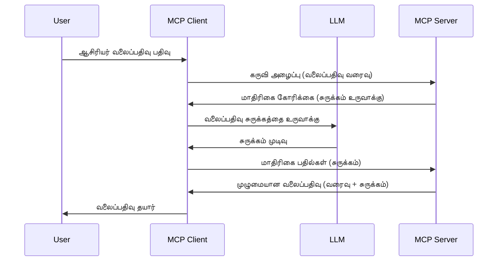

> [!WARNING]
> MCP `2026-07-28`-இல் சாம்பிளிங் பழையதாக கருதப்படுகிறது. இந்த பாடம்
> பழம்பெரும் அமலாக்கங்களுக்காக மட்டும் சேமிக்கப்பட்டுள்ளது. புதிய சர்வர்கள் நேரடியாக
> ஒரு LLM வழங்குநர் API உடன் ஒருங்கிணைக்க வேண்டும்.

# சாம்பிளிங் - பணிகளை கிளையன்ட்டிற்கு நியமித்தல்

> சாம்பிளிங் `2026-07-28` விவரக்குறிப்பில் பொருந்துதலுக்காக உள்ளது மற்றும்
> 2027 ஜூலை 28 அல்லது அதற்குப் பிறகு வெளியிடப்படும் முதல் திருத்தத்தில் அகற்றப்படலாம்.
> இந்த பாடத்தில் உள்ள எடுத்துக்காட்டுகள் `2025-11-25` ஐ செயல்படுத்தும் SDK APIகளைப் பயன்படுத்தலாம்.
> [MCP இல் என்ன மாற்றம்: 2026-07-28 விவரக்குறிப்பு](../../01-CoreConcepts/mcp-2026-07-28.md) ஐப் பார்க்கவும்.

பழைய செயல்பாடுகளில், சாம்பிளிங் MCP சர்வர் கிளையன்ட் நிர்வகிக்கும் ஒரு LLM-இல் இருந்து உதவியை கேட்கும் வசதியாக உள்ளது.
புதிய செயல்பாடுகளுக்கு நீங்கள் நேரடியாக தேர்ந்தெடுக்கப்பட்ட LLM வழங்குநரை அழைக்க வேண்டும்.


## வர்ணனை

இந்த பாடத்தில், எப்போது மற்றும் எங்கே சாம்பிளிங்கைப் பயன்படுத்த வேண்டும் என்பதை விளக்குவதில் கவனம் செலுத்துகிறோம் மற்றும் அதை எப்படி கட்டமைக்கவேண்டும் என்பதையும் பார்க்கிறோம்.

## கற்றல் நோக்கங்கள்

இந்த அத்தியாயத்தில், நாங்கள்:

- சாம்பிளிங் என்ன என்பதையும் எப்போது பயன்படுத்துவது என்பதையும் விளக்குவோம்.
- MCP இல் சாம்பிளிங்கை எப்படி கட்டமைப்பது எனக் காட்டுவோம்.
- சாம்பிளிங் செயல்பாட்டின் எடுத்துக்காட்டுகளை வழங்குவோம்.

## சாம்பிளிங் என்றால் என்ன மற்றும் இதனை ஏன் பயன்படுத்த வேண்டும்?

சாம்பிளிங் என்பது இந்த முறையில் வேலை செய்யும் முன்னேற்றப்பட்ட அம்சமாகும்:



### சாம்பிளிங் கோரிக்கை

சரி, இப்போதைக்கு நமக்கு ஒரு நம்பத்தகுந்த சூழல் பற்றிய பொது பார்வை உள்ளது, இப்போது சர்வர் கிளையன்ட்டிற்கு அனுப்பும் சாம்பிளிங் கோரிக்கையைப் பற்றி பேசுவோம். JSON-RPC வடிவில் அப்படியான கோரிக்கை இதுபோல இருக்கலாம்:

```json
{
  "jsonrpc": "2.0",
  "id": 1,
  "method": "sampling/createMessage",
  "params": {
    "messages": [
      {
        "role": "user",
        "content": {
          "type": "text",
          "text": "Create a blog post summary of the following blog post: <BLOG POST>"
        }
      }
    ],
    "modelPreferences": {
      "hints": [
        {
          "name": "claude-3-sonnet"
        }
      ],
      "intelligencePriority": 0.8,
      "speedPriority": 0.5
    },
    "systemPrompt": "You are a helpful assistant.",
    "maxTokens": 100
  }
}
```

இங்கு குறிப்பிடத்தக்க சில விஷயங்கள் உள்ளன:

- உள்ளடக்கத்தில் -> உரை கீழ் இருக்கும் Prompt என்பது LLM க்கு வழிகாட்டல் அளிப்பதற்கான எங்கள் உத்தரவான முன்மொழிவாகும்.

- **modelPreferences**. இந்த பகுதி ஒரு பரிந்துரையாகும், LLM உடன் எந்த கட்டமைப்பைப் பயன்படுத்த வேண்டும் என்ற பரிந்துரையை காட்டுகிறது. பயனர் இந்த பரிந்துரைகளை ஏற்று அல்லது மாற்றலாம். இக்காரணத்துக்காக பயன்படுத்த வேண்டிய மாடல், வேகம் மற்றும் அறிவு முன்னுரிமை குறித்த பரிந்துரைகள் உள்ளன.
- **systemPrompt**, இது உங்கள் LLM-க்கு தனிப்பட்ட தன்மையை அளிக்கும் சாதாரண அமைப்பு உத்தரவுகள் ஆகும்.
- **maxTokens**, இந்த பணிக்கான பரிந்துரைக்கப்பட்ட தொடர்களுக்கு எத்தனை டோக்கன்கள் பயன்படுத்தப்பட வேண்டும் என்பதைக் குறிக்கிறது.

### சாம்பிளிங் பதில்

இந்த பதில் MCP கிளையன்ட் MCP சர்வருக்கு மீண்டும் அனுப்பும் மற்றும் LLM அழைப்பதன் விளைவாக உள்ளது. JSON-RPC இல் இது இதைப் போன்றதாக இருக்கலாம்:

```json
{
  "jsonrpc": "2.0",
  "id": 1,
  "result": {
    "role": "assistant",
    "content": {
      "type": "text",
      "text": "Here's your abstract <ABSTRACT>"
    },
    "model": "gpt-5",
    "stopReason": "endTurn"
  }
}
```

பதில் எவ்வாறு கேட்டு இருந்த மாதிரியான வலைப்பதிவு சாராம்சமாக உள்ளது என்பதை கவனியுங்கள். மேலும் பயன்படுத்தப்பட்ட `model` எங்களை கேட்ட `model` இல்லை, அதாவது "gpt-5" "claude-3-sonnet"க்கு மேல் உள்ளது. இது பயனர் எதைப் பயன்படுத்துவது என்று தம் கருத்தை மாற்றலாம் என்ற அம்சத்தை விளக்குகிறது மற்றும் உங்கள் சாம்பிளிங் கோரிக்கை ஒரு பரிந்துரை மட்டுமே.

சரி, இப்போது நமக்கு முக்கிய வழிமுறை மற்றும் "வலைப்பதிவு உருவாக்கல் + சாராம்சம்" போன்ற பயனுள்ள பணிக்கான சாம்பிளிங் பயன்படுத்துவது எப்படி என்பதைப் புரிந்தோம், அதை செயல்படுத்த என்ன செய்வது என்று பார்ப்போம்.

### செய்தி வகைகள்

சாம்பிளிங் செய்திகள் மட்டுமே உரை வடிவில் மட்டுமல்ல, படங்கள் மற்றும் ஒலிகளும் அனுப்பலாம். JSON-RPC இல் இதுவென்று வேறுபடுகிறது:

**உரை**

```json
{
  "type": "text",
  "text": "The message content"
}
```

**பட உள்ளடக்கம்**


```json
{
  "type": "image",
  "data": "base64-encoded-image-data",
  "mimeType": "image/jpeg"
}
```

**ஆடியோ உள்ளடக்கம்**

```json
{
  "type": "audio",
  "data": "base64-encoded-audio-data",
  "mimeType": "audio/wav"
}
```

> குறிப்புகள்: தற்போதைய நிலை மற்றும் இடம்பெயர்ச்சி வழிகாட்டலுக்காக, பார்வையிடவும்
> [பழைய எடுத்துக்காட்டு ஆவணங்கள்](https://modelcontextprotocol.io/specification/2026-07-28/client/sampling).

## கிளையன்டில் எடுத்துக்காட்டு எப்படி அமைப்பது

> குறிப்பு: நீங்கள் ஒருங்கு மட்டுமே ஒரு சர்வரை உருவாக்குகிறீர்கள் என்றால், இங்கு அதிகமாக செய்ய தேவையில்லை.

ஒரு கிளையன்டில், நீங்கள் கீழ்காணும் அம்சத்தை இதுபோல குறிப்பிட வேண்டும்:

```json
{
  "capabilities": {
    "sampling": {}
  }
}
```

இதன் பிறகு உங்கள் தேர்ந்தெடுத்த கிளையன்ட் சர்வருடன் துவங்கும்போது இதை எடுத்துச் செல்லும்.

## எடுத்துக்காட்டில் எடுத்துக்காட்டு - ஒரு வலைப்பதிவு பதிவு உருவாக்கவும்

நாம் எடுத்துக்காட்டு சர்வரை ஒத்துழைத்து எழுதுவோம், நாம் பின்வருமாறு செய்ய வேண்டும்:

1. சர்வரில் ஒரு கருவியை உருவாக்கவும்.
1. அந்த கருவி ஒரு எடுத்துக்காட்டு கோரிக்கையை உருவாக்க வேண்டும்
1. கருவி கிளையன்டின் எடுத்துக்காட்டு கோரிக்கைக்கு பதில் வரும் வரை காத்திருக்க வேண்டும்.
1. பிறகு கருவி முடிவை உருவாக்க வேண்டும்.

நாம் படி படியாகக் கோடை பார்க்கலாம்:

### -1- கருவியை உருவாக்கவும்

**python**

```python
@mcp.tool()
async def create_blog(title: str, content: str, ctx: Context[ServerSession, None]) -> str:
    """Create a blog post and generate a summary"""

```

### -2- எடுத்துக்காட்டு கோரிக்கையை உருவாக்கவும்

உங்கள் கருவியை கீழ்காணும் கோடுடன் விரித்துக்கொள்ளவும்:

**python**

```python
post = BlogPost(
        id=len(posts) + 1,
        title=title,
        content=content,
        abstract=""
    )

prompt = f"Create an abstract of the following blog post: title: {title} and draft: {content} "

result = await ctx.session.create_message(
        messages=[
            SamplingMessage(
                role="user",
                content=TextContent(type="text", text=prompt),
            )
        ],
        max_tokens=100,
)

```

### -3- பதிலை காத்திருந்து பதிலை திருப்பவும்

**python**

```python
post.abstract = result.content.text

posts.append(post)

# முழு தயாரிப்பை திருப்பி அளிக்கவும்
return json.dumps({
    "id": post.title,
    "abstract": post.abstract
})
```

### -4- முழு கோடு

**python**

```python
from starlette.applications import Starlette
from starlette.routing import Mount, Host

from mcp.server.fastmcp import Context, FastMCP

from mcp.server.session import ServerSession
from mcp.types import SamplingMessage, TextContent

import json


from uuid import uuid4
from typing import List
from pydantic import BaseModel


mcp = FastMCP("Blog post generator")

# app = FastAPI()

posts = []

class BlogPost(BaseModel):
    id: int
    title: str
    content: str
    abstract: str

posts: List[BlogPost] = []

@mcp.tool()
async def create_blog(title: str, content: str, ctx: Context[ServerSession, None]) -> str:
    """Create a blog post and generate a summary"""

    post = BlogPost(
        id=len(posts) + 1,
        title=title,
        content=content,
        abstract=""
    )

    prompt = f"Create an abstract of the following blog post: title: {title} and draft: {content} "

    result = await ctx.session.create_message(
        messages=[
            SamplingMessage(
                role="user",
                content=TextContent(type="text", text=prompt),
            )
        ],
        max_tokens=100,
    )

    post.abstract = result.content.text

    posts.append(post)

    # முழு வலைப்பதிவு பதிவை திருப்பவும்
    return json.dumps({
        "id": post.title,
        "abstract": post.abstract
    })

if __name__ == "__main__":
    print("Starting server...")
    # mcp.run()
    mcp.run(transport="streamable-http")

# பயன்பாட்டை இயக்கவும்: python server.py
```

### -5- Visual Studio Code இல் பரிசோதனை செய்வது

இதனை Visual Studio Code இல் சோதிக்க பின்வருமாறு செய்யவும்:

1. டெர்மினலில் சர்வரை துவங்கவும்
1. அதை *mcp.json* இல் சேர்க்கவும் (மற்றும் துவங்கியுள்ளதா என உறுதி செய்யவும்) உதாரணமாக இதுபோல:

   ```json
   "servers": {
      "blog-server": {
        "type": "http",
        "url": "http://localhost:8000/mcp"
      }
   }
   ```

1. ஒரு தூண்டும் சொல் (prompt) டைப் செய்யவும்:

   ```text
   create a blog post named "Where Python comes from", the content is "Python is actually named after Monty Python Flying Circus"
   ```

1. எடுத்துக்காட்டு நிகழ்வதற்கு அனுமதியிடவும். முதலில் நீங்கள் இதை சோதிக்கும்போது கூடுதல் உரையாடல் வரும் அதை ஏற்க வேண்டும், பின்னர் உங்களுக்கு கருவியை இயக்குமாறு கேட்கும் சாதாரண உரையாடலை காண்பீர்கள்

1. முடிவுகளை ஆய்வு செய்யவும். முடிவுகள் GitHub Copilot Chat இல் நன்றாக காட்சியளிக்கப்படும், மேலும் நீங்கள் அசல் JSON பதிலை ஆய்வு செய்யலாம்.

**போனஸ்**. Visual Studio Code கருவிகள் எடுத்துக்காட்டு வழங்குவதில் சிறந்த ஆதரவு உள்ளது. நீங்கள் நிறுவிய சர்வரில் எடுத்துக்காட்டு அணுகலை இதுபோல அமைக்கலாம்:

1. விரிவாக்க பகுதியை திறக்கவும்.
1. "MCP SERVERS - INSTALLED" பகுதியில் உங்கள் நிறுவிய சர்வருக்கான சக்கரை ஐகானை தேர்வு செய்யவும்.
1. "கான்பிகர் மாடல் அணுகல்" ஐத் தேர்ந்தெடுக்கவும், இங்கே GitHub Copilot எடுத்துக்காட்டை செய்யும்போது பயன்படுத்த அனுமதிக்கப்படும் மாடல்களை தேர்வு செய்யலாம். சமீபத்தில் நடந்த அனைத்து எடுத்துக்காட்டு கோரிக்கைகளையும் "எடுத்துக்காட்டு கோரிக்கைகள் காண்பி" என தேர்வு செய்து பார்க்கலாம்.

## பணியை ஒப்படைப்பு

இந்த பணியில், நீங்கள் சிறிது வேறுபட்ட எடுத்துக்காட்டை உருவாக்குவீர்கள், அதாவது ஒரு எடுத்துக்காட்டு ஒருங்கிணைப்பை உருவாக்குவது, இது ஒரு தயாரிப்பு விளக்கத்தை உருவாக்க உதவும். உங்கள் சூழல் இதைவாறு உள்ளது:

**சூழல்**: ஒரு மின்னணு வர்த்தக நிறுவனத்தின் பின்புற அலுவலர் உதவி பெற விரும்புகிறார், தயாரிப்பு விளக்கங்களை உருவாக்க அதிக நேரம் எடுத்துக்கொள்கிறார். ஆகவே, நீங்கள் "create_product" என்ற கருவியை "title" மற்றும் "keywords" என்ற வாதங்களுடன் அழைக்கின்ற ஒரு தீர்வை உருவாக்க வேண்டும், இது ஒரு கிளையன்டின் LLM மூலம் நிரப்பப்பட வேண்டிய "description" புலத்துடன் கூடிய முழுமையான தயாரிப்பை வழங்க வேண்டும்.

குறிப்பு: இதுவரை கற்றுக் கொண்டதை பயன்படுத்தி இந்த சர்வரை மற்றும் அதன் கருவியை எடுத்துக்காட்டு கோரிக்கையை பயன்படுத்தி அமைக்கவும்.

## தீர்வு

[தீர்வு](./solution/README.md)

## முக்கிய எடுத்துக்கொள்ள வேண்டிய விஷயங்கள்


சாம்பிளிங் என்பது ஒரு சக்திவாய்ந்த அம்சமாகும், இது சர்வர் LLM இன் உதவியைத் தேடும் போது பணிகளை கிளையண்டுக்கு ஒப்படைக்க அனுமதிக்கிறது.

## அடுத்தது என்ன

- [அத்தியாயம் 4 - நடைமுறை நடைமுறைப்படுத்தல்](../../04-PracticalImplementation/README.md)

---

<!-- CO-OP TRANSLATOR DISCLAIMER START -->
**மறுப்பு**:
இந்த ஆவணம் AI மொழிபெயர்ப்பு சேவை [Co-op Translator](https://github.com/Azure/co-op-translator) பயன்படுத்தி மொழிபெயர்க்கப்பட்டுள்ளது. நாங்கள் துல்லியத்திற்காக முயற்சி செய்துள்ளோம், ஆனால் தானாக செய்யப்படும் மொழிபெயர்ப்புகளில் பிழைகள் அல்லது தவறுகள் இருக்கலாம் என்பதை கவனத்தில் கொள்ளவும். அசல் ஆவணம் அதன் தாய்மொழியில் அதிகாரப்பூர்வ ஆதாரமாக கருதப்பட வேண்டும். முக்கியமான தகவல்களுக்கு, தொழில்நுட்பமான மனித மொழிபெயர்ப்பு பரிந்துரைக்கப்படுகிறது. இந்த மொழிபெயர்ப்பைப் பயன்படுத்துவதால் ஏற்படும் எந்த தவறான புரிதல்கள் அல்லது தவறான விளக்கத்திற்கும் நாங்கள் பொறுப்பில்வில்லை.
<!-- CO-OP TRANSLATOR DISCLAIMER END -->