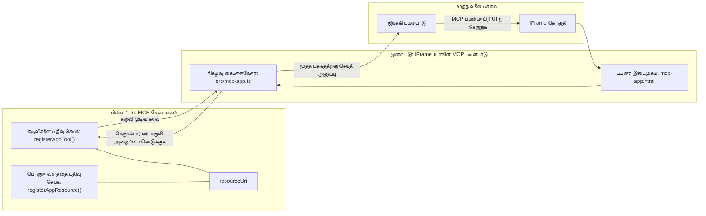
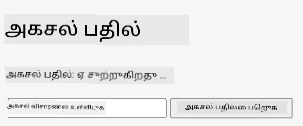
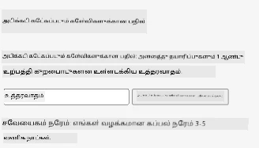
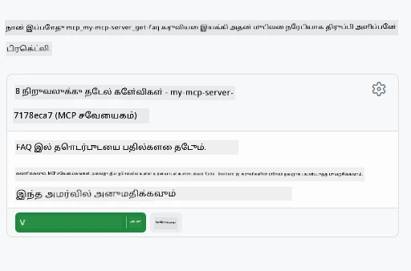

# MCP பயன்பாடுகள்

MCP பயன்பாடுகள் MCP இல் புதிய நடைமுறை ஆகும். கருத்து என்னவென்றால், ஒரு கருவி அழைப்பில் இருந்து தரவை மட்டுமல்ல, அந்த தகவலுடன் எவ்வாறு தொடர்பு கொள்வதைக் குறித்த தகவலையும் வழங்க வேண்டும். அதாவது கருவி முடிவுகள் இப்போது UI தகவலை கொண்டிருக்க முடியும். அப்படி ஏன் வேண்டும்? இன்று நீங்கள் செய்வது எப்படி என்று பரிசீலனை செய்யுங்கள். நீங்கள் பெரும்பாலும் MCP சர்வரின் முடிவுகளை ஒருவித முன்னணி பகுதியை அதன் முன்னிலையில் வைக்கிறது, அதுவே நீங்கள் எழுதவேண்டிய மற்றும் பராமரிக்க வேண்டிய குறியீடு. சில சமயங்களில் அது தேவையானதாயிருக்கலாம், ஆனால் சில சமயங்களில், தரவிலும் பயனர் இடைமுகத்திலும் அனைத்தையும் உட்படுத்திய ஒரு சுயம்பொறுப்பான தகவல்பிரிவை நீங்கள் கொண்டு வர முடியுமானால் சிறந்தது.

## அவலோகம்

இந்த பாடம் MCP பயன்பாடுகள் குறித்த நடைமுறை வழிகாட்டுதலை வழங்குகிறது, அதை எப்படி தொடங்குவது மற்றும் உங்கள் உள்ளமைவுள்ள வலை பயன்பாடுகளுடன் அதை எப்படி ஒருங்கிணைக்க வேண்டும் என்பதைக் குறிக்கிறது. MCP பயன்பாடுகள் MCP தரநிலைக்கு ஒரு புதிய சேர்க்கையாகும்.

## கற்றல் நோக்கங்கள்

இந்த பாடத்தின் முடிவில், நீங்கள் திறக்க முடியும்:

- MCP பயன்பாடுகள் என்னவென்பதை விளக்கவும்.
- MCP பயன்பாடுகளை எப்போது பயன்படுத்துவது.
- உங்கள் சொந்த MCP பயன்பாடுகளை உருவாக்கி ஒருங்கிணைக்கவும்.

## MCP பயன்பாடுகள் - அது எவ்வாறு செயல்படும்

MCP பயன்பாடுகளுடன் உள்ள கருத்து என்றால், பதில் ஒரு கூறை வடிவில் வழங்குவது ஆகும். அப்படியொரு கூறு பார்வை மற்றும் தொடர்புப்படுத்தலை கொண்டிருக்கலாம், உதாரணமாக பொத்தான் கிளிக், பயனர் உள்ளீடு மற்றும் மேலும். முதலில் சர்வர் பக்கம் மற்றும் எங்கள் MCP சர்வரைப் பற்றி பார்க்கலாம். MCP பயன்பாட்டு கூறு உருவாக்க, ஒரு கருவியை உருவாக்க வேண்டும் மற்றும் செயலி வளம் தேவை. இவற்றை இரண்டு பாதிகளும் resourceUri மூலம் இணைக்கப்படுகின்றன.

இதோ ஒரு உதாரணம். இதில் எங்கே என்ன செய்கிறது என்பதைக் காண முயலலாம்:

```text
server.ts -- responsible for registering tools and the component as a UI component
src/
  mcp-app.ts -- wiring up event handlers
mcp-app.html -- the user interface
```

இந்த பார்வை ஒரு கூறு உருவாக்கும் கட்டமைப்பையும் அதன் தந்திரசார்ந்த செயல்பாடுகளையும் விளக்குகிறது.


பின்னர் பின்புறம் மற்றும் முன்னணி பகுதிகள் எதைச் செய்ய வேண்டும் என்பதை விளக்க முயலலாம்.

### பின்புறம்

இங்கே நாம் இரண்டு காரியங்களை செய்ய வேண்டும்:

- தொடர்பு கொள்ள வேண்டிய கருவிகளை பதிவு செய்யும்.
- கூறினைப் பரிந்துரைக்கும்.

**கருவியை பதிவு செய்தல்**

```typescript
registerAppTool(
    server,
    "get-time",
    {
      title: "Get Time",
      description: "Returns the current server time.",
      inputSchema: {},
      _meta: { ui: { resourceUri } }, // இந்த கருவியை அதன் UI வளத்துடன் இணைக்கிறது
    },
    async () => {
      const time = new Date().toISOString();
      return { content: [{ type: "text", text: time }] };
    },
  );

```

முந்தைய குறியீடு `get-time` என்ற கருவியை வெளிப்படுத்துகிறது. இது எந்த உள்ளீடுகளையும் எடுக்காது ஆனால் தற்போதைய நேரத்தை வழங்குகிறது. பயனர் உள்ளீட்டை ஏற்றுக்கொள்ள வேண்டிய கருவிகளுக்காக `inputSchema` ஐ வரையறுக்கும்தான்.

**குறியீட்டை பதிவு செய்தல்**

அதே கோப்பில் கூறினைப் பதிவு செய்ய வேண்டும்:

```typescript
const resourceUri = "ui://get-time/mcp-app.html";

// UI க்கான தொகுக்கப்பட்ட HTML/JavaScript ஐ_Return செய்கின்ற sumber ஐ பதிவுசெய்யவும்.
registerAppResource(
  server,
  resourceUri,
  resourceUri,
  { mimeType: RESOURCE_MIME_TYPE },
  async () => {
    const html = await fs.readFile(path.join(DIST_DIR, "mcp-app.html"), "utf-8");

    return {
    contents: [
        { uri: resourceUri, mimeType: RESOURCE_MIME_TYPE, text: html },
    ],
    };
  },
);
```

இந்த இடத்தில் கூறுமாறு, கூறு மற்றும் அதன் கருவிகளை இணைக்கும் `resourceUri` குறிப்பிடப்படுகிறது. முக்கியமாக UI கோப்பை ஏற்றும் மற்றும் கூறினை திருப்பிச் செலுத்தும் கூப்பல் உள்ளது.

### கூறு முன்புறம்

பின்புறப்போல, இங்கே இரண்டு பாகங்கள் உள்ளன:

- சுத்தமான HTML இல் எழுதப்பட்ட முன்னணி.
- நிகழ்வுகளை கையாளும் மற்றும் என்ன செய்வது என்பதை நிரல், உதாரணமாக கருவிகளை அழைக்க அல்லது பெற்றோர் ஜன்னல் உடன் செய்தி பரிமாற்றம்.

**பயனர் இடைமுகம்**

பயனர் இடைமுகத்தை பார்ப்போம்.

```html
<!-- mcp-app.html -->
<!DOCTYPE html>
<html lang="en">
  <head>
    <meta charset="UTF-8" />
    <title>Get Time App</title>
  </head>
  <body>
    <p>
      <strong>Server Time:</strong> <code id="server-time">Loading...</code>
    </p>
    <button id="get-time-btn">Get Server Time</button>
    <script type="module" src="/src/mcp-app.ts"></script>
  </body>
</html>
```

**நிகழ்வுப் பிணைக்கல்**

இறுதி பகுதி நிகழ்வுப் பிணைக்கல் ஆகும். அதன் பொருள், UI இல் எந்த பாகத்தில் நிகழ்வு கைப்பற்றிகள் தேவை என்பதையும், நிகழ்வுகள் எழுப்பப்படும்போது என்ன செய்ய வேண்டும் என்பதையும் கண்டறிதல்:

```typescript
// mcp-app.ts

import { App } from "@modelcontextprotocol/ext-apps";

// உருப்படி குறிப்புகளை பெறுக
const serverTimeEl = document.getElementById("server-time")!;
const getTimeBtn = document.getElementById("get-time-btn")!;

// செயலியை உருவாக்குக
const app = new App({ name: "Get Time App", version: "1.0.0" });

// சர்வரிடமிருந்து கருவி முடிவுகளை கையாள்க. ஆரம்ப கருவி முடிவை இழக்காமல் `app.connect()` முன் அமைக்கவும்
// ஆரம்ப கருவி முடிவை இழக்கும் என்பத vermijdenவும்
app.ontoolresult = (result) => {
  const time = result.content?.find((c) => c.type === "text")?.text;
  serverTimeEl.textContent = time ?? "[ERROR]";
};

// பொத்தானை கிளிக் செய்தல் இணைக்கவும்
getTimeBtn.addEventListener("click", async () => {
  // `app.callServerTool()` UIக்கு சர்வரிலிருந்து புதிய தரவுகளை கோர அனுமதிக்கிறது
  const result = await app.callServerTool({ name: "get-time", arguments: {} });
  const time = result.content?.find((c) => c.type === "text")?.text;
  serverTimeEl.textContent = time ?? "[ERROR]";
});

// ஐராக்கி உடன் இணைக்கவும்
app.connect();
```

மேலே காணப்படும் படி, இது DOM பகுதிகளை நிகழ்வுகளுக்கு இணைக்கும் சாதாரண நிரல். `callServerTool` என்ற அழைப்பு பின்புறத்தில் கருவියைக் கூப்பிடும்.

## பயனர் உள்ளீட்டுடன் கையாளல்

இதுவரை, கிளிக் செய்யும் பொத்தான் உண்டு, அது கருவியைக் கூப்பிடும் கூறு பார்த்தோம். இன்னும் UI கூறுகளை, மாதிரியாக உள்ளீடு புலம் சேர்த்து, கருவிக்கு_arguments_ அனுப்ப நமக்கு வலுவுண்டா என்று பார்க்கலாம். ஒரு FAQ செயல்பாட்டை செயல்படுத்துவோம். இது எவ்வாறு செயல்படும்:

- ஒரு பொத்தானும் உள்ளீட்டு உருப்படியும் இருக்கும், பயனர் தேட வேண்டிய முக்கிய வார்த்தையை, உதாரணமாக "Shipping" தட்டச்சு செய்ய வேண்டும். இது பின்புற கருவியின் FAQ தரவுக்குள் தேடல் செய்யும்.
- மேற்கூறிய FAQ தேடலை ஆதரிக்கும் கருவி.

முதலில் பின்புறத்தில் இன்னும் ஆதரவைச் சேர்க்கலாம்:

```typescript
const faq: { [key: string]: string } = {
    "shipping": "Our standard shipping time is 3-5 business days.",
    "return policy": "You can return any item within 30 days of purchase.",
    "warranty": "All products come with a 1-year warranty covering manufacturing defects.",
  }

registerAppTool(
    server,
    "get-faq",
    {
      title: "Search FAQ",
      description: "Searches the FAQ for relevant answers.",
      inputSchema: zod.object({
        query: zod.string().default("shipping"),
      }),
      _meta: { ui: { resourceUri: faqResourceUri } }, // இந்த கருவியை அதன் UI வளத்துடன் இணைக்கிறது
    },
    async ({ query }) => {
      const answer: string = faq[query.toLowerCase()] || "Sorry, I don't have an answer for that.";
      return { content: [{ type: "text", text: answer }] };
    },
  );
```

இங்கு `inputSchema` எப்படி நிரப்பப்படுகிறது, அதற்கு `zod` விதிமுறையைப்போல் தரப்படும்:

```typescript
inputSchema: zod.object({
  query: zod.string().default("shipping"),
})
```

மேல்க்காணும் விதிமுறையில் `query` என்ற உள்ளீடு அளவையொன்றை நிரூபிக்கிறோம் அது விருப்பமானது மற்றும்இயல்பான மதிப்பு "shipping" என்று உள்ளது.

சரி, இதில் தேவையான UI உருவாக்க *mcp-app.html* பக்கம் பார்ப்போம்:

```html
<div class="faq">
    <h1>FAQ response</h1>
    <p>FAQ Response: <code id="faq-response">Loading...</code></p>
    <input type="text" id="faq-query" placeholder="Enter FAQ query" />
    <button id="get-faq-btn">Get FAQ Response</button>
  </div>
```

சிறப்பாக, இப்போது உள்ளீடு உருப்படி மற்றும் பொத்தான் உள்ளது. அடுத்து *mcp-app.ts* பக்கத்திற்கு, இதை நிகழ்வுகளுடன் இணைக்கலாம்:

```typescript
const getFaqBtn = document.getElementById("get-faq-btn")!;
const faqQueryInput = document.getElementById("faq-query") as HTMLInputElement;

getFaqBtn.addEventListener("click", async () => {
  const query = faqQueryInput.value;
  const result = await app.callServerTool({ name: "get-faq", arguments: { query } });
  const faq = result.content?.find((c) => c.type === "text")?.text;
  faqResponseEl.textContent = faq ?? "[ERROR]";
});
```

மேலுள்ள குறியீட்டில்:

- UI உள்ள இடங்களுக்கான குறிப்புகளை உருவாக்குகிறோம்.
- பொத்தான் கிளிக்கில் உள்ளீடு மதிப்பை பிரித்து `app.callServerTool()` அழைக்கிறோம், இதில் `name` மற்றும் `arguments` வழங்கப்படுகின்றன, அதில் `query` மதிப்பாக அனுப்பப்படுகிறது.

உண்மையில் `callServerTool` அழைக்கும்போது, அது பெற்றோர் ஜன்னலுக்கு செய்தி அனுப்புகிறது, அதன் பிறகு MCP சர்வரை அழைக்கிறது.

### முயற்சி செய்யவும்

இதைக் முயற்சி செய்தால் பின்வரும் பார்வை காணப்படும்:



மேலும், "warranty" போன்ற உள்ளீடு இலுள்ள போது:



இந்தக் குறியீட்டை இயக்க, [குறியீடு பகுதி](./code/README.md) இற்கு செல்லவும்

## Visual Studio Code இல் சோதனை

Visual Studio Code MVP பயன்பாடுகளுக்கான சிறந்த ஆதரவை வழங்குகிறது மற்றும் உங்கள் MCP பயன்பாடுகளை சோதிப்பதற்கான எளிய வழிகளில் ஒன்றாகும். Visual Studio Code பயன்படுத்த, *mcp.json* இல் ஒரு சர்வர் பதிவை இதுபோல் சேர்:

```json
"my-mcp-server-7178eca7": {
    "url": "http://localhost:3001/mcp",
    "type": "http"
  }
```

பிறகு சர்வரைத் தொடங்கவும், நீங்கள் Chat Window மூலம் உங்களை MCP பயன்பாட்டுடன் தொடர்பு கொள்வதற்கான சாத்தியமும் GitHub Copilot நிறுவியிருந்தால் இருக்கும்.

உதாரணமாக "#get-faq" உள்ளிடல் மூலம் இயக்கவும்:



வலை உலாவியில் இயக்கியதுபோல் இதுவும் அதே போல் தோற்றுவிக்கிறது:


## பணியமைப்பு

ஒரு ராக் பேப்பர் சிசர் விளையாட்டை உருவாக்கவும். அதில் பின்வரும் அம்சங்கள் இருக்க வேண்டும்:

UI:

- தேர்வுகளை கொண்ட ஒரு டிராப்-டை list
- ஒரு தேர்வை சமர்ப்பிக்க பொத்தான்
- யார் எதைத் தேர்ந்தெடுத்தார் மற்றும் யார் ஜெயித்தார் என்பதைக் காட்டும் ஒரு லேபிள்

சர்வர்:

- "choice" என்ற உள்ளீடு கொண்ட ராக் பேப்பர் சிசர் கருவி இருக்க வேண்டும். அது ஒரு கணினி தேர்வையும் படைக்களிக்கவும் மற்றும் வெற்றியாளரை தீர்மானிக்கவும் வேண்டும்.

## தீர்வு

[தீர்வு](./assignment/README.md)

## சுருக்கம்

இந்த புதிய நடைமுறை MCP பயன்பாடுகள் பற்றி நாம் கற்றோம். இது MCP சர்வர்கள் தரவை மட்டுமல்ல, அந்த தரவை எப்படி வழங்க வேண்டும் என்பதையும் கருத்து கொண்டு செயல்பட அனுமதிக்கும் புதிய நடைமுறை ஆகும்.

மேலும், இந்த MCP பயன்பாடுகள் IFrame இல் நடத்தப்படுகின்றன மற்றும் MCP சர்வர்களுடன் தொடர்பு கொள்ள பெற்றோர் வலை பயன்பாட்டுக்கு செய்திகளை அனுப்ப வேண்டும். புதிதாக பிளெயின் ஜாவாஸ்கிரிப்ட், React மற்றும் பிறம் பல நூலகங்கள் இந்த தொடர்பை எளிமையாக்குகின்றன.

## முக்கியக் குறிப்புகள்

நீங்கள் கற்றுக்கொண்டவை இங்கே:

- MCP பயன்பாடுகள் தரவும் UI அம்சங்களையும் கப்புதல் செய்ய உதவும் புதிய தரநிலை.
- இந்த வகை பயன்பாடுகள் பாதுகாப்புக்காக IFrame இல் இயங்குகின்றன.

## அடுத்தது என்ன

- [அத்தியாயம் 4](../../04-PracticalImplementation/README.md)

---

<!-- CO-OP TRANSLATOR DISCLAIMER START -->
**உறுதியான குறிப்பு**:  
இந்த ஆவணம் [Co-op Translator](https://github.com/Azure/co-op-translator) என்ற AI மொழி பெயர்ப்பு சேவையை பயன்படுத்தி மொழிபெயர்க்கப்பட்டது. துல்லியத்திற்காக நாம் முயல்வினும், தானியங்கி மொழிபெயர்ப்புகளில் பிழைகள் அல்லது தவறான தகவல்கள் இருக்கக்கூடும். எப்போதும் அசல் ஆவணம் அதன் சொந்த மொழியிலேயே அதிகாரப்பூர்வ ஆதாரமாக கருதப்பட வேண்டும். முக்கியமான தகவல்களுக்கு, தொழில்முறை மனித மொழிபெயர்ப்பாளரின் உதவியைப் பெற பரிந்துரைக்கப்படுகிறது. இந்த மொழிபெயர்ப்பின் பயன்பாட்டினால் ஏற்படும் ஏதேனும் தவறான புரிதல்கள் அல்லது தவறான விளக்கங்களுக்கு நாங்கள் பொறுப்பாக இருக்க மாட்டோம்.
<!-- CO-OP TRANSLATOR DISCLAIMER END -->