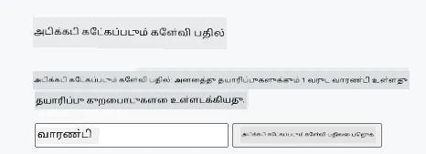
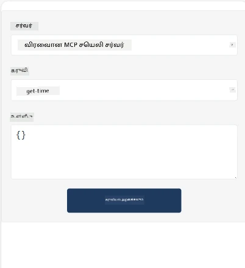
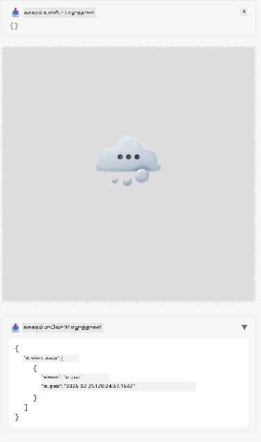

இந்தியும்செயலி MCP அப்ளிகேஷனின் ஒரு மாதிரியை காட்டுகிறது

## நிறுவு 

1. *mcp-app* கோப்பகத்திற்கு செல்லவும்
1. `npm install` இயக்கவும், இது முன் முனையம் மற்றும் பின்புற சார்ந்தவை நிறுவ வேண்டும்

பின்புறம் சரியாக தொகுக்கப்பட்டதா என சரிபார்க்க:

```sh
npx tsc --noEmit
```

எல்லாமே சரியானால் எந்தவொரு வெளியீடும் இருக்கக்கூடாது.

## பின்புறம் இயக்கவும்

> நீங்கள் Windows இயந்திரத்தில் இருந்தால் இதற்கு சிறிது கூடுதல் வேலை செய்ய வேண்டும், ஏனெனில் MCP செயலிகள் தீர்வு `concurrently` நூலகத்தை பயன்படுத்துகிறது, அதை இயக்க நீங்கள் மாற்று ஒன்றை தேட வேண்டும். MCP செயலியின் *package.json* இல் குற்றம்சாட்டப்பட்ட வரி இதோ:

    ```json
    "start": "concurrently \"cross-env NODE_ENV=development INPUT=mcp-app.html vite build --watch\" \"tsx watch main.ts\""
    ```

இந்த செயலியில் இரண்டு பகுதிகள் உள்ளன, பின்புற பகுதி மற்றும் ஹோสต์ பகுதி.

பின்புறத்தை இதைப் போன்று ஆரம்பிக்கவும்:

```sh
npm start
```

இது பின்புறத்தை `http://localhost:3001/mcp` இல் துவக்க வேண்டும்.

> கவனிக்கவும், நீங்கள் Codespace இல் இருந்தால், போர்ட்டு பாட்டியறத்தை பொது செய்து கொள்ள வேண்டும். உலாவியில் https://<Codespace பெயர்>.app.github.dev/mcp என்ற முகவரியில் நீங்கள் முடிவுக்குக் குவியலாம் என்பதை சரிபார்க்கவும்.

## தேர்வு -1 Visual Studio Code இல் செயலியை சோதிக்கவும்

Visual Studio Code இல் தீர்வை சோதிக்க, கீழ்காணும் படி செய்க:

- `mcp.json` இல் ஒரு சர்வர் நுழைவைச் சேர்க்கவும்:

    ```json
    {
        "servers": {
            "my-mcp-server-7178eca7": {
                "url": "http://localhost:3001/mcp",
                "type": "http"
            }
        },
        "inputs": []
    }
    ```

1. *mcp.json* இல் "start" பட்டனை கிளிக் செய்யவும்
1. ஒரு மொழிபெயர்ப்பு செயற்கை சாளரத்தை திறந்து `get-faq` என்று தட்டச்சு செய்யவும், இதுபோன்ற முடிவு காணப்பட வேண்டும்:

    

## தேர்வு -2- ஒரு ஹோஸ்ட் மூலம் செயலியை சோதிக்கவும்

பதிவேடு <https://github.com/modelcontextprotocol/ext-apps> பல்வேறு ஹோஸ்ட்களை வழங்குகிறது, அவற்றை உங்கள் MVP செயலிகளை சோதிக்க பயன்படுத்தலாம்.

இங்கு இரண்டு விருப்பங்களை வழங்குகிறோம்:

### உள்ளூர் இயந்திரம்

- நீங்கள் பதிவேட்டை கிளோன் செய்த பிறகு *ext-apps* இலേക്ക് செல்லவும்.

- சார்ந்தவை நிறுவவும்

   ```sh
   npm install
   ```

- வேறு ஒரு டெர்மினல் விண்டோவில், *ext-apps/examples/basic-host* என்ற கோப்பகத்திற்கு செல்லவும்

    > நீங்கள் Codespace பயன்படுத்தினால், serve.ts இல் 27வது வரிக்கு சென்று http://localhost:3001/mcp என்பதை உங்கள் Codespace backend URL ஆக மாற்ற வேண்டும் உதாரணமாக https://psychic-xylophone-657rpjgvxpc5g64-3001.app.github.dev/mcp

- ஹோஸ்டை இயக்கவும்:

    ```sh
    npm start
    ```

    இதனால் ஹோஸ்டும் பின்புறமும் இணைந்துவிடும் மற்றும் செயலி அதைப் போன்றா் ஓடுகிறது குறிப்பிடப்படும்குறிப்பை நீங்கள் காணலாம்:

    

### Codespace

Codespace சுற்றுப்புறத்தை இயக்க சிறிது கூடுதல் வேலை தேவைப்படுகிறது. Codespace மூலம் ஹோஸ்டை பயன்படுத்த:

- *ext-apps* அடைவைப்பார்க்கவும் *examples/basic-host* இல் செல்லவும்.
- சார்ந்தவை நிறுவ `npm install` இயக்கு
- ஹோஸ்டை துவக்க `npm start` இயக்கு

## செயலியை சோதிக்கவும்

செயலியை பின்வரும் முறையில் முயற்சிக்கவும்:

- "Call Tool" பட்டனைத் தேர்ந்தெடுக்கவும், மற்றும் இதுபோன்ற முடிவுகளை காணலாம்:

    

சிறந்தது, எல்லாம் சரியாக இயங்குகிறது.

---

<!-- CO-OP TRANSLATOR DISCLAIMER START -->
**மறுப்புரை**:  
இந்த ஆவணம் AI மொழிபெயர்ப்பு சேவை [Co-op Translator](https://github.com/Azure/co-op-translator) பயன்படுத்தி மொழிபெயர்க்கப்பட்டது. நாங்கள் துல்லியத்திற்காக முயலினாலும், தானாகச் செய்யப்பட்ட மொழிபெயர்ப்புகளில் பிழைகள் அல்லது தவறுகள் இருக்கக்கூடும் என்பதை தயவுசெய்து கவனத்தில் கொள்ளவும். அசல் ஆவணம் அதன் தாய்மொழியில் அதிகாரபூர்வ மூலமாக கருதப்பட வேண்டும். முக்கியமான தகவல்களுக்கு, தொழில்முறை மனித மொழிபெயர்ப்பை பரிந்துரைக்கிறோம். இந்த மொழிபெயர்ப்பின் பயன்பாட்டில் ஏற்படும் எந்த தவறான புரிதல்களுக்கும் அல்லது தவறான பொருள்படுத்தல்களுக்கும் நாங்கள் பொறுப்பு ஏற்கவில்லை.
<!-- CO-OP TRANSLATOR DISCLAIMER END -->