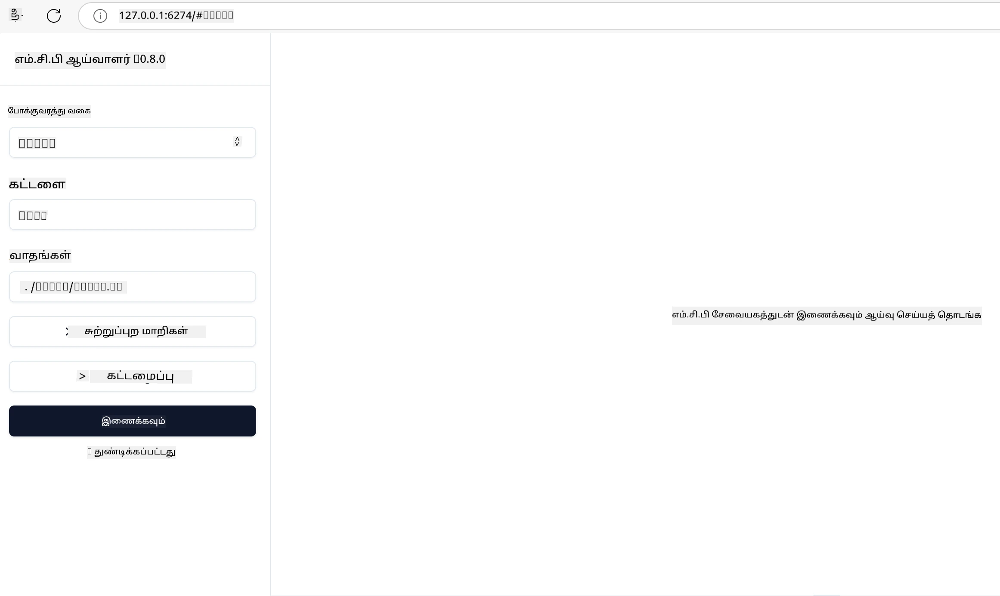

# நடைமுறை செயல்பாடு

[](https://youtu.be/vCN9-mKBDfQ)

_(இந்த பாடத்தின் வீடியோவை காண மேலே உள்ள படத்தை கிளிக் செய்யவும்)_

நடைமுறை செயல்பாடு என்பது Model Context Protocol (MCP) இன் சக்தி கண்ணிடுக்கக்கூடிய இடமாகும். MCP உடன் தொடர்புடைய கோட்பாடு மற்றும் கட்டமைப்பை புரிந்துகொள்வது முக்கியமானதுதான், ஆனால் உண்மையான மதிப்பு வழிகளைக் கொண்டு மிகச்சரியான கவனத்துடன் உருவாக்க, சோதனை செய்ய மற்றும் பயன்படுத்தும் போது வெளிப்படுகிறது. இந்த அத்தியாயம் யோசனை அறிவுக்கும் நேரடி வளர்ச்சிக்குமான இடைவெளியைக் குறைக்கிறது மற்றும் MCP அடிப்படையிலான பயன்பாடுகளை வாழ்வில் கொண்டு வர முறைபடியாக வழிகாட்டுகிறது.

நீங்கள் புத்திசாலி உதவியாளர்களை உருவாக்கவிருந்தாலோ, வணிக பண்பாட்டில் செயற்கை நுட்பத்தை ஒருங்கிணைக்கவிருந்தாலோ அல்லது தரவு செயலாக்கத்திற்கான தனிப்பயன் கருவிகளை கட்டமைக்கவிருந்தாலோ, MCP ஒரு பலவகை அடிப்படையை வழங்குகிறது. அதன் மொழியையும் சாரா வடிவமைப்பு மற்றும் பிரபலமான நிரலாக்க மொழிகளுக்கான அதிகாரப்பூர்வ SDKகள் அதை பரத்த வகையான வளர்ச்சியாளர்களுக்கு எளிதில் அணுகக்கூடியது ஆகும். இந்த SDKகளை பயன்படுத்தி, நீங்கள் விரைவாக வடிவமைக்க, திருத்து வகுவிக்க மற்றும் உங்கள் தீர்வுகளை வெவ்வேறு தளங்கள் மற்றும் சூழல்களில் விரிவாக்கக்கூடும்.

அடுத்த பகுதியில், MCP ஐ C#, Java with Spring, TypeScript, JavaScript மற்றும் Python ஆகியவை மூலம் செயல்படுத்த எப்படி செய்வது, சோதனை செய்யும் முறை, சேவையை வலை மேகத்தில் மேம்படுத்த Azure பயன்படுத்துவது போன்ற நடைமுறை உதாரணங்கள், மாதிரிக் குறியீடுகள் மற்றும் பயன்பாட்டு நெறிமுறைகள் காணலாம். இந்த நேரடி உதவிகள் உங்கள் கற்றலை வேகம் படுத்தி வலுவான, தயாரிப்புக்கான MCP பயன்பாடுகளை உறுதிப்படையாக உருவாக்க உதவும்.

## அவலோகம்

இந்த பாடம் நான்கு நிரலாக்க மொழிகளில் MCP செயல்பாட்டின் நடைமுறை அம்சங்களை ஆராய்கின்றது. C#, Java with Spring, TypeScript, JavaScript மற்றும் Python போன்ற MCP SDKகளை பயன்படுத்தி வலுவான பயன்பாடுகளை உருவாக்க, MCP சர்வர்களை பிழைதிருத்தி சோதனை செய்ய, மறுசுழற்சி உள்ள வளங்கள், ஊர்ப்பெயர்கள் மற்றும் கருவிகளை உருவாக்குவது பற்றி தெரிந்துகொள்வோம்.

## கற்றல் நோக்கங்கள்

இந்த பாடத்தின் முடிவில் நீங்கள்:

- பல்வேறு நிரலாக்க மொழிகளில் அதிகாரப்பூர்வ SDKகளை பயன்படுத்தி MCP தீர்வுகளை செயல்படுத்த முடியும்
- MCP சர்வர்களை முறையாக பிழைதிருத்தி சோதனை செய்ய முடியும்
- சர்வர் அம்சங்கள் (வளங்கள், ஊர்ப்பெயர்கள் மற்றும் கருவிகள்) உருவாக்கி பயன்படுத்த முடியும்
- சிக்கலான பணிகளுக்கான MCP வேலைப்பாய்களை வடிவமைக்க முடியும்
- செயல்திறன் மற்றும் நம்பகத்தன்மைக்காக MCP செயல்பாடுகளை மேம்படுத்த முடியும்

## அதிகாரப்பூர்வ SDK வளங்கள்

Model Context Protocol பல மொழிகளுக்கு அதிகாரப்பூர்வ SDKகளை வழங்குகிறது ([MCP குறிப்புநிலை 2025-11-25](https://spec.modelcontextprotocol.io/specification/2025-11-25/) பொருந்தும்):

- [C# SDK](https://github.com/modelcontextprotocol/csharp-sdk)
- [Java with Spring SDK](https://github.com/modelcontextprotocol/java-sdk) **குறிப்பு**: [Project Reactor](https://projectreactor.io) மீது சார்பு உண்டு. ([பேச்சு விவாதம் 246](https://github.com/orgs/modelcontextprotocol/discussions/246) பார்க்கவும்)
- [TypeScript SDK](https://github.com/modelcontextprotocol/typescript-sdk)
- [Python SDK](https://github.com/modelcontextprotocol/python-sdk)
- [Kotlin SDK](https://github.com/modelcontextprotocol/kotlin-sdk)
- [Go SDK](https://github.com/modelcontextprotocol/go-sdk)

## MCP SDKகளைப் பயன்படுத்துதல்

இந்த பகுதி பல நிரலாக்க மொழிகளில் MCP செயல்பாட்டின் நடைமுறை உதாரணங்களை வழங்குகிறது. `samples` கோப்பிலுள்ள மொழிபெயர்க்கப்பட்ட மாதிரிக் குறியீடுகளைப் பார்க்கலாம்.

### கிடைக்கும் மாதிரிகள்

இந்த களஞ்சியத்தில் உள்ள [மாதிரி செயல்பாடுகள்](../../../04-PracticalImplementation/samples) பின்வரும் மொழிகளில் உள்ளன:

- [C#](./samples/csharp/README.md)
- [Java with Spring](./samples/java/containerapp/README.md)
- [TypeScript](./samples/typescript/README.md)
- [JavaScript](./samples/javascript/README.md)
- [Python](./samples/python/README.md)

ஒவ்வொரு மாதிரியும் அந்த மொழி மற்றும் சுற்றுச்சூழலுக்கான MCP முக்கியக் கூறுகள் மற்றும் செயல்பாட்டு நுட்பங்களை அராத்திருப்பதாகும்.

### நடைமுறை வழிகாட்டிகள்

மேலும் நடைமுறை MCP செயல்பாடுக்கான வழிகாட்டிகள்:

- [பக்க بندی மற்றும் பெரிய முடிவுகள் தொகுப்பு](./pagination/README.md) - கருவிகள், வளங்கள் மற்றும் பெரிய தரவுத்தொகுதிகளுக்கான கரோசர் அடிப்படையிலான பக்க بندی

## மைய சர்வர் அம்சங்கள்

MCP சர்வர்கள் இந்த அம்சங்களின் எந்தவொரு கலவை கிடைக்கலாம்:

### வளங்கள்

வளங்கள் பயனாளியோ அல்லது AI மாதிரியோ பயன்படுத்தும் சூழல் மற்றும் தரவு வழங்குகின்றன:

- ஆவணக் களஞ்சியங்கள்
- அறிவுக் குறியீடு
- கட்டமைக்கப்பட்ட தரவு மூலங்கள்
- கோப்பு அமைப்புகள்

### ஊர்ப்பெயர்கள்

ஊர்ப்பெயர்கள் பயனாளர்களுக்கான வார்த்தை வடிவச் செய்திகள் மற்றும் வேலைப்பாய்கள்:

- முன்கூட்டிக் கட்டமைக்கப்பட்ட உரையாடல் வார்ப்புகள்
- வழிகாட்டிய செயற்பாட்டு முறைகள்
- சிறப்பு உரையாடல் வடிவங்கள்

### கருவிகள்

கருவிகள் AI மாதிரி நடத்தும் செயல்பாடுகள்:

- தரவு செயலாக்க பயன்பாடுகள்
- புற API ஒருங்கிணைப்புகள்
- கணக்கிடும் திறன்கள்
- தேடும் செயல்பாடு

## மாதிரி செயல்பாடுகள்: C# செயல்பாடு

அதிகாரப்பூர்வ C# SDK களஞ்சியத்தில் MCP இன் பல அம்சங்களை விளக்கும் மாதிரிகள் உள்ளன:

- **அடிப்படைக் MCP கிளையன்**: எப்படி MCP கிளையனை உருவாக்கி கருவிகளை அழைக்கிறது என்பதைக் காட்டும் எளிய உதாரணம்
- **அடிப்படைக் MCP சர்வர்**: அடிப்படைக் கருவி பதிவு கொண்ட குறைந்த பட்ச சர்வர் செயல்பாடு
- **நாட்டு MCP சர்வர்**: கருவி பதிவு, அங்கீகாரம் மற்றும் பிழை கையாளல் கொண்ட முழுமையான சர்வர்
- **ASP.NET ஒருங்கிணைப்பு**: ASP.NET கோர் உடன் ஒருங்கிணைப்பை விளக்கும் உதாரணங்கள்
- **கருவி செயல்பாடு வடிவங்கள்**: கருவிகளை ஒவ்வொன்றாக வெவ்வேறு சிக்கல்திறன் கொண்டு நடைமுறைப்படுத்தும் பல உருவாக்கங்கள்

MCP C# SDK முன்னோட்ட நிலையில் உள்ளது; APIகள் மாறக்கூடும். SDK முன்னேற்றத்துடன் இந்த வலைப்பதிவை தொடர்ந்து புதுப்பிப்போம்.

### முக்கிய அம்சங்கள்

- [C# MCP Nuget ModelContextProtocol](https://www.nuget.org/packages/ModelContextProtocol)
- உங்கள் [முதல் MCP சர்வரை உருவாக்குதல்](https://devblogs.microsoft.com/dotnet/build-a-model-context-protocol-mcp-server-in-csharp/)

முழுமையான C# செயல்பாட்டு மாதிரிகள் பார்க்க, [அதிகாரப்பூர்வ C# SDK மாதிரிகள் களஞ்சியத்தை](https://github.com/modelcontextprotocol/csharp-sdk) பாருங்கள்

## மாதிரி செயல்பாடு: Java with Spring செயல்பாடு

Java with Spring SDK நிறுவனத் தரம் கொண்ட MCP செயல்பாட்டுப் வாய்ப்புக்களை வழங்குகிறது.

### முக்கிய அம்சங்கள்

- Spring Framework ஒருங்கிணைப்பு
- வலுவான வகை பாதுகாப்பு
- Reative நிரலாக்க ஆதரவு
- விரிவான பிழை கையாளல்

Java with Spring செயல்பாட்டின் முழுமையான மாதிரி, மாதிரிகள் கோப்பகத்தில் [Java with Spring மாதிரி](samples/java/containerapp/README.md) பார்க்கவும்.

## மாதிரி செயல்பாடு: JavaScript செயல்பாடு

JavaScript SDK MCP செயல்பாட்டிற்கு எளிதில் பயன்படுத்தக்கூடிய மற்றும் நெகிழ்ச்சியான அணுகுமுறையை வழங்குகிறது.

### முக்கிய அம்சங்கள்

- Node.js மற்றும் பிரவுசர் ஆதரவு
- வாக்குறுதி அடிப்படையிலான API
- Express மற்றும் பிற கட்டமைப்புகளுடன் எளிய ஒருங்கிணைப்பு
- ஸ்ட்ரீமிங் க்கான WebSocket ஆதரவு

JavaScript செயல்பாட்டின் முழுமையான மாதிரி, மாதிரிகள் கோப்பகத்தில் [JavaScript மாதிரி](samples/javascript/README.md) பார்க்கவும்.

## மாதிரி செயல்பாடு: Python செயல்பாடு

Python SDK சிறந்த இயந்திரக் கற்றல் கட்டமைப்புகளுடன் பகைமையை கொண்ட, Pythonபோன்ற செயல்பாட்டை வழங்குகிறது.

### முக்கிய அம்சங்கள்

- asyncio உடன் async/await ஆதரவு
- FastAPI ஒருங்கிணைப்பு
- எளிய கருவி பதிவு
- பிரபலமான ML நூலகங்களுடன் இயற்கையான ஒருங்கிணைப்பு

Python செயல்பாட்டின் முழுமையான மாதிரி, மாதிரிகள் கோப்பகத்தில் [Python மாதிரி](samples/python/README.md) பார்க்கவும்.

## API மேலாண்மை

Azure API Management, MCP சர்வர்களுக்கு பாதுகாப்பான பதில் ஆகும். உங்கள் MCP சர்வர் முன்னிலையில் ஒரு Azure API Management அமைப்பை வைக்கவும், கீழ்க்கண்ட அம்சங்களை அதற்கு அனுமதிக்கவும்:

- வீத கட்டுப்பாடு
- டோக்கன் மேலாண்மை
- கண்காணிப்பு
- படுமாற்றல் சமநிலை
- பாதுகாப்பு

### Azure மாதிரி

கீழே உள்ள Azure மாதிரி முழுமையாக செயல் படுத்துகிறது, அதாவது [MCP சர்வர் உருவாக்கல் மற்றும் அதை Azure API Management மூலம் பாதுகாப்பது](https://github.com/Azure-Samples/remote-mcp-apim-functions-python)

அங்கீகார நடைமுறை கீழ்காணும் படத்தில் காட்டப்பட்டுள்ளது:


மேலே உள்ள படத்தில் நிகழ்வுகள்:

- Microsoft Entra மூலம் அங்கீகாரம்/அனுமதி செய்யப்படுகிறது.
- Azure API Management வாயிலாக செயல்பாடுகளை வழிநடத்தும் மற்றும் மேலாண்மை கொள்கைகளை பயன்படுத்துகிறது.
- Azure Monitor அனைத்து கோரிக்கைகளையும் பதிவு செய்கிறது.

#### அங்கீகார நடைமுறை

அங்கீகார சுற்றத்தை விரிவாகப் பார்க்க:


#### MCP அங்கீகார குறிப்புநிலை

[MCP அங்கீகார குறிப்புநிலை](https://spec.modelcontextprotocol.io/specification/2025-11-25/basic/authorization/) பற்றி மேலும் தெரிக.

## Azureக்குத் தொலை MCP சர்வரை பயன்படுத்தி வைக்க

முன்னதாகக் குறிப்பிட்ட மாதிரியை நிறைவேற்ற முயலுவோம்:

1. களஞ்சியத்தை கிளோன் செய்யவும்

    ```bash
    git clone https://github.com/Azure-Samples/remote-mcp-apim-functions-python.git
    cd remote-mcp-apim-functions-python
    ```

1. `Microsoft.App` வள வழங்குநரை பதிவு செய்யவும்.

   - Azure CLI பயன்படுத்தினால், `az provider register --namespace Microsoft.App --wait` இயக்கவும்.
   - Azure PowerShell பயன்படுத்தினால், `Register-AzResourceProvider -ProviderNamespace Microsoft.App` இயக்கவும். பிறகு `(Get-AzResourceProvider -ProviderNamespace Microsoft.App).RegistrationState` இனை சில நேரம் கழித்து பரிசோதிக்கவும்.

1. API மேலாண்மை சேவை, செயல்பாட்டு செயலி (code உடன்) மற்றும் மற்ற அனைத்து Azure வளங்களை ஏற்படுத்த `azd` கட்டளையை இயக்கவும்

    ```shell
    azd up
    ```

    இந்தக் கட்டளைகள் Azure மீது அனைத்து மேக வளங்களையும் நிறுவும்

### MCP பரிசோதகரைப் பயன்படுத்தி உங்கள் சர்வரை சோதனை செய்தல்

1. **புதிய டெர்மினல் விண்டோவில்** MCP பரிசோதகரை நிறுவி இயக்கவும்

    ```shell
    npx @modelcontextprotocol/inspector
    ```

    கீழ் காட்டியிருக்கும் போன்ற இடைமுகம் தோன்ற வேண்டும்:

    

1. URL (உதா. [http://127.0.0.1:6274/#resources](http://127.0.0.1:6274/#resources)) இல் காட்டப்பட்ட MCP பரிசோதகர் இணைய பாடல் செயலியை CTRL கிளிக் மூலம் ஏற்றவும்
1. பயன்பாட்டு வகையை `SSE` ஆக அமைக்கவும்
1. `azd up` பிறகு காட்டப்பட்ட உங்கள் இயங்கும் API மேலாண்மை SSE முடிவை URL ஆக அமைத்து **Connect** செய்யவும்

    ```shell
    https://<apim-servicename-from-azd-output>.azure-api.net/mcp/sse
    ```

1. **கருவிகள் பட்டியல்**. கருவியை கிளிக் செய்து **இந்த கருவியை இயக்கவும்**.

எல்லா படிகளும் சரியாக முடிந்தால், நீங்கள் MCP சர்வருக்கு இணைக்கப்பட்டிருக்கும் மற்றும் கருவியை அழைக்க முடிந்திருக்கும்.

## Azureக்கான MCP சர்வர்கள்

[Remote-mcp-functions](https://github.com/Azure-Samples/remote-mcp-functions-dotnet): Python, C# .NET அல்லது Node/TypeScript ஆகியவற்றை பயன்படுத்தி Azure Functions மூலம் தனிப்பயன் தொலை MCP (Model Context Protocol) சர்வர்களை உருவாக்கவும் மற்றும் நிறுவவும் விரைவில் தொடங்கக் கூடிய மாதிரி கோப்புத்தொகுப்புகள்.

இந்த மாதிரிகள்:

- உள்ளூர் இயங்குதளத்தில் சர்வரை உருவாக்கி இயக்கவும்: MCP சர்வரை உள்ளூர் கணினியில் உருவாக்கி பிழை திருத்தவும்
- Azure க்கு வெளியிடவும்: azd up கட்டளையுடன் மேகத்திற்கு எளிதில் வெளியிட
- வாடிக்கையாளர்களிடமிருந்து இணைப்பு: MCP சர்வருக்கு பல வாடிக்கையாளர்களில் നിന്ന് குறியாக்கங்கள் இணைக்க வசதி, உதாரணமாக VS Code இன் Copilot முகப்பு மற்றும் MCP பரிசோதகர் கருவி

### முக்கிய அம்சங்கள்

- வடிவமைப்பில் பாதுகாப்பு: MCP சர்வர் சுருக்கப்பட்ட விசைகளும் HTTPS மூலம் பாதுகாக்கப்பட்டது
- அங்கீகார விருப்பங்கள்: உள்ளமைக்கப்பட்ட அங்கீகாரம் மற்றும்/அல்லது API மேலாண்மையுடன் OAuth ஆதரவு
- நெட்வொர்க் தனிமைப்படுத்தல்: Azure Virtual Networks (VNET) மூலம் தனிமைப்படுத்தல்
- சர்வர் இல்லா கட்டமைப்பு: அளவிடம் கூடிய, நிகழ்வுக் கலந்து இயக்கத்திற்காக Azure Functions களைப் பயன்படுத்துதல்
- உள்ளூர் வளர்ச்சி: விரிவான உள்ளூர் உருவாக்கம் மற்றும் பிழைத்திருத்தம் ஆதரவு
- எளிய வெளியீடு: Azure க்கு சீராக்கப்பட்ட வெளியீட்டு செயல்முறை

இந்தக் களஞ்சியம் வெகு விரைவாக தயாரிப்புக்கு ஏற்ற MCP சர்வர் செயல்பாட்டை முன் வைக்க தேவையான அனைத்து கட்டமைப்பு கோப்புகள், மூலக் குறியீடு மற்றும் அடிப்படை வரையறைகளை கொண்டுள்ளது.

- [Azure தொலை MCP Functions Python](https://github.com/Azure-Samples/remote-mcp-functions-python) - Python கொண்டு Azure Functions மூலம் MCP செயல்பாட்டு மாதிரி

- [Azure தொலை MCP Functions .NET](https://github.com/Azure-Samples/remote-mcp-functions-dotnet) - C# .NET கொண்டு Azure Functions மூலம் MCP செயல்பாட்டு மாதிரி

- [Azure தொலை MCP Functions Node/Typescript](https://github.com/Azure-Samples/remote-mcp-functions-typescript) - Node/TypeScript கொண்டு Azure Functions மூலம் MCP செயல்பாட்டு மாதிரி

## முக்கிய கருத்துக்கள்

- MCP SDKகள் மொழிச்சார்ந்த கருவிகளை வழங்கி வலுவான MCP தீர்வுகளை செயல் படுத்த உதவுகின்றன
- பிழைத்திருத்தல் மற்றும் சோதனை செயல்முறை MCP பயன்பாடுகளுக்கு தேவையானவை
- மறுசுழற்சி ஊர்ப்பெயர் வார்ப்புகளால் AI உறவுகளை ஒரே மாதிரியில் பாவனை செய்யும் வசதி
- நன்றாக வடிவமைக்கப்பட்ட வேலைப்பாய்கள் பல கருவிகளைப் பயன்படுத்தி சிக்கலான பணிகளை ஒருங்கிணைக்கும்
- MCP தீர்வுகளை செயல்படுத்தும் போது பாதுகாப்பு, செயல்திறன் மற்றும் பிழை கையாளல் பரிசீலனை அவசியம்

## பயிற்சி

உங்கள் துறையில் உண்மையான பிரச்சினையை பூர்த்தி செய்யக்கூடிய நடைமுறை MCP வேலைப்பாய்க்கு வடிவமைக்கவும்:

1. இந்த பிரச்சினையைத் தீர்க்க பயன்படும் 3-4 கருவிகளை அடையாளம் காண்க
2. இத்தகைய கருவிகள் எவ்வாறு தொடர்பு கொள்ளும் என்பதை காட்டும் வேலைப்பாய் வரைபடத்தைக் கூறுக
3. உங்கள் விருப்பமான மொழியில் ஒரு கருவியின் அடிப்படைக் பதிப்பை உருவாக்குக
4. மாதிரிக்கு உங்கள் கருவியை பயனுள்ள முறையில் பயன்படுத்த உதவும் ஊர்ப்பெயர் வார்ப்பை உருவாக்குக

## கூடுதல் வளங்கள்

---

## அடுத்து என்ன

அடுத்து: [மேம்பட்ட தலைப்புகள்](../05-AdvancedTopics/README.md)

---

<!-- CO-OP TRANSLATOR DISCLAIMER START -->
**புன்னகை**:  
இந்த ஆவணி AI மொழிபெயர்ப்பு சேவையான [Co-op Translator](https://github.com/Azure/co-op-translator) மூலம் மொழியாக்கப்பட்டது. நாங்கள் துல்லியத்திற்காக முயற்சி செய்தாலும், தானியங்கி மொழிபெயர்ப்புகளில் பிழைகள் அல்லது தவறுகள் இருக்கக்கூடும் என்பதை கருத்தில் கொள்ளவும். அசல் ஆவணத்தை அதன் சொந்த மொழியில் அதிகாரப்பூர்வ மூலமாக கருத வேண்டும். முக்கியமான தகவல்களுக்கு, தொழில்நுட்ப மனித மொழிபெயர்ப்பு பரிந்துரைக்கப்படுகிறது. இந்த மொழிப்பெயர்ப்பின் பயனிலிருந்து தோன்றி இருக்கக்கூடிய தவறான புரிதல்கள் அல்லது தவறான விளக்கங்களுக்காக நாங்கள் பொறுப்பேற்கமாட்டோம்.
<!-- CO-OP TRANSLATOR DISCLAIMER END -->