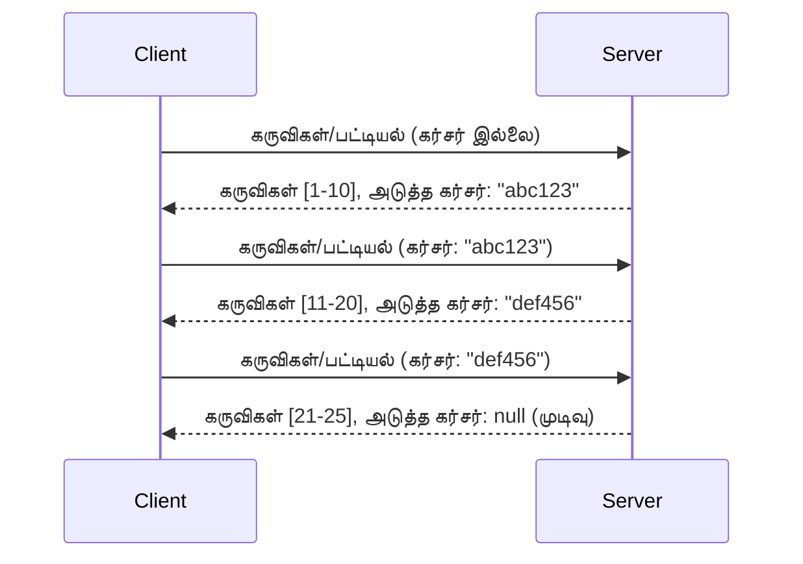

# MCP இல் பக்கமுறை மற்றும் பெரிய முடிவு தொகுதிகள்

உங்கள் MCP சேவையகம் பெரிய தரவு தொகுதிகளை கையாளும் போது - ஆயிரக்கணக்கான கோப்புகள், தரவுத்தள பதிவுகள் அல்லது தேடல் முடிவுகளைப் பட்டியலிடுகையில் - நினைவகத்தை திறமையாக நிர்வகித்து, உடனடி பயனர் அனுபவங்களை வழங்க பக்கமுறை அவசியமாகிறது. இந்த வழிகாட்டி MCP இல் பக்கமுறையை எவ்வாறு செயல்படுத்தவும் பயன்படுத்தவும் என்பது குறித்து விளக்குகிறது.

## ஏன் பக்கமுறை முக்கியம்

பக்கமுறை இல்லாமல், பெரிய பதில்கள் ஏற்படுத்தக்கூடியவை:

- **நினைவக மூச்சுத்திணறல்** - ஒரே நேரத்தில் மில்லியன் பதிவுகளை ஏற்றுதல்
- **மெதுவாக பதில் நேரங்கள்** - அனைத்து தரவும் ஏற்றப்படும் வரை பயனர்கள் காத்திருப்பது
- **காலவரம்பு பிழைகள்** - கோரிக்கைகள் காலவரம்பை மீறுவது
- **மோசமான AI செயல்திறன்** - LLMகள் அதிக பெரிய சூழலை கையாள முடியாதல்

MCP **கர்சர் அடிப்படையிலான பக்கமுறையை** பயன் படுத்துகிறது, இது முடிவு தொகுதிகளில் நம்பகமான மற்றும் நிலையான பக்கமுறையை வழங்குகிறது.

---

## MCP பக்கமுறை எப்படி செயல்படுகிறது

### கர்சர் கருத்து

**கர்சர்** என்பது முடிவு தொகுதியில் உங்கள் இடத்தைக் குறிக்கும் ஒரு மறைமுக சரம். நீண்ட புத்தகத்தில் ஒரு புத்தக குறியீட்டைப் போன்றது என்று நினைத்துக்கொள்ளவும்.



### MCP முறைகளில் பக்கமுறை

இந்த MCP முறைகள் பக்கமுறையை ஆதரிக்கின்றன:

| முறை | திருப்புதல் | கர்சர் ஆதரவு |
|--------|---------|----------------|
| `tools/list` | கருவி விவரங்கள் | ✅ |
| `resources/list` | வள விவரங்கள் | ✅ |
| `prompts/list` | முன்மொழி விவரங்கள் | ✅ |
| `resources/templates/list` | வள வார்ப்புருக்கள் | ✅ |

---

## சேவையக செயல்படுத்தல்

### பைதான் (FastMCP)

```python
from mcp.server import Server
from mcp.types import Tool, ListToolsResult
import math

app = Server("paginated-server")

# நகல் பெரிய தரவுத்தொகை
ALL_TOOLS = [
    Tool(name=f"tool_{i}", description=f"Tool number {i}", inputSchema={})
    for i in range(100)
]

PAGE_SIZE = 10

@app.list_tools()
async def list_tools(cursor: str | None = None) -> ListToolsResult:
    """List tools with pagination support."""
    
    # துவக்க குறியீட்டை பெற கர்சரை டிகோட் செய்க
    start_index = 0
    if cursor:
        try:
            start_index = int(cursor)
        except ValueError:
            start_index = 0
    
    # முடிவுகளின் பக்கம் பெறுக
    end_index = min(start_index + PAGE_SIZE, len(ALL_TOOLS))
    page_tools = ALL_TOOLS[start_index:end_index]
    
    # அடுத்த கர்சரை கணக்கிடுக
    next_cursor = None
    if end_index < len(ALL_TOOLS):
        next_cursor = str(end_index)
    
    return ListToolsResult(
        tools=page_tools,
        nextCursor=next_cursor
    )
```

### டைப் ஸ்கிரிப்ட்

```typescript
import { Server } from "@modelcontextprotocol/sdk/server/index.js";
import { ListToolsResultSchema } from "@modelcontextprotocol/sdk/types.js";

const server = new Server({
  name: "paginated-server",
  version: "1.0.0"
});

// முன்னெடுக்கப்பட்ட பெரிய தரவுத்தொகை
const ALL_TOOLS = Array.from({ length: 100 }, (_, i) => ({
  name: `tool_${i}`,
  description: `Tool number ${i}`,
  inputSchema: { type: "object", properties: {} }
}));

const PAGE_SIZE = 10;

server.setRequestHandler(ListToolsResultSchema, async (request) => {
  // குறிசுயரை குறியாக்குக
  let startIndex = 0;
  if (request.params?.cursor) {
    startIndex = parseInt(request.params.cursor, 10) || 0;
  }
  
  // முடிவுகளின் பக்கம் பெறுக
  const endIndex = Math.min(startIndex + PAGE_SIZE, ALL_TOOLS.length);
  const pageTools = ALL_TOOLS.slice(startIndex, endIndex);
  
  // அடுத்த குறிசுயரை கணக்கிடுக
  const nextCursor = endIndex < ALL_TOOLS.length ? String(endIndex) : undefined;
  
  return {
    tools: pageTools,
    nextCursor
  };
});
```

### ஜாவா (Spring MCP)

```java
@Service
public class PaginatedToolService {
    
    private static final int PAGE_SIZE = 10;
    private final List<Tool> allTools;
    
    public PaginatedToolService() {
        // பெரிய தரவுத்தொகுதியை துவக்கம் செய்க
        this.allTools = IntStream.range(0, 100)
            .mapToObj(i -> new Tool("tool_" + i, "Tool number " + i, Map.of()))
            .collect(Collectors.toList());
    }
    
    @McpMethod("tools/list")
    public ListToolsResult listTools(@Param("cursor") String cursor) {
        // குறியுறையை பிழையில்லாமல் எடுத்துரைக்கவும்
        int startIndex = 0;
        if (cursor != null && !cursor.isEmpty()) {
            try {
                startIndex = Integer.parseInt(cursor);
            } catch (NumberFormatException e) {
                startIndex = 0;
            }
        }
        
        // முடிவுகளின் பக்கத்தை பெறுக
        int endIndex = Math.min(startIndex + PAGE_SIZE, allTools.size());
        List<Tool> pageTools = allTools.subList(startIndex, endIndex);
        
        // அடுத்த குறியுறையை கணக்கிடுக
        String nextCursor = endIndex < allTools.size() ? String.valueOf(endIndex) : null;
        
        return new ListToolsResult(pageTools, nextCursor);
    }
}
```

---

## கிளையன்ட் செயல்படுத்தல்

### பைதான் கிளையன்ட்

```python
from mcp import ClientSession

async def get_all_tools(session: ClientSession) -> list:
    """Fetch all tools using pagination."""
    all_tools = []
    cursor = None
    
    while True:
        result = await session.list_tools(cursor=cursor)
        all_tools.extend(result.tools)
        
        if result.nextCursor is None:
            break
        cursor = result.nextCursor
    
    return all_tools

# பயன்பாடு
async with client_session as session:
    tools = await get_all_tools(session)
    print(f"Found {len(tools)} tools")
```

### டைப் ஸ்கிரிப்ட் கிளையன்ட்

```typescript
import { Client } from "@modelcontextprotocol/sdk/client/index.js";

async function getAllTools(client: Client): Promise<Tool[]> {
  const allTools: Tool[] = [];
  let cursor: string | undefined = undefined;
  
  do {
    const result = await client.listTools({ cursor });
    allTools.push(...result.tools);
    cursor = result.nextCursor;
  } while (cursor);
  
  return allTools;
}

// பயன்பாடு
const tools = await getAllTools(client);
console.log(`Found ${tools.length} tools`);
```

### சோம்பல் ஏற்றுதல் முறை

மிகவும் பெரிய தரவு தொகுதிகளுக்கு, தேவைக்கேற்ப பக்கங்களை ஏற்றவும்:

```python
class PaginatedToolIterator:
    """Lazily iterate through paginated tools."""
    
    def __init__(self, session: ClientSession):
        self.session = session
        self.cursor = None
        self.buffer = []
        self.exhausted = False
    
    async def __anext__(self):
        # கிடைத்தால் பஃபரிலிருந்து திரும்பு
        if self.buffer:
            return self.buffer.pop(0)
        
        # நாம் அனைத்து பக்கங்களையும் Exhaust செய்தோமா என்று சரிபார்
        if self.exhausted:
            raise StopAsyncIteration
        
        # அடுத்த பக்கத்தை பெறு
        result = await self.session.list_tools(cursor=self.cursor)
        self.buffer = list(result.tools)
        self.cursor = result.nextCursor
        
        if self.cursor is None:
            self.exhausted = True
        
        if not self.buffer:
            raise StopAsyncIteration
        
        return self.buffer.pop(0)
    
    def __aiter__(self):
        return self

# பயன்பாடு - பெரும் தரவுத்தொகைகளுக்கு நினைவக சேமிப்பு முறை
async for tool in PaginatedToolIterator(session):
    process_tool(tool)
```

---

## வளங்களுக்கான பக்கமுறை

அடைவு அல்லது பெரிய தரவு தொகுதிகளுக்காக வளங்களுக்கு பெரும்பாலும் பக்கமுறை தேவைப்படுகிறது:

```python
from mcp.server import Server
from mcp.types import Resource, ListResourcesResult
import os

app = Server("file-server")

@app.list_resources()
async def list_resources(cursor: str | None = None) -> ListResourcesResult:
    """List files in directory with pagination."""
    
    directory = "/data/files"
    all_files = sorted(os.listdir(directory))
    
    # குறி (கோப்பு குறிப்பு) உடைக்கவும்
    start_index = int(cursor) if cursor else 0
    page_size = 20
    end_index = min(start_index + page_size, len(all_files))
    
    # இந்த பக்கத்துக்கான வள பட்டியலை உருவாக்கவும்
    resources = []
    for filename in all_files[start_index:end_index]:
        filepath = os.path.join(directory, filename)
        resources.append(Resource(
            uri=f"file://{filepath}",
            name=filename,
            mimeType="application/octet-stream"
        ))
    
    # அடுத்த குறியை கணக்கிடு
    next_cursor = str(end_index) if end_index < len(all_files) else None
    
    return ListResourcesResult(
        resources=resources,
        nextCursor=next_cursor
    )
```

---

## கர்சர் வடிவமைப்பு நுட்பங்கள்

### நுட்பம் 1: குறியீடு அடிப்படையில் (எளிது)

```python
# கர்சர் என்பது வெறும் குறியீட்டாகும்
cursor = "50"  # பொருள் 50 இல் தொடங்கு
```

**நன்மைகள்:** எளிதானது, நிலைமையற்றது
**தவறுகள்:** பொருட்கள் சேர்க்க அல்லது அகற்றப்படும்போது முடிவுகள் இடம் மாறக்கூடும்

### நுட்பம் 2: ஐடி அடிப்படையிலானது (நிலையானது)

```python
# கர்சர் கடைசியாக பார்த்த ID ஆகும்
cursor = "item_abc123"  # இந்த பொருளுக்கு பிறகு தொடங்கு
```

**நன்மைகள்:** பொருட்கள் மாறினாலும் நிலையானது
**தவறுகள்:** வரிசைப்படுத்தப்பட்ட ஐடியை தேவைப்படுத்துகிறது

### நுட்பம் 3: குறியாக்கப்பட்ட நிலை (சிக்கலானது)

```python
import base64
import json

def encode_cursor(state: dict) -> str:
    return base64.b64encode(json.dumps(state).encode()).decode()

def decode_cursor(cursor: str) -> dict:
    return json.loads(base64.b64decode(cursor).decode())

# குற்சர் பல நிலை புலங்களை கொண்டுள்ளது
cursor = encode_cursor({
    "offset": 50,
    "filter": "active",
    "sort": "name"
})
```

**நன்மைகள்:** சிக்கலான நிலையையும் குறியாக்க முடியும்
**தவறுகள்:** சிக்கலானது, பெரிய கர்சர் சரங்கள்

---

## சிறந்த நடைமுறைகள்

### 1. ஏற்றமான பக்கம் அளவுகளை தேர்ந்தெடுக்கவும்

```python
# தரவு அளவையை கருத்தில் கொள்ளவும்
PAGE_SIZE_SMALL_ITEMS = 100   # எளிய நிலைத் தகவல்
PAGE_SIZE_MEDIUM_ITEMS = 20   # மேலும் வளமான பொருட்கள்
PAGE_SIZE_LARGE_ITEMS = 5     # சிக்கலான உள்ளடக்கம்
```

### 2. தவறான கர்சர்களை நன்கு கையாளவும்

```python
@app.list_tools()
async def list_tools(cursor: str | None = None) -> ListToolsResult:
    try:
        start_index = int(cursor) if cursor else 0
        if start_index < 0 or start_index >= len(ALL_TOOLS):
            start_index = 0  # துவக்கத்திற்கு மீட்டமைக்கவும்
    except (ValueError, TypeError):
        start_index = 0  # தவறான குறியீடு, புதியதாக துவங்கவும்
    # ...
```

### 3. மொத்த எண்ணிக்கையை சேர்க்கவும் (விருப்பமானது)

```python
return ListToolsResult(
    tools=page_tools,
    nextCursor=next_cursor,
    # சில அமல்படுத்தல்களில் UI முன்னேற்றத்திற்கு மொத்தம் உள்ளது
    _meta={"total": len(ALL_TOOLS)}
)
```

### 4. முன் வேலைகளைச் சோதிக்கவும்

```python
async def test_pagination():
    # காலியான முடிவுகள் தொகுதி
    result = await session.list_tools()
    assert result.tools == []
    assert result.nextCursor is None
    
    # ஒரே பக்கம்
    result = await session.list_tools()
    assert len(result.tools) <= PAGE_SIZE
    
    # தவறான கர்சர்
    result = await session.list_tools(cursor="invalid")
    assert result.tools  # முதல் பக்கத்தை 반환 செய்ய வேண்டும்
```

---

## பொதுவான சிக்கல்கள்

### ❌ அனைத்து முடிவுகளையும் திருப்பி வைத்து பிறகு கிளையன்ட் பக்கமுறை செய்வது

```python
# மோசம்: அனைத்தையும் நினைவகத்தில் ஏற்றுகிறது
@app.list_tools()
async def list_tools() -> ListToolsResult:
    all_tools = load_all_tools()  # 1 மில்லியன் கருவிகள்!
    return ListToolsResult(tools=all_tools)
```

### ✅ தரவு மூலத்தில் பக்கமுறை செய்வது

```python
# சிறந்தது: தேவையானவை மட்டும் ஏற்றுகிறது
@app.list_tools()
async def list_tools(cursor: str | None = None) -> ListToolsResult:
    offset = int(cursor) if cursor else 0
    tools = await db.query_tools(offset=offset, limit=PAGE_SIZE)
    return ListToolsResult(tools=tools, nextCursor=...)
```

---

## அடுத்தது என்ன

- [Module 5.14 - Context Engineering](../../05-AdvancedTopics/mcp-contextengineering/README.md)
- [Module 8 - Best Practices](../../08-BestPractices/README.md)
- [3.8 - உங்கள் MCP சேவையகத்தை சோதனை செய்தல்](../../03-GettingStarted/08-testing/README.md)

---

## கூடுதல் வளங்கள்

- [MCP குறிப்புகள் - பக்கமுறை](https://modelcontextprotocol.io/specification/2026-07-28/)
- [கர்சர் அடிப்படையிலான பக்கமுறை விளக்கம்](https://slack.engineering/evolving-api-pagination-at-slack/)
- [Python SDK பக்கமுறை சோதனைகள்](https://github.com/modelcontextprotocol/python-sdk/blob/main/tests/client/test_list_methods_cursor.py)

---

<!-- CO-OP TRANSLATOR DISCLAIMER START -->
**மறுப்பு**:
இந்த ஆவணம் AI மொழிபெயர்ப்பு சேவை [Co-op Translator](https://github.com/Azure/co-op-translator) பயன்படுத்தி மொழிபெயர்க்கப்பட்டுள்ளது. நாங்கள் துல்லியத்திற்காக முயற்சி செய்துள்ளோம், ஆனால் தானாக செய்யப்படும் மொழிபெயர்ப்புகளில் பிழைகள் அல்லது தவறுகள் இருக்கலாம் என்பதை கவனத்தில் கொள்ளவும். அசல் ஆவணம் அதன் தாய்மொழியில் அதிகாரப்பூர்வ ஆதாரமாக கருதப்பட வேண்டும். முக்கியமான தகவல்களுக்கு, தொழில்நுட்பமான மனித மொழிபெயர்ப்பு பரிந்துரைக்கப்படுகிறது. இந்த மொழிபெயர்ப்பைப் பயன்படுத்துவதால் ஏற்படும் எந்த தவறான புரிதல்கள் அல்லது தவறான விளக்கத்திற்கும் நாங்கள் பொறுப்பில்வில்லை.
<!-- CO-OP TRANSLATOR DISCLAIMER END -->