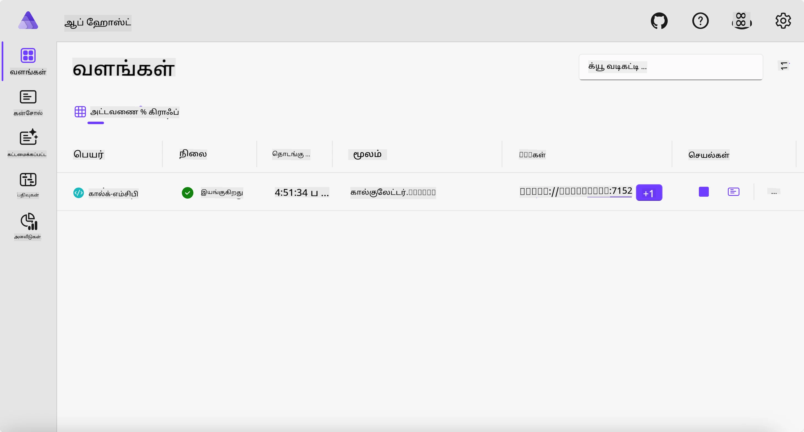
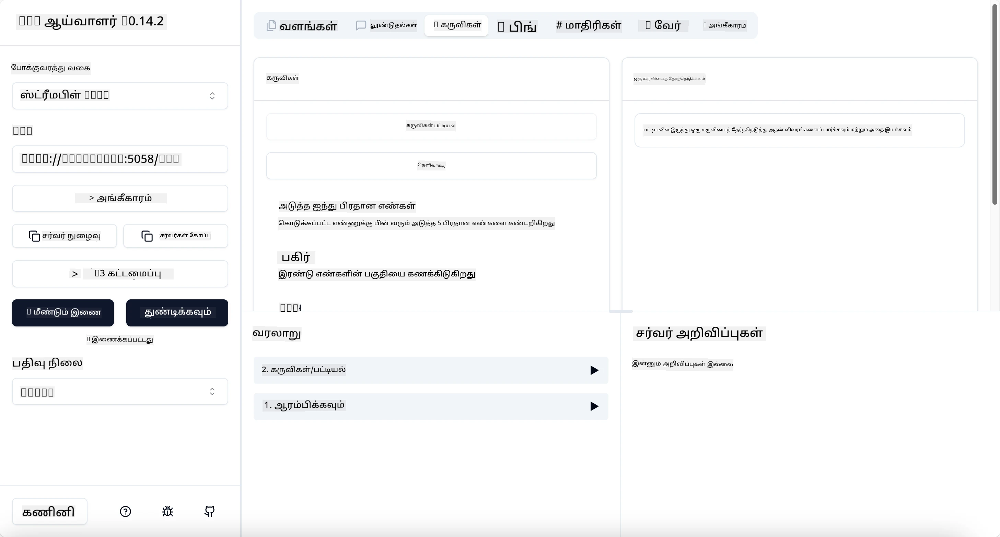
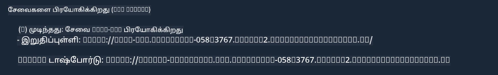

# மாதிரி

முன் எடுத்துக்காட்டில் உள்ளாடல் `.NET` திட்டத்தை `stdio` வகையுடன் எப்படி பயன்படுத்துவது என்பதை காண்பிக்கும். மேலும், சர்வரை உள்ளூரில் ஒரு கன்டெய்னரில் எப்படி இயக்குவது என்பதையும். இது பல சந்தர்ப்பங்களில் ஒரு நல்ல தீர்வாகும். எனினும், சர்வர் காட்சியமைப்பில் தூரத்தில் இயங்குவது ஆராய்ச்சி செய்யக்கூடியதாக இருக்கலாம். இதுவே `http` வகையின் பங்கு.

`04-PracticalImplementation` கோப்பகத்தில் இருக்கும் தீர்வை பார்த்தால், அது முந்தையதைவிட மிகவும் சிக்கலாகத் தோன்றலாம். ஆனால் உண்மையில் அது இல்ல. நீங்கள் `src/Calculator` பிராஜெக்டை நெருக்கமாகப் பார்த்தால், அது பெரும்பாலும் முன்னர் காட்டப்பட்டுள்ள அதே குறியீடு என்பது தெரியும். வித்தியாசம் இதையே தவிர வேறொரு நூலகம் `ModelContextProtocol.AspNetCore` HTTP கோரிக்கைகளை கையாள பயன்படுத்தப்படுகிறது. மேலும், `IsPrime` முறை தனிப்பட்டதாக மாற்றப்பட்டுள்ளது, இதன்மூலம் உங்கள் குறியீட்டில் மறைப்பிமுறைங்கள் இருக்கலாம் என்பதைக் காண்பிக்க. மற்ற குறியீடுகள் முன்னரைவிட ஒன்றே.

மற்ற திட்டங்கள் [Aspire](https://aspire.dev/get-started/what-is-aspire/) இருந்து வருகின்றன. Aspire தீர்வில் இருப்பது உருவாக்குபவர் அனுபவத்தை மேம்படுத்தி, உருவாக்கம் மற்றும் பரிசோதனையின் போது மற்றும் கண்காணிப்பில் உதவும். சர்வரை இயக்க இது அவசியம் அல்ல, ஆனால் உங்கள் தீர்வில் இருப்பது நல்ல நடைமுறை.

## சர்வரை உள்ளூரில் துவங்குதல்

1. VS Code (C# DevKit நீட்சியுடன்) இலிருந்து, `04-PracticalImplementation/samples/csharp` அடைவுக்கு செல்லவும்.
1. சர்வரை துவங்க பின்னுள்ள கட்டளை இயக்கவும்:

   ```bash
    dotnet watch run --project ./src/AppHost
   ```

1. Aspire டாஷ்போர்டு ஒரு வலை உலாவியில் திறக்கும்போது, `http` URL ஐ கவனிக்கவும். அது `http://localhost:5058/` போன்றதானாக இருக்கும்.

   

## MCP இன்ஸ்பெக்டருடன் Streamable HTTP ஐ பரிசோதனை செய்யவும்

உங்களுக்கு Node.js 22.7.5 மற்றும் அதற்கு மேற்பட்ட பதிப்புகள் இருந்தால், MCP இன்ஸ்பெக்டரை உங்கள் சர்வரை பரிசோதிக்க பயன்படுத்தலாம்.

சர்வரை துவங்கி, டெர்மினலில் கீழ்க்காணும் கட்டளை இயக்கவும்:

```bash
npx @modelcontextprotocol/inspector http://localhost:5058
```



- `Streamable HTTP` ஐ போக்குவரத்து வகையாக தேர்ந்தெடுக்கவும்.
- URL புலத்தில், முன்னதாக கவனித்த சர்வர் URL ஐ புகுத்தி அதனை `/mcp` உடன் இணைக்கவும். அது `http` (https அல்ல) போல `http://localhost:5058/mcp` ஆனதாக இருக்க வேண்டும்.
- இணைப்பு பொத்தானை அழுத்தவும்.

இன்ஸ்பெக்டர் வழங்கும் சிறந்த விஷயம் என்னவெனில், அது நடப்பதை நன்றாக காண்பிக்கிறது.

- கிடைக்கும் கருவிகளை பட்டியலிட முயலவும்.
- சிலவற்றைப் பயன்படுத்தி பாருங்கள், அது முன்னதைப்போல் வேலை செய்யும்.

## GitHub Copilot Chat ஐ பயன்படுத்தி MCP சர்வரை பரிசோதித்தல் VS Code இலிருந்து

Streamable HTTP போக்குவரத்தைக் GitHub Copilot Chat உடன் பயன்படுத்த, முன்பு உருவாக்கிய `calc-mcp` சர்வரின் கட்டமைப்பை அப்படித் திருத்தவும்:

```jsonc
// .vscode/mcp.json
{
  "servers": {
    "calc-mcp": {
      "type": "http",
      "url": "http://localhost:5058/mcp"
    }
  }
}
```

பரிசோதனைகள் செய்யவும்:

- "3 prime numbers after 6780" என்ற கேள்வி கேளுங்கள். Copilot புதிய கருவிகள் `NextFivePrimeNumbers` ஐ பயன்படுத்தி முதல் 3 பெருச்சொற்களை மட்டும் தரும்.
- "7 prime numbers after 111" என்பதையும் கேட்டு, என்ன நடக்கும் என்று பாருங்கள்.
- "John க்கு 24 லொலிகள் உள்ளன மற்றும் அவற்றை தனது 3 பிள்ளைகளுக்கு வழங்க விரும்புகிறான். ஒவ்வொரு பிள்ளைக்கும் எத்தனை லொலி கிடைக்கும்?" என்பதையும் கேளுங்கள்.

## சர்வரை Azure க்கு தள்ளல்

சர்வரை Azure இல் தள்ளி, மேலும் மக்கள் அதைப் பயன்படுத்தக் கூடியவராக செய்யலாம்.

டெர்மினல் மூலம், `04-PracticalImplementation/samples/csharp` அடைவை நோக்கி சென்று, கீழ் கட்டளையை இயக்கவும்:

```bash
azd up
```

தள்ளல் முடிந்ததும், இப்படி ஒரு செய்தி பார்க்க வேண்டும்:



URL ஐ பிடித்து MCP இன்ஸ்பெக்டர் மற்றும் GitHub Copilot Chat இல் பயன்படுத்தவும்.

```jsonc
// .vscode/mcp.json
{
  "servers": {
    "calc-mcp": {
      "type": "http",
      "url": "https://calc-mcp.gentleriver-3977fbcf.australiaeast.azurecontainerapps.io/mcp"
    }
  }
}
```

## அடுத்து என்ன?

வெவ்வேறு போக்குவரத்து வகைகளையும் பரிசோதனை கருவிகளையும் முயற்சி செய்தோம். மேலும் உங்கள் MCP சர்வரை Azure இல் தள்ளினோம். ஆனால், எங்கள் சர்வர் தனிப்பட்ட வளங்கள் (உதாரணமாக தரவுத்தளம் அல்லது தனிப்பட்ட API) அணுக வேண்டியிருந்தால்? அடுத்த அத்தியாயத்தில், நமது சர்வரின் பாதுகாப்பை எப்படி மேம்படுத்தலாம் என்று பார்ப்போம்.

---

<!-- CO-OP TRANSLATOR DISCLAIMER START -->
**மறுப்பு**:
இந்த ஆவணம் AI மொழிபெயர்ப்பு சேவை [Co-op Translator](https://github.com/Azure/co-op-translator) பயன்படுத்தி மொழிபெயர்க்கப்பட்டுள்ளது. நாங்கள் துல்லியத்திற்காக முயற்சி செய்துள்ளோம், ஆனால் தானாக செய்யப்படும் மொழிபெயர்ப்புகளில் பிழைகள் அல்லது தவறுகள் இருக்கலாம் என்பதை கவனத்தில் கொள்ளவும். அசல் ஆவணம் அதன் தாய்மொழியில் அதிகாரப்பூர்வ ஆதாரமாக கருதப்பட வேண்டும். முக்கியமான தகவல்களுக்கு, தொழில்நுட்பமான மனித மொழிபெயர்ப்பு பரிந்துரைக்கப்படுகிறது. இந்த மொழிபெயர்ப்பைப் பயன்படுத்துவதால் ஏற்படும் எந்த தவறான புரிதல்கள் அல்லது தவறான விளக்கத்திற்கும் நாங்கள் பொறுப்பில்வில்லை.
<!-- CO-OP TRANSLATOR DISCLAIMER END -->