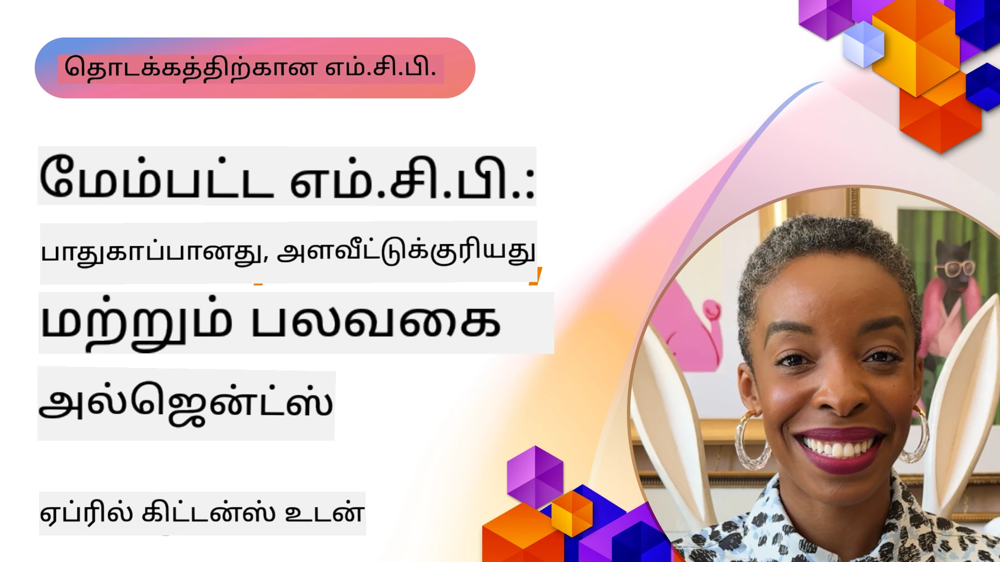

# MCP இல் மேம்பட்ட தலைப்புகள்

_(இந்த பாடத்தின் வீடியோவைப் பார்க்க மேலே உள்ள படத்தை கிளிக் செய்யவும்)_

இந்த அத்தியாயம் Model Context Protocol (MCP) செயல்பாட்டில் உள்ள பல்வேறு மேம்பட்ட தலைப்புகளை, பன்முக ஒருங்கிணைப்பு, திரிபாள்முறை, பாதுகாப்பு சிறந்த நடைமுறைகள் மற்றும் நிறுவன ஒருங்கிணைப்பு ஆகியவற்றை உள்ளடக்கியது. இத்தேர்வுகள் நவீன AI அமைப்புகளின் தேவைகளை பூர்த்திசெய்யக்கூடிய வலுவான மற்றும் உற்பத்தி தயாராக MCP பயன்பாடுகளை உருவாக்குவதற்கு அவசியமாகும்.

## கண்ணோட்டம்

இந்த பாடத்தில் Model Context Protocol செயல்பாட்டில் உள்ள மேம்பட்ட கருத்துக்கள் ஆராயப்படுகின்றன, முக்கியமாக பன்முக ஒருங்கிணைப்பு, திரிபாள்முறை, பாதுகாப்பு சிறந்த நடைமுறைகள் மற்றும் நிறுவன ஒருங்கிணைப்பு. இந்த தலைப்புகள் நிறுவன சூழல்களில் சிக்கலான தேவைகளை கையாளக்கூடிய உற்பத்தி தர MCP பயன்பாடுகளை கட்டியெழுப்ப தேவையானவை.

> **எதிர்கால நோக்கு:** கீழ்க்காணும் சில தலைப்புகள் `2026-07-28` MCP குறிப்பிடப்பட்ட வெளியீட்டு போட்டியாளரால் பாதிக்கபட்டுள்ளன — Root Contexts (5.4) மற்றும் Sampling (5.6) ஆகியவை வெளியீட்டு போட்டியாளர் மறுக்கப்படும் என்று குறிக்கின்ற அடிப்படைக் கூறுகளின் மேல் கட்டப்பட்டுள்ளன, மற்றும் Protocol Features (5.16) இல் குறிப்பான பரிசோதனை Tasks அம்சம் ஒரு தனித்துவமான Tasks நீட்டிப்பிற்கு மாறுகிறது. விரிவாக பார்க்க [MCP இல் என்ன மாற்றுகிறது: 2026-07-28 வெளியீட்டு போட்டியாளர்](../01-CoreConcepts/mcp-2026-07-28-release-candidate.md) என்பதை காணவும்.

## கற்றல் குறிக்கோள்கள்

இந்தப் பாடத்தின் முடிவில், நீங்கள்:

- MCP கட்டமைப்புகளில் பன்முக திறன்களை அமல்படுத்த இயலும்
- அதிக தேவை உள்ள சூழலுக்கான திரிபாள்மை MCP கட்டமைப்புகளை வடிவமைக்க முடியும்
- MCP பாதுகாப்பு கொள்கைகளுடன் தொடர்புடைய பாதுகாப்பு சிறந்த நடைமுறைகளை பின்பற்றலாம்
- MCP ஐ நிறுவன AI அமைப்புகளுடன் மற்றும் கட்டமைப்புகளுடன் ஒருங்கிணைக்கலாம்
- உற்பத்தி சூழல்களில் செயல்திறன் மற்றும் நம்பகத்தன்மையை சிறப்புபடுத்தலாம்

## பாடங்கள் மற்றும் மாதிரி திட்டங்கள்

| இணைப்பு | தலைப்பு | விளக்கம் |
|------|-------|-------------|
| [5.1 Azure உடன் ஒருங்கிணைவு](./mcp-integration/README.md) | Azure உடன் ஒருங்கிணைவு | உங்கள் MCP சர்வரை Azure இல் எப்படி ஒருங்கிணைப்பதற்கென்று கற்கவும் |
| [5.2 பன்முக மாதிரி](./mcp-multi-modality/README.md) | MCP பன்முக மாதிரிகள் | ஒலி, பட மற்றும் பன்முக பதிலுக்கான மாதிரிகள் |
| [5.3 MCP OAuth2 மாதிரி](../../../05-AdvancedTopics/mcp-oauth2-demo) | MCP OAuth2 டெமோ | MCP உடன் OAuth2-ஐ, அங்கீகார மற்றும் வள சர்வராகவும் காட்டும் குறைந்த Spring Boot பயன்பாடு. பாதுகாப்பான டோக்கன் வழங்கல், பாதுகாக்கப்பட்ட இடைமுகங்கள், Azure கண்டெயனர் பயன்பாடுகள் தளவமைப்பு மற்றும் API நிர்வாக ஒருங்கிணைவு ஆகியவை விளக்கப்படுகின்றன. |
| [5.4 Root Contexts](./mcp-root-contexts/README.md) | Root சார்ந்தவை | root context பற்றி மேலும் கற்றுக்கொள்ளவும் மற்றும் அவற்றை எப்படி அமல் படுத்துவது என்பதைக் கற்றுக்கொள்ளவும் |
| [5.5 Routing](./mcp-routing/README.md) | வழித்தடம் | வெவ்வேறு வகையான வழித்தடங்களை கற்றுக்கொள்ளவும் |
| [5.6 Sampling](./mcp-sampling/README.md) | மாதிரிகள் எடுக்கும் | sampling ஐ எப்படி செயல்படுத்துவது என்பதை கற்றுக்கொள்ளவும் |
| [5.7 Scaling](./mcp-scaling/README.md) | திரிபாள்மை | Scaling பற்றி கற்றுக்கொள்ளவும் |
| [5.8 Security](./mcp-security/README.md) | பாதுகாப்பு | உங்கள் MCP சர்வரை பாதுகாக்கவும் |
| [5.9 வலைத் தேடல் மாதிரி](./web-search-mcp/README.md) | Web Search MCP | Python MCP சர்வர் மற்றும் கிளையன்ட் SerpAPI உடன் இணைய நேர சோதனை, செய்தி, பொருள் தேடல் மற்றும் கேள்வி-பதில் செயல்பாடு ஒருங்கிணைக்கப்பட்டுள்ளது. பல கருவி ஒருங்கிணைப்பு, புற API ஒருங்கிணைவு மற்றும் வலுவான பிழை கையாளுதல் காட்டப்படுகிறது. |
| [5.10 நேரடி ஒளிப்பட பகிர்வு](./mcp-realtimestreaming/README.md) | ஒளிப்பட பகிர்வு | நேரடி தரவுகள் ஒளிப்பட பகிர்வு இன்று தரவுகளால் இயக்கப்படும் உலகில் தேவையானவை, வணிகங்கள் மற்றும் பயன்பாடுகள் உடனடி தகவலுக்கு அணுகல் வேண்டுமென்று விளக்குகிறது.|
| [5.11 நேரடி வலை தேடல்](./mcp-realtimesearch/README.md) | வலை தேடல் | MCP எப்படி AI மாதிரிகள், தேடல் இயந்திரங்கள் மற்றும் பயன்பாடுகளுக்கு இடையேயான சூழல் நிர்வாகத்தில் ஒருங்கிணைந்த நடைமுறையை வழங்கி நேரடி வலை தேடலை மாற்றுகிறது என விளக்குகிறது.| 
| [5.12 Model Context Protocol சர்வருக்கான Entra ID அங்கீகாரம்](./mcp-security-entra/README.md) | Entra ID அங்கீகாரம் | Microsoft Entra ID ஒரு வலுவான மேக அடிப்படையிலான அடையாள மற்றும் அணுகல் மேலாண்மை தீர்வைக் கொண்டு வருகிறது, இதனால் உத்திரவாதமளிக்கப்பட்ட பயனர்கள் மற்றும் பயன்பாடுகள் மட்டுமே உங்கள் MCP சர்வருடன் தொடர்பு கொள்ள முடியும்.|
| [5.13 Microsoft Foundry முகவர் ஒருங்கிணைவு](./mcp-foundry-agent-integration/README.md) | Microsoft Foundry ஒருங்கிணைவு | Model Context Protocol சர்வர்களை Microsoft Foundry முகவர்களுடன் இணைத்து, வலுவான கருவி ஒருங்கிணைப்பு மற்றும் நிறுவன AI திறன்களை நிலைநிறுத்தப்பட்ட புற தரவு மூலங்களுடன் கொடுக்கக்கூடிய முறையை கற்று கொள்ளவும்.|
| [5.14 Context Engineering](./mcp-contextengineering/README.md) | Context Engineering | MCP சர்வர்களுக்கான எதிர்கால வாய்ப்பு, context optimization, இயங்கும் context நிர்வாகம் மற்றும் MCP அமைப்புகளில் சிறந்த prompt engineering க்கான நடைமுறைகள் பற்றி.|
| [5.15 MCP கஸ்டம் கடத்தல்](./mcp-transport/README.md) | Custom Transport | சிறப்பு MCP தொடர்பாடல் சூழல்களுக்கான தனிப்பயன் கடத்தல் (transport) முறைகளை எப்படி உருவாக்குவது என்பதைக் கற்றுக்கொள்ளவும்.|
| [5.16 Protocol Features ஆழ்ந்த பயணம்](./mcp-protocol-features/README.md) | Protocol Features | முன்னேற்ற அறிவிப்புகள், கோரிக்கை நிறுத்தல், வள வடிவங்கள் மற்றும் பிழை கையாளல் மாதிரிகள் போன்ற மேம்பட்ட நெறிமுறை அம்சங்களை அடக்கம் செய்க.|
| [5.17 எதிர் முகவரி கொண்ட பன்முக முகவர் கருத்துரை](./mcp-adversarial-agents/README.md) | எதிர் முகவரி கொண்ட முகவர்கள் | ஒரே MCP கருவி தொகுப்பைப் பகிர்ந்து கொண்ட இரண்டு எதிரான நிலைகள் கொண்ட முகவர்களை பயன்படுத்தி மாயை தெளிவுபடுத்துதல், விளிம்பு நிலைகளை வெளிப்படுத்துதல் மற்றும் கட்டமைக்கப்பட்ட விவாதத்தின் மூலம் சிறந்த-அளவீடு செய்யப்பட்ட வெளியீடுகள் உருவாக்குதல். |

> **MCP குறிப்பெட்டில் புதியது 2025-11-25**: குறிப்பெட்டில் இப்போது பரிசோதனையான **Tasks** (நீண்ட நேர செயற்திட்டங்கள் முன்னேற்ற கண்காணிப்புடன்), **Tool Annotations** (கருவி நடத்தை குறித்த மெட்டா தரவு பாதுகாப்பிற்காக), **URL Mode Elicitation** (கிளையன்ட்களிடமிருந்து குறிப்பிட்ட URL உள்ளடக்கங்களை கோருதல்) மற்றும் மேம்படுத்தப்பட்ட **Roots** (வேலைநிறுத்த மீது ஆதார சூழல் நிர்வாகத்திற்கு) ஆகியவை அடக்கம் செய்யப்படுகின்றன. முழு விவரங்கள் MCP குறிப்பெட்டு மாற்றக் குறிப்பு [இங்கே](https://spec.modelcontextprotocol.io/) காணவும்.

## கூடுதல் ஆதாரங்கள்

மூல MCP தலைப்புகளில் அண்மைய தகவலுக்கு, பாருங்கள்:
- [MCP ஆவணங்கள்](https://modelcontextprotocol.io/)
- [MCP குறிப்பெட்டு (2025-11-25)](https://spec.modelcontextprotocol.io/specification/2025-11-25/)
- [GitHub தொகுப்பு](https://github.com/modelcontextprotocol)
- [OWASP MCP Top 10](https://microsoft.github.io/mcp-azure-security-guide/mcp/) - பாதுகாப்பு அபாயங்கள் மற்றும் குறைக்கல்கள்
- [MCP பாதுகாப்பு மாநாட்டு பணிமனை (Sherpa)](https://azure-samples.github.io/sherpa/) - கையேடு மூலம் பாதுகாப்பு பயிற்சி

## முக்கிய எடுத்துக்காட்டுக்கள்

- பன்முக MCP செயல்பாடுகள் உரை செயலாக்கத்தைத் தாண்டியுள்ள AI திறன்களை விரிவுபடுத்துகின்றன
- திரிபாள்மை நிறுவன பன்முக பயன்பாடுகளுக்கு அவசியம் மற்றும் இது ஆனுக்கென மற்றும் பருத்த திரிபாள்மையை வழிவகுக்கிறது
- முழுமையான பாதுகாப்பு நடவடிக்கைகள் தரவை காக்கின்றன மற்றும் சரியான அணுகல் கட்டுப்பாட்டை உறுதி செய்கின்றன
- Azure OpenAI மற்றும் Microsoft AI Foundry போன்ற தளங்களுடன் நிறுவunen ஒருங்கிணைவு MCP திறன்களை மேம்படுத்துகிறது
- மேம்பட்ட MCP செயல்பாட்டுகள் சிறந்த கட்டமைப்புகள் மற்றும் கவனமாக வள மேலாண்மையுடன் நன்மை பெறுகின்றன

## பயிற்சி

ஒரு குறிப்பிட்ட பயன்பாட்டுக்கான நிறுவன தர MCP செயல்பாட்டை திட்டமிடவும்:

1. உங்கள் பயன்பாட்டுக்கான பன்முக தேவைகளை அடையாளம் காணவும்
2. ரகசிய தரவை பாதுகாக்க தேவையான பாதுகாப்பு கட்டுப்பாடுகளை உருவாக்கவும்
3. வேறுபாடான பளுவை கையாளக்கூடிய திரிபாள்மை கட்டமைப்பை வடிவமைக்கவும்
4. நிறுவன AI அமைப்புகளுடன் ஒருங்கிணைப்பு புள்ளிகளை திட்டமிடவும்
5. செயல்திறன் குறைபாடுகள் மற்றும் குறைநிலை முறைகளை ஆவணம் செய்யவும்

## கூடுதல் வளங்கள்

- [Azure OpenAI ஆவணங்கள்](https://learn.microsoft.com/en-us/azure/ai-services/openai/)
- [Microsoft AI Foundry ஆவணங்கள்](https://learn.microsoft.com/en-us/ai-services/)

---

## அடுத்தது என்ன

இந்த தொகுப்பில் உள்ள பாடங்களை [5.1 MCP ஒருங்கிணைவு](./mcp-integration/README.md) தொடக்கம் ஆய்ந்து கற்றுக்கொள்ளவும்

இந்த தொகுப்பை முடித்தவுடன், [தொகுப்பு 6: சமுதாய பங்களிப்புகள்](../06-CommunityContributions/README.md) தொடரவும்

---

<!-- CO-OP TRANSLATOR DISCLAIMER START -->
**மறுப்பு**:
இந்த ஆவணம் AI மொழிபெயர்ப்பு சேவை [Co-op Translator](https://github.com/Azure/co-op-translator) பயன்படுத்தி மொழிபெயர்க்கப்பட்டுள்ளது. நாங்கள் துல்லியத்திற்காக முயற்சி செய்துள்ளோம், ஆனால் தானாக செய்யப்படும் மொழிபெயர்ப்புகளில் பிழைகள் அல்லது தவறுகள் இருக்கலாம் என்பதை கவனத்தில் கொள்ளவும். அசல் ஆவணம் அதன் தாய்மொழியில் அதிகாரப்பூர்வ ஆதாரமாக கருதப்பட வேண்டும். முக்கியமான தகவல்களுக்கு, தொழில்நுட்பமான மனித மொழிபெயர்ப்பு பரிந்துரைக்கப்படுகிறது. இந்த மொழிபெயர்ப்பைப் பயன்படுத்துவதால் ஏற்படும் எந்த தவறான புரிதல்கள் அல்லது தவறான விளக்கத்திற்கும் நாங்கள் பொறுப்பில்வில்லை.
<!-- CO-OP TRANSLATOR DISCLAIMER END -->