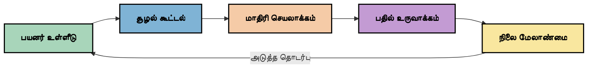
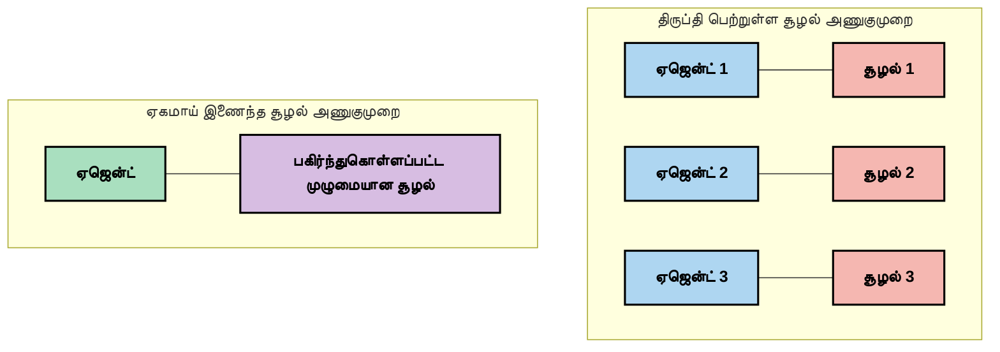
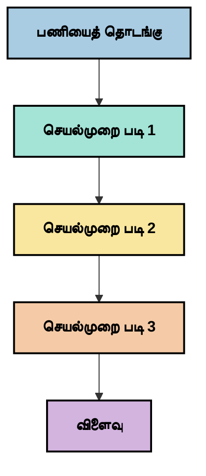
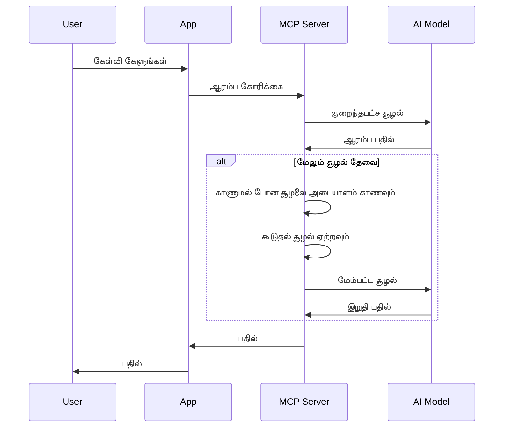
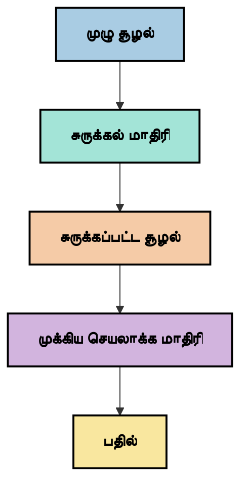
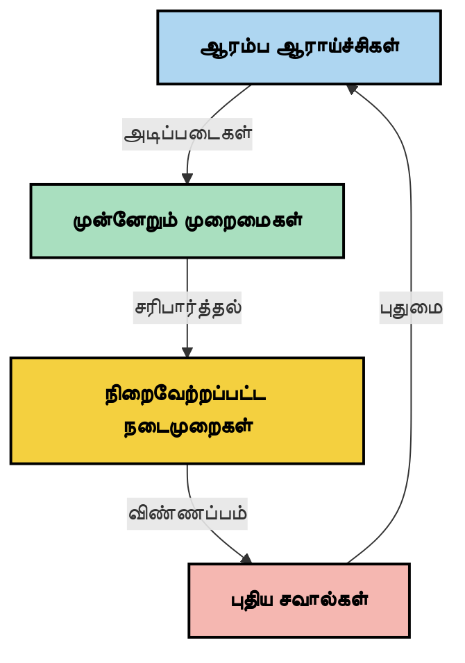

# Context Engineering: MCP சூழலில் தோன்றி வரும் ஒரு கருத்து

## மேற்பார்வை

Context engineering என்பது AI துறையில் தோன்றி கொண்டிருக்கும் ஒரு கருத்து ஆகும், இது தகவல் எப்படி கட்டமைக்கப்படுகின்றது, வழங்கப்படுகின்றது மற்றும் வாடிக்கையாளர்கள் மற்றும் AI சேவைகளுக்கு இடையேயான தொடர்புகள் முழுவதும் எப்படி பராமரிக்கப்படுகின்றது என்பதை ஆராய்கிறது. Model Context Protocol (MCP) சூழல் வளர்ந்துகொண்டிருக்கும் போதெல்லாம், சூழலை சரியாக நிர்வகிப்பது பெரிதும் முக்கியமாகிறது. இந்த தொகுதி context engineering என்ற கருத்தை அறிமுகப்படுத்தி அதன் MCP செயல்பாடுகளில் பயன்பாடுகளை ஆராய்கிறது.

## கற்றல் நோக்கங்கள்

இந்த தொகுதி முடிந்ததும், நீங்கள் கீழ்காணும் திறன்களை பெற்றிருப்பீர்கள்:

- context engineering என்ற தோன்றி வரும் கருத்தையும் அதன் MCP செயல்பாடுகளில் வாய்ப்பு வாய்ந்த பங்கையும் புரிந்து கொள்வது
- MCP நெறிமுறை வடிவமைப்பு எதிர்கொள்ளும் சூழல் நிர்வகிப்பு சவால்களை அடையாளம் காண்பது
- சிறந்த context கையாள்வதன் மூலம் மாதிரி செயல்திறனை மேம்படுத்துவதற்கான தொழில்நுட்பங்களை ஆராய்வது
- context செயல்திறனை அளவிடுவதற்கும் மதிப்பிடுவதற்குமான அணுகுமுறைகளை பரிசீலனை செய்வது
- MCP கட்டமைப்பின் மூலம் AI அனுபவங்களை மேம்படுத்த இந்த புதிய கருத்துக்களை உட்படுத்துவது

## Context Engineering அறிமுகம்

Context engineering என்பது பயனாளர்கள், பயன்பாடுகள் மற்றும் AI மாதிரிகளுக்கு இடையேயான தகவல் ஓட்டத்தின் தயாரிப்பு மற்றும் நிர்வகிப்பில் கவனம் செலுத்தும் தோன்றி வரும் கருத்து ஆகும். prompt engineering போன்ற நிர்ணயிக்கப்பட்ட துறைகளுக்கு மாறாக, context engineering இன்னும் பயிற்சியாளர்களால் வரையறுக்கப்படுவதாகும்; அவர்கள் AI மாதிரிகளுக்கு சரியான நேரத்தில் சரியான தகவலை வழங்குவதற்கான தனித்துவ சவால்களை தீர்க்க பணியாற்றுகின்றனர்.

பெரிய மொழி மாதிரிகள் (LLMs) வளர்ந்துவரும் போது, context இன் முக்கியத்துவம் மேன்மேலும் தெளிவாகிறது. நாம் வழங்கும் context இன் தரம், தொடர்பு மற்றும் கட்டமைப்பு மாதிரி வெளியீடுகளை நேரடியாக பாதிக்கிறது. context engineering இந்த தொடர்பை ஆராய்ந்து, செயல்திறனான context நிர்வகிப்பிற்கான கோட்பாடுகளை உருவாக்க முயல்கிறது.

> "2025 ஆம் ஆண்டில், மாடல்கள் மிகுந்த அறிவூட்டியுள்ளன. ஆனால் மிகவும் அறிவுள்ள மனிதனும் அவர்களுக்கு வழங்கப்படும் context இல்லாமல் தன் வேலையை திறம்பட செய்ய முடியாது... 'Context engineering' என்பது அடுத்த படி prompt engineering ஆகும். இது இயந்திர அமைப்பில் தானாகச் செயல்படுவதாகும்." — வால்டன் யான், Cognition AI

Context engineering இல் கீழ்கண்டவை அடங்கும்:

1. **Context தேர்வு**: ஒரு குறிப்பிட்ட பணிக்கான பொருத்தமான தகவலைத் தீர்மானித்தல்  
2. **Context கட்டமைப்பு**: மாதிரி புரிதலை அதிகபட்சமாக்க தகவலை ஒழுங்குபடுத்துதல்  
3. **Context வழங்கல்**: மாதிரிக்கு தகவல் எப்போது மற்றும் எப்படி அனுப்பப்பட வேண்டும் என்பதை விருத்தி செய்வது  
4. **Context பராமரிப்பு**: Context இன் நிலை மற்றும் வளர்ச்சி காலப்போக்கில் நிர்வகித்தல்  
5. **Context மதிப்பீடு**: Context செயல்திறனை அளவிடுதல் மற்றும் மேம்படுத்துதல்

இந்த கவனக்கூறுகள் MCP சூழலில் மிகவும் பொருத்தமானவை ஆகும், MCP செயலிகள் LLM களுக்கு context வழங்குவதற்கு ஒருமுறைப்பட்ட முறையை வழங்குகிறது.

## Context பயணம் பார்வை

Context engineering ஐ கண்காணிப்பதற்கான ஒரு வழி MCP துறையில் தகவல் பயணத்தை பின்தொடர்வதாகும்:


  
### Context பயணத்தின் முக்கிய கட்டங்கள்:

1. **பயனர் உள்ளீடு**: பயனரிடமிருந்து பெறப்படும் அசல் தகவல் (உரை, படங்கள், ஆவணங்கள்)  
2. **Context கூட்டல்**: பயனர் உள்ளீடு, அமைப்பு context, உரையாடல் வரலாறு மற்றும் பிற பெறப்பட்ட தகவல்களுடன் இணைப்பது  
3. **மாதிரி செயல்முறை**: AI மாதிரி கூடிய context ஐ செயலாக்குவது  
4. **பதில் உருவாக்கல்**: மாதிரி வழங்கிய context அடிப்படையில் வெளியீடுகளை உருவாக்குகிறது  
5. **நிலைத்தன்மை நிர்வாகம்**: தொடர்பின் அடிப்படையில் அமைப்பு உள்ளக நிலையை புதுப்பிக்கிறது

இந்த பார்வை AI அமைப்புகளில் context இன் இயக்கக்கூடிய தன்மையை விளக்குகிறது மற்றும் ஒவ்வொரு கட்டத்திலும் தகவலை எப்படிக் கட்டுப்படுத்துவது என்பதில் முக்கியமான கேள்விகளை எழுப்புகிறது.

## Context Engineering இல் தோன்றி வரும் கோட்பாடுகள்

Context engineering துறைக்கு அடிப்படைகள் உறுதிப்படுத்தப்படுவதற்கு முன் சில ஆரம்ப கோட்பாடுகள் உருவாகி வருகின்றன. இவை MCP செயல்பாடுகளுக்கான தேர்வுகளில் வழிகாட்டலாம்:

### கோட்பாடு 1: Context ஐ முழுமையாக பகிர்ந்துகொள்ளவும்

System இன் அனைத்து கூறுகளுக்கும் context முழுமையாக பகிரப்படவேண்டும், பாகுபடுத்தப்படாமல். Context அலகாக வழங்கின், ஒருங்கிணைந்த வியூகம் இல்லாமல் வேறுபட்ட முடிவுகள் தோன்ற வாய்ப்பு உள்ளது.


  
MCP செயல்பாடுகளில், context முழுக்க முழுக்க உங்கள் entire நெடுவரிசையில் தளர்ச்சியில்லாமல் ஓட வேண்டும் என்று இந்த கோட்பாடு கூறுகிறது.

### கோட்பாடு 2: நடவடிக்கைகள் உண்டாக்கும் மறைமுக முடிவுகளை அறியவும்

மாதிரி எடுக்கும் ஒவ்வொரு நடவடிக்கையும் context ஐப் புரிந்துகொள்ள மறைமுக முடிவுகளை கொண்டுள்ளது. பல கூறுகள் வெவ்வேறு context மீது செயல்படும்போது, இந்த மறைமுக முடிவுகள் முரண்பாடுகளை உண்டாக்கக் கூடும்.

MCP செயலிகளில் இது முக்கியமானது:  
- துணை செயல்பாட்டிலிருந்து சிக்கலான பணிகளை வரிசைப்படுத்தி செயல் படுத்துவது மேல்  
- முடிவெடுத்துள்ள அனைத்து இடங்களும் ஒரே context இல் அணுகல் பெற வேண்டும்  
- பிறகு வரும் படிகள் முன் முடிவுகளின் முழு context ஐ காண வேண்டும்

### கோட்பாடு 3: Context ஆழத்தை சாளர எல்லைகளுடன் சமநிலைபடுத்துதல்

உரையாடல்கள் மற்றும் செயல்முறைகள் நீண்டதாகும் போது, context சாளரங்கள் இழைவதாக மாறும். உள்ளடக்கம் முழுமை மற்றும் தொழில்நுட்ப வரம்புகளுக்கு இடையேயான சமநிலை நிர்வகிப்பதில் context engineering ஆராய்கிறது.

பயன்படக்கூடிய முறைகள்:  
- முக்கிய தகவலை கட்டியுள்ள context சுருக்கம்  
- தேவைக்கேற்ற context முன்னேற்றமாக ஏற்றல்  
- முன் தொடர்புகளை 요약ித்தல் மற்றும் முக்கிய முடிவுகள், விவரங்களைத் தொடர்ந்தபடி பாதுகாத்தல்

## Context சவால்கள் மற்றும் MCP நெறிமுறை வடிவமைப்பு

Model Context Protocol (MCP) context நிர்வகிப்பில் தனித்துவமான சவால்களை புரிந்து கொண்டு வடிவமைக்கப்பட்டது. இந்த சவால்களை புரிந்துகொள்வது MCP நெறிமுறை வடிவமைப்பின் முக்கிய அம்சங்களை விளக்குகிறது:

### சவால் 1: Context சாளர வரம்புகள்  
பெரும்பாலும் AI மாதிரிகளுக்கு நிர்ணயிக்கப்பட்ட context சாளர அளவுகள் உண்டு, ஒரு நேரத்தில் அதிகமாக செயலாக்கமுடியாது.

**MCP பதில்:**  
- கட்டமைக்கப்பட்ட வள ஆதார context களை ஆதரிக்கிறது  
- வளங்கள் பக்கம் பக்கம் ஏற்றப்படலாம்

### சவால் 2: பொருத்தம் தீர்மானம்  
Context இல் எந்த தகவல்கள் சேர்க்க முடியும் என்பது கடினம்.

**MCP பதில்:**  
- தேவைக்கு ஏற்ப தகவல் கூடிய எடுக்கும் நுண்ணறிவு கருவிகள்  
- ஒழுங்கான context அமைப்பிற்கான கட்டமைக்கப்பட்ட prompts

### சவால் 3: Context நிலைத்தன்மை  
தொடர்ச்சியான தொடர்புகளுக்கு கடைபிடிப்பு மற்றும் context கட்டுப்பாடு தேவை.

**MCP பதில்:**  
- ஒருமுறைபடுத்தப்பட்ட சत्रு நிர்வாகம்  
- context மாற்றங்களுக்கு தெளிவான தொடர்பு முறைவுகள்

### சவால் 4: பன்மொழி Context  
வகைபடிவமைப்பு (உரை, படங்கள், கட்டமைப்பு தரவுகள்) வேறுபாடுகளை வேறு விதமாக கையாள வேண்டும்.

**MCP பதில்:**  
- பலவகை உள்ளடக்கம் ஆதரிக்கப்படுகிறதுஇ  
- பலவித உள்ளடக்கங்கள் ஒருங்கிணைக்கப்படுகின்றன

### சவால் 5: பாதுகாப்பு மற்றும் தனியுரிமை  
Context இல் முக்கியமான, ரகசியமான தரவுகள் இருக்கலாம்.

**MCP பதில்:**  
- வாடிக்கையாளர் மற்றும் சேவையக பொறுப்புகளுக்கு தெளிவான எல்லைகள்  
- தரவு வெளியீடு குறைக்க உள்ளக செயலாக்க விருப்பங்கள்

இந்த சவால்களை புரிந்துகொண்டு MCP இல் அவற்றுக்கான நடவடிக்கைகள் எடுக்கப்படுவது context engineering இல்த் திறன்களை தேவைப்படுத்தும்.

## Context Engineering இல் தோன்றி வரும் அணுகுமுறைகள்

Context engineering துறையில் சில துவக்கமான, இயங்கக்கூடிய அணுகுமுறைகள் இங்கே உள்ளன. இவை நிலைத்த விதிகள் அல்ல, MCP செயல்பாடுகளில் ஆய்விற்குரிய எண்ணங்கள் ஆகும்.

### 1. ஒரே தழுவில் வரிசை இயங்கும் செயலாக்கம்

பல இயக்கக் கூறுகளைப் பரிமாறாத முறையில், சில பயிற்சியாளர்கள் ஒரே வரிசையில் செயல்படும் செயலாக்கமே சரியான முடிவுகளை தருவதாகக் கண்டுண்டுள்ளனர். இது ஒருங்கிணைந்த context கோட்பாட்டுடன் பொருந்துகிறது.


  
இந்த முறையை ஒப்பிடுகையில் சிக்கற்படுத்தப்பட்ட செயற்பாட்டை விட குறைவான திறமையோடு போன்று தோன்றலாம், ஆனால் ஒவ்வொரு படியும் முழுமையான முன் முடிவுகளைக் கொண்டு இயங்குவதால் அது நெகிழ்வான மற்றும் நம்பகமான விளைவுகளை தருகிறது.

### 2. Context துண்டாக்கல் மற்றும் முன்னுரிமை கொடுக்கும்

பெரிய context களை எளிதாக கையாளக்கூடிய துண்டுகளாக உடைத்து முக்கியமானவற்றுக்கு முன்னுரிமை வழங்கல்.

```python
# கருத்தர்த்துக் கூற்று: சூழல் துண்டாக்கல் மற்றும் முன்னுரிமை
def process_with_chunked_context(documents, query):
    # 1. ஆவணங்களை சிறிய துண்டுகளாக உடைத்தல்
    chunks = chunk_documents(documents)
    
    # 2. ஒவ்வொரு துண்டிற்குமான தொடர்புடைய மதிப்பெண்களை கணக்கிடுதல்
    scored_chunks = [(chunk, calculate_relevance(chunk, query)) for chunk in chunks]
    
    # 3. தொடர்புடைய மதிப்பெணின் அடிப்படையில் துண்டுகளை வரிசைப்படுத்துதல்
    sorted_chunks = sorted(scored_chunks, key=lambda x: x[1], reverse=True)
    
    # 4. மிகவும் தொடர்புடைய துண்டுகளை சூழலாக பயன்படுத்துதல்
    context = create_context_from_chunks([chunk for chunk, score in sorted_chunks[:5]])
    
    # 5. முன்னுரிமை பெற்ற சூழலுடன் செயலாக்குதல்
    return generate_response(context, query)
```
  
மேலுள்ள கருத்து பெரிய ஆவணங்களை துண்டுகளாக உடைத்து பொருத்தமான பகுதிகளை மட்டும் context ஆக எடுத்துக்கொள்கிறது. இது context சாளர வரம்புகளுக்குள்ளிலும் பெரிய அறிவு தரவுத்தளங்களைக் கையாள உதவும்.

### 3. முன்னேற்ற Context ஏற்றுதல்

எல்லாம் ஒரேநாளில் ஏற்றாமல் தேவைக்கேற்ப தொடர்ந்து context ஏற்றுதல்.


  
முதலில் குறைந்த context கொண்டு ஆரம்பித்து, அவசியமான போது மட்டும் விரிவாக்கியபடி context ஏற்றுதல். இதனால் சுலபமான கேள்விகளுக்கு குறைவான token விடுத்தல் நடைபெறும் மற்றும் சிக்கலான கேள்விகளையும் கையாளக்கூடிய தன்மை பேணப்படும்.

### 4. Context சுருக்கம் மற்றும் 요약ித்தல்

முக்கியத் தகவலை பாதுகாத்து context அளவைக் குறைத்தல்.


  
Context சுருக்கத்தின் முக்கிய அம்சங்கள்:  
- மீண்டும் வரும் தகவல்களை நீக்குதல்  
- நீண்ட உள்ளடக்கத்தை 요약ித்தல்  
- முக்கிய உண்மைகள் மற்றும் விவரங்களை எடுத்துக்காட்டுதல்  
- முக்கிய context கூறுகளை பாதுகாத்தல்  
- token திறமையை அதிகரித்தல்

இது நீண்ட உரையாடல்களை context சாளர்களுக்குள் வைக்கவும், பெரிய ஆவணங்களை ஆற்றலுடன் செயலாக்கவும் முக்கியமானது. சில பயிற்சியாளர்கள் உரையாடல் வரலாற்றின் context சுருக்கத்திற்காக தனித்துவ மாதிரிகளைப் பயன்படுத்துகிறார்கள்.

## ஆய்வுக் கருத்துக்கள் மற்றும் பரிந்துரைகள்

Context engineering வளர்ந்துவரும் போது, MCP செயல்பாடுகளில் சில பரிசோதனை நோக்கங்களையும் பரிசீலிக்கலாம். இவை கண்டிப்பான விருப்பங்கள் அல்ல, உங்கள் பயன்பாட்டுக்கு இணங்கும் கூற்றுகளாகும்.

### உங்கள் context இலக்குகளை பரிசீலிக்கவும்

சிக்கலான context நிர்வகிப்பை நடைமுறைப்படுத்தும் முன், நினைவில் வைக்கவும்:  
- மாதிரிக்கு வெற்றி பெற தேவையான தகவல் என்ன?  
- எந்த தகவல்கள் அவசியம், எவை கூடுதல்?  
- உங்கள் செயல்திறன் வரம்புகள் என்ன (விலை, நேரம், token எல்லைகள்)?

### நிலைப் படங்கள் கொண்ட context அணுகுமுறைகளை ஆராயவும்

Context ஐ அடிப்படையில் பல அடுக்கு நிலையில் அமைக்கும் முறைகள்:  
- **முதன்மை அடுக்கு**: மாதிரிக்கு எப்போதும் தேவையான தகவல்  
- **நிகழ்தரும் அடுக்கு**: தற்போதைய தொடர்புக்கு சார்ந்த context  
- **உதவியிடும் அடுக்கு**: கூடுதல் ஆதரவான தகவல்  
- **பின்வாங்கல் அடுக்கு**: தேவையான போது மட்டுமே அணுகும் தகவல்

### தகவல்கள் எடுக்கும் படிகளை ஆராய்க

Context பயனுள்ளதா என்பது தகவலை எடுக்கும் முறைக் குறிக்கோளைப் பொறுத்தது:  
- கருத்து பொருந்திய தகவல் தேடல் மற்றும் வரைபடங்கள்  
- வடிவமைக்கப்பட்ட விசைத்த search  
- பல retrieval முறைகள் இணைத்துılması  
- metadata வடிப்போம் (வகை, தேதி, மூலங்கள் அடிப்படையில்)

### Context ஒற்றுமையைச் சோதிக்கவும்

Context கட்டமைப்பும் ஓட்டமும் மாதிரி புரிதலை பாதிக்கலாம்:  
- தொடர்புடைய தகவல்களை ஒன்றாகக் குழுவிடுதல்  
- ஒரே விதமான வடிவமைப்பும் அமைப்பும்  
- தர்க்க அல்லது காலவரிசை ஒழுங்கு  
- முரண்பாட்டு தகவலை தவிர்க்க

### பல இயக்கக் கூறுகளின் வர்த்தகப்பக்கிகள்

பல AI கட்டமைப்புகளில் பல இயக்கக் கூறுகள் பிரபலமாக இருந்தாலும், context நிர்வகிப்பில் சவால்கள் நிறைந்தவை:  
- context துணிச்சலாக பிரிந்தால், வித்தியாசமான முடிவுகள் தோன்றும்  
- இணைப்புப் செயல்பாட்டில் முரண்பாடுகள் ஏற்படலாம்  
- இயக்கக் கூறுகளுக்கிடையேயான தொடர்பு மேலதிக சுமை ஏற்படுத்தும்  
- மிகுந்த நிலை நிர்வாகம் தேவைப்படுகின்றது

பல சிறப்பு அதிகார வினியோகங்களைப்போன்று அல்லாமல் ஒரே அதிகாரமும் ஒற்றுமைக்கான context நிர்வகிப்பும் நம்பத்தகுந்த விளைவுகளை தரும்.

### மதிப்பீடு முறைகளை வளர்க்கவும்

நேரத்தின்போக்கு context engineering மேம்பட்டுபோக, வெற்றி அளவுகளை நிர்ணயித்தல்:  
- A/B பரிசோதனை மூலம் context அமைப்புகளை ஒப்பிடுதல்  
- token பயன்பாடு மற்றும் பதில் நேரம் கண்காணிப்பு  
- பயனர் திருப்தி மற்றும் பணியிலக்குகளைக் கவனித்தல்  
- context யோசனைகள் தோல்விகளின் ஆய்வு

இவை context engineering இல் விசையுள்ள ஆய்வுகள் ஆகும். இதனால் மேம்பட்ட முறைகள் உருவாகும்.

## Context செயல்திறன் அளவை: வளர்ந்து வரும் கட்டமைப்பு

Context engineering தோன்றும் போது, அதன் செயல்திறனை அளவிடுவதற்கான முயற்சிகள் நடக்கின்றன. நிலைநாட்டப்பட்ட அமைப்பு இல்லை, ஆனால் எதிர்கால பணிக்கு பல அளவுகோல்கள் பரிசீலிக்கப்படுகின்றன.

### அளவீடு செயல்பாடுகள்

#### 1. உள்ளீடு திறன்

- **Context-உறுப்பு விகிதம்**: பதिला்ப் பொருத்தமான context அளவு எவ்வளவு?  
- **Token பயன்பாடு**: context வகை ஏற்கனவே பதிலில் தாக்கம் செய்கிறதா?  
- **Context குறைப்பு**: நாங்கள் பிடித்துள்ள அசல் தகவலை எவ்வளவு சுருக்கமாய் மாற்றினோம்?

#### 2. செயல்திறன்

- **விளைவான தாக்கம்**: context நிர்வகிப்பு பதில் நேரத்தை எவ்வாறு பாதிக்கிறது?  
- **Token பொருளாதாரம்**: token பாவனை திறமையானதா?  
- **தகவல் மீட்டெடுப்பு துல்லியம்**: மீட்டெடுத்த தகவல் எவ்வளவு பொருத்தமானது?  
- **வளம் பயன்பாடு**: எவ்வளவு கணினி வளங்கள் தேவைப்படுகிறது?

#### 3. தரம்

- **பதில் பொருத்தம்**: கேள்விக்கு பதில் பொருந்துகிறதா?  
- **உண்மைத் துல்லியம்**: context நிர்வகிப்பு உண்மைத் தகவல்களை மேம்படுத்துகிறதா?  
- **ஒற்றுமை**: ஒரே மாதிரான கேள்விகளில் பதில்கள் ஒருங்கிணைக்கப்பட்டுள்ளனவா?  
- **கவனப்பிழை வீதம்**: சிறந்த context மாதிரியின் பிழைகளை குறைக்கிறதா?

#### 4. பயனர் அனுபவம்

- **மீண்டும் கேள்வி அளவை**: பயனர்கள் எத்தனை முறை தெளிவுபடுத்த வேண்டியிருக் கின்றனர்?  
- **பணி நிறைவு**: பயனர்கள் குறிக்கோள்களை வெற்றிகரமாக அடைகிறார்களா?  
- **திருப்தி மதிப்பீடுகள்**: பயனர் அனுபவத்தை எவ்வாறு மதிப்பிடுகிறார்கள்?

### அளவீடு ஆய்வுக் குறிப்புகள்

MCP செயல்பாடுகளில் context engineering ஐச் சோதிக்கும்போது:

1. **அடிப்படை ஒப்பீடுகள்**: எளிய context முறைகளுடன் தொடங்கி மேம்பட்ட முறைகளை சோதிக்கவும்  
2. **படிநிலை மாற்றங்கள்**: ஒரே நேரத்தில் context நிர்வகிப்பு மாற்றம் செய்யவும் அதன் விளைவுகளை தனித்தனியாக மதிப்பிடவும்  
3. **பயனர் மைய மதிப்பீடு**: கணக்கிடும் அளவுகளுடன் பண்பாட்டு பயனர் கருத்துக்களை இணைக்கவும்  
4. **தோல்வி பகுப்பு**: context யோசனைகள் தோல்வி அடையும் நிகழ்வுகளை ஆராயவும்  
5. **பல பரிமாண மதிப்பீடு**: திறன், தரம் மற்றும் பயனர் அனுபவம் இடையேயான சமநிலையை பரிசீலிக்கவும்

இந்த பரிசோதனையுடன் கூடிய பலபரிமாண அணுகுமுறை context engineering இல் தோன்றி வரும் தற்கால அம்சம்.

## முடிவு கருத்துக்கள்

Context engineering என்பது MCC செயல்பாடுகளில் முக்கிய பங்கு வகிக்கக்கூடிய தோன்றி வரும் துறை. தகவல் உங்கள் அமைப்பில் எவ்வாறு ஓடி கொண்டிருப்பதைக்கொடுக்கும் கவனம் மூலம் நீங்கள் அதிக திறன், துல்லியம் மற்றும் பயனுள்ள AI அனுபவங்களை உருவாக்கலாம்.

இந்த தொகுதியில் விளக்கப்பட்ட தொழில்நுட்பங்கள் மற்றும் அணுகுமுறைகள் ஆரம்ப நிந்தனைகளையே பிரதிபலிக்கின்றன; நிலைத்த விதிகள் அல்ல. AI திறன்கள் மேம்படும் மற்றும் நமது புரிதல்கள் ஆழமடையும் போது context engineering ஒரு நிர்ணயிக்கப்பட்ட துறையாக வளரலாம். இப்போது, பரிசோதனையும் கவனமான அளவீடுகளும் மிகவும் பயனுள்ளதாக இருக்கும்.

## எதிர்கால வாய்ப்புகள்

Context engineering துறையில் இன்னும் ஆரம்ப நிலைகள் அடைந்திருக்கின்றன, ஆனால் சில கண்ணோட்டங்கள் தோன்றியுள்ளன:

- Context engineering கோட்பாடுகள் மாதிரி செயல்திறன், திறன், பயனர் அனுபவம் மற்றும் நம்பகத்தன்மையை பெரிதும் பாதிக்கக்கூடும்  
- ஒரே தழுவில் தொலைநோக்கு context நிர்வகிப்பு பல இயக்கக் கூறுகளை விட சிறந்தது  
- context சுருக்க மாதிரிகள் AI முக்கிய சங்கிலிகளில் நிலையான பகுதிகளாக மாறலாம்  
- context முழுமையும் token வரம்புகளும் சிக்கலும் context கையாள்வதில் புதுமைகளை உண்டாக்கும்  
- மாதிரிகள் மனிதருக்கு இணையான திறமையான தொடர்புக்கு மேல் செல்லும்போது உண்மையான பல மூலக்கூறுகளான ஒத்துழைப்பு சாத்தியமாகும்  
- MCP செயல்பாடுகள் நிறைவடைய தவிர, தற்போதைய பரிசோதனைகளிலிருந்து context நிர்வகிப்பு முறைமைகளை ஒருமுறைப்படுத்தும்


  
## வளங்கள்

### அதிகாரப்பூர்வ MCP வளங்கள்  
- [Model Context Protocol Website](https://modelcontextprotocol.io/)  
- [Model Context Protocol Specification](https://github.com/modelcontextprotocol/modelcontextprotocol)
- [MCP ஆவணங்கள்](https://modelcontextprotocol.io/docs)
- [MCP C# SDK](https://github.com/modelcontextprotocol/csharp-sdk)
- [MCP Python SDK](https://github.com/modelcontextprotocol/python-sdk)
- [MCP TypeScript SDK](https://github.com/modelcontextprotocol/typescript-sdk)
- [MCP ஆய்வாளர்](https://github.com/modelcontextprotocol/inspector) - MCP சேவையகங்களுக்கு காணொலி சோதனை கருவி

### சூழல் பொறியியல் கட்டுரைகள்
- [பல முகவரிகளை உருவாக்க வேண்டாம்: சூழல் பொறியியல் 원칙ங்கள்](https://cognition.ai/blog/dont-build-multi-agents) - வால்டன் யான் அவர்களின் சூழல் பொறியியல் 원칙ங்கள் பற்றிய洞察ங்கள்
- [முகவரிகளை உருவாக்க ஒரு நடைமுறை வழிகாட்டி](https://cdn.openai.com/business-guides-and-resources/a-practical-guide-to-building-agents.pdf) - OpenAI இன் திறமையான முகவரி வடிவமைப்புக்கான வழிகாட்டி
- [திறமையான முகவரிகளின் உருவாக்கம்](https://www.anthropic.com/engineering/building-effective-agents) - Anthropic இன் முகவரி மேம்பாட்டிற்கு அணுகுமுறை

### தொடர்புடைய ஆராய்ச்சி
- [பெரிய மொழி மாதிரிகளுக்கு இயக்கவியல் மீட்டெடுப்பு மேம்பாடு](https://arxiv.org/abs/2310.01487) - இயக்கவியல் மீட்டெடுப்பு முறைகள் பற்றிய ஆராய்ச்சி
- [நடுத்தரான சொற்களில் தொலைந்துவிட்டது: மொழி மாதிரிகள் நீண்ட சூழல்களை எப்படி பயன்படுத்துகின்றன](https://arxiv.org/abs/2307.03172) - சூழல் செயலாக்க முறை பற்றிய முக்கிய ஆராய்ச்சி
- [CLIP Latents உடன் மேன்மை பெற்ற உரை அடிப்படையிலான பட உருவாக்கம்](https://arxiv.org/abs/2204.06125) - DALL-E 2 ஆய்வுப் பாடல் சூழல் அமைப்பில்洞察ங்கள்
- [பெரிய மொழி மாதிரிக் கட்டமைப்புகளில் சூழலின் பங்கு ஆராய்ச்சி](https://aclanthology.org/2023.findings-emnlp.124/) - சமீபத்திய சூழல் கையாளும் ஆராய்ச்சி
- [பல முகவரி ஒத்துழைப்பு: ஆய்வுக் கணக்காய்வு](https://arxiv.org/abs/2304.03442) - பல முகவரி அமைப்புகள் மற்றும் அவற்றின் சவால்கள் பற்றிய ஆராய்ச்சி

### கூடுதல் வளங்கள்
- [சூழல் ஜன்னல் மேம்பாட்டு நுட்பங்கள்](https://learn.microsoft.com/en-us/azure/ai-services/openai/concepts/context-window)
- [மேம்பட்ட RAG நுட்பங்கள்](https://www.microsoft.com/en-us/research/blog/retrieval-augmented-generation-rag-and-frontier-models/)
- [Semantic Kernel ஆவணங்கள்](https://github.com/microsoft/semantic-kernel)
- [சூழல் மேலாண்மை AI கருவி தொகுப்பு](https://github.com/microsoft/aitoolkit)

## அடுத்து என்ன 

- [5.15 MCP பாம்பு போக்குவரத்து](../mcp-transport/README.md)

---

<!-- CO-OP TRANSLATOR DISCLAIMER START -->
**மறுப்பு**:
இந்த ஆவணம் AI மொழிபெயர்ப்பு சேவை [Co-op Translator](https://github.com/Azure/co-op-translator) பயன்படுத்தி மொழிபெயர்க்கப்பட்டுள்ளது. நாங்கள் துல்லியத்திற்காக முயற்சி செய்துள்ளோம், ஆனால் தானாக செய்யப்படும் மொழிபெயர்ப்புகளில் பிழைகள் அல்லது தவறுகள் இருக்கலாம் என்பதை கவனத்தில் கொள்ளவும். அசல் ஆவணம் அதன் தாய்மொழியில் அதிகாரப்பூர்வ ஆதாரமாக கருதப்பட வேண்டும். முக்கியமான தகவல்களுக்கு, தொழில்நுட்பமான மனித மொழிபெயர்ப்பு பரிந்துரைக்கப்படுகிறது. இந்த மொழிபெயர்ப்பைப் பயன்படுத்துவதால் ஏற்படும் எந்த தவறான புரிதல்கள் அல்லது தவறான விளக்கத்திற்கும் நாங்கள் பொறுப்பில்வில்லை.
<!-- CO-OP TRANSLATOR DISCLAIMER END -->