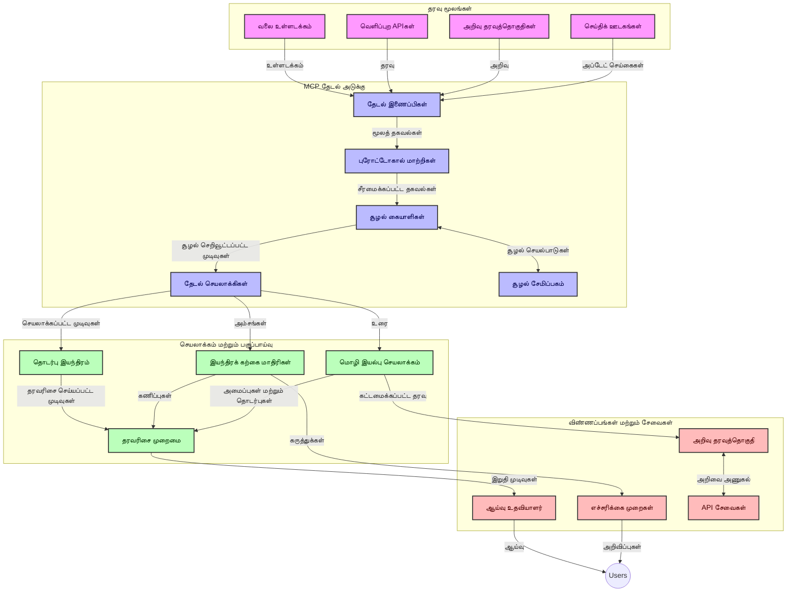
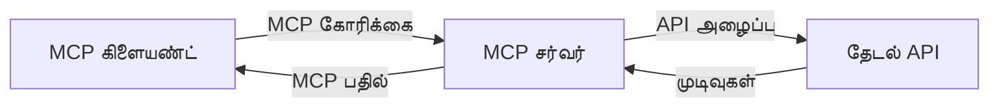
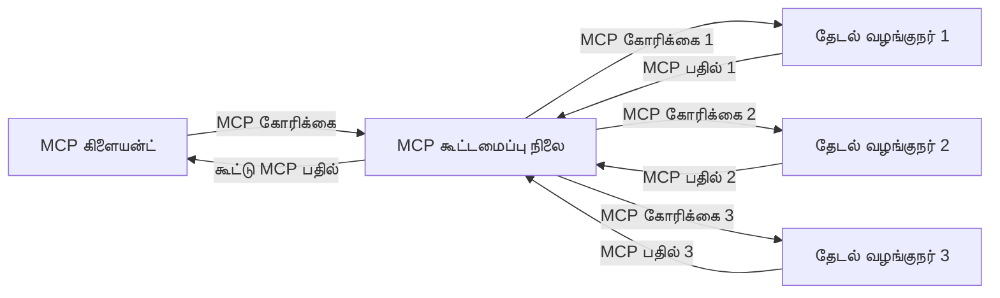
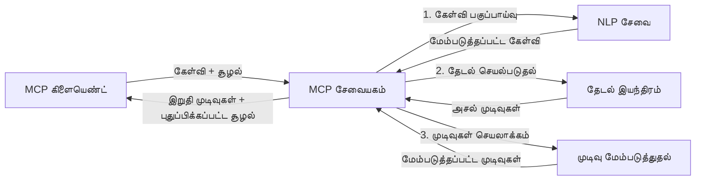

# நேரடி வலை தேடலுக்கான மாடல் சூழல் நெறிமுறை

## ஆய்வுரை

இன்று தகவல் சார்ந்த சூழலில், பயன்பாடுகள் இணையத்தில் இருந்து விரைவில் புதுப்பித்த தகவல்களை உடனடி அணுகலை தேவை படுத்துவதால், நேரடி வலை தேடல் அவசியமாகியுள்ளது, இது தொடர்புடையதும் காலோசிதமான பதில்களை வழங்க அனுமதிக்கிறது. மாடல் சூழல் நெறிமுறை (MCP) இந்த நேரடி தேடல் செயல்களை மேம்படுத்துவதில் முக்கிய முன்னேற்றமாகும், தேடல் திறனை உயர்த்துகிறது, சூழல் ஒருமித்தத்தன்மையை எததான் பராமரிக்கிறது மற்றும் மொத்த கணினி செயல்திறனை மேம்படுத்தும்.

இந்த பகுதி MCP எப்படி AI மாடல்கள், தேடல் இயந்திரங்கள் மற்றும் பயன்பாடுகளுக்கு இடையில் சூழல் மேலாண்மையை ஒருங்கிணைக்கும் ஒரு நிலைத்த தரமான அணுகுமுறையை வழங்கி நேரடி வலை தேடலை மாற்றுகிறதென்பதை ஆராய்கிறது.

### நீங்கள் கற்றுக்கொள்ளப்போகும் விஷயங்கள்

இந்த விரிவான கையேட்டில், நீங்கள் காண்பீர்கள்:

- MCP எப்படி AI மாடல்களுக்கும் நேரடி வலைத் தேடல் திறன்களுக்கும் இடையில் தடையற்ற பாலமாக செயல்படுகிறது
- MCP உடன் திறமையான மற்றும் விரிவாக்கக்கூடிய தேடல் தீர்வுகளுக்கான வடிவமைப்பு முறைமைகள்
- பல வினாக்கள் மற்றும் பரிமாற்றங்களுக்கு இடையில் தேடல் சூழலை பாதுகாப்பதற்கான நுட்பங்கள்
- பல்வேறு தேடல் சூழல்களுக்கு பைத்தான் மற்றும் ஜாவாஸ்கிரிப்ட் பயன்பாட்டில் நடைமுறை குறி குறியீடு செயலாக்கங்கள்
- MCP இயக்கும் தேடல் அமைப்புகளில் சம்பந்தம், சமீபத்திய தகவல் மற்றும் செயல்திறனை சமநிலைப்படுத்தும் முறைகள்

## நேரடி வலை தேடலுக்கான அறிமுகம்

நேரடி வலை தேடல் என்பதே அனுகும்போது இணையத்தில் அச்சிடப்படும் அல்லது புதுப்பிக்கப்படும் தகவலை தொடர்ச்சியாக கேள்வி, செயலாக்கம் மற்றும் பகுப்பாய்வு செய்வதற்கான தொழில்நுட்ப அணுகுமுறை ஆகும், இது குறைந்த தாமதத்துடன் புது மற்றும் தொடர்புடைய தகவலை வழங்க அமைப்புகளுக்கு உதவுகிறது. வழக்கமான தேடல் அமைப்புகள் உட்பட கண்காணிக்கப்பட்ட தரவுகளை நேரங்களாக அல்லது நாட்களாக பழையதாக வைத்திருக்கும் தொழில்நுட்பத்துடன் மாறுபட்டு, நேரடி தேடல் இணையதளத்திலிருந்து நேரடி தரவுகளை செயல்படுத்தி, ஆன்லைன் உள்ளடக்கத்தின் தற்போதைய நிலையை பிரதிபலிக்கும் தகவல்களையும் அறிவுகளை வழங்குகிறது.

### நேரடி வலைத் தேடலின் முக்கியக் கருத்துக்கள்:

- **தொடர்ச்சியான கேள்வி செயலாக்கம்**: தேடல் கேள்விகள் தொடரிருந்துள்ள புதுப்பித்த தரவுத்தளங்களுக்கு எதிராக செயல்படுத்தப்படுகின்றன
- **சமீபத்திய முன்னுரிமை**: அமைப்புகள் புதிது தகவலை முன்னுரிமை வைக்க வடிவமைக்கப்பட்டுள்ளன
- **சம்பந்தம் சமநிலை**: சம்பந்தம் மற்றும் சமீபத்தன்மை இடையே சமநிலையை பராமரித்தல்
- ** விரிவாக்கக்கூடிய معماري கை**: அமைப்புகள் மாறுபட்ட கேள்வி சுமை மற்றும் தரவு அளவுகளை கையாள வேண்டும்
- **சூழல் புரிதல்**: தேடல் முறைகள் முழுமையான மற்றும் அர்த்தமுள்ள முடிவுகளுக்காக பயனர் சூழலை பராமரித்து சென்றல் அவசியம்
- **மாற்றக்கூடிய கேள்வி மறுஅமைப்பு**: சூழல் மற்றும் முன்னைய முடிவுகளின் அடிப்படையில் கேள்விகளை ஒவ்வொரு முறையும் மாற்றுதல்
- **பல ஆதார ஒருங்கிணைப்பு**: பல தேடல் வழங்குநர்கள் மற்றும் இணைய ஆதாரங்களின் முடிவுகளை சேர்க்கிறது
- **அர்த்தம் அடங்கிய புரிதல்**:வார்த்தைகள் மட்டுமின்றி பொருள் அடிப்படையில் கேள்விகளையும் உள்ளடக்கத்தையும் செயலாக்குதல்
- **நேரடி தரவரிசை**: புதிதாக கிடைக்கும் தகவலுக்கு ஏற்ப முடிவுகளின் தரவரிசையை தொடர்ந்து மாற்றுதல்

### மாடல் சூழல் நெறிமுறை மற்றும் நேரடி வலை தேடல்

மாடல் சூழல் நெறிமுறை (MCP) நேரடி வலை தேடல் சூழல்களில் பல முக்கிய சவால்களைச் சமாளிக்கிறது:

1. **தேடல் சூழல் பாதுகாப்பு**: MCP தேடல் கூறுக்கள் இடையே சூழலை ஒருங்கிணைக்க சர்வதேச நெறிமுறையை வழங்குகிறது, அதனால் AI மாடல்கள் மற்றும் செயலாக்க வலையமைப்புகள் தொடர்புடைய கேள்வி வரலாறு மற்றும் பயனர் விருப்பங்களை அணுகக்கூடியவையாக இருக்கும்.

2. **திறமையான கேள்வி மேலாண்மை**: MCP சூழல் அனுப்புவதற்கான கட்டமைக்கப்பட்ட தலைமுறைகளை வழங்குவதால், ஒவ்வொரு தேடல் முறையிலும் சூழலை திரும்பத் தரும் மேலதிக சுமையை குறைக்கிறது.

3. **இணக்கம்**: MCP பல்வேறு தேடல் தொழில்நுட்பங்கள் மற்றும் AI மாடல்களுக்கிடையில் ஒரு பொதுவான மொழியை உருவாக்குகிறது, இதனால் விதிவிலக்கு மீண்டும் உருவாக்கப்படாமல் வளைந்தமைக்கக்கூடிய மற்றும் விரிவாக்கக்கூடிய அமைப்புகளை செய்ய முடிகிறது.

4. **தேடலுக்கு சிறந்த சூழல்**: MCP செயலாக்கங்கள் பயனுள்ள தேடலுக்கான மிகவும் தொடர்புடைய சூழல் கூறுகளை முன்னுரிமை அளிக்க முடியும், செயல்திறன் மற்றும் துல்லியத்திற்கும் பகிர்ந்து தருகிறது.

5. **மாற்றக்கூடிய தேடல் செயலாக்கம்**: MCP மூலம் சிறந்த சூழல் மேலாண்மையுடன், தேடல் அமைப்புகள் பயனர் தேவைகளின் மாற்றங்களையும் தகவல் நிலைகளையும் அடிப்படையாகக் கொண்டு செயலாக்கத்தை மாற்றி அமைக்க முடியும்.

செய்தி தொகுப்பு முதல் ஆராய்ச்சி உதவியாளர்கள் வரை பல நவீன பயன்பாடுகளில், MCP உடன் வலைதேடல் தொழில்நுட்பங்களின் ஒருங்கிணைப்பு அதிகமான அறிவுள்ள, சூழலை உணர்ந்த தேடலை வழங்குகிறது, பயனர் செயல்கள் தொடரும் போது மேலும் தொடர்புடைய முடிவுகளை வழங்கக்கூடியது.

## கற்றல் இலக்குகள்

இந்த பாடத்தின் முடிவில், நீங்கள் முடியும்:

- நேரடி வலை தேடல் அடிப்படைகளையும் அதன் நவீன பயன்பாடுகளில் உள்ள சவால்களையும் புரிந்து கொள்ள
- மாடல் சூழல் நெறிமுறை (MCP) நேரடி வலை தேடல் திறன்களை எவ்வாறு மேம்படுத்துகிறது என்பதை விளக்க
- பிரபலமான கூறி அமைப்புகள் மற்றும் API களைப் பயன்படுத்தி MCP அடிப்படையிலான தேடல் தீர்வுகளை செயல்படுத்த
- MCP உடன் விரிவாக்கக்கூடிய, உயர் செயல்திறனைக் கொண்ட தேடல் கட்டமைப்புகளை வடிவமைத்து நியமிக்க
- MCP கருத்துக்களை அர்த்தசார் தேடல், ஆராய்ச்சி உதவிகள் மற்றும் AI-வாய்ந்த உலாவல் உட்பட பல பயன்பாடுகளில் பயன்படுத்த
- MCP அடிப்படையிலான தேடல் தொழில்நுட்பங்களில் வெளிப்படும் புதிய போக்குகளையும் எதிர்கால புதுமைகளையும் மதிப்பாய்வு செய்
- பயனர் செயலிகள் மூலம் கற்றுக் கொள்ளும் சூழலை உணர்ந்த தேடல் அமைப்புகளை உருவாக்க
- MCP நிலைத்த நெறிமுறைகளைப் பயன்படுத்தி AI உதவியாளர்களில் வலை தேடல் திறன்களை ஒருங்கிணைக்க
- சூழல் அடிப்படையில் முடிவுகளை மெதுவாக விசாரணை செய்வதற்கான பல-நிலையான தேடல் குழாய்களை உருவாக்க
- முழுமையான சூழல் உணர்வுடன் தேடல் செயல்திறனைத் திறமையாக மேம்படுத்த

### வரையறை மற்றும் முக்கியத்துவம்

நேரடி வலை தேடல் குறைந்த தாமதத்துடன் இணையத்தில் அடிக்கடி கேள்வி, மீட்டெடு மற்றும் தகவல் வழங்குவதை உள்ளடக்கியது. வழக்கமான தேடல் இயந்திரங்கள் இணையத்தை காலசூத்திரப்படி குரோல் செய்து காப்பாற்றினாலும், நேரடி தேடல் தகவல் கிடைக்கும் போது உடனடியாக வெளிப்படுத்த உள்ளது, அதனால் தற்போதைய உள்ளடக்கத்திற்கு உடனடி அணுகல் உண்டு.

நேரடி வலை தேடலின் முக்கிய அம்சங்கள்:

- **புதுமை**: சமீபத்திய உள்ளடக்கம் மற்றும் புத்தக்களை முன்னுரிமை வைப்பது
- **தொடர்ச்சியான செயலாக்கம்**: புதிய தகவல்களை தொடர்ந்து கண்காணித்தல்
- **கேள்வி சீரமைப்பு**: சூழல் மற்றும் கருத்துக்கள அடிப்படையில் தேடல் கேள்விகளை மேம்படுத்தல்
- **உடனடி விநியோகம்**: குறைந்த தாமதத்துடன் தேடல் முடிவுகளை வழங்கல்
- **சூழல் பாதுகாப்பு**: மேம்பட்ட தொடர்பு பெறமுடியும் என்பதற்காக முந்தைய கேள்விகளின் அடிப்படையில் கட்டமைத்து இயக்குதல்

### பாரம்பரிய வலை தேடலில் சவால்கள்

நேரடி சூழலில் பயன்படுத்தும் போது பாரம்பரிய வலை தேடல் அணுகுமுறைகள் பல கட்டுப்பாடுகளுடன் நேரிடுகின்றன:

1. **சூழல் துண்டிப்பு**: பல கேள்விகளுக்கு இடையே தேடல் சூழலை பராமரிப்பதில் சிரமம்
2. **தথ்பதிவு புதுமை**: சமீபத்திய தகவலை அணுகுவதிலும் முன்னுரிமை அளிப்பதிலும் சவால்கள்
3. **ஓட்டுநர் குழப்பம்**: தேடல் அமைப்புகளுக்கும் பயன்பாடுகளுக்கும் இடையேயான இணக்கமில்லாத நிலைகள்
4. **தாமத பிரச்சனைகள்**: விரிவான தேடலும் பதில் நேர தேவைகளுடன் சமநிலைப்படுத்தல்
5. **சம்பந்தத் திருத்தம்**: துல்லியத்தையும் தொடர்பையும் சமீபத்தன்மையின் முன்னுரிமையுடன் உறுதிப்படுத்தல்

## தேடலுக்கான மாடல் சூழல் நெறிமுறை (MCP) புரிதல்

### தேடல் சூழலில் MCP என்றால் என்ன?

மாடல் சூழல் நெறிமுறை (MCP) என்பது AI மாடல்கள் மற்றும் பயன்பாடுகளுக்கிடையேயான திறமையான தொடர்பை பெற்றுக் கொள்ள ஒரு நிலைத்த தரமான தொடர்பு நெறிமுறையாக அமைந்துள்ளது. நேரடி வலை தேடல் சூழலில், MCP கீழ்க்காணும் அடிப்படை வகைகளை வழங்குகிறது:

- கேள்வி வரிசைகளின் முழுமையாக தேடல் சூழலை பாதுகாத்தல்
- தேடல் கேள்வி மற்றும் முடிவுகளுக்கான ஒரே மாதிரி வடிவமைப்புகளை நிலைநிறுத்தல்
- தேடல் அளவுருக்களை மற்றும் முடிவுகளை திறமையாக மாற்றம் செய்வது
- மாடல்-தேடல் இயந்திர தொடர்பை மேம்படுத்தல்

### முக்கிய கூறுகள் மற்றும் கட்டமைப்பு

நேரடி வலை தேடலுக்கான MCP கட்டமைப்பு பல முக்கிய கூறுகளைக் கொண்டுள்ளது:

1. **கேள்வி சூழல் நிர்வாகிகள்**: பல கேள்விகளுக்கு இடையே தேடல் சூழலை நிர்வகித்து பராமரிக்கின்றனர்
2. **தேடல் செயலாளர்கள்**: சூழல் உணர்வுடன் கூடிய முறைகளால் வரவிருக்கும் தேடல் கோரிக்கைகளை செயலாக்குதல்
3. **நெறிமுறை இடைமுகிகள்**: வேறு தேடல் API களை MCP சூழலை பராமரித்து மாற்றுகின்றன
4. **சூழல் கடை**: தேடல் வரலாறு மற்றும் விருப்பங்களை திறமையாக சேமித்து மீட்டெடுக்கும் இடம்
5. **தேடல் இணைப்பாளிகள்**: பல தேடல் இயந்திரங்கள் மற்றும் வலை API களை இணைக்கின்றனர்



### MCP எப்படி நேரடி வலை தேடலை மேம்படுத்துகிறது

MCP பாரம்பரிய வலை தேடல் சவால்களை இவ்வாறு சமாளிக்கிறது:

- **சூழல் தொடர்ச்சி**: முழு தேடல் அமர்வில் கேள்விகளுக்கிடையே தொடர்புகளை பராமரித்தல்
- **மிகைப்படுத்தப்பட்ட பரிமாற்றம்**: சீரியலான சூழல் மேலாண்மையால் தேடல் அளவுருக்களில் மீண்டும் மீண்டும் தரத்தை குறைத்தல்
- **நிலையான இடைமுகங்கள்**: தேடல் கூறுகளுக்கு ஒரே மாதிரிப் API களை வழங்கல்
- **தாமதம் குறைப்பு**: திறமையான சூழல் கையாளுதலால் செயலாக்க மேலதிக சுமையை குறைத்தல்
- **மேம்பட்ட தொடர்பு**: பல கேள்விகளுக்கிடையேயான பயனர் நோக்கத்தை காக்கிறது, அதனால் தேடல் தொடர்பு அதிகரிக்கும்

## ஒருங்கிணைப்பு மற்றும் செயலாக்கம்

நேரடி வலை தேடல் அமைப்புகள் செயல்திறன் மற்றும் சூழல் ஒருமித்தத்தன்மையை பராமரிக்க கவனமாக வடிவமைப்பதும் செயல்படுத்தவும் தேவை. மாடல் சூழல் நெறிமுறை AI மாடல்கள் மற்றும் தேடல் தொழில்நுட்பங்களை ஒருங்கிணைக்கும் நிலைத்த தரமான அணுகுமுறையை வழங்குகிறது, இது மேலும் நுணுக்கமான, சூழலை உணர்ந்த தேடல் குழாய்களை உருவாக்க உதவுகிறது.

### தேடல் கட்டமைப்புகளில் MCP ஒருங்கிணைப்பு மேலோட்டம்

நேரடி வலை தேடல் சூழல்களில் MCP செயல்படுத்தும் போது சில முக்கிய கருத்துக்கள்:

1. **தேடல் சூழல் தொடர் வரிசைப்படுத்தல்**: MCP தேடல் கோரிக்கைகளில் சூழல் தகவலை குறியாக்க குறித்த முறைகளை வழங்கி, தேடல் குழாயின் முழு செயலாக்கத்தில் முக்கிய சூழல் கேள்விக்கு பின் வரும் என்பதை உறுதி செய்கிறது. இதில் தேடல் தொடர்புடைய தகவல்களுக்கான நிலைத்தது தொடர் வடிவங்கள் அடங்கும்.

2. **நிலைத்த தேடல் செயலாக்கம்**: MCP பல முறை தேடல் முறைகளுக்கிடையே ஒரே நிலையான சூழல் பிரதிநிதித்துவத்தை பராமரித்து கூர்மையான நிலைத்த செயல்பாட்டை வழங்குகிறது. இது பல நிலை தேடல் குழாய்களில் சூழல் சீராக்கம் மூலம் முடிவுகளை மேம்படுத்துகிறது.

3. **கேள்வி விருத்தி மற்றும் சீரமைப்பு**: MCP செயலாக்கங்கள் தேடல் அமைப்புகளில் சேர்க்கப்பட்ட சூழலின் அடிப்படையில் கூர்மையான கேள்வி விருத்தி மற்றும் சீரமைப்பை எளிதாக்கி, தேடல் அமர்வு முன்னேறும் போது தொடர்புடைய முடிவுகளை அதிகரிக்க உதவுகிறது.

4. **முடிவு தளர்த்தல் மற்றும் முன்னுரிமை**: MCP சூழல் கையாளுதலை நிலைநிறுத்துவதன் மூலம் முடிவுகளை தளர்த்தவும் முன்னுரிமை வைக்கவும் உதவுகிறது, இதன் மூலம் கூறுகள் மாறும் தேடல் சூழலை அடிப்படையாக கொண்டாக இயங்குகின்றன.

5. **தேடல் கூட்டமைப்பு மற்றும் தொகுப்பு**: MCP பல பின்புலங்களை கொண்டு கூடிய தேடலை கூர்மையாக ஒழுங்குபடுத்தி, பல்வேறு மூலங்களிலிருந்து கிடைக்கும் முடிவுகளை அர்த்தப்பூர்வமாக ஒருங்கிணைக்கும் அமைப்பை வழங்குகிறது.

பல்வேறு தேடல் தொழில்நுட்பங்களில் MCP செயல்படுத்து அதன் தனிப்பட்ட ஒருங்கிணைப்பு குறியீடு தேவையை குறைத்து, தேடல் கேள்விகள் வளர்ந்துவரும்போது அர்த்தமுள்ள சூழலை பராமரிக்கும் திறனை மேம்படுத்துகிறது.

### MCP பல்வேறு வலை தேடல் செயல்படுத்தல்களில்

இந்த உதாரணங்கள் தற்போதைய MCP குறிப்புக்கேற்ப JSON-RPC அடிப்படையிலான நெறிமுறையை கவனித்து, தனித்துவமான கடத்தல் இயந்திரங்களைக் கொண்டவை. குறியீடு MCP நெறிமுறைக்கு முழுமையான பொருந்துதலுடன் தனிப்பயன் தேடல் ஒருங்கிணைப்பை எப்படி செயல்படுத்துவது என்பதை காட்டுகிறது.


<details>
<summary>Generic தேடல் API உடன் பைத்தான் செயலாக்கம்</summary>

```python
import asyncio
import json
import aiohttp
from typing import Dict, Any, Optional, List
from contextlib import asynccontextmanager
from collections.abc import AsyncIterator

# சாதாரண MCP நூலகங்களை இறக்குமதி செய்க
from mcp.client.session import ClientSession
from mcp.client.streamable_http import streamablehttp_client
from mcp.types import TextContent, CreateMessageRequestParams, CreateMessageResult
from mcp.server.fastmcp import FastMCP

# வலை தேடலுக்கான FastMCP சர்வரை உருவாக்குக
search_server = FastMCP("WebSearch")

# வலை தேடல் பணிகளை கையாளும் வகுப்பு
class WebSearchHandler:
    def __init__(self, api_endpoint: str, api_key: str):
        self.api_endpoint = api_endpoint
        self.api_key = api_key
        self.session = None
        
    async def initialize(self):
        """Initialize the HTTP session"""
        self.session = aiohttp.ClientSession(
            headers={"Authorization": f"Bearer {self.api_key}"}
        )
    
    async def close(self):
        """Close the HTTP session"""
        if self.session:
            await self.session.close()
            
    async def perform_search(self, query: str, max_results: int = 5, 
                           include_domains: List[str] = None, 
                           exclude_domains: List[str] = None,
                           time_period: str = "any") -> Dict[str, Any]:
        """Perform web search using the search API"""
        # தேடல் அளவுருக்களை அமைக்க
        search_params = {
            "q": query,
            "limit": max_results,
            "time": time_period
        }
        
        if include_domains:
            search_params["site"] = ",".join(include_domains)
            
        if exclude_domains:
            search_params["exclude_site"] = ",".join(exclude_domains)
        
        # தேடல் கோரிக்கையை செயற்படுத்துக
        try:
            async with self.session.get(
                self.api_endpoint,
                params=search_params
            ) as response:
                if response.status != 200:
                    error_text = await response.text()
                    raise Exception(f"Search API error: {response.status} - {error_text}")
                
                search_data = await response.json()
                
                # API-சார்ந்த பதிலை ஒரு சாதாரண வடிவிற்கு மாற்றுக
                results = []
                for item in search_data.get("results", []):
                    results.append({
                        "title": item.get("title", ""),
                        "url": item.get("url", ""),
                        "snippet": item.get("snippet", ""),
                        "date": item.get("published_date", ""),
                        "source": item.get("source", "")
                    })
                
                return {
                    "query": query,
                    "totalResults": len(results),
                    "results": results
                }
        except Exception as e:
            print(f"Search API request error: {e}")
            raise

# தேடல் ஹேண்ட்லரை துவக்குக
search_handler = WebSearchHandler(
    api_endpoint="https://api.search-service.example/search",
    api_key="your-api-key-here"
)

# தேடல் ஹேண்ட்லரை நிர்வகிக்க lifespan ஐ அமைக்க
@asyncio.asynccontextmanager
async def app_lifespan(server: FastMCP):
    """Manage application lifecycle"""
    await search_handler.initialize()
    try:
        yield {"search_handler": search_handler}
    finally:
        await search_handler.close()

# சர்வருக்கான lifespan ஐ அமைக்க
search_server = FastMCP("WebSearch", lifespan=app_lifespan)

# வலை தேடல் கருவியை பதிவு செய்க
@search_server.tool()
async def web_search(query: str, max_results: int = 5, 
                   include_domains: List[str] = None,
                   exclude_domains: List[str] = None,
                   time_period: str = "any") -> Dict[str, Any]:
    """
    Search the web for information
    
    Args:
        query: The search query
        max_results: Maximum number of results to return (default: 5)
        include_domains: List of domains to include in search results
        exclude_domains: List of domains to exclude from search results
        time_period: Time period for results ("day", "week", "month", "any")
        
    Returns:
        Dictionary containing search results
    """
    ctx = search_server.get_context()
    search_handler = ctx.request_context.lifespan_context["search_handler"]
    
    results = await search_handler.perform_search(
        query=query,
        max_results=max_results,
        include_domains=include_domains,
        exclude_domains=exclude_domains,
        time_period=time_period
    )
    
    return results

# உதாரண கிளையண்ட் பயன்பாடு
async def client_example():
    # Streamable HTTP போக்குவரத்தைக் கொண்டு தேடல் சர்வருடன் இணைக
    async with streamablehttp_client("http://localhost:8000/mcp") as (read, write, _):
        async with ClientSession(read, write) as session:
            # இணைப்பை துவக்குக
            await session.initialize()
            
            # web_search கருவியை அழைக்க
            search_results = await session.call_tool(
                "web_search", 
                {
                    "query": "latest developments in AI and Model Context Protocol",
                    "max_results": 5,
                    "time_period": "day",
                    "include_domains": ["github.com", "microsoft.com"]
                }
            )
            
            print(f"Search results: {search_results}")

# சர்வர் இயக்க உதாரணம்
if __name__ == "__main__":
    # Streamable HTTP போக்குவரத்துடன் சர்வரை இயக்குக
    search_server.run(transport="streamable-http")
```
</details> 

<details>
<summary>வலையமைப்பில் உள்ள தேடலுடன் ஜாவாஸ்கிரிப்ட் செயலாக்கம்</summary>


```javascript
// வலைத் தேடலுக்கான MCP சேவையகம் అమలు
import { McpServer, ResourceTemplate } from '@modelcontextprotocol/sdk/server/mcp.js';
import { StreamableHTTPServerTransport } from '@modelcontextprotocol/sdk/server/streamableHttp.js';
import { z } from 'zod';

// வலைத் தேடலுக்கான MCP சேவையகத்தை உருவாக்கவும்
const searchServer = new McpServer({
    name: "BrowserSearch",
    description: "A server that provides web search capabilities"
});

// தேடல் சேவை வகுப்பு
class SearchService {
    constructor(searchApiUrl, apiKey) {
        this.searchApiUrl = searchApiUrl;
        this.apiKey = apiKey;
    }

    async performSearch(parameters) {
        const {
            query = '',
            maxResults = 5,
            includeDomains = [],
            excludeDomains = [],
            timePeriod = 'any'
        } = parameters;
        
        // அளவுருக்களுடன் தேடல் URL ஐ உருவாக்கவும்
        const url = new URL(this.searchApiUrl);
        url.searchParams.append('q', query);
        url.searchParams.append('limit', maxResults);
        url.searchParams.append('time', timePeriod);
        
        if (includeDomains.length > 0) {
            url.searchParams.append('site', includeDomains.join(','));
        }
        
        if (excludeDomains.length > 0) {
            url.searchParams.append('exclude_site', excludeDomains.join(','));
        }
        
        try {
            const response = await fetch(url.toString(), {
                method: 'GET',
                headers: {
                    'Authorization': `Bearer ${this.apiKey}`,
                    'Content-Type': 'application/json'
                }
            });
            
            if (!response.ok) {
                const errorText = await response.text();
                throw new Error(`Search API error: ${response.status} - ${errorText}`);
            }
            
            const searchData = await response.json();
            
            // API-சிறப்பான பதிலை ஒரு நிலையான வடிவத்திற்கு மாற்றவும்
            const results = searchData.results?.map(item => ({
                title: item.title || '',
                url: item.url || '',
                snippet: item.snippet || '',
                date: item.published_date || '',
                source: item.source || ''
            })) || [];
            
            return {
                query,
                totalResults: results.length,
                results
            };
        } catch (error) {
            console.error('Search API request error:', error);
            throw error;
        }
    }
}

// தேடல் சேவையை துவக்கம் செய்க
const searchService = new SearchService(
    'https://api.search-service.example/search',
    'your-api-key-here'
);

// சேவையகத்திற்கான சூழல் வழங்குநரை அமைக்கவும்
searchServer.setContextProvider(() => {
    return {
        searchService
    };
});

// வலைத் தேடல் கருவியை பதிவு செய்யவும்
searchServer.tool({
    name: 'web_search',
    description: 'Search the web for information',
    parameters: {
        type: 'object',
        properties: {
            query: {
                type: 'string',
                description: 'The search query'
            },
            maxResults: {
                type: 'integer',
                description: 'Maximum number of results to return',
                default: 5
            },
            includeDomains: {
                type: 'array',
                items: { type: 'string' },
                description: 'List of domains to include in search results'
            },
            excludeDomains: {
                type: 'array',
                items: { type: 'string' },
                description: 'List of domains to exclude from search results'
            },
            timePeriod: {
                type: 'string',
                description: 'Time period for results',
                enum: ['day', 'week', 'month', 'any'],
                default: 'any'
            }
        },
        required: ['query']
    },
    handler: async (params, context) => {
        const { searchService } = context;
        return await searchService.performSearch(params);
    }
});

// தேடல் சேவையகத்துடன் இணைக்க உதவும் எடுத்துக்காட்டு கிளையன்ட் குறியீடு
import { Client } from '@modelcontextprotocol/sdk/client/index.js';
import { StreamableHTTPClientTransport } from '@modelcontextprotocol/sdk/client/streamableHttp.js';

async function connectToSearchServer() {
    // தேடல் சேவையகத்துடன் இணைக்கவும்
    const transport = new StreamableHTTPClientTransport(
        new URL('http://localhost:8000/mcp')
    );
    
    const client = new Client({
        name: 'search-client',
        version: '1.0.0'
    });
    
    await client.connect(transport);
    
    // தேடல் கருவியை இயக்கவும்
    const searchResults = await client.callTool({
        name: 'web_search',
        arguments: {
            query: 'Model Context Protocol implementation examples',
            maxResults: 10,
            timePeriod: 'week',
            includeDomains: ['github.com', 'docs.microsoft.com']
        }
    });
    
    console.log('Search results:', searchResults);
    
    // சுத்தம் செய்யவும்
    await client.disconnect();
}

// சேவையகத்தை துவக்கவும்
const transport = new StreamableHTTPServerTransport();
await searchServer.connect(transport);
console.log('Search server running at http://localhost:8000/mcp');

// வேறு செயலியில் அல்லது சேவையகம் துவங்கிய பிறகு
// connectToSearchServer().catch(console.error);
```
</details> 


## குறியீடு உதாரணங்கள் குறிப்பு

> **முக்கிய குறிப்பு**: கீழே உள்ள குறியீடு உதாரணங்கள் மாடல் சூழல் நெறிமுறை (MCP) உடன் வலை தேடல் செயல்திறனை இணைத்ததை காட்டுகின்றன. அவை அதிகாரபூர்வ MCP SDKகளின் முறைமைகளையும் கட்டமைப்புகளையும் பின்பற்றினாலும் கல்வி நோக்கத்திற்காக எளிமைப்படுத்தப்பட்டவை.
> 
> இந்த உதாரணங்கள் காட்டுகின்றன:
> 
> 1. **பைத்தான் செயலாக்கம்**: ஒரு FastMCP சர்வர் செயலாக்கம் என்பதால் வலை தேடல் கருவியை வழங்கி வெளிப்புற தேடல் APIயுடன் இணைக்கிறது. இந்த உதாரணம் அதிகாரபூர்வ MCP Python SDKயின் [more info](https://github.com/modelcontextprotocol/python-sdk) பாணிகளை பின்பற்றி ஆயுள் மேலாண்மை, சூழல் கையாளுதல் மற்றும் கருவி செயல்பாட்டை சரியான முறையில் செய்கிறது. சர்வர் பரிந்துரைக்கப்படும் Streamable HTTP வடிவுக் கடத்தலைப் பயன்படுத்துகிறது, இது பழைய SSE வடிவத்தை முற்றிலும் மாற்றியுள்ளது.
> 
> 2. **ஜாவாஸ்கிரிப்ட் செயலாக்கம்**: அதிகாரபூர்வ MCP TypeScript SDKயின் [more info](https://github.com/modelcontextprotocol/typescript-sdk) FastMCP முறைமையைப் பயன்படுத்தி தேடல் சர்வரை உருவாக்கும் TypeScript/JavaScript செயல்பாடு ஆகும். இதில் சரியான கருவி வரையறை மற்றும் கிளையண்ட் இணைப்புகளை உள்ளடக்குகிறது. அமர்வு மேலாண்மை மற்றும் சூழல் பாதுகாப்புக்கான புதிய பரிந்துரைக்கப்பட்ட முறைமைகளை பின்பற்றுகிறது.
> 
> இந்த உதாரணங்களில் மேலதிக பிழை கையாளுதல், அங்கீகார செயல் மற்றும் குறிப்பிட்ட API இணைப்பு குறியீடு தேவைப்படும். தேடல் API புதுக்கப்பட்ட முகவரிகள் (`https://api.search-service.example/search`) இடமாற்றியக்கூடியவை.
> 
> முழுமையான செயல்படு விவரங்கள் மற்றும் சமீபத்திய அணுகுமுறைகளுக்கு அதிகாரபூர்வ MCP குறிப்பிடல் மற்றும் SDK ஆவணங்கள் பார்க்கவும்.

## முக்கியக் கருத்துக்கள்

### மாடல் சூழல் நெறிமுறை (MCP) கட்டமைப்பு

அதன் அடிப்படையில், மாடல் சூழல் நெறிமுறை AI மாடல்களுக்கும் பயன்பாடுகளுக்கும் சேவைகளுக்கும் இடையே சூழல் பரிமாற்றத்தின் நிலைத்ததான முறையை வழங்குகிறது. நேரடி வலை தேடலில், இந்த கட்டமைப்பு ஒருங்கிணைந்த, பலசரி தேடல் அனுபவத்தை உருவாக்க அவசியம். முக்கிய கூறுகள்:

1. **கிளையண்ட்-சர்வர் கட்டமைப்பு**: MCP தேடல் கிளையண்ட்கள் (விமர்சனவர்கள்) மற்றும் தேடல் சர்வர்கள் (வழங்குநர்கள்) இடையே தெளிவான பிரிவை உருவாக்கி, வளைந்த அமைப்பை அனுமதிக்கிறது.

2. **JSON-RPC தொடர்பு**: நெறிமுறை செய்திகளுக்கு JSON-RPC பயன்படுத்தி, இணையத் தொழில்நுட்பங்களோடு பொருந்தக்கூடியதாகவும் பல தளங்களில் செயல்பட இயலக்கூடியதாகவும் உள்ளது.

3. **சூழல் மேலாண்மை**: MCP பல பரிமாற்றங்களுக்கிடையே தேடல் சூழலை பராமரித்து புதுப்பித்து பயன்படுத்துவதற்கான கட்டமைக்கப்பட்ட முறைகளை வரையறுக்கிறது.

4. **கருவி வரையறைகள்**: தேடல் திறன்கள் நிலைத்த கருவிகளாக வெளிப்படுத்து, அவற்றுக்கு நன்கு வரையறுக்கப்பட்ட அளவுருக்கள் மற்றும் திரும்பும் மதிப்புகள் உள்ளன.

5. **செறிவூட்டும் ஆதரவு**: நேரடி தேடலில் முடிவுகள் பகிர்ந்தளிக்கப்படும்போது தொடர்ச்சியாக வரம்புக்குள் வழங்கும் ஆதரவையும் நெறிமுறை வழங்குகிறது.

### வலை தேடல் ஒருங்கிணைப்பு முறைமைகள்

MCP ஐ வலை தேடலுடன் ஒருங்கிணைக்கும் போது பல முறைமைகள் உருவாகின்றன:

#### 1. நேரடி தேடல் வழங்குநர் ஒருங்கிணைப்பு



இந்த முறைமையில் MCP சர்வர் நேருக்கு நேர் ஒரு அல்லது அதற்கு மேற்பட்ட தேடல் API களை அணுகி, MCP கோரிக்கைகளை API-சிறப்பு அழைப்புகளாக மாற்றி, முடிவுகளை MCP பதில்களாக வடிவமைக்கிறது.

#### 2. சூழல் பாதுகாப்புடன் கூடிய கூட்டுத்திரட்டு தேடல்



இந்த முறைமை MCP பொருந்தக்கூடிய பல தேடல் வழங்குநர்களுக்கு தேடல் கேள்விகளை பகிர்ந்து பகுதி வகுத்து வழங்குவதோடு, ஒற்றுப்பட்ட சூழலை பராமரிக்கிறது; ஒவ்வொருவரும் வேறுபட்ட உள்ளடக்க வகை அல்லது தேடல் திறனுகளில் சிறப்பு பெற்றிருக்கலாம்.

#### 3. சூழல் சரிபார்க்கப்பட்ட தேடல் சங்கிலி



இந்த முறைமையில் தேடல் செயல்முறை பல நிலைகளாக்கி, ஒவ்வொரு படியிலும் சூழல் மேம்படுத்தப்படும், இதனால் நிலையான தொடர்புடன் தொடர்புடைய முடிவுகள் மெதுவாக அதிகரிக்கும்.

### தேடல் சூழல் கூறுகள்

MCP சார்ந்த வலை தேடலில் சுற்றுச்சூழல் பொதுவாக:

- **கேள்வி வரலாறு**: அமர்வில் முன்னைய தேடல் கேள்விகள்
- **பயனர் விருப்பங்கள்**: மொழி, பகுதி, பாதுகாப்பான தேடல் அமைப்புகள்
- **இணைய நடவடிக்கைகள் வரலாறு**: எவை கிளிக் செய்யப்பட்டன, முடிவுகளில் செலவிடப்பட்ட நேரம்
- **தேடல் அளவுருக்கள்**: வடிகட்டிகள், வரிசைப்படுத்தல்கள் மற்றும் பிற தேடல் மாற்றிகளைக் கொண்டவை
- **தொழில்நுட்ப அறிவு**: தேடலுடன் தொடர்புடைய துறைத்தகவல்
- **கால குறிப்புகள்**: நேர அடிப்படையிலான தொடர்பு காரணிகள்
- **ஆதார விருப்பங்கள்**: நம்பகமான அல்லது முன்னுரிமை அளிக்கும் தகவல் மூலங்கள்

## பயன்பாடுகள் மற்றும் பயன்பாட்துறை

### ஆராய்ச்சி மற்றும் தகவல் திரட்டல்

MCP ஆராய்ச்சி வேலைமுறைகளை மேம்படுத்துகிறது:

- தேடல் அமர்வுகளுக்கு இடையேயான ஆராய்ச்சி சூழலை பாதுகாக்கிறது
- கூர்மையான மற்றும் சூழலை பூரிப்பதற்கான கேள்விகளை சாத்தியம் செய்கிறது
- பல ஆதார தேடல் கூட்டுமூலத்தை ஆதரிக்கிறது
- தேடல் முடிவுகளிலிருந்து அறிவைப் பெற்றல் எளிதாக்குகிறது

### நேரடி செய்தி மற்றும் போக்குகள் கண்காணிப்பு

MCP இயக்கும் தேடல் செய்தி கண்காணிப்பில் பல நன்மைகள் வழங்குகிறது:

- வெளியே வரும் செய்தி கதைமறைகளை சுமார் நேரத்தில் கண்டுபிடித்தல்
- தொடர்புடைய தகவல்களை சூழலுக்கேற்ப வடிகட்டி வழங்கல்
- பல மூலங்களின் தலைமை மற்றும் பொருள் கண்காணிப்பு
- பயனர் சூழல் அடிப்படையிலான தனிப்பட்ட செய்தி அறிவிப்புகள்

### AI-வாய்ந்த உலாவல் மற்றும் ஆராய்ச்சி

MCP AI-வாய்ந்த உலாவலுக்கான புதிய வாயில்களை உருவாக்குகிறது:

- தற்போதைய உலாவல் செயல்பாட்டின் அடிப்படையில் சூழல் சார்ந்த தேடல் பரிந்துரைகள்
- வலை தேடலை LLM ஆதரவு உதவியாளர்களுடன் ஒருங்கிணைத்தல்
- பராமரிக்கப்பட்ட சூழலுடன் பல-முறைத் தேடல் சீர்திருத்தம்
- மேம்பட்ட விலக்கீடு மற்றும் தகவல் சரிபார்ப்பு

## எதிர்கால போக்குகள் மற்றும் புதுமைகள்

### வலை தேடலில் MCP முன்னேற்றம்

எதிர்காலத்தில் MCP எதிர்கொள்ளஉள்ள எதிர்கால அவர்கள்:


- **பல்வேறு வகை தேடல்**: உரை, படம், ஒலி மற்றும் வீடியோ தேடலை ஒட்டுமொத்தக் காட்சியுடன் ஒருங்கிணைக்கும்
- **பிரிவினையில்லா தேடல்**: பகிர்ந்தும் கூட்டமைக்கப்பட்ட தேடல் පරිசரங்களை ஆதரிக்கும்
- **தேடல் தனியுரிமை**: சூழல் அறிவு கொண்ட தனியுரிமை பாதுகாக்கும் தேடல் கருவிகள்
- **வினாவுகையை புரிதல்**: இயற்கை மொழி தேடல் வினாக்களின் ஆழ்ந்த அர்த்த பகிற்மை

### தொழில்நுட்பத்தில் எதிர்கால முன்னேற்றங்கள்

MCP தேடலை உருவாக்கும் வெளிப்படும் தொழில்நுட்பங்கள்:

1. **நரம்பு தேடல் கட்டமைப்புகள்**: MCP க்கு ஒழுங்குபடுத்தப்பட்ட புதுப்பிக்கப்பட்ட அடிப்படையிலான தேடல் முறைகள்
2. **தனிப்பயன் தேடல் சூழலைப் பார்**: தனிப்பட்ட பயனாளர் தேடல் நடைமுறைகளை காலப்போக்கில் கற்றுக்கொள்ளல்
3. **அறிவு வரைபட ஒருங்கிணைப்பு**: துறை சார்ந்த அறிவு வரைபடங்களால் மேம்படுத்தப்பட்ட சூழல் சார்ந்த தேடல்
4. **கடந்து செல்லும் வகை சூழல்**: வெவ்வேறு தேடல் விதிகளைத் தாண்டி சூழலை பராமரித்தல்

## கைபடிகள் பயிற்சிகள்

### பயிற்சி 1: ஒரு அடிப்படை MCP தேடல் குழாயை அமைத்தல்

இந்த பயிற்சியில், நீங்கள் கற்றுக்கொள்வீர்கள்:
- ஒரு அடிப்படை MCP தேடல் சூழலை கட்டமைத்தல்
- வலை தேடலுக்கான சூழல் மேலாளர்களை செயல்படுத்தல்
- தேடல் சுற்றுப்பயணங்களில் சூழலை பராமரிப்பதை பரிசோதித்து உறுதிப்படுத்தல்

### பயிற்சி 2: MCP தேடலை கொண்டு ஆய்வுக் உதவியாளர் உருவாக்கல்

ஒரு முழுமையான பயன்பாட்டை உருவாக்கவும்:
- இயற்கை மொழி ஆய்வு கேள்விகளின் செயலாக்கம்
- சூழல் அறிவு கொண்ட வலை தேடல்களைச் செய்தல்
- பல மூலங்களிலிருந்த தகவல்களை தொகுத்தல்
- ஒழுங்குபடுத்தப்பட்ட ஆய்வு முடிவுகளை வழங்கல்

### பயிற்சி 3: MCP உடன் பல மூல தேடல் கூட்டமைப்பை செயல்முறைப்படுத்தல்

விரிவான பயிற்சி:
- பல தேடல் இயந்திரங்களுக்கு சூழல் அறிவு கொண்ட வினாக்குழலை அனுப்புதல்
- முடிவுகளின் தரவரிசையும் தொகுப்பும்
- தேடல் முடிவுகளின் சூழல் சார்ந்த மேலது திரட்டி நீக்கம்
- மூலத்தில் உள்ள குறிப்பிட்ட தரவுக்களை கையாளுதல்

## கூடுதல் வளங்கள்

- [Model Context Protocol Specification](https://spec.modelcontextprotocol.io/) - அதிகாரப்பூர்வ MCP விவரம் மற்றும் விரிவான புரோட்டோக்கால் ஆவணம்
- [Model Context Protocol Documentation](https://modelcontextprotocol.io/) - விரிவான வகுப்பு மற்றும் செயல்முறை வழிகாட்டிகள்
- [MCP Python SDK](https://github.com/modelcontextprotocol/python-sdk) - MCP புரோட்டோக்காலின் அதிகாரப்பூர்வ Python நடைமுறை
- [MCP TypeScript SDK](https://github.com/modelcontextprotocol/typescript-sdk) - MCP புரோட்டோக்காலின் அதிகாரப்பூர்வ TypeScript நடைமுறை
- [MCP Reference Servers](https://github.com/modelcontextprotocol/servers) - MCP சேவையாளர்களின் மேற்கோள் நடைமுறைகள்
- [Bing Web Search API Documentation](https://learn.microsoft.com/en-us/bing/search-apis/bing-web-search/overview) - Microsoft இன் வலை தேடல் API
- [Google Custom Search JSON API](https://developers.google.com/custom-search/v1/overview) - Google இன் சுயிகர்பு தேடல் இயந்திரம்
- [SerpAPI Documentation](https://serpapi.com/search-api) - தேடல் இயந்திர முடிவுப் பக்கம் API
- [Meilisearch Documentation](https://www.meilisearch.com/docs) - திறந்த மூல தேடல் இயந்திரம்
- [Elasticsearch Documentation](https://www.elastic.co/guide/index.html) - பகிர்ந்த தேடல் மற்றும் பகுப்பாய்வு இயந்திரம்
- [LangChain Documentation](https://python.langchain.com/docs/get_started/introduction) - LLM களுடன் பயன்பாடுகள் உருவாக்கல்

## அறிதல் முடிவுகள்

இந்த பகுதியை முடிப்பதன் மூலம், நீங்கள் செய்வதைக் கற்றுக் கொள்வீர்கள்:

- நேரடி வலை தேடல் அடிப்படைகள் மற்றும் அதனுடைய சவால்களை புரிந்துகொள்ளல்
- Model Context Protocol (MCP) எப்படி நேரடி வலை தேடல் திறன்களை மேம்படுத்துகிறது என்பதை விளங்குதல்
- பரவலான கட்டமைப்புகள் மற்றும் APIகளை பயன்படுத்தி MCP அடிப்படையிலான தேடல் தீர்வுகளை செயல்படுத்தல்
- MCP உடன் அளவிடக்கூடிய, உயர் செயல்திறனுள்ள தேடல் கட்டமைப்புகளை வடிவமைத்தல் மற்றும் பூர்த்தி செய்தல்
- அர்த்தபூர்வ தேடல், ஆய்வு உதவி மற்றும் AI ஆதார ணி உலாவல் உள்ளிட்ட பல்வேறு பயன்பாடுகளில் MCP கான்செப்ட்களை பயன்படுத்தல்
- MCP அடிப்படையிலான தேடல் தொழில்நுட்பங்களில் வெளிப்படுவும் எதிர்கால கண்டுபிடிப்புகளையும் மதிப்பீடு செய்தல்


### நம்பிக்கை மற்றும் பாதுகாப்பு பரிசீலனைகள்

MCP அடிப்படையிலான வலை தேடல் தீர்வுகளை செயல்படுத்தும் போது, MCP விவரம் இல் உள்ள முக்கியக் கொள்கைகளை நினைவில் வையுங்கள்:

1. **பயனாளர் அனுமதி மற்றும் கட்டுப்பாடு**: அனைத்து தரவு அணுகல் மற்றும் செயல்பாடுகளுக்கும் பயனாளர்கள் தெளிவாக ஒப்புதல் அளிக்கவேண்டும் மற்றும் புரிந்துகொள்ள வேண்டும். வெளிப்புற தரவுக் குறிப்புகள் அடக்கமுள்ள வலை தேடல் பயன்பாடுகளுக்கு இது மிகவும் முக்கியம்.

2. **தரவு தனியுரிமை**: தேடல் வினாக்கள் மற்றும் முடிவுகளை முறையாக கையாள்வதை உறுதி செய்யவும், குறிப்பாக அவை நுண்ணறிவு தகவல்களை கொண்டிருக்கும் போது. பயனாளர் தரவை பாதுகாக்கும் வகையில் உரிய அணுகல் கட்டுப்பாடுகளை செயல்படுத்துங்கள்.

3. **கருவி பாதுகாப்பு**: தேடல் கருவிகளுக்கு உரிய அங்கீகாரம் மற்றும் சரிபார்ப்புகளை செயல்படுத்தவும், ஏனெனில் அவை தவறான குறியீடு இயங்குதலுக்கான பாதுகாப்பு அபாயங்களாக இருக்க வாய்ப்புள்ளது. கருவி நடத்தை விளக்கங்கள் நம்பத்தகாதவை என கருதப்பட வேண்டும், தவிர பெற்ற இடம் நம்பகமான சேவையகம் ஆக இருந்தால் மட்டுமே.

4. **தெளிவான ஆவணங்கள்**: MCP தகவலறிக்கையின் செயல்பாட்டுக் கையேடுகளை பின்பற்றி, உங்கள் MCP அடிப்படையிலான தேடல் செயல்பாடுகளின் திறன்கள், வரம்புகள் மற்றும் பாதுகாப்பு பரிசீலனைகள் குறித்த தெளிவான ஆவணங்களை வழங்கவும்.

5. **திடமான ஒப்புதல் செயல்பாடுகள்**: வெளிப்புற வலை வளங்களுடன் தொடர்புடைய கருவிகளுக்கு முன்னதாக அதன் பயன்பாட்டை அங்கீகரிப்பதற்கு முன் என்ன செய்கிறது என்பதில் தெளிவு வழங்கும் திடமான ஒப்புதல் மற்றும் அங்கீகாரம் நடைமுறைகளை உருவாக்கவும்.

MCP பாதுகாப்பு மற்றும் நம்பிக்கை பரிசீலனைகளின் முழு விவரங்களுக்கு, [அதிகாரப்பூர்வ ஆவணங்களை](https://modelcontextprotocol.io/specification/2025-11-25/basic/security_best_practices) பார்க்கவும்.

## அடுத்து என்ன ஒன்று

- [5.12 Entra ID Authentication for Model Context Protocol Servers](../mcp-security-entra/README.md)

---

<!-- CO-OP TRANSLATOR DISCLAIMER START -->
**மறுப்பு**:
இந்த ஆவணம் AI மொழிபெயர்ப்பு சேவை [Co-op Translator](https://github.com/Azure/co-op-translator) பயன்படுத்தி மொழிபெயர்க்கப்பட்டுள்ளது. நாங்கள் துல்லியத்திற்காக முயற்சி செய்துள்ளோம், ஆனால் தானாக செய்யப்படும் மொழிபெயர்ப்புகளில் பிழைகள் அல்லது தவறுகள் இருக்கலாம் என்பதை கவனத்தில் கொள்ளவும். அசல் ஆவணம் அதன் தாய்மொழியில் அதிகாரப்பூர்வ ஆதாரமாக கருதப்பட வேண்டும். முக்கியமான தகவல்களுக்கு, தொழில்நுட்பமான மனித மொழிபெயர்ப்பு பரிந்துரைக்கப்படுகிறது. இந்த மொழிபெயர்ப்பைப் பயன்படுத்துவதால் ஏற்படும் எந்த தவறான புரிதல்கள் அல்லது தவறான விளக்கத்திற்கும் நாங்கள் பொறுப்பில்வில்லை.
<!-- CO-OP TRANSLATOR DISCLAIMER END -->