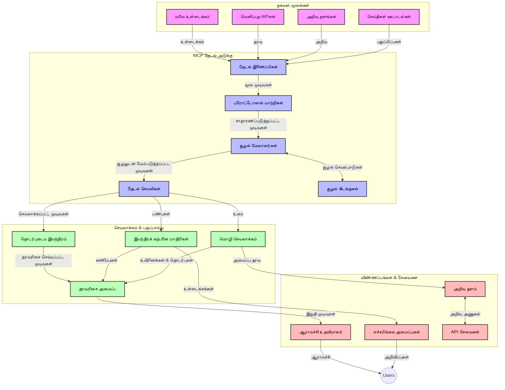
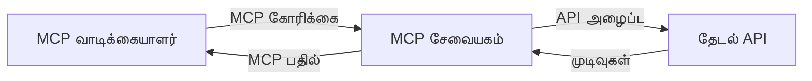
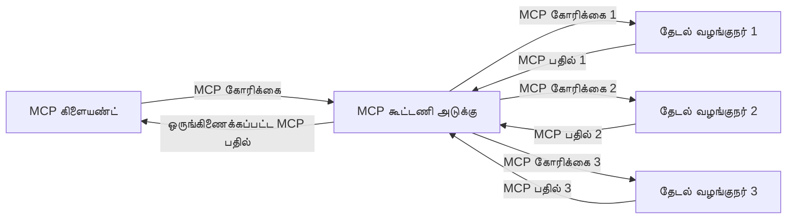
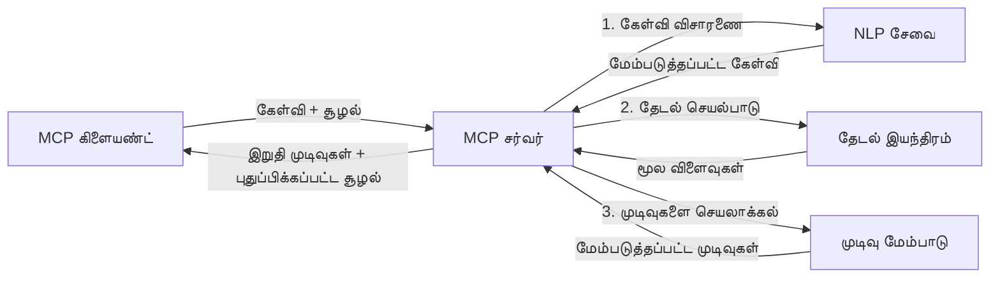

# நேரடி இணைய தேடலுக்கான மாதிரி பரிமாண ஒப்பந்தம்

## அவலோகனம்

இன்று தகவல் இயக்கப்பட்ட சூழலில் நேரடி இணைய தேடல் தேவையானதாக மாறியுள்ளது, அங்கு பயன்பாடுகள் இணையத்தின் முழுவதும் சமீபத்திய தகவலுக்கு உடனடி அணுகலை தேவைபடுகின்றன பொருத்தமான மற்றும் காலத்துக்கு ஏற்ப பதில்களை வழங்க. மாதிரி பரிமாண ஒப்பந்தம் (MCP) இந்த நேரடி தேடல் செயல்முறைகளை மேம்படுத்தும் முக்கிய முன்னேற்றத்தை பிரதிநிதித்துவப்படுத்துகிறது, தேடல் திறனை மேம்படுத்தும், பரிமாண அடையாளத்தை பேணும் மற்றும் மொத்த அமைப்பின் செயல்திறனை மேம்படுத்துகிறது.

இந்த தொகுதி, AI மாதிரிகள், தேடல் இயந்திரங்கள் மற்றும் பயன்பாடுகளுக்கு இடையேயான பரிமாண மேலாண்மைக்கு ஒரு ஒழுங்குபடுத்தப்பட்ட அணுகுமுறையை வழங்குவதன் மூலம் MCP எப்படி நேரடி இணைய தேடலை மாற்றுகிறது என்பதை ஆராய்கிறது.

### நீங்கள் கற்கப்போகும் விஷயங்கள்

இந்த விரிவான வழிகாட்டியில், நீங்கள் கண்டறியப்போகும்:

- MCP எப்படி AI மாதிரிகளுக்கும் நேரடி இணைய தேடல் செயல்திறனுக்கும் இடையேயான ஒருங்கிணைப்பை உருவாக்குகிறது
- MCP உடன் திறமையான மற்றும் வலுவான தேடல் தீர்வுகளை நடைமுறைப்படுத்தும் கட்டமைப்பு மொத்தங்கள்
- பல கேள்விகளுக்கும் தொடர்பு கையாளும் போது தேடல் பரிமாணத்தை பாதுகாப்பதற்கான தொழில்நுட்பங்கள்
- பல தேடல் நிலைகளுக்கான Python மற்றும் JavaScript இல் நடைமுறை குறியீடு செயல்பாடுகள்
- MCP-ஆல் இயக்கப்படும் தேடல் அமைப்புகளில் பொருத்தம், சமீபத்திய நிலை மற்றும் செயல்திறனை சமம் செய்கின்ற முறைகள்

## நேரடி இணைய தேடலுக்கான அறிமுகம்

நேரடி இணைய தேடல் என்பது இணையத்தில் வெளியிடப்படும் அல்லது புதுப்பிக்கப்படும் தரவுகளுக்கு தொடர்ச்சியான கேள்வி, செயலாக்கம் மற்றும் பகுப்பாய்வை நோக்கமாகக் கொண்ட தொழில்நுட்ப அணுகுமுறை ஆகும்; இது அமைப்புகள் குறைந்த தாமதத்துடன் புதிய மற்றும் பொருத்தமான தகவலை வழங்க உதவுகிறது. பழைய முறையான தேடல் அமைப்புகள் வரையறுக்கப்பட்ட தரவு மீது இயங்குவதைவிட, நேரடி தேடல் இணையதளத்திலிருந்து நேரடி தரவை செயல்படுத்தி, ஆன்லைன் உள்ளடக்கத்தின் தற்போதைய நிலையை பிரதிபலிக்கும் தகவல்களை வழங்குகிறது.

### நேரடி இணைய தேடலின் முக்கிய கருத்துக்கள்:

- **தொடர் கேள்வி செயலாக்கம்**: தேடல் கேள்விகள் தொடர்ச்சியான புதுப்பிக்கும் தரவுகளுக்கு எதிராக செயல்படுத்தப்படுகின்றன
- **சமீபத்திய முன்னுரிமை**: அமைப்புகள் புதிய தகவலை முன்னுரிமையாக்க வைக்கப்படுகின்றன
- **பொருத்தமான சமநிலை**: பொருத்தம் மற்றும் சமீபத்திய நிலைக்கு இடையேயான சமநிலையை பேணுதல்
- **வளர்ந்து கொண்ட கட்டமைப்பு**: கிடைக்கும் கேள்வி சுமைகளை மற்றும் தரவு அளவுகளையும் கையாளுதல்
- **பொருளாதார கருத்து**: பயனர் பரிமாணத்தை பல தேடல் சுழற்சிகளுக்கு மரபாக்கும் முக்கியத்துவம்
- **தொடர்ந்து புதுப்பிக்கும் கேள்வி மறுசீரமைப்பு**: பரிமாணம் மற்றும் கடந்த முடிவுகளின் அடிப்படையில் கேள்விகளை தானாக சீரமைத்தல்
- **பல்வருட்சை ஆதார ஒருங்கிணைப்பு**: பல தேடல் சேவையகங்கள் மற்றும் இணைய ஆதாரங்களின் முடிவுகளை ஒன்றிணைத்தல்
- **அர்த்த விளக்க கருத்து**: முக்கிய வார்த்தைகளுக்கு பதிலாக பொருளின் அடிப்படையில் கேள்விகளையும் உள்ளடக்கத்தையும் செயலாக்குதல்
- **நேரடி தரவரிசை**: புதிய தகவல்கள் கிடைக்கும் பொழுது செயல்படகருத்துகளை சரி செய்வது

### மாதிரி பரிமாண ஒப்பந்தம் மற்றும் நேரடி இணைய தேடல்

மாதிரி பரிமாண ஒப்பந்தம் (MCP) நேரடி இணைய தேடல் சூழலில் பல முக்கிய சவால்களை எதிர்கொள்கிறது:

1. **தேடல் பரிமாண பாதுகாப்பு**: MCP பரிமாணம் எப்படி பராமரிக்கப்படுகிறது என்பதை முறைப்படுத்துகிறது, இது AI மாதிரிகள் மற்றும் செயலாக்க முனைகளுக்கு பற்றிய கேள்வி வரலாறு மற்றும் பயனர் விருப்பங்களுக்கு அணுகலை உறுதி செய்கிறது.

2. **திறமையான கேள்வி மேலாண்மை**: பரிமாண பரிமாற்றத்திற்கு அமைப்பு வாய்ந்த முறைகளை வழங்குவதன் மூலம், MCP ஒவ்வொரு தேடல் சுழற்சியிலும் பரிமாணத்தை மீண்டும் மீண்டும் வழங்கும் மேலதிகச் செலவை குறைக்கிறது.

3. **ஓர் பொருந்தக்கூடிய அமைப்பு**: MCP பல்வேறு தேடல் தொழில்நுட்பங்கள் மற்றும் AI மாதிரிகளுக்கு இடையேயான பரிமாண பகிர்வுக்கு ஒரு பொதுவான மொழியை உருவாக்குகிறது, மேலும் சுதந்திரமான மற்றும் விரிவாக்கக்கூடிய கட்டமைப்புகளை செயல்படுத்துவதற்கான வழியைக் கொடுக்கிறது.

4. **தேடலுக்கு சிறந்த பரிமாணம்**: MCP நடைமுறைகள் எந்த பரிமாண கூறுகள் தேடலுக்கு மிக பொருந்தும் என்பதை முன்னுரிமை வழங்கி, செயல்திறன் மற்றும் துல்லியத்திற்காக மேம்படுத்துகிறது.

5. **திறமையான தேடல் செயலாக்கம்**: MCP வழியாக சரியான பரிமாண மேலாண்மையுடன், தேடல் அமைப்புகள் பயனர் தேவைகள் மற்றும் தகவல் சூழல்களின் வளர்ச்சியை பேணும் வகையில் செயலாக்கத்தை தானாகச் சரிசெய்யலாம்.

செய்தி தொகுப்பு முதல் ஆராய்ச்சி உதவியாளர்கள் வரை நவீன பயன்பாடுகளில், MCP மற்றும் இணைய தேடல் தொழில்நுட்பங்களின் ஒருங்கிணைவால் மெய்யாக புத்துணர்ச்சியான, பரிமாண அறிவுள்ள தேடல் செயல்படுத்த முடிகிறது, இது பயனர் தொடர்புகளுக்கு ஏற்ப பொருத்தமான முடிவுகளை வழங்க உதவுகிறது.

## கற்றல் நோக்கங்கள்

இந்த பாடத்தின் முடிவில், நீங்கள் செய்யக்கூடியவை:

- நேரடி இணைய தேடலின் அடிப்படைக் கருத்துக்களையும் அதன் சவால்களையும் புரிந்து கொள்வது
- மாதிரி பரிமாண ஒப்பந்தம் (MCP) எப்படி நேரடி இணைய தேடல் திறன்களை மேம்படுத்துகிறது என்பதை விளக்கும்
- பிரபலமான வடிவமைப்புகள் மற்றும் API களை பயன்படுத்தி MCP அடிப்படையிலான தேடல் தீர்வுகளை செயல்படுத்தல்
- MCP உடன் வலுவான மற்றும் திறம்பட செயல்படும் தேடல் கட்டமைப்புகளை வடிவமைத்து பயன்படுத்துதல்
- MCP கருத்துக்களை அர்த்தமுள்ள தேடல், ஆராய்ச்சி உதவி மற்றும் AI-ஆல் மேம்படுத்தப்பட்ட உலாவல் உள்ளிட்ட பல பயன்பாடுகளில் பயன்படுத்துவது
- MCP அடிப்படையிலான தேடல் தொழில்நுட்பங்களில் வரும் புதிய போக்குகள் மற்றும் எதிர்கால புதுமைகளை மதிப்பீடு செய்தல்
- பயனர் தொடர்புகளிலிருந்து கற்றுக்கொள்ளும் பரிமாண அறிவுள்ள தேடல் அமைப்புகளை உருவாக்குதல்
- MCP ஒழுங்குபடுத்தப்பட்ட ஒப்பந்தங்களைப் பயன்படுத்தி AI உதவிகளுடன் இணைய தேடல் திறன்களை ஒருங்கிணைத்தல்
- பரிமாண அடிப்படையில் முடிவுகளை முன்னேற்றும் பல இடைநிலை தேடல் சரணைகளைக் உருவாக்குதல்
- பரிமாண அறிவை பராமரிக்கும்போது தேடல் செயல்திறனை 최적화 செய்தல்

### வரையறு மற்றும் முக்கியத்துவம்

நேரடி இணைய தேடல் என்பது குறைந்த தாமதத்துடன் இணைய உள்ளடக்கத்திலிருந்து தொடர்ச்சியான கேள்வி, திரட்டி வழங்கல் மற்றும் பகிர்வு செய்யும் செயல்முறை ஆகும். வழக்கமான தேடல் இயந்திரங்கள் இணையத்தை காலக்கேடு கொண்டு தோராயமாகத் திரட்டி ஏற்கனவே இருந்த தகவலை இன்டெக்ஸ் செய்கின்றன; நேரடி தேடல் தகவல் வெளியாகும் உடனடி நிலையைத் தட்டி எடுக்கும் முயற்சி ஆகும்.

நேரடி இணைய தேடலின் முக்கிய பண்புகள்:

- **புதுமை**: சமீபத்திய உள்ளடக்கம் மற்றும் புதுப்பிப்புகளை முன்னுரை்வேதல்
- **தொடர்ச்சி செயலாக்கம்**: புதிய தகவல்களை தொடர்ந்து கண்காணித்தல்
- **கேள்வி வடிவமைப்பு மாற்றம்**: பரிமாணம் மற்றும் கருத்துக்களை பொறுத்து கேள்விகளை மாற்றுதல்
- **உடனடி பரிமாறுதல்**: குறைந்த தாமதத்துடன் தேடல் முடிவுகளை வழங்குதல்
- **பரிமாண ஒழுங்கு**: முன்னுரிமை கேள்விகள் அடிப்படையில் பொருத்தத்தை மேம்படுத்தல்

### பாரம்பரிய இணைய தேடலின் சவால்கள்

பரம்பரிய இணைய தேடல் முறைகள் நேரடி சூழல்களில் பல கட்டுப்பாடுகளைக் கொண்டுள்ளன:

1. **பரிமாண பிரிதல்**: பல கேள்விகளுக்கு இடையில் தேடல் பரிமாணத்தை பராமரிப்பதில் சிரமம்
2. **தகவல் புதுமை**: சமீபத்திய திட்டத்தை அணுகுவதிலும் அதற்கு முன்னுரிமை கொடுப்பதும் சவால்
3. **ஒருங்கிணைப்பு சிக்கல்**: தேடல் அமைப்புகளுக்கும் பயன்பாடுகளுக்கும் இடையேயான பொருந்துதலின் சிக்கல்கள்
4. **தாமதக் குறைகள்**: விரிவான தேடல் மற்றும் பதில்கால தேவைகளை சமநிலைப்படுத்தல்
5. **பொருத்தத்திற்கான சரிசெய்தல்**: சமீபத்திய தன்மையை முன்னுரிமை அளிக்கும் போது துல்லியமும் பொருத்தமும் உறுதி செய்தல்

## தேடலுக்கான மாதிரி பரிமாண ஒப்பந்தத்தை (MCP) புரிதல்

### தேடலுக்கு MCP என்ன?

மாதிரி பரிமாண ஒப்பந்தம் (MCP) என்பது AI மாதிரிகள் மற்றும் பயன்பாடுகளுக்கு இடையே திறமையான தொடர்பை ஊக்குவிக்க வடிவமைக்கப்பட்ட ஒழுங்குபடுத்தப்பட்ட தொடர்பு ஒப்பந்தமாகும். நேரடி இணைய தேடல் சூழலில், MCP கீழ்காணும் பணிகளுக்கான ஒரு கட்டமைப்பை வழங்குகிறது:

- தேடல் பரிமாணத்தை எல்லா கேள்வி வரிசைகளுக்கும் பாதுகாப்புதல்
- தேடல் கேள்வி மற்றும் முடிவு வடிவங்களைக் ஒழுங்குபடுத்துதல்
- தேடல் அளவுருக்களும் முடிவுகளும் பரிமாறத் திறம்பட ஒழுங்குபடுத்துதல்
- மாதிரியில் இருந்து தேடல் இயந்திரத்துக்கு தொடர்பை மேம்படுத்துதல்

### முக்கிய கூறுகள் மற்றும் கட்டமைப்பு

நேரடி இணைய தேடலுக்கான MCP கட்டமைப்பு பல முக்கிய கூறுகளை கொண்டது:

1. **கேள்வி பரிமாண மேலாளர்கள்**: பல கேள்விகளுக்கு இடையேயான தேடல் பரிமாணத்தை கையாளல் மற்றும் பராமரித்தல்
2. **தேடல் செயலாக்கிகள்**: பரிமாண அறிவுடன் உள்ளே வரும் தேடல் கோரிக்கைகளை செயல்படுத்தல்
3. **ஒப்பந்த மாற்றிகள்**: வேறு வேறு தேடல் API களை பரிமாணத்தை பாதுகாத்து மாற்றுதல்
4. **பரிமாண அங்காடி**: தேடல் வரலாறு மற்றும் விருப்பங்களை திறமையாக சேமித்து மீட்டெடுப்பதில் உதவுதல்
5. **தேடல் இணைப்பிகள்**: பல தேடல் இயந்திரங்கள் மற்றும் இணைய API களை இணைத்தல்



### MCP எப்படி நேரடி இணைய தேடலை மேம்படுத்துகிறது

MCP பாரம்பரிய இணைய தேடல் சவால்களை இவ்வாறு சமாளிக்கிறது:

- **பரிமாணத் தொடர்ச்சி**: முழு தேடல் அமர்வில் கேள்விகளுக்கு இடையேயான உறவுகளைக் காத்தல்
- **திறமையான பரிமாற்றம்**: திறமையான பரிமாண மேலாண்மையால் தேடல் அளவுருக்களில் மீண்டும் மீண்டும் வழங்குதலை குறைத்தல்
- **ஒழுங்குபடுத்தப்பட்ட இடையமைப்புகள்**: தேடல் கூறுகளுக்கு ஒரே மாதிரியான API களை வழங்குதல்
- **குறைந்த தாமதம்**: திறமையான பரிமாண கையாளுதலின் மூலம் செயல்பாட்டை வேகப்படுத்தல்
- **மேம்பட்ட பொருத்தம்**: பல கேள்விகளுக்குப் பயனர் நோக்கத்தை பாதுகாத்து தேடல் பொருத்தத்தை மேம்படுத்தல்

## ஒருங்கிணைப்பு மற்றும் நடைமுறைப்படுத்தல்

நேரடி இணைய தேடல் அமைப்புகள் செயல்திறன் மற்றும் பரிமாண அடையாளத்தை இரண்டையும் பராமரிப்பதற்கான மேற்கொண்ட கட்டமைப்புக் கலந்தாய்வை மற்றும் நடைமுறையை தேவைப்படுத்துகின்றன. மாதிரி பரிமாண ஒப்பந்தம் (MCP) AI மாதிரிகள் மற்றும் தேடல் தொழில்நுட்பங்களின் ஒருங்கிணைப்புக்கு ஒழுங்குபடுத்தப்பட்ட அணுகுமுறையை வழங்கி, மேலும் சிக்கலான, பரிமாண அறிவுள்ள தேடல் சுருள்களை உருவாக்க அனுமதிக்கிறது.

### தேடல் கட்டமைப்புகளில் MCP ஒருங்கிணைப்பு அவலோகம்

நேரடி இணைய தேடல் சூழலில் MCP நடைமுறைப்படுத்தும் போது சில முக்கிய அம்சங்கள் உள்ளன:

1. **தேடல் பரிமாண தொடர் எழுத்தாக்கம்**: MCP தேடல் கோரிக்கைகளில் பரிமாணத் தகவலை குறியிட திறமையான முறைகள் வழங்கிக் கொடுத்து, முக்கிய பரிமாணம் கேள்வியோடு செயல் குழாயின் வழியாக நகர்ந்து செல்லும் உறுதியளிக்கிறது. இதில் தேடல் தொடர்புடைய மேட்டாதரவு க்கான ஒழுங்குவடிவ எழுத்தாக்க வடிவங்கள் அடங்கும்.

2. **அமர்த்தப்பட்ட தேடல் செயலாக்கம்**: MCP தேடல் சுழற்சிகளுக்கு இடையே ஒரு தொடர்ந்து பரிமாணக் காட்சியைக் காப்பதன் மூலம் மிகவும் நுட்பமான அமர்த்தப்பட்ட செயலாக்கத்தைக் கண்காணிக்க அனுமதிக்கிறது. இது பல இடைநிலை தேடல் சுருள்களில் பரிமாண மேம்பாட்டை மேம்படுத்த அதிக மதிப்பளிக்கப்படுகிறது.

3. **கேள்வி விரிவாக்க மற்றும் மேம்படுத்தல்**: MCP நடைமுறைகள் கூடிய பரிமாணத்தின் அடிப்படையில் நுட்பமான கேள்வி விரிவாக்கம் மற்றும் மேம்படுத்தலை எளிதாக்கி, தேடல் அமர்வு முன்னேறுவதோடு பொருத்தமான முடிவுகளை வழங்க உதவுகிறது.

4. **முடிவு சேமிப்பு மற்றும் முன்னுரிமை**: பரிமாண கையாளுதலை ஒழுங்குபடுத்துவதன் மூலம் MCP பகுப்பாளிகளை இனைத்தல் மற்றும் முன்னுரிமையை நிர்வகிக்க உதவுகிறது, ஆய்வுக்குழு வளர்ந்த தேடல் பரிமாணத்தின் அடிப்படையில் சரிசெய்ய முடியும்.

5. **தேடல் கூட்டமைப்பு மற்றும் ஒருங்கிணைப்பு**: பல பின்னணி தேடல்களை தனித்தனியாக இயக்குவதற்கும் பரிமாண காட்சிச் சுருக்கங்களை வழங்குவதற்கும் MCP பூரண மற்றும் நேர்த்தியான ஒருங்கிணைப்பை ஊக்குவிக்கிறது, பல்வேறு ஆதாரங்களிலிருந்து கூட்டான முடிவுகளை உருவாக்க.

பல தேடல் தொழில்நுட்பங்களின் மேல் MCP செயல்படுத்தல் ஒரு இணைந்து பரிமாண மேலாண்மை அணுகுமுறையை உருவாக்குகிறது, இதுவே தனிப்பயனாக்கல் குறியீட்டு தேவையை குறைத்து, தேடல் கேள்விகள் முறையே வளர்ந்தாலும் பொருத்தமான பரிமாணத்தை பாதுகாக்க அமைப்பின் திறனை மேம்படுத்துகிறது.

### வெவ்வேறு இணைய தேடல் நடைமுறைகளில் MCP

இந்த உதாரணங்கள் JSON-RPC அடிப்படையிலான ஒப்பந்தத்துடன் தனித்துவமான போக்குவரத்து முறைகள் கொண்ட MCP தற்போது படிப்புருவான விவரக்குறிப்பின் ஒத்துவருகின்றன. குறியீடு MCP ஒப்பந்தத்துடன் முழுமையாக பொருந்தி தனிப்பயன் தேடல் ஒத்துழைப்பை எவ்வாறு உருவாக்குவது என்பதை காட்டுகிறது.


<details>
<summary>பொது தேடல் API உடன் Python நடைமுறை</summary>

```python
import asyncio
import json
import aiohttp
from typing import Dict, Any, Optional, List
from contextlib import asynccontextmanager
from collections.abc import AsyncIterator

# வழக்கமான MCP நூலகங்களை இறக்குமதி செய்க
from mcp.client.session import ClientSession
from mcp.client.streamable_http import streamablehttp_client
from mcp.types import TextContent, CreateMessageRequestParams, CreateMessageResult
from mcp.server.fastmcp import FastMCP

# வலைத் தேடலுக்கு FastMCP சேவையகத்தை உருவாக்கு
search_server = FastMCP("WebSearch")

# வலைத் தேடல் செயல்பாடுகளை கையாளும் வகுப்பு
class WebSearchHandler:
    def __init__(self, api_endpoint: str, api_key: str):
        self.api_endpoint = api_endpoint
        self.api_key = api_key
        self.session = None
        
    async def initialize(self):
        """Initialize the HTTP session"""
        self.session = aiohttp.ClientSession(
            headers={"Authorization": f"Bearer {self.api_key}"}
        )
    
    async def close(self):
        """Close the HTTP session"""
        if self.session:
            await self.session.close()
            
    async def perform_search(self, query: str, max_results: int = 5, 
                           include_domains: List[str] = None, 
                           exclude_domains: List[str] = None,
                           time_period: str = "any") -> Dict[str, Any]:
        """Perform web search using the search API"""
        # தேடல் அளவுருக்களை உருவாக்கு
        search_params = {
            "q": query,
            "limit": max_results,
            "time": time_period
        }
        
        if include_domains:
            search_params["site"] = ",".join(include_domains)
            
        if exclude_domains:
            search_params["exclude_site"] = ",".join(exclude_domains)
        
        # தேடல் கோரிக்கையை செயல்படுத்து
        try:
            async with self.session.get(
                self.api_endpoint,
                params=search_params
            ) as response:
                if response.status != 200:
                    error_text = await response.text()
                    raise Exception(f"Search API error: {response.status} - {error_text}")
                
                search_data = await response.json()
                
                # API-சார்ந்த பதிலை ஒரு வழக்கமான வடிவத்திற்கு மாற்று
                results = []
                for item in search_data.get("results", []):
                    results.append({
                        "title": item.get("title", ""),
                        "url": item.get("url", ""),
                        "snippet": item.get("snippet", ""),
                        "date": item.get("published_date", ""),
                        "source": item.get("source", "")
                    })
                
                return {
                    "query": query,
                    "totalResults": len(results),
                    "results": results
                }
        except Exception as e:
            print(f"Search API request error: {e}")
            raise

# தேடல் கையாளக்கருவியை துவங்கு
search_handler = WebSearchHandler(
    api_endpoint="https://api.search-service.example/search",
    api_key="your-api-key-here"
)

# தேடல் கையாளக்கருவியை நிர்வகிக்க வாழ்க்கைஅளவை அமைக்கவும்
@asyncio.asynccontextmanager
async def app_lifespan(server: FastMCP):
    """Manage application lifecycle"""
    await search_handler.initialize()
    try:
        yield {"search_handler": search_handler}
    finally:
        await search_handler.close()

# சேவையகத்துக்கான வாழ்க்கைஅளவை அமைக்கவும்
search_server = FastMCP("WebSearch", lifespan=app_lifespan)

# ஒரு வலைத் தேடல் கருவியை பதிவு செய்க
@search_server.tool()
async def web_search(query: str, max_results: int = 5, 
                   include_domains: List[str] = None,
                   exclude_domains: List[str] = None,
                   time_period: str = "any") -> Dict[str, Any]:
    """
    Search the web for information
    
    Args:
        query: The search query
        max_results: Maximum number of results to return (default: 5)
        include_domains: List of domains to include in search results
        exclude_domains: List of domains to exclude from search results
        time_period: Time period for results ("day", "week", "month", "any")
        
    Returns:
        Dictionary containing search results
    """
    ctx = search_server.get_context()
    search_handler = ctx.request_context.lifespan_context["search_handler"]
    
    results = await search_handler.perform_search(
        query=query,
        max_results=max_results,
        include_domains=include_domains,
        exclude_domains=exclude_domains,
        time_period=time_period
    )
    
    return results

# எடுத்துக்காட்டு கிளையண்ட் பயன்பாடு
async def client_example():
    # Streamable HTTP பரிமாற்றத்தை பயன்படுத்தி தேடல் சேவையகத்துடன் இணைக
    async with streamablehttp_client("http://localhost:8000/mcp") as (read, write, _):
        async with ClientSession(read, write) as session:
            # இணைப்பை துவங்கு
            await session.initialize()
            
            # web_search கருவியை அழைக்கவும்
            search_results = await session.call_tool(
                "web_search", 
                {
                    "query": "latest developments in AI and Model Context Protocol",
                    "max_results": 5,
                    "time_period": "day",
                    "include_domains": ["github.com", "microsoft.com"]
                }
            )
            
            print(f"Search results: {search_results}")

# சேவையக செயலாக்க உதாரணம்
if __name__ == "__main__":
    # Streamable HTTP பரிமாற்றத்துடன் சேவையகத்தை இயக்குக
    search_server.run(transport="streamable-http")
```
</details> 

<details>
<summary>உலாவி அடிப்படையிலான தேடலை JavaScript இல் நடைமுறைப்படுத்துதல்</summary>


```javascript
// வலைத் தேடல் için MCP சேவையக செயலாக்கம்
import { McpServer, ResourceTemplate } from '@modelcontextprotocol/sdk/server/mcp.js';
import { StreamableHTTPServerTransport } from '@modelcontextprotocol/sdk/server/streamableHttp.js';
import { z } from 'zod';

// வலைத் தேடலுக்கான MCP சேவையகம் உருவாக்கு
const searchServer = new McpServer({
    name: "BrowserSearch",
    description: "A server that provides web search capabilities"
});

// தேடல் சேவை வகுப்பு
class SearchService {
    constructor(searchApiUrl, apiKey) {
        this.searchApiUrl = searchApiUrl;
        this.apiKey = apiKey;
    }

    async performSearch(parameters) {
        const {
            query = '',
            maxResults = 5,
            includeDomains = [],
            excludeDomains = [],
            timePeriod = 'any'
        } = parameters;
        
        // அளவுருக்களுடன் தேடல் URL ஐ கட்டமைக்கவும்
        const url = new URL(this.searchApiUrl);
        url.searchParams.append('q', query);
        url.searchParams.append('limit', maxResults);
        url.searchParams.append('time', timePeriod);
        
        if (includeDomains.length > 0) {
            url.searchParams.append('site', includeDomains.join(','));
        }
        
        if (excludeDomains.length > 0) {
            url.searchParams.append('exclude_site', excludeDomains.join(','));
        }
        
        try {
            const response = await fetch(url.toString(), {
                method: 'GET',
                headers: {
                    'Authorization': `Bearer ${this.apiKey}`,
                    'Content-Type': 'application/json'
                }
            });
            
            if (!response.ok) {
                const errorText = await response.text();
                throw new Error(`Search API error: ${response.status} - ${errorText}`);
            }
            
            const searchData = await response.json();
            
            // API-சிறப்பு பதிலை ஒரு நிலையான வடிவத்திற்கு மாற்றவும்
            const results = searchData.results?.map(item => ({
                title: item.title || '',
                url: item.url || '',
                snippet: item.snippet || '',
                date: item.published_date || '',
                source: item.source || ''
            })) || [];
            
            return {
                query,
                totalResults: results.length,
                results
            };
        } catch (error) {
            console.error('Search API request error:', error);
            throw error;
        }
    }
}

// தேடல் சேவையை துவக்கு
const searchService = new SearchService(
    'https://api.search-service.example/search',
    'your-api-key-here'
);

// சேவையகத்திற்கான சூழல் வழங்குநரை அமைக்கவும்
searchServer.setContextProvider(() => {
    return {
        searchService
    };
});

// வலைத் தேடல் கருவியை பதிவு செய்யவும்
searchServer.tool({
    name: 'web_search',
    description: 'Search the web for information',
    parameters: {
        type: 'object',
        properties: {
            query: {
                type: 'string',
                description: 'The search query'
            },
            maxResults: {
                type: 'integer',
                description: 'Maximum number of results to return',
                default: 5
            },
            includeDomains: {
                type: 'array',
                items: { type: 'string' },
                description: 'List of domains to include in search results'
            },
            excludeDomains: {
                type: 'array',
                items: { type: 'string' },
                description: 'List of domains to exclude from search results'
            },
            timePeriod: {
                type: 'string',
                description: 'Time period for results',
                enum: ['day', 'week', 'month', 'any'],
                default: 'any'
            }
        },
        required: ['query']
    },
    handler: async (params, context) => {
        const { searchService } = context;
        return await searchService.performSearch(params);
    }
});

// தேடல் சேவையகத்துடன் இணைக்க உதாரண கிளையண்ட் குறியீடு
import { Client } from '@modelcontextprotocol/sdk/client/index.js';
import { StreamableHTTPClientTransport } from '@modelcontextprotocol/sdk/client/streamableHttp.js';

async function connectToSearchServer() {
    // தேடல் சேவையகத்துடன் இணைக்கவும்
    const transport = new StreamableHTTPClientTransport(
        new URL('http://localhost:8000/mcp')
    );
    
    const client = new Client({
        name: 'search-client',
        version: '1.0.0'
    });
    
    await client.connect(transport);
    
    // தேடல் கருவியை இயக்கவும்
    const searchResults = await client.callTool({
        name: 'web_search',
        arguments: {
            query: 'Model Context Protocol implementation examples',
            maxResults: 10,
            timePeriod: 'week',
            includeDomains: ['github.com', 'docs.microsoft.com']
        }
    });
    
    console.log('Search results:', searchResults);
    
    // சுத்தம் செய்யவும்
    await client.disconnect();
}

// சேவையகத்தை துவக்கவும்
const transport = new StreamableHTTPServerTransport();
await searchServer.connect(transport);
console.log('Search server running at http://localhost:8000/mcp');

// தனி செயலியில் அல்லது சேவையகம் துவங்கிய பின்
// connectToSearchServer().catch(console.error);
```
</details> 


## குறியீடு உதாரணங்கள் அறிவிப்பு

> **முக்கிய குறிப்பு**: கீழ்க்காணும் குறியீடு உதாரணங்கள் மாதிரி பரிமாண ஒப்பந்தத்துடன் (MCP) இணைய தேடல் செயல்பாட்டை ஒருங்கிணைக்கும் முறையை காண்பிக்கின்றன. இவை அதிகாரப்பூர்வ MCP SDK களைப் பின்பற்றினாலும், கல்வி நோக்கங்களுக்காக எளிமைப்படுத்தப்பட்டவை.
> 
> இந்த உதாரணங்கள் எடுத்துக்காட்டுகின்றன:
> 
> 1. **Python நடைமுறை**: FastMCP சேவையக நடைமுறை, இணைய தேடல் கருவியை வழங்கி வெளிப்புற தேடல் API க்குச் இணைக்கிறது. இந்த உதாரணம் வாழ்க்கை கால மேலாண்மை, பரிமாண கையாளுதல் மற்றும் கருவி இயற்றுதலை அதிகாரப்பூர்வ MCP Python SDK மூலம் பரிந்துரைக்கப்பட்ட முறைகள் பின்செலுத்தி காட்டுகிறது. சேவையகம் பரிந்துரைக்கப்பட்ட Streamable HTTP போக்குவரத்தை பயன்படுத்துகிறது இது பழைய SSE போக்குவரத்தை காரணிகளுக்கு விட்டு மீண்டும் பயன்படுத்துகிறது.
> 
> 2. **JavaScript நடைமுறை**: TypeScript/JavaScript நடைமுறை FastMCP மாதிரியை பயன்படுத்தி அதிகாரப்பூர்வ MCP TypeScript SDK இலிருந்து தேடல் சேவையகத்தை உருவாக்குகிறது; இதில் சரியான கருவி வரையறைகள் மற்றும் கிளையன்ட் இணைப்புகள் உள்ளன. அமர்வு மேலாண்மை மற்றும் பரிமாண பாதுகாப்புக்கான சமீபத்திய பரிந்துரைகளை பின்பற்றுகிறது.
> 
> இந்த உதாரணங்கள் கூடுதல் பிழை கையாளுதல், அங்கீகாரம் மற்றும் குறிப்பிட்ட API ஒருங்கிணைப்பு குறியீட்டை உற்பத்தி பயன்பாட்டுக்கு தேவைப்படும். காட்டப்பட்ட தேடல் API முகவரிகள் (`https://api.search-service.example/search`) இடைமுக குறிப்பவைகள் மற்றும் உண்மையான தேடல் சேவை முகவரிகளால் மாற்ற வேண்டும்.
> 
> முழுமையான நடைமுறை விவரங்கள் மற்றும் சமீபத்திய அணுகுமுறைகளுக்காக,
> [அதிகாரப்பூர்வ MCP விவரக்குறிப்பை](https://modelcontextprotocol.io/specification/2026-07-28/)
> மற்றும் SDK ஆவணங்களை அணுகவும்.

## முக்கிய கருத்துக்கள்

### மாதிரி பரிமாண ஒப்பந்தம் (MCP) கட்டமைப்பு

அடிப்படையில், மாதிரி பரிமாண ஒப்பந்தம் AI மாதிரிகள், பயன்பாடுகள் மற்றும் சேவைகள் பரிமாணத்தை பரிமாறும் ஒரே மாதிரியான வழியை வழங்குகிறது. நேரடி இணைய தேடலில், இந்த கட்டமைப்பு பொருத்தமான, பல சுற்று தேடல் அனுபவங்களை உருவாக்க அடிப்படையானது. முக்கிய கூறுகள்:

1. **கிளையன்ட்-சேவையக கட்டமைப்பு**: MCP தேடல் கிளையன்ட்கள் (கோரிக்கை செய்பவர்கள்) மற்றும் தேடல் சேவையகங்கள் (பயன்படும் வழங்குநர்கள்) இடையேயான பாசாங்கு பிரித்தலை ஏற்படுத்துகிறது, இது சுதந்திரமான வடிவேற்பு மாதிரிகளை அனுமதிக்கிறது.

2. **JSON-RPC தொடர்பு**: இந்த ஒப்பந்தம் தகவல் பரிமாற்றத்துக்காக JSON-RPC ஐப் பயன்படுத்துகிறது, இது இணைய தொழில்நுட்பங்களுடன் பொருந்தக்கூடியதாகவும் விதவிதமான தளங்களில் எளிதில் செயல்படுத்தக்கூடியதுமானதாகும்.

3. **பரிமாண மேலாண்மை**: MCP பல செயல்பாடுகளில் தேடல் பரிமாணத்தை பராமரிக்கவும், புதுப்பிக்கவும், மற்றும் பயன்படுத்தவும் ஸ்ட்ரக்சர செய்யப்பட்ட முறைகளை நிர்ணயிக்கிறது.

4. **கருவி வரையறைகள்**: தேடல் திறன்களை தெளிவான அளவுருக்களுடன் மற்றும் return மதிப்புகளுடன் ஒழுங்குபடுத்தப்பட்ட கருவிகளாக வெளிப்படுத்துகிறது.

5. **கட்டத்தை ஆதரவு**: இது நேரடி தேடலில் முக்கியமானதாக உள்ள பல கட்டங்கள் வரிசைப்படி தரக்கூடிய முடிவுகளை ஆதரிக்கிறது.

### இணைய தேடல் ஒருங்கிணைப்பு முறைப்படிகள்

MCP இணைய தேடலுடன் ஒருங்கிணைக்கும் போது சில முறைப்படிகள் தோன்றுகின்றன:

#### 1. நேரடி தேடல் வழங்குநர் ஒருங்கிணைப்பு



இந்த முறைபடி MCP சேவையகம் நேரடியாக ஒரு அல்லது பல தேடல் API க்களுடன் தொடர்பு கொண்டு MCP கோரிக்கைகளை API குறித்த அழைப்புக்களாக மாற்றி முடிவுகளை MCP பதில்களாக வடிவமைக்கிறது.

#### 2. பரிமாண பாதுகாப்புடன் கூட்டாய்த் தேடல்



இந்த முறைபடி MCP பொருந்தும் பல தேடல் சேவையகங்களுக்கு இடையேயான கேள்விகள் பங்கிடப்பட்டு, ஒவ்வொன்றும் வெவ்வேறு உள்ளடக்கம் அல்லது தேடல் திறன்களில் சிறப்பு பெற்றாலும் ஒரே பரிமாணத்தை பராமரிக்கிறது.

#### 3. பரிமாண மேம்பாட்டு தேடல் சங்கிலி



இந்த முறைபடி தேடல் செயல்முறை பல கட்டமாக பிரிக்கப்பட்டு, ஒவ்வொரு கட்டத்திலும் பரிமாணம் வளம் பெறுதன்மையுடன், முறையே அதிக பொருத்தமான முடிவுகளை வழங்குகிறது.

### தேடல் பரிமாண கூறுகள்

MCP அடிப்படையிலான இணைய தேடலில், பரிமாணத்தில் பொதுவாக அடங்கும் அம்சங்கள்:

- **கேள்வி வரலாறு**: அமர்வில் முன்பு கேட்ட தேடல் கேள்விகள்
- **பயனர் விருப்பங்கள்**: மொழி, பிராந்தியம், பாதுகாப்பான தேடல் அமைப்புகள்
- **தொடர்பு வரலாறு**: எந்த முடிவுகள் கிளிக் செய்யப்பட்டன, முடிவில் காண் செய்த நேரம்
- **தேடல் அளவுருக்கள்**: வடிகட்டிகள், வரிசை முறைகள் மற்றும் வேறு தேடல் மாற்றிகள்
- **துறை அறிவு**: தேடலுக்கு தொடர்புடைய பொருள் சார்ந்த பரிமாணம்
- **கால பரிமாணம்**: நேரத்துடன் தொடர்புடைய பொருத்தக் காரணிகள்
- **ஆதார விருப்பங்கள்**: நம்பகமான அல்லது விருப்பமான தகவல் ஆதாரங்கள்

## பயன்பாடுகள் மற்றும் பயன்பாடுகள்

### ஆராய்ச்சி மற்றும் தகவல் சேகரிப்பு

MCP ஆராய்ச்சி பணிச்சுழற்சிகளை மேம்படுத்துகிறது:

- தேடல் அமர்வுகளுக்கு இடையேயான ஆராய்ச்சிப் பரிமாணத்தை பாதுகாத்தல்
- மேலும் நயவஞ்சல்மிக்க மற்றும் பரிமாண ரீதியாக பொருத்தமான கேள்விகளுக்கு உதவி
- பல ஆதார தேடல் கூட்டமைப்புக்கு ஆதரவு
- தேடல் முடிவுகளில் இருந்து அறிவு எடுப்பதை எளிதாக்குதல்

### நேரடி செய்தி மற்றும் போக்குக் கண்காணிப்பு

MCP இயக்கும் தேடல் செய்தி கண்காணிப்புக்கு பின்வருவன போன்ற நன்மைகள் வழங்குகிறது:

- தோன்றும் செய்தி கதைகள் நேரடி கண்டுபிடிப்பு
- பொருத்தமான தகவலை பரிமாண அடிப்படையில் வடிகட்டி வழங்குதல்
- பல ஆதாரங்களில் தலைப்பு மற்றும் பொருள் கண்காணிப்பு
- பயனர் பரிமாணத்தின் அடிப்படையில் தனிப்பட்ட செய்தித் திட்டங்கள்

### AI-ஆல் மேம்படுத்தப்பட்ட உலாவல் மற்றும் ஆராய்ச்சி

MCP புதிய வாய்ப்புகளை உருவாக்குகிறது AI-ஆல் மேம்படுத்தப்பட்ட உலாவலுக்கு:

- தற்போதைய உலாவி செயலில் அடிப்படையாக பரிமாண தேடல் பரிந்துரைகள்
- இணைய தேடலை LLM இயக்கும் உதவிகளுடன் சீரமைத்து ஒருங்கிணைத்தல்
- பரிமாணத்தை பாதுகாத்து பல சுற்று தேடல் மேம்பாடு
- மேம்பட்ட உண்மைத்திருத்தம் மற்றும் தகவல் சரிபார்ப்பு

## எதிர்கால போக்குகள் மற்றும் புதுமைகள்

### MCP இணைய தேடலில் வளர்ச்சி

எதிர்காலத்தில், MCP கீழ்கண்டவை எதிர்கொள்ளத் திரும்பும் என்று எதிர்பார்க்கப்படுகிறது:


- **பல்மாதிரியான தேடல்**: உரை, படம், இசை மற்றும் வீடியோ தேடலை ஒருங்கிணைத்து பொருளாதாரத்தை பாதுகாத்தல்  
- **மையமில்லா தேடல்**: பகிர்வு மற்றும் கூட்டமைப்பு தேடல் சூழல்களை ஆதரித்தல்  
- **தேடல் தனியுரிமை**: பொருளாதார அறிவுடன் தனியுரிமையை காக்கும் தேடல் முறைகள்  
- **வினா புரிதல்**: இயற்கை மொழி தேடல் வினாக்களின் ஆழமான பொருளியல் பகுப்பு  

### தொழில்நுட்ப வளர்ச்சிக்கு வாய்ப்பு  

MCP தேடலின் எதிர்காலத்தை வடிவமைக்கும் தோற்றமளிக்கும் தொழில்நுட்பங்கள்:  

1. **நியூரல் தேடல் வடிவமைப்புகள்**: MCP க்காக ஈடுபடுத்தப்பட்ட இடைநிலை தேடல் அமைப்புகள்  
2. **தனிப்பயன் தேடல் பொருள் சூழல்**: தனித்துவமான பயனர் தேடல் முறைமைகளை காலத்திற்குப் படி கற்றல்  
3. **அறிவுப் படிமம் ஒருங்குபிரிப்பு**: பருவ விசேட அறிவுப் படிமங்களால் மேம்பட்ட பொருள் சூழல் தேடல்  
4. **தலைமுறை ஓரிணைவு பொருள் சூழல்**: வேறுபட்ட தேடல் விதிகளில் பொருள் சூழலை பேணுதல்  

## நடைமுறைக் பயிற்சிகள்  

### பயிற்சி 1: அடிப்படையான MCP தேடல் குழாயை அமைத்தல்  

இந்த பயிற்சியில் நீங்கள் கற்றுக்கொள்வீர்கள்:  
- அடிப்படையான MCP தேடல் சூழலை அமைத்தல்  
- வலைத் தேடல் பொருள் சமாளிப்பாளர்களை செயல்படுத்தல்  
- தேடல் செயல்களுக்கிடையில் பொருளின் பாதுகாப்பை சோதித்து உறுதிப்படுத்தல்  

### பயிற்சி 2: MCP தேடலை கொண்டு ஒரு ஆராய்ச்சி உதவியாளரை உருவாக்குதல்  

ஒரு முழுமையான பயன்பாட்டை உருவாக்கவும், அது:  
- இயற்கை மொழி ஆராய்ச்சி கேள்விகளை செயலாக்கும்  
- பொருள் புரிந்த வலைத் தேடல்களைச் செயல் படுத்தும்  
- பல மூலங்களின் தகவலை தொகுத்து வழங்கும்  
- ஒழுங்கமைக்கப்பட்ட ஆராய்ச்சி கண்டுபிடிப்புகளை கண்காணிக்கும்  

### பயிற்சி 3: MCP உடன் பல மூல தேடல் கூட்டமைப்பை செயல்படுத்துதல்  

மேம்பட்ட பயிற்சி, இதனை உள்ளடக்கியது:  
- பல தேடல் இயந்திரங்களுக்கு பொருள் அறிவுடன் வினா அனுப்பல்  
- முடிவுகளை வரிசைப்படுத்துவது மற்றும் ஒருங்கிணைப்பது  
- தேடல் முடிவுகளின் பொருள் நோக்கி நகல் நீக்கம்  
- மூலபிரசித்தி சார்ந்த தகவல்களை கையாள்தல்  

## கூடுதல் வளங்கள்  

- [Model Context Protocol Specification](https://modelcontextprotocol.io/specification/2026-07-28/) - அதிகாரப்பூர்வ MCP விளக்கம் மற்றும் விரிவான நெறிமுறை ஆவணங்கள்  
- [Model Context Protocol Documentation](https://modelcontextprotocol.io/) - விரிவான பயிற்சிகள் மற்றும் செயல்படுத்தல் வழிகாட்டிகள்  
- [MCP Python SDK](https://github.com/modelcontextprotocol/python-sdk) - MCP நெறிமுறையின் அதிகாரப்பூர்வ Python செயலாக்கம்  
- [MCP TypeScript SDK](https://github.com/modelcontextprotocol/typescript-sdk) - MCP நெறிமுறையின் அதிகார TypeScript செயலாக்கம்  
- [MCP Reference Servers](https://github.com/modelcontextprotocol/servers) - MCP சர்வர்கள் மாதிரிகள்  
- [Bing Web Search API Documentation](https://learn.microsoft.com/en-us/bing/search-apis/bing-web-search/overview) - Microsoft இன் வலைத் தேடல் API  
- [Google Custom Search JSON API](https://developers.google.com/custom-search/v1/overview) - Google இன் தனிப்பயன் தேடல் இயந்திரம்  
- [SerpAPI Documentation](https://serpapi.com/search-api) - தேடல் இயந்திர முடிவுகள் பக்கம் API  
- [Meilisearch Documentation](https://www.meilisearch.com/docs) - திறந்த மூல தேடல் இயந்திரம்  
- [Elasticsearch Documentation](https://www.elastic.co/guide/index.html) - பகிரப்பட்ட தேடல் மற்றும் பகுப்பாய்வு இயந்திரம்  
- [LangChain Documentation](https://python.langchain.com/docs/get_started/introduction) - LLMs உடன் பயன்பாடுகளை உருவாக்குவது  

## கற்றல் முடிவுகள்  

இந்த தொகுதியை முடித்தால், நீங்கள்:  

- நேரடி வலைத் தேடலின் அடிப்படைகள் மற்றும் சவால்களை புரிந்துகொள்வீர்கள்  
- Model Context Protocol (MCP) நேரடி வலைத் தேடல் திறன்களை எவ்வாறு மேம்படுத்துகிறது என்பதை விளக்கும்  
- MCP அடிப்படையிலான தேடல் தீர்வுகளை பிரபலமான கட்டமைப்புகள் மற்றும் API களைப் பயன்படுத்தி செயல்படுத்தும்  
- MCP உடன் பரிமாறக்கூடிய, உயர் செயல்திறன் தேடல் வடிவமைப்புகளை வடிவமைத்து வெளியிடும்  
- MCP கருத்துக்களை பலவகை பயன்பாடுகளில் பொருளியல் தேடல், ஆராய்ச்சி உதவி மற்றும் செயற்கை நுண்ணறிவு மேம்படுத்தப்பட்ட உலாவலுக்கு பயன்படுத்தும்  
- MCP அடிப்படையிலான தேடல் தொழில்நுட்பங்களில் தோன்றும் புதிய போக்குகளையும் எதிர்கால புதுமைகளையும் மதிப்பாய்வு செய்வீர்கள்  


### நம்பிக்கை மற்றும் பாதுகாப்பு பரிசீலனைகள்  

MCP அடிப்படையிலான வலைத் தேடல் தீர்வுகளை செயல்படுத்தும்போது, MCP விளக்கத்திலிருந்து இவற்றை நினைவில் வையுங்கள்:  

1. **பயனர் ஒப்புதல் மற்றும் கட்டுப்பாடு**: பயனர்கள் அனைத்து தரவு அணுகலும் செயல்பாடுகளும் தெளிவாக ஒப்புக்கொள்ள வேண்டும் மற்றும் புரிந்துகொள்ள வேண்டும். வெளிப்புற தரவுத் தொடர்களை அணுகக்கூடிய வலைத் தேடல் செயலாக்கங்களுக்கு இது முக்கியம்.  

2. **தரவு தனியுரிமை**: தேடல் வினாக்களும் முடிவுகளும் நுட்பமான தகவல்களை கொண்டிருக்கலாம்; அதனை சரியான அணுகல் கட்டுப்பாடுகள் மூலம் பாதுகாத்தல் அவசியம்.  

3. **கருவி பாதுகாப்பு**: தேடல் கருவிகளுக்கு உரிய அங்கீகாரம் மற்றும் சரிபார்ப்பை வழங்குங்கள், அவை முட்டால்கொடுப்பதைப் போல் செயல்படக்கூடியவை. கருவியின் செயல்பாட்டுக் கூறுகளைக் கூர்மையாக பாவனை செய்ய வேண்டாம், நம்பகமான சர்வர் தரவுகளிலிருந்தே பெற்றதாக இருக்க வேண்டும்.  

4. **தெளிவான ஆவணங்கள்**: உங்கள் MCP அடிப்படையிலான தேடல் செயல்பாட்டின் திறன்கள், வரம்புகள் மற்றும் பாதுகாப்பு பரிசீலனைகள் பற்றி தெளிவான ஆவணங்களை வழங்குங்கள், MCP விளக்கத்தின் நடைமுறை நடவடிக்கைக் கொள்கைகளை பின்பற்றி.  

5. **திடமான ஒப்புதல் நடைமுறை**: மேலதிக வலை வளங்களுடன் இணையும் கருவிகளுக்கு முன் அவை செய்யும் வேலைகளை தெளிவாக விளக்கி, அதன் பயன்பாட்டிற்கு முன் உறுதிப்படுத்தும் கடுமையான ஒப்புதல் மற்றும் அங்கீகாரம் கட்டமைப்புகளை உருவாக்குங்கள்.  

MCP பாதுகாப்பு மற்றும் நம்பிக்கைக் கருத்துக்களை முழுமையாக தெரிந்துகொள்ள,  
[அதிகாரப்பூர்வ ஆவணங்கள்](https://modelcontextprotocol.io/specification/2026-07-28/basic/security_best_practices) ஐப் பார்வையிடவும்.  

## அடுத்தது என்ன  

- [5.12 Entra ID Authentication for Model Context Protocol Servers](../mcp-security-entra/README.md)

---

<!-- CO-OP TRANSLATOR DISCLAIMER START -->
**மறுப்பு**:
இந்த ஆவணம் AI மொழிபெயர்ப்பு சேவை [Co-op Translator](https://github.com/Azure/co-op-translator) பயன்படுத்தி மொழிபெயர்க்கப்பட்டுள்ளது. நாங்கள் துல்லியத்திற்காக முயற்சி செய்துள்ளோம், ஆனால் தானாக செய்யப்படும் மொழிபெயர்ப்புகளில் பிழைகள் அல்லது தவறுகள் இருக்கலாம் என்பதை கவனத்தில் கொள்ளவும். அசல் ஆவணம் அதன் தாய்மொழியில் அதிகாரப்பூர்வ ஆதாரமாக கருதப்பட வேண்டும். முக்கியமான தகவல்களுக்கு, தொழில்நுட்பமான மனித மொழிபெயர்ப்பு பரிந்துரைக்கப்படுகிறது. இந்த மொழிபெயர்ப்பைப் பயன்படுத்துவதால் ஏற்படும் எந்த தவறான புரிதல்கள் அல்லது தவறான விளக்கத்திற்கும் நாங்கள் பொறுப்பில்வில்லை.
<!-- CO-OP TRANSLATOR DISCLAIMER END -->