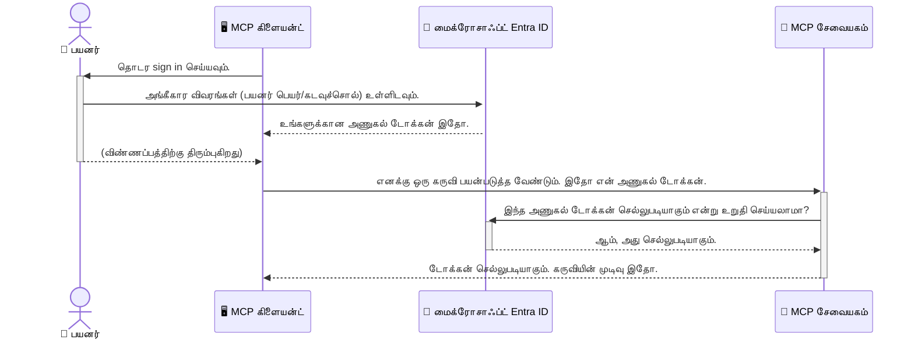

# AI பணிசூழல்களை பாதுகாப்பது: மாதிரி சூழல் பரிமாற்ற சேவையாளர்களுக்கான Entra ID அங்கீகாரம்

> [!NOTE]
> இந்தப் பாடத்தில் உள்ள தொலை சேவையகக் குறியீடு பழைய `/sse` மற்றும் `/message`
> இறுதிக் குறியீடுகளை பாதுகாக்கிறது மற்றும் MCP `2025-11-25` ஐ இலக்காகக் கொண்டுள்ளது. அதன் அடையாளம் மற்றும் டோக்கன்-சரிபார்ப்பு
> நடைமுறைகளை பின்பற்றுங்கள், ஆனால் புதிய
> செயலாக்கங்களுக்கு `2026-07-28`-ஐ தகுந்த Streamable HTTP பரிமாற்றத்தைப் பயன்படுத்தவும்.

## அறிமுகம்
உங்கள் மாதிரி சூழல் பரிமாற்ற (MCP) சேவையகத்தை பாதுகாப்பது உங்கள் வீட்டின் முன் கதவை பூட்டுவத 만큼 முக்கியம். உங்கள் MCP சேவையகம் திறந்திருப்பதன் மூலம் உங்கள் கருவிகள் மற்றும் தரவுகள் அனுமதிக்கப்படாத அணுகலை எதிர்கொள்ளும், இது பாதுகாப்பு உடைமைகளை ஏற்படுத்தக்கூடும். Microsoft Entra ID ஒரு வலுவான வானகம் அடிப்படையிலான அடையாள மற்றும் அணுகல் மேலாண்மை தீர்வை வழங்குகிறது, இது அனுமதிக்கப்பட்ட பயனர்கள் மற்றும் பயன்பாடுகள் மட்டுமே உங்கள் MCP சேவையகத்துடன் தொடர்பு கொள்ள முடியும் என்பதை உறுதி செய்ய உதவுகிறது. இந்த பகுதியில்உங்கள் AI பணிசூழல்களை Entra ID அங்கீகாரம் மூலம் பாதுகாப்பது பற்றி கற்றுக்கொள்வீர்கள்.

## கற்றல் நோக்கங்கள்
இந்தப் பகுதியின் இறுதிக்குள், நீங்கள்:

- MCP சேவையகங்களை பாதுகாப்பது முக்கியத்துவத்தை புரிந்து கொள்ள முடியும்.
- Microsoft Entra ID மற்றும் OAuth 2.0 அங்கீகாரத்தின் அடிப்படைகளை விளக்க முடியும்.
- பொதுத் மற்றும் ரகசிய கிளையண்டுகளுக்கிடையேயான வித்தியாசத்தை அறிந்துகொள்ள முடியும்.
- உள்ளூர் (பொது கிளையண்ட்) மற்றும் தொலை (ரகசிய கிளையண்ட்) MCP சேவையக சூழல்களில் Entra ID அங்கீகாரத்தை நடைமுறைப்படுத்த முடியும்.
- AI பணிசூழல்களை உருவாக்கும் போது பாதுகாப்பு சிறந்த நடைமுறைகளைப் பயன்படுத்த முடியும்.

## பாதுகாப்பும் MCP என்பதும்

உங்கள் வீட்டின் முன் கதவை பூட்டாமல் விட்டு விடவில்லை போல, உங்கள் MCP சேவையகத்தையும் யாரும் அணுகமுடியாதவாறு திறந்திருத்த கூடாது. உங்கள் AI பணிசூழல்களை பாதுகாப்பது வலுவான, நம்பகமான மற்றும் பாதுகாப்பான பயன்பாடுகளை உருவாக்குவதற்கு அவசியமாகும். இந்த அத்தியாயம் Microsoft Entra ID-ஐ பயன்படுத்தி உங்கள் MCP சேவையகங்களை பாதுகாப்பதை அறிமுகப்படுத்தும், உங்கள் கருவிகள் மற்றும் தரவுடன் அனுமதிக்கப்பட்ட பயனர்கள் மற்றும் பயன்பாடுகள் மட்டுமே தொடர்பு கொள்ள முடியும் என்பதை உறுதி செய்யும்.

## MCP சேவையகங்களுக்கு பாதுகாப்பு முக்கியத்துவம் ஏன்

உங்கள் MCP சேவையகத்தில் ஒரு கருவி மின்னஞ்சல் அனுப்பவோ அல்லது வாடிக்கையாளர் தரவுத்தளத்தை அணுகவோ முடியும் என்று கற்பனை செய்யுங்கள். பாதுகாப்பற்ற சேவையகம் இருந்தால் எந்த ஆதாயமற்ற நபரும் அந்த கருவியை பயன்படுத்தும் வாய்ப்பு உண்டு, இது அனுமதிக்கப்படாத தரவு அங்கீகாரம், ஸ்பாம் அல்லது பிற தீங்கு செய்கின்ற செயல்பாடுகளுக்கு வழிவகுக்கும்.

அங்கீகாரத்தை செயல்படுத்துவதன் மூலம், உங்கள் சேவையகத்துக்கு வரும் ஒவ்வொரு கோரிக்கும் சரிபார்ப்பு செய்யப்படுகிறது, கோரியை செய்த பயனர் அல்லது பயன்பாட்டின் அடையாளம் உறுதி செய்யப்படுகிறது. இது உங்கள் AI பணிசூழல்களை பாதுகாப்பதில் முதன்மை மற்றும் மிக முக்கியமான படியாகும்.

## Microsoft Entra ID அறிமுகம்

[**Microsoft Entra ID**](https://adoption.microsoft.com/microsoft-security/entra/) என்பது ஒரு வானகம் அடிப்படையிலான அடையாள மற்றும் அணுகல் மேலாண்மை சேவை ஆகும். உங்கள் பயன்பாடுகளுக்கு ஒரு உலகளாவிய பாதுகாப்பு போர迟க் போவை மாதிரி அது. இது பயனர் அடையாளங்களை சரிபார்க்கும் (அங்கீகாரம்) மற்றும் அவர்கள் என்ன செய்ய அனுமதிக்கப்பட்டுள்ளனர் என்பதை தீர்மானிக்கும் (அதிகாரம்) கடினமான செயல்முறைகளை கையாள்கிறது.

Entra ID-ஐப் பயன்படுத்துவதன் மூலம் நீங்கள்:

- பயனர்களுக்கான பாதுகாப்பான உள்நுழைவை உறுதிசெய்யலாம்.
- API மற்றும் சேவைகளை பாதுகாக்கலாம்.
- மையிலிருந்து அணுகல் கொள்கைகளை நிர்வகிக்கலாம்.

MCP சேவையகங்களுக்கான Entra ID வலுவான மற்றும் பரவலாக நம்பலான தீர்வை வழங்குகிறது, யார் உங்கள் சேவையகத்தின் திறன்களை அணுகலாம் என்பதைக் கட்டுப்படுத்த.

---

## மர்மத்தை புரிந்து கொள்வது: Entra ID அங்கீகாரம் எப்படி செயல்படுகிறது

Entra ID, **OAuth 2.0** போன்ற திறந்த தரநிலைகளை பயன்படுத்தி அங்கீகாரத்தை கையாள்கிறது. விவரங்கள் சிக்கலானவையாக இருக்கலாம், ஆனால் முக்கிய கருப்பு எளிமையாக புரிந்துகொள்ளக்கூடியது.

### OAuth 2.0 க்கு மென்மையான அறிமுகம்: வாலட் விசை

OAuth 2.0-ஐ உங்கள் கார் வாகனத்திற்கு வாலட் சேவை போல நினைத்துக் கொள்ளுங்கள். நீங்கள் ஒரு உணவகம் வந்தபோது, நீங்கள் வாலட்டுக்கு உங்கள் மாஸ்டர் விசையை அளிப்பதில்லை. அதற்கு பதிலாக, நீங்கள் ஒரு **வாலட் விசையை** வழங்குவீர்கள், அது குறைவான அனுமதிகளுடன் இருக்கும்—அது கார் ஸ்டார்ட் செய்யவும் கதவுகளை பூட்டவும் முடியும், ஆனால் தனி பெட்டி அல்லது க்ளோவ் கம்பார்மெண்ட் திறக்க முடியாது.

இந்த உருவகத்தில்:

- **நீங்கள்** என்பது **பயனர்**.
- **உங்கள் கார்** என்பது **MCP சேவையகம்** அதன் மதிப்புமிக்க கருவிகள் மற்றும் தரவுகளுடன்.
- **வாலட்** என்பது **Microsoft Entra ID**.
- **பார்க்கிங் உதவியாளர்** என்பது **MCP கிளையண்ட்** (சேவையகத்தை அணுக முயற்சிக்கும் பயன்பாடு).
- **வாலட் விசை** என்பது **அணுகல் டோக்கன்**.

அணுகல் டோக்கன் என்பது MCP கிளையண்ட் Entra ID-இல் உள் நுழைந்தபிறகு பெறும் பாதுகாப்பான உருட்டுத் தொடர் ஆகும். கிளையண்ட் இந்த டோக்கனை அனைத்து கோரிக்கைகளுக்கும் MCP சேவையகத்திற்கு காட்டுகிறது. சேவையகம் இந்த டோக்கனின் நம்பகத்தன்மையை சரிபார்க்க முடியும், கோரிக்கை சட்டப்பூர்வமானது மற்றும் கிளையண்ட்க்குத் தேவையான அனுமதிகள் உள்ளன என்பதை உறுதி செய்யலாம், இதனால் உங்கள் உண்மையான புகுபதிகைகள் (உங்கள் கடவுச்சொல் போன்ற) கையாளப்பட வேண்டியதில்லை.

### அங்கீகார ஓட்டம்

நடைமுறைவில் செயல்முறை பின்வருமாறு நடைபெறும்:



### Microsoft Authentication Library (MSAL) அறிமுகம்

குறியீட்டில் நாங்கள் பார்க்கும் முக்கிய கூறுக்களை அறிமுகப்படுத்துவது முக்கியம்: **Microsoft Authentication Library (MSAL)**.

MSAL என்பது Microsoft உருவாக்கிய ஒரு நூலகமாகும், இது அகதிவோர் அங்கீகாரத்தை எளிதாக்குகிறது. நீங்கள் பாதுகாப்பு டோக்கன்களை கையாள்வது, உள் நுழைவை நிர்வகிப்பது மற்றும் அமர்வுகளை புதுப்பிப்பது போன்ற கடினமான செயல்களை எழுத வேண்டியதில்லை, MSAL இவை அனைத்தையும் கவனிக்கும்.

MSAL போன்ற நூலகத்தை பயன்படுத்த மிகவும் பரிந்துரைக்கப்படுகிறது ஏனெனில்:

- **பாதுகாப்பானது:** இது தொழில்துறை தரநிலைகளையும் பாதுகாப்பு சிறந்த நடைமுறைகளையும் அமல்படுத்தி உங்கள் குறியீட்டில் பலவீனங்கள் ஏற்படும் அபாயத்தை குறைத்து விடுகிறது.
- **வளர்ச்சியை எளிதாக்குகிறது:** OAuth 2.0 மற்றும் OpenID Connect நிரல் கொள்கைகளை சிக்கலானதாக இருந்து நீக்கி, சில வரிகள் குறியீட்டுடன் வலுவான அங்கீகாரத்தை உங்கள் பயன்பாட்டுக்கு சேர்ப்பதற்கும் உதவுகிறது.
- **பராமரிப்பு செய்யப்படுகிறது:** Microsoft புதிய பாதுகாப்பு மிரட்டல்களையும் மாற்றங்களையும் முகாமை செய்ய MSAL-ஐ தொடர்ச்சியாக மேம்படுத்துகிறது.

MSAL .NET, JavaScript/TypeScript, Python, Java, Go மற்றும் iOS மற்றும் Android போன்ற மொபைல் தளங்களை அடங்கிய பல மொழிகள் மற்றும் பயன்பாட்டு கட்டமைப்புகளை ஆதரிக்கிறது. இது உங்கள் முழு தொழில்நுட்ப அட்டை முழுவதும் ஒரே மாதிரியான அங்கீகார மாதிரிகளை பயன்படுத்த முடியும் என்பதை குறிக்கிறது.

MSAL பற்றி மேலும் அறிய, நீங்கள் அதிகாரப்பூர்வமான [MSAL இல் அமைப்புக்கான ஆவணங்களை](https://learn.microsoft.com/entra/identity-platform/msal-overview)ப் பார்க்கலாம்.

---

## Entra ID மூலம் உங்கள் MCP சேவையகத்தை பாதுகாப்பது: படிமுறை வழிகாட்டி

இப்போது, உள்ளூர் MCP சேவையகத்தை (`stdio` மூலம் தொடர்பு கொள்ளும்) Entra ID-ஐ வைத்து எப்படி பாதுகாப்பது என்பதை பார்ப்போம். இந்த எடுத்துக்காட்டு **பொதுக் கிளையண்ட்** ஐ பயன்படுத்துகிறது, இது பயனர் சாதனத்தில் இயங்கும் பயன்பாடுகளுக்கு, உதாரணமாக டெஸ்க்டாப் செயலி அல்லது உள்ளூர் மேம்பாட்டு சேவையகத்திற்கு பொருத்தமானது.

### காட்சி 1: உள்ளூர் MCP சேவையகத்தை பாதுகாப்பது (பொதுக் கிளையண்டுடன்)

இந்த காட்சியில், உள்ளூர் இயங்கும், `stdio` மூலம் தொடர்பு கொண்ட MCP சேவையகம் மற்றும் பயனரை அங்கீகாரம் செய்ய Entra ID ஐப் பயன்படுத்தும் முறையைப் பார்ப்போம். இந்த சேவையகத்தில் ஒரு கருவி இருக்கும், அது பயனர் Microsoft Graph API இலிருந்து பயனர் சுயவிவரம் பெறும்.

#### 1. Entra ID இல் பயன்பாட்டை அமைத்தல்

எந்த குறியீடும் எழுதுவதற்கு முன், நீங்கள் Microsoft Entra ID இல் உங்கள் பயன்பாட்டை பதிவு செய்ய வேண்டும். இது Entra ID க்கு உங்கள் பயன்பாட்டைப் பற்றி கூறி, அங்கீகார சேவையைப் பயன்படுத்த அனுமதி அளிக்கும்.

1. **[Microsoft Entra போர்டல்](https://entra.microsoft.com/)** இல் செல்லவும்.
2. **App registrations**-ஐத் தேர்வு செய்து **New registration**-ஐ கிளிக் செய்யவும்.

3. உங்கள் பயன்பாட்டிற்கு ஒரு பெயர் உதாரணமாக, "என் உள்ளூர் MCP சேவையகம்" என்றாற்போல் கொடுக்கவும்.
4. **ஆதரிக்கப்படும் கணக்கு வகைகள்** க்காக, **இந்த நிறுவன அடைவு தளத்தில் உள்ள கணக்குகள் மட்டுமே** என்பதை தேர்ந்தெடுக்கவும்.
5. இந்த எடுத்துக்காட்டிற்காக, **மறுவழிச் URI** வெறுமையாக bırakலாம்.
6. **பதிவு செய்யவும்** என்பதனை கிளிக் செய்யவும்.

பதிவு செய்யப்பட்ட பிறகு, **பயன்பாடு (கிளையண்ட்) ID** மற்றும் **அடைவு (வாடகர்) ID** ஆகியவற்றை கவனித்துக் கொள்ளுங்கள். உங்கள் குறியீட்டில் இதை பயன்படுத்த வேண்டியிருக்கும்.

#### 2. குறியீடு: ஓர் பகுப்பு

அங்கீகாரத்தை கையாளும் முக்கிய பகுதிகளைக் காண்போம். இந்த எடுத்துக்காட்டின் முழு குறியீடு [Entra ID - Local - WAM](https://github.com/Azure-Samples/mcp-auth-servers/tree/main/src/entra-id-local-wam) கோப்புறையில் [mcp-auth-servers GitHub களஞ்சியத்தில்](https://github.com/Azure-Samples/mcp-auth-servers) கிடைக்கிறது.

**`AuthenticationService.cs`**

இந்த வகுப்பு Entra ID உடன் தொடர்பை கையாளுவதற்குப் பொறுப்புள்ளது.

- **`CreateAsync`**: இந்த முறை MSAL (Microsoft Authentication Library) இல் இருந்து `PublicClientApplication` ஐ ஆரம்பிக்கிறது. உங்கள் பயன்பாட்டின் `clientId` மற்றும் `tenantId` கொண்டு இது அமைக்கப்படும்.
- **`WithBroker`**: இது ஒரு புதிர்பேசியை (உதாரணமாக Windows Web Account Manager) பயன்படுத்த அனுமதிக்கும், இது பாதுகாப்பான மற்றும் ஒரே உள்நுழைவு அனுபவத்தை வழங்குகிறது.
- **`AcquireTokenAsync`**: இது முக்கிய முறை. முதலில் அமைதியான முறையில் அங்கீகார அடையாளத்தைப் பெற முயல்கிறது (அதாவது பயனர் ஏற்கனவே செல்லுதலுடன் இருந்தால் மீண்டும் உள்நுழைய தேவையில்லை). அமைதியானடையாளம் பெற முடியாவிட்டால், பயனரை இயக்கத்துடன் உள்நுழையத் தூண்டும்.

```csharp
// Simplified for clarity
public static async Task<AuthenticationService> CreateAsync(ILogger<AuthenticationService> logger)
{
    var msalClient = PublicClientApplicationBuilder
        .Create(_clientId) // Your Application (client) ID
        .WithAuthority(AadAuthorityAudience.AzureAdMyOrg)
        .WithTenantId(_tenantId) // Your Directory (tenant) ID
        .WithBroker(new BrokerOptions(BrokerOptions.OperatingSystems.Windows))
        .Build();

    // ... cache registration ...

    return new AuthenticationService(logger, msalClient);
}

public async Task<string> AcquireTokenAsync()
{
    try
    {
        // Try silent authentication first
        var accounts = await _msalClient.GetAccountsAsync();
        var account = accounts.FirstOrDefault();

        AuthenticationResult? result = null;

        if (account != null)
        {
            result = await _msalClient.AcquireTokenSilent(_scopes, account).ExecuteAsync();
        }
        else
        {
            // If no account, or silent fails, go interactive
            result = await _msalClient.AcquireTokenInteractive(_scopes).ExecuteAsync();
        }

        return result.AccessToken;
    }
    catch (Exception ex)
    {
        _logger.LogError(ex, "An error occurred while acquiring the token.");
        throw; // Optionally rethrow the exception for higher-level handling
    }
}
```

**`Program.cs`**

இங்கு MCP சேவையகம் அமைக்கப்பட்டு, அங்கீகார சேவை இணைக்கப்பட்டுள்ளது.

- **`AddSingleton<AuthenticationService>`**: இது `AuthenticationService` ஐ சார்பு இறுக்குழுவில் பதிவு செய்து, பயன்பாட்டின் பிற பகுதிகளால் (எங்கள் கருவிப் பகுதியாக) பயன்படுத்தப்பட உதவுகிறது.
- **`GetUserDetailsFromGraph` கருவி**: இந்தக் கருவிக்கு `AuthenticationService` இன் ஒரு உதாரணம் தேவை. ஏதாவது செய்யும் முன், இது `authService.AcquireTokenAsync()` ஐ அழைத்து செல்லுதலான அணுகல் அடையாளத்தைக் பெறுகிறது. அங்கீகாரம் வெற்றியடைவின் பின், அது அந்த அடையாளத்தைப் பயன்படுத்தி Microsoft Graph API ஐ அழைத்து பயனரின் விவரங்களை பெறுகிறது.

```csharp
// Simplified for clarity
[McpServerTool(Name = "GetUserDetailsFromGraph")]
public static async Task<string> GetUserDetailsFromGraph(
    AuthenticationService authService)
{
    try
    {
        // This will trigger the authentication flow
        var accessToken = await authService.AcquireTokenAsync();

        // Use the token to create a GraphServiceClient
        var graphClient = new GraphServiceClient(
            new BaseBearerTokenAuthenticationProvider(new TokenProvider(authService)));

        var user = await graphClient.Me.GetAsync();

        return System.Text.Json.JsonSerializer.Serialize(user);
    }
    catch (Exception ex)
    {
        return $"Error: {ex.Message}";
    }
}
```

#### 3. இது எவ்வாறு ஒன்றாக வேலை செய்கிறது

1. MCP கிளையண்ட் `GetUserDetailsFromGraph` கருவியைப் பயன்படுத்த முயலும்போது, கருவி முதலில் `AcquireTokenAsync` ஐ அழைக்கிறது.
2. `AcquireTokenAsync` MSAL நூலகத்தை செல்லுதலான அடையாளத்தை சரிபார்க்க அழைக்கிறது.
3. அடையாளம் கிடையாத போது, MSAL புதிர்பேசியின் மூலம் பயனரை Entra ID கணக்குடன் உள்நுழைய தூண்டும்.
4. பயனர் உள்நுழைந்த பிறகு, Entra ID அணுகல் அடையாளத்தை விடுவிக்கிறது.
5. கருவி அந்த அடையாளத்தைப் பெறுகிறது மற்றும் Microsoft Graph API ஐ பாதுகாப்பான முறையில் அழைக்க பயன்படுத்துகிறது.
6. பயனரின் விவரங்கள் MCP கிளையண்டிற்கு திருப்பி வழங்கப்படும்.

இந்த செயல்முறை கோருகிறது அங்கீகரிக்கப்பட்ட பயனர்களே கருவியைப் பயன்படுத்தி உள்ளனர் என்பதை உறுதிசெய்கிறது; இது உங்கள் உள்ளூர் MCP சேவையகத்தை பாதுகாப்பதாக மாற்றுகிறது.

### கற்ரியம் 2: தொலைவிலுள்ள MCP சேவையகத்தை பாதுகாப்பு (ரகசிய கிளையண்டுடன்)

உங்கள் MCP சேவையகம் ஒரு தொலைபேசி (கேளிக்கை சார்ந்த) இயந்திரத்தில் இயங்கும்போது (உதாரணமாக கிளவுட் சேவையகம்) மற்றும் HTTP சார்ந்த உரையாடல் பயன்படுத்தும்போது, பாதுகாப்பு தேவைகள் வேறுபடுகின்றன. இந்த சூழலில், நீங்கள் **ரகசிய கிளையண்ட்** மற்றும் **அங்கீகாரக் குறியீட்டு ஓட்டம்** பயன்படுத்த வேண்டும். இது ஒரு அதிக பாதுகாப்பான முறை ஆகும் காரணம், செயலியின் ரகசியங்கள் ஏதாவது உலாவியில் வெளியிடப்படுவதில்லை.

இந்த எடுத்துக்காட்டு TypeScript அடிப்படையிலான MCP சேவையகத்தை பயன்படுத்துகிறது, இது Express.js ஐ HTTP கோரிக்கைகளை கையாள பயன்படுத்துகிறது.

#### 1. Entra ID இல் பயன்பாடு அமைத்தல்

பொதுக் கிளையண்டுடன் ஒப்பிடும்போது Entra ID இல் அமைப்பு இந்நிலையில் ஒன்றுக்கு வேறுபாடு உள்ளது: நீங்கள் ஒரு **கிளையண்ட் ரகசியம்** உருவாக்க வேண்டும்.

1. **[Microsoft Entra போர்டல்](https://entra.microsoft.com/)** இல் செல்.
2. உங்கள் பயன்பாட்டின் பதிவு பகுதியில் **Certificates & secrets** தாவலை திறக்கவும்.
3. **புதிய கிளையண்ட் ரகசியம்** என்பதைக் கிளிக் செய்து, விளக்கத்தை கொடுத்து **சேர்க்கவும்** கிளிக் செய்யவும்.
4. **முக்கியம்:** ரகசிய மதிப்பை உடனடியாக நகலெடுக்கவும். பிறகு மீண்டும் பார்க்க முடியாது.
5. நீங்கள் ஒரு **மறுவழிச் URI**-யையும் அமைக்க வேண்டும். **Authentication** தாவலுக்கு சென்று, **பிளாட்ட்ஃபார்மை சேர்க்கவும்** என்பதனை கிளிக் செய்து, **இணையம் (Web)** என்பதைத் தேர்ந்தெடுத்து, உங்கள் பயன்பாட்டின் மறுவழிச் URI (உதா: `http://localhost:3001/auth/callback`) ஐ உள்ளிடவும்.

> **⚠️ முக்கிய பாதுகாப்பு குறிப்பு:** உற்பத்திப் பயன்பாடுகளுக்காக, Microsoft **கிளையண்ட் ரகசியங்கள்** பதிலாக **கடைசி பிணிமுறை அங்கீகாரம்** முறைகள், உதாரணமாக **Managed Identity** அல்லது **Workload Identity Federation** பயன்படுத்த பரிந்துரைக்கிறது. கிளையண்ட் ரகசியங்கள் பாதுகாப்பு இடர்ப்பாடுகளை ஏற்படுத்தலாம். Managed identities மூலம் உங்கள் குறியீட்டில் அல்லது அமைப்பில் கடவுச்சொற்களைச் சேமிக்க தேவையில்லை என்பதன் மூலம் அதிக பாதுகாப்பு கிடைக்கும்.
>
> மேலதிக விவரங்களுக்கு மற்றும் செம்மை அடையாளங்களை எப்படி அமல்படுத்துவது என்பதற்கு, [Managed identities for Azure resources overview](https://learn.microsoft.com/entra/identity/managed-identities-azure-resources/overview) என்பதைப் பார்க்கவும்.

#### 2. குறியீடு: ஓர் பகுப்பு

இந்த எடுத்துக்காட்டு ஒரு அமர்வு அடிப்படையிலான அணுகலை பயன்படுத்துகிறது. பயனர் அங்கீகரிக்கப்பட்ட பிறகு சேவையகம் அணுகல் அடையாளத்தையும் புதுப்பிப்பு அடையாளத்தையும் அமர்வில் சேமித்து, பயனருக்கு அமர்வு அடையாளத்தைக் கொடுக்கும். இந்த அமர்வு அடையாளம் பின்னர் தொடர்ச்சியான கோரிக்கைகளுக்கு பயன்படும். இந்த எடுத்துக்காட்டின் முழு குறியீடு [Entra ID - Confidential client](https://github.com/Azure-Samples/mcp-auth-servers/tree/main/src/entra-id-cca-session) கோப்புறையில் [mcp-auth-servers GitHub களஞ்சியத்தில்](https://github.com/Azure-Samples/mcp-auth-servers) கிடைக்கிறது.

**`Server.ts`**

இந்த கோப்பு Express சேவையகத்தையும் MCP போக்குவரத்து நிலையையும் அமைக்கிறது.

- **`requireBearerAuth`**: இது `/sse` மற்றும் `/message` முடிவுப் பகுதிகளை பாதுகாக்கும் இடைமுகம். கோரிக்கையின் `Authorization` தலைப்பில் செல்லுதலான தாக்கதொகுதி (bearer token) இருக்கிறதா என்று சரிபார்க்கிறது.
- **`EntraIdServerAuthProvider`**: இது தனிப்பயன் வகுப்பு, `McpServerAuthorizationProvider` இடைமுகத்தை செயல்படுத்துகிறது. OAuth 2.0 ஓட்டத்தை கையாளுவதற்குப் பொறுப்பு.
- **`/auth/callback`**: பயனர் அங்கீகரிக்கப்பட்ட பிறகு Entra ID இருந்து மறுவழிச் சரிசெய்யலுக்கு இந்த முடிவு செயல்படுகிறது. இது அங்கீகாரக் குறியீட்டை அணுகல் அடையாளத்துக்கும் புதுப்பிப்பு அடையாளத்துக்கும் பரிமாறுகிறது.

```typescript
// தெளிவுக்காக எளிமைப்படுத்தப்பட்டது
const app = express();
const { server } = createServer();
const provider = new EntraIdServerAuthProvider();

// SSE முடிவுகளை பாதுகாக்கவும்
app.get("/sse", requireBearerAuth({
  provider,
  requiredScopes: ["User.Read"]
}), async (req, res) => {
  // ... போக்குவரத்திற்கு இணைக்கவும் ...
});

// செய்தி முடிவுகளை பாதுகாக்கவும்
app.post("/message", requireBearerAuth({
  provider,
  requiredScopes: ["User.Read"]
}), async (req, res) => {
  // ... செய்தியை கையாளவும் ...
});

// OAuth 2.0 பின்னுக்கொடுப்பை கையாளவும்
app.get("/auth/callback", (req, res) => {
  provider.handleCallback(req.query.code, req.query.state)
    .then(result => {
      // ... வெற்றியோ தோல்வியோ கையாளவும் ...
    });
});
```

**`Tools.ts`**

இந்தக் கோப்பு MCP சேவையகத்துக்கான கருவிகளை வரையறுக்கிறது. `getUserDetails` கருவி முன்னைய எடுத்துக்காட்டினில் இருந்தது போலதான், ஆனால் இங்கு அமர்விலிருந்து அணுகல் அடையாளத்தைப் பெறுகிறது.

```typescript
// தெளிவுக்கு எளிமைப்படுத்தப்பட்டது
server.setRequestHandler(CallToolRequestSchema, async (request) => {
  const { name } = request.params;
  const context = request.params?.context as { token?: string } | undefined;
  const sessionToken = context?.token;

  if (name === ToolName.GET_USER_DETAILS) {
    if (!sessionToken) {
      throw new AuthenticationError("Authentication token is missing or invalid. Ensure the token is provided in the request context.");
    }

    // அமர்வு சேமிப்பகத்திலிருந்து எந்திரா ஐடி டோக்கனை பெறவும்
    const tokenData = tokenStore.getToken(sessionToken);
    const entraIdToken = tokenData.accessToken;

    const graphClient = Client.init({
      authProvider: (done) => {
        done(null, entraIdToken);
      }
    });

    const user = await graphClient.api('/me').get();

    // ... பயனர் விவரங்களை திரும்ப அளிக்கவும் ...
  }
});
```

**`auth/EntraIdServerAuthProvider.ts`**

இந்த வகுப்பு கீழ்காணும் மூலக்கருத்துகளைக் கையாள்கிறது:

- பயனரை Entra ID உள்நுழைவு பக்கத்திற்கு மாற்றுதல்.
- அங்கீகாரக் குறியீட்டை அணுகல் அடையாளத்திற்கு மாற்றுதல்.
- `tokenStore` இல் அடையாளங்களை சேமித்தல்.

- அங்கீகார டோக்கன் காலாவதியாகும்போது அதனை புதுப்பித்தல்.


#### 3. அனைத்தும் இணைந்து எப்படி வேலை செய்கிறது

1. ஒரு பயனர் முதலில் MCP சேவையகத்துடன் இணைக்க முயற்சிக்கும் போது, `requireBearerAuth` மிடில்வேர் அவர்கள் சரியான அமர்வு இல்லாமல் இருப்பதை காண்பிக்கும் மற்றும் அவர்களை Entra ID உள்நுழைவு பக்கத்திற்கு மறுப்பது.
2. பயனர் அவர்களின் Entra ID கணக்கால் உள்நுழைகிறார்.
3. Entra ID பயனரை `/auth/callback` முடிச்சு புள்ளிக்கு அனுமதி குறியீட்டுடன் திருப்பி அனுப்புகிறது.
4. சேவையகம் குறியீட்டைக் கையருவிக்கு மற்றும் புதுப்பிப்பு குறியீட்டுக்கு மாற்றி, அவற்றைப் பதிவு செய்து, அமர்வு குறியீட்டையொடு உருவாக்கி அதை கிளையன்ட் க்கு அனுப்புகிறது.
5. கிளையன்ட் தற்போது இந்த அமர்வு குறியீட்டைப் பயன்படுத்தி MCP சேவையகத்திற்கான அனைத்து எதிர்கால கோரிக்கைகளிலும் `Authorization` தலைப்பில் சேர்க்க முடியும்.
6. `getUserDetails` கருவி அழைக்கப்படும்போது, அது அமர்வு குறியீட்டை பயன்படுத்தி Entra ID அணுகல் குறியீட்டை கண்டறிந்து பின்னர் அதைப் பயன்படுத்தி Microsoft Graph API ஐ அழைக்கிறது.

இந்த ஓரம் பொது கிளையன்ட் ஓரத்தின விட சிக்கலானதாகும், ஆனால் இணையம் எதிர்கொள்ளும் முடிச்சுப் புள்ளிகளுக்கு இது அவசியம். தொலை MCP சேவையகங்கள் பொதுப் இணையத்திற்குப் போதுமானவையாக இருப்பதால், அவர்கள் அனுமதி இல்லாத அணுகல் மற்றும் தாக்குதல்களைத் தடுக்கக் கூடிய வலுவான பாதுகாப்பு நடவடிக்கைகள் தேவைப்படுகின்றன.


## பாதுகாப்பு சிறந்த நடைமுறைகள்

- **எப்போதும் HTTPS பயன்படுத்தவும்**: கிளையன்ட் மற்றும் சேவையகத்துக்கிடையேயான தொடர்பை குறியாக்கம் செய்கிறது, tokens ஐ இடையூறுபடுத்தப்படாமல் பாதுகாக்க.
- **பாத்திர அடிப்படையிலான அணுகல் கட்டுப்பாட்டை (RBAC) செயல்படுத்தவும்**: ஒரு பயனர் உள்நுழைந்துள்ளதா என்பதை மட்டும் பார்க்காமல், அவர்கள் எந்த அனுமதிகளுடன் இருக்கிறார்கள் என்பதையும்காணுங்கள். Entra ID இல் பாத்திரங்களை வரையறுக்கவும் மற்றும் உங்கள் MCP சேவையகத்தில் அவற்றை சரிபார்க்கவும்.
- **மேலாண்மை மற்றும் கண்காணிப்பு**: அனைத்து அங்கீகார நிகழ்வுகளையும் பதிவு செய்து சந்தேகப்படும் செயல்பாட்டை கண்டறிந்து பதிலளிக்கவும்.
- **விகித வரம்பும் தடுக்கும்**: Microsoft Graph மற்றும் மற்ற API கள் வழிமுறையை தவிர்க்க விகித வரம்பைக் கையாள்கின்றன. உங்கள் MCP சேவையகத்தில் குறுகிய பின்னடைவு மற்றும் மறுஅமைப்புக் கண்டறிதல் தர்கவும், HTTP 429 (மிகவும் கோரிக்கைகள்) பதில்களைத் திறம்பட கையாளவும். அடிக்கடி அணுகப்படும் தரவை சேமிப்பதில் பரிசீலனை செய்யவும்.
- **பாதுகாப்பான token சேமிப்பு**: அணுகல் tokens மற்றும் புதுப்பிப்பு tokens களை பாதுகாப்பாகச் சேமிக்கவும். உள்ளூர் பயன்பாடுகளுக்கு, கணினியின் பாதுகாப்பான சேமிப்பு முறைகளை பயன்படுத்தவும். சேவைப் பயன்பாடுகளுக்கு, குறியாக்க சேமிப்பு அல்லது Azure Key Vault போன்ற பாதுகாப்பான முக்கிய மேலாண்மை சேவைகளை பரிசீலிக்கவும்.
- **token காலாவதியான கையாளுதல்**: அணுகல் tokens க்கு ஒரு கட்டுப்படுத்தப்பட்ட ஆயுளகை உள்ளது. பயனர் மீள்நுழைவின்றி தொடர்ச்சி அனுபவம் படைக்க புதுப்பிப்பு tokens ஐ பயன்படுத்தி தானாக token புதுப்பித்தல் செயல்படுத்தவும்.
- **Azure API மேலாண்மையை பரிசீலிக்கவும்**: உங்கள் MCP சேவையகத்தில் நேரடியாக பாதுகாப்பை செயல்படுத்துவது நுட்பமான கட்டுப்பாட்டை தருமானாலும், Azure API மேலாண்மையைப் போன்ற API வாயில்கள் தனிப்பயனான அங்கீகாரம், அனுமதி, விகித வரம்பு மற்றும் கண்காணிப்பை தானாக கையாள முடியும். இவை உங்கள் கிளையன்ட்களுக்கும் MCP சேவையகங்களுக்கும் இடையேயான மையப்படுத்தப்பட்ட பாதுகாப்பு அடுக்கை வழங்குகின்றன. MCP க்கான API வாயில்களைப் பயன்படுத்துவது குறித்த கூடுதல் விவரங்களுக்கு, [Azure API Management Your Auth Gateway For MCP Servers](https://techcommunity.microsoft.com/blog/integrationsonazureblog/azure-api-management-your-auth-gateway-for-mcp-servers/4402690) ஐப் பார்க்கவும்.


## முக்கிய எடுத்துக்காட்டுகள்

- உங்கள் MCP சேவையகத்தை பாதுகாப்பது உங்கள் தரவுகளையும் கருவிகளையும் பாதுகாப்பதற்கு மிக முக்கியம்.
- Microsoft Entra ID வலுவான மற்றும் விரிவாக்கக்கூடிய அங்கீகார மற்றும் அனுமதி தீர்வுகளை வழங்குகிறது.
- உள்ளூர் பயன்பாடுகளுக்கு **பொது கிளையண்ட்** மற்றும் தொலைநிலை சேவையகங்களுக்கு **ரகசிய கிளையண்ட்** பயன்படுத்தவும்.
- **Authorization Code Flow** என்பது வலை பயன்பாடுகளுக்கு மிக பாதுகாப்பான தேர்வாகும்.


## பயிற்சி

1. நீங்கள் உருவாக்கக்கூடிய MCP சேவையகத்தைப் பற்றி நினைத்துப் பார்க்கவும். அது உள்ளூர் சேவையகமா அல்லது தொலை சேவையகமா இருக்கும்?
2. உங்கள் பதிலின் அடிப்படையில், நீங்கள் பொது கிளையண்ட் அல்லது ரகசிய கிளையண்ட்டைப் பயன்படுத்துவீர்களா?
3. Microsoft Graph இல் செயல்பாடுகளை செய்ய உங்கள் MCP சேவையகம் எந்த அனுமதியை கோரும்?


## கைமுறை பயிற்சிகள்

### பயிற்சி 1: Entra ID இல் ஒரு செயலியை பதிவு செய்தல்
Microsoft Entra போர்டல் நோக்கிச் செல்லவும்.
உங்கள் MCP சேவையக்கத்துக்கான ஒரு புதிய செயலியை பதிவு செய்யவும்.
செயலி (கிளையண்ட்) ஐ.டி மற்றும் இயக்குநர் (டெனன்ட்) ஐ.டியைப் பதிவு செய்யுங்கள்.

### பயிற்சி 2: உள்ளூர் MCP சேவையகத்தை பாதுகாப்பது (பொது கிளையண்ட்)
- பயனர் அங்கீகாரத்திற்கு MSAL (Microsoft Authentication Library) ஐ ஒருங்கிணைக்கக் குறியீட்டு உதாரணங்களை பின்பற்றவும்.
- Microsoft Graph இலிருந்து பயனர் விவரங்களை பெற MCP கருவியை அழைத்து அங்கீகார ஓரத்தை பரிசோதிக்கவும்.

### பயிற்சி 3: தொலை MCP சேவையகத்தை பாதுகாப்பது (ரகசிய கிளையண்ட்)
- Entra ID இல் ரகசிய கிளையண்ட்டை பதிவு செய்து கிளையண்ட் ரகசியத்தை உருவாக்கவும்.
- உங்கள் Express.js MCP சேவையகத்தில் Authorization Code Flow ஐ அமைக்கவும்.
- பாதுகாப்புக்குட்பட்ட முடிச்சுப் புள்ளிகளைப் பரிசோதித்து token அடிப்படையிலான அணுகலை உறுதிப்படுத்தவும்.

### பயிற்சி 4: பாதுகாப்பு சிறந்த நடைமுறைகளை செயல்படுத்தல்
- உங்கள் உள்ளூர் அல்லது தொலை சேவையகத்திற்காக HTTPS ஐ இயக்கவும்.
- உங்கள் சேவையகக் குறியீட்டில்தான் பாத்திர அடிப்படையிலான அணுகல் கட்டுப்பாட்டை (RBAC) செயல்படுத்தவும்.
- token காலாவதியான கையாளல் மற்றும் பாதுகாப்பான token சேமிப்பைச் சேர்க்கவும்.

## வளங்கள்

1. **MSAL மேற்பார்வை ஆவணம்**  
   Microsoft Authentication Library (MSAL) எவ்வாறு பல்வேறு தளங்களில் token பாதுகாப்பு ஆய்வுகளை எளிதாக்குகிறது என்பதைக் கற்றுக்கொள்ளவும்:  
   [MSAL Overview on Microsoft Learn](https://learn.microsoft.com/en-gb/entra/msal/overview)

2. **Azure-Samples/mcp-auth-servers GitHub சேமிப்பகம்**  
   அங்கீகார ஓரங்களை விளக்கும் MCP சேவையக உயிர்முறை நடைமுறைகள்:  
   [Azure-Samples/mcp-auth-servers on GitHub](https://github.com/Azure-Samples/mcp-auth-servers)

3. **Azure வளங்களுக்கான பராமரிப்பு அடையாளங்கள் மேற்பார்வை**  
   கணினி அல்லது பயனர் ஒதுக்கப்பட்ட பராமரிப்பு அடையாளங்களைப் பயன்படுத்தி இரகசியங்களை நீக்குவது எப்படி என்பதைப் புரிந்துகொள்ளவும்:  
   [Managed Identities Overview on Microsoft Learn](https://learn.microsoft.com/en-us/entra/identity/managed-identities-azure-resources/)

4. **Azure API மேலாண்மை: MCP சேவையகங்களுக்கான உங்கள் அங்கீகார வாயில்**  
   MCP சேவையகங்களுக்கு பாதுகாப்பான OAuth2 வாயிலை ஆக Azure API மேலாண்மையைப் பயன்படுத்துவது பற்றிய விரிவான கருத்தாய்வு:  
   [Azure API Management Your Auth Gateway For MCP Servers](https://techcommunity.microsoft.com/blog/integrationsonazureblog/azure-api-management-your-auth-gateway-for-mcp-servers/4402690)

5. **Microsoft Graph அனுமதி குறிப்பு**  
   Microsoft Graph க்கான பணிவிண்ணப்பி மற்றும் செயலி அனுமதிகளின் விரிவான பட்டியல்:  
   [Microsoft Graph Permissions Reference](https://learn.microsoft.com/zh-tw/graph/permissions-reference)


## கற்றல் முடிவுகள்
இந்தப் பகுதியில் முடித்ததும், நீங்கள் முடிந்திருக்கும்:

- MCP சேவையகங்களுக்கும் AI வேலைப்பாடுகளுக்கும் அங்கீகாரம் என்ன முக்கியமானது என்பதை விளக்கவும்.
- உள்ளூர் மற்றும் தொலை MCP சேவையக காட்சிகளுக்கான Entra ID அங்கீகாரத்தை அமைக்கவும் மற்றும் கட்டமைக்கவும்.
- உங்கள் சேவையகத்தின் பணவெளிப்படுத்தலைப் பொறுத்து (பொது அல்லது ரகசிய கிளையண்ட்) சரியான கிளையண்ட் வகையை தெரிவுசெய்யவும்.
- token சேமிப்பையும் பாத்திர அடிப்படையிலான அங்கீகாரத்தையும் உட்படுத்திய பாதுகாப்பான குறியீட்டு நடைமுறைகளை செயல்படுத்தவும்.
- அனுமதி இல்லாத அணுகலிலிருந்து உங்கள் MCP சேவையகத்தையும் அதன் கருவிகளையும் நம்பிக்கையுடன் பாதுகாக்கவும்.

## அடுத்தது என்ன

- [5.13 மாடல் சூழல் ஒத்துழைப்பு (MCP) Microsoft Foundry உடன் ஒருங்கிணைவு](../mcp-foundry-agent-integration/README.md)

---

<!-- CO-OP TRANSLATOR DISCLAIMER START -->
**மறுப்பு**:
இந்த ஆவணம் AI மொழிபெயர்ப்பு சேவை [Co-op Translator](https://github.com/Azure/co-op-translator) பயன்படுத்தி மொழிபெயர்க்கப்பட்டுள்ளது. நாங்கள் துல்லியத்திற்காக முயற்சி செய்துள்ளோம், ஆனால் தானாக செய்யப்படும் மொழிபெயர்ப்புகளில் பிழைகள் அல்லது தவறுகள் இருக்கலாம் என்பதை கவனத்தில் கொள்ளவும். அசல் ஆவணம் அதன் தாய்மொழியில் அதிகாரப்பூர்வ ஆதாரமாக கருதப்பட வேண்டும். முக்கியமான தகவல்களுக்கு, தொழில்நுட்பமான மனித மொழிபெயர்ப்பு பரிந்துரைக்கப்படுகிறது. இந்த மொழிபெயர்ப்பைப் பயன்படுத்துவதால் ஏற்படும் எந்த தவறான புரிதல்கள் அல்லது தவறான விளக்கத்திற்கும் நாங்கள் பொறுப்பில்வில்லை.
<!-- CO-OP TRANSLATOR DISCLAIMER END -->