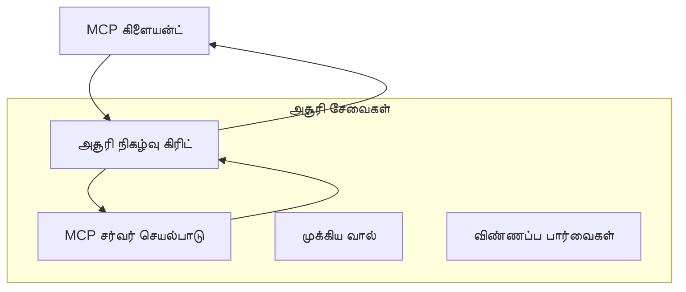
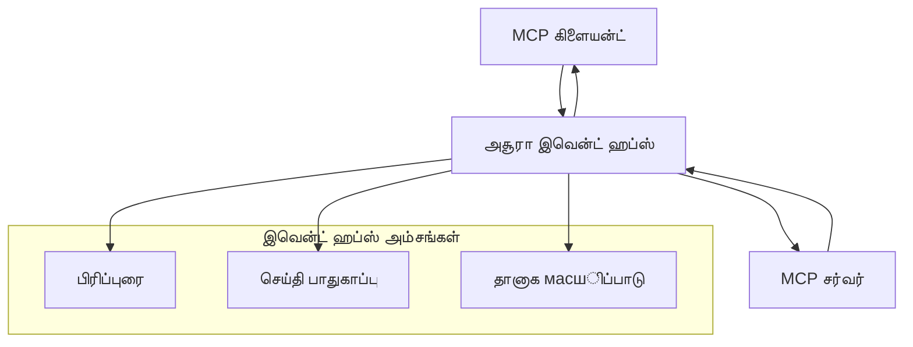

# MCP தனிப்பயன் போக்குவரத்துக்கான விரிவான செயல்முறை வழிகாட்டி

மாடல் கரு நெறிமுறை (MCP) போக்குவரத்துக்கான வழிகளில் நெகிழ்வுத்தன்மையை வழங்குகிறது, குறிப்பிட்ட நிறுவன சூழலுக்கு தனிப்பயன் செயல்பாடுகளை அனுமதிக்கிறது. இந்த விரிவான வழிகாட்டி, Azure Event Grid மற்றும் Azure Event Hubs போன்ற உதாரணங்களைக் கொண்டு மாபெரும் அளவில், மேக உலகிற்கு ஏற்ப MCP தீர்வுகளை உருவாக்க தனிப்பயன் போக்குவரத்து செயல்பாடுகளை ஆராய்கிறது.

> **எதிர்கால பார்வை:** இந்த வழிகாட்டி **MCP விவரக்குறிப்பு 2025-11-25** மீது எழுதப்பட்டுள்ளது, இதில் ஒவ்வொரு அமர்வுக்கும் அமர்வு வரிசை பாதுகாக்கப்பட வேண்டும் (கீழே உள்ள செய்தி நெறிமுறை பார்க்கவும்). `2026-07-28` வெளியீட்டு விண்ணப்பம் முற்றிலும் அமர்வு நிலை முறையை நீக்கும் மற்றும் `Mcp-Method`/`Mcp-Name` தலைப்புகளை தேவைப்படுத்துகிறது, இதனால் வாயில்கள் மற்றும் தனிப்பயன் போக்குவரத்துக்கூடங்கள் ஒவ்வொரு கோரிக்கைக்கும் பாதையை அமைக்க முடியும், அமர்வு அடிப்படையில் அல்ல. [MCP இல் மாற்றங்கள்: 2026-07-28 வெளியீட்டு விண்ணப்பம்](../../01-CoreConcepts/mcp-2026-07-28-release-candidate.md) பார்க்கவும்.

## அறிமுகம்

MCP இன் நிலையான போக்குவரத்துகள் (stdio மற்றும் HTTP ஸ்ட்ரீமிங்) பெரும்பான்மையிலும் பயன்படும் போது, நிறுவன சூழல்களில் மேம்பட்ட அளவிடல், நம்பகத்தன்மை மற்றும் உள்ளமைவு மேக கட்டமைப்புடன் ஒருங்கிணைக்க தனிப்பயன் போக்குவரத்து முறைகள் தேவைப்படும். தனிப்பயன் போக்குவரத்துகள் MCP க்கு மேக நேர் சார்ந்த செய்தி சேவைகளை ஏற்படுத்தவும், அசிங்க கம்யூனிகேஷன், நிகழ்வு சார்ந்த கட்டமைப்புகள் மற்றும் பகிர்ந்த செயலாக்கத்திற்கு உதவும்.

இந்த பாடம், சமீபத்திய MCP விவரக்குறிப்பு (2025-11-25), Azure செய்தி சேவைகள் மற்றும் நிறுவனம் ஒருங்கிணைப்பு வடிவமைப்புகளை அடிப்படையாக கொண்டு விரிவான போக்குவரத்து செயல்பாடுகளை ஆராய்கிறது.

### **MCP போக்குவரத்து கட்டமைப்பு**

**MCP விவரக்குறிப்பு (2025-11-25) இல் இருந்து:**

- **நிலையான போக்குவரத்துகள்**: stdio (பரிந்துரைக்கப்படும்), HTTP ஸ்ட்ரீமிங் (தொலைதூர நுணுக்கங்களுக்கு)
- **தனிப்பயன் போக்குவரத்துகள்**: MCP செய்தி பரிமாற்ற நெறிமுறையை செயல்படுத்தும் எந்த போக்குவரத்தும்
- **செய்தி வடிவம்**: MCP-சார்ந்த விரிவாக்கங்களுடன் JSON-RPC 2.0
- **இருமுகக் கம்யூனிகேஷன்**: அறிவிப்புகள் மற்றும் பதில்களுக்கு முழு இருமுகத் தொடர்பு தேவையானது

## கற்றல் நோக்கங்கள்

இந்த விரிவான பாடத்தின் முடிவில், நீங்கள் திறமைசாலியாக:

- **தனிப்பயன் போக்குவரத்து தேவைகளை புரிந்துகொள்ளுதல்**: MCP நெறிமுறையை எந்த போக்குவரத்திலும் செயல்படுத்தி ஒழுங்குபடுத்தல் காக்குதல்
- **Azure Event Grid போக்குவரத்தை உருவாக்குதல்**: Azure Event Grid கொண்டு நிகழ்வு சார்ந்த MCP சேவையாளர்கள் உருவாக்கல்
- **Azure Event Hubs போக்குவரத்தை செயல்படுத்துதல்**: நேரடி ஸ்ட்ரீமிங்குக்கான Azure Event Hubs கொண்டு MCP உயர் அதிர்வுடன் தீர்வுகள் வடிவமைத்தல்
- **நிறுவனம் ஒருங்கிணைப்பு மாதிரிகளை பயன்படுத்துதல்**: Azure கட்டமைப்புக்கும் பாதுகாப்பு மாதிரிகளுக்கும் தனிப்பயன் போக்குவரத்தை இணைத்தல்
- **போக்குவரத்து நம்பகத்தன்மையை கையாளுதல்**: தகவல் நிலைத்தன்மை, வரிசை மற்றும் பிழைத்தேவை கையாள்தல்
- **செயல்திறன் மேம்படுத்துதல்**: அளவை, தாமதம், மற்றும் அதிர்வு தேவைகளுக்கு ஏற்ப போக்குவரத்து தீர்வுகளை வடிவமைத்தல்

## **போக்குவரத்து தேவைகள்**

### **MCP விவரக்குறிப்பில் உள்ள முக்கிய தேவைகள் (2025-11-25):**

```yaml
Message Protocol:
  format: "JSON-RPC 2.0 with MCP extensions"
  bidirectional: "Full duplex communication required"
  ordering: "Message ordering must be preserved per session"
  
Transport Layer:
  reliability: "Transport MUST handle connection failures gracefully"
  security: "Transport MUST support secure communication"
  identification: "Each session MUST have unique identifier"
  
Custom Transport:
  compliance: "MUST implement complete MCP message exchange"
  extensibility: "MAY add transport-specific features"
  interoperability: "MUST maintain protocol compatibility"
```

## **Azure Event Grid போக்குவரத்து செயல்பாடு**

Azure Event Grid ஒரு சேவையில்லாத நிகழ்வு வழிமாற்று சேவையை வழங்குகிறது, இது நிகழ்வு சார்ந்த MCP கட்டமைப்புகளுக்கான சிறந்த உதவி ஆகும். இந்த செயல்பாடு மாபெரும், லூஸ்-காப்பிள் MCP அமைவுகளை உருவாக்கிக் காட்டுகிறது.

### **கட்டமைப்பு கண்ணோட்டம்**



### **C# செயல்பாடு - Event Grid போக்குவரத்து**

```csharp
using Azure.Messaging.EventGrid;
using Microsoft.Extensions.Azure;
using System.Text.Json;

public class EventGridMcpTransport : IMcpTransport
{
    private readonly EventGridPublisherClient _publisher;
    private readonly string _topicEndpoint;
    private readonly string _clientId;
    
    public EventGridMcpTransport(string topicEndpoint, string accessKey, string clientId)
    {
        _publisher = new EventGridPublisherClient(
            new Uri(topicEndpoint), 
            new AzureKeyCredential(accessKey));
        _topicEndpoint = topicEndpoint;
        _clientId = clientId;
    }
    
    public async Task SendMessageAsync(McpMessage message)
    {
        var eventGridEvent = new EventGridEvent(
            subject: $"mcp/{_clientId}",
            eventType: "MCP.MessageReceived",
            dataVersion: "1.0",
            data: JsonSerializer.Serialize(message))
        {
            Id = Guid.NewGuid().ToString(),
            EventTime = DateTimeOffset.UtcNow
        };
        
        await _publisher.SendEventAsync(eventGridEvent);
    }
    
    public async Task<McpMessage> ReceiveMessageAsync(CancellationToken cancellationToken)
    {
        // Event Grid is push-based, so implement webhook receiver
        // This would typically be handled by Azure Functions trigger
        throw new NotImplementedException("Use EventGridTrigger in Azure Functions");
    }
}

// Azure Function for receiving Event Grid events
[FunctionName("McpEventGridReceiver")]
public async Task<IActionResult> HandleEventGridMessage(
    [EventGridTrigger] EventGridEvent eventGridEvent,
    ILogger log)
{
    try
    {
        var mcpMessage = JsonSerializer.Deserialize<McpMessage>(
            eventGridEvent.Data.ToString());
        
        // Process MCP message
        var response = await _mcpServer.ProcessMessageAsync(mcpMessage);
        
        // Send response back via Event Grid
        await _transport.SendMessageAsync(response);
        
        return new OkResult();
    }
    catch (Exception ex)
    {
        log.LogError(ex, "Error processing Event Grid MCP message");
        return new BadRequestResult();
    }
}
```

### **TypeScript செயல்பாடு - Event Grid போக்குவரத்து**

```typescript
import { EventGridPublisherClient, AzureKeyCredential } from "@azure/eventgrid";
import { McpTransport, McpMessage } from "./mcp-types";

export class EventGridMcpTransport implements McpTransport {
    private publisher: EventGridPublisherClient;
    private clientId: string;
    
    constructor(
        private topicEndpoint: string,
        private accessKey: string,
        clientId: string
    ) {
        this.publisher = new EventGridPublisherClient(
            topicEndpoint,
            new AzureKeyCredential(accessKey)
        );
        this.clientId = clientId;
    }
    
    async sendMessage(message: McpMessage): Promise<void> {
        const event = {
            id: crypto.randomUUID(),
            source: `mcp-client-${this.clientId}`,
            type: "MCP.MessageReceived",
            time: new Date(),
            data: message
        };
        
        await this.publisher.sendEvents([event]);
    }
    
    // Azure Functions மூலம் நிகழ்வு சார்ந்த பெற்றல்
    onMessage(handler: (message: McpMessage) => Promise<void>): void {
        // நடைமுறை Azure Functions Event Grid தூண்டுகோலை பயன்படுத்தும்
        // இது webhook பெறுநருக்கான கருத்து இடைமுகம்
    }
}

// Azure Functions நடைமுறைப்படுத்தல்
import { app, InvocationContext, EventGridEvent } from "@azure/functions";

app.eventGrid("mcpEventGridHandler", {
    handler: async (event: EventGridEvent, context: InvocationContext) => {
        try {
            const mcpMessage = event.data as McpMessage;
            
            // MCP செய்தியை செயலாக்கு
            const response = await mcpServer.processMessage(mcpMessage);
            
            // Event Grid வழியாக பதிலை அனுப்பு
            await transport.sendMessage(response);
            
        } catch (error) {
            context.error("Error processing MCP message:", error);
            throw error;
        }
    }
});
```

### **Python செயல்பாடு - Event Grid போக்குவரத்து**

```python
from azure.eventgrid import EventGridPublisherClient, EventGridEvent
from azure.core.credentials import AzureKeyCredential
import asyncio
import json
from typing import Callable, Optional
import uuid
from datetime import datetime

class EventGridMcpTransport:
    def __init__(self, topic_endpoint: str, access_key: str, client_id: str):
        self.client = EventGridPublisherClient(
            topic_endpoint, 
            AzureKeyCredential(access_key)
        )
        self.client_id = client_id
        self.message_handler: Optional[Callable] = None
    
    async def send_message(self, message: dict) -> None:
        """Send MCP message via Event Grid"""
        event = EventGridEvent(
            data=message,
            subject=f"mcp/{self.client_id}",
            event_type="MCP.MessageReceived",
            data_version="1.0"
        )
        
        await self.client.send(event)
    
    def on_message(self, handler: Callable[[dict], None]) -> None:
        """Register message handler for incoming events"""
        self.message_handler = handler

# அதிர்வெண் செயல்பாடுகள் செயலாக்கம்
import azure.functions as func
import logging

def main(event: func.EventGridEvent) -> None:
    """Azure Functions Event Grid trigger for MCP messages"""
    try:
        # Event Grid நிகழ்ச்சியிலிருந்து MCP செய்தியை பார்
        mcp_message = json.loads(event.get_body().decode('utf-8'))
        
        # MCP செய்தியை செயலாக்கு
        response = process_mcp_message(mcp_message)
        
        # Event Grid வழியாக பதிலின் பின்னுக்கு அனுப்பு
        # (செயலாக்கம் புதிய Event Grid கிளையண்டை உருவாக்கும்)
        
    except Exception as e:
        logging.error(f"Error processing MCP Event Grid message: {e}")
        raise
```

## **Azure Event Hubs போக்குவரத்து செயல்பாடு**

Azure Event Hubs MCP நிகழ்வுகளுக்கான குறைந்த தாமதம் மற்றும் பெரும் செய்தி தொகுதிக்கு உயர் அதிவேக நேரடி ஸ்ட்ரீமிங் திறன்களை வழங்குகிறது.

### **கட்டமைப்பு கண்ணோட்டம்**



### **C# செயல்பாடு - Event Hubs போக்குவரத்து**

```csharp
using Azure.Messaging.EventHubs;
using Azure.Messaging.EventHubs.Producer;
using Azure.Messaging.EventHubs.Consumer;
using System.Text;

public class EventHubsMcpTransport : IMcpTransport, IDisposable
{
    private readonly EventHubProducerClient _producer;
    private readonly EventHubConsumerClient _consumer;
    private readonly string _consumerGroup;
    private readonly CancellationTokenSource _cancellationTokenSource;
    
    public EventHubsMcpTransport(
        string connectionString, 
        string eventHubName,
        string consumerGroup = "$Default")
    {
        _producer = new EventHubProducerClient(connectionString, eventHubName);
        _consumer = new EventHubConsumerClient(
            consumerGroup, 
            connectionString, 
            eventHubName);
        _consumerGroup = consumerGroup;
        _cancellationTokenSource = new CancellationTokenSource();
    }
    
    public async Task SendMessageAsync(McpMessage message)
    {
        var messageBody = JsonSerializer.Serialize(message);
        var eventData = new EventData(Encoding.UTF8.GetBytes(messageBody));
        
        // Add MCP-specific properties
        eventData.Properties.Add("MessageType", message.Method ?? "response");
        eventData.Properties.Add("MessageId", message.Id);
        eventData.Properties.Add("Timestamp", DateTimeOffset.UtcNow);
        
        await _producer.SendAsync(new[] { eventData });
    }
    
    public async Task StartReceivingAsync(
        Func<McpMessage, Task> messageHandler)
    {
        await foreach (PartitionEvent partitionEvent in _consumer.ReadEventsAsync(
            _cancellationTokenSource.Token))
        {
            try
            {
                var messageBody = Encoding.UTF8.GetString(
                    partitionEvent.Data.EventBody.ToArray());
                var mcpMessage = JsonSerializer.Deserialize<McpMessage>(messageBody);
                
                await messageHandler(mcpMessage);
            }
            catch (Exception ex)
            {
                // Handle deserialization or processing errors
                Console.WriteLine($"Error processing message: {ex.Message}");
            }
        }
    }
    
    public void Dispose()
    {
        _cancellationTokenSource?.Cancel();
        _producer?.DisposeAsync().AsTask().Wait();
        _consumer?.DisposeAsync().AsTask().Wait();
        _cancellationTokenSource?.Dispose();
    }
}
```

### **TypeScript செயல்பாடு - Event Hubs போக்குவரத்து**

```typescript
import { 
    EventHubProducerClient, 
    EventHubConsumerClient, 
    EventData 
} from "@azure/event-hubs";

export class EventHubsMcpTransport implements McpTransport {
    private producer: EventHubProducerClient;
    private consumer: EventHubConsumerClient;
    private isReceiving = false;
    
    constructor(
        private connectionString: string,
        private eventHubName: string,
        private consumerGroup: string = "$Default"
    ) {
        this.producer = new EventHubProducerClient(
            connectionString, 
            eventHubName
        );
        this.consumer = new EventHubConsumerClient(
            consumerGroup,
            connectionString,
            eventHubName
        );
    }
    
    async sendMessage(message: McpMessage): Promise<void> {
        const eventData: EventData = {
            body: JSON.stringify(message),
            properties: {
                messageType: message.method || "response",
                messageId: message.id,
                timestamp: new Date().toISOString()
            }
        };
        
        await this.producer.sendBatch([eventData]);
    }
    
    async startReceiving(
        messageHandler: (message: McpMessage) => Promise<void>
    ): Promise<void> {
        if (this.isReceiving) return;
        
        this.isReceiving = true;
        
        const subscription = this.consumer.subscribe({
            processEvents: async (events, context) => {
                for (const event of events) {
                    try {
                        const messageBody = event.body as string;
                        const mcpMessage: McpMessage = JSON.parse(messageBody);
                        
                        await messageHandler(mcpMessage);
                        
                        // குறைந்தது ஒருமுறை வழங்கலுக்கு சந்திப்பை புதுப்பிக்கவும்
                        await context.updateCheckpoint(event);
                    } catch (error) {
                        console.error("Error processing Event Hubs message:", error);
                    }
                }
            },
            processError: async (err, context) => {
                console.error("Event Hubs error:", err);
            }
        });
    }
    
    async close(): Promise<void> {
        this.isReceiving = false;
        await this.producer.close();
        await this.consumer.close();
    }
}
```

### **Python செயல்பாடு - Event Hubs போக்குவரத்து**

```python
from azure.eventhub import EventHubProducerClient, EventHubConsumerClient
from azure.eventhub import EventData
import json
import asyncio
from typing import Callable, Dict, Any
import logging

class EventHubsMcpTransport:
    def __init__(
        self, 
        connection_string: str, 
        eventhub_name: str,
        consumer_group: str = "$Default"
    ):
        self.producer = EventHubProducerClient.from_connection_string(
            connection_string, 
            eventhub_name=eventhub_name
        )
        self.consumer = EventHubConsumerClient.from_connection_string(
            connection_string,
            consumer_group=consumer_group,
            eventhub_name=eventhub_name
        )
        self.is_receiving = False
    
    async def send_message(self, message: Dict[str, Any]) -> None:
        """Send MCP message via Event Hubs"""
        event_data = EventData(json.dumps(message))
        
        # MCP-க்கு சிறப்பு பண்புகளை சேர்க்கவும்
        event_data.properties = {
            "messageType": message.get("method", "response"),
            "messageId": message.get("id"),
            "timestamp": "2025-01-14T10:30:00Z"  # உண்மையான காலச்ச்சுட்டியை பயன்படுத்தவும்
        }
        
        async with self.producer:
            event_data_batch = await self.producer.create_batch()
            event_data_batch.add(event_data)
            await self.producer.send_batch(event_data_batch)
    
    async def start_receiving(
        self, 
        message_handler: Callable[[Dict[str, Any]], None]
    ) -> None:
        """Start receiving MCP messages from Event Hubs"""
        if self.is_receiving:
            return
        
        self.is_receiving = True
        
        async with self.consumer:
            await self.consumer.receive(
                on_event=self._on_event_received(message_handler),
                starting_position="-1"  # தொடக்கம் முதல் தொடங்கவும்
            )
    
    def _on_event_received(self, handler: Callable):
        """Internal event handler wrapper"""
        async def handle_event(partition_context, event):
            try:
                # Event Hubs நிகழ்விலிருந்து MCP செய்தியை பகுப்பாய்வு செய்க
                message_body = event.body_as_str(encoding='UTF-8')
                mcp_message = json.loads(message_body)
                
                # MCP செய்தியை செயலாக்கு
                await handler(mcp_message)
                
                # குறைந்தது ஒரு முறை வழங்கலுக்கான செக் பாயின்டை புதுப்பிக்கவும்
                await partition_context.update_checkpoint(event)
                
            except Exception as e:
                logging.error(f"Error processing Event Hubs message: {e}")
        
        return handle_event
    
    async def close(self) -> None:
        """Clean up transport resources"""
        self.is_receiving = False
        await self.producer.close()
        await self.consumer.close()
```

## **விரிவான போக்குவரத்து மாதிரிகள்**

### **செய்தி நிலைத்தன்மை மற்றும் நம்பகத்தன்மை**

```csharp
// Implementing message durability with retry logic
public class ReliableTransportWrapper : IMcpTransport
{
    private readonly IMcpTransport _innerTransport;
    private readonly RetryPolicy _retryPolicy;
    
    public async Task SendMessageAsync(McpMessage message)
    {
        await _retryPolicy.ExecuteAsync(async () =>
        {
            try
            {
                await _innerTransport.SendMessageAsync(message);
            }
            catch (TransportException ex) when (ex.IsRetryable)
            {
                // Log and retry
                throw;
            }
        });
    }
}
```

### **போக்குவரத்து பாதுகாப்பு ஒருங்கிணைப்பு**

```csharp
// Integrating Azure Key Vault for transport security
public class SecureTransportFactory
{
    private readonly SecretClient _keyVaultClient;
    
    public async Task<IMcpTransport> CreateEventGridTransportAsync()
    {
        var accessKey = await _keyVaultClient.GetSecretAsync("EventGridAccessKey");
        var topicEndpoint = await _keyVaultClient.GetSecretAsync("EventGridTopic");
        
        return new EventGridMcpTransport(
            topicEndpoint.Value.Value,
            accessKey.Value.Value,
            Environment.MachineName
        );
    }
}
```

### **போக்குவரத்து கண்காணிப்பு மற்றும் பார்வை**

```csharp
// Adding telemetry to custom transports
public class ObservableTransport : IMcpTransport
{
    private readonly IMcpTransport _transport;
    private readonly ILogger _logger;
    private readonly TelemetryClient _telemetryClient;
    
    public async Task SendMessageAsync(McpMessage message)
    {
        using var activity = Activity.StartActivity("MCP.Transport.Send");
        activity?.SetTag("transport.type", "EventGrid");
        activity?.SetTag("message.method", message.Method);
        
        var stopwatch = Stopwatch.StartNew();
        
        try
        {
            await _transport.SendMessageAsync(message);
            
            _telemetryClient.TrackDependency(
                "EventGrid",
                "SendMessage",
                DateTime.UtcNow.Subtract(stopwatch.Elapsed),
                stopwatch.Elapsed,
                true
            );
        }
        catch (Exception ex)
        {
            _telemetryClient.TrackException(ex);
            throw;
        }
    }
}
```

## **நிறுவனம் ஒருங்கிணைப்பு பயன்பாடுகள்**

### **பயன்பாடு 1: பகிர்ந்த MCP செயலாக்கம்**

பட்சத்தில் அனேக செயலாக்கக் கிளைகளுக்கு MCP கோரிக்கைகளை Azure Event Grid மூலம் பகிர்தல்:

```yaml
Architecture:
  - MCP Client sends requests to Event Grid topic
  - Multiple Azure Functions subscribe to process different tool types
  - Results aggregated and returned via separate response topic
  
Benefits:
  - Horizontal scaling based on message volume
  - Fault tolerance through redundant processors
  - Cost optimization with serverless compute
```

### **பயன்பாடு 2: நேரடி MCP ஸ்ட்ரீமிங்**

அதிக அதிர்வுகள் MCP தொடர்புகளுக்கான Azure Event Hubs பயன்பாடு:

```yaml
Architecture:
  - MCP Client streams continuous requests via Event Hubs
  - Stream Analytics processes and routes messages
  - Multiple consumers handle different aspect of processing
  
Benefits:
  - Low latency for real-time scenarios
  - High throughput for batch processing
  - Built-in partitioning for parallel processing
```

### **பயன்பாடு 3: கலவை போக்குவரத்து கட்டமைப்பு**

பல்வேறு பயன்பாடுகளுக்கு பல போக்குவரத்துகளை இணைப்பு செய்தல்:

```csharp
public class HybridMcpTransport : IMcpTransport
{
    private readonly IMcpTransport _realtimeTransport; // Event Hubs
    private readonly IMcpTransport _batchTransport;    // Event Grid
    private readonly IMcpTransport _fallbackTransport; // HTTP Streaming
    
    public async Task SendMessageAsync(McpMessage message)
    {
        // Route based on message characteristics
        var transport = message.Method switch
        {
            "tools/call" when IsRealtime(message) => _realtimeTransport,
            "resources/read" when IsBatch(message) => _batchTransport,
            _ => _fallbackTransport
        };
        
        await transport.SendMessageAsync(message);
    }
}
```

## **செயல்திறன் மேம்படுத்தல்**

### **Event Grid க்கு செய்தி தொகுப்பு**

```csharp
public class BatchingEventGridTransport : IMcpTransport
{
    private readonly List<McpMessage> _messageBuffer = new();
    private readonly Timer _flushTimer;
    private const int MaxBatchSize = 100;
    
    public async Task SendMessageAsync(McpMessage message)
    {
        lock (_messageBuffer)
        {
            _messageBuffer.Add(message);
            
            if (_messageBuffer.Count >= MaxBatchSize)
            {
                _ = Task.Run(FlushMessages);
            }
        }
    }
    
    private async Task FlushMessages()
    {
        List<McpMessage> toSend;
        lock (_messageBuffer)
        {
            toSend = new List<McpMessage>(_messageBuffer);
            _messageBuffer.Clear();
        }
        
        if (toSend.Any())
        {
            var events = toSend.Select(CreateEventGridEvent);
            await _publisher.SendEventsAsync(events);
        }
    }
}
```

### **Event Hubs க்கான பகுதி திட்டம்**

```csharp
public class PartitionedEventHubsTransport : IMcpTransport
{
    public async Task SendMessageAsync(McpMessage message)
    {
        // Partition by client ID for session affinity
        var partitionKey = ExtractClientId(message);
        
        var eventData = new EventData(JsonSerializer.SerializeToUtf8Bytes(message))
        {
            PartitionKey = partitionKey
        };
        
        await _producer.SendAsync(new[] { eventData });
    }
}
```

## **தனிப்பயன் போக்குவரத்துகளுக்கான சோதனை**

### **சோதனை விநியோகங்கள் உடன் தொகுதி சோதனை**

```csharp
[Test]
public async Task EventGridTransport_SendMessage_PublishesCorrectEvent()
{
    // Arrange
    var mockPublisher = new Mock<EventGridPublisherClient>();
    var transport = new EventGridMcpTransport(mockPublisher.Object);
    var message = new McpMessage { Method = "tools/list", Id = "test-123" };
    
    // Act
    await transport.SendMessageAsync(message);
    
    // Assert
    mockPublisher.Verify(
        x => x.SendEventAsync(
            It.Is<EventGridEvent>(e => 
                e.EventType == "MCP.MessageReceived" &&
                e.Subject == "mcp/test-client"
            )
        ),
        Times.Once
    );
}
```

### **Azure Test Containers உடன் ஒருங்கிணைப்பு சோதனை**

```csharp
[Test]
public async Task EventHubsTransport_IntegrationTest()
{
    // Using Testcontainers for integration testing
    var eventHubsContainer = new EventHubsContainer()
        .WithEventHub("test-hub");
    
    await eventHubsContainer.StartAsync();
    
    var transport = new EventHubsMcpTransport(
        eventHubsContainer.GetConnectionString(),
        "test-hub"
    );
    
    // Test message round-trip
    var sentMessage = new McpMessage { Method = "test", Id = "123" };
    McpMessage receivedMessage = null;
    
    await transport.StartReceivingAsync(msg => {
        receivedMessage = msg;
        return Task.CompletedTask;
    });
    
    await transport.SendMessageAsync(sentMessage);
    await Task.Delay(1000); // Allow for message processing
    
    Assert.That(receivedMessage?.Id, Is.EqualTo("123"));
}
```

## **சிறந்த நடைமுறைகள் மற்றும் வழிகாட்டுதல்கள்**

### **போக்குவரத்து வடிவமைப்பு தத்துவங்கள்**

1. **ஒற்றுமை**: நகல் செய்திகளைக் கையாள கையேடு செயலாக்கத்தை உறுதி செய்தல்  
2. **பிழை கையாளல்**: விருத்தியான பிழை கையாளல் மற்றும் மரணக் கடித வரிசைகள் அமல் செய்தல்  
3. **கண்காணிப்பு**: விரிவான தெலிமெட்ரி மற்றும் உடல் சோதனைகளைச் சேர்த்தல்  
4. **பாதுகாப்பு**: நிர்வகிக்கப்பட்ட அடையாளங்கள் மற்றும் குறைந்த அனுமதி அணுகல் பயன்படுத்தல்  
5. **செயல்திறன்**: உங்கள் குறிப்பிட்ட தாமதம் மற்றும் அதிர்வு தேவைகளுக்கு ஏற்ப வடிவமைத்தல்

### **Azure-கான பரிந்துரைகள்**

1. **நிர்வகிக்கப்பட்ட அடையாளத்தைப் பயன்படுத்தவும்**: உற்பத்தியில் இணைப்பு சரங்களைத் தவிர்க்கவும்  
2. **சர்க்க்யூட் பிரேக்கர்களை செயல்படுத்தவும்**: Azure சேவை நிறுத்தங்களிலிருந்து பாதுகாப்பு  
3. **காசோலை கண்காணிப்பு**: செய்தி அளவி மற்றும் செயலாக்கக் கட்டுப்பாடுகளை கண்காணியுங்கள்  
4. **அளவீடு திட்டமிடல்**: பகுதியில் பிரிக்கும் மற்றும் அளவு அதிகரிக்கும் திட்டங்களை முன்கூட்டியே உருவாக்குதல்  
5. **முழுமையான சோதனை**: Azure DevTest Labs ஐ பயன்படுத்தி விரிவான சோதனை நடத்துதல்

## **முடிவு**

தனிப்பயன் MCP போக்குவரத்துகள் Azure இன் செய்தி சேவைகளைக் கொண்டு சக்திவாய்ந்த நிறுவன பயன்பாடுகளை இயங்கவைக்கும். Event Grid அல்லது Event Hubs போக்குவரத்துகளை செயல்படுத்துவதன் மூலம், நீங்கள் மாபெரும் அளப்பயிர்ச்சியான, நம்பகமான MCP தீர்வுகளை உருவாக்கலாம், அவை தற்போதைய Azure கட்டமைப்போடு இணைந்துவிடும்.

காட்டப்பட்ட உதாரணங்கள் MCP நெறிமுறைக்கு இணங்குதல் மற்றும் Azure சிறந்த நடைமுறைகளை பின்பற்றுதல் ஆகியவற்றுடன் தனிப்பயன் போக்குவரத்துகளை செயல்படுத்தும் தயாரிப்பு தயார்நிலை மாதிரிகளை வெளிப்படுத்துகின்றன.

## **மேலும் வளங்கள்**

- [MCP விவரக்குறிப்பு 2025-11-25](https://modelcontextprotocol.io/specification/2025-11-25/)
- [Azure Event Grid ஆவணங்கள்](https://docs.microsoft.com/azure/event-grid/)
- [Azure Event Hubs ஆவணங்கள்](https://docs.microsoft.com/azure/event-hubs/)
- [Azure Functions Event Grid தொடுவாய்](https://docs.microsoft.com/azure/azure-functions/functions-bindings-event-grid)
- [Azure SDK for .NET](https://github.com/Azure/azure-sdk-for-net)
- [Azure SDK for TypeScript](https://github.com/Azure/azure-sdk-for-js)
- [Azure SDK for Python](https://github.com/Azure/azure-sdk-for-python)

---

> *இந்த வழிகாட்டி தயாரிப்பு MCP அமைப்புகளுக்கான நடைமுறை செயல்பாட்டு மாதிரிகளுக்கு நேர்முகமாக கவனம் செலுத்துகிறது. உங்கள் குறிப்பிட்ட தேவைகளுக்கும் Azure சேவை வரம்புகளுக்கும் எதிராக போக்குவரத்து செயல்பாடுகளை எப்போதும் சரிபார்க்கவும்.*  
> **தற்போதைய நிலை**: இந்த வழிகாட்டி [MCP விவரக்குறிப்பு 2025-11-25](https://modelcontextprotocol.io/specification/2025-11-25/) போக்குவரத்து தேவைகள் மற்றும் நிறுவன சூழல் விரிவான போக்குவரத்து மாதிரிகளை பிரதிபலிக்கிறது.

## அடுத்தது என்ன
- [6. சமூக பங்களிப்புகள்](../../06-CommunityContributions/README.md)

---

<!-- CO-OP TRANSLATOR DISCLAIMER START -->
**மறுப்பு**:
இந்த ஆவணம் AI மொழிபெயர்ப்பு சேவை [Co-op Translator](https://github.com/Azure/co-op-translator) பயன்படுத்தி மொழிபெயர்க்கப்பட்டுள்ளது. நாங்கள் துல்லியத்திற்காக முயற்சி செய்துள்ளோம், ஆனால் தானாக செய்யப்படும் மொழிபெயர்ப்புகளில் பிழைகள் அல்லது தவறுகள் இருக்கலாம் என்பதை கவனத்தில் கொள்ளவும். அசல் ஆவணம் அதன் தாய்மொழியில் அதிகாரப்பூர்வ ஆதாரமாக கருதப்பட வேண்டும். முக்கியமான தகவல்களுக்கு, தொழில்நுட்பமான மனித மொழிபெயர்ப்பு பரிந்துரைக்கப்படுகிறது. இந்த மொழிபெயர்ப்பைப் பயன்படுத்துவதால் ஏற்படும் எந்த தவறான புரிதல்கள் அல்லது தவறான விளக்கத்திற்கும் நாங்கள் பொறுப்பில்வில்லை.
<!-- CO-OP TRANSLATOR DISCLAIMER END -->