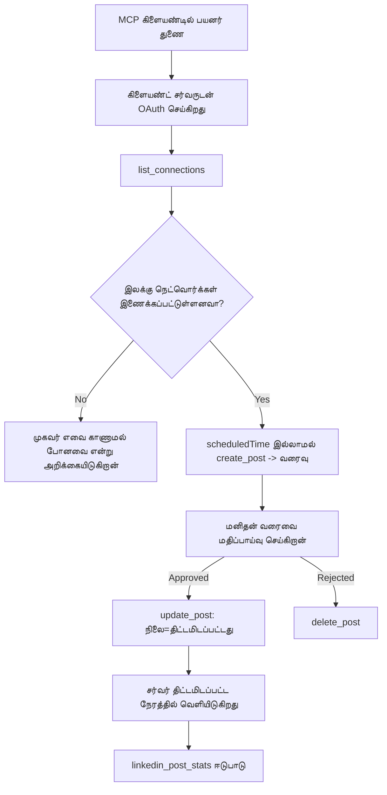

# வழக்குத் தேர்வு: ஒரு முகவர் மூலம் சமூக வலைத்தளங்களுக்கு வெளியிடுவது, ஒரு தொலைதூர MCP சேவையகத்துடன்

> **தவறுதலை தகவல்:** பல சேவைகள் மற்றும் திறந்த மூல திட்டங்கள் சமூக வலைத்தளங்களில் வெளியிட முடியும், மேலும் ஒரு குழுவும் ஒவ்வொரு வலைத்தளத்தின் API-ஐ நேரடியாக ஒருங்கிணைக்கலாம். கீழே கொடுக்கப்பட்டுள்ள காட்சி ஒரு **எழுதும் திறன் கொண்ட தொலைதூர MCP சேவையகம்** எவ்வாறு வடிவமைக்கப்பட்டு பயன்படுத்தப்படலாம் என்பதன் ஒரு உதாரணமாக வழங்கப்பட்டுள்ளது. Publora என்பது ஒரு வர்த்தக சேவையாகும், அதில் இலவசத்தரம் உள்ளது; இங்கு விவரிக்கப்பட்ட கட்டமைப்புகள் எந்த MCP சேவையகத்துக்கும் பொருந்தும், அது பயனருக்காக திரும்ப முடியாத செயல்களைச் செய்யும்.

## கண்ணோட்டம்

முகவர்கள் உள்ளடக்கத்தை வரைபடமாக உருவாக்க சிறந்தவர்கள், அதை வழங்குவதில் பலவீனமுள்ளவர்கள். ஒரு மாதிரி வெளியீட்டுத் தகவலை சில வினாடிகளில் எழுதக்கூடியது, பின்னர் வேலை நிறுத்தப்படும்: வெளியிடுவது எமது ஒவ்வொரு வலைத்தளத்திற்கும் ஒரு API, ஒவ்வொரு வலைத்தளத்திற்கும் OAuth செயலி மற்றும் ஒவ்வொரு வலைத்தளத்திற்கும் வேறு விதமான மீடியா விதிகள் தேவைப்படும். பெரும்பாலான குழுக்கள் இதனை கையால் வலை உலாவியில் உரையை நகலெடுத்து சரி செய்கின்றனர்.

இந்த வழக்குத் தேர்வு அந்த கடைசி படியை ஒரே தொலைதூர MCP சேவையகம் மூலம் எப்படி நிறுத்துவதைப் பார்்கிறது, மேலும் — அதை உருவாக்கும் யாருக்கும் பயன்படும் வகையில் — ஒரு **எழுதும் திறன் கொண்ட** சேவையகம் சரியாக செய்ய வேண்டிய வடிவமைப்புத் தீர்மானங்களைப் பார்க்கிறது. தரவை படிப்பதில் மன்னிப்பு உண்டு. வெளியிடுவதில் இல்லை: தவறான கருவி கால் ஒரு பார்வையாளர்களுக்கு தெரியும் மற்றும் திருப்ப முடியாது.

## காட்சி நிலை

ஒரு சிறிய டெவலப்பர் தொடர்பு குழு முகவரில் (Claude, VS Code, Cursor — வாடிக்கையாளர் பொருட்டல்ல) இடுகைகளை வரைபடமாக உருவாக்குகிறது. அவர்கள் முகவரால் அது செய்ய விரும்புவார்கள்:

- அவர்கள் எந்த சமூக கணக்குகளை இணைத்துள்ளனர் என்பதை பார்த்துக் கொள்ள,
- ஒரு இடுகையை வரைபடமாக எழுதக்கூட, ஒரு மனிதன் அ படிவத்தை ஒப்புக்கொள்ளும் வரை அதனை வரைபடமாக வைத்திருக்க வேண்டும்,
- ஒரு படத்தை இணைக்க,
- மிகைப்படுத்திய நேரத்தில் பல வலைத்தளங்களில் அட்டவணை அமைக்க,
- மற்றும் பிறகு அது எப்படி செயல்பட்டு என்று அறிக்கை வழங்க.

முக்கியமாக, அவர்கள் முகவர் இன்னும் சோதித்து பார்க்கும்போது தவறுதலாக வெளியிட முடியாததாக இருப்பதை விரும்புவர்.

## பயன்படுத்திய கருவிகள்

- [Publora MCP சேவையகம்](https://github.com/publora/mcp-server) — வெளியீடு, அட்டவணை, மீடியா மற்றும் LinkedIn பகுப்பாய்வு கருவிகளை வழங்கும் ஒரு தொலைதூர MCP சேவையகம் (`streamable-http`). அங்கீகாரம் பெற்ற MCP பதிவு பட்டியலில் `com.publora/mcp-server` ஆக பதிவு செய்யப்பட்டுள்ளது.

## படி படியான பணியோட்டம்

1. **சேவையகத்துடன் இணைப்பு.** OAuth பேசும் வாடிக்கையாளர்கள் PKCE உடன் அனுமதி குறியீட்டு ஒளியோட்டை முறையில் சேவையகத்தின் சொந்த ஒப்புதல் திரை மூலம் அனுமதி பெறுவர்; பேசாத வாடிக்கையாளர்கள், உதாரணமாக தலைமுடியற்ற CLI-கள், தலைப்பில் Publora API விசையைப் பயன்படுத்துவர். இரு வழிகளும் ஆதரவாக உள்ளன, நீங்கள் பெறுவது வாடிக்கையாளர் சார்ந்தது, சேவையகம் சார்ந்தது அல்ல.
2. **இணைப்புகளை பட்டியலிடல்.** முகவர் `list_connections` ஐ அழைத்து இணைக்கப்பட்ட கணக்குகளை மற்றும் அவற்றின் அடையாளங்களை பெறுகிறது.
3. **வரைபடம்.** முகவர் ஒரு திட்ட நேரம் இல்லாமல் `create_post` ஐ அழைக்கிறது. இடுகை வரைபடமாக சேமிக்கப்படுகிறது — எதுவும் வெளியிடப்படவில்லை.
4. **மீடியாவைக் இணைத்தல்.** பொதுவான மாதிரி URL களை ஒரே அழைப்பில் அனுப்பலாம்; சேவையகம் அவற்றை பதிவிறக்கம் செய்து சரிபார்க்கிறது.
5. **அட்டவணை அமைத்தல்.** ஒரு மனிதன் ஒப்புதல் அளித்த பிறகு, `update_post` ஐ ஐ.எஸ்.ஓ 8601 நேரத்துடன் அட்டவணை நிலையாக மாற்றுகிறது.
6. **அளவிடுதல்.** LinkedInக்கு, `linkedin_post_stats` இடுகை நேரடியாக காட்சியளிக்கப்பட்ட பின் ஈடுபாடுகளை திருப்பி அளிக்கிறது.

## எடுத்துக்காட்டு அவாதாரம்

```text
Which social accounts do I have connected?
Draft a post announcing our new changelog page, attach the screenshot at
https://example.com/changelog.png, and keep it as a draft — do not publish it.
Once I approve, schedule it to LinkedIn and Bluesky for tomorrow at 09:00 UTC.
```

## Mermaid ஓட்டக் வரைபடம்



## தொழில்நுட்ப செயலாக்கம்

கீழ்காணும் பாடங்கள் இந்த வழக்குத் தேர்வின் மாற்றக்கூடிய பகுதியே.

### திறந்த கண்டறிதல், அங்கீகாரம் பெற்ற అమல்

`tools/list` அங்கீகாரம் இல்லாமல் வழங்கப்படுகிறது; ஒவ்வொரு `tools/call` க்கும் ஒரு டோக்கன் தேவை, இல்லையெனில் `401` மற்றும் ஒரு `WWW-Authenticate` தலைப்புடன் பாதுகாக்கப்பட்ட குறைந்த வள metadata ஐ காண்பிக்கும். (சேவையகம் அங்கீகாரம் பெறாத `initialize`க்குப் பதிலளிக்கிறது, இது `2026-07-28` க்குக் முன்தரதைப் பயன்படுத்தும் வாடிக்கையாளர்களுக்கு மட்டுமே பொருந்தும்; அந்த திருத்தம் ஹாண்ட்ஷேக் முறையை முழுமையாக நிறுத்தியது.)

இந்த பிரிவு நடைமுறையில் முக்கியம். பதிவேட்டுகள், கட்டுரைகள் மற்றும் வாடிக்கையாளர்கள் கருவி மேய்யை — பெயர்கள், வடிவங்கள், குறிப்பு ஆகியவைகள் — ரகசியம் வைத்திருக்காது பார்வையிடலாம், ஆனால் எதுவும் *செயல்படுத்த* முடியாது. `initialize`க்கு டோக்கன் கேட்கும் சேவையகம் கருவிகளுக்கு மறைமுகம்; `tools/call`-ஐ அங்கீகாரம் இல்லாமல் அனுமதிக்கும் சேவையகம் பொறுப்புக்களாமை.

### பதிவு: சக்தி வாய்ந்த வாடிக்கையாளர் பதிவு, மற்றும் அதற்கு மாற்றம்

சேவையகம் `/.well-known/oauth-protected-resource` மற்றும் `/.well-known/oauth-authorization-server` ஐ விளம்பரப்படுத்துகிறது, மற்றும் PKCE உடன் அனுமதி குறியீட்டு ஒளியோட்டை முறையை, புதுப்பிப்பு டோக்கன்களை மற்றும் **சக்தியாய்வான வாடிக்கையாளர் பதிவு**-ஐ ஆதரிக்கிறது.

சக்தியாய்வான பதிவு கைமுறையை நீக்குகிறது: அது இல்லாவிட்டால் ஒவ்வொரு வாடிக்கையாளருக்கும் முன்னதாக வழங்கப்பட்ட `client_id` தேவையாகும், இது ஒவ்வொரு புதிய வாடிக்கையாளருக்கும் விற்பனையாளரிடம் வெளியே ஒரு கோரிக்கையைப் பொருள் படுத்துகிறது.

இதனை நடுக்கூற்று கொண்ட நடத்தைமாக கையாளுங்கள், நகலெடுக்க வேண்டிய வடிவமைப்பு என நினைத்துவிடாதீர்கள். `2026-07-28` என்ற குறிப்பின் திருத்தம் சக்தியாய்வான வாடிக்கையாளர் பதிவை விட்டு விலக்கி Client ID Metadata ஆவணத்துக்குப் போதுமானது என்கிறது, அதில் வாடிக்கையாளர் ஒரு நிலையான HTTPS URL-இல் Metadata ஆவணத்தை வைத்திருக்கின்றது, அந்த URL தான் `client_id` ஆகும். DCR இப்போதும் இயங்கும், ஆனால் இன்று கட்டப்படும் சேவையகம் CIMD க்கு திட்டமிட்டு பழைய வாடிக்கையாளர்களுக்குத் தான் DCR வைத்திருக்க வேண்டும்.

### கருவி குறிப்பு அலங்காரம் அல்ல

ஒவ்வொரு கருவியும் ஒரு `title` மற்றும் பொருந்தும் குறிக்கோள்கள் `readOnlyHint`, `destructiveHint`, `idempotentHint`, `openWorldHint` ஆக கடந்து வைக்கிறது.

இதில் இரண்டு காரணங்கள் உள்ளன. முதலில், வாடிக்கையாளர்கள் குறிக்கோள்களைப் பயன்படுத்தி பயனரிடம் எதன் ஒப்புதலை கேட்க வேண்டுமோ அதனைத் தீர்மானிக்கின்றனர் — ஒரு வாடிக்கையாளர் பதி-பார்ப்பதற்காக தானாக இயக்கு, நீக்குவதற்கு முன் ஒப்புதல் கேட்க முடியும். குறிப்புரை தெளிவாக கூறுகிறது: குறிக்கோள்கள் நம்பத்தகாத சுட்டுகோல்கள், அங்கீகாரக் குழு அல்ல: அவை வாடிக்கையாளருக்கு செய்ய விருப்பதைக் குறிக்கின்றன, சேவையகத்தின் விதிகளை நிறுத்தாது, சேவையகம் இதைத் தொடர்ந்து தனது விதிகளை அமல்படுத்த வேண்டும். இரண்டாவதாக, முக்கியமான இணைப்புக் கோப்பகங்கள் இப்போது அவற்றை *கண்ணாய்வு*க்காகவே **தேவை**ப்படுத்துகின்றன; தலைப்பு மற்றும் குறிக்கோள்கள் இல்லாத சேவையகத்தில் அது எவ்வளவு நன்றாக வேலை செய்தாலும் திருப்பி அனுப்பப்படும்.

### அடையாளங்களை கண்டுபிடிக்க முடியாதவையாக செய்யவும்

தள அடையாளங்கள் `list_connections` மூலம் திருப்பப்படும் மறைமுகமான சரங்களாகும், மற்றும் பாணி விளக்கம் அவற்றை நேரடியாக நகலெடுத்து ஒருபோதும் மாயவாக விடாமல் இருக்க வேண்டும் என்று தெளிவாக கூறுகிறது. சேவையகம் வேறு எதையும்மில்லை அள்ளக்கூடாது.

மாதிரிகள் சுருங்கிச் சொல்வார்கள். எந்த எழுத்துத்திறன் கொண்ட சேவையகமும் ஒரு அடையாளம் படைப்பதை எதிர்பார்த்து அந்த வழியை விழுங்காமல் வெளிப்படையாக சிக்கல்கொண்டுவிட வேண்டும், மாற்றாக சாத்தியமுள்ள மதிப்பில் நடக்கக் கூடாது.

### வெளியிடுவதற்கு முன் தோல்வியுற்று, செயல்பட கூடிய செய்தியுடன்

சில வலைத்தளங்கள் உரை மட்டும் இடுகைகளை எதிர்த்துக் கொண்டு, ஒரு படம் அல்லது வீடியோ எவ்விதம் வேண்டும் என்று கேட்கின்றன. அதனை அட்டவணைக்குச் செய்யும் போது சரிபார்க்கிறது, பிழை அதற்கான தளத்தையும் தேவையையும் குறிப்பிடுகிறது.

ஒரு முகவர் "Instagram மீடியாவைத் தேவைப்படுத்துகிறது — ஒரு படம் அல்லது வீடியோ இணைக்கவும்" என்ற செய்தியுடன் மறுபரிசோதனை செய்யலாம், அதற்கு மற்றொரு சுற்று பயணம் தேவையில்லை. ஆனால் பொதுவான `400` அச்சுவழி பிழையிலிருந்து மீள முடியாது.

### மீண்டும் முயற்சிகள் பாதுகாப்பாக செய்யவும்

உள்ளடக்கத்தை உருவாக்கும் இரண்டு கருவிகள், `create_post` மற்றும் `update_post`, ஒரு ஒரேபோதுபடுத்தல் கீ (idempotency key) ஏற்றுக் கொள்கின்றன: அதே கோரிக்கையுடன் மீண்டும் பயன்படுத்தியால் அசல் பதிலைக் காட்டுகின்றன, இரண்டாவது இடுகையை உருவாக்காது. முகவர் ஓட்டுகளுக்கான பதிலுக்காத்தல் நேர்த்துப் பாடங்களில் மீண்டும் முயற்சி செய்கிறது; ஒரேபோதுபடுத்தல் இல்லாதபோது, ஒருவேளை மந்த பதில் இரட்டை வெளியீட்டை ஏற்படுத்தும். மற்ற எழுத்துக்கருவிகள் — நீக்குதல்கள், மீடியா படிகள், LinkedIn அளவு மற்றும் கருத்துகள் — அது இல்லை, அதனால் அங்கு மீண்டும் முயற்சி செய்ய முடிவு இல்லாமல் பாதுகாப்பானது அல்ல. உங்கள் சொந்த மாற்றங்கள் எவை பாதுகாக்கப்பட்டவை எவை அல்ல என்பதைக் அறிந்து கொள்ள மதிப்புள்ளது.

### எதையும் வெளியிடாத ஒரு பரிசோதனை வழியை வழங்கவும்

சேவையகம் ஒரு வரைபடமான இலக்கு `publora-playground` ஐ ஏற்றுக்கொள்கிறது, இது சரிபார்க்கப்பட்டு உண்மையான இலக்காக ஏற்றுக்கொள்ளப்பட்டு பின்னர் நிராகரிக்கப்படுகிறது — எதுவும் நேரடி கணக்கிற்கு செல்லாது. அது கருவி வடிவத்தில் விளக்கப்பட்டுள்ளது, எந்த வாடிக்கையாளரும் அங்கீகாரமின்றி வாசிக்கலாம்: `create_post` இன் `platforms` புலத்தில் "உண்மையான இணைப்புக் காட்சி தேவையில்லாத இணைப்பு-சோதனை இலக்கு — இடுகை அங்கீகாரம் பெற்று நிராகரிக்கப்படுகிறது, எதுவும் வெளியிடப்படாது" என்று குறிக்கப்பட்டுள்ளது. இதை ஒரே உருப்படியாவாக அனுப்புவதன் மூலம் செயல்படுத்தவும்: `platforms: ["publora-playground"]`.

இது முழு மேய்யில் மிகவும் பயனுள்ள விவரங்களில் ஒன்றாக மாறியது. இணைப்புக் கோப்பக மதிப்பாய்வாளர்கள், பங்களிப்பாளர்கள் மற்றும் தொடர்ந்த ஒருங்கிணைப்பு (CI) முழுக்க எழுத்து வழியை இறுதி வரை செயல்படுத்தி எதுவும் நேரலைக்கு பாதிப்பற்றதாக பரிசோதிக்க முடியும். திருப்ப முடியாத செயல்களுடன் எந்த MCP சேவையகமும் ஒரு ஆவணப்பட்ட எதுவும் செய்யாத இலக்கை பெற்றுக்கொள்ளும் நன்மையை பெறும்.

## முடிவுகள் மற்றும் தாக்கம்

- வெளியீட்டு படி உலாவியில் இருந்து உள்ளடக்கம் எழுதப்படும் தன் உரையாடலுக்கு மாற்றப்பட்டது, மேலும் வரைபட முதலான பழக்கம் ஒரு மனிதனை இணைப்பில் வைத்திருக்கிறது. அதாவது என்னவென்று தெளிவாக இருக்கவேண்டும்: வரைபடம் ஒரு ஒப்பந்தம், எல்லை அல்ல. அதே அங்கீகாரம் அட்டவணை அளிக்கும் அல்லது வெளியிடுவதற்கு உள்ளது, எனவே ஒரு உண்மையான ஒப்புதல் இருப்பிடம் உண்டாக வேண்டுமானால் கருவி மேய்யிலோடில்லை வெளியே அதனை அமல்படுத்த வேண்டும் — தனித்துவமான அங்கீகாரம், அல்லது சேவையகத்திற்கு முன் ஒரு கொள்கை அடுக்கு.
- ஒவ்வொரு வலைத்தள வேறுபாடுகளும் — மீடியா தேவைகள், திருக்கம், பதிலளிப்பு கட்டுப்பாடுகள் — சர்வரில் ஒருமுறை கையாளப்படும், அதைச் சொல்பதால் ஒவ்வொரு முகவரிலும் செய்யவேண்டியதில்லை.
- அதே சேவையகம் பல MCP வாடிக்கையாளர்களுக்கு ஒரு பராமரிப்பு பணியோடு ஆதரிக்கிறது, ஏனெனில் கண்டறிதல் திறந்தது மற்றும் பதிவு சக்திவாய்ந்தது.
- மேலே உள்ள வடிவமைப்புச் சிக்கல்கள் இணைப்புக் கோப்பக மதிப்பாய்வுகளால், பயனர்களால் கடுமையாக வடிவமைக்கப்பட்டன: குறிக்கோள்கள், OAuth மற்றும் பாதுகாப்பான சோதனை இலக்கு குறைந்தது ஓரொரு மதிப்பாய்வாளராலும் தேவையாயிற்று.

## மேலதிக வாசிப்புகள்

- [Publora MCP சேவையகம் (மூலக்கோப்பு)](https://github.com/publora/mcp-server)
- [Publora API மற்றும் MCP ஆவணங்கள்](https://docs.publora.com)
- [MCP பதிவு பதிவு: `com.publora/mcp-server`](https://registry.modelcontextprotocol.io/v0/servers?search=com.publora/mcp-server)
- [MCP விவரக்குறிப்பு — அனுமதி](https://modelcontextprotocol.io/specification/draft/basic/authorization)
- [MCP விவரக்குறிப்பு — கருவி குறிக்கோள்கள்](https://modelcontextprotocol.io/docs/concepts/tools)

## அடுத்த கட்டம் என்ன

- நீங்கள் கட்டும் MCP சேவையகத்தை எடுத்து இங்கே உள்ள மூன்று எளிய வெற்றிகளை சரிபார்க்கவும்: ஒவ்வொரு கருவிக்கும் குறிக்கோள்கள், ஒவ்வொரு எழுத்துக்கும் ஒரேபோதுபடுத்தல் விசை, மற்றும் ஆவணப்படுத்தப்பட்ட எதுவும் செய்யாத இலக்கு.
- திறந்த கண்டறிதல் பிரிவை முயற்சிக்கவும்: தலைமை அங்கீகாரம் இல்லாத ஒரு தொலைதூர சேவையகத்தில் `tools/list` ஐ அழைக்கவும், பிறகு ஒரு கருவி அழைத்து `401` சவாலை பரிசீலிக்கவும்.
- உங்கள் துறையில் "திரும்பச் செய்வது" என்றால் என்ன என்பதை பரிசீலிக்கவும். வெளியீட்டில் வரைபடமும் நீக்குதலும் உள்ளன; உங்கள் செயல்களில் அவை இல்லாவிட்டால் உறுதிப்படுத்தல் கருவி வடிவமைப்புக்குள் இருக்க வேண்டும், அவதானம் நுட்பத்தில் அல்ல.

---

<!-- CO-OP TRANSLATOR DISCLAIMER START -->
**மறுப்பு**:
இந்த ஆவணம் AI மொழிபெயர்ப்பு சேவை [Co-op Translator](https://github.com/Azure/co-op-translator) பயன்படுத்தி மொழிபெயர்க்கப்பட்டுள்ளது. நாங்கள் துல்லியத்திற்காக முயற்சி செய்துள்ளோம், ஆனால் தானாக செய்யப்படும் மொழிபெயர்ப்புகளில் பிழைகள் அல்லது தவறுகள் இருக்கலாம் என்பதை கவனத்தில் கொள்ளவும். அசல் ஆவணம் அதன் தாய்மொழியில் அதிகாரப்பூர்வ ஆதாரமாக கருதப்பட வேண்டும். முக்கியமான தகவல்களுக்கு, தொழில்நுட்பமான மனித மொழிபெயர்ப்பு பரிந்துரைக்கப்படுகிறது. இந்த மொழிபெயர்ப்பைப் பயன்படுத்துவதால் ஏற்படும் எந்த தவறான புரிதல்கள் அல்லது தவறான விளக்கத்திற்கும் நாங்கள் பொறுப்பில்வில்லை.
<!-- CO-OP TRANSLATOR DISCLAIMER END -->