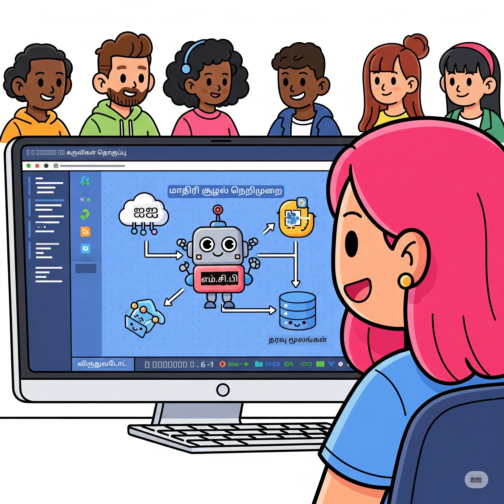

# AI வேலைப்பாடுகளை எளிமைப்படுத்தல்: Microsoft Foundry Toolkit உடன் MCP சர்வரை கட்டமைத்தல்

## 🎯 மேலோவerview

_(இந்த பாடத்தின் வீடியோவை காண மேலுள்ள படத்தை கிளிக் செய்யவும்)_

**மாடல் சூழல் நெறிமுறை (MCP) ஆலோசனைச் செயலி**-க்கு வரவேற்கிறோம்! இந்த முழுமையான செயல்பாட்டு பணிமனையில் இரண்டு முன்னணி தொழில்நுட்பங்கள் ஒருங்கிணைத்து AI பயன்பாட்டு வளர்ச்சியை மாற்றுகின்றன:

> **பொருத்தத்தை நோட்டீஸ்:** பணிமனை குறியீடு MCP
> `2025-11-25` உடன் உருவாக்கப்பட்டு சோதிக்கப்பட்டது,
> மேல் காட்டியுள்ள பேட்ஜிலின் மூலம். புதிய நெறிமுறைகளை செயல்படுத்த
> மற்றும் பணிமனைகளை மாற்றுவதற்கு முன் [நிலைசற்ற `2026-07-28` குறிப்பமைப்பைப் பயன்படுத்தவும்](https://modelcontextprotocol.io/specification/2026-07-28/)
> மற்றும் SDK வெளியீட்டு குறிப்புகளை ஆய்வு செய்யவும்.

- **🔗 மாடல் சூழல் நெறிமுறை (MCP)**: AI கருவி ஒருங்கிணைப்புக்கு திறந்த தகுதி நிலைமை
- **🛠️ Microsoft Foundry Toolkit VS Code விரிவாக்கம்**: மைக்ரோசாஃப்டின் சக்திவாய்ந்த AI வளர்ச்சிக்கான விரிவாக்கம்

### 🎓 நீங்கள் கற்றுக்கொள்ளவிருக்கும் விஷயங்கள்

இந்த பணிமனையின் முடிவில், நீங்கள் விரிவான AI மாடல்களை বাস্তவுள்ள கருவிகள் மற்றும் சேவைகளுடன் இணைக்கும் புத்திசாலி பயன்பாடுகளை உருவாக்க கலைமுறை புரிந்து கொள்வீர்கள். தானியங்கி சோதனைகளிலிருந்து தனிப்பயன் API ஒருங்கிணைப்புகளுக்கு வரை, நீங்கள் நுணுக்கமான வணிக சவால்களை தீர்க்க நடைமுறை திறன்களை பெறுவீர்கள்.

## 🏗️ தொழில்நுட்ப குவியல்

### 🔌 மாடல் சூழல் நெறிமுறை (MCP)

MCP என்பது **"USB-C போன்ற AI"** - AI மாடல்களை வெளிப்புற கருவிகள் மற்றும் தரவு மூலங்களுடன் இணைக்கும் பொதுவான தகுதி நிலைமை.

**✨ முக்கிய அம்சங்கள்:**

- 🔄 **தரமாக்கப்பட்ட ஒருங்கிணைவு**: AI-கருவி இணைப்புகளுக்கான பொது இடைமுகம்
- 🏛️ **நெகிழ்வான கட்டமைப்பு**: stdio/SSE பாதிப்புக்களுடன் உள்ளூர் மற்றும் தொலைதூர சர்வர்கள்
- 🧰 **சித்திரவதிக சூழல்**: கருவிகள், விருப்பங்குறிப்புகள் மற்றும் வளங்கள் ஒரே நெறிமுறையில்
- 🔒 **தொழில்துறை தயார்**: கட்டமைக்கப்பட்ட பாதுகாப்பு மற்றும் நம்பகத்தன்மை

**🎯 MCP முக்கியத்துவம்:**
USB-C கேபிள்களின் குழப்பத்தை நீக்கிய போல, MCP AI ஒருங்கிணைப்புகளின் சிக்கலை அகற்றுகிறது. ஒரு நெறிமுறை, முடிவற்ற வாய்ப்புகள்.

### 🤖 Microsoft Foundry Toolkit VS Code விரிவாக்கம்

மைக்ரோசாஃப்டின் முன்னணி AI வளர்ச்சி விரிவாக்கம், VS Code ஐ AI சக்தி மையமாக மாற்றுகிறது.

**🚀 முக்கிய திறன்கள்:**

- 📦 **மாடல் பட்டியல்**: Azure AI, GitHub, Hugging Face, Ollama உள்ளிட்ட இடங்களிலிருந்து மாடல்களை அணுகுதல்
- ⚡ **உள்ளூர் ஊக்கமூட்டல்**: ONNX-அனுகூல CPU/GPU/NPU செயல்பாடு
- 🏗️ **துறைத்துப்பணியாளர் கட்டமைப்பாளர்**: MCP ஒருங்கிணைப்புடன் காணொலி AI துறைத்துப் பணியாளர் உருவாக்கம்
- 🎭 **பலவகை**: உரை, காட்சி மற்றும் கட்டமைக்கப்பட்ட வெளியீடு ஆதரவு

**💡 வளர்ச்சி நன்மைகள்:**

- பூஜ்ய-கட்டமைப்பு மாடல் பயன்பாடு
- காணொலி வழிகாட்டி வடிவமைப்பு
- நேரடி சோதனை மேடையில் பணியாற்றல்
- சிறப்பாக MCP சர்வர் ஒருங்கிணைவு

## 📚 கற்றல் பயணம்

### [🚀 பகுதி 1: Microsoft Foundry Toolkit அடிப்படைகள்](./lab1/README.md)

**கால அளவு**: 15 நிமிடங்கள்

- 🛠️ Microsoft Foundry Toolkit ஐ VS Code க்காக நிறுவுதல் மற்றும் கட்டமைத்தல்
- 🗂️ மாடல் பட்டியலை ஆராய்தல் (GitHub, ONNX, OpenAI, Anthropic, Google ஆகியவற்றிலிருந்து 100+ மாடல்கள்)
- 🎮 நேரடி மாடல் சோதனைக்கான இயல்பு மேடையில் தேர்ச்சி பெறுதல்
- 🤖 முதலாம் AI துறைத்துப் பணியாளரை Agent Builder உடன் உருவாக்குதல்
- 📊 உள்ளே நடித்துள்ள அளவுகோல்களுடன் (F1, தொடர்பு, ஒத்திருப்பு, ஒத்திசைவு) மாடல் செயல்திறன் மதிப்பீடு
- ⚡ தொகுப்பு செயலாக்கம் மற்றும் பலவகை ஆதரவு திறன்கள் கற்றல்

**🎯 கற்றல் விளைவாக**: Microsoft Foundry Toolkit திறன்களை முழுமையாக்கி திறமையான AI துறைத்துப் பணியாளரை உருவாக்குதல்

### [🌐 பகுதி 2: Microsoft Foundry Toolkit உடன் MCP அடிப்படைகள்](./lab2/README.md)

**கால அளவு**: 20 நிமிடங்கள்

- 🧠 மாடல் சூழல் நெறிமுறை (MCP) கட்டமைப்பு மற்றும் கருத்துக்களை கற்றுக்கொள்வது
- 🌐 மைக்ரோசாஃப்ட் MCP சர்வர் சூழலை ஆராய்தல்
- 🤖 Playwright MCP சர்வரைப் பயன்படுத்தி உலாவி தானியங்கி பணியாளரை உருவாக்குதல்
- 🔧 MCP சர்வர்களை Microsoft Foundry Toolkit Agent Builder உடன் ஒருங்கிணைத்தல்
- 📊 உங்கள் துறைத்துப் பணியாளர்களில் MCP கருவிகளைக் கட்டமைத்தல் மற்றும் சோதனை செய்தல்
- 🚀 MCP சக்தியளிக்கும் துறைத்துப் பணியாளர்களை எக்ஸ்போர்ட் செய்தல் மற்றும் வெளியீட்டிற்குத் தயாராகவாறு மாற்றுதல்

**🎯 கற்றல் விளைவாக**: MCP உடன் வெளிப்புற கருவிகளால் மேம்படுத்தப்பட்ட AI துறைத்துப் பணியாளரை பயன்படுத்தல்

### [🔧 பகுதி 3: Microsoft Foundry Toolkit உடன் மேம்பட்ட MCP வளர்ச்சி](./lab3/README.md)

**கால அளவு**: 20 நிமிடங்கள்

- 💻 Microsoft Foundry Toolkit உடன் தனிப்பயன் MCP சர்வர்களை உருவாக்குதல்
- 🐍 சமீபத்திய MCP Python SDK (v1.9.3) ஐ கட்டமைத்து பயன்படுத்துதல்
- 🔍 டீபக்கிங் செய்ய MCP இன்ஸ்பெக்டரை அமைத்து பயன்பாடு செய்தல்
- 🛠️ தொழில்முறை டீபக்கிங் வேலைசெய்ய MCP வானிலை சர்வரை கட்டமைத்தல்
- 🧪 Agent Builder மற்றும் இன்ஸ்பெக்டர் சூழல்களில் MCP சர்வர்களை டீபக் செய்தல்

**🎯 கற்றல் விளைவாக**: நவீன கருவிகளுடன் தனிப்பயன் MCP சர்வர்களை உருவாக்கி டீபக் செய்தல்

### [🐙 பகுதி 4: நடைமுறை MCP வளர்ச்சி - தனிப்பயன் GitHub கிளோன் சர்வர்](./lab4/README.md)

**கால அளவு**: 30 நிமிடங்கள்

- 🏗️ நடக்கும் வளர்ச்சி பணிமனைகளுக்கான உண்மையான GitHub கிளோன் MCP சர்வரை கட்டமைத்தல்
- 🔄 சரிபார்ப்பும் பிழை கையாள்வும் கொண்ட தந்திரமான தொகுப்பு விளக்க முறையை செயல்படுத்தல்
- 📁 புத்திசாலி அடைவு மேலாண்மை மற்றும் VS Code ஒருங்கிணைவு உருவாக்குதல்
- 🤖 தனிப்பயன் MCP கருவிகளுடன் GitHub Copilot Agent Mode ஐப் பயன்படுத்தல்
- 🛡️ தயாரிப்பு தயார் நம்பகத்தன்மை மற்றும் பல தளம் ஆதரவு சீரமைப்பை பொருத்தல்

**🎯 கற்றல் விளைவாக**: உண்மையான வளர்ச்சி பணிமனைகளை எளிமையாக்கும் தயாரிப்பு-தயார் MCP சர்வரை வெளியிடுதல்

## 💡 உண்மையான பயன்பாடுகள் மற்றும் தாக்கம்

### 🏢 தொழில்துறை பயன்பாடுகள்

#### 🔄 DevOps தானியக்கம்

புத்திசாலித்தன்மையுள்ள தானியக்கத்துடன் உங்கள் வளர்ச்சி வேலைப்பாட்டை மாற்றல்:

- **புத்திசாலி தொகுப்பு மேலாண்மை**: AI-ஆல் இயக்கப்படும் குறியீடு மதிப்பாய்வு மற்றும் இணைப்பு முடிவுகள்
- **புத்திசாலி CI/CD**: குறியீடு மாற்றங்களுக்கு அடிப்படையாக கொண்ட தானியங்கி குழாய் மேம்பாடு
- **பிரச்சினை வகைப்பாடு**: தானாக இப்படிவித்தல் மற்றும் ஒதுக்கீடு

#### 🧪 தரமான உறுதிப்படுத்தல் புரட்சிகர மாற்றம்

AI-இல் இயக்கப்படும் தானியக்கத்துடன் சோதனையை உயர்த்தல்:

- **புத்திசாலி சோதனை உருவாக்கம்**: விரிவான சோதனை தொகுப்புகளை தானாக உருவாக்குதல்
- **காணொலி மாற்ற சோதனை**: AI-ஆல் இயக்கப்படும் UI மாற்றக் கண்டுபிடிப்பு
- **செயல்திறன் கண்கியல்**: முன்கூட்டிய பிரச்சினை கண்டுபிடிப்பு மற்றும் தீர்வு

#### 📊 தரவு குழாய் புத்திசாலி

புத்திசாலித்தனமான தரவுத்தொடர்ப்பு வேலைபழக்கங்களை உருவாக்கவும்:

- **அனுகூல ETL செயல்முறைகள்**: சுய-மேம்படுத்தும் தரவு மாற்றங்கள்
- **எதிர்ப்பவை கண்டறிதல்**: நேரடி தரவு தரம் கண்காணிப்பு
- **அறிவார்ந்த வழிநடத்தல்**: புத்திசாலி தரவின் ஓட்ட மேலாண்மை

#### 🎧 வாடிக்கையாளர் அனுபவ மேம்பாடு

சிறந்த வாடிக்கையாளர் தொடர்புக்களை உருவாக்கவும்:

- **Context-Aware ஆதரவு**: வாடிக்கையாளர் வரலாறுக்கு அணுகல் கொண்ட AI முகவர்கள்
- **எதிர் முயற்சி பிரச்சினை தீர்வு**: முன்னறிவிப்பு வாடிக்கையாளர் சேவை
- **பல சேனல் ஒருங்கிணைப்பு**: பல்வேறு தளங்களில் ஒருங்கிணைந்த AI அனுபவம்

## 🛠️ தேவைகள் மற்றும் அமைப்பு

### 💻 அமைப்பு தேவைகள்

| கூறு | தேவைகள் | குறிப்புகள் |
|-----------|-------------|-------|
| **இயங்கு முறைமை** | Windows 10+, macOS 10.15+, Linux | எந்தவொரு நவீன OS |
| **Visual Studio Code** | சமீபத்திய நிலையான பதிப்பு | Microsoft Foundry Toolkit க்கான அவசியம் |
| **Node.js** | v18.0+ மற்றும் npm | MCP சர்வர் அபிவிருத்திக்காக |
| **Python** | 3.10+ | Python MCP சர்வர்களுக்கு விருப்பம் |
| **ச्मృతి** | குறைந்தபட்சம் 8GB RAM | உள்ளூர்மாடல்களுக்கு 16GB பரிந்துரை |

### 🔧 அபிவிருத்தி சூழல்

#### பரிந்துரைக்கப்பட்ட VS Code நீட்டிப்புகள்

- **Microsoft Foundry Toolkit** (ms-windows-ai-studio.windows-ai-studio)
- **Python** (ms-python.python)
- **Python Debugger** (ms-python.debugpy)
- **GitHub Copilot** (GitHub.copilot) - விருப்பமானது ஆனால் உதவும்

#### விருப்பமான கருவிகள்

- **uv**: நவீன Python பாக்கேஜ் மேலாளர்
- **MCP ஆய்வாளர்**: MCP சர்வர்களுக்கான காட்சி பிழைத்திருத்த கருவி
- **Playwright**: வலை தானியக்கப்படத்திற்காக உதாரணங்கள்

## 🎖️ கற்றல் முடிவுகள் மற்றும் சான்றிதழ் பாதை

### 🏆 திறன் மிறக்கு சோதனை பட்டியல்

இந்த பணிமனை முடிப்பதன் மூலம், நீங்கள் நிபுணத்துவத்தை பெற்று விடுவீர்கள்:

#### 🎯 முதன்மை திறன்கள்

- [ ] **MCP நெறிமுறை நிபுணத்துவம்**: கட்டமைப்பும் பயன்பாடும் பற்றிய ஆழ்ந்த புரிதல்
- [ ] **Microsoft Foundry Toolkit திறமை**: விரைவான அபிவிருத்திக்கான நிபுணத்துவம்
- [ ] **தனிப்பயன் சர்வர் அபிவிருத்தி**: MCP சர்வர்கள் கட்டுதல், இயக்குதல் மற்றும் பராமரித்தல்
- [ ] **கருவி ஒருங்கிணைப்பு விருத்தி**: உருவாக்கும் பண்முறைகளுடன் AI-ஐ ஒன்றிணைத்தல்
- [ ] **பிரச்சனை தீர்க்கும் பயன்பாடு**: கற்றுக் கொண்ட திறன்களை வணிக சவால்களில் பயன்படுத்துதல்

#### 🔧 தொழில்நுட்ப திறன்கள்

- [ ] VS Code இல் Microsoft Foundry Toolkit அமைக்கவும்
- [ ] தனிப்பயன் MCP சர்வர்களை வடிவமைக்கவும் மற்றும் நடைமுறைபடுத்தவும்
- [ ] GitHub மாதிரிகள் மற்றும் MCP கட்டமைப்பை இணைக்கவும்
- [ ] Playwright உடன் தானியக்க சோதனை வேலைபழக்கங்களை உருவாக்கவும்
- [ ] தயாரிப்புக்காக AI முகவர்களை நிறுவவும்
- [ ] MCP சர்வர் செயல்திறனை பிழைத்திருத்தவும் மேம்படுத்தவும்

#### 🚀 மேம்பட்ட திறன்கள்

- [ ] நிறுவன அளவிலான AI ஒருங்கிணைப்புகளை வடிவமைக்கவும்
- [ ] AI பயன்பாடுகளுக்கான பாதுகாப்பு சிறந்த நடைமுறைகளை நடைமுறைப்படுத்தவும்
- [ ] அளவுரு சீரமைக்கக்கூடிய MCP சர்வர் கட்டமைப்புகளை வடிவமைக்கவும்
- [ ] குறிப்பிட்ட துறைகளுக்கான தனிப்பயன் கருவி சங்கிலிகளை உருவாக்கவும்
- [ ] AI-நிலை அபிவிருத்தியில் பிறரை வழிகாட்டவும்

## 📖 கூடுதல் வளங்கள்

- [MCP சிறப்பம்சம் (2026-07-28)](https://modelcontextprotocol.io/specification/2026-07-28/)
- [Microsoft Foundry Toolkit GitHub பங்கு](https://github.com/microsoft/vscode-ai-toolkit)
- [மாதிரி MCP சர்வர்கள் தொகுப்பு](https://github.com/modelcontextprotocol/servers)
- [சிறந்த நடைமுறைகள் வழிகாட்டி](https://modelcontextprotocol.io/docs/best-practices)
- [OWASP MCP முன்னணி 10](https://microsoft.github.io/mcp-azure-security-guide/mcp/) - பாதுகாப்பு சிறந்த நடைமுறைகள்

---

**🚀 உங்கள் AI அபிவிருத்தி பணிமுறையை மாற்ற தயாராக உள்ளீர்களா?**

MCP மற்றும் Microsoft Foundry Toolkit உடன் அறிவார்ந்த பயன்பாடுகளின் எதிர்காலத்தை ஒன்றாக கட்டுவோம்!

## அடுத்தது என்ன

தொடர்ந்து செல்லவும்: [Module 11: MCP Server Hands-On Labs](../11-MCPServerHandsOnLabs/README.md)

---

<!-- CO-OP TRANSLATOR DISCLAIMER START -->
**மறுப்பு**:
இந்த ஆவணம் AI மொழிபெயர்ப்பு சேவை [Co-op Translator](https://github.com/Azure/co-op-translator) பயன்படுத்தி மொழிபெயர்க்கப்பட்டுள்ளது. நாங்கள் துல்லியத்திற்காக முயற்சி செய்துள்ளோம், ஆனால் தானாக செய்யப்படும் மொழிபெயர்ப்புகளில் பிழைகள் அல்லது தவறுகள் இருக்கலாம் என்பதை கவனத்தில் கொள்ளவும். அசல் ஆவணம் அதன் தாய்மொழியில் அதிகாரப்பூர்வ ஆதாரமாக கருதப்பட வேண்டும். முக்கியமான தகவல்களுக்கு, தொழில்நுட்பமான மனித மொழிபெயர்ப்பு பரிந்துரைக்கப்படுகிறது. இந்த மொழிபெயர்ப்பைப் பயன்படுத்துவதால் ஏற்படும் எந்த தவறான புரிதல்கள் அல்லது தவறான விளக்கத்திற்கும் நாங்கள் பொறுப்பில்வில்லை.
<!-- CO-OP TRANSLATOR DISCLAIMER END -->