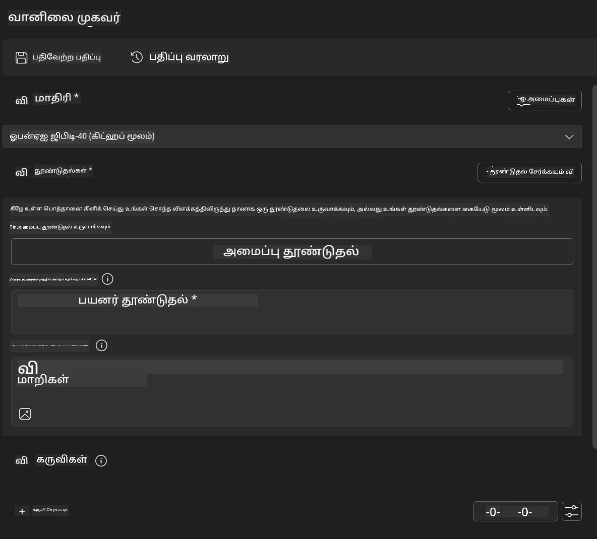
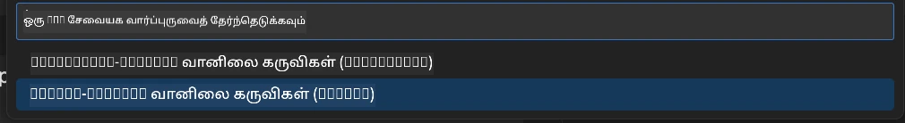
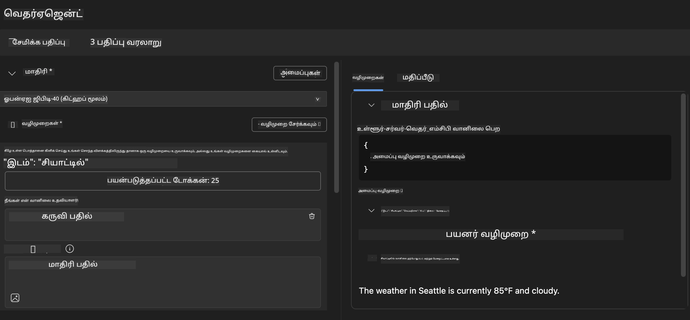
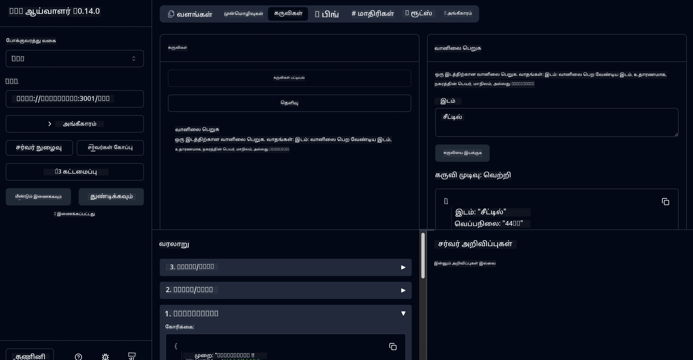

# 🔧 தொகுதி 3: மைக்ரோசாஃப்ட் ஃபவுண்ட்ரி கருவி தொகுப்புடன் மேம்பட்ட MCP மேம்பாடு

> [!NOTE]
> இந்த ஆய்வகத்தில் உள்ள ஆய்வுப் பார்வையாளர் URL-கள் பழமையான `/sse` இறுதிச் செல்லுபடியைப் பயன்படுத்து, மற்றும் பின்வற்றப்பட்ட MCP SDK `1.9.3` மற்றும் ஆய்வுப் பார்வையாளர் `0.14.0` சார்புகளை இலக்காகக் கொள்கின்றன. இவை தற்போதைய `2026-07-28` ஸ்ட்ரீமபிள் HTTP உதாரணங்கள் அல்ல.


## 🎯 கற்றல் குறிக்கோள்கள்

இந்த ஆய்வகத்தின் முடிவில், நீங்கள் முடிந்துவிடுவீர்கள்:

- ✅ மைக்ரோசாஃப்ட் ஃபவுண்ட்ரி கருவி தொகுப்பைப் பயன்படுத்தி தனிப்பயன் MCP சர்வர்களை உருவாக்க
- ✅ சமீபத்திய MCP பைதான் SDK (v1.9.3) ஐ கட்டமைத்து பயன்படுத்த
- ✅ பிழைத்திருத்தம் செய்வதற்காக MCP ஆய்வுப் பார்வையாளரை அமைத்து பயன்படுத்த
- ✅ முகவர் கட்டுமான மற்றும் ஆய்வுப் பார்வையாளர் சூழல்களில் MCP சர்வர்களை பிழைத்திருத்தத்தை செய்ய
- ✅ மேம்பட்ட MCP சர்வர் மேம்பாட்டு பணிவழிகளைப் புரிந்துகொள்ள

## 📋 முன் தேவைகள்

- ஆய்வகம் 2 (MCP அடிப்படைகள்) முடித்திருத்தல்
- மைக்ரோசாஃப்ட் ஃபவுண்ட்ரி கருவி தொகுப்பு விரிவாக்கம் நிறுவப்பட்ட VS கோட்
- பைதான் 3.10+ சுற்றுச்சூழல்
- ஆய்வுப் பார்வையாளர் அமைப்பிற்கு நோட்.ஜெஸ் மற்றும் npm

## 🏗️ நீங்கள் உருவாக்கப்போகின்றது

இந்த ஆய்வகத்தில், நீங்கள் உருவாக்கப்போகும் **வெதர்மேன் MCP சர்வர்** இது:
- தனிப்பயன் MCP சர்வர் அமல்படுத்தல்
- மைக்ரோசாஃப்ட் ஃபவுண்ட்ரி கருவி தொகுப்பு முகவர் கட்டுமானத்துடன் ஒருங்கிணைப்பு
- தொழில்முறை பிழைத்திருத்த பணிவழிகள்
- நவீன MCP SDK பயன்பாட்டு முறைகள்

---

## 🔧 முக்கிய கூறுகள் மேலோட்டம்

### 🐍 MCP பைதான் SDK
மாடல் உள்ளடக்க நடைமுறை பைதான் SDK தனிப்பயன் MCP சர்வர்களை உருவாக்க அடித்தளத்தை வழங்குகிறது. நீங்கள் பதிப்பு 1.9.3 ஐ மேம்பட்ட பிழைத்திருத்த திறன்களுடன் பயன்படுத்துவீர்கள்.

### 🔍 MCP ஆய்வுப் பார்வையாளர்
சக்திவாய்ந்த பிழைத்திருத்த கருவி இது வழங்குகிறது:
- நேரடி சர்வர் கண்காணிப்பு
- கருவி செயல்படுத்தல் காட்சிமுறை
- நெட்வொர்க் கோரிக்கை/பதில் ஆய்வு
- இடைமுக சோதனை சூழல்

---

## 📖 படி படி நடைமுறை

### படி 1: முகவர் கட்டுமானத்தில் WeatherAgent உருவாக்குக

1. **Microsoft Foundry Toolkit விரிவாக்கமாக VS Code இல் முகவர் கட்டுமானத்தை தொடங்கு**
2. **புதிய முகவராக உருவாக்குக** பின்வரும் படிவத்துடன்:
   - முகவர் பெயர்: `WeatherAgent`



### படி 2: MCP சர்வர் திட்டத்தை தொடங்குக

1. **முகவர் கட்டுமானத்தில் கருவிகளை** → **கருவி சேர்க்க** செல்லவும்
2. **கிடைக்கும் விருப்பங்களில் "MCP சர்வர்" தேர்வு செய்க**
3. **"புதிய MCP சர்வர் உருவாக்குக" தேர்ந்தெடுக்கவும்**
4. **`python-weather` மாதிரியை தேர்ந்தெடுக்கவும்**
5. **உங்கள் சர்வருக்கு பெயர் வை:** `weather_mcp`



### படி 3: திட்டத்தை திறந்து பரிசீலிக்கவும்

1. **உருவாக்கப்பட்ட திட்டத்தை VS Code இல் திறக்கவும்**
2. **திட்ட அமைப்பைக் காணவும்:**
   ```
   weather_mcp/
   ├── src/
   │   ├── __init__.py
   │   └── server.py
   ├── inspector/
   │   ├── package.json
   │   └── package-lock.json
   ├── .vscode/
   │   ├── launch.json
   │   └── tasks.json
   ├── pyproject.toml
   └── README.md
   ```

### படி 4: சமீபத்திய MCP SDK க்கு மேம்படுத்து

> **🔍 ஏன் மேம்படுத்த?** மேம்பட்ட அம்சங்களுக்கும் சிறந்த பிழைத்திருத்த திறன்களுக்காக சமீபத்திய MCP SDK (v1.9.3) மற்றும் ஆய்வுபார்வையாளர் சேவை (0.14.0) களைப் பயன்படுத்த விரும்புகிறோம்.

#### 4a. பைதான் சார்புகளை புதுப்பிக்கவும்

**`pyproject.toml` ஐத் திருத்தவும்:** [./code/weather_mcp/pyproject.toml](../../../../10-StreamliningAIWorkflowsBuildingAnMCPServerWithAIToolkit/lab3/code/weather_mcp/pyproject.toml) இனை புதுப்பிக்கவும்


#### 4b. ஆய்வுப் பார்வையாளர் கட்டமைப்பை மேம்படுத்தவும்

**`inspector/package.json` ஐத் திருத்தவும்:** [./code/weather_mcp/inspector/package.json](../../../../10-StreamliningAIWorkflowsBuildingAnMCPServerWithAIToolkit/lab3/code/weather_mcp/inspector/package.json) இனை புதுப்பிக்கவும்

#### 4c. ஆய்வுப் பார்வையாளர் சார்புகளை மேம்படுத்தவும்

**`inspector/package-lock.json` ஐத் திருத்தவும்:** [./code/weather_mcp/inspector/package-lock.json](../../../../10-StreamliningAIWorkflowsBuildingAnMCPServerWithAIToolkit/lab3/code/weather_mcp/inspector/package-lock.json) இனை புதுப்பிக்கவும்

> **📝 குறிப்பு:** இந்த கோப்பு விரிவான சார்பு விளக்கங்களை கொண்டுள்ளது. கீழே அடிப்படையான அமைப்பு கொடுக்கப்பட்டுள்ளது - முழு உள்ளடக்கம் சரியான சார்பு தீர்மானத்தைக் காப்பாற்றுகிறது.


> **⚡ முழு தொகுப்பு பூட்டு:** முழு package-lock.json ~3000 வரிசைகள் சார்பு விளக்கங்களைக் கொண்டுள்ளது. மேல் கூறியவை முக்கிய அமைப்பு - முழுமையான தீர்மானத்திற்கு வழங்கப்பட்ட கோப்பைப் பயன்படுத்தவும்.

### படி 5: VS Code பிழைத்திருத்த அமைப்புகளை கட்டமைக்கவும்

*குறிப்பு: குறிப்பிட்ட பாதையில் உள்ள கோப்பை உள்ளூர் கோப்பை மாற்றி நகலெடுக்கவும்*

#### 5a. தொடக்க கட்டமைப்பை புதுப்பிக்கவும்

**`.vscode/launch.json` ஐத் திருத்தவும்:**

```json
{
  "version": "0.2.0",
  "configurations": [
    {
      "name": "Attach to Local MCP",
      "type": "debugpy",
      "request": "attach",
      "connect": {
        "host": "localhost",
        "port": 5678
      },
      "presentation": {
        "hidden": true
      },
      "internalConsoleOptions": "neverOpen",
      "postDebugTask": "Terminate All Tasks"
    },
    {
      "name": "Launch Inspector (Edge)",
      "type": "msedge",
      "request": "launch",
      "url": "http://localhost:6274?timeout=60000&serverUrl=http://localhost:3001/sse#tools",
      "cascadeTerminateToConfigurations": [
        "Attach to Local MCP"
      ],
      "presentation": {
        "hidden": true
      },
      "internalConsoleOptions": "neverOpen"
    },
    {
      "name": "Launch Inspector (Chrome)",
      "type": "chrome",
      "request": "launch",
      "url": "http://localhost:6274?timeout=60000&serverUrl=http://localhost:3001/sse#tools",
      "cascadeTerminateToConfigurations": [
        "Attach to Local MCP"
      ],
      "presentation": {
        "hidden": true
      },
      "internalConsoleOptions": "neverOpen"
    }
  ],
  "compounds": [
    {
      "name": "Debug in Agent Builder",
      "configurations": [
        "Attach to Local MCP"
      ],
      "preLaunchTask": "Open Agent Builder",
    },
    {
      "name": "Debug in Inspector (Edge)",
      "configurations": [
        "Launch Inspector (Edge)",
        "Attach to Local MCP"
      ],
      "preLaunchTask": "Start MCP Inspector",
      "stopAll": true
    },
    {
      "name": "Debug in Inspector (Chrome)",
      "configurations": [
        "Launch Inspector (Chrome)",
        "Attach to Local MCP"
      ],
      "preLaunchTask": "Start MCP Inspector",
      "stopAll": true
    }
  ]
}
```

**`.vscode/tasks.json` ஐத் திருத்தவும்:**

```
{
  "version": "2.0.0",
  "tasks": [
    {
      "label": "Start MCP Server",
      "type": "shell",
      "command": "python -m debugpy --listen 127.0.0.1:5678 src/__init__.py sse",
      "isBackground": true,
      "options": {
        "cwd": "${workspaceFolder}",
        "env": {
          "PORT": "3001"
        }
      },
      "problemMatcher": {
        "pattern": [
          {
            "regexp": "^.*$",
            "file": 0,
            "location": 1,
            "message": 2
          }
        ],
        "background": {
          "activeOnStart": true,
          "beginsPattern": ".*",
          "endsPattern": "Application startup complete|running"
        }
      }
    },
    {
      "label": "Start MCP Inspector",
      "type": "shell",
      "command": "npm run dev:inspector",
      "isBackground": true,
      "options": {
        "cwd": "${workspaceFolder}/inspector",
        "env": {
          "CLIENT_PORT": "6274",
          "SERVER_PORT": "6277",
        }
      },
      "problemMatcher": {
        "pattern": [
          {
            "regexp": "^.*$",
            "file": 0,
            "location": 1,
            "message": 2
          }
        ],
        "background": {
          "activeOnStart": true,
          "beginsPattern": "Starting MCP inspector",
          "endsPattern": "Proxy server listening on port"
        }
      },
      "dependsOn": [
        "Start MCP Server"
      ]
    },
    {
      "label": "Open Agent Builder",
      "type": "shell",
      "command": "echo ${input:openAgentBuilder}",
      "presentation": {
        "reveal": "never"
      },
      "dependsOn": [
        "Start MCP Server"
      ],
    },
    {
      "label": "Terminate All Tasks",
      "command": "echo ${input:terminate}",
      "type": "shell",
      "problemMatcher": []
    }
  ],
  "inputs": [
    {
      "id": "openAgentBuilder",
      "type": "command",
      "command": "ai-mlstudio.agentBuilder",
      "args": {
        "initialMCPs": [ "local-server-weather_mcp" ],
        "triggeredFrom": "vsc-tasks"
      }
    },
    {
      "id": "terminate",
      "type": "command",
      "command": "workbench.action.tasks.terminate",
      "args": "terminateAll"
    }
  ]
}
```


---

## 🚀 உங்கள் MCP சர்வரை இயக்கு மற்றும் சோதனை செய்க

### படி 6: சார்புகளை நிறுவுக

கட்டமைப்பு மாற்றிய பிறகு, பின்வரும் கட்டளைகளை இயக்கவும்:

**பைதான் சார்புகளை நிறுவுக:**
```bash
uv sync
```

**ஆய்வுப் பார்வையாளர் சார்புகளை நிறுவுக:**
```bash
cd inspector
npm install
```

### படி 7: முகவர் கட்டுமானத்துடன் பிழைத்திருத்தம் செய்க

1. **F5 அழுத்தவும்** அல்லது **"முகவர் கட்டுமானத்தில் பிழைத்திருத்துக"** கட்டமைப்பைப் பயன்படுத்தவும்
2. **பிழைத்திருத்த குழுவில் கூட்டு கட்டமைப்பை தேர்ந்தெடுக்கவும்**
3. **சர்வர் துவங்கவும் முகவர் கட்டுமானத்துடன் திறக்கும் வரை காத்திருக்கவும்**
4. **உங்கள் வெதர்மேன் MCP சர்வரை இயற்கை மொழி கேள்விகளால் சோதிக்கவும்**

இப்படி உள்ளீட்டுப் பார்வை

SYSTEM_PROMPT

```
You are my weather assistant
```

USER_PROMPT

```
How's the weather like in Seattle
```



### படி 8: MCP ஆய்வுப் பார்வையாளருடன் பிழைத்திருத்தம் செய்க

1. **"ஆய்வுப் பார்வையாளரில் பிழைத்திருத்துக"** கட்டமைப்பைப் பயன்படுத்துக (எட்ஜ் அல்லது குரோம்)
2. **`http://localhost:6274` இல் ஆய்வுப்பார்வையாளர் இடைமுகத்தைத் திறக்கவும்**
3. **இணையதள சோதனை சூழலை ஆராய்க:**
   - கிடைக்கும் கருவிகளைக் காண்க
   - கருவி செயல்பாட்டைப் பரிசோதிக்கவும்
   - நெட்வொர்க் கோரிக்கைகளை கண்காணிக்கவும்
   - சர்வர் பதில்களை பிழைத்திருத்தவும்



---

## 🎯 முக்கிய கற்றல் முடிவுகள்

இந்த ஆய்வகத்தை முடித்துவிட்டு, நீங்கள்:

- [x] **மைக்ரோசாஃப்ட் ஃபவுண்ட்ரி கருவி தொகுப்பு மாதிரிகள் மூலம் தனிப்பயன் MCP சர்வரை உருவாக்கியுள்ளீர்கள்**
- [x] **மேம்பட்ட செயல்பாட்டுக்காக சமீபத்திய MCP SDK (v1.9.3) க்கு மேம்படுத்தியுள்ளீர்கள்**
- [x] **முகவர் கட்டுமான மற்றும் ஆய்வுப் பார்வையாளர் இரண்டிற்கும் தொழில்முறை பிழைத்திருத்த பணிவழிகளை கட்டமைத்துள்ளீர்கள்**
- [x] **இணைமுக சர்வர் சோதனைக்கு MCP ஆய்வுப் பார்வையாளரை அமைத்துள்ளீர்கள்**
- [x] **MCP மேம்பாட்டிற்கான VS கோட் பிழைத்திருத்தக் கட்டமைப்புகளை உத்தியோகபூர்வமாக கையாள்ந்துள்ளீர்கள்**

## 🔧 ஆய்வு செய்யப்பட்ட மேம்பட்ட அம்சங்கள்

| அம்சம் | விளக்கம் | பயன்பாட்டு சூழல் |
|---------|-------------|----------|
| **MCP பைதான் SDK v1.9.3** | சமீபத்திய நடைமுறை | நவீன சர்வர் மேம்பாடு |
| **MCP ஆய்வுப் பார்வையாளர் 0.14.0** | இடைமுக பிழைத்திருத்தக் கருவி | நேரடி சர்வர் சோதனை |
| **VS கோட் பிழைத்திருத்தம்** | ஒருங்கிணைந்த மேம்பாட்டு சூழல் | தொழில்முறை பிழைத்திருத்த பணிவழி |
| **முகவர் கட்டுமான ஒருங்கிணைப்பு** | நேரடி மைக்ரோசாஃப்ட் ஃபவுண்ட்ரி கருவி தொகுப்பு இணைப்பு | முழுமையான முகவர் சோதனை |

## 📚 கூடுதல் வளங்கள்

- [MCP பைதான் SDK ஆவணங்கள்](https://modelcontextprotocol.io/docs/sdk/python)
- [Microsoft Foundry Toolkit விரிவாக்க கையேடு](https://code.visualstudio.com/docs/ai/ai-toolkit)
- [VS Code பிழைத்திருத்த ஆவணங்கள்](https://code.visualstudio.com/docs/editor/debugging)
- [மாடல் உள்ளடக்க நடைமுறை குறிப்புகள்](https://modelcontextprotocol.io/docs/concepts/architecture)

---

**🎉 வாழ்த்துக்கள்!** நீங்கள் லேப் 3-ஐ வெற்றிகரமாக முடித்துள்ளீர்கள் மற்றும் தொழில்முறை மேம்பாட்டு பணிவழிகளை பயன்படுத்தி தனிப்பயன் MCP சர்வர்களை உருவாக்கவும், பிழைத்திருத்தவும், வெளியிடவும் முடியும்.

### 🔜 அடுத்த தொகுதிக்குச் செல்லவும்

உங்கள் MCP திறன்களை உண்மையான மேம்பாட்டு பணிவழிக்கு பயன்படுத்த தயார் எனில், **[தொகுதி 4: நடைமுறை MCP மேம்பாடு - தனிப்பயன் GitHub கிளோன் சர்வர்](../lab4/README.md)** க்கு தொடருங்கள், அங்கு நீங்கள்:
- உற்பத்திக்கு தயாரான MCP சர்வரை உருவாக்கி GitHub சேமிப்பக நடவடிக்கைகளை தானியங்க கட்டுப்படுத்துவீர்கள்
- MCP மூலம் GitHub சேமிப்பக கிளோனிங் செயல்பாட்டை நடைமுறைப்படுத்துவீர்கள்
- தனிப்பயன் MCP சர்வர்களை VS கோடு மற்றும் GitHub Copilot முகவரிகள் முறைகளுடன் ஒருங்கிணைத்தீர்கள்
- தனிப்பயன் MCP சர்வர்களை உற்பத்தி சூழல்களில் சோதனை செய்து வெளியிடுவீர்கள்
- மேம்பாட்டாளர்களுக்கான நடைமுறை பணிவழி தானியக்கம் கற்றுக்கொள்வீர்கள்

---

<!-- CO-OP TRANSLATOR DISCLAIMER START -->
**மறுப்பு**:
இந்த ஆவணம் AI மொழிபெயர்ப்பு சேவை [Co-op Translator](https://github.com/Azure/co-op-translator) பயன்படுத்தி மொழிபெயர்க்கப்பட்டுள்ளது. நாங்கள் துல்லியத்திற்காக முயற்சி செய்துள்ளோம், ஆனால் தானாக செய்யப்படும் மொழிபெயர்ப்புகளில் பிழைகள் அல்லது தவறுகள் இருக்கலாம் என்பதை கவனத்தில் கொள்ளவும். அசல் ஆவணம் அதன் தாய்மொழியில் அதிகாரப்பூர்வ ஆதாரமாக கருதப்பட வேண்டும். முக்கியமான தகவல்களுக்கு, தொழில்நுட்பமான மனித மொழிபெயர்ப்பு பரிந்துரைக்கப்படுகிறது. இந்த மொழிபெயர்ப்பைப் பயன்படுத்துவதால் ஏற்படும் எந்த தவறான புரிதல்கள் அல்லது தவறான விளக்கத்திற்கும் நாங்கள் பொறுப்பில்வில்லை.
<!-- CO-OP TRANSLATOR DISCLAIMER END -->