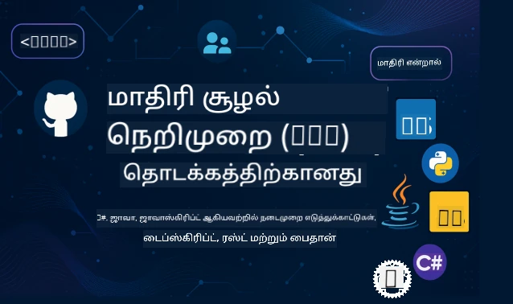

 

[](https://GitHub.com/microsoft/mcp-for-beginners/graphs/contributors)
[](https://GitHub.com/microsoft/mcp-for-beginners/issues)
[](https://GitHub.com/microsoft/mcp-for-beginners/pulls)
[](http://makeapullrequest.com)

[](https://GitHub.com/microsoft/mcp-for-beginners/watchers)
[](https://GitHub.com/microsoft/mcp-for-beginners/fork)
[](https://GitHub.com/microsoft/mcp-for-beginners/stargazers)


[](https://discord.gg/nTYy5BXMWG)

இந்த ஆதாரங்களை பயன்படுத்தத் தொடங்க பின்வரும் படிகளை பின்பற்றவும்:
1. **களஞ்சியத்தை Fork செய்யவும்**: கிளிக் செய்யவும் [](https://GitHub.com/microsoft/mcp-for-beginners/fork)
2. **களஞ்சியத்தை Clone செய்யவும்**:   `git clone https://github.com/microsoft/mcp-for-beginners.git`
3. **இணைந்து கொள்ளவும்** [](https://discord.gg/nTYy5BXMWG)


### 🌐 பன்மொழி ஆதரவு

#### GitHub Action மூலம் ஆதரவு (தானாகவும் எப்போதும் புதுப்பிக்கப்பட்டதும்)

<!-- CO-OP TRANSLATOR LANGUAGES TABLE START -->
[Arabic](../ar/README.md) | [Bengali](../bn/README.md) | [Bulgarian](../bg/README.md) | [Burmese (Myanmar)](../my/README.md) | [Chinese (Simplified)](../zh-CN/README.md) | [Chinese (Traditional, Hong Kong)](../zh-HK/README.md) | [Chinese (Traditional, Macau)](../zh-MO/README.md) | [Chinese (Traditional, Taiwan)](../zh-TW/README.md) | [Croatian](../hr/README.md) | [Czech](../cs/README.md) | [Danish](../da/README.md) | [Dutch](../nl/README.md) | [Estonian](../et/README.md) | [Finnish](../fi/README.md) | [French](../fr/README.md) | [German](../de/README.md) | [Greek](../el/README.md) | [Hebrew](../he/README.md) | [Hindi](../hi/README.md) | [Hungarian](../hu/README.md) | [Indonesian](../id/README.md) | [Italian](../it/README.md) | [Japanese](../ja/README.md) | [Kannada](../kn/README.md) | [Korean](../ko/README.md) | [Lithuanian](../lt/README.md) | [Malay](../ms/README.md) | [Malayalam](../ml/README.md) | [Marathi](../mr/README.md) | [Nepali](../ne/README.md) | [Nigerian Pidgin](../pcm/README.md) | [Norwegian](../no/README.md) | [Persian (Farsi)](../fa/README.md) | [Polish](../pl/README.md) | [Portuguese (Brazil)](../pt-BR/README.md) | [Portuguese (Portugal)](../pt-PT/README.md) | [Punjabi (Gurmukhi)](../pa/README.md) | [Romanian](../ro/README.md) | [Russian](../ru/README.md) | [Serbian (Cyrillic)](../sr/README.md) | [Slovak](../sk/README.md) | [Slovenian](../sl/README.md) | [Spanish](../es/README.md) | [Swahili](../sw/README.md) | [Swedish](../sv/README.md) | [Tagalog (Filipino)](../tl/README.md) | [Tamil](./README.md) | [Telugu](../te/README.md) | [Thai](../th/README.md) | [Turkish](../tr/README.md) | [Ukrainian](../uk/README.md) | [Urdu](../ur/README.md) | [Vietnamese](../vi/README.md)

> **உங்கள் கணினியில் உள்ளே Clone செய்ய விரும்புகிறீர்களா?**
>
> இந்த களஞ்சியம் 50+ மொழி மொழிபெயர்ப்புகளை கொண்டுள்ளது, இது பதிவிறக்க அளவை பெரிதாக அதிகரிக்கிறது. மொழிபெயர்ப்புகள் இல்லாமல் Clone செய்ய sparse checkout பயன்படுத்தவும்:
>
> **Bash / macOS / Linux:**
> ```bash
> git clone --filter=blob:none --sparse https://github.com/microsoft/mcp-for-beginners.git
> cd mcp-for-beginners
> git sparse-checkout set --no-cone '/*' '!translations' '!translated_images'
> ```
>
> **CMD (Windows):**
> ```cmd
> git clone --filter=blob:none --sparse https://github.com/microsoft/mcp-for-beginners.git
> cd mcp-for-beginners
> git sparse-checkout set --no-cone "/*" "!translations" "!translated_images"
> ```
>
> இது உங்கள் கற்கையை முடிக்க தேவையான அனைத்தையும் இலகுவான பதிவிறக்கத்துடன் தரும்.
<!-- CO-OP TRANSLATOR LANGUAGES TABLE END -->

# 🚀 மாடல் கான்டெக்ஸ்ட் புரோ டோக் காலம் (MCP) புதியவர்களுக்கு பாடத்திட்டம்

## **C#, Java, JavaScript, Rust, Python, மற்றும் TypeScript இல் கைபயிற்சி குறியீட்டு உதாரணங்களுடன் MCP கற்றுக் கொள்ளவும்**

## 🧠 மாடல் கான்டெக்ஸ்ட் புரோ டோக் காலம் பாடத்திட்டத்தின் ஆய்வு  
மாடல் கான்டெக்ஸ்ட் புரோ டோக்கலுக்கான உங்கள் பயணத்திற்கு வரவேற்கிறோம்! AI பயன்பாடுகள் வேறுபட்ட கருவிகள் மற்றும் சேவைகளுடன் எவ்வாறு தொடர்பு கொள்கின்றன என்று நீங்கள் எப்போதாவது யோசித்திருந்தால், இங்கு மென்பொருள் உருவாக்கிகள் நுண்ணறிவு அமைப்புகளை உருவாக்கும் முறையை மாற்றும் அழகான தீர்வை நீங்கள் கண்டுபிடிக்கப்போகிறீர்கள்.

MCP என்பதை AI பயன்பாடுகளுக்கான ஒரு சர்வதேச மொழிபெயர்ப்பாளராக சிந்தியுங்கள் - USB போர்ட்கள் எந்த சாதனத்தையும் உங்கள் கணினியுடன் இணைக்க உதவுவது போல, MCP AI மாதிரிகள் ஏதாவது ஒரு கருவி அல்லது சேவையுடன் ஒரே வழியில் இணைக்க உதவுகிறது. நீங்கள் உங்கள் முதல் chatbot ஐ உருவாக்குகிறீர்களோ அல்லது சிக்கலான AI வேலைசூழலை உருவாக்குகிறீர்களோ என்றாலும், MCP ஐப் பற்றிய அறிவு உங்களுக்கு சிறந்த மற்றும் நெகிழ்வான பயன்பாடுகளை உருவாக்கும் சக்தியை வழங்கும்.

இந்த பாடத்திட்டம் உங்கள் கற்றல் பயணத்திற்கு பொறுமையும் கவனத்துடனும் வடிவமைக்கப்பட்டுள்ளது. நீங்கள் ஏற்கனவே புரிந்து கொண்ட எளிய கருத்துக்களுடன் தொடங்கி, உங்கள் விருப்பமான நிரல்முறை மொழியில் கைபயிற்சி மூலம் உங்கள் திறமையை மெதுவே மேம்படுத்துவோம். ஒவ்வொரு படியும் தெளிவான விளக்கங்கள், நடைமுறை உதாரணங்கள் மற்றும் அதிர்ஷ்டப் பெருக்குகளை கொண்டிருக்கும்.

இந்த பயணத்தை முடிக்கும் போது, நீங்கள் உங்கள் சொந்த MCP சேவையகங்களை உருவாக்குவதற்கான தைரியத்தையும், பிரபல AI தளங்களுடன் ஒருங்கிணைப்பதையும், இந்த தொழில்நுட்பம் AI வளர்ச்சியின் எதிர்காலத்தை எப்படி மாற்றி அமைக்குகிறது என்பதைப் புரிந்துகொள்ளுங்கள். இம் ஐச гурலான பயணத்தை நாம் ஆரம்பிப்போம்!

### அதிகாரபூர்வ ஆவணங்கள் மற்றும் விவரக்குறிப்புகள்

இந்த பாடத்திட்டம் **MCP விவரக்குறிப்பு 2025-11-25** (அதிகபட்ச நிலையான வெளியீடு) உடன் ஒத்துப்போகிறது. MCP விவரக்குறிப்பு தேதி அடிப்படையிலான பதிப்பு கண்காணிப்பை (YYYY-MM-DD வடிவில்) உபயோகிக்கிறது.

உங்கள் புரிதல் வளர்ந்தால் இவை இன்னும் விலைமதிப்புள்ளவை ஆகின்றன, ஆனால் உடனடியாக எல்லாவற்றையும் படிக்க வேண்டிய அழுத்தத்தில் இருக்க வேண்டாம். உங்கள் அதிகம் ஆர்வமான பகுதிகளிலிருந்து தொடங்கவும்!
- 📘 [MCP ஆவணம்](https://modelcontextprotocol.io/) – படிப்பதற்கும் பயனர் வழிகாட்டிகளுக்கும் இது உங்களுக்கு முதன்மை ஆதாரம். இத்தொகுப்பு புதியவர்களுக்கு எளிமையாக எழுதப்பட்டுள்ளது, நீங்கள் உங்கள் சொந்த வேகத்தில் பின்தொடர ஏற்ற உதாரணங்களைக் கொண்டுள்ளது.
- 📜 [MCP விவரக்குறிப்பு](https://modelcontextprotocol.io/specification/2025-11-25) – இதை உங்கள் விரிவான குறிப்பு நூலாக கருதி, பாடத்திட்டத்துடன் வேலை செய்வதற்குப் பிறகு குறிப்பிட்ட விவரங்களையும் முன்னேற்ற அம்சங்களையும் இங்கு திரும்பி பார்க்கலாம்.
- 📜 [MCP விவரக்குறிப்பு பதிப்பு தகவல்](https://modelcontextprotocol.io/specification/versioning) – இது புரோ டோக் கால வரலாறு மற்றும் MCP எப்படி தேதி அடிப்படையிலான பதிப்பு (YYYY-MM-DD) பயன்படுத்துகிறது என்பதைக் கூறுகிறது.
- 🧑‍💻 [MCP GitHub களஞ்சியம்](https://github.com/modelcontextprotocol) – இதில் பல நிரல்முறை மொழிகளில் SDK கள், கருவிகள் மற்றும் குறியீட்டு உதாரணங்கள் கிடைக்கின்றன. நடைமுறை உதாரணங்களும் தயாராக பயன்படுத்தும் கூறுகளும் கிடைக்கும் நீட்சியான களஞ்சியம் போல உள்ளது.
- 🌐 [MCP சமூகக் குழு](https://github.com/orgs/modelcontextprotocol/discussions) – MCP பற்றி மாணவரும் அனுபவமிக்க மென்பொருள் உருவாக்கிகளும் கலந்துரையாடும் குழுவில் சேரவும். கேள்விகள் வரவேற்கப்பட்டு அறிவு சுதந்திரமாக பகிரப்படுகிறது.

## கற்கும் நோக்கங்கள்

இந்த பாடத்திட்டத்தை முடித்தபோது, உங்கள் புதிய திறமைகள் குறித்து நீங்கள் நம்பிக்கையோடும் உற்சாகத்தோடும் இருப்பீர்கள். இதோ நீங்கள் அடைவதற்கானவை:

• **MCP அடிப்படைகளை புரிந்துகொள்ளுதல்**: மாடல் கான்டெக்ஸ்ட் புரோ டோக் என்னும் பொருள், அது எதற்கு உயிரோட்டமானது என்பதைக் கூர்ந்து புரிந்துகொள்வீர்கள், அதனை ஒப்பிடல்கள் மற்றும் உதாரணங்களுடன் தெளிவாக அறிந்து கொள்வீர்கள்.

• **முதலாவது MCP சேவையகத்தை உருவாக்குதல்**: உங்கள் விருப்பமான நிரல்முறை மொழியில் எளிய உதாரணங்களுடன் செயல்படும் MCP சேவையகத்தை படிப்படியாக உருவாக்குவீர்கள்.

• **AI மாதிரிகளை உண்மையான கருவிகளுடன் இணைத்தல்**: AI மாதிரிகள் மற்றும் உண்மையான சேவைகள் இடையேயான இடைப்பட்டத்தைப் புரிந்து கொள்ளுங்கள், உங்கள் பயன்பாடுகளுக்கு புதிய சக்திகளை வழங்குங்கள்.

• **பாதுகாப்பு சிறந்த நடைமுறைகளை அமல்படுத்துதல்**: உங்கள் MCP செயல்பாடுகளை பாதுகாப்பாகவும் நம்பகமாகவும் வைத்துக்கொள்ள எப்படி செய்வது என்பதைக் கற்றுக் கொள்கின்றீர்கள், உங்கள் பயன்பாடுகளும் பயனாளர்களும் பாதுகாக்கப்படுவார்கள்.

• **நம்பிக்கையுடன் கடவுச்செய்**: வளர்ச்சியிலிருந்து தயாரிப்பிற்கு உங்கள் MCP திட்டங்களை எவ்வாறு கொண்டு செல்ல வலைப்பின்னலான நடைமுறைகளையும் அறிந்து கொள்வீர்கள்.

• **MCP சமூகத்தில் இணைவதற்கு**: AI பயன்பாட்டு வளர்ச்சியின் எதிர்காலத்தை வடிவமைக்கும் மென்பொருள் உருவாக்கிகளின் வளர்ந்து வரும் சமூகத்தில் நீங்கள் இணைகின்றீர்கள்.

## அவசியமான பின்னணி

MCP குறிப்புகளுக்குள் இறங்குவதற்கு முன், சில அடிப்படை கருத்துக்களில் நீங்கள் நன்றாய் புரிந்துகொண்டிருக்க வேண்டும். இதில் நிபுணர் அல்லாதவராக இருந்தாலும் கவலைப்பட வேண்டாம் - நாம் செல்லும் பொழுது தேவையான அனைத்தையும் விளக்கும்!

### புரோ டோக் கால்களைப் புரிதல் (அடித்தளம்)

ஒரு புரோ டோக் என்பது ஒரு உரையாடலுக்கான விதிகள் ஒரு தொகுப்பு போல. நீங்கள் ஒரு நண்பரை அழைக்கும் பொழுது, நீங்கள் இருவரும் "ஹலோ" என்று சொல்லிக் கொண்டாட்டுவீர்கள், பேச சுழற்சி எடுத்து, முடிந்த போது "அரோடு" என்று கூறுவீர்கள். கணினி திட்டங்களும் இதுபோன்ற விதிகள் தேவைப்படுகின்றன பயனுள்ள தொடர்புக்காக.

MCP என்பது ஒரு புரோ டோக் — AI மாதிரிகள் மற்றும் பயன்பாடுகள் கருவிகள், சேவைகளுடன் விளைவான "உரையாடல்கள்" நடக்க ஆவணமாகும் விதிகளின் தொகுப்பு. மனிதர்களின் உரையாடல் எளிதாக்க விதிகள் இருப்பது போல், MCP AI பயன்பாட்டு தொடர்பைக் குலைக்காமல் நம்பகமாகவும் சக்திவாய்ந்ததாகவும் மாற்றுகிறது.

### கிளையன்ட்-சேவையகம் உறவுகள் (திட்டங்கள் எப்படி ஒருங்கிணைகின்றன)

நீங்கள் தினமும் கிளையன்ட்-சேவையகம் உறவுகளைப் பயன்படுத்துகிறீர்கள்! நீங்கள் ஒரு வலை உலாவியை (கிளையன்ட்) பயன்படுத்தி ஒரு தளம் பார்ப்பதற்குப் போது, ஒரு வலை சேவையகம் உள்நுழைந்து உங்களுக்கு பக்கம் உள்ளடக்கத்தை அனுப்புகிறது. உலாவி தகவலை கேட்க அறிவு உண்டு, சேவையகம் எப்படி பதிலளிக்க வேண்டும் தெரியிறது.

MCP இல் இதேபோல் உறவு உள்ளது: AI மாதிரிகள் கிளையன்ட்களாக செயல்பட்டு தகவல் அல்லது நடவடிக்கைகளை கோருகிறார்கள், MCP சேவையகங்கள் அவற்றிற்கு திறன்களை வழங்குகின்றன. இது ஒரு உதவியாளன் (சேவையகம்) போல, AI குறிப்பிட்ட பணிகளை செய்ய கேட்க முடியும்.

### தரநிலை நிர்ணயம் ஏன் முக்கியம் (வस्तువுகள் ஒன்றுசேரச் செய்வது)

ஒவ்வொரு கார் உற்பத்தியாளரும் வெவ்வேறு வடிவமைப்பிலான எரிவாயு சுரங்கங்களைப் பயன்படுத்தினால், ஒவ்வொரு கைக்குத் தனி அடாப்ப்டர்கூட வேண்டும்! தரநிலை நிர்ணயம் என்பது பொதுவான அணுகுமுறைகளை ஒப்புக்கொண்டு ஒன்றுசேரச் செய்வதை உறுதிப்படுத்துகிறது.

MCP AI பயன்பாடுகளுக்கு இந்த தரநிலையை வழங்குகிறது. ஒவ்வொரு AI மாதிரி தனிப்பட்ட குறியீட்டுடன் எல்லா கருவிகளையும் வேலை செய்ய வேண்டியதில்லை, MCP ஒரு நிறுவியமான வழியை உருவாக்குகிறது. இதனால், மென்பொருள் உருவாக்கிகள் ஒருமுறை கருவிகளை உருவாக்கி பல்வேறு AI அமைப்புகளோடும் வேலை செய்யக் கூடியதாகும்.

## 🧭 உங்கள் கற்றல் பாதை ஆய்வு

உங்கள் MCP பயணம் உங்கள் நம்பிக்கை மற்றும் திறமைகளை படிப்படியாக உருவாக்க கவனமாக வடிவமைக்கப்பட்டுள்ளது. ஒவ்வொரு கட்டமும் புதிய கருத்துக்களை அறிமுகப்படுத்தி, கடந்துபோகும் கணங்களை வலுப்படுத்தும்.

### 🌱 அடித்தளம் கட்டம்: அடிப்படைகளைப் புரிதல் (அலகுகள் 0-2)

இங்கே உங்கள் பயணம் துவங்குகிறது! MCP கருத்துக்களை परिचित ஒப்பீடுகள் மற்றும் எளிய உதாரணங்களுடன் அறிமுகப்படுத்துவோம். MCP என்ன, அது ஏன் தேவையானது, AI வளர்ச்சியின் பெரும் உலகில் அது எப்படி பொருந்துகிறது என்பதைப் புரிந்துகொள்வீர்கள்.

• **அலகு 0 - MCP அறிமுகம்**: MCP என்பது என்ன மற்றும் அது நவீன AI பயன்பாடுகளுக்கு எவ்வளவு முக்கியமானது என்பதை ஆராய்வோம். MCP பிரச்சனைகளை எவ்வாறு தீர்க்கிறது என்பதற்கான அன்றாட உதாரணங்களையும் காண்போம்.

• **அலகு 1 - முக்கிய கருத்துகள் விளக்கம்**: இங்க நீங்கள் MCP இன் அடிப்படை கட்டுமானங்களை கற்றுக்கொள்வீர்கள். ஏராளமான ஒப்பீடுகள் மற்றும் காட்சிப்படுத்தல் உதாரணங்களால் இந்த கருத்துக்கள் இயல்பாகவும் புரிந்துகொள்ளக்கூடியவையாகவும் இருக்கும்.

• **அலகு 2 - MCP இல் பாதுகாப்பு**: பாதுகாப்பு என்பதற்கே பயமில்லாமல் MCP இல் உள்ள கட்டுப்படுத்தல்கள் மற்றும் உங்கள் பயன்பாடுகளை ஆரம்பத்திலிருந்து பாதுகாக்க சிறந்த நடைமுறைகள் பற்றி கற்றுக்கொள்வீர்கள்.

### 🔨 உருவாக்க படி: உங்கள் முதல் செயல்பாடுகளை உருவாக்குதல் (அலகு 3)

இப்போது உண்மையான சுவாரம் தொடங்குகிறது! நீங்கள் உண்மையான MCP சேவையகங்கள் மற்றும் கிளையண்ட்களை உருவாக்கும் கைபயிற்சி அனுபவம் பெறப்போகிறீர்கள். கவலைப்பட வேண்டாம் – எளிதில் துவங்கி ஒவ்வொரு படியும் வழிகாட்டப்படும்.
இந்த தொகுப்பு பல்வேறு பயிற்சித் தூண்டுதல்கள் கொண்டுள்ளது, இது உங்கள் விருப்பமான நிரலாக்க மொழியில் பயிற்சி செய்வதற்கு உதவுகிறது. நீங்கள் உங்கள் முதல் செர்வரை உருவாக்குவீர்கள், அதுடன் இணைக்க ஒரு கிளையண்டை கட்டியெழுப்புவீர்கள், மேலும் VS Code போன்ற பிரபலமான மேம்பாட்டு கருவிகளுடன் ஒருங்கிணைக்கவும் செய்யலாம்.

ஒவ்வொரு வழிகாட்டிலும் முழுமையான குறியீட்டு எடுத்துக்காட்டுகள், பிழைதிருத்துதல் குறிப்புகள், மற்றும் ஏன் குறிப்பிட்ட வடிவமைப்பு தேர்வுகளை செய்தோம் என்பதற்கான விளக்கங்கள் அடங்கும். இந்த கட்டத்தில் முடிவில், நீங்கள் பெருமையடையக்கூடிய செயல்படும் MCP அமலாக்கங்களை பெற்றிருப்பீர்கள்!

### 🚀 வளர்ச்சி கட்டம்: மேம்பட்ட கருத்துகள் மற்றும் உண்மை உலக பயன்பாடு (தொகுதிகள் 4-5)

அடிப்படைகளை சமைத்த பிறகு, நீங்கள் மேம்பட்ட MCP அம்சங்களை ஆராய தயாராக இருக்கிறீர்கள். நாங்கள் நடைமுறை அமலாக்கக் கூட்டு முறைகளை, பிழைத்திருத்த முறைமைகளை, மற்றும் பல்முக AI ஒருங்கிணைப்பு போன்ற முன்னிலை தலைப்புகளை கையாள்வோம்.

மேலும், உற்பத்தி பயன்பாட்டுக்காக உங்கள் MCP அமலாக்கங்களை அளவிடுவது மற்றும் Azure போன்ற மேகம் தளங்களுடன் ஒருங்கிணைப்பது எப்படி என்பதை நீங்கள் கற்பீர்கள். இந்த தொகுதிகள் உண்மையான உலகின் தேவைகளை கையாளக்கூடிய MCP தீர்வுகளை கட்டுவதற்கு உங்களை தயார் செய்கின்றன.

### 🌟 நுட்பம் கட்டம்: சமூக மற்றும் வல்லுநர் மேம்பாடு (தொகுதிகள் 6-11)

இறுதி கட்டம் MCP சமூகத்தில் சேர்வதும் மற்றும் நீங்கள் அதிகம் ஆர்வத்துடன் கூடிய துறைகளில் கடுமையாக சிறப்புப்பார்வை செலுத்துவதும் ஆகும். திறந்த மூல MCP திட்டங்களுக்கு எவ்வாறு பங்களிக்கலாம், மேம்பட்ட அங்கீகாரம் உருவாக்கல் முறைகள் மற்றும் விரிவான தரவுத்தள ஒருங்கிணைந்த தீர்வுகளை உருவாக்குவது எப்படி என்பதைக் கற்கப்போகிறீர்கள்.

மொத்தமாக Module 11 சிறப்பம்சப்படுத்தப்பட வேண்டிய தொகுதி - இது முழுமையான 13 கடை பயிற்சி முழுக்கட்டளை பாதை, PostgreSQL ஒருங்கிணைப்புடன் தயாரிப்பு-தயார MCP செர்வரை கட்டுவதைக் கற்பிக்கும். நீங்கள் கற்றுக்கொண்ட அனைத்தையும் இணைக்கும் ஒரு முக்கியமான திட்டம் போல இது!

### 📚 முழுமையான பாடத்திட்ட அமைப்பு

| தொகுதி | தலைப்பு | விளக்கம் | இணைப்பு |
|--------|-------|-------------|------|
| **தொகுதி 0-3: அடிப்படை知识** | | | |
| 00 | MCP அறிமுகம் | Model Context Protocol பற்றிய overzicht மற்றும் AI குழாய்களில் அவசியம் | [மேலும் வாசிக்கவும்](./00-Introduction/README.md) |
| 01 | மூலக் கருத்துகள் விளக்கம் | MCP மூலக் கருத்துக்களின் விரிவான அணுகுமுறை | [மேலும் வாசிக்கவும்](./01-CoreConcepts/README.md) |
| 02 | MCP பாதுகாப்பு | பாதுகாப்பு அச்சுறுத்தல்கள் மற்றும் சிறந்த நடைமுறைகள் | [மேலும் வாசிக்கவும்](./02-Security/README.md) |
| 03 | MCP அறிமுகம் செய்வது | சூழல் அமைப்பு, அடிப்படை செர்வர்கள்/கிளையண்டுகள், ஒருங்கிணைப்பு | [மேலும் வாசிக்கவும்](./03-GettingStarted/README.md) |
| **தொகுதி 3: உங்கள் முதல் செர்வர் மற்றும் கிளையண்டை கட்டமைத்தல்** | | | |
| 3.1 | முதல் செர்வர் | உங்கள் முதல் MCP செர்வர் உருவாக்குதல் | [வழிகாட்டி](./03-GettingStarted/01-first-server/README.md) |
| 3.2 | முதல் கிளையண்ட் | அடிப்படை MCP கிளையண்டை உருவாக்குதல் | [வழிகாட்டி](./03-GettingStarted/02-client/README.md) |
| 3.3 | LLM உடன் கிளையண்ட் | பெரிய மொழி மாதிரிகளுடன் ஒருங்கிணைத்தல் | [வழிகாட்டி](./03-GettingStarted/03-llm-client/README.md) |
| 3.4 | VS Code ஒருங்கிணைப்பு | MCP செர்வர்களை VS Code இல் பயன்படுத்துதல் | [வழிகாட்டி](./03-GettingStarted/04-vscode/README.md) |
| 3.5 | stdio செர்வர் | stdio போக்குவரத்துடன் செர்வர்கள் உருவாக்குதல் | [வழிகாட்டி](./03-GettingStarted/05-stdio-server/README.md) |
| 3.6 | HTTP இந்தோடுதல் | MCP இல் HTTP உள்ளடக்கம் செயல் படுத்தல் | [வழிகாட்டி](./03-GettingStarted/06-http-streaming/README.md) |
| 3.7 | AI கருவியகம் | MCP உடன் AI கருவியகத்தை பயன்படுத்துதல் | [வழிகாட்டி](./03-GettingStarted/07-aitk/README.md) |
| 3.8 | சோதனை | உங்கள் MCP செர்வர் அமலாக்கத்தை சோதனை செய்தல் | [வழிகாட்டி](./03-GettingStarted/08-testing/README.md) |
| 3.9 | இறக்குமதி | MCP செர்வர்களை உற்பத்திக்கு வீடு கட்டல் | [வழிகாட்டி](./03-GettingStarted/09-deployment/README.md) |
| 3.10 | மேம்பட்ட செர்வர் பயன்பாடு | மேம்பட்ட அம்சங்களுக்கான மேம்பட்ட செர்வர்கள் மற்றும் மேம்பட்ட கட்டமைப்பு பயன்படுத்தல் | [வழிகாட்டி](./03-GettingStarted/10-advanced/README.md) |
| 3.11 | எளிய அங்கீகாரம் | ஆரம்பத்திலும் RBAC உடன் அங்கீகாரத்தை கற்பிக்கும் அத்தியாயம் | [வழிகாட்டி](./03-GettingStarted/11-simple-auth/README.md) |
| 3.12 | MCP ஹோஸ்ட்கள் | Claude Desktop, Cursor, Cline மற்றும் பிற MCP ஹோஸ்ட்களை அமர்த்துதல் | [வழிகாட்டி](./03-GettingStarted/12-mcp-hosts/README.md) |
| 3.13 | MCP ஆய்வகர் | MCP செர்வர்களை ஆய்வு செய்து சோதிப்பதற்கான ஆய்வகர் கருவி | [வழிகாட்டி](./03-GettingStarted/13-mcp-inspector/README.md) |
| 3.14 | மாதிரிப்பதில் | கிளையண்டுடன் ஒத்துழைப்பதற்கான மாதிரிப்பயன்பாடு | [வழிகாட்டி](./03-GettingStarted/14-sampling/README.md) |
| 3.15 | MCP செயலிகள் | MCP செயலிகள் கட்டமைத்தல் | [வழிகாட்டி](./03-GettingStarted/15-mcp-apps/README.md) |
| **தொகுதி 4-5: நடைமுறை & மேம்பட்ட** | | | |
| 04 | நடைமுறை அமலாக்கம் | SDKகள், பிழைத்திருத்தம், சோதனை, மீண்டும் பயன்படுத்தக்கூடிய முன்னோட்ட மாதிரிகள் | [மேலும் வாசிக்கவும்](./04-PracticalImplementation/README.md) |
| 4.1 | பக்கவிளக்கம் | பெரிய முடிவுகளை கர்சர் அடிப்படையிலான பக்கவிளக்கத்துடன் கையாள்தல் | [வழிகாட்டி](./04-PracticalImplementation/pagination/README.md) |
| 05 | MCP இல் மேம்பட்ட தலைப்புகள் | பல்முக AI, அளவீடு, நிறுவன பயன்பாடு | [மேலும் வாசிக்கவும்](./05-AdvancedTopics/README.md) |
| 5.1 | Azure ஒருங்கிணைப்பு | MCP ஐ Azure உடன் ஒருங்கிணைத்தல் | [வழிகாட்டி](./05-AdvancedTopics/mcp-integration/README.md) |
| 5.2 | பல்முகத்தன்மை | பல்வேறு முகங்களுடன் வேலை செய்தல் | [வழிகாட்டி](./05-AdvancedTopics/mcp-multi-modality/README.md) |
| 5.3 | OAuth2 டெமோ | OAuth2 அங்கீகாரத்தை செயல்படுத்துதல் | [வழிகாட்டி](./05-AdvancedTopics/mcp-oauth2-demo/README.md) |
| 5.4 | ரூட் கண்டெக்ஸ்ட்கள் | ரூட் கண்டெக்ஸ்ட்களை புரிந்து கொண்டு செயல்படுத்துதல் | [வழிகாட்டி](./05-AdvancedTopics/mcp-root-contexts/README.md) |
| 5.5 | வழிசெய்தல் | MCP வழிசெய்தல் முறைகள் | [வழிகாட்டி](./05-AdvancedTopics/mcp-routing/README.md) |
| 5.6 | மாதிரிப்பு | MCP இல் மாதிரிப்பு நுட்பங்கள் | [வழிகாட்டி](./05-AdvancedTopics/mcp-sampling/README.md) |
| 5.7 | அளவீடு | MCP அமலாக்கங்களை அளவிடுதல் | [வழிகாட்டி](./05-AdvancedTopics/mcp-scaling/README.md) |
| 5.8 | பாதுகாப்பு | மேம்பட்ட பாதுகாப்பு பரிசீலனைகள் | [வழிகாட்டி](./05-AdvancedTopics/mcp-security/README.md) |
| 5.9 | வலை தேடல் | வலை தேடல் திறன்களை செயல்படுத்துதல் | [வழிகாட்டி](./05-AdvancedTopics/web-search-mcp/README.md) |
| 5.10 | நேரடி ஸ்ட்ரீமிங் | நேரடி ஸ்ட்ரீமிங் செயல்பாட்டை கட்டமைத்தல் | [வழிகாட்டி](./05-AdvancedTopics/mcp-realtimestreaming/README.md) |
| 5.11 | நேரடி தேடல் | நேரடி தேடலை செயல்படுத்தல் | [வழிகாட்டி](./05-AdvancedTopics/mcp-realtimesearch/README.md) |
| 5.12 | எந்திரா ID அங்கீகாரம் | Microsoft Entra ID மூலம் அங்கீகாரம் | [வழிகாட்டி](./05-AdvancedTopics/mcp-security-entra/README.md) |
| 5.13 | Foundry ஒருங்கிணைப்பு | Azure AI Foundry உடன் ஒருங்கிணைத்தல் | [வழிகாட்டி](./05-AdvancedTopics/mcp-foundry-agent-integration/README.md) |
| 5.14 | கண்டெக்ஸ் பொறியியல் | சாதகமான கண்டெக்ஸ் பொறியியல் முறைகள் | [வழிகாட்டி](./05-AdvancedTopics/mcp-contextengineering/README.md) |
| 5.15 | MCP தனிப்பயன் போக்குவரத்து | தனிப்பயன் போக்குவரத்து செயல்படுத்தல்கள் | [வழிகாட்டி](./05-AdvancedTopics/mcp-transport/README.md) |
| 5.16 | முறையியல் அம்சங்கள் | முன்னேற்ற அறிவிப்புகள், நிறுத்தல், வள மாதிரிகள் | [வழிகாட்டி](./05-AdvancedTopics/mcp-protocol-features/README.md) |
| **தொகுதி 6-10: சமூக & சிறந்த நடைமுறைகள்** | | | |
| 06 | சமூக பங்களிப்புகள் | MCP சூழலுக்கு எவ்வாறு பங்களிப்பது | [வழிகாட்டி](./06-CommunityContributions/README.md) |
| 07 | ஆரம்ப ஏற்றுதலிலிருந்து பார்வை | உண்மை உலகின் செயல்பாட்டு கதைகள் | [வழிகாட்டி](./07-LessonsfromEarlyAdoption/README.md) |
| 08 | MCP சிறந்த நடைமுறைகள் | செயல்திறன், தவறு சகிப்புத்தன்மை, மீட்டெடுக்கும் திறன் | [வழிகாட்டி](./08-BestPractices/README.md) |
| 09 | MCP வழக்கு ஆய்வுக்கள் | நடைமுறை செயல்படுத்தல் எடுத்துக்காட்டுகள் | [வழிகாட்டி](./09-CaseStudy/README.md) |
| 10 | கைமுறை பட்டறை | AI கருவியகத்துடன் MCP செர்வர் கட்டமைத்தல் | [பயிற்சி](./10-StreamliningAIWorkflowsBuildingAnMCPServerWithAIToolkit/README.md) |
| **தொகுதி 11: MCP செர்வர் கைமுறை ஆய்வகங்கள்** | | | |
| 11 | MCP செர்வர் தரவுத்தள ஒருங்கிணைப்பு | PostgreSQL ஒருங்கிணைப்புக்கான முழுமையான 13-பாட பயிற்சி பாதை | [பயிற்சிகள்](./11-MCPServerHandsOnLabs/README.md) |
| 11.1 | அறிமுகம் | தரவுத்தள ஒருங்கிணைப்புடன் MCP அறிமுகம் மற்றும் சில்லறை பகுப்பாய்வு பயன்பாடு | [பயிற்சி 00](./11-MCPServerHandsOnLabs/00-Introduction/README.md) |
| 11.2 | அடிப்படை கட்டமைப்பு | MCP செர்வர் கட்டமைப்பு, தரவுத்தளம் அடுக்குகள், மற்றும் பாதுகாப்பு முறைகள் | [பயிற்சி 01](./11-MCPServerHandsOnLabs/01-Architecture/README.md) |
| 11.3 | பாதுகாப்பு & பலவாடி | வரிசை மட்ட பாதுகாப்பு, அங்கீகாரம் மற்றும் பலவாடி தரவுக்கட்டுப்பாடு | [பயிற்சி 02](./11-MCPServerHandsOnLabs/02-Security/README.md) |
| 11.4 | சூழல் அமைப்பு | மேம்பாட்டு சூழல் அமைத்தல், டோக்கர், Azure வளங்கள் | [பயிற்சி 03](./11-MCPServerHandsOnLabs/03-Setup/README.md) |
| 11.5 | தரவுத்தள வடிவமைப்பு | PostgreSQL அமைப்பு, சில்லறை ஸ்கீமா வடிவமைப்பு, மற்றும் மாதிரி தரவு | [பயிற்சி 04](./11-MCPServerHandsOnLabs/04-Database/README.md) |
| 11.6 | MCP செர்வர் அமலாக்கம் | தரவுத்தள ஒருங்கிணைப்புடன் FastMCP செர்வர் கட்டுதல் | [பயிற்சி 05](./11-MCPServerHandsOnLabs/05-MCP-Server/README.md) |
| 11.7 | கருவி மேம்படுத்தல் | தரவுத்தள கேள்வி கருவிகள் மற்றும் ஸ்கீமா ஆராய்ச்சி உருவாக்கல் | [பயிற்சி 06](./11-MCPServerHandsOnLabs/06-Tools/README.md) |
| 11.8 | பொருள் தேடல் | Azure OpenAI மற்றும் pgvector உடன் வெக்டர் நுழக்கங்கள் | [பயிற்சி 07](./11-MCPServerHandsOnLabs/07-Semantic-Search/README.md) |
| 11.9 | சோதனை & பிழைத்திருத்தல் | சோதனை நுட்பங்கள், பிழைத்திருத்தம் கருவிகள் மற்றும் சரிபார்ப்பு முறைகள் | [பயிற்சி 08](./11-MCPServerHandsOnLabs/08-Testing/README.md) |
| 11.10 | VS Code ஒருங்கிணைப்பு | VS Code MCP ஒருங்கிணைப்பு மற்றும் AI உரையாடல் பயன்பாடு அமைத்தல் | [பயிற்சி 09](./11-MCPServerHandsOnLabs/09-VS-Code/README.md) |
| 11.11 | இறக்குமதி திட்டங்கள் | டோக்கர் இறக்குமதி, Azure கன்டெய்னர் செயலிகள், மற்றும் அளவீடு கவனிப்புகள் | [பயிற்சி 10](./11-MCPServerHandsOnLabs/10-Deployment/README.md) |
| 11.12 | கண்காணிப்பு | பயன்பாடு அறிவுரை, பதிவு, செயல்திறன் கண்காணிப்பு | [பயிற்சி 11](./11-MCPServerHandsOnLabs/11-Monitoring/README.md) |
| 11.13 | சிறந்த நடைமுறைகள் | செயல்திறன் மேம்பாடு, பாதுகாப்பு கடுமைப்படுத்தல், மற்றும் உற்பத்தி குறிப்புகள் | [பயிற்சி 12](./11-MCPServerHandsOnLabs/12-Best-Practices/README.md) |

### 💻 மாதிரி குறியீட்டு திட்டங்கள்

MCP கற்றலில் மிகவும் உற்சாகமான பகுதிகளில் ஒன்று உங்கள் குறியீட்டு திறன்கள் வழக்கமாக மேம்படுவது. எங்கள் குறியீட்டு எடுத்துக்காடுகள் எளிமையாக தொடங்கி, உங்கள் புரிதல் ஆழமாகும் போது மேலும் நுட்பமாக மாறுவதாக வடிவமைக்கப்பட்டுள்ளன. கருத்துக்களை நாம் எவ்வாறு அறிமுகப்படுத்துகிறோம் என்றால் - எளிதாக புரியும் ஆனால் உண்மையான MCP கொள்கைகளை வெளிப்படுத்தும் குறியீட்டுடன், இந்த குறியீடு என்ன செய்யிறது என்பதையே அல்லாமல், ஏன் இவ்வாறு கட்டமைக்கப்பட்டது மற்றும் இது பெரிய MCP பயன்பாடுகளில் எவ்வாறு பொருந்துகிறது என்பதையும் நீங்கள் புரிந்துகொள்ளுவீர்கள்.

#### அடிப்படை MCP கணக்கீட்டழகுரு மாதிரிகள்

| மொழி | விளக்கம் | இணைப்பு |
|----------|-------------|------|
| C# | MCP செர்வர் எடுத்துக்காட்டு | [குறியீடு பார்க்க](./03-GettingStarted/samples/csharp/README.md) |
| ஜாவா | MCP கணக்கீட்டழகு | [குறியீடு பார்க்க](./03-GettingStarted/samples/java/calculator/README.md) |
| ஜாவாஸ்கிரிப்ட் | MCP டெமோ | [குறியீடு பார்க்க](./03-GettingStarted/samples/javascript/README.md) |
| பைதான் | MCP செர்வர் | [குறியீடு பார்க்க](../../03-GettingStarted/samples/python/mcp_calculator_server.py) |
| டைப்ஸ்கிரிப்ட் | MCP எடுத்துக்காட்டு | [குறியீடு பார்க்க](./03-GettingStarted/samples/typescript/README.md) |
| ரஸ்ட் | MCP எடுத்துக்காட்டு | [குறியீடு பார்க்க](./03-GettingStarted/samples/rust/README.md) |

#### மேம்பட்ட MCP அமலாக்கங்கள்

| மொழி | விளக்கம் | இணைப்பு |
|----------|-------------|------|
| C# | மேம்பட்ட மாதிரி | [குறியீடு பார்க்க](./04-PracticalImplementation/samples/csharp/README.md) |
| Spring உடன் ஜாவா | கன்டெய்னர் செயலி எடுத்துக்காட்டு | [குறியீடு பார்க்க](./04-PracticalImplementation/samples/java/containerapp/README.md) |
| ஜாவாஸ்கிரிப்ட் | மேம்பட்ட மாதிரி | [குறியீடு பார்க்க](./04-PracticalImplementation/samples/javascript/README.md) |
| பைதான் | சிக்கலான அமலாக்கம் | [குறியீடு பார்க்க](./04-PracticalImplementation/samples/python/README.md) |
| டைப்ஸ்கிரிப்ட் | கன்டெய்னர் மாதிரி | [குறியீடு பார்க்க](./04-PracticalImplementation/samples/typescript/README.md) |


## 🎯 MCP கற்க தேவையான முன்னோடிகள்

இந்த பாடத்திட்டத்திலிருந்து மிக அதிக பயனடைய, நீங்கள் கொண்டிருக்க வேண்டும்:
- குறைந்தது கீழ்காணும் மொழிகளில் ஒன்றில் அடிப்படைக் கற்றல்: C#, Java, JavaScript, Python, அல்லது TypeScript
- கிளையன்ட்-செர்வர் மாடல் மற்றும் APIs பற்றிய புரிதல்
- REST மற்றும் HTTP கொள்கைகளோடு பரிச்சயம்
- (வையரா) AI/ML கொள்கைகளில் பின்னணி

- எங்கள் சமூகவிவாதங்களில் கலந்து கொண்டு ஆதரவாக இருக்கலாம்

## 📚 படிப்புக் கையேடு மற்றும் வளங்கள்

இந்த தொகுப்பு பல வளங்களை உள்ளடக்கியுள்ளது, நீங்கள் பயிற்சி பெற மற்றும் திறம்பட கற்றுக்கொள்ள உதவ:

### படிப்புக் கையேடு

ஒரு விரிவான [படிப்புக் கையேடு](./study_guide.md) இந்த தொகுப்பைப் பயிற்சி பெற உதவ உள்ளது. இந்த பார்வை முறைப் பட்டியல் அனைத்து தலைப்புகளும் எப்படி இணைக்கப்படுகின்றது என்பதை காட்டுகிறது மற்றும் மாதிரி திட்டங்களை எவ்வாறு பயிற்ச்சிக்கு பயன்படுத்துவது என்பதை வழிநடத்துகிறது. நீங்கள் பார்வை மூலம் கற்றுக்கொள்ள விரும்புகிறாரெனில் இது மிகவும் பயனுள்ளது.

கையேடு கொண்டுள்ளது:
- அனைத்து தலைப்புகளையும் காட்டும் பார்வை முறை கட்டமைப்பு
- ஒவ்வொரு தொகுப்பின் விரிவான உட்கூறுகள்
- மாதிரி திட்டங்களை எவ்வாறு பயன்படுத்துவது என்பதை வழிகாட்டல்
- வேறுபட்ட திறன்களுக்கான பரிந்துரைக்கப்பட்ட கற்றல் பாதைகள்
- உங்கள் கற்றல் பயணத்துக்கு கூடுதல் வளங்கள்

### மாற்ற சரிகை

நாம் விரிவான [மாற்ற சரிகை](./changelog.md) பராமரிக்கிறோம், இது பாடத்திட்டப் பொருட்களின் முக்கிய புதுப்பிப்புகளைப் பதிவு செய்கிறது, நீங்கள் சமயம் ஏற்பதற்கு உதவும்.
- புதிய உள்ளடக்கச் சேர்ப்புகள்
- கட்டமைப்பு மாற்றங்கள்
- அம்ச மேம்பாடுகள்
- ஆவண புதுப்பிப்புகள்

## 🛠️ இந்த பாடத்திட்டத்தை திறம்பட பயன்படுத்துவது எப்படி

இந்த கையேட்டின் ஒவ்வொரு பாடமும் உள்ளடக்கியது:

1. MCP கொள்கைகளின் தெளிவான விளக்கங்கள்  
2. பல மொழிகளில் நேரடி குறியீடு உதாரணங்கள்  
3. உண்மையான MCP செயலிகள் உருவாக்கும் பயிற்சிகள்  
4. மேம்பட்ட கற்றலாளர்களுக்கான கூடுதல் வளங்கள்

### C# உடன் MCP கற்றுக்கொள்வோம் - பாடம் தொடர்  
நாம் Model Context Protocol (MCP)-ஐப் பற்றி கற்றுக்கொள்ளப்போகிறோம், இது AI மாதிரிகளுக்கும் கிளையன்ட் செயலிகளுக்கும் இடையேயான தொடர்புகளை விதிமுறைப்படுத்த வடிவமைக்கப்பட்ட முன்னணி கட்டமைப்பு. இந்த துவக்கப்பயிற்சியில், நீங்கள் MCP-ஐ அறிந்து, உங்கள் முதல் MCP சர்வரை உருவாக்க வழிகாட்டுவோம்.  
#### C#: [https://aka.ms/letslearnmcp-csharp](https://aka.ms/letslearnmcp-csharp)  
#### Java: [https://aka.ms/letslearnmcp-java](https://aka.ms/letslearnmcp-java)  
#### JavaScript: [https://aka.ms/letslearnmcp-javascript](https://aka.ms/letslearnmcp-javascript)  
#### Python: [https://aka.ms/letslearnmcp-python](https://aka.ms/letslearnmcp-python)  

## 🎓 உங்கள் MCP பயணம் இன்று என்பது

வாழ்த்துக்கள்! நீங்கள் உங்கள் நிரல்படுத்தல் திறன்களை விரிவுபடுத்தும் மற்றும் AI மேம்பாட்டின் முன்னணி இடத்தில் இணைக்கும் ஒரு சுவாரஸ்யமான பயணத்தின் முதலில் நுழைந்துவிட்டீர்கள்.

### நீங்கள் ஏற்கனவே செய்துள்ள செயல்கள்

இந்த அறிமுகத்தைப் படித்துள்ளதன் மூலம், நீங்கள் ஏற்கனவே உங்கள் MCP அறிவுத் தளத்தை கட்டிக்கொள்ள ஆரம்பித்துள்ளீர்கள். MCP என்னவும், அது ஏன் முக்கியமாகும் என்பதும், இந்த பாடத்திட்டம் உங்கள் கற்றல் பயணத்தை எவ்வாறு ஆதரிக்கும் என்பதும் நீங்கள் புரிந்துள்ளீர்கள். இது ஒரு முக்கிய சாதனை மற்றும் இந்த முக்கிய தொழில்நுட்பத்தில் உங்கள் நிபுணத்துவத்தின் துவக்கம் ஆகும்.

### எதிர்கால அதிரடி

நீங்கள் பாடங்களைக் கடந்து செல்லும்போது, ஒவ்வொரு நிபுணர்களும் ஒருநாள் துவக்கிப்பேன் என்பது நினைவில் வைக்கவும். இப்போது சிக்கலாக தெரிந்த கொள்கைகள் பயிற்சி மற்றும் பயன்பாட்டைப் படுத்தியதும் சாதாரணமாக மாறும். ஒவ்வொரு சிறிய படியும் சக்திவாய்ந்த திறன்களாக ஒன்றுபட்டு உங்கள் மேம்பாட்டு வாழ்க்கையில் உங்களுக்கு உதவும்.

### உங்கள் ஆதரவு நெட்வொர்க்

நீங்கள் MCP பற்றி ஆர்வமுள்ள கற்றலாளர்கள் மற்றும் நிபுணர்கள் கொண்ட சமூகத்துடன் சேர்கிறீர்கள்; அவர்கள் மற்றவர்களின் வெற்றிக்கு உதவ தயாராக உள்ளனர். குறியீட்டு சிக்கலைச் சந்தித்தாலும் அல்லது ஒரு வெற்றி பரிமாறிக்கொள்ள ஆர்வமாக இருந்தாலும், சமூகம் உங்கள் பயணத்திற்கு ஆதரவாக இருக்கிறது.

AI செயலிகள் உருவாக்குவதில் சிக்கல் ஏற்பட்டால் அல்லது கேள்விகள் இருந்தால் MCP பற்றிய விவாதங்களில் மற்ற கற்றலாளர்களுடனும் அனுபவம் உள்ள டெவலப்பர்களுடனும் சேருங்கள். இது கேள்விகள் வரவேற்கப்படும் மற்றும் அறிவு சுதந்திரமாக பகிரப்படும் ஆதரவு சமூகமாகும்.

[](https://discord.gg/nTYy5BXMWG)

உங்கள் தயாரிப்பு பின்னூட்டங்கள் அல்லது பிழைகள் இருந்தால்:

[](https://aka.ms/foundry/forum)

### துவங்க தயாரா?

உங்கள் MCP பயணம் இப்போது தொடங்குகிறது! உங்கள் முதல் MCP அனுபவங்களுக்கு Module 0 உடன் துவங்கவும், அல்லது உங்கள் உருவாக்கப்போகும் மாதிரி திட்டங்களை ஆராயவும். நினைவில் வையுங்கள் - ஒவ்வொரு நிபுணரும் தாங்கள் இப்போது இருக்கிற இடத்தில் துவங்கினர், பொறுமையும் பயிற்சியும் கொண்டு நீங்கள் என்ன சாதிக்க முடியும் என்பதை நீங்கள் ஆச்சரியபடுவீர்கள்.

Model Context Protocol மேம்பாட்டின் உலகிற்குக் கைகொடுக்க வரவேற்கிறோம். ஒன்றாக ஏதாவது அதிசயமான ஒன்றை உருவாக்குவோம்!

## 🤝 கற்றல் சமூகத்திற்கு பங்களிப்பு

இந்த பாடத்திட்டம் உங்கள் போன்ற கற்றலாளர்களிடமிருந்து பெறும் பங்களிப்புகளால் வலுவடைகிறது! நீங்கள் ஒரு எழுத்துப்பிழையைச் சரிசெய்கிறீர்களா, தெளிவான விளக்கத்தை முன்மொழிகிறீர்களா, அல்லது புதிய உதாரணத்தைச் சேர்க்கிறீர்களா, உங்கள் பங்களிப்புகள் பிற புதியவர்கள் வெற்றி பெற உதவும்.

Microsoft மதிப்பிற்குரிய வல்லுநர் [Shivam Goyal](https://www.linkedin.com/in/shivam2003/) அவர்களுக்கு குறியீடு உதாரணங்களை வழங்குவதற்கு நன்றி.

பங்களிப்பு செயல்முறை அன்பாகவும் ஆதரவானதாகவும் வடிவமைக்கப்பட்டுள்ளது. பெரும்பாலான பங்களிப்புகளுக்கு Contributor License Agreement (CLA) தேவைப்படுகிறது, ஆனால் தானியங்கி கருவிகள் உங்களுக்கு இந்த செயல்முறையை எளிதாக்கி வழிநடத்தும்.

## 📜 திறந்த மூல கற்றல்

இந்த முழு பாடத்திட்டமும் MIT [LICENSE](../../LICENSE) உடன் கிடைக்கிறது, அதாவது நீங்கள் அதை பயன்படுத்த, மாற்ற, மற்றும் சுதந்திரமாக பகிர முடியும். இது MCP அறிவை உலகெங்கிலும் டெவலப்பர்களுக்கு அணுகத்தகுந்ததாக ஆக்குவதில் எங்கள் இலக்கை ஆதரிக்கிறது.

## 🤝 பங்களிப்பு வழிகாட்டு முறைகள்

இந்த திட்டம் பங்களிப்புக்கும் பரிந்துரைக்கும் திறந்த சமுகமாகும். பெரும்பாலான பங்களிப்புகள் Contributor License Agreement (CLA) யை ஒப்புக்கொள்ள வேண்டும், அதில் நீங்கள் உங்கள் பங்களிப்பை பயன்படுத்த நாங்கள் உரிமைகள் பெற்றுள்ளோம் என்பதை உறுதிப்படுத்த வேண்டும். விவரங்களுக்கு <https://cla.opensource.microsoft.com> ஐப் பார்வையிடவும்.

நீங்கள் புல் கோரிக்கையை சமர்ப்பிக்கும் போது, CLA பாட்டி உங்கள் CLA தேவையை தானாக அறிவிக்கும் மற்றும் PR-ஐ சரியான முறையில் அலங்கரிக்கும் (மாதிரி, நிலை சரிபார்ப்பு, комментарий). பாட்டி வழங்கும் வழிமுறைகளைப் பின்பற்றுங்கள். இந்த நடவடிக்கையை அனைத்து தொகுப்புகளிலும் ஒருமுறை மட்டுமே செய்யவேண்டும்.

இந்த திட்டம் [Microsoft திறந்த மூல நடத்தைக் கோடுகள்](https://opensource.microsoft.com/codeofconduct/) ஐ ஏற்றுக்கொண்டுள்ளது. மேலும் விவரங்களுக்கு [நடைமுறைக் கேள்வி & பதில்](https://opensource.microsoft.com/codeofconduct/faq/) ஐ பார்க்கவும் அல்லது [opencode@microsoft.com](mailto:opencode@microsoft.com) க்கு தொடர்புகொள்ளவும்.

---

*உங்கள் MCP பயணத்தைத் தொடங்கத் தயார்? [Module 00 - MCP அறிமுகம்](./00-Introduction/README.md) உடன் துவங்கி Model Context Protocol மேம்பாட்டின் உலகுக்குள் உங்கள் முதல் படிகளை எடுக்கவும்!*


## 🎒 மற்ற படிப்புகள்
எங்கள் குழு மற்ற படிப்புகளையும் உருவாக்குகிறது! பார(timeout)்கவும்:

<!-- CO-OP TRANSLATOR OTHER COURSES START -->
### LangChain
[](https://aka.ms/langchain4j-for-beginners)
[](https://aka.ms/langchainjs-for-beginners?WT.mc_id=m365-94501-dwahlin)
[](https://github.com/microsoft/langchain-for-beginners?WT.mc_id=m365-94501-dwahlin)
---

### Azure / Edge / MCP / முகவர்கள்
[](https://github.com/microsoft/AZD-for-beginners?WT.mc_id=academic-105485-koreyst)
[](https://github.com/microsoft/edgeai-for-beginners?WT.mc_id=academic-105485-koreyst)
[](https://github.com/microsoft/mcp-for-beginners?WT.mc_id=academic-105485-koreyst)
[](https://github.com/microsoft/ai-agents-for-beginners?WT.mc_id=academic-105485-koreyst)

---
 
### உருவாக்கும் AI தொடர்
[](https://github.com/microsoft/generative-ai-for-beginners?WT.mc_id=academic-105485-koreyst)
[-9333EA?style=for-the-badge&labelColor=E5E7EB&color=9333EA)](https://github.com/microsoft/Generative-AI-for-beginners-dotnet?WT.mc_id=academic-105485-koreyst)
[-C084FC?style=for-the-badge&labelColor=E5E7EB&color=C084FC)](https://github.com/microsoft/generative-ai-for-beginners-java?WT.mc_id=academic-105485-koreyst)
[-E879F9?style=for-the-badge&labelColor=E5E7EB&color=E879F9)](https://github.com/microsoft/generative-ai-with-javascript?WT.mc_id=academic-105485-koreyst)

---
 
### அடிப்படைக் கற்றல்
[](https://aka.ms/ml-beginners?WT.mc_id=academic-105485-koreyst)
[](https://aka.ms/datascience-beginners?WT.mc_id=academic-105485-koreyst)
[](https://aka.ms/ai-beginners?WT.mc_id=academic-105485-koreyst)
[](https://github.com/microsoft/Security-101?WT.mc_id=academic-96948-sayoung)
[](https://aka.ms/webdev-beginners?WT.mc_id=academic-105485-koreyst)
[](https://aka.ms/iot-beginners?WT.mc_id=academic-105485-koreyst)
[](https://github.com/microsoft/xr-development-for-beginners?WT.mc_id=academic-105485-koreyst)

---
 
### Copilot தொடர்
[](https://aka.ms/GitHubCopilotAI?WT.mc_id=academic-105485-koreyst)
[](https://github.com/microsoft/mastering-github-copilot-for-dotnet-csharp-developers?WT.mc_id=academic-105485-koreyst)
[](https://github.com/microsoft/CopilotAdventures?WT.mc_id=academic-105485-koreyst)
<!-- CO-OP TRANSLATOR OTHER COURSES END -->

---

<!-- CO-OP TRANSLATOR DISCLAIMER START -->
**கவனிக்கை**:  
இந்த ஆவணம் AI மொழிபெயர்ப்பு சேவை [Co-op Translator](https://github.com/Azure/co-op-translator) மூலம் மொழிபெயர்க்கப்பட்டுள்ளது. சிறந்த துல்லியத்திற்காக நாம் முயற்சிக்கும் போது, தானியங்கி மொழிபெயர்ப்புகளில் பிழைகள் அல்லது தவறுகள் இருக்கக்கூடும் என்பதில் தயங்காதீர்கள். அதன் மூல மொழியில் உள்ள அசல் ஆவணம் அதிகாரப்பூர்வ விரிவாக கருதப்பட வேண்டும். முக்கியமான தகவல்களுக்கு, தொழில்முறை மனித மொழிபெயர்ப்பு பரிந்துரைக்கப்படுகிறது. இந்த மொழிபெயர்ப்பின் பயன்பாட்டினால் ஏற்படும் எந்த தவறான புரிதல்கள் அல்லது தவறான விளக்கங்களுக்கு நாம் பொறுப்பாக இருக்கமாட்டோம்.
<!-- CO-OP TRANSLATOR DISCLAIMER END -->